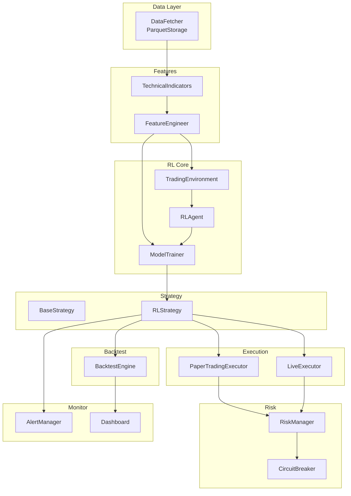
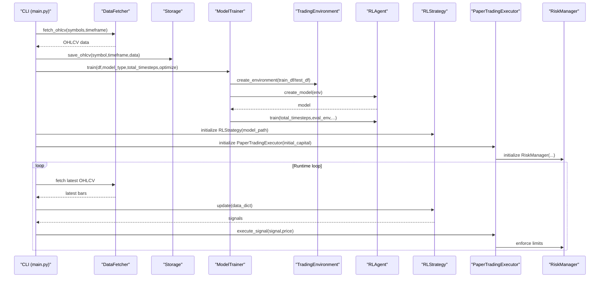
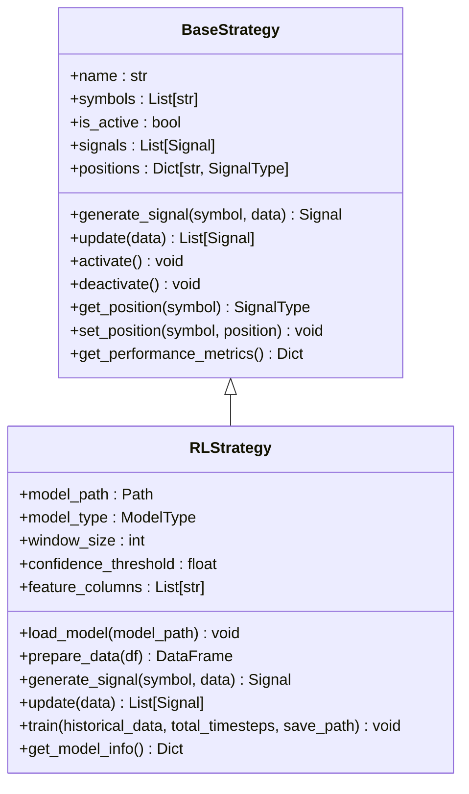
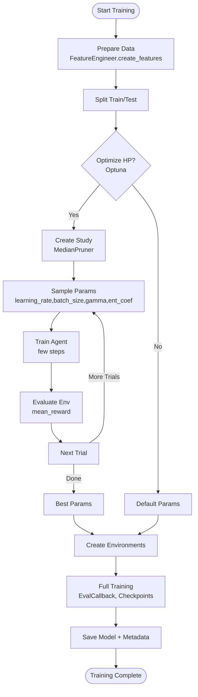
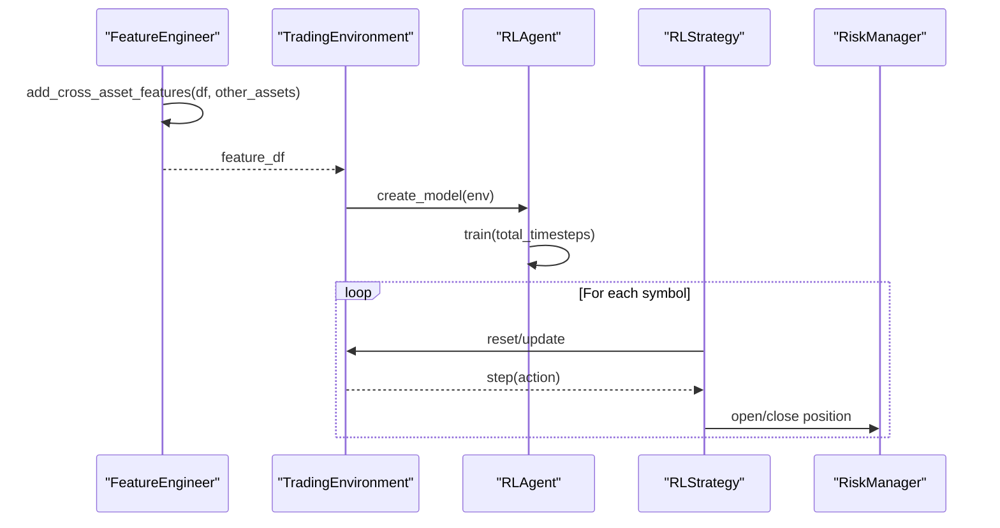
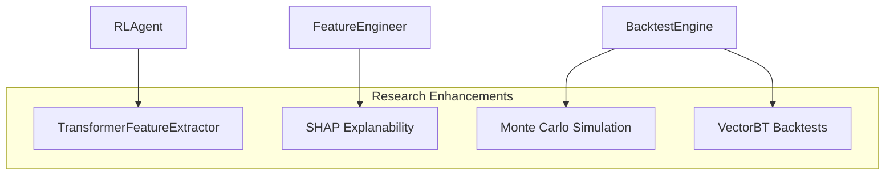
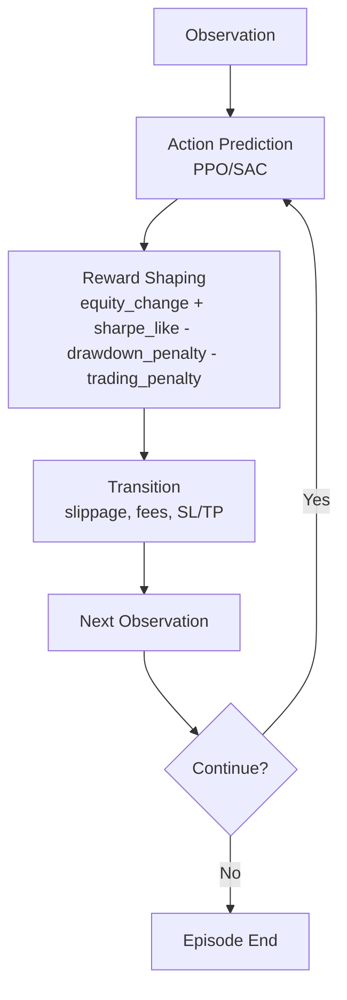
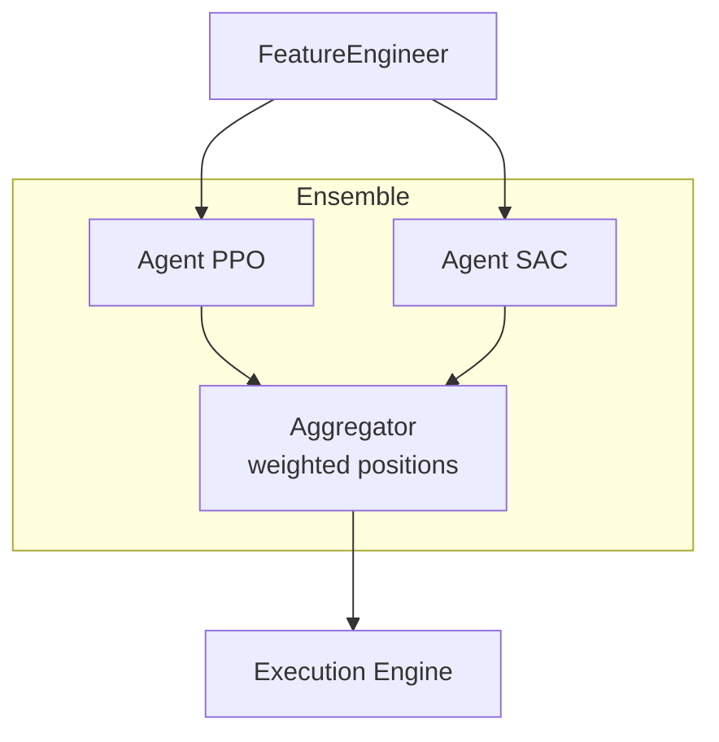
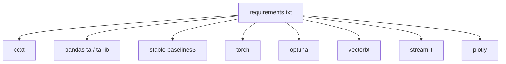
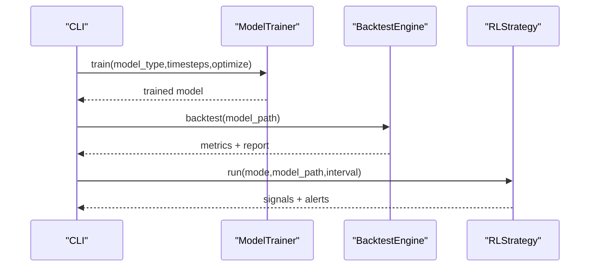

# Advanced Topics

<cite>
**Referenced Files in This Document**
- [main.py](file://trading_bot/main.py)
- [base.py](file://trading_bot/strategy/base.py)
- [rl_strategy.py](file://trading_bot/strategy/rl_strategy.py)
- [engine.py](file://trading_bot/backtest/engine.py)
- [engineering.py](file://trading_bot/features/engineering.py)
- [indicators.py](file://trading_bot/features/indicators.py)
- [train.py](file://trading_bot/models/train.py)
- [agent.py](file://trading_bot/models/agent.py)
- [environment.py](file://trading_bot/models/environment.py)
- [settings.py](file://trading_bot/config/settings.py)
- [manager.py](file://trading_bot/risk/manager.py)
- [paper.py](file://trading_bot/execution/paper.py)
- [dashboard.py](file://trading_bot/monitoring/dashboard.py)
- [requirements.txt](file://requirements.txt)
- [README.md](file://README.md)
</cite>

## Table of Contents
1. [Introduction](#introduction)
2. [Project Structure](#project-structure)
3. [Core Components](#core-components)
4. [Architecture Overview](#architecture-overview)
5. [Detailed Component Analysis](#detailed-component-analysis)
6. [Dependency Analysis](#dependency-analysis)
7. [Performance Considerations](#performance-considerations)
8. [Troubleshooting Guide](#troubleshooting-guide)
9. [Conclusion](#conclusion)
10. [Appendices](#appendices)

## Introduction
This document presents advanced topics for extending the AI Trading Bot beyond its base reinforcement learning (RL) implementation. It covers custom strategy development, model training optimization, multi-asset trading strategies, research extensions, advanced RL techniques, hyperparameter optimization, ensemble methods, adaptive systems, performance optimization, scalability, and cutting-edge research applications. Practical examples are provided via file references and diagrams mapped to actual source code.

## Project Structure
The project follows a modular, layer-based architecture:
- Data ingestion and storage (async fetcher, Parquet/SQLite)
- Feature engineering (technical indicators, custom regimes, cross-asset features)
- RL modeling (environment, agent, training pipeline)
- Strategy module (base interface and RL-based strategy)
- Execution (paper and live)
- Risk management (position sizing, circuit breakers)
- Backtesting (vectorbt integration, walk-forward, Monte Carlo)
- Monitoring (alerts, dashboard)

**Diagram sources**
- [main.py:105-157](file://trading_bot/main.py#L105-L157)
- [rl_strategy.py:19-57](file://trading_bot/strategy/rl_strategy.py#L19-L57)
- [engine.py:41-62](file://trading_bot/backtest/engine.py#L41-L62)
- [paper.py:36-75](file://trading_bot/execution/paper.py#L36-L75)
- [manager.py:58-98](file://trading_bot/risk/manager.py#L58-L98)
- [dashboard.py:16-26](file://trading_bot/monitoring/dashboard.py#L16-L26)

**Section sources**
- [README.md:198-231](file://README.md#L198-L231)

## Core Components
- BaseStrategy defines the abstract interface for generating and updating trading signals across assets.
- RLStrategy implements a position-size prediction agent that converts model outputs into actionable buy/sell/close signals with confidence thresholds and position tracking.
- FeatureEngineer and TechnicalIndicators provide a comprehensive suite of technical indicators and custom features (volatility regimes, trend strength, momentum, market structure, Fourier components).
- ModelTrainer orchestrates data preparation, environment creation, hyperparameter optimization with Optuna, and walk-forward validation.
- RLAgent wraps Stable-Baselines3 PPO/SAC with optional LSTM/Transformer feature extractors and training callbacks.
- TradingEnvironment defines the RL environment with realistic slippage, fees, stop-loss/take-profit, and reward shaping.
- BacktestEngine integrates vectorbt for performance evaluation and supports walk-forward and Monte Carlo simulations.
- RiskManager enforces position sizing, exposure limits, and circuit breakers; PaperTradingExecutor simulates trades with slippage and commission.
- Settings centralizes configuration for trading modes, symbols, risk parameters, and model settings.

**Section sources**
- [base.py:39-136](file://trading_bot/strategy/base.py#L39-L136)
- [rl_strategy.py:19-285](file://trading_bot/strategy/rl_strategy.py#L19-L285)
- [engineering.py:17-442](file://trading_bot/features/engineering.py#L17-L442)
- [indicators.py:14-332](file://trading_bot/features/indicators.py#L14-L332)
- [train.py:23-446](file://trading_bot/models/train.py#L23-L446)
- [agent.py:206-502](file://trading_bot/models/agent.py#L206-L502)
- [environment.py:15-405](file://trading_bot/models/environment.py#L15-L405)
- [engine.py:41-418](file://trading_bot/backtest/engine.py#L41-L418)
- [manager.py:58-432](file://trading_bot/risk/manager.py#L58-L432)
- [paper.py:36-392](file://trading_bot/execution/paper.py#L36-L392)
- [settings.py:23-176](file://trading_bot/config/settings.py#L23-L176)

## Architecture Overview
The system integrates asynchronous data fetching, robust feature engineering, RL training and evaluation, and realistic execution with risk controls. The CLI coordinates training, backtesting, and runtime operation.

**Diagram sources**
- [main.py:214-325](file://trading_bot/main.py#L214-L325)
- [rl_strategy.py:182-221](file://trading_bot/strategy/rl_strategy.py#L182-L221)
- [paper.py:115-208](file://trading_bot/execution/paper.py#L115-L208)
- [manager.py:102-148](file://trading_bot/risk/manager.py#L102-L148)

## Detailed Component Analysis

### Custom Strategy Development Beyond Base Implementation
- Extend BaseStrategy to implement domain-specific logic (e.g., mean reversion, trend following, event-driven).
- Use SignalType and Signal metadata to carry confidence, model type, and derived metrics.
- Integrate with FeatureEngineer to incorporate additional features (e.g., sentiment, macro signals) via add_cross_asset_features.

**Diagram sources**
- [base.py:39-136](file://trading_bot/strategy/base.py#L39-L136)
- [rl_strategy.py:19-285](file://trading_bot/strategy/rl_strategy.py#L19-L285)

**Section sources**
- [base.py:39-136](file://trading_bot/strategy/base.py#L39-L136)
- [rl_strategy.py:19-285](file://trading_bot/strategy/rl_strategy.py#L19-L285)

### Model Training Optimization Techniques
- Hyperparameter optimization with Optuna guided by environment evaluation.
- Walk-forward validation to assess out-of-sample stability.
- Feature engineering pipeline with standardized feature names and scaling.
- LSTM/Transformer feature extractors for sequence modeling.

**Diagram sources**
- [train.py:99-185](file://trading_bot/models/train.py#L99-L185)
- [train.py:187-244](file://trading_bot/models/train.py#L187-L244)
- [train.py:310-383](file://trading_bot/models/train.py#L310-L383)
- [agent.py:274-414](file://trading_bot/models/agent.py#L274-L414)

**Section sources**
- [train.py:23-446](file://trading_bot/models/train.py#L23-L446)
- [agent.py:206-502](file://trading_bot/models/agent.py#L206-L502)

### Multi-Asset Trading Strategies
- Cross-asset correlation and beta features to diversify and hedge exposures.
- Walk-forward validation across multiple assets to prevent lookahead bias.
- Ensemble of single-asset strategies with portfolio-level risk controls.

**Diagram sources**
- [engineering.py:337-374](file://trading_bot/features/engineering.py#L337-L374)
- [train.py:310-383](file://trading_bot/models/train.py#L310-L383)
- [manager.py:102-148](file://trading_bot/risk/manager.py#L102-L148)

**Section sources**
- [engineering.py:337-374](file://trading_bot/features/engineering.py#L337-L374)
- [train.py:310-383](file://trading_bot/models/train.py#L310-L383)
- [manager.py:58-432](file://trading_bot/risk/manager.py#L58-L432)

### Research Extensions and Cutting-Edge Techniques
- Transformer-based feature extraction for long-range dependencies.
- SHAP for explainability of feature importance.
- Monte Carlo simulation for probabilistic drawdown and return distributions.
- VectorBT-backed backtests for performance benchmarking.

**Diagram sources**
- [agent.py:101-177](file://trading_bot/models/agent.py#L101-L177)
- [engine.py:297-356](file://trading_bot/backtest/engine.py#L297-L356)
- [engineering.py:406-442](file://trading_bot/features/engineering.py#L406-L442)

**Section sources**
- [agent.py:101-177](file://trading_bot/models/agent.py#L101-L177)
- [engine.py:297-356](file://trading_bot/backtest/engine.py#L297-L356)
- [engineering.py:406-442](file://trading_bot/features/engineering.py#L406-L442)

### Advanced RL Techniques and Adaptive Systems
- PPO/SAC with SDE, entropy bonus, and clipped objective.
- Reward shaping to emphasize risk-adjusted returns and penalize drawdowns.
- Adaptive position sizing integrated with risk manager.

**Diagram sources**
- [environment.py:134-250](file://trading_bot/models/environment.py#L134-L250)
- [environment.py:306-347](file://trading_bot/models/environment.py#L306-L347)
- [agent.py:302-340](file://trading_bot/models/agent.py#L302-L340)

**Section sources**
- [environment.py:15-405](file://trading_bot/models/environment.py#L15-L405)
- [agent.py:206-502](file://trading_bot/models/agent.py#L206-L502)

### Ensemble Methods and Adaptive Trading Systems
- Combine multiple agents (e.g., PPO and SAC) with weighted position decisions.
- Dynamic feature selection and scaling per market regime.
- Online adaptation via periodic walk-forward retraining.

**Diagram sources**
- [train.py:354-361](file://trading_bot/models/train.py#L354-L361)
- [rl_strategy.py:223-269](file://trading_bot/strategy/rl_strategy.py#L223-L269)

**Section sources**
- [train.py:310-383](file://trading_bot/models/train.py#L310-L383)
- [rl_strategy.py:223-269](file://trading_bot/strategy/rl_strategy.py#L223-L269)

### Practical Examples of Extending the Framework
- Adding a new technical indicator: extend TechnicalIndicators and FeatureEngineer to include regime filters and higher-order features.
- Implementing a new strategy: subclass BaseStrategy and integrate with FeatureEngineer and RLAgent.
- Integrating new features: use add_cross_asset_features to incorporate macro or alternative asset signals.
- Adapting the environment: modify action space and reward function for new objectives (e.g., inventory control, liquidation penalties).

**Section sources**
- [indicators.py:14-332](file://trading_bot/features/indicators.py#L14-L332)
- [engineering.py:17-442](file://trading_bot/features/engineering.py#L17-L442)
- [base.py:39-136](file://trading_bot/strategy/base.py#L39-L136)
- [environment.py:72-87](file://trading_bot/models/environment.py#L72-L87)

## Dependency Analysis
Key external libraries and their roles:
- Data and exchange: CCXT, aiohttp, websockets
- Technical analysis: pandas-ta, TA-Lib
- ML/RL: PyTorch, Stable-Baselines3, Gymnasium, Optuna
- Backtesting: vectorbt
- Monitoring: structlog, python-telegram-bot, discord.py, streamlit, plotly

**Diagram sources**
- [requirements.txt:1-46](file://requirements.txt#L1-L46)

**Section sources**
- [requirements.txt:1-46](file://requirements.txt#L1-L46)

## Performance Considerations
- Feature engineering: avoid excessive lag windows and redundant features; use rolling windows judiciously.
- Environment design: tune slippage and fee rates to reflect market conditions; adjust reward scaling to prevent overfitting.
- Training: use early stopping, evaluation callbacks, and checkpoints; reduce batch size or sequence length if memory constrained.
- Execution: minimize unnecessary data fetches; cache recent bars; throttle updates to reduce overhead.
- Monitoring: offload reporting to background tasks; use lightweight dashboards for real-time insights.

[No sources needed since this section provides general guidance]

## Troubleshooting Guide
- Model not loading: verify model path and environment compatibility; ensure feature names align with training metadata.
- Insufficient capital: check position sizing and risk parameters; review commission and slippage impact.
- Circuit breaker triggers: review daily drawdown and consecutive loss thresholds; adjust parameters cautiously.
- Walk-forward instability: validate data splits; consider regime-aware windows; reduce overfitting via pruning and regularization.

**Section sources**
- [rl_strategy.py:58-66](file://trading_bot/strategy/rl_strategy.py#L58-L66)
- [paper.py:164-167](file://trading_bot/execution/paper.py#L164-L167)
- [manager.py:299-321](file://trading_bot/risk/manager.py#L299-L321)
- [train.py:354-361](file://trading_bot/models/train.py#L354-L361)

## Conclusion
This advanced topics guide demonstrates how to extend the AI Trading Bot with custom strategies, robust training pipelines, multi-asset approaches, and cutting-edge RL techniques. By leveraging the modular architecture—feature engineering, environment design, agent training, and risk-aware execution—you can build adaptive, scalable, and research-driven trading systems.

[No sources needed since this section summarizes without analyzing specific files]

## Appendices

### Appendix A: CLI Workflows
- Training: prepare data, optimize hyperparameters, train, evaluate, and save.
- Backtesting: load model, run vectorbt or RL backtests, generate reports.
- Runtime: fetch latest data, generate signals, execute trades, monitor risk.

**Diagram sources**
- [main.py:105-212](file://trading_bot/main.py#L105-L212)
- [train.py:99-185](file://trading_bot/models/train.py#L99-L185)
- [engine.py:147-240](file://trading_bot/backtest/engine.py#L147-L240)

**Section sources**
- [main.py:105-212](file://trading_bot/main.py#L105-L212)
- [engine.py:147-240](file://trading_bot/backtest/engine.py#L147-L240)

### Appendix B: Configuration Reference
- TradingMode, ModelType, symbols, timeframe, initial_capital, risk parameters, model storage paths, logging, and notification settings.

**Section sources**
- [settings.py:23-176](file://trading_bot/config/settings.py#L23-L176)