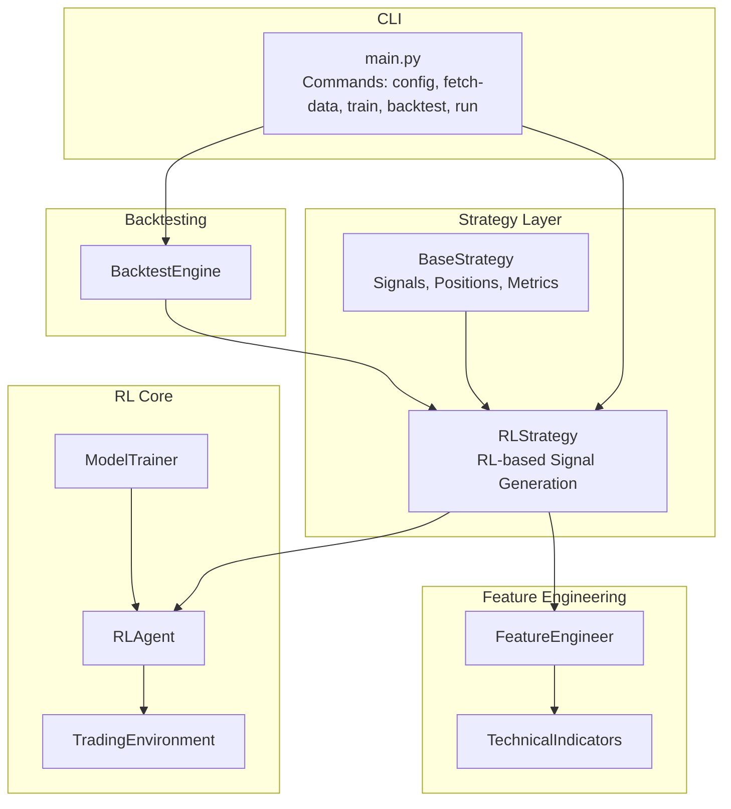
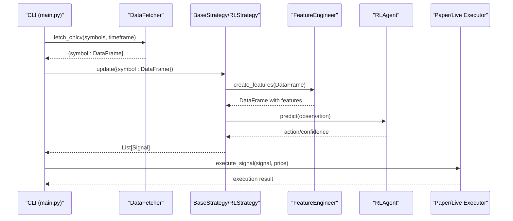
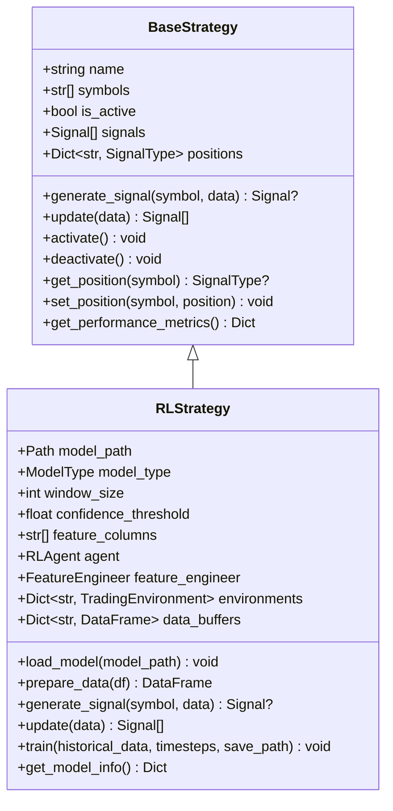
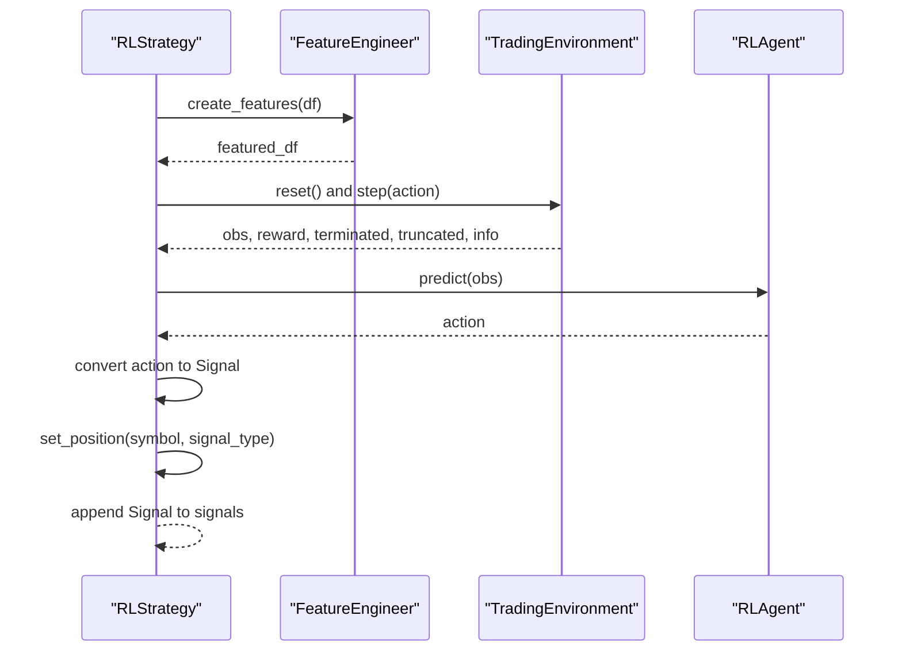
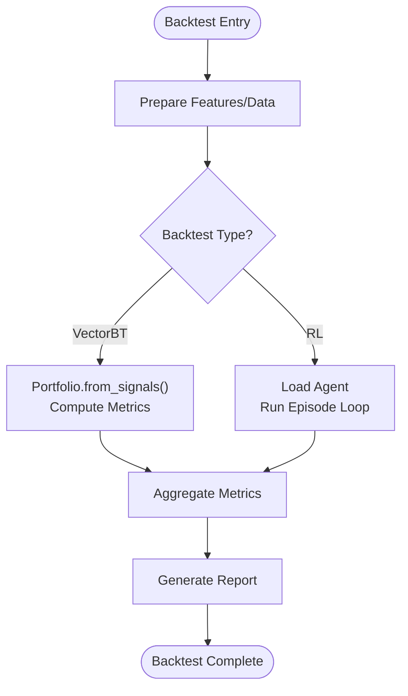
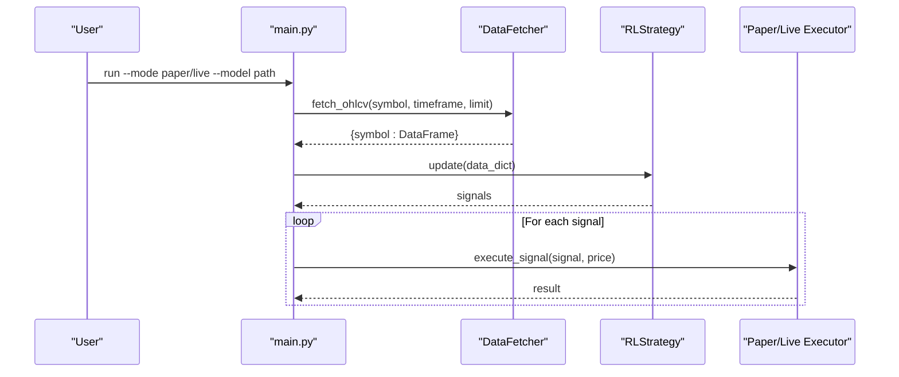
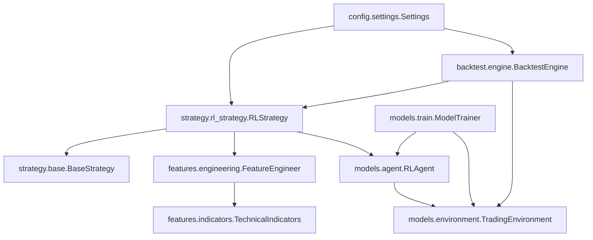

# Custom Strategy Development

<cite>
**Referenced Files in This Document**
- [base.py](file://trading_bot/strategy/base.py)
- [rl_strategy.py](file://trading_bot/strategy/rl_strategy.py)
- [engine.py](file://trading_bot/backtest/engine.py)
- [main.py](file://trading_bot/main.py)
- [settings.py](file://trading_bot/config/settings.py)
- [indicators.py](file://trading_bot/features/indicators.py)
- [engineering.py](file://trading_bot/features/engineering.py)
- [environment.py](file://trading_bot/models/environment.py)
- [agent.py](file://trading_bot/models/agent.py)
- [train.py](file://trading_bot/models/train.py)
- [test_config.py](file://trading_bot/tests/test_config.py)
- [test_risk.py](file://trading_bot/tests/test_risk.py)
</cite>

## Table of Contents
1. [Introduction](#introduction)
2. [Project Structure](#project-structure)
3. [Core Components](#core-components)
4. [Architecture Overview](#architecture-overview)
5. [Detailed Component Analysis](#detailed-component-analysis)
6. [Dependency Analysis](#dependency-analysis)
7. [Performance Considerations](#performance-considerations)
8. [Troubleshooting Guide](#troubleshooting-guide)
9. [Conclusion](#conclusion)
10. [Appendices](#appendices)

## Introduction
This document explains how to develop custom trading strategies beyond the base reinforcement learning implementation. It covers the BaseStrategy interface, inheritance patterns, signal generation, position management, integration with the trading framework, and practical examples for technical analysis-based strategies, statistical arbitrage approaches, and machine learning models. It also documents the strategy registration system, configuration options, and testing methodologies.

## Project Structure
The strategy development framework centers around a shared BaseStrategy abstraction and a concrete RLStrategy implementation. Supporting modules provide feature engineering, environment modeling, agent wrappers, and backtesting engines. The CLI orchestrates data fetching, training, backtesting, and live/paper trading.

**Diagram sources**
- [base.py:39-135](file://trading_bot/strategy/base.py#L39-L135)
- [rl_strategy.py:19-285](file://trading_bot/strategy/rl_strategy.py#L19-L285)
- [engineering.py:17-85](file://trading_bot/features/engineering.py#L17-L85)
- [indicators.py:13-46](file://trading_bot/features/indicators.py#L13-L46)
- [environment.py:15-103](file://trading_bot/models/environment.py#L15-L103)
- [agent.py:206-351](file://trading_bot/models/agent.py#L206-L351)
- [train.py:23-185](file://trading_bot/models/train.py#L23-L185)
- [engine.py:41-62](file://trading_bot/backtest/engine.py#L41-L62)
- [main.py:17-346](file://trading_bot/main.py#L17-L346)

**Section sources**
- [base.py:1-136](file://trading_bot/strategy/base.py#L1-L136)
- [rl_strategy.py:1-285](file://trading_bot/strategy/rl_strategy.py#L1-L285)
- [engineering.py:1-442](file://trading_bot/features/engineering.py#L1-L442)
- [indicators.py:1-301](file://trading_bot/features/indicators.py#L1-L301)
- [environment.py:1-405](file://trading_bot/models/environment.py#L1-L405)
- [agent.py:1-502](file://trading_bot/models/agent.py#L1-L502)
- [train.py:1-446](file://trading_bot/models/train.py#L1-L446)
- [engine.py:1-418](file://trading_bot/backtest/engine.py#L1-L418)
- [main.py:1-347](file://trading_bot/main.py#L1-L347)

## Core Components
- BaseStrategy defines the contract for all strategies: signal generation, updates, activation/deactivation, position tracking, and performance metrics.
- RLStrategy extends BaseStrategy and integrates feature engineering, an RL agent, and a trading environment to produce signals from model predictions.
- FeatureEngineer and TechnicalIndicators provide robust feature sets for ML and technical analysis.
- BacktestEngine supports vectorbt-based and RL-specific backtesting with comprehensive metrics.
- CLI commands orchestrate configuration, data fetching, training, backtesting, and live/paper trading.

Key responsibilities:
- Signal generation: generate_signal(symbol, data) returning a Signal with type, price, confidence, and metadata.
- Position management: get_position/set_position to track current holdings and enforce constraints.
- Integration: update(data_dict) to process incoming market data and emit signals.

**Section sources**
- [base.py:39-135](file://trading_bot/strategy/base.py#L39-L135)
- [rl_strategy.py:79-221](file://trading_bot/strategy/rl_strategy.py#L79-L221)
- [engineering.py:31-85](file://trading_bot/features/engineering.py#L31-L85)
- [engine.py:63-145](file://trading_bot/backtest/engine.py#L63-L145)

## Architecture Overview
The strategy lifecycle connects data ingestion, feature engineering, model inference, and execution via the CLI.

**Diagram sources**
- [main.py:281-316](file://trading_bot/main.py#L281-L316)
- [rl_strategy.py:182-221](file://trading_bot/strategy/rl_strategy.py#L182-L221)
- [engineering.py:31-85](file://trading_bot/features/engineering.py#L31-L85)
- [agent.py:415-433](file://trading_bot/models/agent.py#L415-L433)

## Detailed Component Analysis

### BaseStrategy Interface and Inheritance Patterns
BaseStrategy establishes:
- SignalType enumeration (BUY, SELL, HOLD, CLOSE)
- Signal dataclass with symbol, type, timestamp, price, confidence, metadata
- Abstract methods: generate_signal and update
- Utility methods: activate/deactivate, get/set_position, get_performance_metrics

Implementation pattern:
- Inherit from BaseStrategy
- Implement generate_signal(symbol, data) to return a Signal or None
- Implement update(data_dict) to iterate symbols, prepare features, and call generate_signal
- Track positions via set_position and enforce constraints externally (e.g., via RiskManager)

**Diagram sources**
- [base.py:16-135](file://trading_bot/strategy/base.py#L16-L135)
- [rl_strategy.py:19-285](file://trading_bot/strategy/rl_strategy.py#L19-L285)

**Section sources**
- [base.py:16-135](file://trading_bot/strategy/base.py#L16-L135)

### RLStrategy: Signal Generation and Position Management
RLStrategy integrates:
- Feature preparation via FeatureEngineer
- Environment creation per symbol for RL inference
- Agent prediction to derive position sizes
- Threshold-based conversion to Signal types
- Position tracking and confidence filtering

Key logic:
- generate_signal validates activity, model availability, and sufficient data
- Uses TradingEnvironment to construct observations and actions
- Converts continuous position size to discrete signals (BUY/SELL/CLOSE)
- Updates internal positions and logs signals

**Diagram sources**
- [rl_strategy.py:79-180](file://trading_bot/strategy/rl_strategy.py#L79-L180)
- [engineering.py:31-85](file://trading_bot/features/engineering.py#L31-L85)
- [environment.py:134-250](file://trading_bot/models/environment.py#L134-L250)
- [agent.py:415-433](file://trading_bot/models/agent.py#L415-L433)

**Section sources**
- [rl_strategy.py:79-180](file://trading_bot/strategy/rl_strategy.py#L79-L180)
- [environment.py:134-250](file://trading_bot/models/environment.py#L134-L250)
- [agent.py:415-433](file://trading_bot/models/agent.py#L415-L433)

### Backtesting Engine and Walk-Forward Analysis
BacktestEngine supports:
- VectorBT-based backtests from entry/exit signals
- RL-specific backtests using TradingEnvironment and RLAgent
- Walk-forward analysis across rolling windows
- Monte Carlo simulation for distributional risk assessment
- Comprehensive reporting with performance metrics

**Diagram sources**
- [engine.py:63-145](file://trading_bot/backtest/engine.py#L63-L145)
- [engine.py:147-240](file://trading_bot/backtest/engine.py#L147-L240)
- [engine.py:242-295](file://trading_bot/backtest/engine.py#L242-L295)
- [engine.py:297-356](file://trading_bot/backtest/engine.py#L297-L356)

**Section sources**
- [engine.py:63-240](file://trading_bot/backtest/engine.py#L63-L240)

### CLI Integration and Execution Flow
The CLI coordinates:
- Configuration retrieval and logging setup
- Data fetching for multiple symbols
- Training pipeline with hyperparameter optimization
- Backtesting with RL or technical signals
- Live or paper trading execution with alerts and circuit breakers

**Diagram sources**
- [main.py:228-324](file://trading_bot/main.py#L228-L324)

**Section sources**
- [main.py:228-324](file://trading_bot/main.py#L228-L324)

## Dependency Analysis
The strategy module depends on configuration, feature engineering, RL components, and backtesting. The CLI wires these together.

**Diagram sources**
- [base.py:39-135](file://trading_bot/strategy/base.py#L39-L135)
- [rl_strategy.py:19-285](file://trading_bot/strategy/rl_strategy.py#L19-L285)
- [engineering.py:17-85](file://trading_bot/features/engineering.py#L17-L85)
- [indicators.py:13-46](file://trading_bot/features/indicators.py#L13-L46)
- [environment.py:15-103](file://trading_bot/models/environment.py#L15-L103)
- [agent.py:206-351](file://trading_bot/models/agent.py#L206-L351)
- [train.py:23-185](file://trading_bot/models/train.py#L23-L185)
- [engine.py:41-62](file://trading_bot/backtest/engine.py#L41-L62)
- [settings.py:23-175](file://trading_bot/config/settings.py#L23-L175)

**Section sources**
- [settings.py:23-175](file://trading_bot/config/settings.py#L23-L175)
- [rl_strategy.py:19-285](file://trading_bot/strategy/rl_strategy.py#L19-L285)
- [train.py:23-185](file://trading_bot/models/train.py#L23-L185)
- [engine.py:41-62](file://trading_bot/backtest/engine.py#L41-L62)

## Performance Considerations
- Data preparation: FeatureEngineer drops NaN rows after feature creation; ensure sufficient lookback windows to avoid excessive NaN drops.
- RL inference: RLStrategy buffers recent data per symbol and keeps a bounded window to manage memory.
- Environment stepping: TradingEnvironment applies slippage and fees; tune commission and slippage in BacktestEngine for realistic performance.
- Hyperparameter optimization: ModelTrainer uses Optuna with pruning; reduce n_trials for faster iteration during development.
- Walk-forward validation: Use ModelTrainer.walk_forward_validation to assess out-of-sample stability.

[No sources needed since this section provides general guidance]

## Troubleshooting Guide
Common issues and resolutions:
- Import errors: Ensure dependencies are installed as per requirements.
- API connection errors: Verify API keys and testnet settings in configuration.
- Out of memory: Reduce batch size or observation window in configuration.
- Model not loading: Confirm model file path and compatibility with RLAgent.

Testing guidance:
- Configuration tests validate defaults, symbol parsing, timeframe validation, and directory creation.
- Risk management tests validate position sizing, risk manager checks, and circuit breaker triggers.

**Section sources**
- [test_config.py:9-49](file://trading_bot/tests/test_config.py#L9-L49)
- [test_risk.py:12-177](file://trading_bot/tests/test_risk.py#L12-L177)

## Conclusion
The BaseStrategy interface provides a clean contract for building custom strategies. RLStrategy demonstrates a complete RL-based implementation integrating feature engineering, environment modeling, and agent inference. The framework supports technical analysis-based strategies by adapting generate_signal to use engineered features, and statistical arbitrage strategies by generating signals from spreads and cointegration features. The CLI, backtesting engine, and training pipeline enable rapid iteration, rigorous evaluation, and safe deployment.

[No sources needed since this section summarizes without analyzing specific files]

## Appendices

### Practical Strategy Implementation Examples

- Technical Analysis-Based Strategy
  - Inherit from BaseStrategy and implement generate_signal to compute signals from TechnicalIndicators features.
  - Use FeatureEngineer to add rolling statistics and lags for robustness.
  - Example path references:
    - [indicators.py:20-46](file://trading_bot/features/indicators.py#L20-L46)
    - [engineering.py:31-85](file://trading_bot/features/engineering.py#L31-L85)
    - [base.py:55-82](file://trading_bot/strategy/base.py#L55-L82)

- Statistical Arbitrage Strategy
  - Compute spread features (e.g., correlation, beta, residuals) using add_cross_asset_features and rolling statistics.
  - Generate signals when spread deviates beyond thresholds (e.g., z-score).
  - Example path references:
    - [engineering.py:337-374](file://trading_bot/features/engineering.py#L337-L374)
    - [engineering.py:280-335](file://trading_bot/features/engineering.py#L280-L335)

- Machine Learning Model Strategy
  - Use RLStrategy as a template to integrate custom models (e.g., XGBoost, LSTM) via FeatureEngineer and TradingEnvironment.
  - Train with ModelTrainer and evaluate with BacktestEngine.
  - Example path references:
    - [rl_strategy.py:223-269](file://trading_bot/strategy/rl_strategy.py#L223-L269)
    - [train.py:99-185](file://trading_bot/models/train.py#L99-L185)
    - [engine.py:147-240](file://trading_bot/backtest/engine.py#L147-L240)

### Strategy Registration and Configuration
- Strategy registration: The strategy module exports BaseStrategy, Signal, SignalType, and RLStrategy for import.
- Configuration options: Settings define trading mode, symbols, timeframe, capital, risk parameters, and model paths.
- Example path references:
  - [strategy/__init__.py:1-7](file://trading_bot/strategy/__init__.py#L1-L7)
  - [settings.py:23-175](file://trading_bot/config/settings.py#L23-L175)

### Testing Methodologies
- Unit tests validate configuration correctness and risk management behavior.
- Backtesting supports vectorbt-based and RL-specific evaluations with walk-forward and Monte Carlo simulations.
- Example path references:
  - [test_config.py:9-49](file://trading_bot/tests/test_config.py#L9-L49)
  - [test_risk.py:12-177](file://trading_bot/tests/test_risk.py#L12-L177)
  - [engine.py:242-295](file://trading_bot/backtest/engine.py#L242-L295)