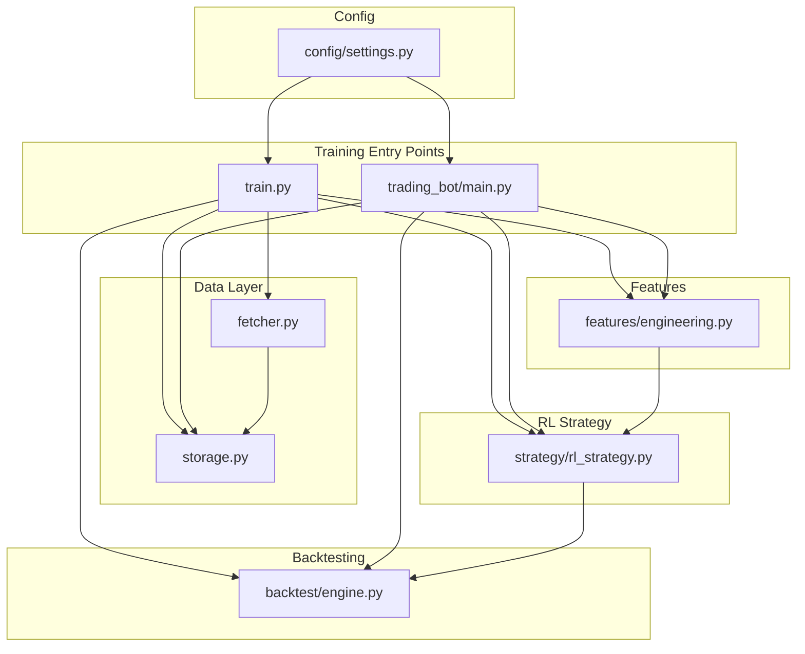
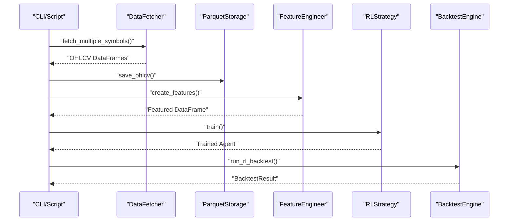
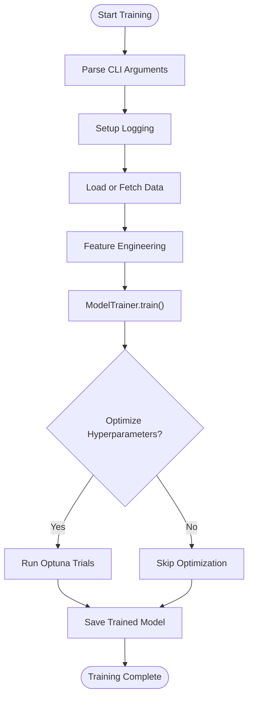
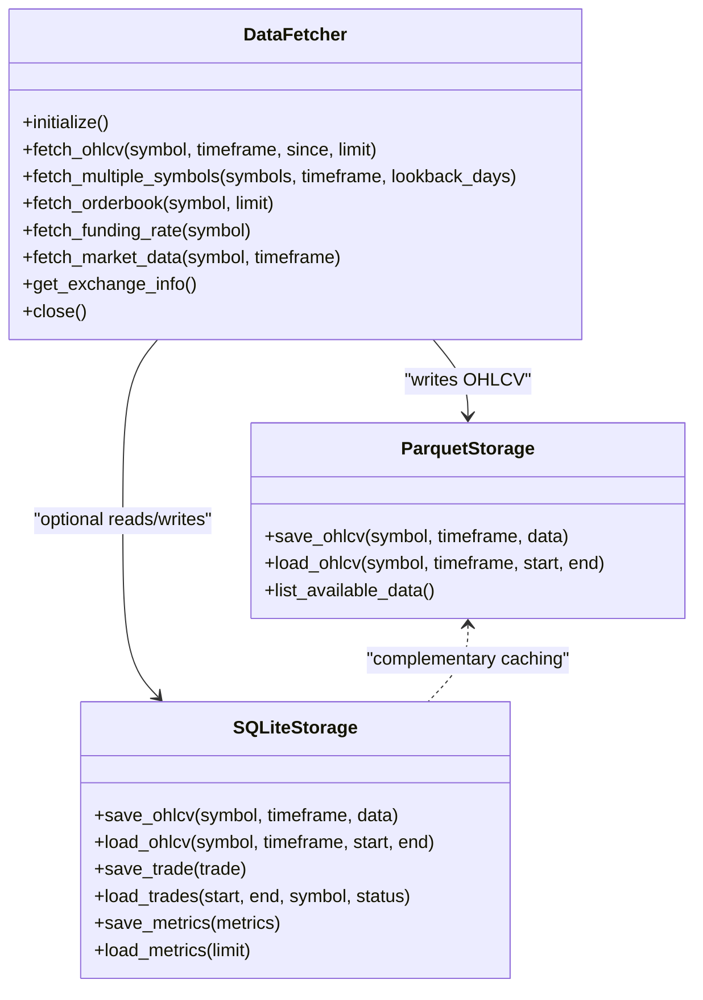
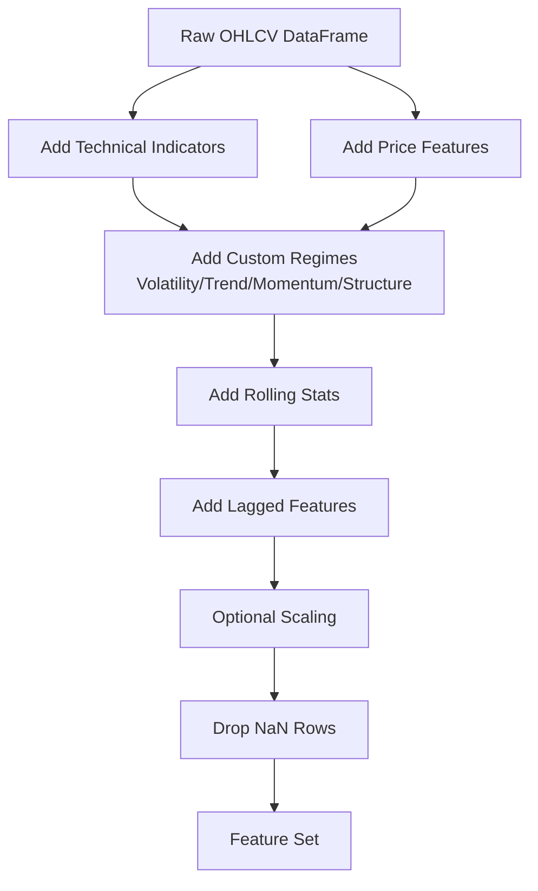
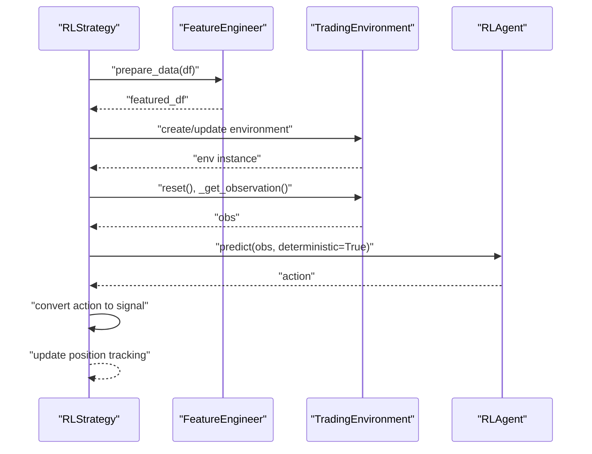
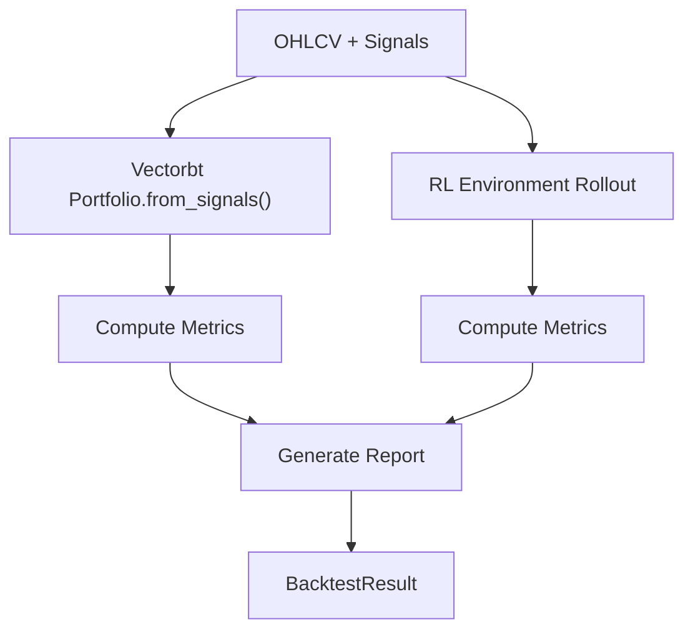
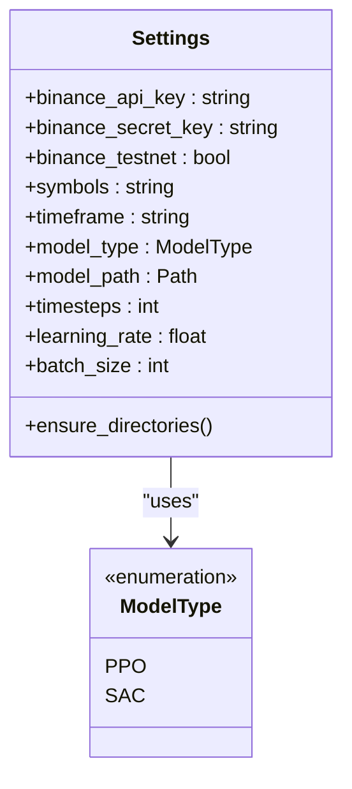
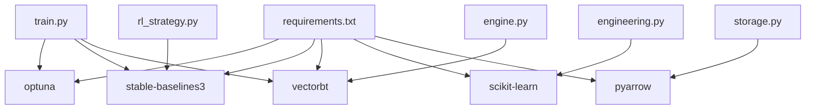

# Model Training and Optimization

<cite>
**Referenced Files in This Document**
- [train.py](file://train.py)
- [main.py](file://trading_bot/main.py)
- [rl_strategy.py](file://trading_bot/strategy/rl_strategy.py)
- [engine.py](file://trading_bot/backtest/engine.py)
- [engineering.py](file://trading_bot/features/engineering.py)
- [settings.py](file://trading_bot/config/settings.py)
- [fetcher.py](file://trading_bot/data/fetcher.py)
- [storage.py](file://trading_bot/data/storage.py)
- [requirements.txt](file://requirements.txt)
</cite>

## Table of Contents
1. [Introduction](#introduction)
2. [Project Structure](#project-structure)
3. [Core Components](#core-components)
4. [Architecture Overview](#architecture-overview)
5. [Detailed Component Analysis](#detailed-component-analysis)
6. [Dependency Analysis](#dependency-analysis)
7. [Performance Considerations](#performance-considerations)
8. [Troubleshooting Guide](#troubleshooting-guide)
9. [Conclusion](#conclusion)
10. [Appendices](#appendices)

## Introduction
This document provides comprehensive guidance for advanced model training and optimization in the trading application. It covers hyperparameter optimization using Optuna, reinforcement learning algorithm tuning (PPO/SAC parameters), and performance optimization strategies. It documents the ModelTrainer class functionality, training data preparation, and evaluation metrics. Advanced topics include transfer learning, ensemble methods, and adaptive learning rate schedules. Practical examples demonstrate optimizing trading performance, reducing overfitting, and improving convergence rates.

## Project Structure
The training pipeline integrates asynchronous data fetching, feature engineering, reinforcement learning training, and backtesting. Key modules include:
- Training entry points: CLI and script-based trainers
- Data ingestion: Async exchange fetcher and persistent storage
- Feature engineering: Comprehensive technical indicators and custom features
- RL strategy and environment: Agent-driven trading logic and environment orchestration
- Backtesting: VectorBT-powered and environment-based evaluation
- Configuration: Centralized settings and model types

**Diagram sources**
- [train.py:1-101](file://train.py#L1-L101)
- [main.py:105-156](file://trading_bot/main.py#L105-L156)
- [fetcher.py:32-331](file://trading_bot/data/fetcher.py#L32-L331)
- [storage.py:53-484](file://trading_bot/data/storage.py#L53-L484)
- [engineering.py:17-442](file://trading_bot/features/engineering.py#L17-L442)
- [rl_strategy.py:19-285](file://trading_bot/strategy/rl_strategy.py#L19-L285)
- [engine.py:41-418](file://trading_bot/backtest/engine.py#L41-L418)
- [settings.py:23-176](file://trading_bot/config/settings.py#L23-L176)

**Section sources**
- [train.py:1-101](file://train.py#L1-L101)
- [main.py:105-156](file://trading_bot/main.py#L105-L156)
- [fetcher.py:32-331](file://trading_bot/data/fetcher.py#L32-L331)
- [storage.py:53-484](file://trading_bot/data/storage.py#L53-L484)
- [engineering.py:17-442](file://trading_bot/features/engineering.py#L17-L442)
- [rl_strategy.py:19-285](file://trading_bot/strategy/rl_strategy.py#L19-L285)
- [engine.py:41-418](file://trading_bot/backtest/engine.py#L41-L418)
- [settings.py:23-176](file://trading_bot/config/settings.py#L23-L176)

## Core Components
- Training Entrypoints: Both CLI and script-based trainers orchestrate data loading, feature engineering, and model training with optional hyperparameter optimization.
- Data Fetcher and Storage: Asynchronous exchange data retrieval and persistent storage via Parquet and SQLite enable scalable training data management.
- Feature Engineering: Extensive technical indicators, custom regimes, rolling statistics, lagged features, and scaling support robust model inputs.
- RL Strategy and Environment: RLStrategy encapsulates model loading, signal generation, and training; TradingEnvironment provides state transitions and metrics.
- Backtesting Engine: VectorBT-backed and environment-based backtesting compute comprehensive performance metrics and reports.
- Configuration: Centralized settings define model types, paths, and operational parameters.

**Section sources**
- [train.py:43-101](file://train.py#L43-L101)
- [main.py:105-156](file://trading_bot/main.py#L105-L156)
- [fetcher.py:106-275](file://trading_bot/data/fetcher.py#L106-L275)
- [storage.py:71-160](file://trading_bot/data/storage.py#L71-L160)
- [engineering.py:31-85](file://trading_bot/features/engineering.py#L31-L85)
- [rl_strategy.py:58-181](file://trading_bot/strategy/rl_strategy.py#L58-L181)
- [engine.py:63-146](file://trading_bot/backtest/engine.py#L63-L146)
- [settings.py:17-104](file://trading_bot/config/settings.py#L17-L104)

## Architecture Overview
The training architecture follows a modular pipeline:
- Data ingestion: Async fetcher retrieves OHLCV data; Parquet/SQLite persist datasets.
- Feature engineering: FeatureEngineer augments raw data with indicators and custom features.
- Training: ModelTrainer orchestrates RL training with optional Optuna-based hyperparameter optimization.
- Evaluation: BacktestEngine computes performance metrics via vectorbt and environment-based simulations.

**Diagram sources**
- [train.py:17-40](file://train.py#L17-L40)
- [fetcher.py:239-275](file://trading_bot/data/fetcher.py#L239-L275)
- [storage.py:71-116](file://trading_bot/data/storage.py#L71-L116)
- [engineering.py:31-85](file://trading_bot/features/engineering.py#L31-L85)
- [rl_strategy.py:223-269](file://trading_bot/strategy/rl_strategy.py#L223-L269)
- [engine.py:147-240](file://trading_bot/backtest/engine.py#L147-L240)

## Detailed Component Analysis

### Training Entrypoints and Hyperparameter Optimization
- CLI and script-based trainers accept arguments for model type, timesteps, trials, and whether to skip optimization. They set up logging, load or fetch data, and delegate to ModelTrainer for training with optional Optuna trials.
- The training loop supports PPO and SAC model types and saves models to a configurable path.

**Diagram sources**
- [train.py:43-96](file://train.py#L43-L96)
- [main.py:105-156](file://trading_bot/main.py#L105-L156)

**Section sources**
- [train.py:43-96](file://train.py#L43-L96)
- [main.py:105-156](file://trading_bot/main.py#L105-L156)

### Data Preparation and Storage
- DataFetcher asynchronously retrieves OHLCV data for multiple symbols with retry logic and rate limiting. It also supports orderbook and funding rate retrieval.
- ParquetStorage persists OHLCV data with deduplication and efficient indexing. SQLiteStorage caches OHLCV and stores trades/metrics.

**Diagram sources**
- [fetcher.py:32-331](file://trading_bot/data/fetcher.py#L32-L331)
- [storage.py:53-484](file://trading_bot/data/storage.py#L53-L484)

**Section sources**
- [fetcher.py:106-275](file://trading_bot/data/fetcher.py#L106-L275)
- [storage.py:71-160](file://trading_bot/data/storage.py#L71-L160)
- [storage.py:275-358](file://trading_bot/data/storage.py#L275-L358)

### Feature Engineering Pipeline
- FeatureEngineer adds technical indicators, custom volatility/trend/momentum/market structure regimes, rolling statistics, lagged features, and cyclical time features. It supports scaling and feature importance computation.

**Diagram sources**
- [engineering.py:31-85](file://trading_bot/features/engineering.py#L31-L85)
- [engineering.py:87-278](file://trading_bot/features/engineering.py#L87-L278)
- [engineering.py:280-335](file://trading_bot/features/engineering.py#L280-L335)
- [engineering.py:376-404](file://trading_bot/features/engineering.py#L376-L404)

**Section sources**
- [engineering.py:31-85](file://trading_bot/features/engineering.py#L31-L85)
- [engineering.py:87-278](file://trading_bot/features/engineering.py#L87-L278)
- [engineering.py:280-335](file://trading_bot/features/engineering.py#L280-L335)
- [engineering.py:376-404](file://trading_bot/features/engineering.py#L376-L404)

### RL Strategy and Environment
- RLStrategy manages model loading, feature preparation, and signal generation. It converts agent actions into actionable signals with confidence thresholds and updates internal position tracking.
- The strategy supports training on historical data by combining features across symbols and delegating to ModelTrainer.

**Diagram sources**
- [rl_strategy.py:68-181](file://trading_bot/strategy/rl_strategy.py#L68-L181)
- [rl_strategy.py:223-269](file://trading_bot/strategy/rl_strategy.py#L223-L269)

**Section sources**
- [rl_strategy.py:58-181](file://trading_bot/strategy/rl_strategy.py#L58-L181)
- [rl_strategy.py:223-269](file://trading_bot/strategy/rl_strategy.py#L223-L269)

### Backtesting and Evaluation Metrics
- BacktestEngine computes comprehensive metrics using vectorbt and environment-based simulations. It supports vectorbt backtests with entries/exits and RL backtests with environment rollouts.
- Metrics include total return, Sharpe ratio, Sortino ratio, Calmar ratio, max drawdown, win rate, profit factor, expectancy, volatility, and trade statistics.

**Diagram sources**
- [engine.py:63-146](file://trading_bot/backtest/engine.py#L63-L146)
- [engine.py:147-240](file://trading_bot/backtest/engine.py#L147-L240)
- [engine.py:358-417](file://trading_bot/backtest/engine.py#L358-L417)

**Section sources**
- [engine.py:63-146](file://trading_bot/backtest/engine.py#L63-L146)
- [engine.py:147-240](file://trading_bot/backtest/engine.py#L147-L240)
- [engine.py:358-417](file://trading_bot/backtest/engine.py#L358-L417)

### Configuration and Model Types
- Settings centralizes configuration for exchange credentials, trading parameters, risk controls, data storage, model settings, and logging. ModelType enumerates supported RL algorithms (PPO, SAC).

**Diagram sources**
- [settings.py:23-176](file://trading_bot/config/settings.py#L23-L176)

**Section sources**
- [settings.py:23-176](file://trading_bot/config/settings.py#L23-L176)

## Dependency Analysis
External dependencies relevant to training and optimization include:
- Optuna for hyperparameter optimization
- Stable-Baselines3 for RL agents (PPO/SAC)
- VectorBT for backtesting analytics
- Scikit-learn for feature scaling and selection
- PyArrow for Parquet I/O

**Diagram sources**
- [requirements.txt:21-29](file://requirements.txt#L21-L29)
- [train.py:8-14](file://train.py#L8-L14)
- [rl_strategy.py:10-14](file://trading_bot/strategy/rl_strategy.py#L10-L14)
- [engine.py:10-17](file://trading_bot/backtest/engine.py#L10-L17)
- [engineering.py:9](file://trading_bot/features/engineering.py#L9)
- [storage.py:10-12](file://trading_bot/data/storage.py#L10-L12)

**Section sources**
- [requirements.txt:1-46](file://requirements.txt#L1-L46)
- [train.py:8-14](file://train.py#L8-L14)
- [rl_strategy.py:10-14](file://trading_bot/strategy/rl_strategy.py#L10-L14)
- [engine.py:10-17](file://trading_bot/backtest/engine.py#L10-L17)
- [engineering.py:9](file://trading_bot/features/engineering.py#L9)
- [storage.py:10-12](file://trading_bot/data/storage.py#L10-L12)

## Performance Considerations
- Data throughput: Use async fetcher with rate limiting and gather multiple symbol requests concurrently to minimize latency.
- Feature efficiency: Limit feature explosion by selecting essential indicators and applying rolling windows judiciously; drop NaN rows after feature creation.
- Training stability: Normalize features using robust scaling; reduce batch sizes for smaller datasets; monitor reward shaping and environment boundaries.
- Backtesting fidelity: Incorporate realistic costs (commission/slippage) and time zone-aware equity curves; validate walk-forward and Monte Carlo simulations.
- Convergence acceleration: Employ curriculum learning by progressively increasing difficulty; adjust exploration schedules; use warm starts from pre-trained agents.

[No sources needed since this section provides general guidance]

## Troubleshooting Guide
- No data available: Verify exchange credentials and testnet settings; confirm symbol availability and timeframe validity; check storage paths and permissions.
- Training stalls: Reduce timesteps or increase learning rate cautiously; validate feature scaling and absence of constant features; inspect environment reward function.
- Overfitting symptoms: Increase regularization; apply dropout or entropy coefficient adjustments; use walk-forward validation; reduce feature dimensionality.
- Backtest inconsistencies: Ensure consistent index handling and timezone awareness; reconcile vectorbt vs environment metrics; validate entry/exit logic.

**Section sources**
- [settings.py:124-142](file://trading_bot/config/settings.py#L124-L142)
- [storage.py:136-167](file://trading_bot/data/storage.py#L136-L167)
- [engine.py:242-295](file://trading_bot/backtest/engine.py#L242-L295)

## Conclusion
The training and optimization framework integrates asynchronous data ingestion, robust feature engineering, RL training with hyperparameter optimization, and comprehensive backtesting. By leveraging Optuna, careful feature construction, and validated evaluation metrics, practitioners can improve trading performance, reduce overfitting, and accelerate convergence. Transfer learning and ensemble methods can further enhance generalization across assets and time horizons.

[No sources needed since this section summarizes without analyzing specific files]

## Appendices

### Practical Examples and Recipes
- Optimizing trading performance:
  - Tune learning rate and batch size via Optuna trials; adjust reward shaping to emphasize risk-adjusted returns.
  - Use walk-forward validation to select hyperparameters robust to out-of-sample dynamics.
- Reducing overfitting:
  - Apply feature selection and pruning; enforce stricter risk controls; regularize policy networks.
  - Monitor validation metrics and early stopping criteria during training.
- Improving convergence rates:
  - Warm-start agents from pre-trained models; use curriculum environments; schedule decaying exploration.

[No sources needed since this section provides general guidance]