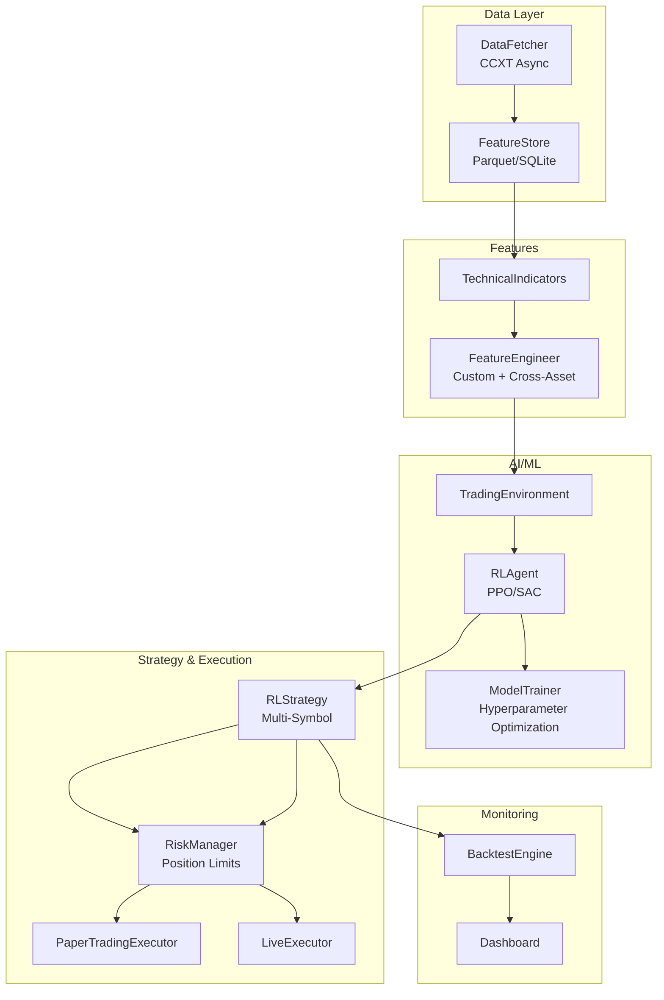
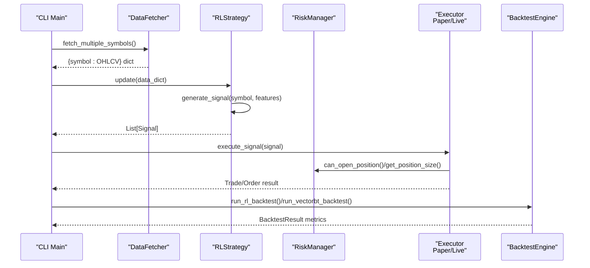
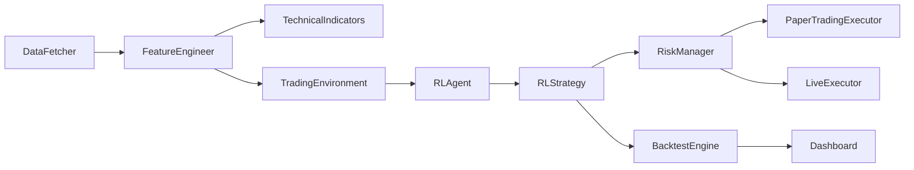

# Multi-Asset Trading Systems

<cite>
**Referenced Files in This Document**
- [main.py](file://trading_bot/main.py)
- [engine.py](file://trading_bot/backtest/engine.py)
- [manager.py](file://trading_bot/risk/manager.py)
- [sizing.py](file://trading_bot/risk/sizing.py)
- [base.py](file://trading_bot/strategy/base.py)
- [rl_strategy.py](file://trading_bot/strategy/rl_strategy.py)
- [engineering.py](file://trading_bot/features/engineering.py)
- [indicators.py](file://trading_bot/features/indicators.py)
- [paper.py](file://trading_bot/execution/paper.py)
- [live.py](file://trading_bot/execution/live.py)
- [settings.py](file://trading_bot/config/settings.py)
- [fetcher.py](file://trading_bot/data/fetcher.py)
- [train.py](file://trading_bot/models/train.py)
- [dashboard.py](file://trading_bot/monitoring/dashboard.py)
- [README.md](file://README.md)
</cite>

## Table of Contents
1. [Introduction](#introduction)
2. [Project Structure](#project-structure)
3. [Core Components](#core-components)
4. [Architecture Overview](#architecture-overview)
5. [Detailed Component Analysis](#detailed-component-analysis)
6. [Dependency Analysis](#dependency-analysis)
7. [Performance Considerations](#performance-considerations)
8. [Troubleshooting Guide](#troubleshooting-guide)
9. [Conclusion](#conclusion)
10. [Appendices](#appendices)

## Introduction
This document provides advanced documentation for implementing multi-asset trading strategies and portfolio management within a production-grade reinforcement learning (RL) trading system. It covers asset correlation analysis, diversification strategies, multi-symbol position sizing, portfolio optimization techniques, risk allocation across assets, and dynamic hedging approaches. Practical examples include cross-asset arbitrage, systematic portfolio construction, and stress testing across multiple markets. Coordination challenges, data synchronization, and execution complexities in multi-asset environments are addressed with concrete architectural and operational guidance.

## Project Structure
The system is organized around modular components enabling scalable multi-asset workflows:
- Data ingestion via asynchronous CCXT fetchers
- Feature engineering with technical indicators and cross-asset correlation features
- RL-based strategy generation and execution
- Risk management with position sizing and circuit breakers
- Backtesting with walk-forward and Monte Carlo analysis
- Monitoring and dashboards for performance tracking

**Diagram sources**
- [fetcher.py:32-331](file://trading_bot/data/fetcher.py#L32-L331)
- [indicators.py:13-294](file://trading_bot/features/indicators.py#L13-L294)
- [engineering.py:17-442](file://trading_bot/features/engineering.py#L17-L442)
- [train.py:23-446](file://trading_bot/models/train.py#L23-L446)
- [rl_strategy.py:19-285](file://trading_bot/strategy/rl_strategy.py#L19-L285)
- [manager.py:58-432](file://trading_bot/risk/manager.py#L58-L432)
- [paper.py:36-392](file://trading_bot/execution/paper.py#L36-L392)
- [live.py:38-364](file://trading_bot/execution/live.py#L38-L364)
- [engine.py:41-418](file://trading_bot/backtest/engine.py#L41-L418)
- [dashboard.py:16-328](file://trading_bot/monitoring/dashboard.py#L16-L328)

**Section sources**
- [README.md:1-363](file://README.md#L1-L363)
- [settings.py:23-176](file://trading_bot/config/settings.py#L23-L176)

## Core Components
- DataFetcher: Asynchronous OHLCV, orderbook, and funding rate retrieval with rate limiting and retries.
- FeatureEngineer: Extensive technical indicators, volatility regimes, trend/momentum features, and cross-asset correlation/beta.
- RLStrategy: Multi-symbol RL-driven signal generation with confidence thresholds and position tracking.
- RiskManager: Portfolio-level risk controls, position sizing, and circuit breakers.
- PaperTradingExecutor and LiveExecutor: Realistic paper simulation and live exchange execution with slippage/commissions.
- BacktestEngine: VectorBT-based and RL-agent backtesting, walk-forward, and Monte Carlo stress testing.
- Dashboard: Performance charts and metrics for equity curves, drawdowns, and trade distributions.

**Section sources**
- [fetcher.py:32-331](file://trading_bot/data/fetcher.py#L32-L331)
- [engineering.py:17-442](file://trading_bot/features/engineering.py#L17-L442)
- [rl_strategy.py:19-285](file://trading_bot/strategy/rl_strategy.py#L19-L285)
- [manager.py:58-432](file://trading_bot/risk/manager.py#L58-L432)
- [paper.py:36-392](file://trading_bot/execution/paper.py#L36-L392)
- [live.py:38-364](file://trading_bot/execution/live.py#L38-L364)
- [engine.py:41-418](file://trading_bot/backtest/engine.py#L41-L418)
- [dashboard.py:16-328](file://trading_bot/monitoring/dashboard.py#L16-L328)

## Architecture Overview
The system integrates multi-asset data, feature engineering, RL modeling, and execution with robust risk controls and monitoring.

**Diagram sources**
- [main.py:214-325](file://trading_bot/main.py#L214-L325)
- [fetcher.py:239-275](file://trading_bot/data/fetcher.py#L239-L275)
- [rl_strategy.py:182-221](file://trading_bot/strategy/rl_strategy.py#L182-L221)
- [paper.py:115-208](file://trading_bot/execution/paper.py#L115-L208)
- [live.py:115-224](file://trading_bot/execution/live.py#L115-L224)
- [engine.py:147-240](file://trading_bot/backtest/engine.py#L147-L240)

## Detailed Component Analysis

### Asset Correlation Analysis and Cross-Asset Features
Cross-asset correlation and beta are computed to inform diversification and hedge placement:
- Correlation windows (e.g., 20, 50) track pairwise relationships between assets.
- Beta measures sensitivity to another asset’s returns.
- Relative strength normalization enables comparative performance views.

Implementation highlights:
- Pairwise correlation and beta appended as features for each symbol.
- Relative strength normalized series for comparative analysis.

Practical usage:
- Use correlation/beta features to avoid correlating exposures and to size hedge positions dynamically.
- Combine with volatility regimes to adjust hedge ratios under changing market conditions.

**Section sources**
- [engineering.py:337-374](file://trading_bot/features/engineering.py#L337-L374)

### Diversification Strategies
Diversification is enforced through:
- Position limits per symbol and total exposure constraints.
- Correlation-aware gating to prevent over-concentration in highly correlated assets.
- Daily drawdown and trade caps to reduce clustering of risky positions.

Operational controls:
- RiskManager enforces max position size, total exposure, and daily drawdown thresholds.
- Correlation checks limit simultaneous positions in highly correlated assets.

**Section sources**
- [manager.py:102-148](file://trading_bot/risk/manager.py#L102-L148)
- [manager.py:399-411](file://trading_bot/risk/manager.py#L399-L411)

### Multi-Symbol Position Sizing
Position sizing is calculated centrally and applied consistently across symbols:
- Fixed fraction: risk a fixed % of capital per trade.
- Kelly criterion: optimal sizing given historical win rate and payoff profile.
- ATR-based: dynamic sizing based on realized volatility.
- Volatility targeting: scale position size to target annualized volatility.
- Optimal f: geometric growth maximizing sizing derived from historical returns.

RiskManager delegates sizing decisions to PositionSizer, which returns PositionSize with size, notional, leverage, and risk amount.

**Section sources**
- [sizing.py:25-312](file://trading_bot/risk/sizing.py#L25-L312)
- [manager.py:323-354](file://trading_bot/risk/manager.py#L323-L354)

### Portfolio Optimization Techniques
While explicit portfolio optimization (e.g., mean-variance) is not implemented, the system supports:
- Risk parity-inspired volatility targeting via PositionSizer.volatility_targeting.
- Exposure normalization across symbols using max_position_size constraints.
- Dynamic hedge sizing using beta and correlation features.

Guidance:
- Use correlation/beta features to estimate hedge ratios.
- Apply volatility targeting to maintain consistent portfolio-level risk contribution.

**Section sources**
- [sizing.py:142-196](file://trading_bot/risk/sizing.py#L142-L196)
- [engineering.py:365-373](file://trading_bot/features/engineering.py#L365-L373)

### Risk Allocation Across Assets
Risk allocation is controlled at two levels:
- Symbol-level: PositionSizer determines per-symbol notional and stop-loss placement.
- Portfolio-level: RiskManager enforces total exposure and daily drawdown limits.

Metrics:
- Exposure percentage and realized drawdown tracked continuously.
- Circuit breakers halt trading when thresholds are exceeded.

**Section sources**
- [manager.py:355-389](file://trading_bot/risk/manager.py#L355-L389)
- [manager.py:299-322](file://trading_bot/risk/manager.py#L299-L322)

### Dynamic Hedging Approaches
Dynamic hedging can be implemented using:
- Beta-based hedge ratios derived from correlation features.
- Volatility-targeting to adjust hedge aggressiveness.
- Stop-loss adjustments informed by ATR-based sizing.

Execution:
- Hedge positions are sized and monitored similarly to regular positions.
- RiskManager tracks hedge exposure and enforces limits.

**Section sources**
- [engineering.py:365-373](file://trading_bot/features/engineering.py#L365-L373)
- [sizing.py:197-238](file://trading_bot/risk/sizing.py#L197-L238)
- [manager.py:102-148](file://trading_bot/risk/manager.py#L102-L148)

### Practical Examples

#### Cross-Asset Arbitrage
- Use relative strength features to detect mispricings between correlated assets.
- Apply correlation and beta features to size hedge legs.
- Enforce position limits and circuit breakers to cap directional risk.

Implementation hooks:
- Relative strength normalization and correlation/beta features.
- RiskManager correlation gating and exposure caps.

**Section sources**
- [engineering.py:365-373](file://trading_bot/features/engineering.py#L365-L373)
- [manager.py:144-147](file://trading_bot/risk/manager.py#L144-L147)

#### Systematic Portfolio Construction
- Build feature sets per symbol with technical indicators and cross-asset features.
- Train a single RL agent on combined features or train per-symbol agents and coordinate signals.
- Use RiskManager to enforce portfolio-level constraints.

**Section sources**
- [engineering.py:31-85](file://trading_bot/features/engineering.py#L31-L85)
- [rl_strategy.py:223-270](file://trading_bot/strategy/rl_strategy.py#L223-L270)
- [manager.py:102-148](file://trading_bot/risk/manager.py#L102-L148)

#### Stress Testing Across Multiple Markets
- Monte Carlo simulation generates random return paths to estimate tail risks.
- Walk-forward validation evaluates out-of-sample performance across market regimes.
- BacktestEngine supports vectorbt and RL backtests with slippage and fees.

**Section sources**
- [engine.py:297-357](file://trading_bot/backtest/engine.py#L297-L357)
- [engine.py:242-296](file://trading_bot/backtest/engine.py#L242-L296)

### Multi-Asset Execution Complexity
Key challenges and mitigations:
- Data synchronization: Fetch OHLCV for all symbols concurrently; align timestamps and handle missing bars.
- Rate limiting: Respect exchange limits; stagger order submissions; monitor orderbook health.
- Coordination: Centralize risk checks; serialize order placement to respect limits; synchronize positions with exchange state.
- Latency and slippage: Apply realistic slippage models; use limit orders when precision matters; monitor fills.

**Section sources**
- [fetcher.py:239-275](file://trading_bot/data/fetcher.py#L239-L275)
- [live.py:95-114](file://trading_bot/execution/live.py#L95-L114)
- [live.py:298-341](file://trading_bot/execution/live.py#L298-L341)
- [paper.py:76-103](file://trading_bot/execution/paper.py#L76-L103)

### RL Strategy for Multi-Asset
RLStrategy orchestrates multi-symbol inference:
- Maintains separate environments per symbol.
- Generates signals with confidence thresholds; updates internal position tracking.
- Integrates with RiskManager for position sizing and risk checks.

**Section sources**
- [rl_strategy.py:19-57](file://trading_bot/strategy/rl_strategy.py#L19-L57)
- [rl_strategy.py:182-221](file://trading_bot/strategy/rl_strategy.py#L182-L221)

### Backtesting and Walk-Forward Validation
BacktestEngine supports:
- VectorBT-based portfolio-level backtests with entries/exits.
- RL-agent backtests with custom environments and performance metrics.
- Walk-forward analysis to evaluate robustness across market regimes.
- Monte Carlo simulation for probabilistic risk assessment.

**Section sources**
- [engine.py:63-146](file://trading_bot/backtest/engine.py#L63-L146)
- [engine.py:147-240](file://trading_bot/backtest/engine.py#L147-L240)
- [engine.py:242-296](file://trading_bot/backtest/engine.py#L242-L296)
- [engine.py:297-357](file://trading_bot/backtest/engine.py#L297-L357)

### Risk Management and Circuit Breakers
RiskManager centralizes:
- Position opening/closing with stop-loss/take-profit enforcement.
- Daily and total drawdown tracking; circuit breaker triggers.
- Portfolio metrics for transparency and alerting.

**Section sources**
- [manager.py:150-262](file://trading_bot/risk/manager.py#L150-L262)
- [manager.py:299-322](file://trading_bot/risk/manager.py#L299-L322)
- [manager.py:355-389](file://trading_bot/risk/manager.py#L355-L389)

### Position Sizing Methods
PositionSizer implements:
- Fixed fraction, Kelly criterion, ATR-based, volatility targeting, and optimal f sizing.
- Leverage calculation to meet notional targets safely.

**Section sources**
- [sizing.py:48-312](file://trading_bot/risk/sizing.py#L48-L312)

### Execution Engines
- PaperTradingExecutor: Simulates trades with slippage and commissions; tracks PnL and equity curve.
- LiveExecutor: Places real orders via exchange APIs; synchronizes orders and positions; applies rate limiting.

**Section sources**
- [paper.py:115-208](file://trading_bot/execution/paper.py#L115-L208)
- [paper.py:210-284](file://trading_bot/execution/paper.py#L210-L284)
- [live.py:115-224](file://trading_bot/execution/live.py#L115-L224)
- [live.py:225-296](file://trading_bot/execution/live.py#L225-L296)
- [live.py:298-341](file://trading_bot/execution/live.py#L298-L341)

### Monitoring and Dashboards
- Dashboard visualizes equity curves, drawdowns, monthly returns, and trade distributions.
- BacktestEngine generates comprehensive reports for performance analysis.

**Section sources**
- [dashboard.py:27-215](file://trading_bot/monitoring/dashboard.py#L27-L215)
- [engine.py:358-417](file://trading_bot/backtest/engine.py#L358-L417)

## Dependency Analysis
The system exhibits clear layering with low coupling between modules:
- DataFetcher depends on CCXT; isolated from strategy and execution.
- FeatureEngineer depends on TechnicalIndicators and sklearn for feature importance.
- RLStrategy depends on FeatureEngineer and RLAgent; decoupled from execution.
- RiskManager is shared across executors for consistent risk control.
- BacktestEngine integrates with both vectorbt and RL agents.

**Diagram sources**
- [fetcher.py:32-331](file://trading_bot/data/fetcher.py#L32-L331)
- [engineering.py:17-442](file://trading_bot/features/engineering.py#L17-L442)
- [indicators.py:13-294](file://trading_bot/features/indicators.py#L13-L294)
- [train.py:74-98](file://trading_bot/models/train.py#L74-L98)
- [rl_strategy.py:19-57](file://trading_bot/strategy/rl_strategy.py#L19-L57)
- [manager.py:58-98](file://trading_bot/risk/manager.py#L58-L98)
- [paper.py:36-75](file://trading_bot/execution/paper.py#L36-L75)
- [live.py:38-62](file://trading_bot/execution/live.py#L38-L62)
- [engine.py:41-62](file://trading_bot/backtest/engine.py#L41-L62)
- [dashboard.py:16-26](file://trading_bot/monitoring/dashboard.py#L16-L26)

**Section sources**
- [settings.py:23-176](file://trading_bot/config/settings.py#L23-L176)

## Performance Considerations
- Feature computation cost: Use rolling windows judiciously; cache frequently used indicators.
- Data fetching: Parallelize symbol fetches; respect exchange rate limits; handle partial failures gracefully.
- RL training: Use walk-forward validation; optimize hyperparameters with Optuna; monitor overfitting.
- Execution latency: Batch order submissions; use limit orders for critical entries/exits; monitor fill quality.
- Risk checks: Centralize risk computations; avoid redundant recalculations; precompute correlation matrices periodically.

[No sources needed since this section provides general guidance]

## Troubleshooting Guide
Common issues and resolutions:
- Exchange connectivity: Verify API keys and testnet settings; confirm markets availability.
- Data gaps: Align timestamps; interpolate or drop incomplete bars; re-fetch on failure.
- Order rejections: Check risk limits; ensure sufficient capital after commissions; validate stop-loss placement.
- Model loading: Confirm model path and compatibility; ensure feature names match training.
- Circuit breaker triggers: Review daily drawdown and loss streaks; adjust risk parameters.

**Section sources**
- [settings.py:124-151](file://trading_bot/config/settings.py#L124-L151)
- [live.py:133-161](file://trading_bot/execution/live.py#L133-L161)
- [manager.py:299-322](file://trading_bot/risk/manager.py#L299-L322)

## Conclusion
This multi-asset trading system integrates robust data ingestion, advanced feature engineering, RL-driven strategies, and comprehensive risk controls. By leveraging cross-asset correlation features, diversified position sizing, and dynamic hedging, traders can construct resilient portfolios. The backtesting and monitoring stack ensures rigorous evaluation and continuous oversight across multiple markets and regimes.

[No sources needed since this section summarizes without analyzing specific files]

## Appendices

### Configuration Reference
Key settings for multi-asset deployments:
- Symbols list, timeframe, initial capital, leverage, and risk parameters.
- Model type, timesteps, and training parameters.
- Notification channels for alerts.

**Section sources**
- [settings.py:23-176](file://trading_bot/config/settings.py#L23-L176)

### CLI Usage for Multi-Asset Workflows
- Fetch data for multiple symbols.
- Train models with hyperparameter optimization.
- Backtest with walk-forward and Monte Carlo.
- Run paper/live sessions with multi-symbol monitoring.

**Section sources**
- [README.md:130-164](file://README.md#L130-L164)
- [main.py:68-157](file://trading_bot/main.py#L68-L157)
- [train.py:99-185](file://trading_bot/models/train.py#L99-L185)