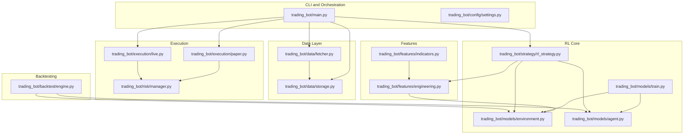
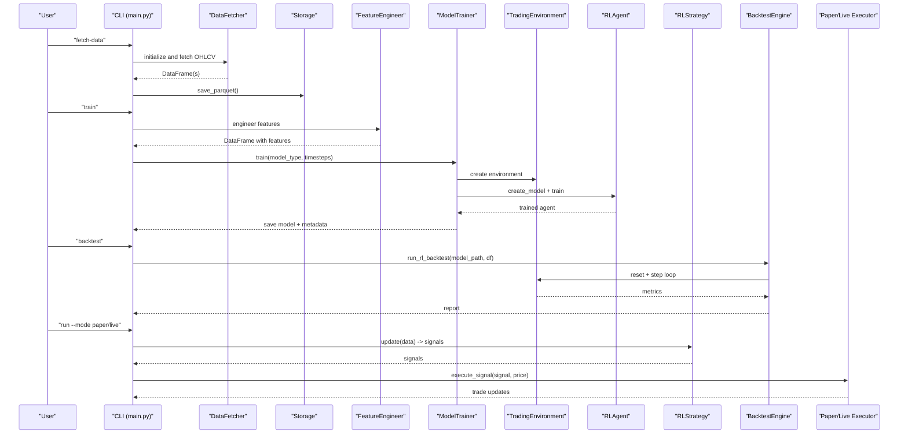
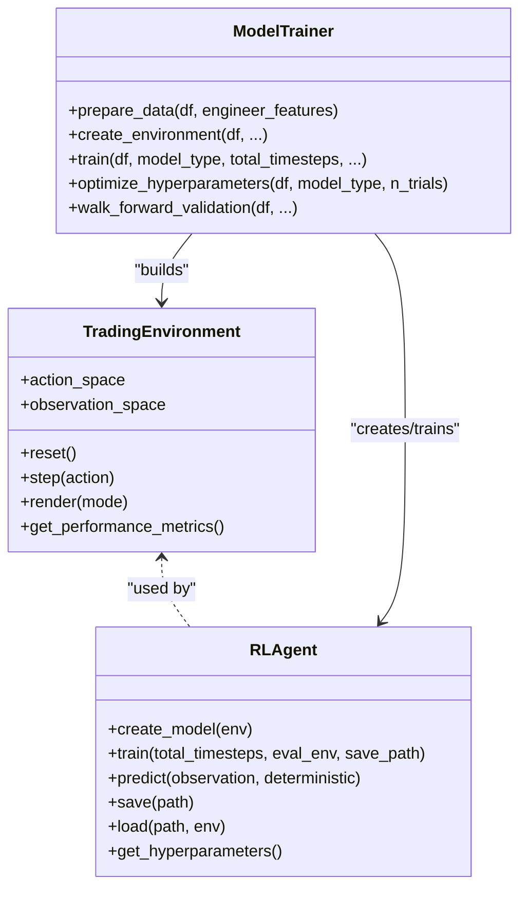
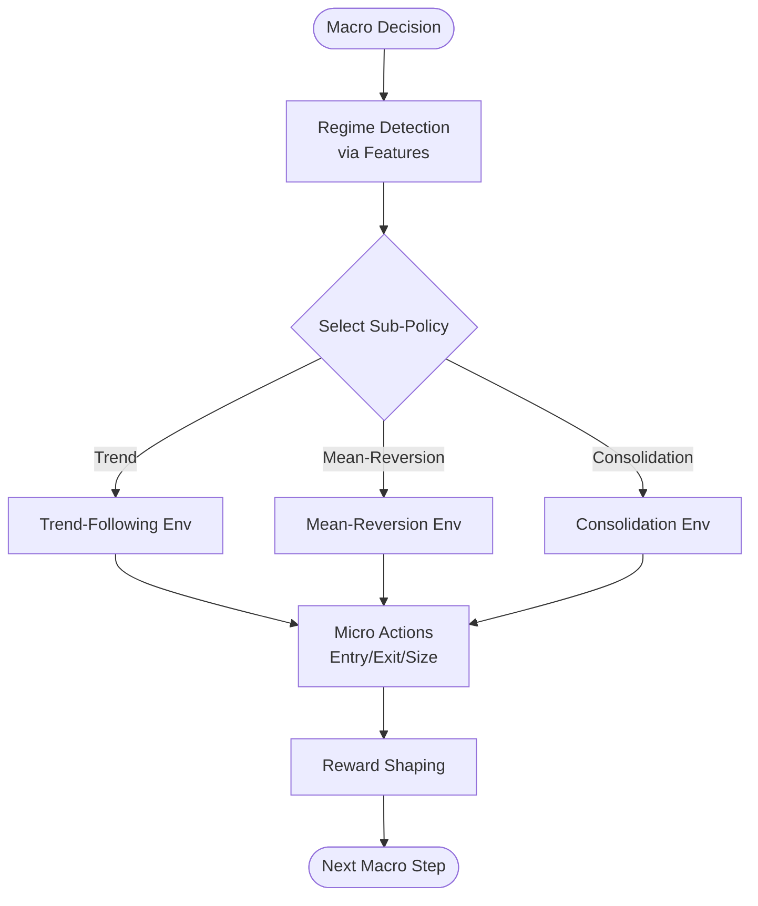
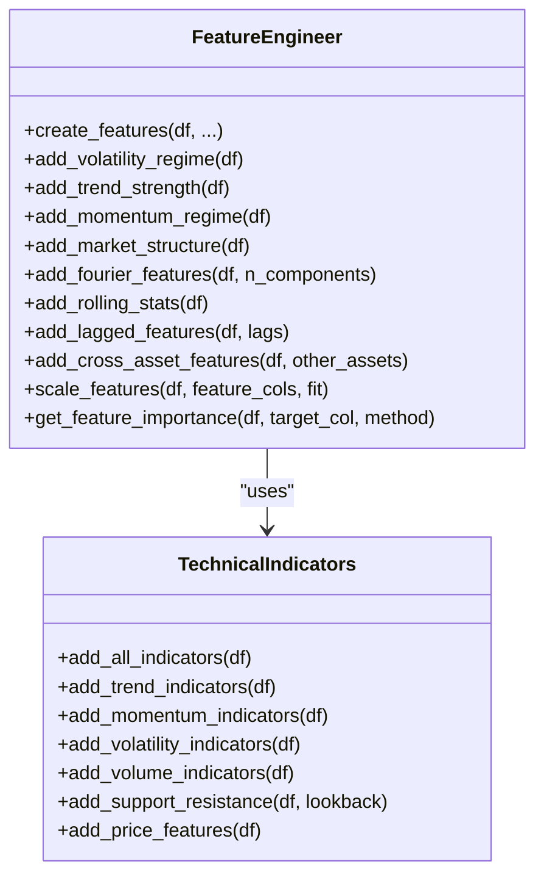
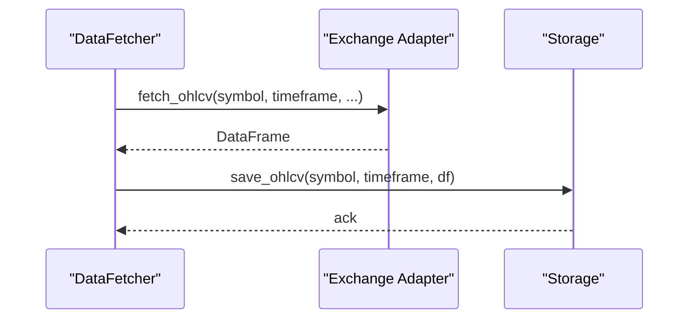
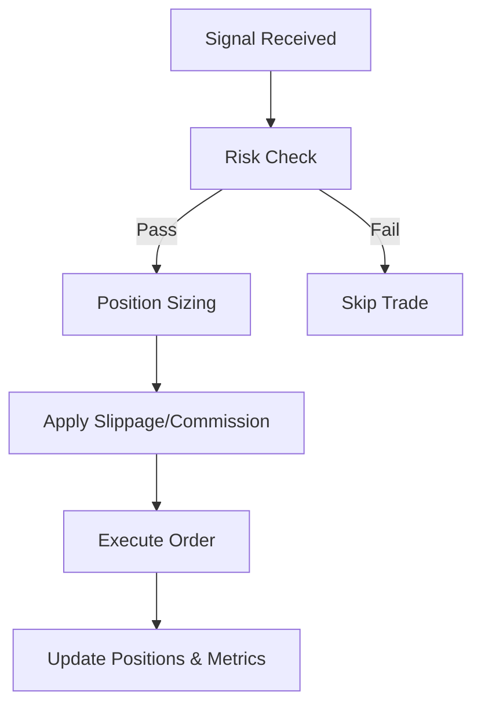
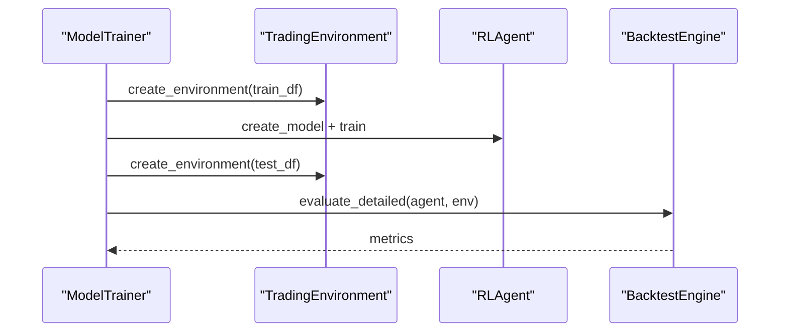
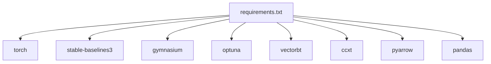

# Research and Extensions

<cite>
**Referenced Files in This Document**
- [README.md](file://README.md)
- [requirements.txt](file://requirements.txt)
- [trading_bot/main.py](file://trading_bot/main.py)
- [trading_bot/config/settings.py](file://trading_bot/config/settings.py)
- [trading_bot/data/fetcher.py](file://trading_bot/data/fetcher.py)
- [trading_bot/data/storage.py](file://trading_bot/data/storage.py)
- [trading_bot/features/indicators.py](file://trading_bot/features/indicators.py)
- [trading_bot/features/engineering.py](file://trading_bot/features/engineering.py)
- [trading_bot/models/environment.py](file://trading_bot/models/environment.py)
- [trading_bot/models/agent.py](file://trading_bot/models/agent.py)
- [trading_bot/models/train.py](file://trading_bot/models/train.py)
- [trading_bot/strategy/base.py](file://trading_bot/strategy/base.py)
- [trading_bot/strategy/rl_strategy.py](file://trading_bot/strategy/rl_strategy.py)
- [trading_bot/backtest/engine.py](file://trading_bot/backtest/engine.py)
- [trading_bot/execution/paper.py](file://trading_bot/execution/paper.py)
- [trading_bot/execution/live.py](file://trading_bot/execution/live.py)
- [trading_bot/risk/manager.py](file://trading_bot/risk/manager.py)
</cite>

## Table of Contents
1. [Introduction](#introduction)
2. [Project Structure](#project-structure)
3. [Core Components](#core-components)
4. [Architecture Overview](#architecture-overview)
5. [Detailed Component Analysis](#detailed-component-analysis)
6. [Dependency Analysis](#dependency-analysis)
7. [Performance Considerations](#performance-considerations)
8. [Troubleshooting Guide](#troubleshooting-guide)
9. [Conclusion](#conclusion)
10. [Appendices](#appendices)

## Introduction
This document presents cutting-edge research extensions and experimental features for advanced users working with the reinforcement learning–driven trading framework. It focuses on advanced RL techniques (multi-agent systems, hierarchical RL, and meta-learning), integration possibilities with external research tools, custom feature engineering pipelines, and novel trading algorithms. It also provides guidance for extending the framework with new data sources, alternative market data providers, and experimental trading mechanisms, alongside academic research integration, experimental deployment strategies, and validation methodologies.

## Project Structure
The repository is organized around a modular, layered architecture supporting RL training, feature engineering, backtesting, and execution. The CLI orchestrates data fetching, training, backtesting, and runtime trading modes.

**Diagram sources**
- [trading_bot/main.py:1-347](file://trading_bot/main.py#L1-L347)
- [trading_bot/config/settings.py:1-176](file://trading_bot/config/settings.py#L1-L176)
- [trading_bot/data/fetcher.py:1-331](file://trading_bot/data/fetcher.py#L1-L331)
- [trading_bot/data/storage.py:1-484](file://trading_bot/data/storage.py#L1-L484)
- [trading_bot/features/indicators.py:1-294](file://trading_bot/features/indicators.py#L1-L294)
- [trading_bot/features/engineering.py:1-442](file://trading_bot/features/engineering.py#L1-L442)
- [trading_bot/models/environment.py:1-405](file://trading_bot/models/environment.py#L1-L405)
- [trading_bot/models/agent.py:1-502](file://trading_bot/models/agent.py#L1-L502)
- [trading_bot/models/train.py:1-446](file://trading_bot/models/train.py#L1-L446)
- [trading_bot/strategy/rl_strategy.py:1-285](file://trading_bot/strategy/rl_strategy.py#L1-L285)
- [trading_bot/backtest/engine.py:1-418](file://trading_bot/backtest/engine.py#L1-L418)
- [trading_bot/execution/paper.py:1-392](file://trading_bot/execution/paper.py#L1-L392)
- [trading_bot/execution/live.py:1-364](file://trading_bot/execution/live.py#L1-L364)
- [trading_bot/risk/manager.py:1-432](file://trading_bot/risk/manager.py#L1-L432)

**Section sources**
- [README.md:1-363](file://README.md#L1-L363)
- [trading_bot/main.py:1-347](file://trading_bot/main.py#L1-L347)
- [trading_bot/config/settings.py:1-176](file://trading_bot/config/settings.py#L1-L176)

## Core Components
- CLI orchestration: Commands for configuration, data fetching, training, backtesting, runtime trading, and dashboard launching.
- Data pipeline: Async CCXT-based fetcher with retry and rate-limiting; Parquet/SQLite persistence.
- Feature engineering: Comprehensive technical indicators and custom features (volatility regimes, trend strength, momentum regime, market structure, Fourier features, rolling stats, lags, cross-asset features).
- RL environment and agent: Gymnasium-compatible environment with realistic reward shaping; PPO/SAC agents with LSTM/Transformer feature extractors and hyperparameter optimization via Optuna.
- Strategies: Base strategy interface and RL-based strategy implementing signal generation and position tracking.
- Execution: Paper trading simulator with slippage/commission modeling and risk manager integration; live executor with exchange connectivity and order lifecycle.
- Backtesting: VectorBT-backed engine plus RL-specific backtesting loop, walk-forward validation, and Monte Carlo simulation.
- Risk management: Position sizing, exposure limits, drawdown controls, and circuit breakers.

**Section sources**
- [trading_bot/main.py:1-347](file://trading_bot/main.py#L1-L347)
- [trading_bot/data/fetcher.py:1-331](file://trading_bot/data/fetcher.py#L1-L331)
- [trading_bot/data/storage.py:1-484](file://trading_bot/data/storage.py#L1-L484)
- [trading_bot/features/engineering.py:1-442](file://trading_bot/features/engineering.py#L1-L442)
- [trading_bot/models/environment.py:1-405](file://trading_bot/models/environment.py#L1-L405)
- [trading_bot/models/agent.py:1-502](file://trading_bot/models/agent.py#L1-L502)
- [trading_bot/models/train.py:1-446](file://trading_bot/models/train.py#L1-L446)
- [trading_bot/strategy/base.py:1-136](file://trading_bot/strategy/base.py#L1-L136)
- [trading_bot/strategy/rl_strategy.py:1-285](file://trading_bot/strategy/rl_strategy.py#L1-L285)
- [trading_bot/backtest/engine.py:1-418](file://trading_bot/backtest/engine.py#L1-L418)
- [trading_bot/execution/paper.py:1-392](file://trading_bot/execution/paper.py#L1-L392)
- [trading_bot/execution/live.py:1-364](file://trading_bot/execution/live.py#L1-L364)
- [trading_bot/risk/manager.py:1-432](file://trading_bot/risk/manager.py#L1-L432)

## Architecture Overview
The system integrates asynchronous data acquisition, robust feature engineering, RL training and evaluation, and realistic execution simulation. The CLI coordinates end-to-end workflows.

**Diagram sources**
- [trading_bot/main.py:68-212](file://trading_bot/main.py#L68-L212)
- [trading_bot/data/fetcher.py:106-275](file://trading_bot/data/fetcher.py#L106-L275)
- [trading_bot/data/storage.py:71-160](file://trading_bot/data/storage.py#L71-L160)
- [trading_bot/features/engineering.py:31-85](file://trading_bot/features/engineering.py#L31-L85)
- [trading_bot/models/train.py:99-185](file://trading_bot/models/train.py#L99-L185)
- [trading_bot/models/environment.py:105-250](file://trading_bot/models/environment.py#L105-L250)
- [trading_bot/models/agent.py:274-447](file://trading_bot/models/agent.py#L274-L447)
- [trading_bot/strategy/rl_strategy.py:182-221](file://trading_bot/strategy/rl_strategy.py#L182-L221)
- [trading_bot/backtest/engine.py:147-240](file://trading_bot/backtest/engine.py#L147-L240)
- [trading_bot/execution/paper.py:115-208](file://trading_bot/execution/paper.py#L115-L208)
- [trading_bot/execution/live.py:115-223](file://trading_bot/execution/live.py#L115-L223)

## Detailed Component Analysis

### Advanced RL Techniques and Experimental Extensions

#### Multi-Agent Systems
- Motivation: Deploy multiple specialized agents (e.g., trend-following, mean-reversion, volatility timing) operating on shared environments or independent submarkets.
- Implementation hooks:
  - Extend the environment to support joint actions and shared state among agents.
  - Introduce agent coordination via shared buffers or attention mechanisms.
  - Use vectorized environments to simulate multiple agents concurrently.
- Architectural notes:
  - The environment’s action space and observation space can be expanded to accommodate multiple agents’ inputs/outputs.
  - The agent wrapper supports custom feature extractors; extend to multi-agent architectures (e.g., attention-based encoders).
- Validation:
  - Use walk-forward validation to compare single-agent vs. multi-agent performance under out-of-sample conditions.

**Diagram sources**
- [trading_bot/models/environment.py:15-104](file://trading_bot/models/environment.py#L15-L104)
- [trading_bot/models/agent.py:206-273](file://trading_bot/models/agent.py#L206-L273)
- [trading_bot/models/train.py:23-98](file://trading_bot/models/train.py#L23-L98)

**Section sources**
- [trading_bot/models/environment.py:72-87](file://trading_bot/models/environment.py#L72-L87)
- [trading_bot/models/agent.py:27-98](file://trading_bot/models/agent.py#L27-L98)
- [trading_bot/models/train.py:310-383](file://trading_bot/models/train.py#L310-L383)

#### Hierarchical Reinforcement Learning (HRL)
- Motivation: Decompose trading into macro/micro decision layers (e.g., regime classification → position sizing → entry/exit).
- Implementation hooks:
  - Macro-level: Use a discrete or continuous higher-level policy to select sub-policies (e.g., trend-following vs. mean-reversion).
  - Micro-level: Train sub-policies in separate environments with curriculum or transfer learning.
  - Shared feature representation: Use the existing feature engineering pipeline as input to both macro and micro policies.
- Validation:
  - Evaluate macro policy stability using sliding-window performance comparisons across market regimes.

[No sources needed since this diagram shows conceptual workflow, not actual code structure]

**Section sources**
- [trading_bot/features/engineering.py:87-129](file://trading_bot/features/engineering.py#L87-L129)
- [trading_bot/models/environment.py:306-347](file://trading_bot/models/environment.py#L306-L347)

#### Meta-Learning Approaches
- Motivation: Adapt quickly to changing market regimes by learning to learn (e.g., few-shot adaptation of feature importance or reward shaping).
- Implementation hooks:
  - Use the feature importance module to dynamically prune or weight features per regime.
  - Employ online continual fine-tuning of the agent on recent market segments.
  - Integrate Bayesian optimization for fast hyperparameter adaptation.
- Validation:
  - Compare adaptation speed and final performance against static models using walk-forward folds.

**Section sources**
- [trading_bot/features/engineering.py:406-442](file://trading_bot/features/engineering.py#L406-L442)
- [trading_bot/models/train.py:187-244](file://trading_bot/models/train.py#L187-L244)

### Feature Engineering Pipelines and Novel Algorithms
- Extending feature engineering:
  - Add domain-specific factors (e.g., sentiment proxies, macro indicators) via cross-asset features.
  - Incorporate deep learning embeddings for categorical instruments or sectors.
  - Develop dynamic feature selection and adaptive scaling routines.
- Novel trading algorithms:
  - Ensemble RL agents with gating based on regime probabilities.
  - Integrate uncertainty-aware policies (e.g., quantile regression or distributional RL).
  - Implement policy distillation from larger models to speed up inference.

**Diagram sources**
- [trading_bot/features/engineering.py:17-85](file://trading_bot/features/engineering.py#L17-L85)
- [trading_bot/features/indicators.py:13-46](file://trading_bot/features/indicators.py#L13-L46)

**Section sources**
- [trading_bot/features/engineering.py:31-85](file://trading_bot/features/engineering.py#L31-L85)
- [trading_bot/features/indicators.py:20-46](file://trading_bot/features/indicators.py#L20-L46)

### Integration Possibilities with External Research Tools
- VectorBT: Leverage vectorized backtesting for comparative analysis and performance benchmarking.
- Optuna: Use for efficient hyperparameter optimization and pruning strategies.
- SHAP: Explain agent decisions and feature contributions post-training.
- PyTorch Lightning/PyTorch Geometric: For advanced architectures (e.g., graph neural networks for cross-asset relationships).
- Ray RLlib/ACME: For distributed training and advanced RL libraries.

**Section sources**
- [trading_bot/backtest/engine.py:63-145](file://trading_bot/backtest/engine.py#L63-L145)
- [trading_bot/models/train.py:187-244](file://trading_bot/models/train.py#L187-L244)
- [requirements.txt:22-29](file://requirements.txt#L22-L29)

### Extending Data Sources and Alternative Market Data Providers
- Current provider: CCXT-based async fetcher with retry and rate limiting.
- Extension points:
  - Add new exchange adapters by implementing async fetchers with the same interface.
  - Integrate streaming feeds (e.g., WebSockets) for real-time updates and caching.
  - Support alternative data formats (e.g., CSV, HDF5, Kafka) via storage adapters.
- Operational considerations:
  - Ensure consistent timestamp handling and deduplication.
  - Implement fallback strategies and graceful degradation.

**Diagram sources**
- [trading_bot/data/fetcher.py:111-164](file://trading_bot/data/fetcher.py#L111-L164)
- [trading_bot/data/storage.py:71-117](file://trading_bot/data/storage.py#L71-L117)

**Section sources**
- [trading_bot/data/fetcher.py:32-105](file://trading_bot/data/fetcher.py#L32-L105)
- [trading_bot/data/storage.py:53-117](file://trading_bot/data/storage.py#L53-L117)

### Experimental Trading Mechanisms
- Slippage and latency modeling: Paper executor supports fixed/variable slippage and realistic commission modeling.
- Risk controls: Circuit breakers, drawdown caps, and position sizing integrated across execution modes.
- Order types and lifecycle: Live executor supports market/limit orders with rate limiting and order synchronization.

**Diagram sources**
- [trading_bot/execution/paper.py:115-208](file://trading_bot/execution/paper.py#L115-L208)
- [trading_bot/execution/live.py:115-223](file://trading_bot/execution/live.py#L115-L223)
- [trading_bot/risk/manager.py:102-148](file://trading_bot/risk/manager.py#L102-L148)

**Section sources**
- [trading_bot/execution/paper.py:76-114](file://trading_bot/execution/paper.py#L76-L114)
- [trading_bot/execution/live.py:95-114](file://trading_bot/execution/live.py#L95-L114)
- [trading_bot/risk/manager.py:299-321](file://trading_bot/risk/manager.py#L299-L321)

### Academic Research Integration and Validation Methodologies
- Walk-forward validation: Systematic out-of-sample testing across rolling windows.
- Monte Carlo simulation: Probabilistic risk assessment of portfolio outcomes.
- Backtest reporting: Comprehensive metrics including Sharpe, Sortino, Calmar, drawdowns, and trade statistics.
- Hyperparameter optimization: Automated tuning with pruning and study persistence.

**Diagram sources**
- [trading_bot/models/train.py:310-383](file://trading_bot/models/train.py#L310-L383)
- [trading_bot/backtest/engine.py:385-407](file://trading_bot/backtest/engine.py#L385-L407)

**Section sources**
- [trading_bot/models/train.py:310-383](file://trading_bot/models/train.py#L310-L383)
- [trading_bot/backtest/engine.py:297-356](file://trading_bot/backtest/engine.py#L297-L356)

## Dependency Analysis
The system relies on a cohesive set of libraries enabling RL, data processing, and analysis.

**Diagram sources**
- [requirements.txt:1-46](file://requirements.txt#L1-L46)

**Section sources**
- [requirements.txt:1-46](file://requirements.txt#L1-L46)

## Performance Considerations
- Data I/O: Prefer Parquet for large-scale OHLCV storage; use chunked reads and incremental updates.
- Feature computation: Cache engineered features; avoid recomputation by storing feature names and metadata.
- Training: Use vectorized environments and appropriate batch sizes; tune observation window to balance memory and signal delay.
- Execution: Implement rate limiting and order throttling; model slippage conservatively.
- Backtesting: VectorBT accelerates simulations; combine with walk-forward to mitigate lookahead bias.

[No sources needed since this section provides general guidance]

## Troubleshooting Guide
- Data fetching failures: Verify API credentials and testnet settings; inspect retry logs and rate-limit exceptions.
- Model loading issues: Confirm model type matches saved agent and environment compatibility.
- Risk control triggers: Review daily drawdown thresholds and position limits; adjust parameters cautiously.
- Backtest discrepancies: Ensure identical preprocessing and reward shaping between training and backtesting.

**Section sources**
- [trading_bot/data/fetcher.py:106-164](file://trading_bot/data/fetcher.py#L106-L164)
- [trading_bot/models/agent.py:448-461](file://trading_bot/models/agent.py#L448-L461)
- [trading_bot/risk/manager.py:299-321](file://trading_bot/risk/manager.py#L299-L321)

## Conclusion
This framework provides a solid foundation for advanced RL research in trading, with modular components for data, features, RL, execution, and validation. Advanced users can extend it with multi-agent designs, hierarchical policies, meta-learning, and novel algorithms while maintaining rigorous validation and risk controls.

[No sources needed since this section summarizes without analyzing specific files]

## Appendices

### Appendix A: CLI Workflows for Research
- Data fetching and storage: Use the CLI to collect and persist OHLCV datasets for experimentation.
- Training with optimization: Enable hyperparameter optimization and save model artifacts with metadata.
- Backtesting and reporting: Generate comprehensive reports and export walk-forward results.
- Runtime trading: Validate strategies in paper mode before live deployment.

**Section sources**
- [trading_bot/main.py:68-212](file://trading_bot/main.py#L68-L212)
- [trading_bot/models/train.py:99-185](file://trading_bot/models/train.py#L99-L185)
- [trading_bot/backtest/engine.py:358-417](file://trading_bot/backtest/engine.py#L358-L417)