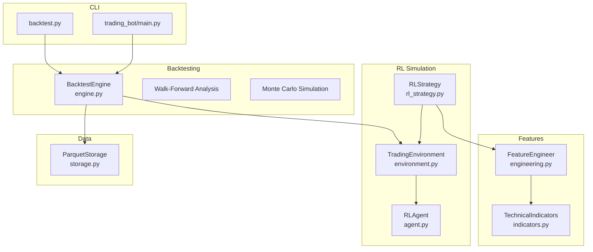
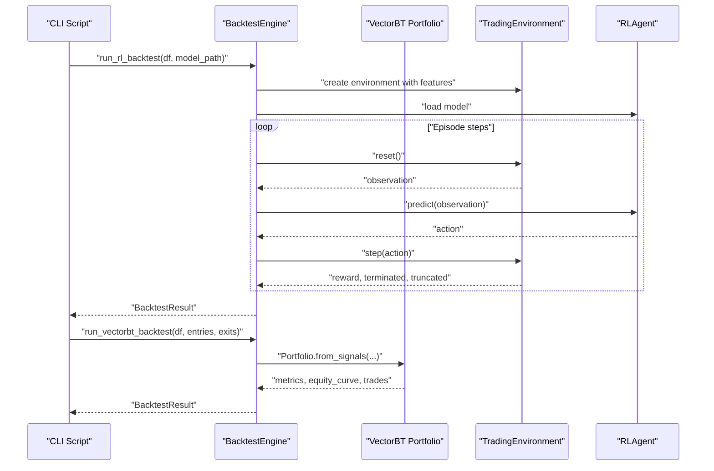
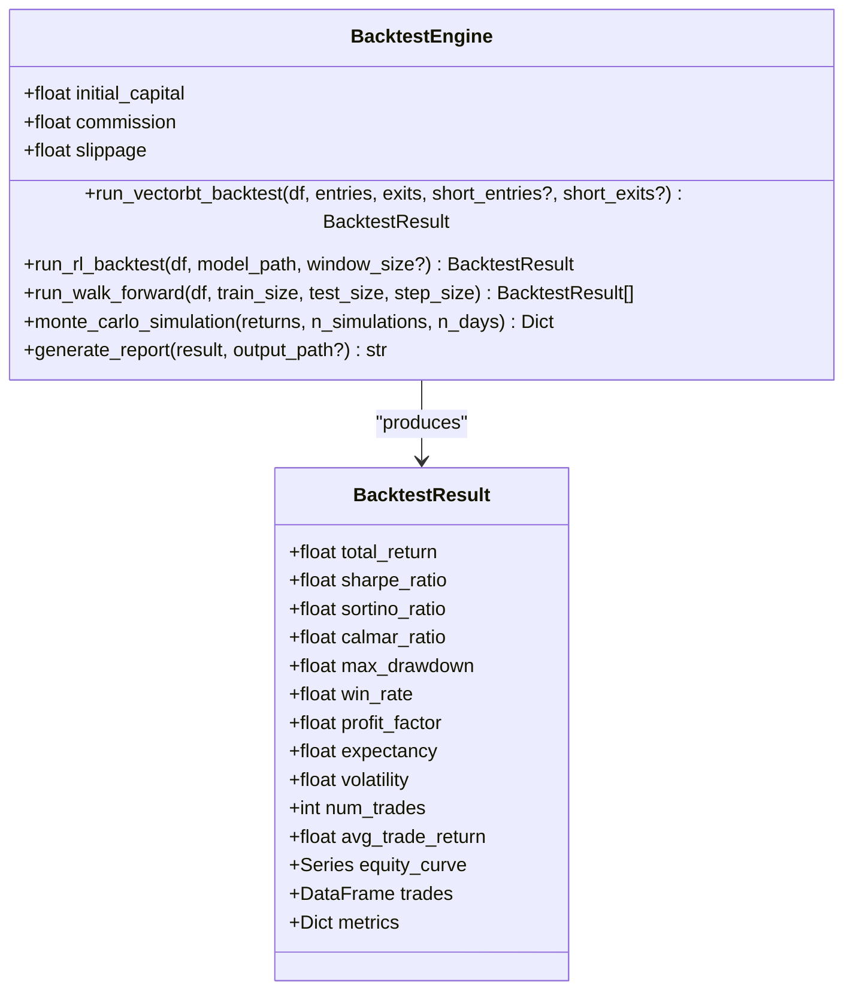
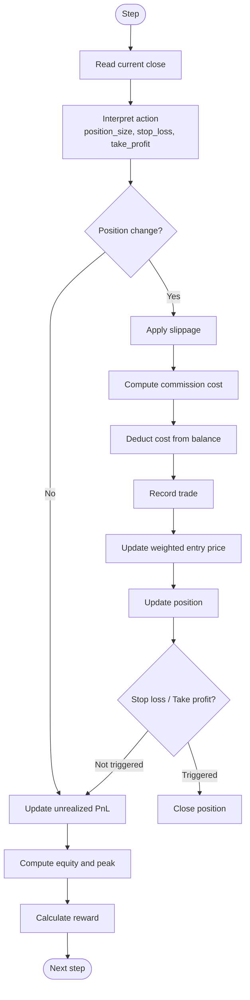
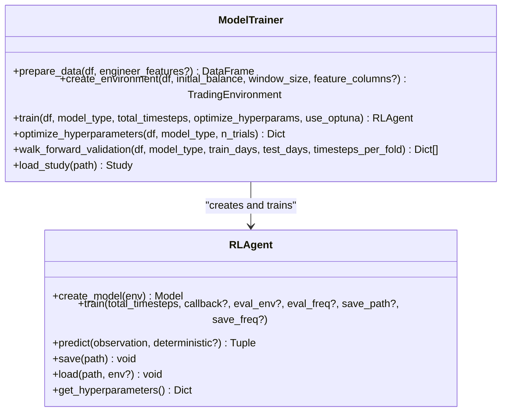
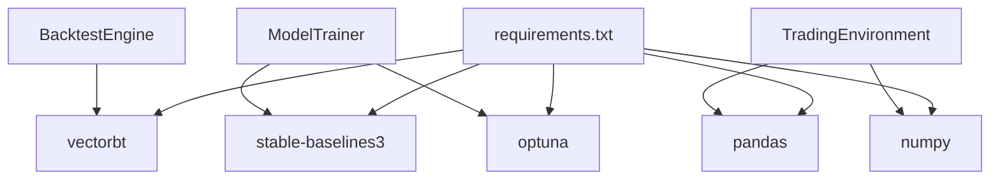

# Backtesting Framework

<cite>
**Referenced Files in This Document**
- [engine.py](file://trading_bot/backtest/engine.py)
- [backtest.py](file://backtest.py)
- [main.py](file://trading_bot/main.py)
- [environment.py](file://trading_bot/models/environment.py)
- [agent.py](file://trading_bot/models/agent.py)
- [rl_strategy.py](file://trading_bot/strategy/rl_strategy.py)
- [engineering.py](file://trading_bot/features/engineering.py)
- [indicators.py](file://trading_bot/features/indicators.py)
- [storage.py](file://trading_bot/data/storage.py)
- [train.py](file://trading_bot/models/train.py)
- [requirements.txt](file://requirements.txt)
- [README.md](file://README.md)
</cite>

## Table of Contents
1. [Introduction](#introduction)
2. [Project Structure](#project-structure)
3. [Core Components](#core-components)
4. [Architecture Overview](#architecture-overview)
5. [Detailed Component Analysis](#detailed-component-analysis)
6. [Dependency Analysis](#dependency-analysis)
7. [Performance Considerations](#performance-considerations)
8. [Troubleshooting Guide](#troubleshooting-guide)
9. [Conclusion](#conclusion)
10. [Appendices](#appendices)

## Introduction
This document provides comprehensive documentation for the AI Trading Bot’s backtesting framework. It explains how the system integrates VectorBT for fast vectorized backtesting, simulates realistic trading conditions with slippage, fees, and latency, and supports advanced analysis techniques such as walk-forward analysis and Monte Carlo simulation. It also covers configuration, result interpretation, and comparison methodologies, along with practical workflows for parameter optimization and performance analysis.

## Project Structure
The backtesting framework spans several modules:
- Backtest engine: orchestrates vectorized and RL-based backtests, walk-forward analysis, and Monte Carlo simulation.
- RL environment and agent: define a Gymnasium environment with slippage and fees, and provide an RL agent wrapper.
- Feature engineering: generates technical indicators and custom features for robust training and backtesting.
- Data storage: loads OHLCV data from Parquet for consistent backtests.
- CLI entry points: command-line scripts for running backtests and generating reports.

**Diagram sources**
- [engine.py:41-418](file://trading_bot/backtest/engine.py#L41-L418)
- [environment.py:15-405](file://trading_bot/models/environment.py#L15-L405)
- [agent.py:206-483](file://trading_bot/models/agent.py#L206-L483)
- [rl_strategy.py:19-285](file://trading_bot/strategy/rl_strategy.py#L19-L285)
- [engineering.py:17-442](file://trading_bot/features/engineering.py#L17-L442)
- [indicators.py:14-332](file://trading_bot/features/indicators.py#L14-L332)
- [storage.py:53-198](file://trading_bot/data/storage.py#L53-L198)
- [backtest.py:16-110](file://backtest.py#L16-L110)
- [main.py:160-212](file://trading_bot/main.py#L160-L212)

**Section sources**
- [README.md:198-232](file://README.md#L198-L232)
- [requirements.txt:28-29](file://requirements.txt#L28-L29)

## Core Components
- BacktestEngine: central orchestrator for vectorized and RL backtests, walk-forward analysis, Monte Carlo simulation, and reporting.
- TradingEnvironment: Gymnasium environment that models slippage, fees, and position management with realistic constraints.
- RLAgent: wrapper around Stable-Baselines3 agents with optional LSTM/Transformer feature extractors.
- FeatureEngineer and TechnicalIndicators: generate rich feature sets for both training and backtesting.
- Data storage: Parquet-backed storage for OHLCV data with deduplication and efficient retrieval.
- CLI entry points: scripts to run backtests and generate reports.

Key capabilities:
- VectorBT-based portfolio simulation with entry/exit signals, fees, and slippage.
- RL-based backtests using a custom Gymnasium environment with slippage and fees.
- Walk-forward analysis for out-of-sample validation.
- Monte Carlo simulation for probabilistic risk assessment.
- Comprehensive performance metrics including Sharpe, Sortino, Calmar ratios, and maximum drawdown.

**Section sources**
- [engine.py:41-418](file://trading_bot/backtest/engine.py#L41-L418)
- [environment.py:15-405](file://trading_bot/models/environment.py#L15-L405)
- [agent.py:206-483](file://trading_bot/models/agent.py#L206-L483)
- [engineering.py:17-442](file://trading_bot/features/engineering.py#L17-L442)
- [indicators.py:14-332](file://trading_bot/features/indicators.py#L14-L332)
- [storage.py:53-198](file://trading_bot/data/storage.py#L53-L198)
- [backtest.py:16-110](file://backtest.py#L16-L110)
- [main.py:160-212](file://trading_bot/main.py#L160-L212)

## Architecture Overview
The backtesting architecture combines vectorized signal-based backtesting via VectorBT and RL-driven simulation via a custom Gymnasium environment. Both paths produce standardized performance metrics and equity curves for comparison.

**Diagram sources**
- [engine.py:147-240](file://trading_bot/backtest/engine.py#L147-L240)
- [engine.py:63-145](file://trading_bot/backtest/engine.py#L63-L145)
- [environment.py:134-250](file://trading_bot/models/environment.py#L134-L250)
- [agent.py:415-434](file://trading_bot/models/agent.py#L415-L434)

## Detailed Component Analysis

### BacktestEngine
The engine encapsulates:
- VectorBT-based backtests: converts entry/exit signals into portfolio performance with fees and slippage.
- RL-based backtests: runs a full episode in the Gymnasium environment using a trained RL agent.
- Walk-forward analysis: iteratively trains on expanding windows and evaluates on subsequent windows.
- Monte Carlo simulation: generates random return paths to estimate distributional outcomes.
- Reporting: produces human-readable reports with performance metrics and equity curve summaries.

**Diagram sources**
- [engine.py:41-145](file://trading_bot/backtest/engine.py#L41-L145)
- [engine.py:22-39](file://trading_bot/backtest/engine.py#L22-L39)

Key implementation highlights:
- VectorBT integration constructs a portfolio from entry/exit signals and computes comprehensive metrics.
- RL backtest uses a prepared feature set and environment to simulate realistic trading with slippage and fees.
- Walk-forward analysis uses simple moving average crossovers as example signals; in practice, replace with trained model predictions.
- Monte Carlo simulation generates random normal returns, computes equity curves, and derives percentiles for risk metrics.

**Section sources**
- [engine.py:41-418](file://trading_bot/backtest/engine.py#L41-L418)

### TradingEnvironment (RL Simulation)
The environment models:
- Slippage applied on entry/exit decisions.
- Transaction costs proportional to trade value.
- Position sizing constraints and stop-loss/take-profit logic.
- Real-time equity curve updates and drawdown tracking.
- Reward shaping that balances returns, risk-adjustment, and penalties for drawdown and overtrading.

**Diagram sources**
- [environment.py:134-250](file://trading_bot/models/environment.py#L134-L250)

**Section sources**
- [environment.py:15-405](file://trading_bot/models/environment.py#L15-L405)

### RLAgent and ModelTrainer
- RLAgent wraps Stable-Baselines3 PPO/SAC agents, supports custom feature extractors (LSTM/Transformer), and exposes training and prediction APIs.
- ModelTrainer handles feature preparation, environment creation, hyperparameter optimization with Optuna, walk-forward validation, and saving model artifacts with metadata.

**Diagram sources**
- [agent.py:206-483](file://trading_bot/models/agent.py#L206-L483)
- [train.py:23-446](file://trading_bot/models/train.py#L23-L446)

**Section sources**
- [agent.py:206-483](file://trading_bot/models/agent.py#L206-L483)
- [train.py:23-446](file://trading_bot/models/train.py#L23-L446)

### Feature Engineering
FeatureEngineer and TechnicalIndicators provide:
- Trend, momentum, volatility, and volume indicators.
- Custom features such as volatility regimes, trend strength, momentum regime, market structure, and Fourier components.
- Rolling statistics and lagged features.
- Cross-asset correlation and beta features.

These features power both training and backtesting pipelines, ensuring consistency between model inputs and backtest inputs.

**Section sources**
- [engineering.py:17-442](file://trading_bot/features/engineering.py#L17-L442)
- [indicators.py:14-332](file://trading_bot/features/indicators.py#L14-L332)

### Data Storage
ParquetStorage efficiently stores and retrieves OHLCV data, deduplicating timestamps and supporting filtering by date ranges. This ensures reproducible backtests using identical datasets.

**Section sources**
- [storage.py:53-198](file://trading_bot/data/storage.py#L53-L198)

### CLI Integration
Two entry points support backtesting:
- standalone script: loads data, runs RL backtest, prints summary, saves report, optionally runs walk-forward and Monte Carlo.
- main CLI: integrates with the broader trading bot ecosystem, exposing commands for configuration, data fetching, training, and backtesting.

**Section sources**
- [backtest.py:16-110](file://backtest.py#L16-L110)
- [main.py:160-212](file://trading_bot/main.py#L160-L212)

## Dependency Analysis
The backtesting framework relies on:
- VectorBT for fast vectorized portfolio construction and metric computation.
- Stable-Baselines3 for RL agent training and inference.
- Optuna for hyperparameter optimization.
- Pandas and NumPy for data manipulation and Monte Carlo sampling.

**Diagram sources**
- [requirements.txt:28-29](file://requirements.txt#L28-L29)
- [requirements.txt:21-26](file://requirements.txt#L21-L26)
- [engine.py:10-10](file://trading_bot/backtest/engine.py#L10-L10)
- [train.py:10-12](file://trading_bot/models/train.py#L10-L12)

**Section sources**
- [requirements.txt:1-46](file://requirements.txt#L1-L46)

## Performance Considerations
- VectorBT backtests are computationally efficient for large datasets and multiple assets.
- RL backtests simulate realistic slippage and fees but are slower due to environment stepping.
- Monte Carlo simulations scale with the number of simulations and days; adjust for compute constraints.
- Feature engineering adds richness but increases compute time; consider caching engineered datasets.

[No sources needed since this section provides general guidance]

## Troubleshooting Guide
Common issues and resolutions:
- Empty or missing data: ensure Parquet files exist and contain data for the requested symbol/timeframe.
- Model loading failures: verify model path and format compatibility.
- Insufficient data for walk-forward: ensure dataset spans sufficient historical periods.
- Memory pressure during RL backtests: reduce window size or observation dimensionality.

**Section sources**
- [storage.py:118-167](file://trading_bot/data/storage.py#L118-L167)
- [engine.py:147-240](file://trading_bot/backtest/engine.py#L147-L240)

## Conclusion
The backtesting framework integrates VectorBT for fast, vectorized signal-based backtests and a custom RL environment for realistic simulation with slippage, fees, and position constraints. It supports walk-forward analysis and Monte Carlo simulation, delivering comprehensive performance metrics suitable for rigorous strategy evaluation and optimization.

[No sources needed since this section summarizes without analyzing specific files]

## Appendices

### Backtest Configuration
- Initial capital, commission, and slippage are configurable in the backtest engine.
- CLI arguments enable specifying model path, data path, symbol, output directory, and toggling walk-forward and Monte Carlo modes.

**Section sources**
- [engine.py:44-59](file://trading_bot/backtest/engine.py#L44-L59)
- [backtest.py:16-25](file://backtest.py#L16-L25)

### Practical Workflows
- VectorBT backtest: prepare OHLCV and signals, run vectorized backtest, interpret metrics, and generate report.
- RL backtest: engineer features, load trained model, run episode in environment, collect metrics, and compare with vectorized results.
- Walk-forward: iterate over expanding training windows and evaluate on subsequent windows; aggregate fold metrics.
- Monte Carlo: compute distributional outcomes for final returns and drawdowns under parametric assumptions.

**Section sources**
- [engine.py:63-145](file://trading_bot/backtest/engine.py#L63-L145)
- [engine.py:147-240](file://trading_bot/backtest/engine.py#L147-L240)
- [engine.py:242-295](file://trading_bot/backtest/engine.py#L242-L295)
- [engine.py:297-356](file://trading_bot/backtest/engine.py#L297-L356)

### Parameter Optimization
- Use ModelTrainer with Optuna to optimize hyperparameters for PPO/SAC agents.
- Perform walk-forward validation to assess out-of-sample stability.

**Section sources**
- [train.py:187-244](file://trading_bot/models/train.py#L187-L244)
- [train.py:310-383](file://trading_bot/models/train.py#L310-L383)

### Performance Metrics Reference
- Total return, Sharpe ratio, Sortino ratio, Calmar ratio, maximum drawdown, volatility, win rate, profit factor, expectancy, and trade statistics are computed and reported.

**Section sources**
- [engine.py:108-144](file://trading_bot/backtest/engine.py#L108-L144)
- [engine.py:225-240](file://trading_bot/backtest/engine.py#L225-L240)
- [environment.py:364-404](file://trading_bot/models/environment.py#L364-L404)