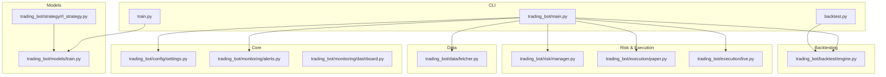
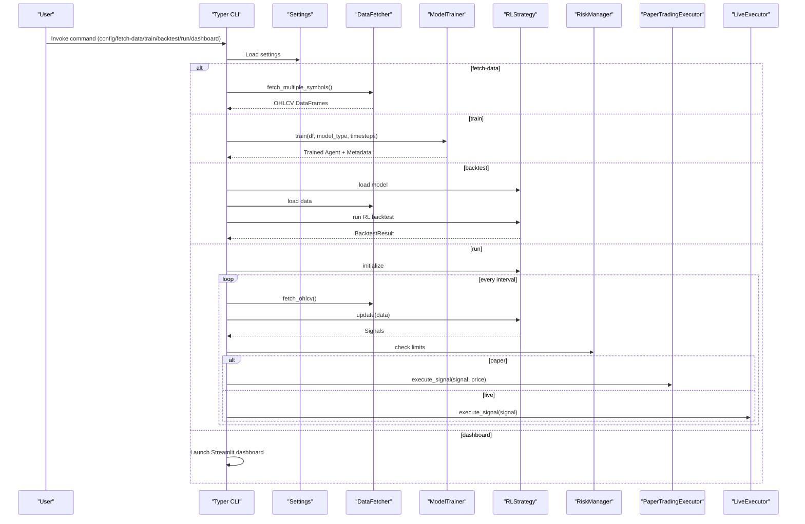
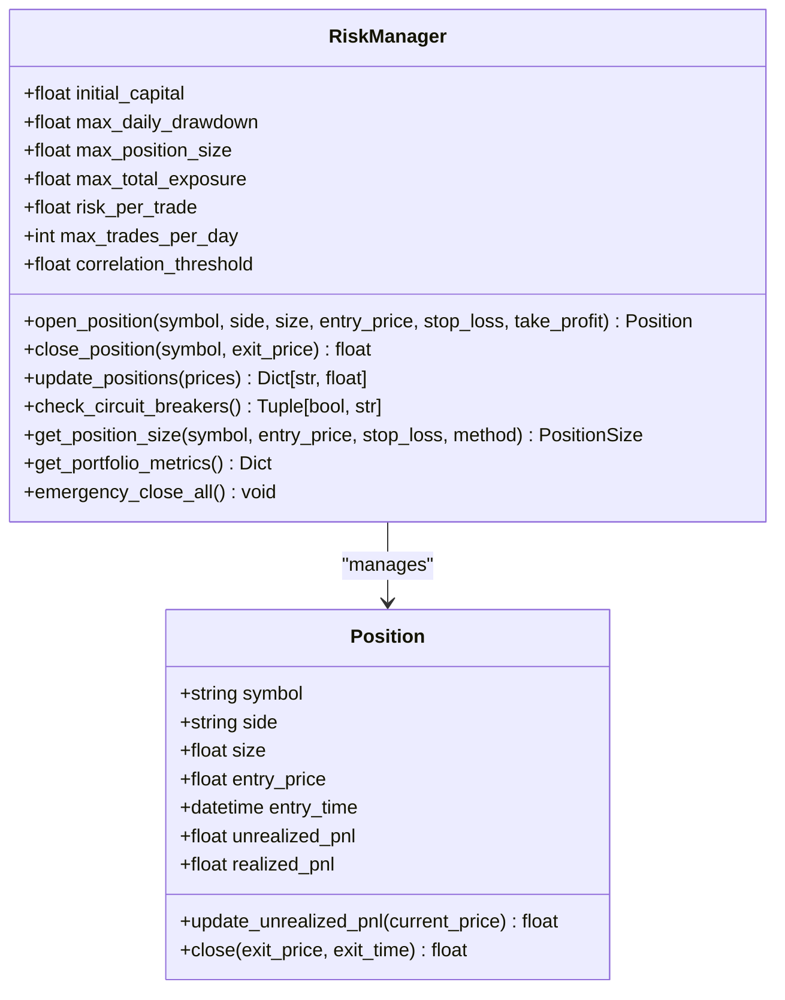
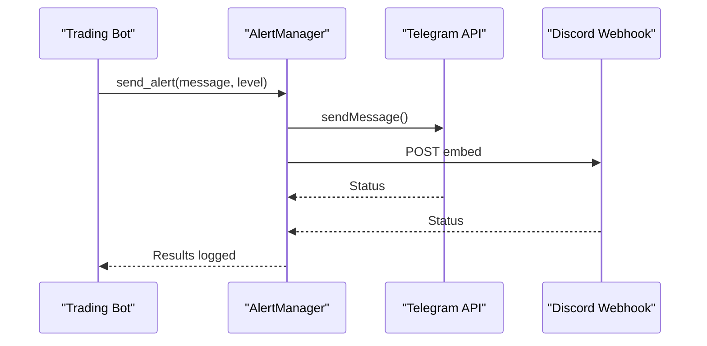
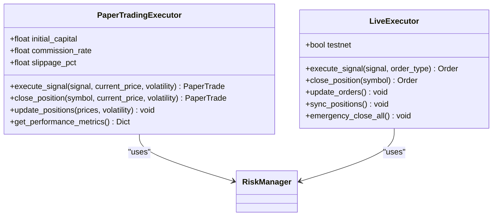
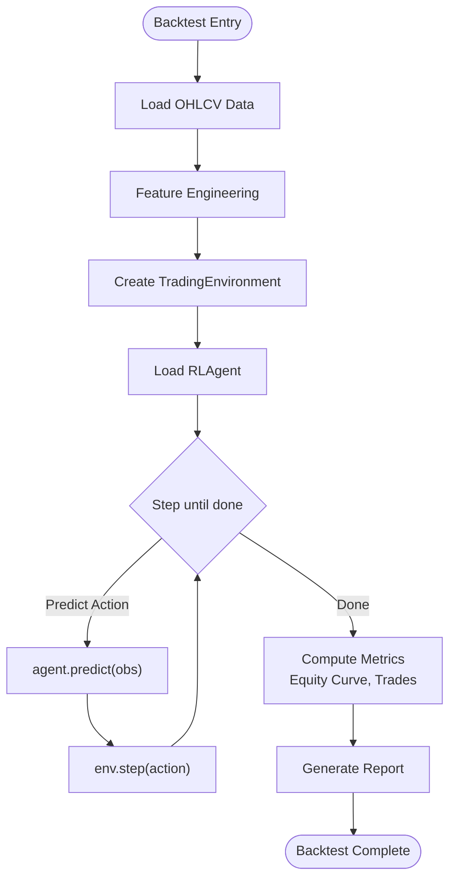

# CLI and API Reference

<cite>
**Referenced Files in This Document**
- [README.md](file://README.md)
- [trading_bot/main.py](file://trading_bot/main.py)
- [backtest.py](file://backtest.py)
- [train.py](file://train.py)
- [trading_bot/config/settings.py](file://trading_bot/config/settings.py)
- [trading_bot/monitoring/dashboard.py](file://trading_bot/monitoring/dashboard.py)
- [trading_bot/risk/manager.py](file://trading_bot/risk/manager.py)
- [trading_bot/execution/live.py](file://trading_bot/execution/live.py)
- [trading_bot/execution/paper.py](file://trading_bot/execution/paper.py)
- [trading_bot/backtest/engine.py](file://trading_bot/backtest/engine.py)
- [trading_bot/models/train.py](file://trading_bot/models/train.py)
- [trading_bot/strategy/rl_strategy.py](file://trading_bot/strategy/rl_strategy.py)
- [trading_bot/data/fetcher.py](file://trading_bot/data/fetcher.py)
- [trading_bot/monitoring/alerts.py](file://trading_bot/monitoring/alerts.py)
- [requirements.txt](file://requirements.txt)
</cite>

## Table of Contents
1. [Introduction](#introduction)
2. [Project Structure](#project-structure)
3. [Core Components](#core-components)
4. [Architecture Overview](#architecture-overview)
5. [Detailed Component Analysis](#detailed-component-analysis)
6. [Dependency Analysis](#dependency-analysis)
7. [Performance Considerations](#performance-considerations)
8. [Troubleshooting Guide](#troubleshooting-guide)
9. [Conclusion](#conclusion)
10. [Appendices](#appendices)

## Introduction
This document provides a comprehensive CLI and API reference for the AI Trading Bot. It covers:
- Command-line interface commands for configuration display, data fetching, model training, backtesting, paper trading, live trading, and dashboard launching
- Internal APIs for configuration, risk management, and monitoring
- Practical workflows, automation patterns, and programmatic access approaches

The CLI is built with Typer and supports both a module entry point and dedicated scripts for training and backtesting. Configuration is centralized via Pydantic settings loaded from environment variables. Risk management and execution engines support both paper and live trading modes. A Streamlit dashboard visualizes performance metrics and trade history.

## Project Structure
The repository organizes functionality by domain:
- CLI entry point and commands
- Data fetching and storage
- Feature engineering and indicators
- Model training and RL agents
- Risk management and position sizing
- Strategy orchestration (RL-based)
- Execution engines (paper and live)
- Backtesting engine
- Monitoring and alerts
- Configuration and logging

**Diagram sources**
- [trading_bot/main.py:1-347](file://trading_bot/main.py#L1-L347)
- [train.py:1-101](file://train.py#L1-L101)
- [backtest.py:1-110](file://backtest.py#L1-L110)
- [trading_bot/config/settings.py:1-176](file://trading_bot/config/settings.py#L1-L176)
- [trading_bot/monitoring/alerts.py:1-311](file://trading_bot/monitoring/alerts.py#L1-L311)
- [trading_bot/monitoring/dashboard.py:1-328](file://trading_bot/monitoring/dashboard.py#L1-L328)
- [trading_bot/data/fetcher.py:1-331](file://trading_bot/data/fetcher.py#L1-L331)
- [trading_bot/risk/manager.py:1-432](file://trading_bot/risk/manager.py#L1-L432)
- [trading_bot/execution/paper.py:1-392](file://trading_bot/execution/paper.py#L1-L392)
- [trading_bot/execution/live.py:1-364](file://trading_bot/execution/live.py#L1-L364)
- [trading_bot/backtest/engine.py:1-418](file://trading_bot/backtest/engine.py#L1-L418)
- [trading_bot/models/train.py:1-446](file://trading_bot/models/train.py#L1-L446)
- [trading_bot/strategy/rl_strategy.py:1-285](file://trading_bot/strategy/rl_strategy.py#L1-L285)

**Section sources**
- [README.md:198-231](file://README.md#L198-L231)

## Core Components
- CLI entry point: Typer-based commands for config, data fetch, train, backtest, run, and dashboard
- Dedicated scripts: train.py and backtest.py for training and backtesting workflows
- Configuration: Pydantic settings with environment-driven defaults and validators
- Risk management: Portfolio-level risk controls, position sizing, and circuit breakers
- Execution engines: Paper trading simulator and live trading executor with order lifecycle
- Backtesting: VectorBT-backed and RL-agent-based backtesting with walk-forward and Monte Carlo
- Monitoring and alerts: Telegram/Discord notifications and Streamlit dashboard

**Section sources**
- [trading_bot/main.py:19-347](file://trading_bot/main.py#L19-L347)
- [train.py:43-101](file://train.py#L43-L101)
- [backtest.py:16-110](file://backtest.py#L16-L110)
- [trading_bot/config/settings.py:23-176](file://trading_bot/config/settings.py#L23-L176)
- [trading_bot/risk/manager.py:58-432](file://trading_bot/risk/manager.py#L58-L432)
- [trading_bot/execution/paper.py:36-392](file://trading_bot/execution/paper.py#L36-L392)
- [trading_bot/execution/live.py:38-364](file://trading_bot/execution/live.py#L38-L364)
- [trading_bot/backtest/engine.py:41-418](file://trading_bot/backtest/engine.py#L41-L418)
- [trading_bot/monitoring/alerts.py:23-311](file://trading_bot/monitoring/alerts.py#L23-L311)
- [trading_bot/monitoring/dashboard.py:16-328](file://trading_bot/monitoring/dashboard.py#L16-L328)

## Architecture Overview
The CLI orchestrates the trading workflow:
- Data fetching from exchanges
- Feature engineering and environment preparation
- Model training and backtesting
- Strategy generation of signals
- Risk-aware execution in paper or live modes
- Monitoring and alerting

**Diagram sources**
- [trading_bot/main.py:48-343](file://trading_bot/main.py#L48-L343)
- [trading_bot/data/fetcher.py:111-275](file://trading_bot/data/fetcher.py#L111-L275)
- [trading_bot/models/train.py:99-185](file://trading_bot/models/train.py#L99-L185)
- [trading_bot/strategy/rl_strategy.py:58-221](file://trading_bot/strategy/rl_strategy.py#L58-L221)
- [trading_bot/risk/manager.py:102-261](file://trading_bot/risk/manager.py#L102-L261)
- [trading_bot/execution/paper.py:115-284](file://trading_bot/execution/paper.py#L115-L284)
- [trading_bot/execution/live.py:115-223](file://trading_bot/execution/live.py#L115-L223)
- [trading_bot/backtest/engine.py:147-240](file://trading_bot/backtest/engine.py#L147-L240)

## Detailed Component Analysis

### CLI Commands Reference

#### Show version
- Command: version
- Description: Displays version and author information.
- Usage example: python -m trading_bot.main version

**Section sources**
- [trading_bot/main.py:38-45](file://trading_bot/main.py#L38-L45)

#### Show configuration
- Command: config
- Description: Prints current configuration in a formatted table.
- Usage example: python -m trading_bot.main config

**Section sources**
- [trading_bot/main.py:49-65](file://trading_bot/main.py#L49-L65)

#### Fetch historical data
- Command: fetch-data
- Options:
  - --symbol, -s: Symbols to fetch (repeatable)
  - --days, -d: Days of data to fetch (default: 30)
  - --output, -o: Output directory (default: ./data)
- Description: Asynchronously fetches OHLCV data for symbols and saves to storage.
- Usage example: python -m trading_bot.main fetch-data --days 180

**Section sources**
- [trading_bot/main.py:69-102](file://trading_bot/main.py#L69-L102)
- [trading_bot/data/fetcher.py:239-275](file://trading_bot/data/fetcher.py#L239-L275)

#### Train model
- Command: train
- Options:
  - --data, -d: Path to training data (default: ./data)
  - --model, -m: Model type (PPO/SAC)
  - --timesteps, -t: Training timesteps (default: 100000)
  - --optimize/--no-optimize: Enable/disable hyperparameter optimization (default: enabled)
- Description: Loads data, optionally optimizes hyperparameters, trains agent, and saves model with metadata.
- Usage example: python -m trading_bot.main train --model PPO --timesteps 100000

**Section sources**
- [trading_bot/main.py:106-157](file://trading_bot/main.py#L106-L157)
- [trading_bot/models/train.py:99-185](file://trading_bot/models/train.py#L99-L185)

#### Backtest
- Command: backtest
- Options:
  - --model, -m: Path to trained model (required)
  - --data, -d: Path to test data (default: ./data)
  - --output, -o: Output directory (default: ./backtest_results)
- Description: Runs RL backtest on provided model and prints performance metrics; saves a report.
- Usage example: python -m trading_bot.main backtest --model ./models/PPO_YYYYMMDD.zip

**Section sources**
- [trading_bot/main.py:159-212](file://trading_bot/main.py#L159-L212)
- [trading_bot/backtest/engine.py:147-240](file://trading_bot/backtest/engine.py#L147-L240)

#### Run trading bot
- Command: run
- Options:
  - --mode: Trading mode (paper/live)
  - --model, -m: Path to trained model
  - --interval, -i: Update interval in seconds (default: 60)
- Description: Initializes strategy, risk manager, and executor; runs loop with circuit breaker checks; sends alerts on trade events.
- Usage example: python -m trading_bot.main run --mode paper --model ./models/PPO_YYYYMMDD.zip

**Section sources**
- [trading_bot/main.py:214-325](file://trading_bot/main.py#L214-L325)
- [trading_bot/risk/manager.py:299-321](file://trading_bot/risk/manager.py#L299-L321)
- [trading_bot/monitoring/alerts.py:150-211](file://trading_bot/monitoring/alerts.py#L150-L211)

#### Launch dashboard
- Command: dashboard
- Options:
  - --port, -p: Dashboard port (default: 8501)
- Description: Starts Streamlit dashboard pointing to the dashboard module.
- Usage example: python -m trading_bot.main dashboard

**Section sources**
- [trading_bot/main.py:328-343](file://trading_bot/main.py#L328-L343)
- [trading_bot/monitoring/dashboard.py:258-328](file://trading_bot/monitoring/dashboard.py#L258-L328)

### CLI Scripts

#### Training Script (train.py)
- Purpose: Standalone training workflow with optional hyperparameter optimization and data fetching.
- Arguments:
  - --symbols: Symbols to train on
  - --model: Model type (PPO/SAC)
  - --timesteps: Training timesteps
  - --trials: Optuna trials
  - --no-optimize: Skip hyperparameter optimization
  - --data-path: Path to existing data
  - --output: Model output path

**Section sources**
- [train.py:43-99](file://train.py#L43-L99)
- [trading_bot/models/train.py:99-185](file://trading_bot/models/train.py#L99-L185)

#### Backtesting Script (backtest.py)
- Purpose: Standalone backtesting with optional walk-forward and Monte Carlo simulation.
- Arguments:
  - --model: Path to trained model (required)
  - --data: Path to historical data
  - --symbol: Symbol to backtest
  - --output: Output directory
  - --walk-forward: Enable walk-forward analysis
  - --monte-carlo: Enable Monte Carlo simulation

**Section sources**
- [backtest.py:16-106](file://backtest.py#L16-L106)
- [trading_bot/backtest/engine.py:242-356](file://trading_bot/backtest/engine.py#L242-L356)

### Configuration APIs
- Settings class defines environment-driven configuration with validation and defaults.
- Key categories:
  - Exchange: API keys, testnet flag
  - Trading: mode, symbols, timeframe, initial capital, position limits, leverage
  - Risk: daily drawdown, position size, total exposure, risk per trade, volatility target
  - Data storage: directories and Redis connectivity
  - Model: type, path, timesteps, learning rate, batch size
  - Notifications: Telegram and Discord credentials
  - Logging and monitoring ports

**Section sources**
- [trading_bot/config/settings.py:23-176](file://trading_bot/config/settings.py#L23-L176)

### Risk Management APIs
- RiskManager enforces:
  - Daily drawdown limits
  - Max trades per day
  - Position size and total exposure caps
  - Correlation constraints
  - Stop-loss/take-profit enforcement
  - Circuit breaker triggers
- Provides portfolio metrics and emergency close functionality.

**Diagram sources**
- [trading_bot/risk/manager.py:58-432](file://trading_bot/risk/manager.py#L58-L432)

**Section sources**
- [trading_bot/risk/manager.py:102-321](file://trading_bot/risk/manager.py#L102-L321)

### Monitoring and Alerts APIs
- AlertManager supports:
  - Telegram and Discord notifications
  - Trade execution alerts
  - Daily performance reports
  - Circuit breaker alerts
  - Error notifications
- Dashboard provides:
  - Equity curve and drawdown charts
  - Monthly returns heatmap
  - Trade distribution and metrics summary
  - Settings panel

**Diagram sources**
- [trading_bot/monitoring/alerts.py:150-284](file://trading_bot/monitoring/alerts.py#L150-L284)

**Section sources**
- [trading_bot/monitoring/alerts.py:23-311](file://trading_bot/monitoring/alerts.py#L23-L311)
- [trading_bot/monitoring/dashboard.py:16-328](file://trading_bot/monitoring/dashboard.py#L16-L328)

### Execution Engines
- PaperTradingExecutor:
  - Simulates trades with slippage and commission
  - Tracks equity curve and performance metrics
  - Enforces risk limits via RiskManager
- LiveExecutor:
  - Places real market/limit orders via exchange
  - Rate limiting and order synchronization
  - Emergency close all positions

**Diagram sources**
- [trading_bot/execution/paper.py:36-392](file://trading_bot/execution/paper.py#L36-L392)
- [trading_bot/execution/live.py:38-364](file://trading_bot/execution/live.py#L38-L364)
- [trading_bot/risk/manager.py:58-432](file://trading_bot/risk/manager.py#L58-L432)

**Section sources**
- [trading_bot/execution/paper.py:115-380](file://trading_bot/execution/paper.py#L115-L380)
- [trading_bot/execution/live.py:115-363](file://trading_bot/execution/live.py#L115-L363)

### Backtesting Engine
- VectorBT-backed and RL-agent-based backtests
- Walk-forward analysis and Monte Carlo simulation
- Generates comprehensive reports and metrics

**Diagram sources**
- [trading_bot/backtest/engine.py:147-240](file://trading_bot/backtest/engine.py#L147-L240)
- [trading_bot/features/engineering.py:1-400](file://trading_bot/features/engineering.py#L1-L400)
- [trading_bot/models/environment.py:1-400](file://trading_bot/models/environment.py#L1-L400)
- [trading_bot/models/agent.py:1-400](file://trading_bot/models/agent.py#L1-L400)

**Section sources**
- [trading_bot/backtest/engine.py:63-145](file://trading_bot/backtest/engine.py#L63-L145)
- [trading_bot/backtest/engine.py:242-356](file://trading_bot/backtest/engine.py#L242-L356)

### Data Fetching
- Async CCXT integration with rate limiting and retries
- Supports OHLCV, orderbook, and funding rate retrieval
- Batch fetch for multiple symbols

**Section sources**
- [trading_bot/data/fetcher.py:32-331](file://trading_bot/data/fetcher.py#L32-L331)

### Model Training Pipeline
- Feature engineering, environment creation, hyperparameter optimization with Optuna
- Walk-forward validation and detailed evaluation
- TensorBoard logging and metadata persistence

**Section sources**
- [trading_bot/models/train.py:23-446](file://trading_bot/models/train.py#L23-L446)

### Strategy Orchestration
- RLStrategy loads model, prepares features, generates signals, and tracks positions
- Converts agent actions to buy/sell/close signals with confidence thresholds

**Section sources**
- [trading_bot/strategy/rl_strategy.py:19-285](file://trading_bot/strategy/rl_strategy.py#L19-L285)

## Dependency Analysis
External dependencies include core libraries for data, exchange connectivity, machine learning, backtesting, logging, monitoring, and CLI.

```mermaid
graph TB
REQ["requirements.txt"]
NUMPY["numpy"]
PANDAS["pandas"]
PYD["pydantic/pydantic-settings"]
DOTENV["python-dotenv"]
CCXT["ccxt"]
AIOHTTP["aiohttp"]
ARROW["pyarrow"]
TORCH["torch"]
SB3["stable-baselines3"]
GYM["gymnasium"]
OPTUNA["optuna"]
VBT["vectorbt"]
STRUCTLOG["structlog"]
TELEGRAM["python-telegram-bot"]
DISCORD["discord.py"]
STREAMLIT["streamlit"]
PLOTLY["plotly"]
TYPER["typer"]
RICH["rich"]
REQ --> NUMPY
REQ --> PANDAS
REQ --> PYD
REQ --> DOTENV
REQ --> CCXT
REQ --> AIOHTTP
REQ --> ARROW
REQ --> TORCH
REQ --> SB3
REQ --> GYM
REQ --> OPTUNA
REQ --> VBT
REQ --> STRUCTLOG
REQ --> TELEGRAM
REQ --> DISCORD
REQ --> STREAMLIT
REQ --> PLOTLY
REQ --> TYPER
REQ --> RICH
```

**Diagram sources**
- [requirements.txt:1-46](file://requirements.txt#L1-L46)

**Section sources**
- [requirements.txt:1-46](file://requirements.txt#L1-L46)

## Performance Considerations
- Asynchronous data fetching reduces latency and improves throughput.
- Rate limiting and exponential backoff protect exchange APIs.
- VectorBT enables fast vectorized backtesting; consider chunking large datasets.
- Hyperparameter optimization with Optuna balances exploration vs. training time.
- Paper trading simulates slippage and commission for realistic performance assessment.
- Circuit breakers prevent excessive drawdowns; tune thresholds based on risk profile.

## Troubleshooting Guide
Common issues and resolutions:
- Import errors: Ensure dependencies are installed per requirements.
- API connection errors: Verify API keys and testnet settings in configuration.
- Out of memory: Reduce batch size or observation window in configuration.
- Model not loading: Confirm model file path and compatibility with environment.

**Section sources**
- [README.md:309-323](file://README.md#L309-L323)

## Conclusion
The AI Trading Bot provides a robust CLI and internal APIs for end-to-end trading workflows. The CLI offers streamlined commands for configuration, data fetching, training, backtesting, and execution, while the internal APIs encapsulate risk management, monitoring, and execution logic. Use the provided scripts and configuration patterns to automate and scale your trading operations responsibly.

## Appendices

### Practical Workflows and Automation Patterns
- End-to-end training and evaluation:
  - Fetch data → Train model → Backtest → Iterate
- Paper trading validation:
  - Train → Backtest → Paper run with alerts → Live run with circuit breakers
- Automation scripts:
  - Schedule periodic data refresh, model retraining, and reporting via cron or task schedulers

[No sources needed since this section provides general guidance]