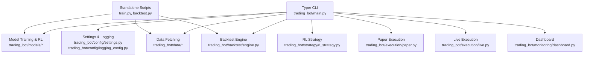
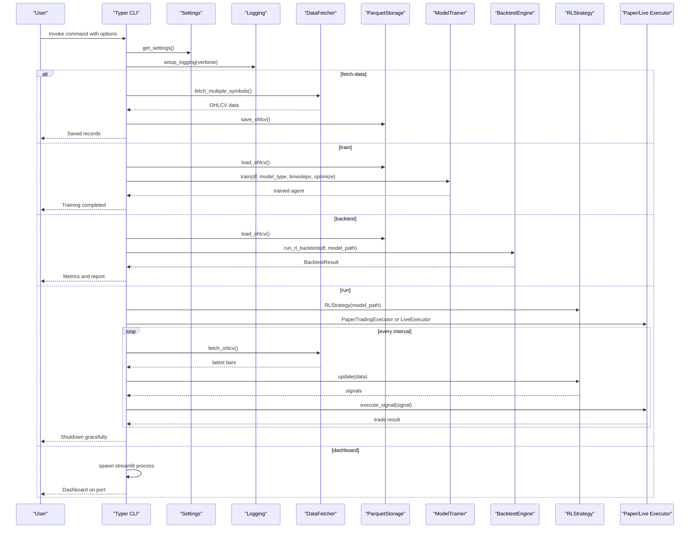
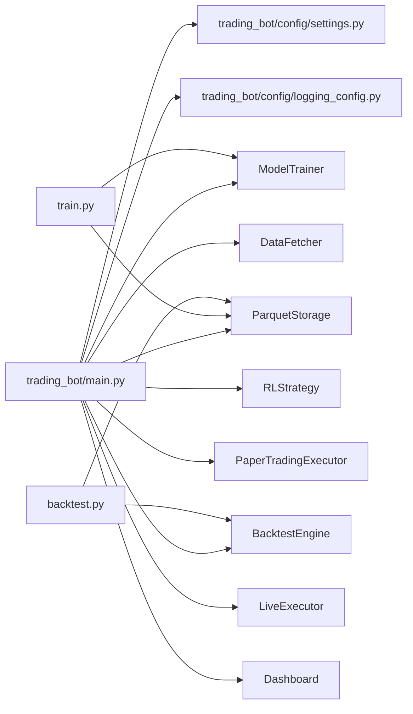

# Command-Line Interface

<cite>
**Referenced Files in This Document**
- [README.md](file://README.md)
- [pyproject.toml](file://pyproject.toml)
- [trading_bot/main.py](file://trading_bot/main.py)
- [trading_bot/config/settings.py](file://trading_bot/config/settings.py)
- [trading_bot/config/logging_config.py](file://trading_bot/config/logging_config.py)
- [trading_bot/backtest/engine.py](file://trading_bot/backtest/engine.py)
- [trading_bot/strategy/rl_strategy.py](file://trading_bot/strategy/rl_strategy.py)
- [trading_bot/execution/paper.py](file://trading_bot/execution/paper.py)
- [trading_bot/execution/live.py](file://trading_bot/execution/live.py)
- [trading_bot/monitoring/dashboard.py](file://trading_bot/monitoring/dashboard.py)
- [backtest.py](file://backtest.py)
- [train.py](file://train.py)
- [requirements.txt](file://requirements.txt)
</cite>

## Table of Contents
1. [Introduction](#introduction)
2. [Project Structure](#project-structure)
3. [Core Components](#core-components)
4. [Architecture Overview](#architecture-overview)
5. [Detailed Component Analysis](#detailed-component-analysis)
6. [Dependency Analysis](#dependency-analysis)
7. [Performance Considerations](#performance-considerations)
8. [Troubleshooting Guide](#troubleshooting-guide)
9. [Conclusion](#conclusion)
10. [Appendices](#appendices)

## Introduction
This document provides comprehensive command-line interface (CLI) documentation for the AI Trading Bot. It covers all available commands, their syntax, parameters, defaults, and practical usage. It also explains common workflows (training, backtesting, automated trading, monitoring), exit codes, error handling, and troubleshooting guidance.

The CLI is built with Typer and exposes a primary command group with subcommands for version, config, fetch-data, train, backtest, run, and dashboard. The project also includes standalone scripts for training and backtesting that mirror CLI functionality.

## Project Structure
The CLI entry point is the Typer application defined in the main module. It integrates with configuration, logging, data fetching, model training, backtesting, execution (paper/live), and monitoring/dashboard components.

**Diagram sources**
- [trading_bot/main.py:1-347](file://trading_bot/main.py#L1-L347)
- [trading_bot/config/settings.py:1-176](file://trading_bot/config/settings.py#L1-L176)
- [trading_bot/config/logging_config.py:1-91](file://trading_bot/config/logging_config.py#L1-L91)
- [trading_bot/backtest/engine.py:1-418](file://trading_bot/backtest/engine.py#L1-L418)
- [trading_bot/strategy/rl_strategy.py:1-285](file://trading_bot/strategy/rl_strategy.py#L1-L285)
- [trading_bot/execution/paper.py:1-392](file://trading_bot/execution/paper.py#L1-L392)
- [trading_bot/execution/live.py:1-364](file://trading_bot/execution/live.py#L1-L364)
- [trading_bot/monitoring/dashboard.py:1-328](file://trading_bot/monitoring/dashboard.py#L1-L328)
- [train.py:1-101](file://train.py#L1-L101)
- [backtest.py:1-110](file://backtest.py#L1-L110)

**Section sources**
- [trading_bot/main.py:1-347](file://trading_bot/main.py#L1-L347)
- [README.md:130-164](file://README.md#L130-L164)

## Core Components
- Typer CLI application with callback for global options and subcommands for each operation.
- Centralized configuration via Pydantic settings with environment-driven defaults.
- Structured logging with Rich integration.
- Data fetching and storage abstractions.
- RL model training and backtesting engines.
- Execution engines for paper and live trading.
- Monitoring dashboard via Streamlit.

Key CLI entry points:
- Primary CLI: python -m trading_bot.main
- Standalone scripts: python train.py, python backtest.py

**Section sources**
- [trading_bot/main.py:19-347](file://trading_bot/main.py#L19-L347)
- [trading_bot/config/settings.py:23-176](file://trading_bot/config/settings.py#L23-L176)
- [trading_bot/config/logging_config.py:13-91](file://trading_bot/config/logging_config.py#L13-L91)
- [pyproject.toml:84-85](file://pyproject.toml#L84-L85)

## Architecture Overview
The CLI orchestrates a pipeline from data acquisition to model training, backtesting, and live/paper execution, with monitoring and alerts.

**Diagram sources**
- [trading_bot/main.py:24-347](file://trading_bot/main.py#L24-L347)
- [trading_bot/config/settings.py:169-176](file://trading_bot/config/settings.py#L169-L176)
- [trading_bot/config/logging_config.py:13-59](file://trading_bot/config/logging_config.py#L13-L59)
- [trading_bot/backtest/engine.py:147-240](file://trading_bot/backtest/engine.py#L147-L240)
- [trading_bot/strategy/rl_strategy.py:182-221](file://trading_bot/strategy/rl_strategy.py#L182-L221)
- [trading_bot/execution/paper.py:115-208](file://trading_bot/execution/paper.py#L115-L208)
- [trading_bot/execution/live.py:115-223](file://trading_bot/execution/live.py#L115-L223)
- [trading_bot/monitoring/dashboard.py:333-342](file://trading_bot/monitoring/dashboard.py#L333-L342)

## Detailed Component Analysis

### Command: version
- Purpose: Display version and author information.
- Syntax: trading_bot version
- Options: None
- Defaults: None
- Example:
  - python -m trading_bot.main version
- Notes: Uses a styled panel output.

**Section sources**
- [trading_bot/main.py:37-45](file://trading_bot/main.py#L37-L45)

### Command: config
- Purpose: Show current configuration values.
- Syntax: trading_bot config
- Options: None
- Defaults: None
- Example:
  - python -m trading_bot.main config
- Output: Tabular display of settings including trading mode, symbols, timeframe, capital, position sizing, and model type.

**Section sources**
- [trading_bot/main.py:48-65](file://trading_bot/main.py#L48-L65)

### Command: fetch-data
- Purpose: Fetch historical OHLCV data for symbols and save to storage.
- Syntax: trading_bot fetch-data [OPTIONS]
- Options:
  - --symbol TEXT: Symbols to fetch (multiple). If not provided, uses configured symbol list.
  - --days INTEGER: Days of data to fetch. Default: 30.
  - --output PATH: Output directory for saving. Default: ./data.
  - --verbose / --no-verbose, -v: Verbose logging.
  - --config PATH: Config file path override.
- Defaults:
  - days: 30
  - output: ./data
- Example:
  - python -m trading_bot.main fetch-data --days 180
  - python -m trading_bot.main fetch-data --symbol BTC/USDT ETH/USDT --days 90
- Behavior:
  - Initializes DataFetcher with API keys and testnet flag from settings.
  - Saves each symbol’s data as OHLCV in Parquet storage under timeframe-specific folders.

**Section sources**
- [trading_bot/main.py:68-102](file://trading_bot/main.py#L68-L102)
- [trading_bot/config/settings.py:36-38](file://trading_bot/config/settings.py#L36-L38)
- [trading_bot/config/settings.py:152-156](file://trading_bot/config/settings.py#L152-L156)

### Command: train
- Purpose: Train an RL model (PPO or SAC) on historical data.
- Syntax: trading_bot train [OPTIONS]
- Options:
  - --data PATH: Path to training data. Default: ./data.
  - --model TEXT: Model type (PPO or SAC). Default: PPO.
  - --timesteps INTEGER: Training timesteps. Default: 100000.
  - --optimize / --no-optimize: Enable/disable hyperparameter optimization. Default: enabled.
  - --verbose / --no-verbose, -v: Verbose logging.
  - --config PATH: Config file path override.
- Defaults:
  - data: ./data
  - model: PPO
  - timesteps: 100000
  - optimize: True
- Example:
  - python -m trading_bot.main train --model PPO --timesteps 100000
  - python -m trading_bot.main train --model SAC --timesteps 50000 --optimize
- Behavior:
  - Loads first symbol’s data from storage.
  - Creates ModelTrainer with optional hyperparameter optimization.
  - Trains agent and prints completion status.

**Section sources**
- [trading_bot/main.py:105-156](file://trading_bot/main.py#L105-L156)
- [trading_bot/config/settings.py:99-103](file://trading_bot/config/settings.py#L99-L103)

### Command: backtest
- Purpose: Run a backtest using a trained RL model.
- Syntax: trading_bot backtest [OPTIONS]
- Options:
  - --model PATH: Path to trained model (required).
  - --data PATH: Path to test data. Default: ./data.
  - --output PATH: Output directory for report. Default: ./backtest_results.
  - --verbose / --no-verbose, -v: Verbose logging.
  - --config PATH: Config file path override.
- Defaults:
  - data: ./data
  - output: ./backtest_results
- Example:
  - python -m trading_bot.main backtest --model ./models/PPO_*.zip
- Behavior:
  - Loads OHLCV data for the first configured symbol.
  - Runs RL backtest via BacktestEngine.
  - Prints a metrics table and saves a detailed report.

**Section sources**
- [trading_bot/main.py:159-211](file://trading_bot/main.py#L159-L211)
- [trading_bot/backtest/engine.py:22-39](file://trading_bot/backtest/engine.py#L22-L39)
- [trading_bot/backtest/engine.py:147-240](file://trading_bot/backtest/engine.py#L147-L240)

### Command: run
- Purpose: Run the trading bot in paper or live mode.
- Syntax: trading_bot run [OPTIONS]
- Options:
  - --mode TEXT: Trading mode (paper or live). Default: paper.
  - --model PATH: Path to trained model (required).
  - --interval INTEGER: Update interval in seconds. Default: 60.
  - --verbose / --no-verbose, -v: Verbose logging.
  - --config PATH: Config file path override.
- Defaults:
  - mode: paper
  - interval: 60
- Example:
  - python -m trading_bot.main run --mode paper --model ./models/PPO_*.zip
  - python -m trading_bot.main run --mode live --model ./models/PPO_*.zip
- Behavior:
  - Initializes RLStrategy with model path.
  - Selects PaperTradingExecutor or LiveExecutor based on mode.
  - Fetches latest market data, generates signals, executes trades, and sends alerts.
  - Includes circuit breaker checks and graceful shutdown on Ctrl+C.

**Section sources**
- [trading_bot/main.py:214-325](file://trading_bot/main.py#L214-L325)
- [trading_bot/strategy/rl_strategy.py:182-221](file://trading_bot/strategy/rl_strategy.py#L182-L221)
- [trading_bot/execution/paper.py:36-74](file://trading_bot/execution/paper.py#L36-L74)
- [trading_bot/execution/live.py:38-86](file://trading_bot/execution/live.py#L38-L86)

### Command: dashboard
- Purpose: Launch the monitoring dashboard.
- Syntax: trading_bot dashboard [OPTIONS]
- Options:
  - --port INTEGER: Dashboard port. Default: 8501.
  - --verbose / --no-verbose, -v: Verbose logging.
  - --config PATH: Config file path override.
- Defaults:
  - port: 8501
- Example:
  - python -m trading_bot.main dashboard
- Behavior:
  - Spawns a Streamlit process pointing to the dashboard module.

**Section sources**
- [trading_bot/main.py:328-342](file://trading_bot/main.py#L328-L342)
- [trading_bot/monitoring/dashboard.py:258-327](file://trading_bot/monitoring/dashboard.py#L258-L327)

### Standalone Scripts
- train.py
  - Supports arguments: --symbols, --model, --timesteps, --trials, --no-optimize, --data-path, --output.
  - Mirrors CLI train behavior.
- backtest.py
  - Supports arguments: --model, --data, --symbol, --output, --walk-forward, --monte-carlo.
  - Mirrors CLI backtest behavior and adds walk-forward and Monte Carlo options.

**Section sources**
- [train.py:43-96](file://train.py#L43-L96)
- [backtest.py:16-106](file://backtest.py#L16-L106)

## Dependency Analysis
- CLI depends on configuration and logging modules for runtime settings and output formatting.
- Data commands depend on DataFetcher and ParquetStorage.
- Training depends on ModelTrainer and storage.
- Backtesting depends on BacktestEngine and RL agent.
- Execution depends on RLStrategy and either PaperTradingExecutor or LiveExecutor.
- Dashboard depends on Streamlit and local dashboard module.

**Diagram sources**
- [trading_bot/main.py:11-17](file://trading_bot/main.py#L11-L17)
- [trading_bot/config/settings.py:169-176](file://trading_bot/config/settings.py#L169-L176)
- [trading_bot/backtest/engine.py:147-240](file://trading_bot/backtest/engine.py#L147-L240)
- [trading_bot/strategy/rl_strategy.py:182-221](file://trading_bot/strategy/rl_strategy.py#L182-L221)
- [trading_bot/execution/paper.py:115-208](file://trading_bot/execution/paper.py#L115-L208)
- [trading_bot/execution/live.py:115-223](file://trading_bot/execution/live.py#L115-L223)
- [train.py:8-12](file://train.py#L8-L12)
- [backtest.py:9-11](file://backtest.py#L9-L11)

**Section sources**
- [requirements.txt:1-46](file://requirements.txt#L1-L46)
- [pyproject.toml:25-71](file://pyproject.toml#L25-L71)

## Performance Considerations
- Data fetching: Limit symbols and days to reduce I/O and memory usage.
- Training: Adjust timesteps and enable hyperparameter optimization judiciously; larger trials increase compute time.
- Backtesting: Use appropriate window sizes and avoid excessive feature engineering overhead.
- Execution: Tune interval to balance responsiveness and API rate limits; paper mode avoids exchange latency.
- Logging: Use verbose only during debugging to minimize I/O overhead.

[No sources needed since this section provides general guidance]

## Troubleshooting Guide
Common issues and resolutions:
- Import errors: Ensure all dependencies are installed per requirements.
- API connection errors: Verify API keys and testnet settings in environment configuration.
- Out of memory: Reduce batch size or observation window in configuration.
- Model not loading: Confirm model file path exists and is accessible.
- Live trading warnings: The CLI prompts for confirmation before proceeding in live mode; confirm only after validating configuration.

Exit codes and behavior:
- Non-zero exit on missing data or invalid configuration during training/backtesting.
- Graceful shutdown on Ctrl+C during run mode; live executor closes connections.

**Section sources**
- [README.md:309-323](file://README.md#L309-L323)
- [trading_bot/main.py:131-133](file://trading_bot/main.py#L131-L133)
- [trading_bot/main.py:177-179](file://trading_bot/main.py#L177-L179)
- [trading_bot/main.py:223-226](file://trading_bot/main.py#L223-L226)

## Conclusion
The AI Trading Bot CLI provides a complete workflow from data acquisition to model training, backtesting, and automated trading in paper or live modes, plus monitoring via a dashboard. Use the documented commands and options to configure your sessions, validate results with backtesting, and monitor performance continuously.

[No sources needed since this section summarizes without analyzing specific files]

## Appendices

### Command Reference Summary
- version: Show version info.
- config: Display current configuration.
- fetch-data: Fetch and save OHLCV data.
- train: Train RL model (PPO/SAC).
- backtest: Backtest trained model and generate report.
- run: Execute trading bot in paper or live mode.
- dashboard: Launch monitoring dashboard.

**Section sources**
- [trading_bot/main.py:37-45](file://trading_bot/main.py#L37-L45)
- [trading_bot/main.py:48-65](file://trading_bot/main.py#L48-L65)
- [trading_bot/main.py:68-102](file://trading_bot/main.py#L68-L102)
- [trading_bot/main.py:105-156](file://trading_bot/main.py#L105-L156)
- [trading_bot/main.py:159-211](file://trading_bot/main.py#L159-L211)
- [trading_bot/main.py:214-325](file://trading_bot/main.py#L214-L325)
- [trading_bot/main.py:328-342](file://trading_bot/main.py#L328-L342)

### Practical Workflows
- End-to-end training and backtesting:
  - Fetch data: trading_bot fetch-data --days 180
  - Train model: trading_bot train --model PPO --timesteps 100000
  - Backtest: trading_bot backtest --model ./models/PPO_*.zip
- Automated trading setup:
  - Paper mode: trading_bot run --mode paper --model ./models/PPO_*.zip --interval 60
  - Live mode: trading_bot run --mode live --model ./models/PPO_*.zip --interval 60 (confirm prompt)
- Monitoring:
  - Launch dashboard: trading_bot dashboard --port 8501

**Section sources**
- [README.md:134-164](file://README.md#L134-L164)
- [trading_bot/main.py:214-325](file://trading_bot/main.py#L214-L325)