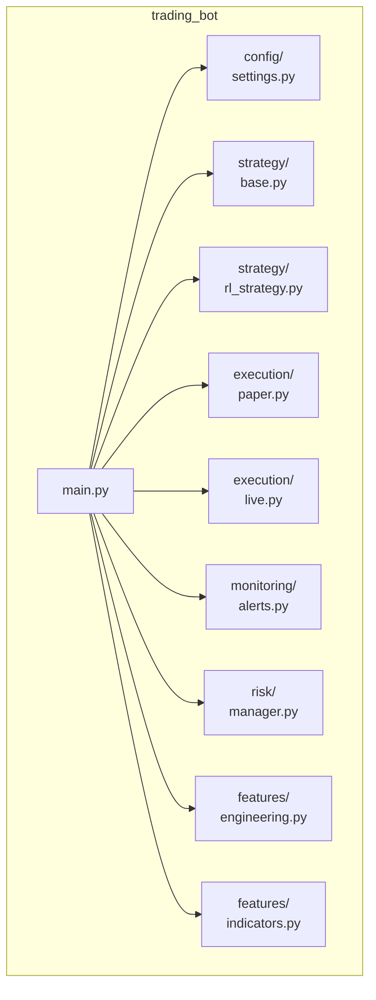
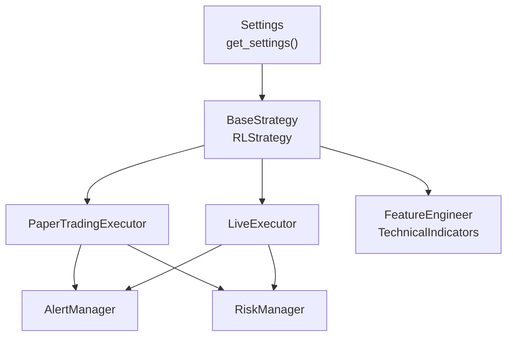
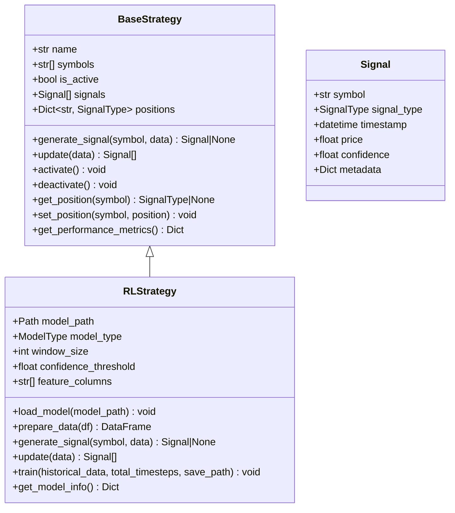
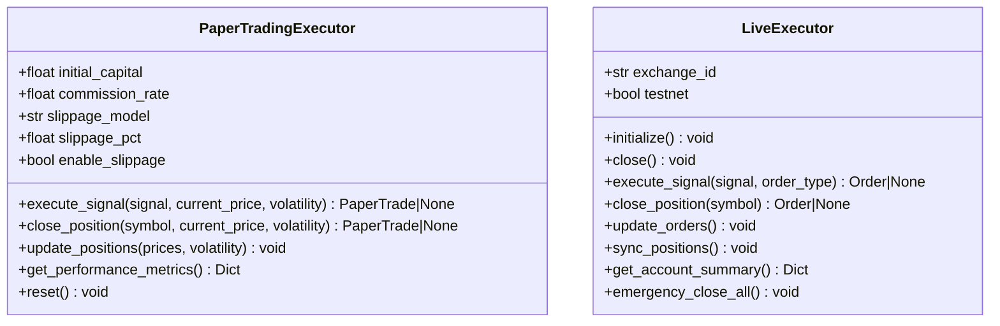
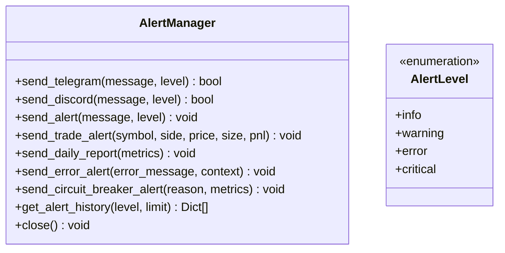
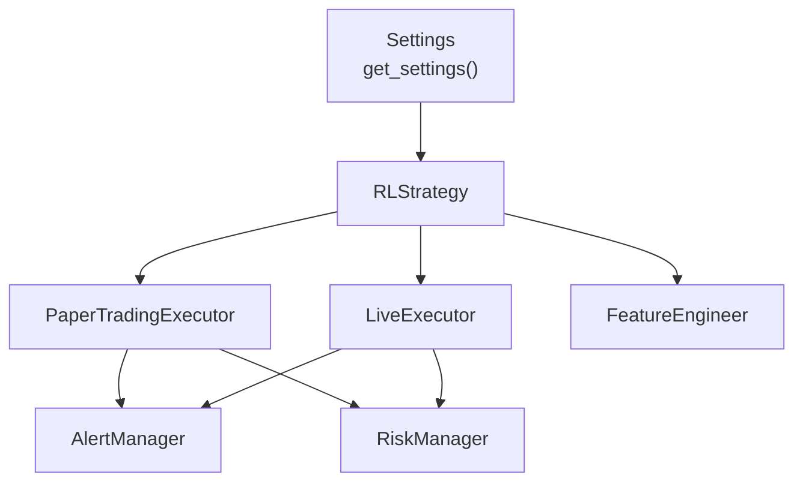

# Internal API Reference

<cite>
**Referenced Files in This Document**
- [__init__.py](file://trading_bot/__init__.py)
- [main.py](file://trading_bot/main.py)
- [settings.py](file://trading_bot/config/settings.py)
- [__init__.py](file://trading_bot/config/__init__.py)
- [base.py](file://trading_bot/strategy/base.py)
- [rl_strategy.py](file://trading_bot/strategy/rl_strategy.py)
- [__init__.py](file://trading_bot/strategy/__init__.py)
- [paper.py](file://trading_bot/execution/paper.py)
- [live.py](file://trading_bot/execution/live.py)
- [__init__.py](file://trading_bot/execution/__init__.py)
- [alerts.py](file://trading_bot/monitoring/alerts.py)
- [__init__.py](file://trading_bot/monitoring/__init__.py)
- [manager.py](file://trading_bot/risk/manager.py)
- [engineering.py](file://trading_bot/features/engineering.py)
- [indicators.py](file://trading_bot/features/indicators.py)
</cite>

## Table of Contents
1. [Introduction](#introduction)
2. [Project Structure](#project-structure)
3. [Core Components](#core-components)
4. [Architecture Overview](#architecture-overview)
5. [Detailed Component Analysis](#detailed-component-analysis)
6. [Dependency Analysis](#dependency-analysis)
7. [Performance Considerations](#performance-considerations)
8. [Troubleshooting Guide](#troubleshooting-guide)
9. [Conclusion](#conclusion)

## Introduction
This document provides an internal API reference for the AI Trading Bot’s programmatic interfaces. It covers configuration APIs, strategy APIs for custom strategy development, execution APIs for paper and live trading integration, and monitoring APIs for alert management. The focus is on public classes, methods, and functions exposed by the trading_bot package, with emphasis on method signatures, parameter types, return values, and usage examples for integration in external applications and automation scripts.

## Project Structure
The trading_bot package is organized into modules that encapsulate configuration, strategy, execution, monitoring, risk management, and feature engineering. The main entry point orchestrates commands and runtime behavior.

**Diagram sources**
- [main.py:1-347](file://trading_bot/main.py#L1-L347)
- [settings.py:23-176](file://trading_bot/config/settings.py#L23-L176)
- [base.py:39-136](file://trading_bot/strategy/base.py#L39-L136)
- [rl_strategy.py:19-285](file://trading_bot/strategy/rl_strategy.py#L19-L285)
- [paper.py:36-392](file://trading_bot/execution/paper.py#L36-L392)
- [live.py:38-364](file://trading_bot/execution/live.py#L38-L364)
- [alerts.py:23-311](file://trading_bot/monitoring/alerts.py#L23-L311)
- [manager.py:58-432](file://trading_bot/risk/manager.py#L58-L432)
- [engineering.py:17-442](file://trading_bot/features/engineering.py#L17-L442)
- [indicators.py:13-294](file://trading_bot/features/indicators.py#L13-L294)

**Section sources**
- [main.py:1-347](file://trading_bot/main.py#L1-L347)

## Core Components
This section documents the primary programmatic interfaces exposed by the trading_bot package.

- Configuration APIs
  - Settings and environment-driven configuration via Pydantic BaseSettings
  - Centralized settings retrieval and validation
  - Access to trading modes, risk parameters, model settings, and notification channels

- Strategy APIs
  - BaseStrategy interface for custom strategies
  - RLStrategy implementation for reinforcement learning-based signal generation
  - Signal data model and signal types

- Execution APIs
  - PaperTradingExecutor for simulated trading with slippage and commission modeling
  - LiveExecutor for real exchange integration with rate limiting and risk checks

- Monitoring APIs
  - AlertManager for multi-channel notifications (Telegram, Discord)
  - Alert levels and alert history management

- Risk Management APIs
  - RiskManager for portfolio-level risk controls, position sizing, and circuit breakers

- Feature Engineering APIs
  - FeatureEngineer for comprehensive technical feature creation
  - TechnicalIndicators for standard indicator sets

**Section sources**
- [settings.py:23-176](file://trading_bot/config/settings.py#L23-L176)
- [base.py:39-136](file://trading_bot/strategy/base.py#L39-L136)
- [rl_strategy.py:19-285](file://trading_bot/strategy/rl_strategy.py#L19-L285)
- [paper.py:36-392](file://trading_bot/execution/paper.py#L36-L392)
- [live.py:38-364](file://trading_bot/execution/live.py#L38-L364)
- [alerts.py:23-311](file://trading_bot/monitoring/alerts.py#L23-L311)
- [manager.py:58-432](file://trading_bot/risk/manager.py#L58-L432)
- [engineering.py:17-442](file://trading_bot/features/engineering.py#L17-L442)
- [indicators.py:13-294](file://trading_bot/features/indicators.py#L13-L294)

## Architecture Overview
The system integrates configuration, strategy, execution, monitoring, and risk management modules. The main entry point coordinates these components during runtime.

**Diagram sources**
- [settings.py:169-176](file://trading_bot/config/settings.py#L169-L176)
- [base.py:39-136](file://trading_bot/strategy/base.py#L39-L136)
- [rl_strategy.py:19-285](file://trading_bot/strategy/rl_strategy.py#L19-L285)
- [paper.py:36-392](file://trading_bot/execution/paper.py#L36-L392)
- [live.py:38-364](file://trading_bot/execution/live.py#L38-L364)
- [alerts.py:23-311](file://trading_bot/monitoring/alerts.py#L23-L311)
- [manager.py:58-432](file://trading_bot/risk/manager.py#L58-L432)
- [engineering.py:17-442](file://trading_bot/features/engineering.py#L17-L442)
- [indicators.py:13-294](file://trading_bot/features/indicators.py#L13-L294)

## Detailed Component Analysis

### Configuration API Reference
- Settings
  - Purpose: Centralized configuration with validation and environment integration
  - Key fields: Exchange credentials, trading mode, symbols, timeframe, capital, leverage, risk parameters, data paths, Redis, model settings, notification channels, logging, and monitoring ports
  - Methods:
    - get_settings(): Returns a singleton Settings instance with validated fields and ensures directories exist

- Enums
  - TradingMode: paper, live
  - ModelType: PPO, SAC

- Usage example
  - Retrieve settings in an external script:
    - from trading_bot.config import get_settings
    - settings = get_settings()

**Section sources**
- [settings.py:23-176](file://trading_bot/config/settings.py#L23-L176)
- [settings.py:169-176](file://trading_bot/config/settings.py#L169-L176)
- [__init__.py:1-7](file://trading_bot/config/__init__.py#L1-L7)

### Strategy API Reference
- BaseStrategy
  - Purpose: Abstract base for all strategies
  - Methods:
    - generate_signal(symbol: str, data: pd.DataFrame) -> Optional[Signal]: Abstract method to produce a Signal
    - update(data: Dict[str, pd.DataFrame]) -> List[Signal]: Abstract method to process new market data and return signals
    - activate(), deactivate(): Control strategy lifecycle
    - get_position(symbol: str) -> Optional[SignalType], set_position(symbol: str, position: Optional[SignalType]): Position tracking helpers
    - get_performance_metrics() -> Dict: Strategy metrics summary

- Signal and SignalType
  - Signal: Dataclass with symbol, signal_type, timestamp, price, confidence, metadata
  - SignalType: Enum with buy, sell, hold, close

- RLStrategy
  - Purpose: Reinforcement learning-based strategy using a trained model
  - Constructor parameters:
    - symbols: List[str]
    - model_path: Optional[Path]
    - model_type: ModelType
    - window_size: int
    - confidence_threshold: float
    - feature_columns: Optional[List[str]]
  - Methods:
    - load_model(model_path: Path) -> None
    - prepare_data(df: pd.DataFrame) -> pd.DataFrame
    - generate_signal(symbol: str, data: pd.DataFrame) -> Optional[Signal]
    - update(data: Dict[str, pd.DataFrame]) -> List[Signal]
    - train(historical_data: Dict[str, pd.DataFrame], total_timesteps: int, save_path: Optional[Path]) -> None
    - get_model_info() -> Dict

- Usage example
  - Initialize RLStrategy with a model and process market data:
    - from trading_bot.strategy import RLStrategy
    - strategy = RLStrategy(symbols=["BTC/USDT"], model_path="./models/best_model.zip")
    - signals = strategy.update({symbol: df})

**Diagram sources**
- [base.py:39-136](file://trading_bot/strategy/base.py#L39-L136)
- [rl_strategy.py:19-285](file://trading_bot/strategy/rl_strategy.py#L19-L285)

**Section sources**
- [base.py:39-136](file://trading_bot/strategy/base.py#L39-L136)
- [rl_strategy.py:19-285](file://trading_bot/strategy/rl_strategy.py#L19-L285)
- [__init__.py:1-7](file://trading_bot/strategy/__init__.py#L1-L7)

### Execution API Reference
- PaperTradingExecutor
  - Purpose: Simulated trading with slippage, commission, and risk manager integration
  - Constructor parameters:
    - initial_capital: float
    - commission_rate: float
    - slippage_model: str ("fixed" or "variable")
    - slippage_pct: float
    - enable_slippage: bool
  - Methods:
    - execute_signal(signal: Signal, current_price: float, volatility: float = 0.0) -> Optional[PaperTrade]
    - close_position(symbol: str, current_price: float, volatility: float = 0.0) -> Optional[PaperTrade]
    - update_positions(prices: Dict[str, float], volatility: float = 0.0) -> None
    - get_performance_metrics() -> Dict
    - reset() -> None

- LiveExecutor
  - Purpose: Real exchange integration with rate limiting and risk checks
  - Constructor parameters:
    - exchange_id: str
    - testnet: bool
    - risk_manager: Optional[RiskManager]
  - Methods:
    - initialize() -> None
    - close() -> None
    - execute_signal(signal: Signal, order_type: str = "market") -> Optional[Order]
    - close_position(symbol: str) -> Optional[Order]
    - update_orders() -> None
    - sync_positions() -> None
    - get_account_summary() -> Dict
    - emergency_close_all() -> None

- Usage example
  - Paper trading:
    - from trading_bot.execution import PaperTradingExecutor
    - executor = PaperTradingExecutor(initial_capital=10000.0)
    - trade = executor.execute_signal(signal, price)
  - Live trading:
    - from trading_bot.execution import LiveExecutor
    - executor = LiveExecutor(testnet=True)
    - await executor.initialize()
    - order = await executor.execute_signal(signal)

**Diagram sources**
- [paper.py:36-392](file://trading_bot/execution/paper.py#L36-L392)
- [live.py:38-364](file://trading_bot/execution/live.py#L38-L364)

**Section sources**
- [paper.py:36-392](file://trading_bot/execution/paper.py#L36-L392)
- [live.py:38-364](file://trading_bot/execution/live.py#L38-L364)
- [__init__.py:1-7](file://trading_bot/execution/__init__.py#L1-L7)

### Monitoring API Reference
- AlertManager
  - Purpose: Multi-channel alerting via Telegram and Discord
  - Constructor parameters:
    - telegram_token: Optional[str]
    - telegram_chat_id: Optional[str]
    - discord_webhook: Optional[str]
  - Methods:
    - send_telegram(message: str, level: AlertLevel = Info) -> bool
    - send_discord(message: str, level: AlertLevel = Info) -> bool
    - send_alert(message: str, level: AlertLevel = Info) -> None
    - send_trade_alert(symbol: str, side: str, price: float, size: float, pnl: Optional[float] = None) -> None
    - send_daily_report(metrics: Dict) -> None
    - send_error_alert(error_message: str, context: Optional[str] = None) -> None
    - send_circuit_breaker_alert(reason: str, metrics: Dict) -> None
    - get_alert_history(level: Optional[AlertLevel] = None, limit: int = 100) -> List[Dict]
    - close() -> None

- AlertLevel
  - Enum with values: info, warning, error, critical

- Usage example
  - Send alerts in an external script:
    - from trading_bot.monitoring import AlertManager
    - am = AlertManager()
    - await am.send_alert("Bot started", AlertLevel.INFO)

**Diagram sources**
- [alerts.py:23-311](file://trading_bot/monitoring/alerts.py#L23-L311)

**Section sources**
- [alerts.py:23-311](file://trading_bot/monitoring/alerts.py#L23-L311)
- [__init__.py:1-7](file://trading_bot/monitoring/__init__.py#L1-L7)

### Risk Management API Reference
- RiskManager
  - Purpose: Portfolio-level risk control, position sizing, and circuit breakers
  - Constructor parameters:
    - initial_capital: float
    - max_daily_drawdown: float
    - max_position_size: float
    - max_total_exposure: float
    - risk_per_trade: float
    - max_trades_per_day: int
    - correlation_threshold: float
  - Methods:
    - can_open_position(symbol: str, side: str, size: float, price: float) -> Tuple[bool, str]
    - open_position(symbol: str, side: str, size: float, entry_price: float, stop_loss: Optional[float] = None, take_profit: Optional[float] = None) -> Optional[Position]
    - close_position(symbol: str, exit_price: float) -> Optional[float]
    - update_positions(prices: Dict[str, float]) -> Dict[str, float]
    - check_circuit_breakers() -> Tuple[bool, str]
    - get_position_size(symbol: str, entry_price: float, stop_loss: float, method: str = "fixed_fraction") -> PositionSize
    - get_portfolio_metrics() -> Dict
    - reset_daily_stats() -> None
    - close_all_positions(prices: Dict[str, float]) -> float

- Position and RiskState data models are included for internal state representation.

- Usage example
  - Integrate with executors:
    - from trading_bot.risk import RiskManager
    - rm = RiskManager(initial_capital=10000.0)
    - can_trade, reason = rm.can_open_position("BTC/USDT", "buy", 0.001, 50000.0)

**Section sources**
- [manager.py:58-432](file://trading_bot/risk/manager.py#L58-L432)

### Feature Engineering API Reference
- FeatureEngineer
  - Purpose: Comprehensive feature engineering pipeline for market data
  - Constructor parameters:
    - lookback_window: int
  - Methods:
    - create_features(df: pd.DataFrame, add_indicators: bool = True, add_custom: bool = True, add_lags: bool = True, add_rolling: bool = True) -> pd.DataFrame
    - add_volatility_regime(df) -> pd.DataFrame
    - add_trend_strength(df) -> pd.DataFrame
    - add_momentum_regime(df) -> pd.DataFrame
    - add_market_structure(df) -> pd.DataFrame
    - add_fourier_features(df, n_components: int = 5) -> pd.DataFrame
    - add_rolling_stats(df) -> pd.DataFrame
    - add_lagged_features(df, lags: List[int] = None) -> pd.DataFrame
    - add_cross_asset_features(df, other_assets: Dict[str, pd.DataFrame]) -> pd.DataFrame
    - scale_features(df, feature_cols: Optional[List[str]] = None, fit: bool = True) -> pd.DataFrame
    - get_feature_importance(df, target_col: str = "target", method: str = "mutual_info") -> pd.Series

- TechnicalIndicators
  - Purpose: Standard technical indicators
  - Methods:
    - add_all_indicators(df) -> pd.DataFrame
    - add_trend_indicators(df) -> pd.DataFrame
    - add_momentum_indicators(df) -> pd.DataFrame
    - add_volatility_indicators(df) -> pd.DataFrame
    - add_volume_indicators(df) -> pd.DataFrame
    - add_support_resistance(df, lookback: int = 20) -> pd.DataFrame
    - add_price_features(df) -> pd.DataFrame
    - get_feature_names() -> List[str]

- Usage example
  - Engineer features for RL training:
    - from trading_bot.features import FeatureEngineer
    - fe = FeatureEngineer()
    - features = fe.create_features(df)

**Section sources**
- [engineering.py:17-442](file://trading_bot/features/engineering.py#L17-L442)
- [indicators.py:13-294](file://trading_bot/features/indicators.py#L13-L294)

## Dependency Analysis
The following diagram shows key dependencies among major components used in runtime orchestration.

**Diagram sources**
- [settings.py:169-176](file://trading_bot/config/settings.py#L169-L176)
- [rl_strategy.py:19-285](file://trading_bot/strategy/rl_strategy.py#L19-L285)
- [paper.py:36-392](file://trading_bot/execution/paper.py#L36-L392)
- [live.py:38-364](file://trading_bot/execution/live.py#L38-L364)
- [alerts.py:23-311](file://trading_bot/monitoring/alerts.py#L23-L311)
- [manager.py:58-432](file://trading_bot/risk/manager.py#L58-L432)
- [engineering.py:17-442](file://trading_bot/features/engineering.py#L17-L442)

**Section sources**
- [main.py:11-325](file://trading_bot/main.py#L11-L325)

## Performance Considerations
- Feature engineering can be computationally intensive; consider caching and incremental updates for large datasets.
- PaperTradingExecutor simulates slippage and commission to reflect realistic trading costs; use conservative assumptions for backtesting realism.
- LiveExecutor applies rate limiting to avoid exchange throttling; tune order frequency accordingly.
- RiskManager enforces daily drawdown and exposure limits; monitor portfolio metrics to prevent over-concentration.

## Troubleshooting Guide
- Configuration validation errors:
  - Ensure environment variables or .env file provides valid values for required fields (e.g., symbols, timeframe).
- Execution failures:
  - Verify exchange credentials and network connectivity for LiveExecutor initialization.
  - Confirm sufficient capital and position sizing constraints when placing orders.
- Alert delivery issues:
  - Check Telegram/Discord credentials and webhook URLs; verify network access for outbound requests.
- Risk circuit breakers:
  - Review daily drawdown thresholds and recent trade history; adjust parameters if necessary.

**Section sources**
- [settings.py:124-151](file://trading_bot/config/settings.py#L124-L151)
- [live.py:68-86](file://trading_bot/execution/live.py#L68-L86)
- [alerts.py:54-101](file://trading_bot/monitoring/alerts.py#L54-L101)
- [manager.py:299-321](file://trading_bot/risk/manager.py#L299-L321)

## Conclusion
The trading_bot package exposes a cohesive set of programmatic interfaces for configuration, strategy development, execution, monitoring, and risk management. By leveraging the documented APIs, external applications and automation scripts can integrate seamlessly with the bot’s capabilities, enabling robust paper and live trading workflows with comprehensive alerting and risk controls.