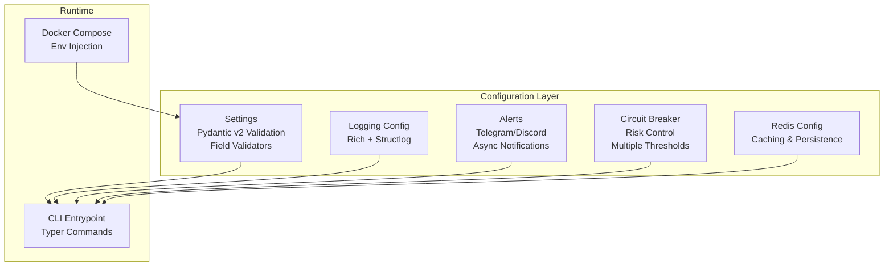
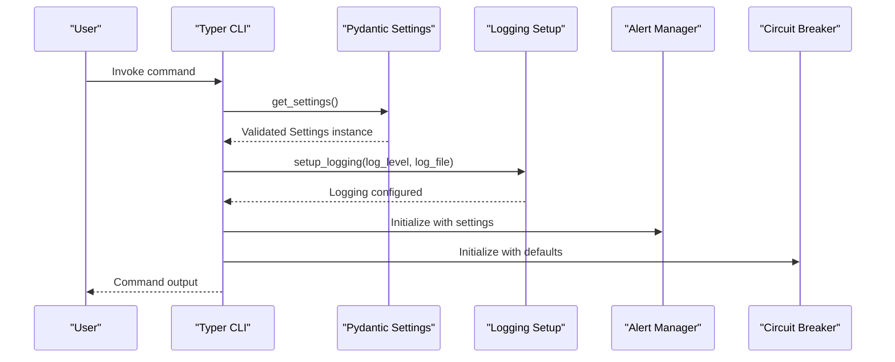
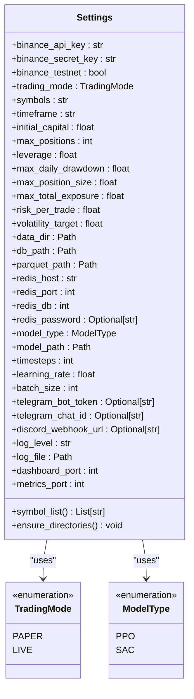
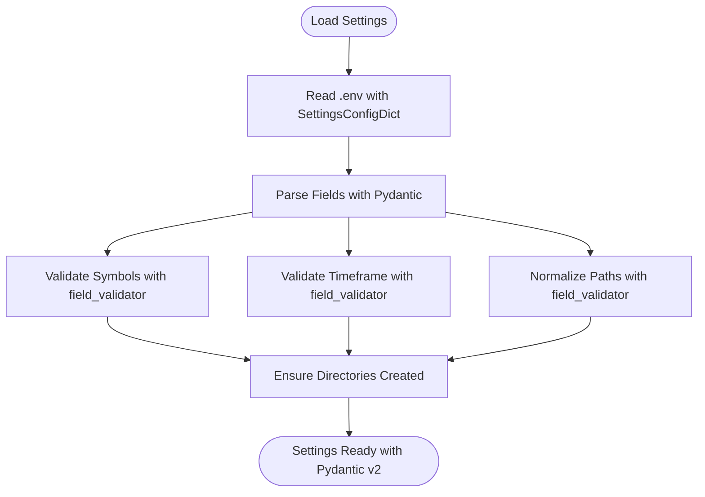
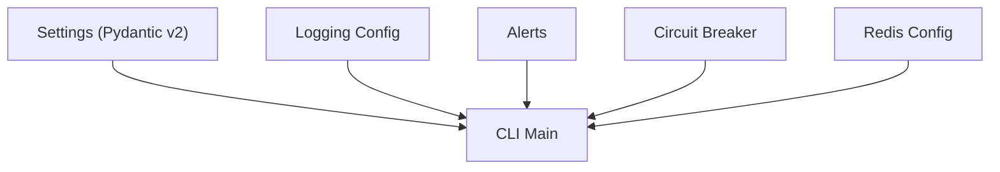

# Configuration Management

<cite>
**Referenced Files in This Document**
- [settings.py](file://trading_bot/config/settings.py)
- [logging_config.py](file://trading_bot/config/logging_config.py)
- [alerts.py](file://trading_bot/monitoring/alerts.py)
- [circuit_breaker.py](file://trading_bot/risk/circuit_breaker.py)
- [main.py](file://trading_bot/main.py)
- [test_config.py](file://trading_bot/tests/test_config.py)
- [README.md](file://README.md)
- [docker-compose.yml](file://docker-compose.yml)
- [Dockerfile](file://Dockerfile)
- [requirements.txt](file://requirements.txt)
</cite>

## Update Summary
**Changes Made**
- Enhanced settings structure with Pydantic v2 validation and SettingsConfigDict
- Expanded configuration categories with comprehensive risk management parameters
- Added Redis configuration for caching and data persistence
- Improved model configuration with training parameters
- Enhanced notification system with Telegram and Discord integration
- Added comprehensive validation rules and field validators
- Updated monitoring configuration with dashboard and metrics ports

## Table of Contents
1. [Introduction](#introduction)
2. [Project Structure](#project-structure)
3. [Core Components](#core-components)
4. [Architecture Overview](#architecture-overview)
5. [Detailed Component Analysis](#detailed-component-analysis)
6. [Dependency Analysis](#dependency-analysis)
7. [Performance Considerations](#performance-considerations)
8. [Troubleshooting Guide](#troubleshooting-guide)
9. [Conclusion](#conclusion)
10. [Appendices](#appendices)

## Introduction
This document explains the centralized configuration system for the AI Trading Bot. The system has been enhanced with Pydantic v2 validation, comprehensive risk management parameters, Redis integration, and advanced notification systems. It covers environment variables, settings structure, parameter categories, validation rules, environment-specific settings, and best practices for securing API keys. Practical examples demonstrate common configuration scenarios, and troubleshooting guidance helps resolve typical configuration issues.

## Project Structure
The configuration system is organized around a centralized Pydantic-based settings class that loads environment variables from a .env file and validates inputs with comprehensive field validators. Supporting modules configure logging, notifications, risk management, and runtime behavior.

**Diagram sources**
- [settings.py:23-176](file://trading_bot/config/settings.py#L23-L176)
- [logging_config.py:13-91](file://trading_bot/config/logging_config.py#L13-L91)
- [alerts.py:23-311](file://trading_bot/monitoring/alerts.py#L23-L311)
- [circuit_breaker.py:32-336](file://trading_bot/risk/circuit_breaker.py#L32-L336)
- [main.py:24-347](file://trading_bot/main.py#L24-L347)
- [docker-compose.yml:7-16](file://docker-compose.yml#L7-L16)

**Section sources**
- [settings.py:23-176](file://trading_bot/config/settings.py#L23-L176)
- [logging_config.py:13-91](file://trading_bot/config/logging_config.py#L13-L91)
- [alerts.py:23-311](file://trading_bot/monitoring/alerts.py#L23-L311)
- [circuit_breaker.py:32-336](file://trading_bot/risk/circuit_breaker.py#L32-L336)
- [main.py:24-347](file://trading_bot/main.py#L24-L347)
- [docker-compose.yml:7-16](file://docker-compose.yml#L7-L16)

## Core Components
- **Enhanced Settings Loader**: Pydantic v2-based configuration with comprehensive validation and field-level validators
- **Structured Logging**: Rich console output with structlog integration and file logging support
- **Advanced Notification System**: Telegram and Discord integration with async HTTP requests
- **Multi-Level Risk Management**: Comprehensive circuit breaker system with multiple trigger conditions
- **Redis Integration**: Caching and data persistence configuration
- **CLI Integration**: Configuration inspection and runtime behavior management

Key responsibilities:
- **Settings**: Load, validate, normalize, and expose configuration with Pydantic v2
- **Logging**: Configure console and file outputs with structured formatting and Rich integration
- **Alerts**: Send notifications to configured channels with async HTTP requests
- **Circuit Breaker**: Enforce safety thresholds with multiple severity levels and automatic actions
- **Redis**: Manage caching and data persistence with configurable connection parameters
- **Main**: Initialize settings and logging, run commands with comprehensive validation

**Section sources**
- [settings.py:23-176](file://trading_bot/config/settings.py#L23-L176)
- [logging_config.py:13-91](file://trading_bot/config/logging_config.py#L13-L91)
- [alerts.py:23-311](file://trading_bot/monitoring/alerts.py#L23-L311)
- [circuit_breaker.py:32-336](file://trading_bot/risk/circuit_breaker.py#L32-L336)
- [main.py:24-347](file://trading_bot/main.py#L24-L347)

## Architecture Overview
The configuration architecture integrates Pydantic v2-driven settings with runtime initialization, comprehensive validation, and modular component management. The CLI orchestrates logging setup, notification initialization, and delegates to subsystems that consume validated settings.

**Diagram sources**
- [main.py:24-66](file://trading_bot/main.py#L24-L66)
- [settings.py:169-176](file://trading_bot/config/settings.py#L169-L176)
- [logging_config.py:13-78](file://trading_bot/config/logging_config.py#L13-L78)
- [alerts.py:26-46](file://trading_bot/monitoring/alerts.py#L26-L46)
- [circuit_breaker.py:35-74](file://trading_bot/risk/circuit_breaker.py#L35-L74)

## Detailed Component Analysis

### Enhanced Settings System with Pydantic v2
The Settings class defines all configuration parameters with Pydantic v2 validation, comprehensive field validators, and environment variable mapping.

**Updated** Enhanced with Pydantic v2 SettingsConfigDict, field validators, and comprehensive validation rules

- **Environment Variable Configuration**
  - Uses SettingsConfigDict with UTF-8 encoding and case-insensitive loading
  - Ignores extra environment variables not defined in the settings model
  - Supports nested configuration with proper type conversion

- **Parameter Categories**
  - **Exchange Configuration**: Binance API keys, testnet flag, and exchange-specific settings
  - **Trading Configuration**: Mode selection (paper/live), symbols, timeframe, capital, positions, leverage
  - **Risk Management**: Comprehensive drawdown limits, position sizing, exposure controls, volatility targeting
  - **Data Storage**: Directories, database paths, and file storage configuration
  - **Redis Configuration**: Connection parameters for caching and data persistence
  - **Model Configuration**: Type selection, training parameters, and model storage paths
  - **Notification Configuration**: Telegram and Discord integration settings
  - **Logging Configuration**: Level and file path management
  - **Monitoring Configuration**: Dashboard and metrics port settings

- **Field Validation Rules**
  - **Symbols**: Non-empty comma-separated list with validation
  - **Timeframe**: Restricted set of valid values (1m, 5m, 15m, 30m, 1h, 4h, 6h, 12h, 1d, 3d, 1w, 1M)
  - **Paths**: Automatic conversion from string to Path objects with normalization
  - **Enums**: TradingMode and ModelType with proper validation

- **Convenience Helpers**
  - **symbol_list property**: Parsed symbol list with whitespace stripping
  - **ensure_directories method**: Creates required directories automatically
  - **Singleton pattern**: Global settings instance with lazy initialization

**Diagram sources**
- [settings.py:11-176](file://trading_bot/config/settings.py#L11-L176)

**Section sources**
- [settings.py:23-176](file://trading_bot/config/settings.py#L23-L176)
- [test_config.py:9-49](file://trading_bot/tests/test_config.py#L9-L49)

### Environment Variables and .env Integration
- **Loading Behavior**
  - Reads from .env with UTF-8 encoding using SettingsConfigDict
  - Case-insensitive environment variables with proper type conversion
  - Ignores extra environment variables not defined in the settings model

- **Example Mapping (from README)**
  - BINANCE_API_KEY, BINANCE_SECRET_KEY, BINANCE_TESTNET
  - TRADING_MODE, SYMBOLS, TIMEFRAME, INITIAL_CAPITAL
  - MAX_DAILY_DRAWDOWN, MAX_POSITION_SIZE, RISK_PER_TRADE
  - MODEL_TYPE, TIMESTEPS
  - TELEGRAM_BOT_TOKEN, TELEGRAM_CHAT_ID

- **Docker Integration**
  - docker-compose injects environment variables via env_file
  - Mounts .env read-only into the container
  - Persists data volumes for models, data, and logs

**Section sources**
- [settings.py:26-31](file://trading_bot/config/settings.py#L26-L31)
- [README.md:102-128](file://README.md#L102-L128)
- [docker-compose.yml:9-15](file://docker-compose.yml#L9-L15)
- [Dockerfile:5-8](file://Dockerfile#L5-L8)

### Exchange API Configuration (Binance)
- **Parameters**
  - binance_api_key: Public key for Binance API authentication
  - binance_secret_key: Private key for Binance API authentication
  - binance_testnet: Toggle between Binance testnet and mainnet

- **Usage**
  - Passed to DataFetcher and LiveExecutor for exchange connectivity
  - Used in CLI commands that require exchange data access
  - Supports both paper and live trading modes

- **Best Practices**
  - Use testnet during development and testing
  - Restrict API key permissions and enable IP allowlists
  - Store keys securely and avoid committing to version control
  - Use separate keys for paper and live trading environments

**Section sources**
- [settings.py:36-38](file://trading_bot/config/settings.py#L36-L38)
- [main.py:82-84](file://trading_bot/main.py#L82-L84)
- [main.py:250](file://trading_bot/main.py#L250)

### Trading Parameters
- **Core Parameters**
  - trading_mode: Paper or live trading mode selection
  - symbols: Comma-separated list of trading pairs with validation
  - timeframe: Candle duration with comprehensive validation
  - initial_capital: Starting account balance for paper trading
  - max_positions: Maximum concurrent positions allowed
  - leverage: Trading leverage multiplier for risk management

- **Validation**
  - Symbols must be present and non-empty with proper parsing
  - Timeframe must match allowed values from 1m to 1M
  - Automatic type conversion from string to Path objects

**Section sources**
- [settings.py:43-54](file://trading_bot/config/settings.py#L43-L54)
- [settings.py:124-142](file://trading_bot/config/settings.py#L124-L142)

### Comprehensive Risk Management Settings
- **Portfolio-Level Controls**
  - max_daily_drawdown: Maximum daily loss threshold (default: 5%)
  - max_position_size: Maximum position size as fraction of capital (default: 30%)
  - max_total_exposure: Maximum total exposure as fraction of capital (default: 80%)
  - risk_per_trade: Fixed risk per trade as fraction of capital (default: 2%)
  - volatility_target: Target annualized volatility for position sizing (default: 15%)

- **Enhanced Circuit Breaker System**
  - Multiple severity levels: WARNING, ALERT, CRITICAL, EMERGENCY
  - Trigger conditions: Daily loss limits, maximum drawdown, position losses
  - Automatic actions: Pause trading, close positions, reduce exposure
  - Cooldown periods and event tracking

**Section sources**
- [settings.py:59-78](file://trading_bot/config/settings.py#L59-L78)
- [circuit_breaker.py:88-184](file://trading_bot/risk/circuit_breaker.py#L88-L184)

### Advanced Model Configuration
- **Parameters**
  - model_type: PPO or SAC algorithm selection
  - model_path: Directory for model storage and loading
  - timesteps: Training iterations for reinforcement learning
  - learning_rate: Optimizer learning rate for training
  - batch_size: Training batch size for optimization

- **Usage**
  - Consumed by training and backtesting pipelines
  - Supports both PPO and SAC reinforcement learning algorithms
  - Integrated with Stable-Baselines3 framework

**Section sources**
- [settings.py:99-104](file://trading_bot/config/settings.py#L99-L104)

### Enhanced Notification System
- **Channels**
  - Telegram: Bot token and chat ID for instant messaging
  - Discord: Webhook URL for rich embed notifications

- **Features**
  - Async HTTP requests using aiohttp for non-blocking notifications
  - Multiple alert levels: INFO, WARNING, ERROR, CRITICAL
  - Trade execution notifications with profit/loss details
  - Daily performance reports with comprehensive metrics
  - Circuit breaker trigger alerts with automatic intervention

- **Implementation**
  - AlertManager class with configurable channels
  - Async methods for Telegram and Discord integration
  - Structured message formatting with HTML and embed support

**Section sources**
- [settings.py:108-110](file://trading_bot/config/settings.py#L108-L110)
- [alerts.py:26-46](file://trading_bot/monitoring/alerts.py#L26-L46)
- [alerts.py:150-180](file://trading_bot/monitoring/alerts.py#L150-L180)

### Structured Logging Configuration
- **Features**
  - Rich console output with syntax highlighting and tracebacks
  - Optional file logging with timestamped entries
  - Structlog integration with processors for structured data
  - Flexible log level configuration (DEBUG, INFO, WARNING, ERROR)

- **Integration**
  - CLI sets log level and file path from settings
  - Ensures log directory exists automatically
  - Supports both Rich and standard logging handlers

**Section sources**
- [logging_config.py:13-78](file://trading_bot/config/logging_config.py#L13-L78)
- [main.py:30-34](file://trading_bot/main.py#L30-L34)

### Redis Configuration
- **Parameters**
  - redis_host: Redis server hostname or IP address
  - redis_port: Redis server port number
  - redis_db: Database number for Redis connections
  - redis_password: Optional password for Redis authentication

- **Usage**
  - Caching layer for market data and intermediate results
  - Data persistence for trading state and metrics
  - Integration with Docker Compose for containerized deployments

**Section sources**
- [settings.py:90-94](file://trading_bot/config/settings.py#L90-L94)

### Monitoring Ports
- **dashboard_port**: Streamlit dashboard port (default: 8501)
- **metrics_port**: Metrics endpoint port (default: 9090)

**Section sources**
- [settings.py:121-122](file://trading_bot/config/settings.py#L121-L122)

### Enhanced Configuration Validation Flow

**Diagram sources**
- [settings.py:124-150](file://trading_bot/config/settings.py#L124-L150)

**Section sources**
- [settings.py:124-150](file://trading_bot/config/settings.py#L124-L150)

## Dependency Analysis
- **External Libraries**
  - pydantic>=2.5.0: Core validation and settings management
  - pydantic-settings>=2.1.0: Environment variable loading and validation
  - structlog>=24.1.0: Structured logging with processors
  - aiohttp>=3.9.0: Async HTTP requests for notifications
  - redis>=5.0.0: Caching and data persistence
  - python-telegram-bot>=20.7: Telegram integration
  - discord.py>=2.3.0: Discord integration

- **Internal Dependencies**
  - Settings is consumed by main CLI, alerts, risk modules, and execution engines
  - Logging is initialized early in CLI callbacks with Rich integration
  - Circuit breaker uses settings for threshold configuration
  - Alert manager accesses settings for notification configuration

**Diagram sources**
- [requirements.txt:4-5](file://requirements.txt#L4-L5)
- [requirements.txt:32-34](file://requirements.txt#L32-L34)
- [requirements.txt:14-15](file://requirements.txt#L14-L15)

**Section sources**
- [requirements.txt:4-5](file://requirements.txt#L4-L5)
- [requirements.txt:32-34](file://requirements.txt#L32-L34)
- [requirements.txt:14-15](file://requirements.txt#L14-L15)

## Performance Considerations
- **Pydantic v2 Optimization**: Minimal environment loading overhead with lazy initialization via singleton accessor
- **Asynchronous Operations**: Logging configuration is lightweight and can be toggled between console and file outputs
- **Non-blocking Notifications**: Async HTTP requests avoid blocking the main trading loop
- **Redis Caching**: Efficient caching layer reduces database load and improves performance
- **Memory Management**: Proper resource cleanup in alert manager and circuit breaker components

## Troubleshooting Guide
Common configuration issues and resolutions:

- **Import Errors**
  - **Cause**: Missing dependencies or incorrect versions
  - **Resolution**: Install requirements with `pip install -r requirements.txt`

- **API Connection Errors**
  - **Cause**: Incorrect or missing Binance API keys, wrong testnet setting
  - **Resolution**: Verify .env values and exchange permissions, use testnet during development

- **Pydantic Validation Errors**
  - **Cause**: Invalid field values or unsupported timeframe values
  - **Resolution**: Check field validators and use allowed timeframe values (1m, 5m, 15m, 30m, 1h, 4h, 6h, 12h, 1d, 3d, 1w, 1M)

- **Out of Memory**
  - **Cause**: Large batch sizes or observation windows
  - **Resolution**: Reduce batch_size or observation window in configuration

- **Model Not Loading**
  - **Cause**: Incorrect model path or file corruption
  - **Resolution**: Confirm model_path and file existence

- **Logging Not Appearing**
  - **Cause**: Incorrect log level or file path
  - **Resolution**: Adjust log_level and ensure log_file parent directory exists

- **Notifications Not Sent**
  - **Cause**: Missing tokens or webhook URLs
  - **Resolution**: Set telegram_bot_token/telegram_chat_id or discord_webhook_url

- **Redis Connection Issues**
  - **Cause**: Incorrect host/port/password configuration
  - **Resolution**: Verify Redis connection parameters and network accessibility

**Section sources**
- [README.md:309-323](file://README.md#L309-L323)
- [settings.py:135-142](file://trading_bot/config/settings.py#L135-L142)

## Conclusion
The AI Trading Bot's configuration system provides a robust, validated, and environment-driven approach to managing trading parameters, risk controls, model settings, and operational preferences. The enhanced Pydantic v2-based system improves reliability, reduces human error, and simplifies deployment across environments. With comprehensive validation, Redis integration, advanced notification systems, and multi-level risk management, the system offers enterprise-grade configuration management for cryptocurrency trading applications.

## Appendices

### Configuration Reference
- **Exchange**
  - BINANCE_API_KEY, BINANCE_SECRET_KEY, BINANCE_TESTNET
- **Trading**
  - TRADING_MODE, SYMBOLS, TIMEFRAME, INITIAL_CAPITAL, MAX_POSITIONS, LEVERAGE
- **Risk Management**
  - MAX_DAILY_DRAWDOWN, MAX_POSITION_SIZE, MAX_TOTAL_EXPOSURE, RISK_PER_TRADE, VOLATILITY_TARGET
- **Data Storage**
  - DATA_DIR, DB_PATH, PARQUET_PATH, REDIS_HOST, REDIS_PORT, REDIS_DB, REDIS_PASSWORD
- **Model**
  - MODEL_TYPE, MODEL_PATH, TIMESTEPS, LEARNING_RATE, BATCH_SIZE
- **Notifications**
  - TELEGRAM_BOT_TOKEN, TELEGRAM_CHAT_ID, DISCORD_WEBHOOK_URL
- **Logging**
  - LOG_LEVEL, LOG_FILE
- **Monitoring**
  - DASHBOARD_PORT, METRICS_PORT

**Section sources**
- [README.md:102-128](file://README.md#L102-L128)
- [settings.py:36-122](file://trading_bot/config/settings.py#L36-L122)

### Environment-Specific Settings
- **Local Development**
  - Use BINANCE_TESTNET=true for testnet access
  - TRADING_MODE=paper for safe testing
  - Lower TIMESTEPS for faster training cycles
  - Enable verbose logging with --verbose flag
- **Production Deployment**
  - TRADING_MODE=live for actual trading
  - Secure API keys with IP restrictions
  - Enable file logging and monitoring ports
  - Configure Redis for production caching
  - Set appropriate log levels for production

**Section sources**
- [README.md:102-128](file://README.md#L102-L128)
- [docker-compose.yml:9-15](file://docker-compose.yml#L9-L15)

### Best Practices for Securing API Keys
- **Never Commit .env Files**
  - Add .env to .gitignore
  - Use environment-specific .env files
- **Testnet Usage**
  - Use testnet during development and CI
  - Separate keys for paper and live trading
- **API Key Security**
  - Restrict API key permissions and enable IP allowlists
  - Rotate keys regularly and revoke compromised ones
  - Use separate keys for different environments
- **Configuration Validation**
  - Leverage Pydantic v2 validation for field-level security
  - Implement proper error handling for invalid configurations
  - Use environment-specific validation rules

**Section sources**
- [README.md:303](file://README.md#L303)
- [settings.py:124-150](file://trading_bot/config/settings.py#L124-L150)