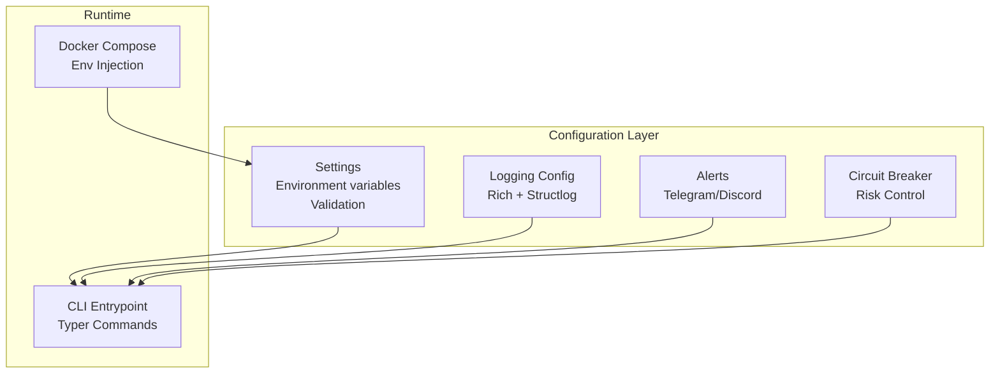
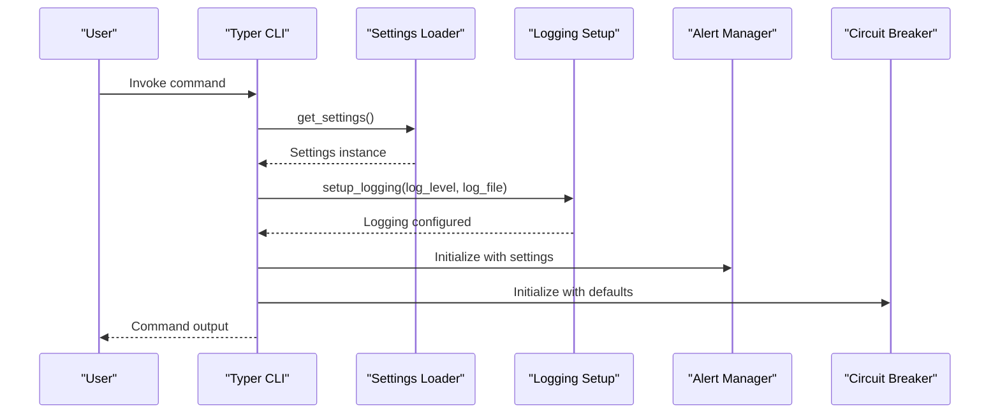
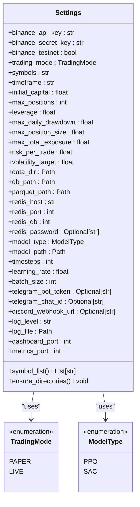
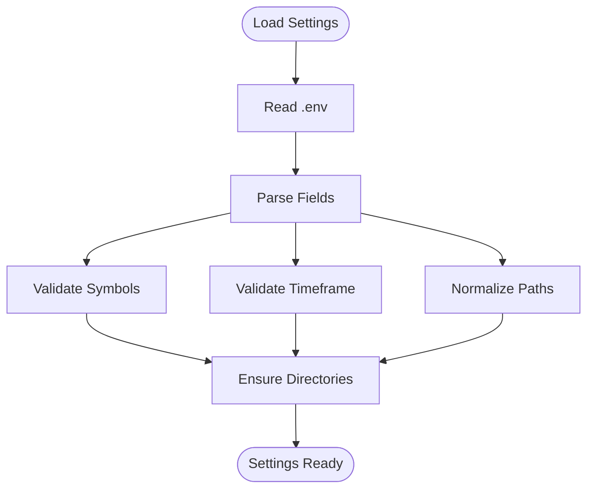
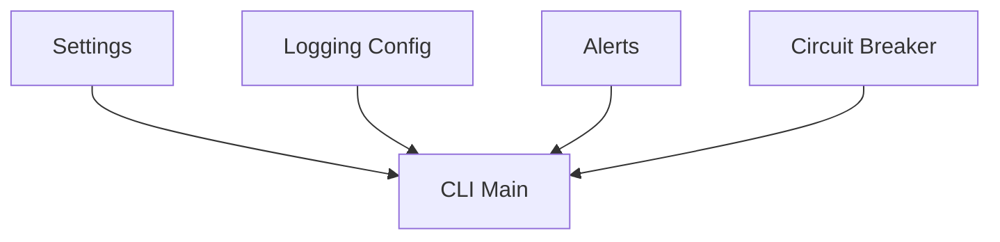

# Configuration Management

<cite>
**Referenced Files in This Document**
- [settings.py](file://trading_bot/config/settings.py)
- [logging_config.py](file://trading_bot/config/logging_config.py)
- [alerts.py](file://trading_bot/monitoring/alerts.py)
- [circuit_breaker.py](file://trading_bot/risk/circuit_breaker.py)
- [main.py](file://trading_bot/main.py)
- [test_config.py](file://trading_bot/tests/test_config.py)
- [README.md](file://README.md)
- [docker-compose.yml](file://docker-compose.yml)
- [Dockerfile](file://Dockerfile)
- [requirements.txt](file://requirements.txt)
</cite>

## Table of Contents
1. [Introduction](#introduction)
2. [Project Structure](#project-structure)
3. [Core Components](#core-components)
4. [Architecture Overview](#architecture-overview)
5. [Detailed Component Analysis](#detailed-component-analysis)
6. [Dependency Analysis](#dependency-analysis)
7. [Performance Considerations](#performance-considerations)
8. [Troubleshooting Guide](#troubleshooting-guide)
9. [Conclusion](#conclusion)
10. [Appendices](#appendices)

## Introduction
This document explains the centralized configuration system for the AI Trading Bot. It covers environment variables, settings structure, parameter categories, validation rules, environment-specific settings, and best practices for securing API keys. Practical examples demonstrate common configuration scenarios, and troubleshooting guidance helps resolve typical configuration issues.

## Project Structure
The configuration system is organized around a central settings class that loads environment variables from a .env file and validates inputs. Supporting modules configure logging, notifications, and runtime behavior.

**Diagram sources**
- [settings.py:23-175](file://trading_bot/config/settings.py#L23-L175)
- [logging_config.py:13-91](file://trading_bot/config/logging_config.py#L13-L91)
- [alerts.py:23-311](file://trading_bot/monitoring/alerts.py#L23-L311)
- [circuit_breaker.py:32-336](file://trading_bot/risk/circuit_breaker.py#L32-L336)
- [main.py:24-347](file://trading_bot/main.py#L24-L347)
- [docker-compose.yml:7-16](file://docker-compose.yml#L7-L16)

**Section sources**
- [settings.py:23-175](file://trading_bot/config/settings.py#L23-L175)
- [logging_config.py:13-91](file://trading_bot/config/logging_config.py#L13-L91)
- [alerts.py:23-311](file://trading_bot/monitoring/alerts.py#L23-L311)
- [circuit_breaker.py:32-336](file://trading_bot/risk/circuit_breaker.py#L32-L336)
- [main.py:24-347](file://trading_bot/main.py#L24-L347)
- [docker-compose.yml:7-16](file://docker-compose.yml#L7-L16)

## Core Components
- Centralized settings loader with environment variable support and validation
- Structured logging with configurable output targets
- Notification system for Telegram and Discord
- Risk control via circuit breakers
- CLI integration for configuration inspection and runtime behavior

Key responsibilities:
- Settings: load, validate, normalize, and expose configuration
- Logging: configure console and file outputs with structured formatting
- Alerts: send notifications to configured channels
- Circuit Breaker: enforce safety thresholds and trigger actions
- Main: initialize settings and logging, run commands

**Section sources**
- [settings.py:23-175](file://trading_bot/config/settings.py#L23-L175)
- [logging_config.py:13-91](file://trading_bot/config/logging_config.py#L13-L91)
- [alerts.py:23-311](file://trading_bot/monitoring/alerts.py#L23-L311)
- [circuit_breaker.py:32-336](file://trading_bot/risk/circuit_breaker.py#L32-L336)
- [main.py:24-347](file://trading_bot/main.py#L24-L347)

## Architecture Overview
The configuration architecture integrates environment-driven settings with runtime initialization and validation. The CLI orchestrates logging setup and delegates to subsystems that consume settings.

**Diagram sources**
- [main.py:24-66](file://trading_bot/main.py#L24-L66)
- [settings.py:169-175](file://trading_bot/config/settings.py#L169-L175)
- [logging_config.py:13-78](file://trading_bot/config/logging_config.py#L13-L78)
- [alerts.py:26-46](file://trading_bot/monitoring/alerts.py#L26-L46)
- [circuit_breaker.py:35-74](file://trading_bot/risk/circuit_breaker.py#L35-L74)

## Detailed Component Analysis

### Centralized Settings System
The Settings class defines all configuration parameters, environment variable mapping, validation rules, and convenience helpers.

- Environment variable mapping
  - Uses a dedicated .env file with case-insensitive loading and ignored extras
  - Parameters are typed and validated at runtime

- Parameter categories
  - Exchange configuration: Binance API keys and testnet flag
  - Trading configuration: mode, symbols, timeframe, capital, positions, leverage
  - Risk management: drawdown, position size, exposure, per-trade risk, volatility target
  - Data storage: directories and database paths
  - Redis: connection parameters
  - Model configuration: type, paths, training parameters
  - Notifications: Telegram and Discord credentials
  - Logging: level and file path
  - Monitoring: dashboard and metrics ports

- Validation rules
  - Symbols: non-empty, comma-separated list
  - Timeframe: restricted set of valid values
  - Paths: normalized to Path objects

- Convenience helpers
  - symbol_list property for parsed symbol list
  - ensure_directories creates required directories

**Diagram sources**
- [settings.py:11-175](file://trading_bot/config/settings.py#L11-L175)

**Section sources**
- [settings.py:23-175](file://trading_bot/config/settings.py#L23-L175)
- [test_config.py:9-49](file://trading_bot/tests/test_config.py#L9-L49)

### Environment Variables and .env Integration
- Loading behavior
  - Reads from .env with UTF-8 encoding
  - Case-insensitive environment variables
  - Ignores extra environment variables not defined in the settings model

- Example mapping (from README)
  - BINANCE_API_KEY, BINANCE_SECRET_KEY, BINANCE_TESTNET
  - TRADING_MODE, SYMBOLS, TIMEFRAME, INITIAL_CAPITAL
  - MAX_DAILY_DRAWDOWN, MAX_POSITION_SIZE, RISK_PER_TRADE
  - MODEL_TYPE, TIMESTEPS
  - TELEGRAM_BOT_TOKEN, TELEGRAM_CHAT_ID

- Docker integration
  - docker-compose injects environment variables via env_file
  - Mounts .env read-only into the container

**Section sources**
- [settings.py:26-31](file://trading_bot/config/settings.py#L26-L31)
- [README.md:102-128](file://README.md#L102-L128)
- [docker-compose.yml:9-15](file://docker-compose.yml#L9-L15)
- [Dockerfile:5-8](file://Dockerfile#L5-L8)

### Exchange API Configuration (Binance)
- Parameters
  - binance_api_key: public key for Binance
  - binance_secret_key: private key for Binance
  - binance_testnet: toggle testnet vs mainnet

- Usage
  - Passed to DataFetcher and LiveExecutor
  - Used in CLI commands that require exchange connectivity

- Best practices
  - Use testnet during development
  - Restrict API key permissions and IP addresses
  - Store keys securely and avoid committing to version control

**Section sources**
- [settings.py:36-38](file://trading_bot/config/settings.py#L36-L38)
- [main.py:82-84](file://trading_bot/main.py#L82-L84)
- [main.py:250](file://trading_bot/main.py#L250)

### Trading Parameters
- Core parameters
  - trading_mode: paper or live
  - symbols: comma-separated list of trading pairs
  - timeframe: candle duration (validated)
  - initial_capital: starting account balance
  - max_positions: maximum concurrent positions
  - leverage: trading leverage multiplier

- Validation
  - Symbols must be present and non-empty
  - Timeframe must match allowed values

**Section sources**
- [settings.py:43-54](file://trading_bot/config/settings.py#L43-L54)
- [settings.py:124-142](file://trading_bot/config/settings.py#L124-L142)

### Risk Management Settings
- Portfolio-level controls
  - max_daily_drawdown: maximum daily loss threshold
  - max_position_size: maximum position size as fraction of capital
  - max_total_exposure: maximum total exposure as fraction of capital
  - risk_per_trade: fixed risk per trade as fraction of capital
  - volatility_target: target annualized volatility

- Circuit breaker enforcement
  - CircuitBreaker checks multiple thresholds and can pause trading or reduce exposure automatically

**Section sources**
- [settings.py:59-78](file://trading_bot/config/settings.py#L59-L78)
- [circuit_breaker.py:88-184](file://trading_bot/risk/circuit_breaker.py#L88-L184)

### Model Configuration
- Parameters
  - model_type: PPO or SAC
  - model_path: directory for model storage
  - timesteps: training iterations
  - learning_rate: optimizer learning rate
  - batch_size: training batch size

- Usage
  - Consumed by training and backtesting pipelines

**Section sources**
- [settings.py:99-104](file://trading_bot/config/settings.py#L99-L104)

### Notification Preferences
- Channels
  - Telegram: bot token and chat ID
  - Discord: webhook URL

- Behavior
  - AlertManager sends messages asynchronously
  - Supports multiple alert levels and trade execution notifications

**Section sources**
- [settings.py:108-110](file://trading_bot/config/settings.py#L108-L110)
- [alerts.py:26-46](file://trading_bot/monitoring/alerts.py#L26-L46)
- [alerts.py:150-180](file://trading_bot/monitoring/alerts.py#L150-L180)

### Logging Configuration
- Features
  - Rich console output or standard stream handler
  - Optional file logging
  - Structured logging with structlog processors

- Integration
  - CLI sets log level and file path from settings
  - Ensures log directory exists

**Section sources**
- [logging_config.py:13-78](file://trading_bot/config/logging_config.py#L13-L78)
- [main.py:30-34](file://trading_bot/main.py#L30-L34)

### Monitoring Ports
- dashboard_port: Streamlit dashboard port
- metrics_port: Metrics endpoint port

**Section sources**
- [settings.py:121-122](file://trading_bot/config/settings.py#L121-L122)

### Configuration Validation Flow

**Diagram sources**
- [settings.py:124-150](file://trading_bot/config/settings.py#L124-L150)

**Section sources**
- [settings.py:124-150](file://trading_bot/config/settings.py#L124-L150)

## Dependency Analysis
- External libraries
  - pydantic-settings for environment loading and validation
  - structlog for structured logging
  - aiohttp for asynchronous notifications
  - redis client for caching

- Internal dependencies
  - Settings is consumed by main CLI, alerts, and risk modules
  - Logging is initialized early in CLI callbacks

**Diagram sources**
- [requirements.txt:4-5](file://requirements.txt#L4-L5)
- [requirements.txt:32-34](file://requirements.txt#L32-L34)
- [requirements.txt:14-15](file://requirements.txt#L14-L15)

**Section sources**
- [requirements.txt:4-5](file://requirements.txt#L4-L5)
- [requirements.txt:32-34](file://requirements.txt#L32-L34)
- [requirements.txt:14-15](file://requirements.txt#L14-L15)

## Performance Considerations
- Environment loading overhead is minimal due to lazy initialization via a singleton accessor
- Logging configuration is lightweight and can be toggled between console and file outputs
- Asynchronous notifications avoid blocking the main trading loop

## Troubleshooting Guide
Common configuration issues and resolutions:

- Import errors
  - Cause: Missing dependencies
  - Resolution: Install requirements

- API connection errors
  - Cause: Incorrect or missing Binance API keys, wrong testnet setting
  - Resolution: Verify .env values and exchange permissions

- Out of memory
  - Cause: Large batch sizes or observation windows
  - Resolution: Reduce batch_size or observation window in configuration

- Model not loading
  - Cause: Incorrect model path or file corruption
  - Resolution: Confirm model_path and file existence

- Logging not appearing
  - Cause: Incorrect log level or file path
  - Resolution: Adjust log_level and ensure log_file parent directory exists

- Notifications not sent
  - Cause: Missing tokens or webhook URLs
  - Resolution: Set telegram_bot_token/telegram_chat_id or discord_webhook_url

- Timeframe validation error
  - Cause: Unsupported timeframe value
  - Resolution: Use one of the allowed values

**Section sources**
- [README.md:309-323](file://README.md#L309-L323)
- [settings.py:135-142](file://trading_bot/config/settings.py#L135-L142)

## Conclusion
The AI Trading Bot’s configuration system provides a robust, validated, and environment-driven approach to managing trading parameters, risk controls, model settings, and operational preferences. By centralizing configuration and enforcing validation, the system improves reliability, reduces human error, and simplifies deployment across environments.

## Appendices

### Configuration Reference
- Exchange
  - BINANCE_API_KEY, BINANCE_SECRET_KEY, BINANCE_TESTNET
- Trading
  - TRADING_MODE, SYMBOLS, TIMEFRAME, INITIAL_CAPITAL, MAX_POSITIONS, LEVERAGE
- Risk
  - MAX_DAILY_DRAWDOWN, MAX_POSITION_SIZE, MAX_TOTAL_EXPOSURE, RISK_PER_TRADE, VOLATILITY_TARGET
- Data Storage
  - DATA_DIR, DB_PATH, PARQUET_PATH, REDIS_HOST, REDIS_PORT, REDIS_DB, REDIS_PASSWORD
- Model
  - MODEL_TYPE, MODEL_PATH, TIMESTEPS, LEARNING_RATE, BATCH_SIZE
- Notifications
  - TELEGRAM_BOT_TOKEN, TELEGRAM_CHAT_ID, DISCORD_WEBHOOK_URL
- Logging
  - LOG_LEVEL, LOG_FILE
- Monitoring
  - DASHBOARD_PORT, METRICS_PORT

**Section sources**
- [README.md:102-128](file://README.md#L102-L128)
- [settings.py:36-122](file://trading_bot/config/settings.py#L36-L122)

### Environment-Specific Settings
- Local development
  - Use BINANCE_TESTNET=true
  - TRADING_MODE=paper
  - Lower TIMESTEPS for faster training
- Production
  - TRADING_MODE=live
  - Secure API keys and restrict IP
  - Enable file logging and monitoring ports

**Section sources**
- [README.md:102-128](file://README.md#L102-L128)
- [docker-compose.yml:9-15](file://docker-compose.yml#L9-L15)

### Best Practices for Securing API Keys
- Never commit .env to version control
- Use testnet during development and CI
- Restrict API key permissions and enable IP allowlists
- Rotate keys regularly and revoke compromised ones
- Use separate keys for paper and live trading

**Section sources**
- [README.md:303](file://README.md#L303)