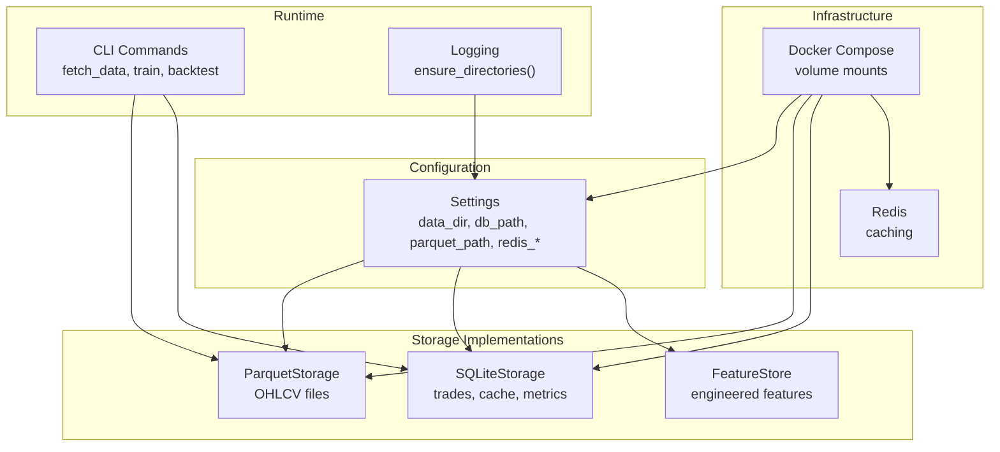
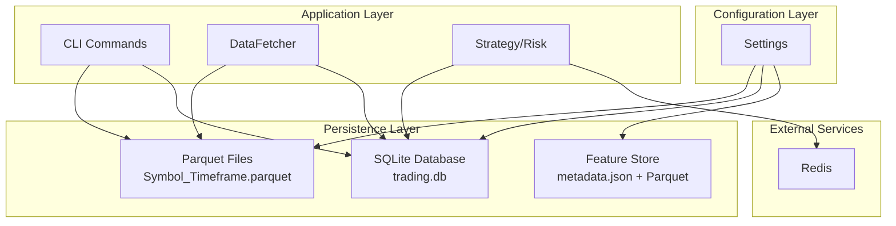
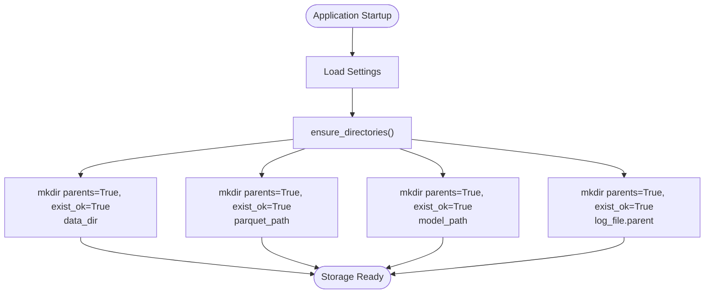
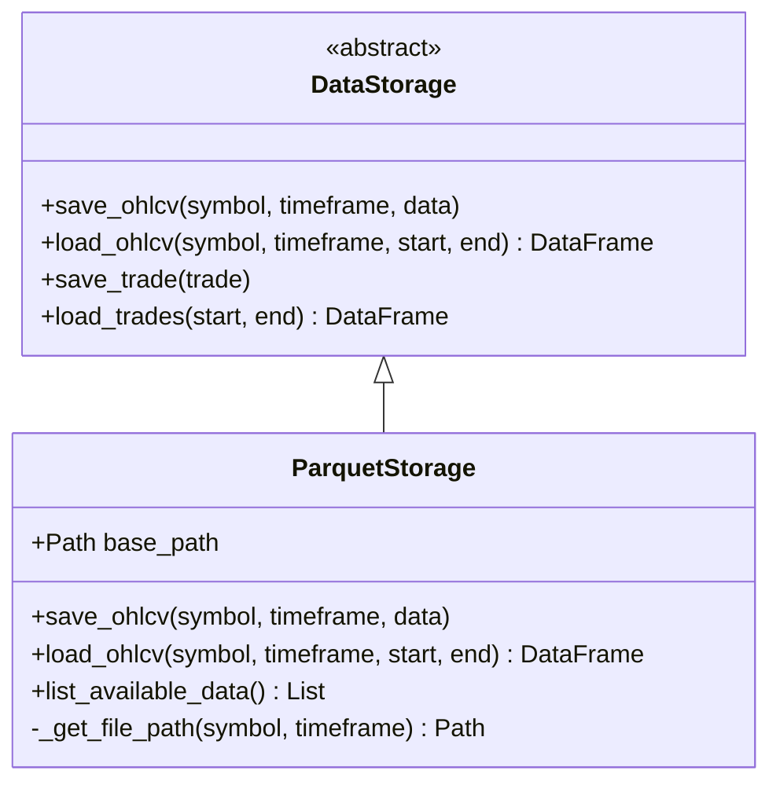
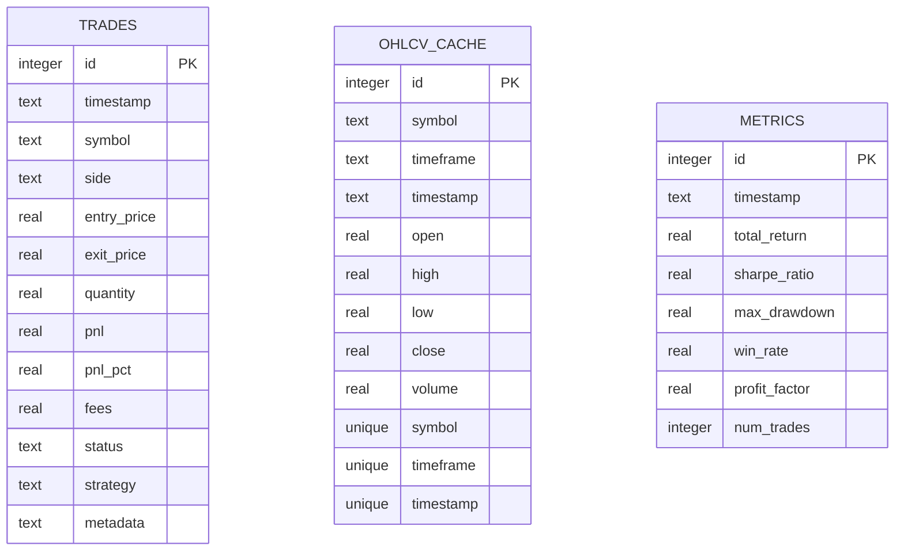
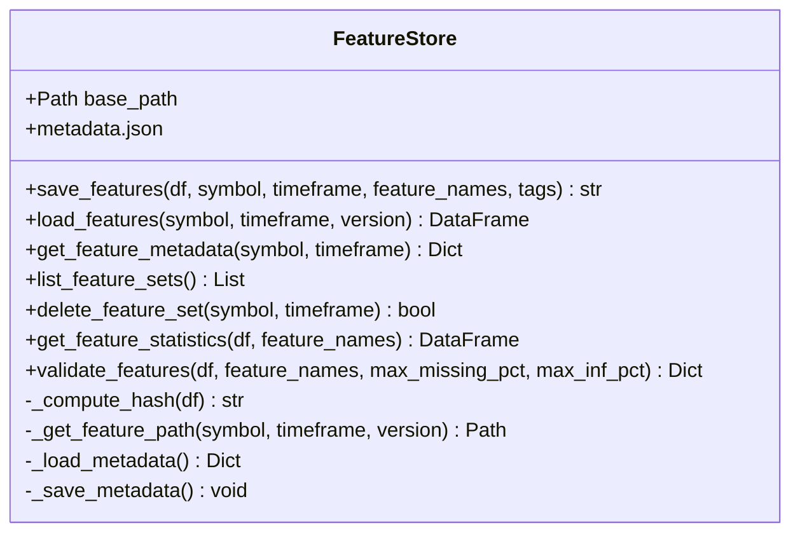
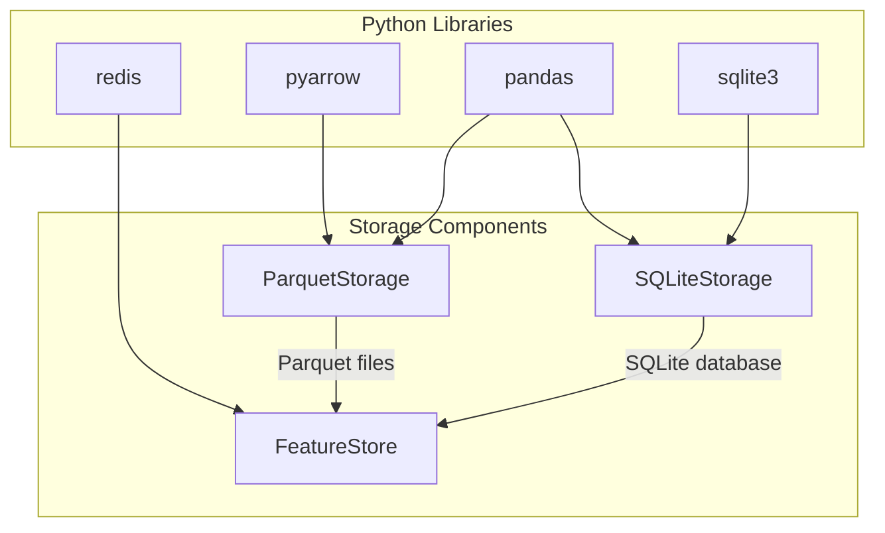

# Data Storage Configuration

<cite>
**Referenced Files in This Document**
- [settings.py](file://trading_bot/config/settings.py)
- [storage.py](file://trading_bot/data/storage.py)
- [store.py](file://trading_bot/features/store.py)
- [logging_config.py](file://trading_bot/config/logging_config.py)
- [docker-compose.yml](file://docker-compose.yml)
- [requirements.txt](file://requirements.txt)
- [main.py](file://trading_bot/main.py)
</cite>

## Table of Contents
1. [Introduction](#introduction)
2. [Project Structure](#project-structure)
3. [Core Components](#core-components)
4. [Architecture Overview](#architecture-overview)
5. [Detailed Component Analysis](#detailed-component-analysis)
6. [Dependency Analysis](#dependency-analysis)
7. [Performance Considerations](#performance-considerations)
8. [Troubleshooting Guide](#troubleshooting-guide)
9. [Conclusion](#conclusion)
10. [Appendices](#appendices)

## Introduction
This document provides comprehensive data storage configuration guidance for the trading bot. It covers directory structure setup, SQLite database configuration, Parquet file storage parameters, Redis caching configuration, database connection parameters, and file system permissions. It also includes storage optimization settings, backup strategies, and data retention policies, along with practical examples for different deployment scales and data volume requirements.

## Project Structure
The storage-related components are organized across configuration, storage implementations, and orchestration scripts:
- Configuration defines storage paths and Redis settings
- Storage implementations provide Parquet and SQLite persistence
- Feature store manages engineered feature datasets
- Logging ensures proper directory creation and file handling
- Docker Compose mounts persistent volumes for data and logs

**Diagram sources**
- [settings.py:80-95](file://trading_bot/config/settings.py#L80-L95)
- [storage.py:53-198](file://trading_bot/data/storage.py#L53-L198)
- [storage.py:200-484](file://trading_bot/data/storage.py#L200-L484)
- [store.py:18-301](file://trading_bot/features/store.py#L18-L301)
- [logging_config.py:46-59](file://trading_bot/config/logging_config.py#L46-L59)
- [docker-compose.yml:11-16](file://docker-compose.yml#L11-L16)
- [docker-compose.yml:43-52](file://docker-compose.yml#L43-L52)

**Section sources**
- [settings.py:80-95](file://trading_bot/config/settings.py#L80-L95)
- [storage.py:53-198](file://trading_bot/data/storage.py#L53-L198)
- [storage.py:200-484](file://trading_bot/data/storage.py#L200-L484)
- [store.py:18-301](file://trading_bot/features/store.py#L18-L301)
- [logging_config.py:46-59](file://trading_bot/config/logging_config.py#L46-L59)
- [docker-compose.yml:11-16](file://docker-compose.yml#L11-L16)
- [docker-compose.yml:43-52](file://docker-compose.yml#L43-L52)

## Core Components
This section documents the primary storage configuration keys and their roles.

- data_dir: Root directory for all data assets. Automatically created on first use.
- db_path: SQLite database file path for trades, OHLCV cache, and metrics.
- parquet_path: Directory for Parquet OHLCV files and feature datasets.
- redis_host/port/db/password: Redis connection parameters for caching.

Automatic directory creation is handled centrally via settings and logging utilities.

**Section sources**
- [settings.py:83-88](file://trading_bot/config/settings.py#L83-L88)
- [settings.py:90-94](file://trading_bot/config/settings.py#L90-L94)
- [settings.py:157-162](file://trading_bot/config/settings.py#L157-L162)
- [logging_config.py:46-59](file://trading_bot/config/logging_config.py#L46-L59)

## Architecture Overview
The storage architecture combines two complementary persistence mechanisms:
- ParquetStorage: Efficient columnar storage for OHLCV time series and feature datasets
- SQLiteStorage: Relational storage for trade records, OHLCV cache, and performance metrics
- FeatureStore: Manages engineered feature datasets with versioning and metadata
- Settings: Centralized configuration with automatic directory creation
- Docker Compose: Persistent volume mounts for production deployments

**Diagram sources**
- [settings.py:80-95](file://trading_bot/config/settings.py#L80-L95)
- [storage.py:53-198](file://trading_bot/data/storage.py#L53-L198)
- [storage.py:200-484](file://trading_bot/data/storage.py#L200-L484)
- [store.py:18-301](file://trading_bot/features/store.py#L18-L301)
- [main.py:68-103](file://trading_bot/main.py#L68-L103)

## Detailed Component Analysis

### Settings and Automatic Directory Creation
Settings encapsulate all storage configuration and ensure directories exist before use. The ensure_directories method creates data_dir, parquet_path, model_path, and log_file parent directories.

**Diagram sources**
- [settings.py:157-162](file://trading_bot/config/settings.py#L157-L162)
- [logging_config.py:46-59](file://trading_bot/config/logging_config.py#L46-L59)

**Section sources**
- [settings.py:157-162](file://trading_bot/config/settings.py#L157-L162)
- [logging_config.py:46-59](file://trading_bot/config/logging_config.py#L46-L59)

### Parquet Storage Implementation
ParquetStorage provides efficient time series persistence with deduplication and merging of new data.

Key behaviors:
- Automatic base directory creation
- Deduplicated merges when appending new data
- Timestamp-indexed queries with optional date filters
- Filename pattern: Symbol_Timeframe.parquet

**Diagram sources**
- [storage.py:53-198](file://trading_bot/data/storage.py#L53-L198)

**Section sources**
- [storage.py:53-198](file://trading_bot/data/storage.py#L53-L198)

### SQLite Storage Implementation
SQLiteStorage maintains relational tables for trades, OHLCV cache, and metrics with robust indexing and query support.

**Diagram sources**
- [storage.py:222-271](file://trading_bot/data/storage.py#L222-L271)

**Section sources**
- [storage.py:200-484](file://trading_bot/data/storage.py#L200-L484)

### Feature Store Implementation
FeatureStore manages engineered feature datasets with versioning, metadata, and validation.

Key behaviors:
- Versioned feature files with MD5-based version identifiers
- JSON metadata tracking per dataset
- Validation for missing values, infinite values, constants, and outliers
- Automatic base directory creation

**Diagram sources**
- [store.py:18-301](file://trading_bot/features/store.py#L18-L301)

**Section sources**
- [store.py:18-301](file://trading_bot/features/store.py#L18-L301)

### Redis Configuration and Usage
Redis is configured via settings and used for caching. The application depends on Redis for caching functionality.

Configuration parameters:
- redis_host: Host address
- redis_port: Port number
- redis_db: Database index
- redis_password: Optional password

Dependencies:
- redis>=5.0.0
- hiredis>=2.2.0

**Section sources**
- [settings.py:90-94](file://trading_bot/config/settings.py#L90-L94)
- [requirements.txt:14-15](file://requirements.txt#L14-L15)

### Database Connection Parameters
SQLite connections are managed internally with row factory configuration for convenient access.

Connection characteristics:
- Uses sqlite3.connect with row_factory set to sqlite3.Row
- Schema initialization occurs on first use
- Transactions are explicit for writes

**Section sources**
- [storage.py:213-217](file://trading_bot/data/storage.py#L213-L217)
- [storage.py:219-273](file://trading_bot/data/storage.py#L219-L273)

### File System Permissions
Directory creation uses Python's pathlib with parents=True and exist_ok=True, ensuring:
- Non-existent parent directories are created
- No exceptions on existing directories
- Proper ownership follows container/user permissions

Production deployments should ensure the application user has write permissions to mounted volumes.

**Section sources**
- [settings.py:157-162](file://trading_bot/config/settings.py#L157-L162)
- [logging_config.py:46-59](file://trading_bot/config/logging_config.py#L46-L59)
- [docker-compose.yml:11-16](file://docker-compose.yml#L11-L16)

## Dependency Analysis
The storage system relies on several external libraries and infrastructure components.

**Diagram sources**
- [requirements.txt:12-14](file://requirements.txt#L12-L14)
- [storage.py:10-12](file://trading_bot/data/storage.py#L10-L12)
- [store.py:9-11](file://trading_bot/features/store.py#L9-L11)

**Section sources**
- [requirements.txt:12-14](file://requirements.txt#L12-L14)
- [storage.py:10-12](file://trading_bot/data/storage.py#L10-L12)
- [store.py:9-11](file://trading_bot/features/store.py#L9-L11)

## Performance Considerations
- Parquet compression: Use appropriate compression codecs for storage efficiency
- Indexing: Ensure timestamp is properly indexed in Parquet files for fast filtering
- Batch operations: SQLite operations use executemany for bulk inserts
- Caching: Redis can cache frequently accessed market data and derived features
- I/O patterns: Minimize disk writes by batching saves and leveraging deduplication

## Troubleshooting Guide
Common storage-related issues and resolutions:

- Empty data returned from Parquet: Verify file exists and contains data
- SQLite errors: Check database file permissions and connectivity
- Feature store failures: Validate metadata.json integrity and file paths
- Redis connectivity: Confirm host, port, and password settings
- Permission denied: Ensure application user has write access to data directories

**Section sources**
- [storage.py:138-140](file://trading_bot/data/storage.py#L138-L140)
- [storage.py:351-357](file://trading_bot/data/storage.py#L351-L357)
- [store.py:138-140](file://trading_bot/features/store.py#L138-L140)

## Conclusion
The trading bot employs a robust dual-storage architecture combining Parquet for efficient time series data and SQLite for relational persistence. Settings-driven configuration with automatic directory creation simplifies deployment, while Redis enables high-performance caching. The system is designed for scalability across development, testing, and production environments.

## Appendices

### Configuration Examples by Deployment Scale

#### Development Environment
- data_dir: "./data"
- db_path: "./data/trading.db"
- parquet_path: "./data/parquet"
- Redis: localhost:6379 (no password)
- Logs: "./logs/trading_bot.log"

#### Test Environment
- data_dir: "/app/data"
- db_path: "/app/data/trading.db"
- parquet_path: "/app/data/parquet"
- Redis: redis:6379 (internal container)
- Logs: "/app/logs/trading_bot.log"

#### Production Environment
- data_dir: "/var/lib/trading-bot/data"
- db_path: "/var/lib/trading-bot/data/trading.db"
- parquet_path: "/var/lib/trading-bot/data/parquet"
- Redis: redis://redis:6379/0
- Logs: "/var/log/trading-bot/trading_bot.log"

### Backup Strategies
- SQLite backups: Regular snapshots of trading.db
- Parquet backups: Periodic copies of parquet_path directory
- Feature store backups: Archive metadata.json and feature datasets
- Redis persistence: Enable AOF/RDB as needed

### Data Retention Policies
- OHLCV retention: Keep 5+ years for backtesting, archive older periods
- Trade history: Maintain 2-5 years depending on compliance requirements
- Feature datasets: Retain last 12 months with periodic archival
- Logs: 30-90 days depending on storage costs