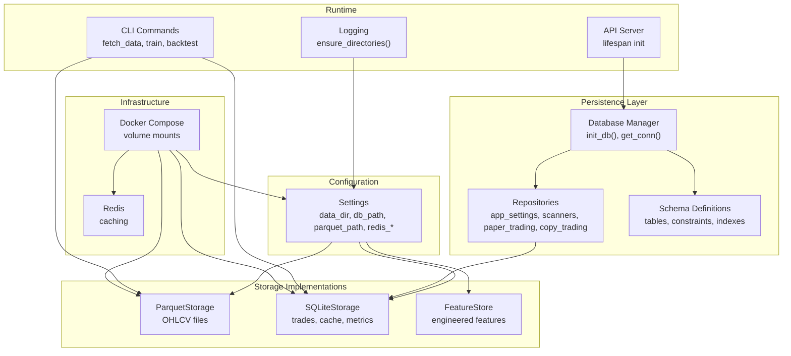
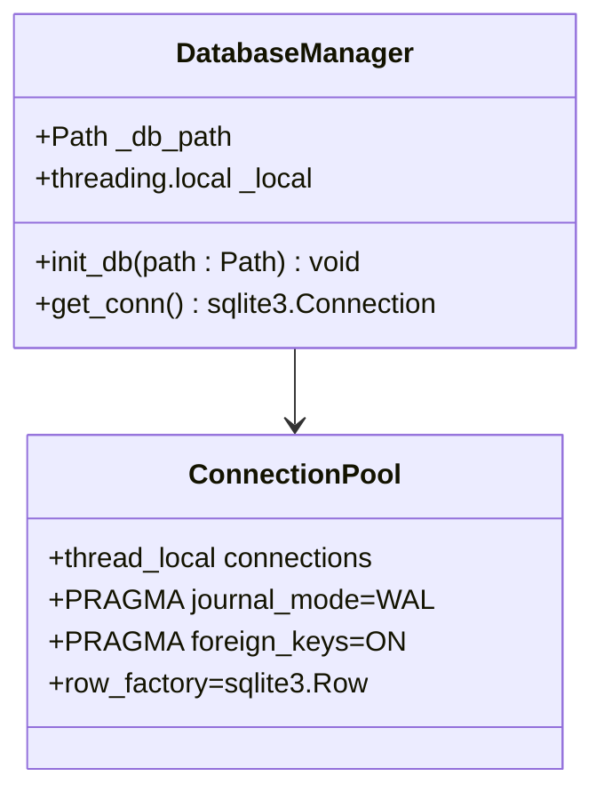
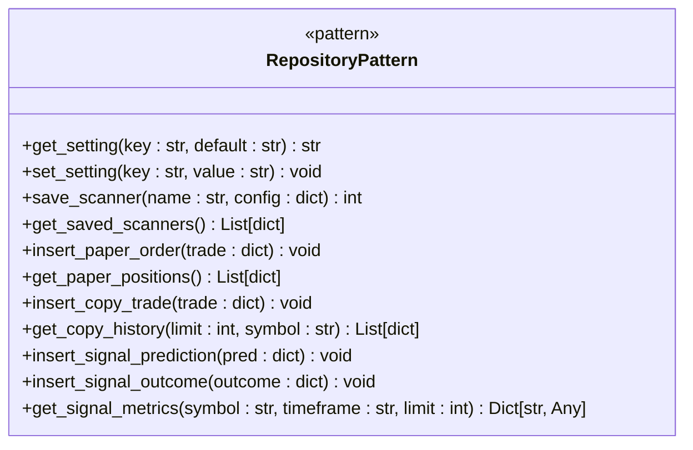
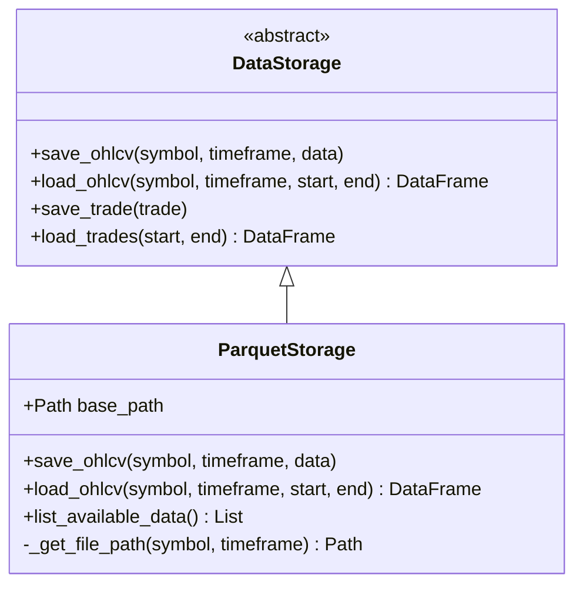
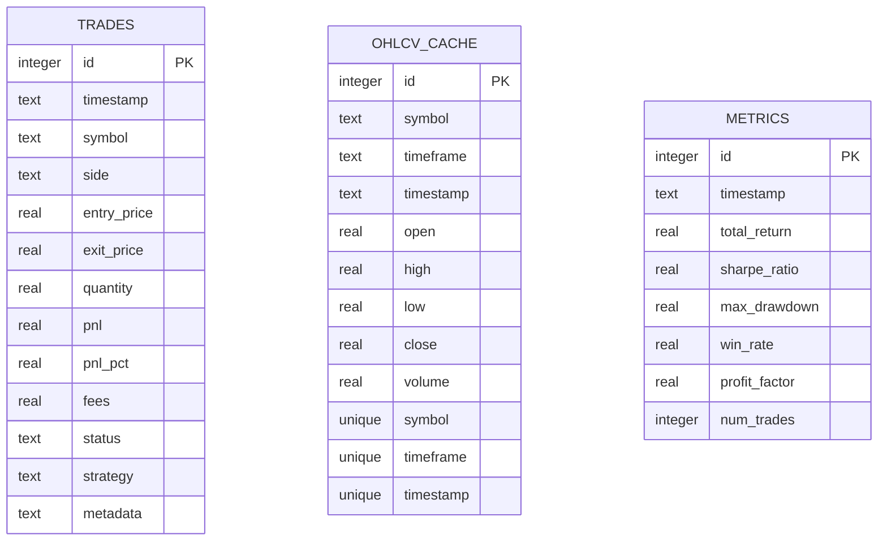
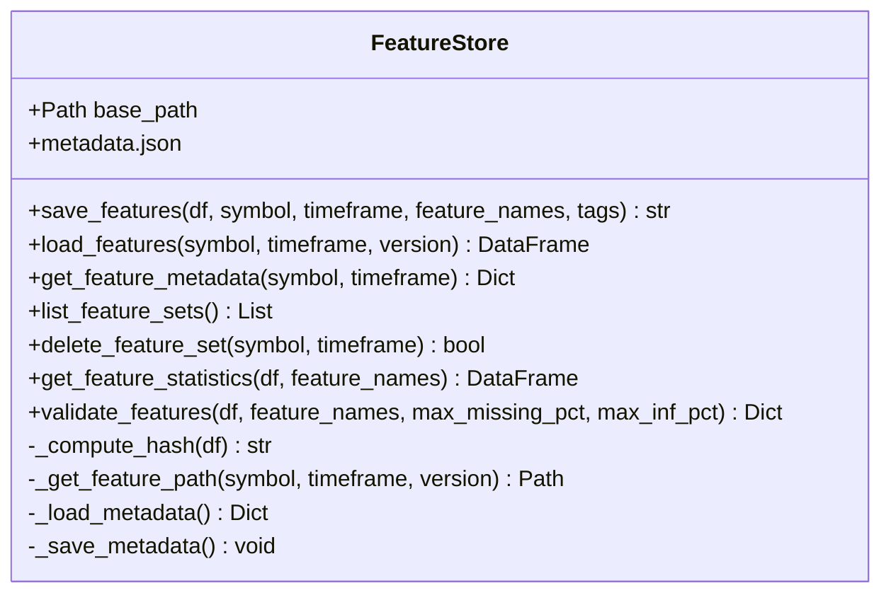

# Data Storage Configuration

<cite>
**Referenced Files in This Document**
- [settings.py](file://trading_bot/config/settings.py)
- [storage.py](file://trading_bot/data/storage.py)
- [store.py](file://trading_bot/features/store.py)
- [db.py](file://trading_bot/persistence/db.py)
- [repositories.py](file://trading_bot/persistence/repositories.py)
- [schema.py](file://trading_bot/persistence/schema.py)
- [server.py](file://trading_bot/api/server.py)
- [logging_config.py](file://trading_bot/config/logging_config.py)
- [docker-compose.yml](file://docker-compose.yml)
- [requirements.txt](file://requirements.txt)
- [main.py](file://trading_bot/main.py)
</cite>

## Update Summary
**Changes Made**
- Added comprehensive documentation for the new SQLite persistence layer with schema definitions
- Documented repository pattern implementation for database operations
- Updated architecture diagrams to reflect the new persistence layer integration
- Added database connection management and thread-local connection handling
- Expanded storage configuration to include new database tables for trading positions, order history, and market data

## Table of Contents
1. [Introduction](#introduction)
2. [Project Structure](#project-structure)
3. [Core Components](#core-components)
4. [Architecture Overview](#architecture-overview)
5. [Detailed Component Analysis](#detailed-component-analysis)
6. [Dependency Analysis](#dependency-analysis)
7. [Performance Considerations](#performance-considerations)
8. [Troubleshooting Guide](#troubleshooting-guide)
9. [Conclusion](#conclusion)
10. [Appendices](#appendices)

## Introduction
This document provides comprehensive data storage configuration guidance for the trading bot. It covers directory structure setup, SQLite database configuration, Parquet file storage parameters, Redis caching configuration, database connection parameters, and file system permissions. The system now includes a comprehensive SQLite persistence layer with schema definitions, repository patterns, and database connection management for storing trading positions, order history, and market data. It also includes storage optimization settings, backup strategies, and data retention policies, along with practical examples for different deployment scales and data volume requirements.

## Project Structure
The storage-related components are organized across configuration, storage implementations, persistence layer, and orchestration scripts:
- Configuration defines storage paths and Redis settings
- Storage implementations provide Parquet and SQLite persistence
- Persistence layer manages database schema, connections, and repository patterns
- Feature store manages engineered feature datasets
- Logging ensures proper directory creation and file handling
- API server initializes database during application startup
- Docker Compose mounts persistent volumes for data and logs



**Diagram sources**
- [settings.py:80-95](file://trading_bot/config/settings.py#L80-L95)
- [storage.py:53-198](file://trading_bot/data/storage.py#L53-L198)
- [storage.py:200-484](file://trading_bot/data/storage.py#L200-L484)
- [store.py:18-301](file://trading_bot/features/store.py#L18-L301)
- [db.py:14-36](file://trading_bot/persistence/db.py#L14-L36)
- [repositories.py:11-277](file://trading_bot/persistence/repositories.py#L11-L277)
- [schema.py:3-137](file://trading_bot/persistence/schema.py#L3-137)
- [server.py:21-31](file://trading_bot/api/server.py#L21-L31)
- [logging_config.py:46-59](file://trading_bot/config/logging_config.py#L46-L59)
- [docker-compose.yml:11-16](file://docker-compose.yml#L11-L16)
- [docker-compose.yml:43-52](file://docker-compose.yml#L43-L52)

**Section sources**
- [settings.py:80-95](file://trading_bot/config/settings.py#L80-L95)
- [storage.py:53-198](file://trading_bot/data/storage.py#L53-L198)
- [storage.py:200-484](file://trading_bot/data/storage.py#L200-L484)
- [store.py:18-301](file://trading_bot/features/store.py#L18-L301)
- [db.py:14-36](file://trading_bot/persistence/db.py#L14-L36)
- [repositories.py:11-277](file://trading_bot/persistence/repositories.py#L11-L277)
- [schema.py:3-137](file://trading_bot/persistence/schema.py#L3-137)
- [server.py:21-31](file://trading_bot/api/server.py#L21-L31)
- [logging_config.py:46-59](file://trading_bot/config/logging_config.py#L46-L59)
- [docker-compose.yml:11-16](file://docker-compose.yml#L11-L16)
- [docker-compose.yml:43-52](file://docker-compose.yml#L43-L52)

## Core Components
This section documents the primary storage configuration keys and their roles.

- data_dir: Root directory for all data assets. Automatically created on first use.
- db_path: SQLite database file path for trades, OHLCV cache, metrics, and platform state.
- parquet_path: Directory for Parquet OHLCV files and feature datasets.
- redis_host/port/db/password: Redis connection parameters for caching.

The new persistence layer adds comprehensive database schema management with thread-local connection handling and repository pattern implementation for different trading functionalities.

**Section sources**
- [settings.py:83-88](file://trading_bot/config/settings.py#L83-L88)
- [settings.py:90-94](file://trading_bot/config/settings.py#L90-L94)
- [settings.py:157-162](file://trading_bot/config/settings.py#L157-L162)
- [db.py:14-36](file://trading_bot/persistence/db.py#L14-L36)
- [logging_config.py:46-59](file://trading_bot/config/logging_config.py#L46-L59)

## Architecture Overview
The storage architecture now combines three complementary persistence mechanisms:
- ParquetStorage: Efficient columnar storage for OHLCV time series and feature datasets
- SQLiteStorage: Relational storage for trade records, OHLCV cache, and performance metrics
- SQLite Persistence Layer: Comprehensive schema management with repository patterns for trading positions, order history, and market data
- FeatureStore: Manages engineered feature datasets with versioning and metadata
- Settings: Centralized configuration with automatic directory creation
- Database Manager: Thread-local connection handling with WAL mode and foreign key enforcement
- API Server: Application lifecycle management with database initialization
- Docker Compose: Persistent volume mounts for production deployments

```mermaid
graph TB
subgraph "Configuration Layer"
CFG["Settings"]
end
subgraph "Persistence Layer"
DBM["Database Manager<br/>init_db(), get_conn()"]
SCHEMA["Schema Definitions<br/>app_settings, saved_scanners, paper_orders, copy_trades, signal_predictions"]
REPO["Repository Pattern<br/>get_setting(), save_scanner(), get_paper_positions(), get_copy_history()"]
end
subgraph "Storage Layer"
PQ["Parquet Files<br/>Symbol_Timeframe.parquet"]
SQL["SQLite Database<br/>trading.db + trading_bot.db"]
FEAT["Feature Store<br/>metadata.json + Parquet"]
END
subgraph "Application Layer"
API["API Server<br/>lifespan init"]
CLI["CLI Commands<br/>fetch_data, train, backtest"]
DATA["DataFetcher"]
STRAT["Strategy/Risk"]
end
subgraph "External Services"
REDIS["Redis"]
end
CFG --> DBM
CFG --> PQ
CFG --> SQL
CFG --> FEAT
DBM --> SCHEMA
DBM --> REPO
API --> DBM
CLI --> PQ
CLI --> SQL
DATA --> PQ
DATA --> SQL
STRAT --> SQL
STRAT --> REDIS
```

**Diagram sources**
- [settings.py:80-95](file://trading_bot/config/settings.py#L80-L95)
- [db.py:14-36](file://trading_bot/persistence/db.py#L14-L36)
- [schema.py:3-137](file://trading_bot/persistence/schema.py#L3-137)
- [repositories.py:11-277](file://trading_bot/persistence/repositories.py#L11-L277)
- [storage.py:53-198](file://trading_bot/data/storage.py#L53-L198)
- [storage.py:200-484](file://trading_bot/data/storage.py#L200-L484)
- [store.py:18-301](file://trading_bot/features/store.py#L18-L301)
- [server.py:21-31](file://trading_bot/api/server.py#L21-L31)
- [main.py:68-103](file://trading_bot/main.py#L68-L103)

## Detailed Component Analysis

### Settings and Automatic Directory Creation
Settings encapsulate all storage configuration and ensure directories exist before use. The ensure_directories method creates data_dir, parquet_path, model_path, and log_file parent directories.


**Diagram sources**
- [settings.py:157-162](file://trading_bot/config/settings.py#L157-L162)
- [logging_config.py:46-59](file://trading_bot/config/logging_config.py#L46-L59)

**Section sources**
- [settings.py:157-162](file://trading_bot/config/settings.py#L157-L162)
- [logging_config.py:46-59](file://trading_bot/config/logging_config.py#L46-L59)

### SQLite Database Manager and Connection Management
The new persistence layer introduces a sophisticated database management system with thread-local connection handling and comprehensive schema initialization.



Key features:
- Thread-local connection reuse within the same thread
- Automatic schema initialization on first use
- WAL mode for improved concurrent access
- Foreign key enforcement for data integrity
- Row factory configuration for convenient access

**Diagram sources**
- [db.py:14-36](file://trading_bot/persistence/db.py#L14-L36)

**Section sources**
- [db.py:14-36](file://trading_bot/persistence/db.py#L14-L36)

### Comprehensive Schema Definitions
The persistence layer includes extensive schema definitions covering all trading functionalities with proper constraints and indexes.

```mermaid
erDiagram
APP_SETTINGS {
text key PK
text value
text updated_at
}
SAVED_SCANNERS {
integer id PK
text name
text config_json
text created_at
text updated_at
}
PAPER_ORDERS {
text trade_id PK
text symbol
text side
real quantity
real entry_price
real stop_loss
real take_profit_1
real take_profit_2
real take_profit_3
text status
real pnl
real risk_percent
text trade_style
real confidence
text opened_at
text closed_at
}
COPY_SETTINGS {
integer id PK CHECK(id=1)
integer enabled
real max_position_size_lots
real max_risk_percent
integer max_concurrent_positions
real lot_size_scale
integer auto_close_on_signal_expire
text allowed_symbols_json
integer min_confidence
text updated_at
}
COPY_TRADES {
text copy_trade_id PK
text symbol
text direction
real quantity
real entry_price
real current_price
real stop_loss
real take_profit1
real take_profit2
real take_profit3
integer confidence
real risk_percent
text status
real unrealized_pnl
real realized_pnl
text trade_style
text timeframe
text signal_source
real created_at
real closed_at
}
SIGNAL_PREDICTIONS {
text signal_id PK
text symbol
text direction
integer confidence
real entry_min
real entry_max
real stop_loss
real take_profit1
real take_profit2
real take_profit3
text timeframe
text trade_style
text source
text price_source
real created_at
}
SIGNAL_OUTCOMES {
text signal_id PK
text resolved_reason
real resolved_at
real exit_price
real pnl_pips
integer direction_correct
}
MODEL_REGISTRY {
text model_id PK
text model_type
text file_path
text metadata_json
integer is_active
text created_at
}
SERVICE_HEALTH_SNAPSHOTS {
integer id PK
text service
text status
text detail
text created_at
}
```

**Diagram sources**
- [schema.py:3-137](file://trading_bot/persistence/schema.py#L3-137)

**Section sources**
- [schema.py:3-137](file://trading_bot/persistence/schema.py#L3-137)

### Repository Pattern Implementation
The repository pattern provides clean abstractions for database operations across different trading domains.



Repository categories:
- **App Settings**: Key-value storage for application configuration
- **Saved Scanners**: Scanner configurations with JSON serialization
- **Paper Trading**: Order management and account state tracking
- **Copy Trading**: Position management and trade execution
- **Signal Processing**: Prediction tracking and outcome recording
- **Metrics**: Aggregation functions for performance analysis

**Diagram sources**
- [repositories.py:11-277](file://trading_bot/persistence/repositories.py#L11-L277)

**Section sources**
- [repositories.py:11-277](file://trading_bot/persistence/repositories.py#L11-L277)

### Parquet Storage Implementation
ParquetStorage provides efficient time series persistence with deduplication and merging of new data.



Key behaviors:
- Automatic base directory creation
- Deduplicated merges when appending new data
- Timestamp-indexed queries with optional date filters
- Filename pattern: Symbol_Timeframe.parquet

**Diagram sources**
- [storage.py:53-198](file://trading_bot/data/storage.py#L53-L198)

**Section sources**
- [storage.py:53-198](file://trading_bot/data/storage.py#L53-L198)

### SQLite Storage Implementation
SQLiteStorage maintains relational tables for trades, OHLCV cache, and metrics with robust indexing and query support.



**Diagram sources**
- [storage.py:222-271](file://trading_bot/data/storage.py#L222-L271)

**Section sources**
- [storage.py:200-484](file://trading_bot/data/storage.py#L200-L484)

### Feature Store Implementation
FeatureStore manages engineered feature datasets with versioning, metadata, and validation.



Key behaviors:
- Versioned feature files with MD5-based version identifiers
- JSON metadata tracking per dataset
- Validation for missing values, infinite values, constants, and outliers
- Automatic base directory creation

**Diagram sources**
- [store.py:18-301](file://trading_bot/features/store.py#L18-L301)

**Section sources**
- [store.py:18-301](file://trading_bot/features/store.py#L18-L301)

### Redis Configuration and Usage
Redis is configured via settings and used for caching. The application depends on Redis for caching functionality.

Configuration parameters:
- redis_host: Host address
- redis_port: Port number
- redis_db: Database index
- redis_password: Optional password

Dependencies:
- redis>=5.0.0
- hiredis>=2.2.0

**Section sources**
- [settings.py:90-94](file://trading_bot/config/settings.py#L90-L94)
- [requirements.txt:14-15](file://requirements.txt#L14-L15)

### Database Connection Parameters
The new persistence layer manages SQLite connections with advanced configuration options.

Connection characteristics:
- Thread-local connections with automatic reuse
- Uses sqlite3.connect with check_same_thread=False for multi-threading
- Row factory set to sqlite3.Row for convenient access
- WAL mode enabled for improved concurrent access
- Foreign keys enforced for data integrity
- Automatic schema initialization on first use

**Section sources**
- [db.py:24-36](file://trading_bot/persistence/db.py#L24-L36)
- [db.py:14-21](file://trading_bot/persistence/db.py#L14-L21)

### API Server Database Initialization
The API server integrates database initialization into its application lifecycle.

Initialization process:
- Database path set to ./data/trading_bot.db
- Schema initialization during application startup
- Connection pool established for request handling
- Graceful shutdown with resource cleanup

**Section sources**
- [server.py:17-31](file://trading_bot/api/server.py#L17-L31)

### File System Permissions
Directory creation uses Python's pathlib with parents=True and exist_ok=True, ensuring:
- Non-existent parent directories are created
- No exceptions on existing directories
- Proper ownership follows container/user permissions

Production deployments should ensure the application user has write permissions to mounted volumes.

**Section sources**
- [settings.py:157-162](file://trading_bot/config/settings.py#L157-L162)
- [logging_config.py:46-59](file://trading_bot/config/logging_config.py#L46-L59)
- [docker-compose.yml:11-16](file://docker-compose.yml#L11-L16)

## Dependency Analysis
The storage system now includes a comprehensive persistence layer with extensive dependencies.

```mermaid
graph TB
subgraph "Python Libraries"
ARROW["pyarrow"]
PANDAS["pandas"]
SQLITE["sqlite3"]
REDIS["redis"]
FASTAPI["fastapi"]
UVICORN["uvicorn"]
END
subgraph "Persistence Layer"
DBM["Database Manager"]
REPO["Repository Pattern"]
SCHEMA["Schema Definitions"]
END
subgraph "Storage Components"
PS["ParquetStorage"]
SS["SQLiteStorage"]
FS["FeatureStore"]
END
ARROW --> PS
PANDAS --> PS
PANDAS --> SS
SQLITE --> DBM
SQLITE --> SS
REDIS --> FS
FASTAPI --> DBM
UVICORN --> DBM
PS --> |"Parquet files"| FS
SS --> |"SQLite database"| FS
DBM --> REPO
REPO --> SS
```

**Diagram sources**
- [requirements.txt:12-14](file://requirements.txt#L12-L14)
- [requirements.txt:48-51](file://requirements.txt#L48-L51)
- [db.py:10-11](file://trading_bot/persistence/db.py#L10-L11)
- [repositories.py:8](file://trading_bot/persistence/repositories.py#L8)
- [storage.py:10-12](file://trading_bot/data/storage.py#L10-L12)
- [store.py:9-11](file://trading_bot/features/store.py#L9-L11)

**Section sources**
- [requirements.txt:12-14](file://requirements.txt#L12-L14)
- [requirements.txt:48-51](file://requirements.txt#L48-L51)
- [db.py:10-11](file://trading_bot/persistence/db.py#L10-L11)
- [repositories.py:8](file://trading_bot/persistence/repositories.py#L8)
- [storage.py:10-12](file://trading_bot/data/storage.py#L10-L12)
- [store.py:9-11](file://trading_bot/features/store.py#L9-L11)

## Performance Considerations
- Parquet compression: Use appropriate compression codecs for storage efficiency
- Indexing: Ensure timestamp is properly indexed in Parquet files for fast filtering
- Batch operations: SQLite operations use executemany for bulk inserts
- Connection pooling: Thread-local connections reduce overhead in multi-threaded environments
- WAL mode: Write-Ahead Logging improves concurrent read/write performance
- Foreign key constraints: Enforce referential integrity with minimal performance impact
- Caching: Redis can cache frequently accessed market data and derived features
- I/O patterns: Minimize disk writes by batching saves and leveraging deduplication
- Schema design: Proper indexing and constraints optimize query performance

## Troubleshooting Guide
Common storage-related issues and resolutions:

- Empty data returned from Parquet: Verify file exists and contains data
- SQLite errors: Check database file permissions and connectivity
- Database initialization failures: Verify schema execution and path permissions
- Repository pattern errors: Check parameter types and SQL syntax
- Thread safety issues: Ensure proper connection handling in multi-threaded contexts
- Feature store failures: Validate metadata.json integrity and file paths
- Redis connectivity: Confirm host, port, and password settings
- Permission denied: Ensure application user has write access to data directories
- Database lock issues: Check for concurrent access patterns and WAL mode configuration

**Section sources**
- [storage.py:138-140](file://trading_bot/data/storage.py#L138-L140)
- [storage.py:351-357](file://trading_bot/data/storage.py#L351-L357)
- [db.py:26-27](file://trading_bot/persistence/db.py#L26-L27)
- [repositories.py:13-15](file://trading_bot/persistence/repositories.py#L13-L15)
- [store.py:138-140](file://trading_bot/features/store.py#L138-L140)

## Conclusion
The trading bot employs a robust multi-layered storage architecture combining Parquet for efficient time series data, SQLite for relational persistence, and a comprehensive SQLite persistence layer for advanced trading functionality. The new persistence layer provides thread-safe database management, comprehensive schema definitions, and repository patterns for different trading domains. Settings-driven configuration with automatic directory creation simplifies deployment, while Redis enables high-performance caching. The system is designed for scalability across development, testing, and production environments with proper connection management and performance optimizations.

## Appendices

### Configuration Examples by Deployment Scale

#### Development Environment
- data_dir: "./data"
- db_path: "./data/trading.db"
- parquet_path: "./data/parquet"
- Redis: localhost:6379 (no password)
- Logs: "./logs/trading_bot.log"

#### Test Environment
- data_dir: "/app/data"
- db_path: "/app/data/trading.db"
- parquet_path: "/app/data/parquet"
- Redis: redis:6379 (internal container)
- Logs: "/app/logs/trading_bot.log"

#### Production Environment
- data_dir: "/var/lib/trading-bot/data"
- db_path: "/var/lib/trading-bot/data/trading.db"
- parquet_path: "/var/lib/trading-bot/data/parquet"
- Redis: redis://redis:6379/0
- Logs: "/var/log/trading-bot/trading_bot.log"

### Backup Strategies
- SQLite backups: Regular snapshots of trading.db and trading_bot.db
- Parquet backups: Periodic copies of parquet_path directory
- Feature store backups: Archive metadata.json and feature datasets
- Redis persistence: Enable AOF/RDB as needed
- Schema backups: Export schema definitions for disaster recovery

### Data Retention Policies
- OHLCV retention: Keep 5+ years for backtesting, archive older periods
- Trade history: Maintain 2-5 years depending on compliance requirements
- Feature datasets: Retain last 12 months with periodic archival
- Logs: 30-90 days depending on storage costs
- Market data: Retain 1-3 years for analytics, archive older data
- Trading positions: Maintain historical positions for audit trails
- Signal predictions: Keep 6-12 months for performance analysis
- Copy trading data: Retain indefinitely for compliance and reporting

### Database Schema Evolution
The persistence layer supports schema evolution through:
- Versioned table structures with backward compatibility
- Migration procedures for schema updates
- Data validation and transformation during upgrades
- Backup and rollback procedures for schema changes
- Testing procedures for migration validation

### Performance Monitoring
Key metrics to monitor:
- Database connection pool utilization
- Query performance and execution times
- Disk I/O patterns and storage usage
- Memory usage in multi-threaded environments
- Cache hit rates for Redis operations
- Parquet file sizes and compression ratios
- Feature store performance and data freshness