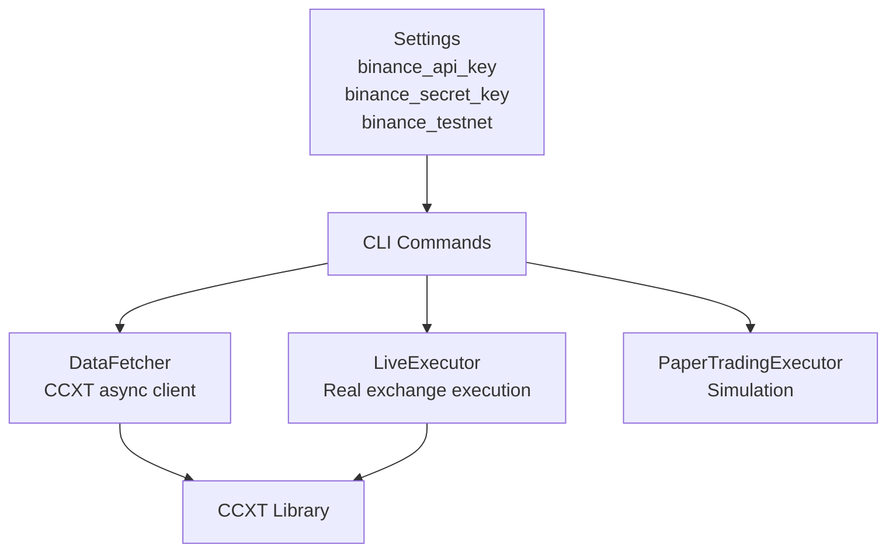
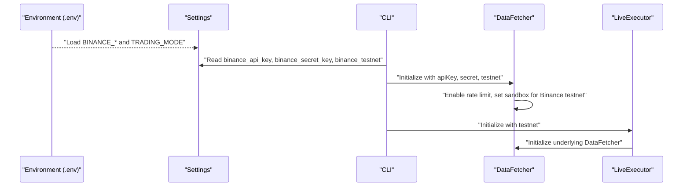
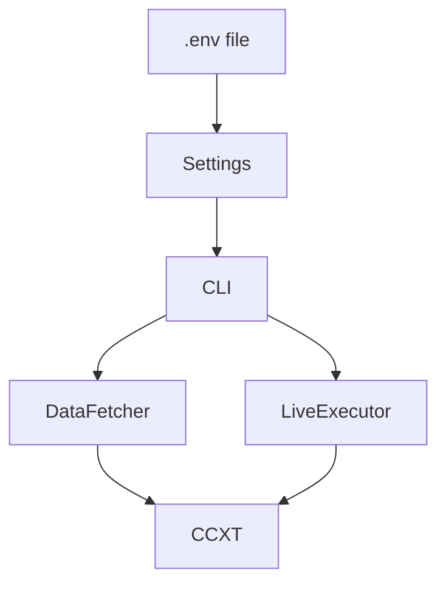

# Exchange Configuration

<cite>
**Referenced Files in This Document**
- [settings.py](file://trading_bot/config/settings.py)
- [main.py](file://trading_bot/main.py)
- [fetcher.py](file://trading_bot/data/fetcher.py)
- [live.py](file://trading_bot/execution/live.py)
- [paper.py](file://trading_bot/execution/paper.py)
- [manager.py](file://trading_bot/risk/manager.py)
- [README.md](file://README.md)
- [requirements.txt](file://requirements.txt)
</cite>

## Table of Contents
1. [Introduction](#introduction)
2. [Project Structure](#project-structure)
3. [Core Components](#core-components)
4. [Architecture Overview](#architecture-overview)
5. [Detailed Component Analysis](#detailed-component-analysis)
6. [Dependency Analysis](#dependency-analysis)
7. [Performance Considerations](#performance-considerations)
8. [Troubleshooting Guide](#troubleshooting-guide)
9. [Conclusion](#conclusion)

## Introduction
This document provides comprehensive guidance for configuring Binance API integration within the trading bot. It covers API key setup, testnet versus production configuration, security best practices, exchange-specific parameters, rate limiting considerations, and error handling strategies. Practical examples demonstrate how to set up demo accounts, configure API keys, and troubleshoot authentication issues.

## Project Structure
The exchange configuration is centralized in the settings module and consumed by the data fetching and execution layers. The CLI orchestrates runtime behavior and passes credentials to the relevant components.

**Diagram sources**
- [settings.py:36-38](file://trading_bot/config/settings.py#L36-L38)
- [main.py:82-84](file://trading_bot/main.py#L82-L84)
- [main.py:250](file://trading_bot/main.py#L250)
- [fetcher.py:69-87](file://trading_bot/data/fetcher.py#L69-L87)
- [live.py:72-77](file://trading_bot/execution/live.py#L72-L77)

**Section sources**
- [settings.py:36-38](file://trading_bot/config/settings.py#L36-L38)
- [main.py:82-84](file://trading_bot/main.py#L82-L84)
- [main.py:250](file://trading_bot/main.py#L250)

## Core Components
- Settings: Defines Binance API credentials and testnet flag with environment-based loading.
- DataFetcher: Initializes CCXT with credentials and testnet mode, handles retries and rate limiting.
- LiveExecutor: Uses settings to connect to Binance for live trading with internal rate limiting.
- CLI: Passes settings to DataFetcher and LiveExecutor during runtime.

Key configuration fields:
- binance_api_key: Binance API key used for authenticated requests.
- binance_secret_key: Binance API secret used for authenticated requests.
- binance_testnet: Boolean flag to switch between Binance Spot/Perp and Testnet.

**Section sources**
- [settings.py:36-38](file://trading_bot/config/settings.py#L36-L38)
- [fetcher.py:69-87](file://trading_bot/data/fetcher.py#L69-L87)
- [live.py:72-77](file://trading_bot/execution/live.py#L72-L77)
- [main.py:82-84](file://trading_bot/main.py#L82-L84)
- [main.py:250](file://trading_bot/main.py#L250)

## Architecture Overview
The exchange configuration flows from environment variables through settings to the exchange clients used by the data layer and execution layer.

**Diagram sources**
- [settings.py:26-31](file://trading_bot/config/settings.py#L26-L31)
- [main.py:82-84](file://trading_bot/main.py#L82-L84)
- [main.py:250](file://trading_bot/main.py#L250)
- [fetcher.py:69-87](file://trading_bot/data/fetcher.py#L69-L87)
- [live.py:72-77](file://trading_bot/execution/live.py#L72-L77)

## Detailed Component Analysis

### Settings and Environment Configuration
- Settings loads environment variables from a .env file and exposes:
  - binance_api_key
  - binance_secret_key
  - binance_testnet
- The CLI reads these values to configure data fetching and live execution.

Best practices:
- Store secrets in .env and keep it out of version control.
- Use binance_testnet=true for development and testing.
- Validate that TRADING_MODE is set appropriately.

**Section sources**
- [settings.py:26-31](file://trading_bot/config/settings.py#L26-L31)
- [settings.py:36-38](file://trading_bot/config/settings.py#L36-L38)
- [README.md:100-128](file://README.md#L100-L128)

### DataFetcher Initialization and Testnet Behavior
- DataFetcher constructs a CCXT client with:
  - enableRateLimit enabled
  - optional apiKey and secret for authenticated endpoints
  - testnet mode via exchange options and sandbox for Binance
- Binance Futures default type is set to "future" in testnet mode.
- Retry logic is applied to network and exchange errors with exponential backoff.

Rate limiting:
- Built-in CCXT rate limit enforcement via enableRateLimit.
- Semaphore-based concurrency control for concurrent requests.

Security:
- Credentials are passed only to the exchange client initialization.
- No logging of raw credentials.

**Section sources**
- [fetcher.py:69-87](file://trading_bot/data/fetcher.py#L69-L87)
- [fetcher.py:106-110](file://trading_bot/data/fetcher.py#L106-L110)
- [fetcher.py:55](file://trading_bot/data/fetcher.py#L55)

### LiveExecutor and Rate Limiting
- LiveExecutor initializes DataFetcher using settings.binance_api_key and settings.binance_secret_key.
- Enforces an additional internal rate limit of 10 orders per minute.
- Places market and limit orders via CCXT exchange client.

Rate limiting:
- Internal counter resets every 60 seconds.
- Exceeding the limit suppresses order placement and logs a warning.

Security:
- Orders are created using the exchange client initialized with credentials from settings.

**Section sources**
- [live.py:72-77](file://trading_bot/execution/live.py#L72-L77)
- [live.py:95-113](file://trading_bot/execution/live.py#L95-L113)
- [live.py:180-191](file://trading_bot/execution/live.py#L180-L191)

### CLI Usage and Credential Propagation
- The CLI passes binance_api_key, binance_secret_key, and binance_testnet to:
  - DataFetcher for historical and live data retrieval
  - LiveExecutor for real trading mode

Operational notes:
- In live mode, confirm before proceeding to avoid unintended trades.
- The CLI coordinates periodic data fetching and signal execution loops.

**Section sources**
- [main.py:82-84](file://trading_bot/main.py#L82-L84)
- [main.py:250](file://trading_bot/main.py#L250)
- [main.py:223-226](file://trading_bot/main.py#L223-L226)

### Exchange-Specific Parameters and Permissions
- Binance Futures default type is configured for testnet.
- Sandbox mode is enabled for Binance testnet.
- CCXT library provides unified interface for market data and order placement.

Permissions:
- Ensure API keys have appropriate permissions for the intended endpoints (spot/futures).
- Restrict IP addresses where applicable.

**Section sources**
- [fetcher.py:79-87](file://trading_bot/data/fetcher.py#L79-L87)
- [README.md:303](file://README.md#L303)

## Dependency Analysis
The exchange configuration depends on environment variables loaded by the settings module and consumed by the CLI, DataFetcher, and LiveExecutor.

**Diagram sources**
- [settings.py:26-31](file://trading_bot/config/settings.py#L26-L31)
- [main.py:82-84](file://trading_bot/main.py#L82-L84)
- [main.py:250](file://trading_bot/main.py#L250)
- [fetcher.py:69-87](file://trading_bot/data/fetcher.py#L69-L87)
- [live.py:72-77](file://trading_bot/execution/live.py#L72-L77)

**Section sources**
- [settings.py:26-31](file://trading_bot/config/settings.py#L26-L31)
- [requirements.txt:9](file://requirements.txt#L9)

## Performance Considerations
- CCXT rate limiting is enabled to prevent throttling by the exchange.
- DataFetcher uses a semaphore to cap concurrent requests.
- LiveExecutor applies an additional internal rate limit to reduce order submission frequency.
- Retry with exponential backoff mitigates transient network/exchange errors.

Recommendations:
- Monitor logs for rate limit warnings and adjust submission frequency accordingly.
- Batch symbol requests where possible to reduce overhead.

**Section sources**
- [fetcher.py:71](file://trading_bot/data/fetcher.py#L71)
- [fetcher.py:55](file://trading_bot/data/fetcher.py#L55)
- [fetcher.py:106-110](file://trading_bot/data/fetcher.py#L106-L110)
- [live.py:95-113](file://trading_bot/execution/live.py#L95-L113)

## Troubleshooting Guide

Common issues and resolutions:
- Import errors: Ensure dependencies are installed as specified.
- API connection errors: Verify BINANCE_API_KEY, BINANCE_SECRET_KEY, and BINANCE_TESTNET in .env.
- Out of memory: Reduce batch sizes or observation windows.
- Model not loading: Confirm model file path correctness.

Authentication troubleshooting:
- Confirm credentials are present in .env and match the intended environment (testnet vs production).
- For Binance, ensure the correct default type and sandbox mode are applied in testnet.
- Validate that the exchange client initializes markets successfully.

Rate limiting:
- If orders are not being accepted, check internal rate limit logs and reduce submission frequency.
- Review CCXT rate limit configuration and consider adjusting request pacing.

Security:
- Keep .env private and restrict file permissions.
- Use IP restrictions on API keys.
- Avoid printing credentials in logs.

**Section sources**
- [README.md:318](file://README.md#L318)
- [fetcher.py:69-98](file://trading_bot/data/fetcher.py#L69-L98)
- [live.py:95-113](file://trading_bot/execution/live.py#L95-L113)
- [README.md:303](file://README.md#L303)

## Conclusion
The trading bot’s Binance integration is configured centrally through environment variables and validated by the settings module. The DataFetcher and LiveExecutor consume these settings to connect to Binance, with built-in rate limiting and retry mechanisms. Follow the security and troubleshooting guidance to ensure safe and reliable operation, starting with testnet and progressively validating configurations before enabling live trading.