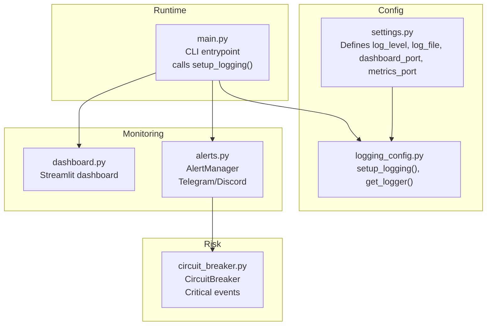
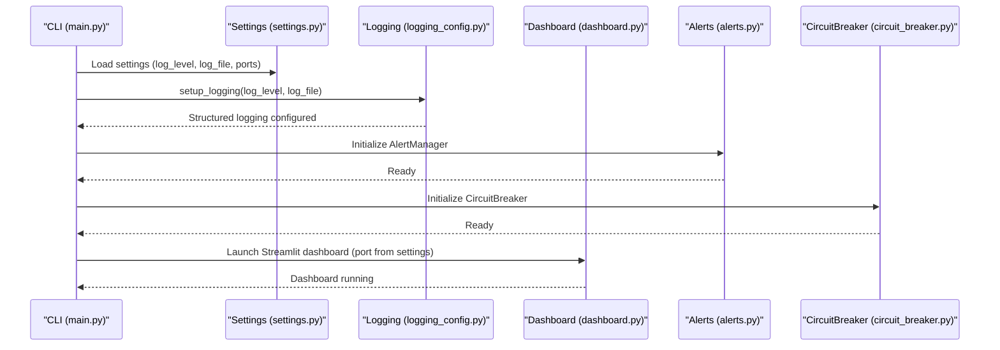
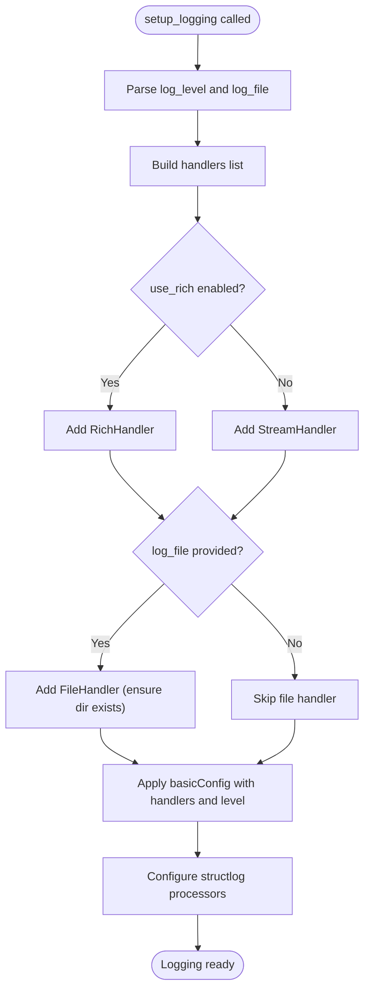
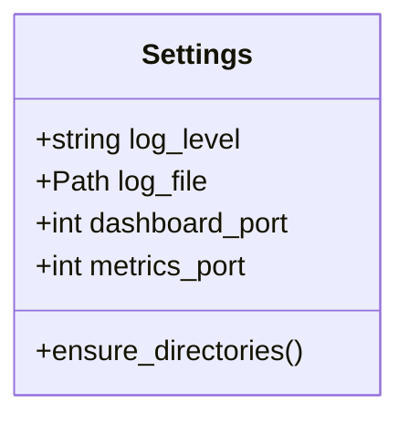
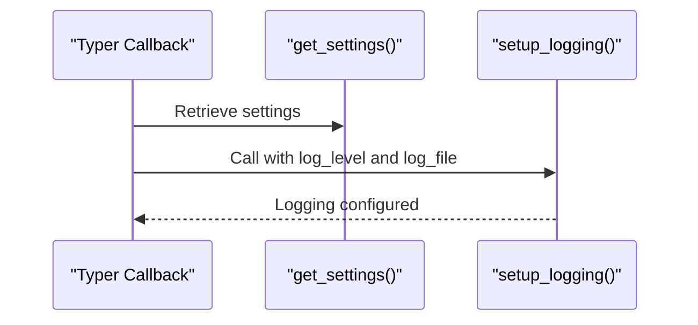
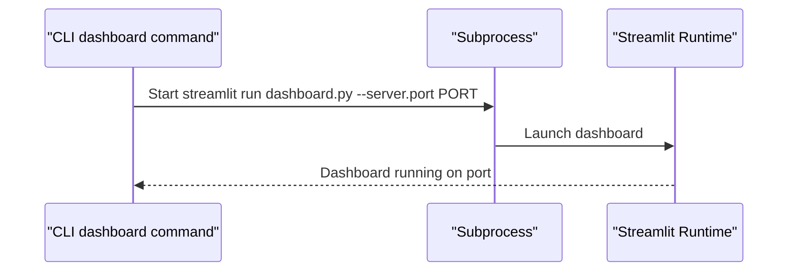
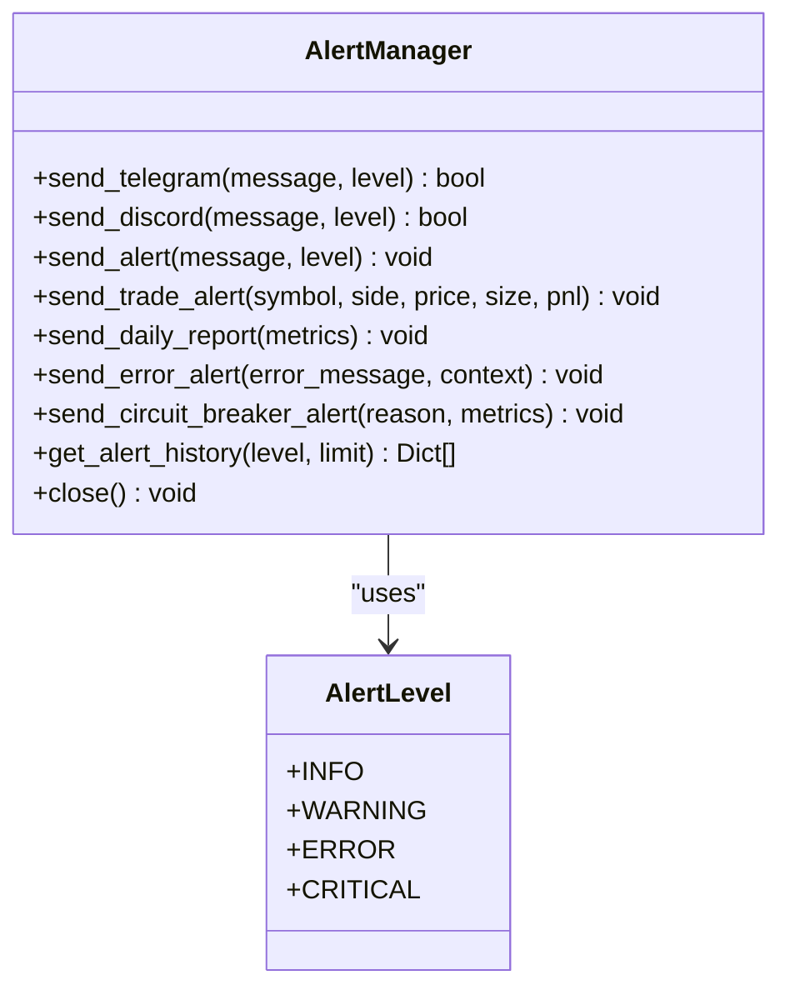
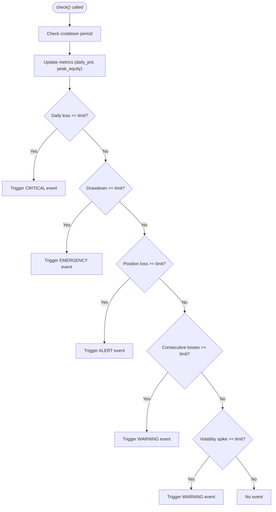
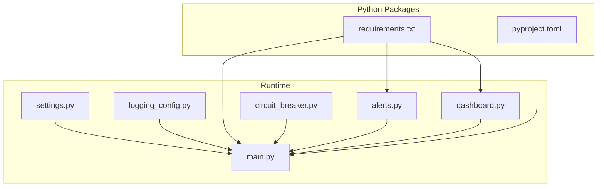

# Logging and Monitoring Configuration

<cite>
**Referenced Files in This Document**
- [logging_config.py](file://trading_bot/config/logging_config.py)
- [settings.py](file://trading_bot/config/settings.py)
- [main.py](file://trading_bot/main.py)
- [dashboard.py](file://trading_bot/monitoring/dashboard.py)
- [alerts.py](file://trading_bot/monitoring/alerts.py)
- [circuit_breaker.py](file://trading_bot/risk/circuit_breaker.py)
- [docker-compose.yml](file://docker-compose.yml)
- [Dockerfile](file://Dockerfile)
- [requirements.txt](file://requirements.txt)
- [pyproject.toml](file://pyproject.toml)
- [README.md](file://README.md)
</cite>

## Table of Contents
1. [Introduction](#introduction)
2. [Project Structure](#project-structure)
3. [Core Components](#core-components)
4. [Architecture Overview](#architecture-overview)
5. [Detailed Component Analysis](#detailed-component-analysis)
6. [Dependency Analysis](#dependency-analysis)
7. [Performance Considerations](#performance-considerations)
8. [Troubleshooting Guide](#troubleshooting-guide)
9. [Conclusion](#conclusion)
10. [Appendices](#appendices)

## Introduction
This document provides comprehensive guidance for logging and monitoring configuration in the trading bot. It covers log level settings, log file path configuration, structured logging setup, and the integration of a Streamlit dashboard with optional Prometheus metrics. It also explains how to configure dashboard_port and metrics_port, manage log rotation and file management, and consider centralized logging. Finally, it outlines production monitoring setups, alert thresholds, and performance metrics collection, along with practical examples and troubleshooting steps.

## Project Structure
The logging and monitoring configuration spans several modules:
- Configuration and logging initialization are defined in the config package.
- The main application initializes logging and orchestrates runtime behavior.
- Monitoring includes a Streamlit dashboard and alerting via Telegram and Discord.
- Risk management integrates circuit breakers that emit critical events suitable for alerting and dashboards.

**Diagram sources**
- [settings.py:112-123](file://trading_bot/config/settings.py#L112-L123)
- [logging_config.py:13-90](file://trading_bot/config/logging_config.py#L13-L90)
- [main.py:24-34](file://trading_bot/main.py#L24-L34)
- [dashboard.py:1-328](file://trading_bot/monitoring/dashboard.py#L1-L328)
- [alerts.py:23-311](file://trading_bot/monitoring/alerts.py#L23-L311)
- [circuit_breaker.py:32-278](file://trading_bot/risk/circuit_breaker.py#L32-L278)

**Section sources**
- [settings.py:112-123](file://trading_bot/config/settings.py#L112-L123)
- [logging_config.py:13-90](file://trading_bot/config/logging_config.py#L13-L90)
- [main.py:24-34](file://trading_bot/main.py#L24-L34)
- [dashboard.py:1-328](file://trading_bot/monitoring/dashboard.py#L1-L328)
- [alerts.py:23-311](file://trading_bot/monitoring/alerts.py#L23-L311)
- [circuit_breaker.py:32-278](file://trading_bot/risk/circuit_breaker.py#L32-L278)

## Core Components
- Logging configuration: Provides structured logging with console and optional file handlers, and configures structlog processors.
- Settings: Centralized configuration for log_level, log_file, dashboard_port, and metrics_port with validation and path parsing.
- Main application: Initializes logging at startup using settings and command-line flags.
- Dashboard: Streamlit-based monitoring interface; launched separately from the main process.
- Alerts: Asynchronous notification system for Telegram and Discord, with alert history and severity levels.
- Circuit breaker: Emits critical events suitable for alerting and dashboard reporting.

**Section sources**
- [logging_config.py:13-90](file://trading_bot/config/logging_config.py#L13-L90)
- [settings.py:112-123](file://trading_bot/config/settings.py#L112-L123)
- [main.py:24-34](file://trading_bot/main.py#L24-L34)
- [dashboard.py:1-328](file://trading_bot/monitoring/dashboard.py#L1-L328)
- [alerts.py:23-311](file://trading_bot/monitoring/alerts.py#L23-L311)
- [circuit_breaker.py:32-278](file://trading_bot/risk/circuit_breaker.py#L32-L278)

## Architecture Overview
The logging and monitoring architecture integrates configuration-driven logging, structured logging, asynchronous alerts, and a separate dashboard service.

**Diagram sources**
- [main.py:24-34](file://trading_bot/main.py#L24-L34)
- [settings.py:112-123](file://trading_bot/config/settings.py#L112-L123)
- [logging_config.py:13-90](file://trading_bot/config/logging_config.py#L13-L90)
- [dashboard.py:258-328](file://trading_bot/monitoring/dashboard.py#L258-L328)
- [alerts.py:23-311](file://trading_bot/monitoring/alerts.py#L23-L311)
- [circuit_breaker.py:32-278](file://trading_bot/risk/circuit_breaker.py#L32-L278)

## Detailed Component Analysis

### Logging Configuration
- Purpose: Configure structured logging with console and optional file handlers, and initialize structlog processors.
- Key behaviors:
  - Accepts log_level and log_file parameters.
  - Adds RichHandler or StreamHandler to console depending on use_rich flag.
  - Adds FileHandler when log_file is provided, ensuring parent directories exist.
  - Configures structlog with processors for filtering, timestamps, stack traces, and formatting.

**Diagram sources**
- [logging_config.py:13-90](file://trading_bot/config/logging_config.py#L13-L90)

**Section sources**
- [logging_config.py:13-90](file://trading_bot/config/logging_config.py#L13-L90)

### Settings and Ports
- log_level: Controls verbosity of logs.
- log_file: Path to the log file; ensures directory creation during initialization.
- dashboard_port: Port for the Streamlit dashboard.
- metrics_port: Port reserved for metrics exposure (e.g., Prometheus).

**Diagram sources**
- [settings.py:112-123](file://trading_bot/config/settings.py#L112-L123)
- [settings.py:157-162](file://trading_bot/config/settings.py#L157-L162)

**Section sources**
- [settings.py:112-123](file://trading_bot/config/settings.py#L112-L123)
- [settings.py:157-162](file://trading_bot/config/settings.py#L157-L162)

### Main Application Logging Initialization
- The CLI callback initializes logging using either verbose flag or settings log_level and writes to settings log_file.
- This ensures consistent logging across the application lifecycle.

**Diagram sources**
- [main.py:24-34](file://trading_bot/main.py#L24-L34)
- [logging_config.py:13-90](file://trading_bot/config/logging_config.py#L13-L90)

**Section sources**
- [main.py:24-34](file://trading_bot/main.py#L24-L34)

### Streamlit Dashboard and Ports
- The dashboard is launched as a separate process using Streamlit, binding to the configured port.
- The CLI exposes a dashboard command that starts the dashboard with the desired port.

**Diagram sources**
- [main.py:328-343](file://trading_bot/main.py#L328-L343)
- [dashboard.py:258-328](file://trading_bot/monitoring/dashboard.py#L258-L328)

**Section sources**
- [main.py:328-343](file://trading_bot/main.py#L328-L343)
- [dashboard.py:258-328](file://trading_bot/monitoring/dashboard.py#L258-L328)

### Alerts and Notification Channels
- AlertManager supports Telegram and Discord notifications asynchronously.
- Supports multiple alert levels and maintains alert history.
- Integrates with circuit breaker events for critical conditions.

**Diagram sources**
- [alerts.py:23-311](file://trading_bot/monitoring/alerts.py#L23-L311)

**Section sources**
- [alerts.py:23-311](file://trading_bot/monitoring/alerts.py#L23-L311)

### Circuit Breakers and Critical Events
- CircuitBreaker monitors portfolio metrics and emits events when thresholds are exceeded.
- These events are suitable for alerting and can be surfaced in the dashboard.

**Diagram sources**
- [circuit_breaker.py:88-184](file://trading_bot/risk/circuit_breaker.py#L88-L184)

**Section sources**
- [circuit_breaker.py:32-278](file://trading_bot/risk/circuit_breaker.py#L32-L278)

## Dependency Analysis
- Logging depends on structlog and optional Rich for console formatting.
- Settings depend on Pydantic settings for validation and environment variable loading.
- Main application depends on settings and logging configuration.
- Dashboard is a separate process launched by the CLI.
- Alerts depend on external services (Telegram and Discord) and use aiohttp for async HTTP.
- Docker Compose mounts logs and data directories for persistence.

**Diagram sources**
- [requirements.txt:31-36](file://requirements.txt#L31-L36)
- [pyproject.toml:54-59](file://pyproject.toml#L54-L59)
- [main.py:11-21](file://trading_bot/main.py#L11-L21)
- [settings.py:23-31](file://trading_bot/config/settings.py#L23-L31)
- [logging_config.py:3-10](file://trading_bot/config/logging_config.py#L3-L10)
- [alerts.py:8-10](file://trading_bot/monitoring/alerts.py#L8-L10)
- [circuit_breaker.py:8](file://trading_bot/risk/circuit_breaker.py#L8)
- [dashboard.py:11](file://trading_bot/monitoring/dashboard.py#L11)

**Section sources**
- [requirements.txt:31-36](file://requirements.txt#L31-L36)
- [pyproject.toml:54-59](file://pyproject.toml#L54-L59)
- [main.py:11-21](file://trading_bot/main.py#L11-L21)
- [settings.py:23-31](file://trading_bot/config/settings.py#L23-L31)
- [logging_config.py:3-10](file://trading_bot/config/logging_config.py#L3-L10)
- [alerts.py:8-10](file://trading_bot/monitoring/alerts.py#L8-L10)
- [circuit_breaker.py:8](file://trading_bot/risk/circuit_breaker.py#L8)
- [dashboard.py:11](file://trading_bot/monitoring/dashboard.py#L11)

## Performance Considerations
- Logging overhead: Structured logging adds processing cost; adjust log_level to balance observability and performance.
- File I/O: Writing to disk can block; consider rotating logs and using asynchronous appenders in high-throughput scenarios.
- Network I/O: Alerts to Telegram and Discord introduce latency; use batching or retry policies where appropriate.
- Dashboard rendering: Large datasets can slow Streamlit; precompute summaries and charts for responsiveness.

[No sources needed since this section provides general guidance]

## Troubleshooting Guide
Common logging and monitoring issues and resolutions:
- Logs not appearing in file:
  - Verify log_file path and ensure directories are created by settings.
  - Confirm setup_logging is called with log_file parameter.
- Verbose logging:
  - Use the verbose flag in the CLI to switch to DEBUG level.
- Dashboard not starting:
  - Ensure the dashboard port is free and accessible.
  - Confirm Streamlit is installed and the dashboard module is reachable.
- Alerts not sent:
  - Check Telegram/Discord credentials and network connectivity.
  - Review alert history for failures.
- Circuit breaker not triggering:
  - Validate threshold parameters and metric inputs passed to check().
- Docker logs:
  - Mount logs volume and inspect container logs for errors.

**Section sources**
- [settings.py:157-162](file://trading_bot/config/settings.py#L157-L162)
- [logging_config.py:45-59](file://trading_bot/config/logging_config.py#L45-L59)
- [main.py:24-34](file://trading_bot/main.py#L24-L34)
- [dashboard.py:258-328](file://trading_bot/monitoring/dashboard.py#L258-L328)
- [alerts.py:48-52](file://trading_bot/monitoring/alerts.py#L48-L52)
- [circuit_breaker.py:88-184](file://trading_bot/risk/circuit_breaker.py#L88-L184)
- [docker-compose.yml:14](file://docker-compose.yml#L14)

## Conclusion
The logging and monitoring configuration provides a robust foundation for observability, alerting, and dashboarding. By centralizing configuration in settings, initializing structured logging at startup, and separating concerns across modules, the system supports both development and production deployments. For production, pair local logging with centralized log aggregation, implement log rotation, and integrate alerting channels for critical events.

[No sources needed since this section summarizes without analyzing specific files]

## Appendices

### Configuration Reference
- log_level: Controls verbosity (e.g., INFO, DEBUG).
- log_file: Absolute or relative path to log file; parent directories are ensured.
- dashboard_port: Port for Streamlit dashboard (default 8501).
- metrics_port: Port reserved for metrics exposure (default 9090).

**Section sources**
- [settings.py:112-123](file://trading_bot/config/settings.py#L112-L123)

### Deployment Scenarios and Examples
- Local development:
  - Run the CLI; logs written to log_file with INFO level.
  - Launch dashboard locally on default port.
- Dockerized deployment:
  - Use docker-compose to mount logs and data volumes.
  - Dashboard runs in a dedicated service bound to port 8501.
  - Container health checks ensure liveness.

**Section sources**
- [docker-compose.yml:14](file://docker-compose.yml#L14)
- [docker-compose.yml:28-41](file://docker-compose.yml#L28-L41)
- [Dockerfile:32-40](file://Dockerfile#L32-L40)

### Centralized Logging and Log Rotation
- Centralized logging:
  - Forward logs to a log collector (e.g., Fluent Bit, Filebeat) and ingest into Elasticsearch/Opensearch or similar.
  - Ship logs from the mounted logs volume in containers.
- Log rotation:
  - Use OS-native rotation (e.g., logrotate) or application-side rotation with handlers supporting rotation.
  - Ensure rotation preserves structured log formats and metadata.

[No sources needed since this section provides general guidance]

### Monitoring Setup for Production Environments
- Metrics exposure:
  - Expose metrics on metrics_port for Prometheus scraping.
  - Instrument trading loops, execution latency, and error rates.
- Alert thresholds:
  - Circuit breaker thresholds (daily loss, drawdown, consecutive losses, volatility spikes) are configurable.
  - Use AlertManager to notify on critical events and errors.
- Performance metrics:
  - Track throughput, latency, error rates, and resource utilization.
  - Visualize in the Streamlit dashboard or external BI tools.

[No sources needed since this section provides general guidance]