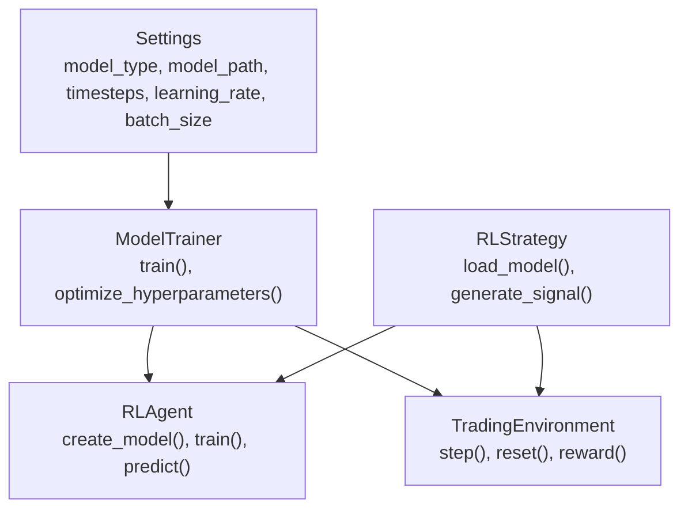
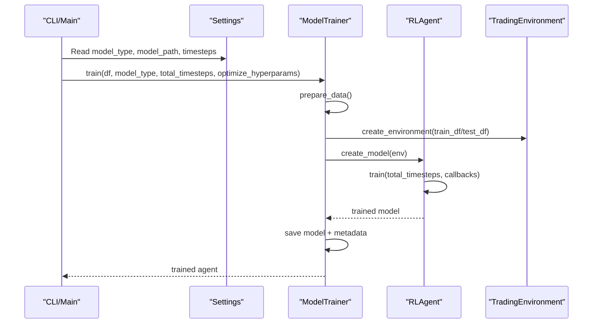
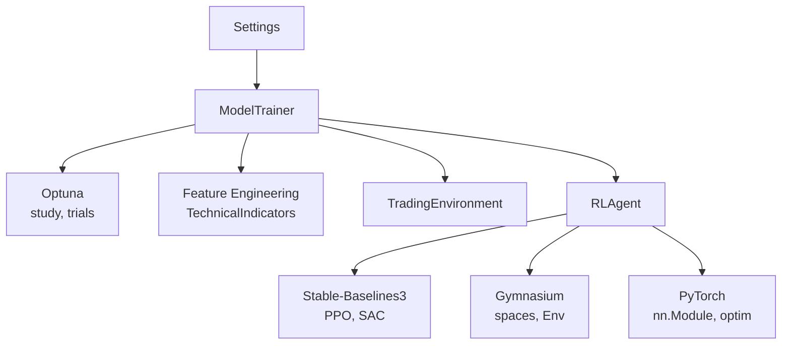

# Model Configuration

<cite>
**Referenced Files in This Document**
- [settings.py](file://trading_bot/config/settings.py)
- [rl_strategy.py](file://trading_bot/strategy/rl_strategy.py)
- [agent.py](file://trading_bot/models/agent.py)
- [train.py](file://trading_bot/models/train.py)
- [environment.py](file://trading_bot/models/environment.py)
- [main.py](file://trading_bot/main.py)
- [train.py](file://train.py)
- [README.md](file://README.md)
- [requirements.txt](file://requirements.txt)
</cite>

## Table of Contents
1. [Introduction](#introduction)
2. [Project Structure](#project-structure)
3. [Core Components](#core-components)
4. [Architecture Overview](#architecture-overview)
5. [Detailed Component Analysis](#detailed-component-analysis)
6. [Dependency Analysis](#dependency-analysis)
7. [Performance Considerations](#performance-considerations)
8. [Troubleshooting Guide](#troubleshooting-guide)
9. [Conclusion](#conclusion)
10. [Appendices](#appendices)

## Introduction
This document provides comprehensive model configuration guidance for reinforcement learning components in the trading bot. It explains how to select model_type between PPO and SAC, configure model_path, and tune training parameters such as timesteps, learning_rate, and batch_size. It also covers model persistence, versioning, deployment considerations, hyperparameter tuning, training duration recommendations, and evaluation metrics. Practical examples demonstrate configurations for different model architectures and trading objectives.

## Project Structure
The reinforcement learning stack is organized around three primary modules:
- Configuration and settings: centralizes model_type, model_path, timesteps, learning_rate, and batch_size
- Training pipeline: orchestrates data preparation, environment creation, hyperparameter optimization, and model saving
- Strategy and runtime: loads trained models for inference and generates trading signals

**Diagram sources**
- [settings.py:99-103](file://trading_bot/config/settings.py#L99-L103)
- [train.py:99-185](file://trading_bot/models/train.py#L99-L185)
- [agent.py:206-483](file://trading_bot/models/agent.py#L206-L483)
- [environment.py:15-404](file://trading_bot/models/environment.py#L15-L404)
- [rl_strategy.py:58-180](file://trading_bot/strategy/rl_strategy.py#L58-L180)

**Section sources**
- [settings.py:99-103](file://trading_bot/config/settings.py#L99-L103)
- [train.py:99-185](file://trading_bot/models/train.py#L99-L185)
- [agent.py:206-483](file://trading_bot/models/agent.py#L206-L483)
- [environment.py:15-404](file://trading_bot/models/environment.py#L15-L404)
- [rl_strategy.py:58-180](file://trading_bot/strategy/rl_strategy.py#L58-L180)

## Core Components
- Settings: Defines model_type (PPO or SAC), model_path, timesteps, learning_rate, and batch_size with defaults and validation.
- ModelTrainer: Manages data preparation, environment creation, optional hyperparameter optimization via Optuna, and model persistence with metadata.
- RLAgent: Wraps Stable-Baselines3 PPO/SAC, supports custom feature extractors, and handles training, saving, and loading.
- TradingEnvironment: Implements a Gymnasium-compatible environment with realistic trading mechanics and reward shaping.
- RLStrategy: Loads a trained model and generates signals for live/paper trading.

Key configuration fields:
- model_type: Selects PPO or SAC
- model_path: Directory for saving models and metadata
- timesteps: Total training steps for the agent
- learning_rate: Learning rate for optimizer
- batch_size: Mini-batch size for updates

**Section sources**
- [settings.py:99-103](file://trading_bot/config/settings.py#L99-L103)
- [train.py:99-185](file://trading_bot/models/train.py#L99-L185)
- [agent.py:206-483](file://trading_bot/models/agent.py#L206-L483)
- [environment.py:15-404](file://trading_bot/models/environment.py#L15-L404)
- [rl_strategy.py:58-180](file://trading_bot/strategy/rl_strategy.py#L58-L180)

## Architecture Overview
The training and runtime flow integrates configuration, training, and inference:

**Diagram sources**
- [main.py:106-156](file://trading_bot/main.py#L106-L156)
- [train.py:99-185](file://trading_bot/models/train.py#L99-L185)
- [agent.py:353-414](file://trading_bot/models/agent.py#L353-L414)
- [environment.py:72-87](file://trading_bot/models/environment.py#L72-L87)

## Detailed Component Analysis

### Model Type Selection: PPO vs SAC
- PPO: Preferred for stable policy updates, strong baseline for trading tasks, configurable clipping and value function coefficients.
- SAC: Off-policy actor-critic with entropy regularization, suitable for continuous action spaces and complex reward landscapes.

Selection criteria:
- Choose PPO for simpler, more interpretable policies and faster convergence on smaller datasets.
- Choose SAC for richer exploration and potential performance gains on larger datasets with complex dynamics.

Configuration:
- Set model_type to PPO or SAC in settings or CLI arguments.

**Section sources**
- [settings.py:17-21](file://trading_bot/config/settings.py#L17-L21)
- [train.py:89-94](file://trading_bot/models/train.py#L89-L94)
- [agent.py:302-340](file://trading_bot/models/agent.py#L302-L340)

### Model Path Configuration and Persistence
- model_path defines the directory for saving trained models and metadata.
- ModelTrainer saves:
  - Model archive (.zip) with timestamped name
  - Metadata JSON containing model_type, timestamp, hyperparameters, train/test sizes, and feature names
  - Optional TensorBoard logs under model_path/tensorboard
- RLAgent supports saving and loading models for runtime inference.

Best practices:
- Use a dedicated models directory with clear naming conventions.
- Store metadata alongside models for reproducibility and versioning.
- Back up model artifacts and metadata regularly.

**Section sources**
- [settings.py:100](file://trading_bot/config/settings.py#L100)
- [train.py:166-182](file://trading_bot/models/train.py#L166-L182)
- [agent.py:435-461](file://trading_bot/models/agent.py#L435-L461)

### Training Parameters: timesteps, learning_rate, batch_size
- timesteps: Controls total training steps; higher values improve learning but increase compute time.
- learning_rate: Optimizer learning rate; typically in the range suggested by hyperparameter optimization.
- batch_size: Mini-batch size; affects gradient stability and memory usage.

Impact on performance:
- learning_rate: Too high causes instability; too low slows convergence.
- batch_size: Larger batches stabilize gradients but require more memory; smaller batches introduce noise aiding exploration.
- timesteps: Insufficient steps underfit; excessive steps risk overfitting without proper validation.

Recommendations:
- Start with default values and adjust based on hyperparameter optimization results.
- Use walk-forward validation to assess generalization.

**Section sources**
- [settings.py:101-103](file://trading_bot/config/settings.py#L101-L103)
- [train.py:134-141](file://trading_bot/models/train.py#L134-L141)
- [train.py:261-275](file://trading_bot/models/train.py#L261-L275)
- [agent.py:302-340](file://trading_bot/models/agent.py#L302-L340)

### Hyperparameter Tuning Guidelines
- Optuna-based optimization samples learning_rate, batch_size, gamma, and optionally PPO-specific parameters (n_steps, gae_lambda, clip_range, vf_coef).
- Optimization runs for a subset of timesteps to reduce cost and prunes unpromising trials.
- Study and best parameters are persisted for reproducibility.

Guidelines:
- Increase n_trials for complex problems; monitor pruning effectiveness.
- Use walk-forward validation to evaluate out-of-sample performance.
- Track TensorBoard logs for training curves.

**Section sources**
- [train.py:187-244](file://trading_bot/models/train.py#L187-L244)
- [train.py:261-275](file://trading_bot/models/train.py#L261-L275)
- [train.py:310-383](file://trading_bot/models/train.py#L310-L383)

### Training Duration Recommendations
- Start with moderate timesteps (e.g., tens of thousands) and scale based on data size and task complexity.
- Use walk-forward validation to estimate robust training durations across market regimes.
- Monitor evaluation metrics during training to avoid overtraining.

**Section sources**
- [train.py:310-383](file://trading_bot/models/train.py#L310-L383)
- [train.py:157-163](file://trading_bot/models/train.py#L157-L163)

### Model Evaluation Metrics
- Environment metrics include total_return, sharpe_ratio, max_drawdown, win_rate, number of trades, and final_equity.
- Backtesting CLI prints a summary table with these metrics and saves a detailed report.

Metrics interpretation:
- Total return: Absolute performance over the simulation horizon.
- Sharpe ratio: Risk-adjusted return; higher is preferred.
- Max drawdown: Largest peak-to-trough decline; lower is preferred.
- Win rate: Proportion of profitable trades; balanced with expectancy.
- Final equity: Terminal account value.

**Section sources**
- [environment.py:364-404](file://trading_bot/models/environment.py#L364-L404)
- [main.py:193-211](file://trading_bot/main.py#L193-L211)

### Deployment Considerations
- Load trained models at runtime using RLStrategy with a model_path argument.
- Ensure model_path points to a valid model archive and metadata.
- Use CLI commands to run paper or live modes with a specified model.

Operational tips:
- Validate model compatibility (PPO/SAC) with the strategy.
- Monitor logs for loading and prediction errors.
- Keep model_path accessible and backed up.

**Section sources**
- [rl_strategy.py:58-66](file://trading_bot/strategy/rl_strategy.py#L58-L66)
- [main.py:214-325](file://trading_bot/main.py#L214-L325)

### Examples: Configuration for Different Architectures and Objectives
- PPO with LSTM feature extractor for sequence modeling:
  - Configure model_type=PPO and provide a custom features_extractor_class in RLAgent initialization.
  - Adjust learning_rate and batch_size according to optimization results.
- SAC with Transformer feature extractor for long-range dependencies:
  - Configure model_type=SAC and set appropriate hyperparameters.
  - Use larger timesteps for off-policy exploration.
- Multi-symbol training:
  - Combine features across symbols before training; train on a representative subset or use walk-forward across symbols.
- Objective-specific adjustments:
  - Trend-following: Emphasize momentum and trend features; consider higher n_steps for PPO.
  - Mean-reversion: Focus on volatility and regime features; adjust gamma and entropy coefficient.

Note: These examples describe configuration approaches; actual implementation relies on the provided classes and settings.

**Section sources**
- [agent.py:27-177](file://trading_bot/models/agent.py#L27-L177)
- [agent.py:302-340](file://trading_bot/models/agent.py#L302-L340)
- [rl_strategy.py:223-270](file://trading_bot/strategy/rl_strategy.py#L223-L270)

## Dependency Analysis
The reinforcement learning components depend on Stable-Baselines3, Gymnasium, Optuna, and PyTorch. The training pipeline integrates feature engineering and environment construction.

**Diagram sources**
- [requirements.txt:22-26](file://requirements.txt#L22-L26)
- [agent.py:10-21](file://trading_bot/models/agent.py#L10-L21)
- [train.py:15-18](file://trading_bot/models/train.py#L15-L18)
- [environment.py:5-8](file://trading_bot/models/environment.py#L5-L8)
- [settings.py:3-8](file://trading_bot/config/settings.py#L3-L8)

**Section sources**
- [requirements.txt:22-26](file://requirements.txt#L22-L26)
- [agent.py:10-21](file://trading_bot/models/agent.py#L10-L21)
- [train.py:15-18](file://trading_bot/models/train.py#L15-L18)
- [environment.py:5-8](file://trading_bot/models/environment.py#L5-L8)
- [settings.py:3-8](file://trading_bot/config/settings.py#L3-L8)

## Performance Considerations
- Memory and compute: Larger batch_size and timesteps increase GPU/CPU usage; adjust based on hardware capacity.
- Feature dimensionality: More features broaden observation space; consider dimensionality reduction or feature selection.
- Reward shaping: Proper reward formulation accelerates learning; ensure penalties for risk controls are appropriately weighted.
- Early stopping and checkpoints: Use evaluation callbacks and checkpointing to prevent overfitting and enable recovery.

[No sources needed since this section provides general guidance]

## Troubleshooting Guide
Common issues and resolutions:
- Import errors: Verify dependencies in requirements are installed.
- API connection errors: Confirm API keys and testnet settings in environment configuration.
- Out of memory: Reduce batch_size or observation window; consider smaller models.
- Model not loading: Ensure model_path points to a valid archive and metadata; confirm model_type matches the saved model.

**Section sources**
- [README.md:311-323](file://README.md#L311-L323)

## Conclusion
This guide outlined how to configure and deploy reinforcement learning models for trading. By selecting the appropriate model_type, setting model_path, tuning timesteps, learning_rate, and batch_size, and leveraging hyperparameter optimization and walk-forward validation, you can build robust, reproducible models. Persist models with metadata, monitor evaluation metrics, and follow deployment best practices to operate reliably in paper or live modes.

[No sources needed since this section summarizes without analyzing specific files]

## Appendices

### Configuration Reference
- model_type: PPO or SAC
- model_path: Directory for model artifacts
- timesteps: Training steps
- learning_rate: Optimizer learning rate
- batch_size: Mini-batch size

**Section sources**
- [settings.py:99-103](file://trading_bot/config/settings.py#L99-L103)

### CLI and Script Usage
- Training CLI: train command accepts model type, timesteps, and optimization flags.
- Training script: train.py supports symbol selection, timesteps, trials, and data path options.
- Backtesting: backtest command computes and displays performance metrics.

**Section sources**
- [main.py:106-156](file://trading_bot/main.py#L106-L156)
- [train.py:43-101](file://train.py#L43-L101)
- [main.py:160-211](file://trading_bot/main.py#L160-L211)