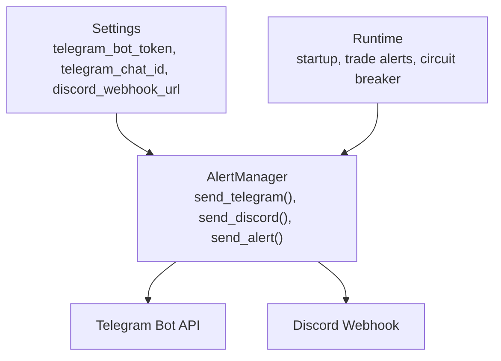
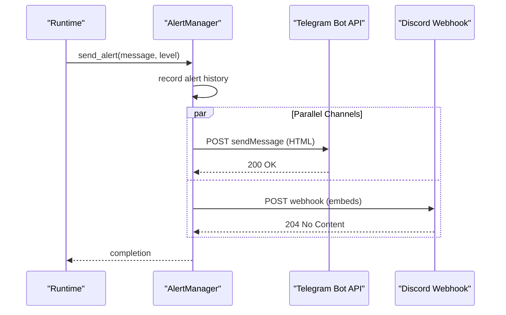
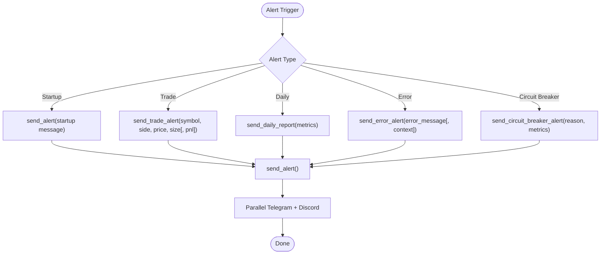
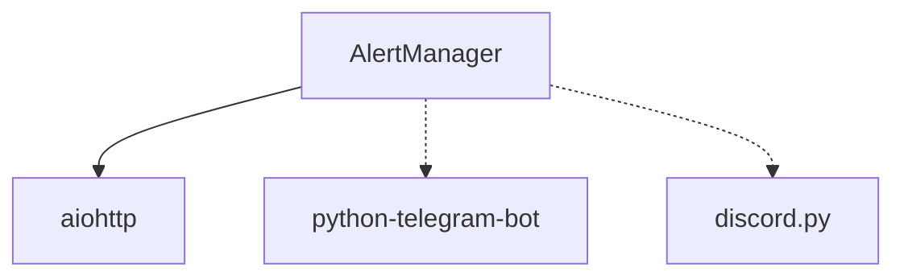

# Notification Configuration

<cite>
**Referenced Files in This Document**
- [settings.py](file://trading_bot/config/settings.py)
- [alerts.py](file://trading_bot/monitoring/alerts.py)
- [main.py](file://trading_bot/main.py)
- [logging_config.py](file://trading_bot/config/logging_config.py)
- [circuit_breaker.py](file://trading_bot/risk/circuit_breaker.py)
- [requirements.txt](file://requirements.txt)
- [README.md](file://README.md)
- [docker-compose.yml](file://docker-compose.yml)
</cite>

## Table of Contents
1. [Introduction](#introduction)
2. [Project Structure](#project-structure)
3. [Core Components](#core-components)
4. [Architecture Overview](#architecture-overview)
5. [Detailed Component Analysis](#detailed-component-analysis)
6. [Dependency Analysis](#dependency-analysis)
7. [Performance Considerations](#performance-considerations)
8. [Troubleshooting Guide](#troubleshooting-guide)
9. [Conclusion](#conclusion)

## Introduction
This document provides comprehensive guidance for configuring and operating Telegram and Discord notifications within the trading bot. It covers environment variable setup, authentication requirements, permission configuration, webhook setup, notification triggers, message formatting, and operational best practices for production deployments.

## Project Structure
The notification system spans configuration, alert management, and runtime integration:
- Configuration: Centralized settings define Telegram and Discord credentials.
- Alert Manager: Implements asynchronous notification delivery to Telegram and Discord.
- Runtime Integration: Startup and circuit breaker events trigger alerts.
- Logging: Structured logging captures alert delivery outcomes.

**Diagram sources**
- [settings.py:108-110](file://trading_bot/config/settings.py#L108-L110)
- [alerts.py:23-46](file://trading_bot/monitoring/alerts.py#L23-L46)
- [main.py:254-258](file://trading_bot/main.py#L254-L258)

**Section sources**
- [settings.py:108-110](file://trading_bot/config/settings.py#L108-L110)
- [alerts.py:23-46](file://trading_bot/monitoring/alerts.py#L23-L46)
- [main.py:254-258](file://trading_bot/main.py#L254-L258)

## Core Components
- Settings: Declares optional notification fields for Telegram and Discord.
- AlertManager: Asynchronous notifier that sends messages to Telegram and Discord, with HTML formatting for Telegram and embeds for Discord.
- Runtime Integration: Startup, trade execution, daily reports, and circuit breaker alerts are routed through AlertManager.
- Logging: Structured logging records successes and failures for alert delivery.

Key configuration fields:
- TELEGRAM_BOT_TOKEN: Telegram bot token used to authorize sending messages.
- TELEGRAM_CHAT_ID: Target chat identifier for Telegram notifications.
- DISCORD_WEBHOOK_URL: Discord webhook URL for posting embeds.

**Section sources**
- [settings.py:108-110](file://trading_bot/config/settings.py#L108-L110)
- [alerts.py:54-148](file://trading_bot/monitoring/alerts.py#L54-L148)
- [main.py:254-284](file://trading_bot/main.py#L254-L284)
- [logging_config.py:13-78](file://trading_bot/config/logging_config.py#L13-L78)

## Architecture Overview
The notification architecture integrates environment-driven configuration with asynchronous HTTP delivery to external services.

**Diagram sources**
- [alerts.py:150-179](file://trading_bot/monitoring/alerts.py#L150-L179)
- [alerts.py:82-98](file://trading_bot/monitoring/alerts.py#L82-L98)
- [alerts.py:139-145](file://trading_bot/monitoring/alerts.py#L139-L145)

## Detailed Component Analysis

### Telegram Configuration
- Environment Variables:
  - TELEGRAM_BOT_TOKEN: Required for Telegram delivery.
  - TELEGRAM_CHAT_ID: Required for Telegram delivery.
- Authentication:
  - Telegram uses bot tokens issued by BotFather. Messages are sent via the sendMessage endpoint.
- Permissions:
  - The bot must be invited to the chat and granted permission to send messages.
  - The chat ID must be a valid identifier for the target chat.
- Message Formatting:
  - Telegram messages use HTML parse mode with bold headers and emoji prefixes based on alert level.
- Delivery Behavior:
  - If either token or chat ID is missing, Telegram delivery is skipped.
  - Successful delivery returns HTTP 200.

Operational steps:
1. Create a Telegram bot via BotFather and obtain the token.
2. Determine the chat ID by messaging the bot and retrieving updates via the Telegram Bot API.
3. Set TELEGRAM_BOT_TOKEN and TELEGRAM_CHAT_ID in the environment.
4. Verify delivery by triggering a test alert.

**Section sources**
- [settings.py:108-110](file://trading_bot/config/settings.py#L108-L110)
- [alerts.py:54-101](file://trading_bot/monitoring/alerts.py#L54-L101)
- [alerts.py:82-88](file://trading_bot/monitoring/alerts.py#L82-L88)

### Discord Configuration
- Environment Variables:
  - DISCORD_WEBHOOK_URL: Required for Discord delivery.
- Authentication:
  - Discord webhooks are public URLs; no bearer token is required.
- Permissions:
  - The webhook must be configured in a server channel with permissions to post messages.
- Message Formatting:
  - Discord embeds include title, description, color, and timestamp. Colors correspond to alert levels.
- Delivery Behavior:
  - If the webhook URL is missing, Discord delivery is skipped.
  - Successful delivery returns HTTP 204 No Content.

Operational steps:
1. Create a Discord webhook in the desired channel.
2. Copy the webhook URL and set DISCORD_WEBHOOK_URL in the environment.
3. Verify delivery by triggering a test alert.

**Section sources**
- [settings.py:110](file://trading_bot/config/settings.py#L110)
- [alerts.py:103-148](file://trading_bot/monitoring/alerts.py#L103-L148)
- [alerts.py:128-135](file://trading_bot/monitoring/alerts.py#L128-L135)

### Notification Triggers and Message Types
- Startup Alert:
  - Sent on bot initialization to confirm connectivity.
- Trade Execution Alerts:
  - Include symbol, side, price, and size; optionally realized PnL for closed positions.
- Daily Reports:
  - Aggregated performance metrics and risk statistics.
- Error Alerts:
  - Standardized error messages with optional context.
- Circuit Breaker Alerts:
  - Critical alerts indicating trading pause with detailed metrics.

**Diagram sources**
- [main.py:254-258](file://trading_bot/main.py#L254-L258)
- [alerts.py:181-211](file://trading_bot/monitoring/alerts.py#L181-L211)
- [alerts.py:213-240](file://trading_bot/monitoring/alerts.py#L213-L240)
- [alerts.py:242-258](file://trading_bot/monitoring/alerts.py#L242-L258)
- [alerts.py:260-284](file://trading_bot/monitoring/alerts.py#L260-L284)

**Section sources**
- [main.py:254-258](file://trading_bot/main.py#L254-L258)
- [alerts.py:181-284](file://trading_bot/monitoring/alerts.py#L181-L284)

### Channel-Specific Customization
- Telegram:
  - Uses HTML parse mode with bold headers and emoji prefixes.
  - Requires a valid chat ID; otherwise delivery is skipped.
- Discord:
  - Uses embeds with color-coded severity and ISO timestamp.
  - Requires a valid webhook URL; otherwise delivery is skipped.

**Section sources**
- [alerts.py:72-80](file://trading_bot/monitoring/alerts.py#L72-L80)
- [alerts.py:120-133](file://trading_bot/monitoring/alerts.py#L120-L133)

## Dependency Analysis
External dependencies relevant to notifications:
- aiohttp: Asynchronous HTTP client used by AlertManager.
- python-telegram-bot: Not directly used by AlertManager; the implementation posts to Telegram Bot API endpoints directly.
- discord.py: Not directly used by AlertManager; the implementation posts to Discord webhooks directly.

**Diagram sources**
- [requirements.txt:10](file://requirements.txt#L10)
- [requirements.txt:33](file://requirements.txt#L33)
- [requirements.txt:34](file://requirements.txt#L34)

**Section sources**
- [requirements.txt:10](file://requirements.txt#L10)
- [requirements.txt:33](file://requirements.txt#L33)
- [requirements.txt:34](file://requirements.txt#L34)

## Performance Considerations
- Asynchronous Delivery:
  - AlertManager uses asyncio.gather to send notifications concurrently to Telegram and Discord, minimizing latency.
- Session Reuse:
  - AlertManager maintains a single aiohttp.ClientSession across deliveries to reduce overhead.
- Rate Limiting:
  - Telegram and Discord enforce rate limits. The implementation does not implement internal throttling; ensure low-frequency alerting to avoid service-side rate limits.
- Network Reliability:
  - HTTP status checks (200 for Telegram, 204 for Discord) indicate successful delivery; failures are logged for diagnostics.

**Section sources**
- [alerts.py:170-179](file://trading_bot/monitoring/alerts.py#L170-L179)
- [alerts.py:48-52](file://trading_bot/monitoring/alerts.py#L48-L52)

## Troubleshooting Guide
Common issues and resolutions:
- Missing Credentials:
  - Symptoms: Alerts silently skipped.
  - Resolution: Set TELEGRAM_BOT_TOKEN, TELEGRAM_CHAT_ID, and/or DISCORD_WEBHOOK_URL in the environment.
- Invalid Chat ID:
  - Symptoms: Telegram delivery fails with non-200 responses.
  - Resolution: Confirm chat ID is correct and the bot has permission to send messages.
- Invalid Webhook URL:
  - Symptoms: Discord delivery fails with non-204 responses.
  - Resolution: Recreate the webhook in the correct channel and copy the URL accurately.
- Network Connectivity:
  - Symptoms: Exceptions during HTTP requests.
  - Resolution: Verify outbound internet access and firewall rules; retry delivery.
- Logging and Diagnostics:
  - Use structured logging to inspect alert delivery outcomes and error messages.

Operational verification:
- Trigger a startup alert to validate configuration.
- Manually cause a trade alert to confirm message formatting.
- Review logs for HTTP status codes and exceptions.

**Section sources**
- [settings.py:108-110](file://trading_bot/config/settings.py#L108-L110)
- [alerts.py:68-69](file://trading_bot/monitoring/alerts.py#L68-L69)
- [alerts.py:117](file://trading_bot/monitoring/alerts.py#L117)
- [logging_config.py:13-78](file://trading_bot/config/logging_config.py#L13-L78)

## Conclusion
The notification system provides robust, asynchronous delivery to Telegram and Discord with clear configuration and logging. By setting the appropriate environment variables, ensuring correct permissions, and validating webhook configurations, operators can reliably receive trade alerts, daily reports, and critical circuit breaker notifications. For production deployments, monitor delivery outcomes, respect platform rate limits, and maintain secure credential storage.