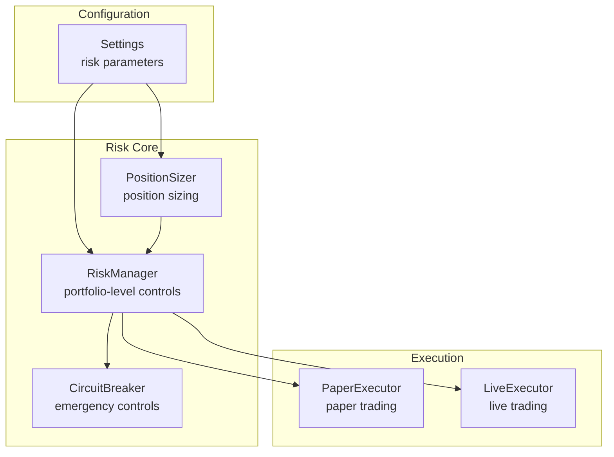
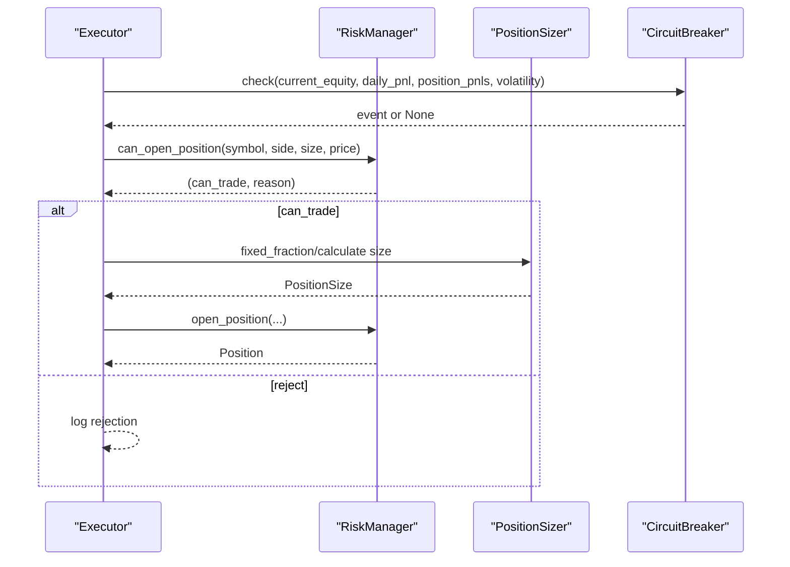
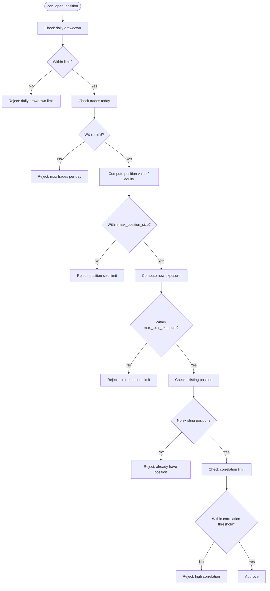
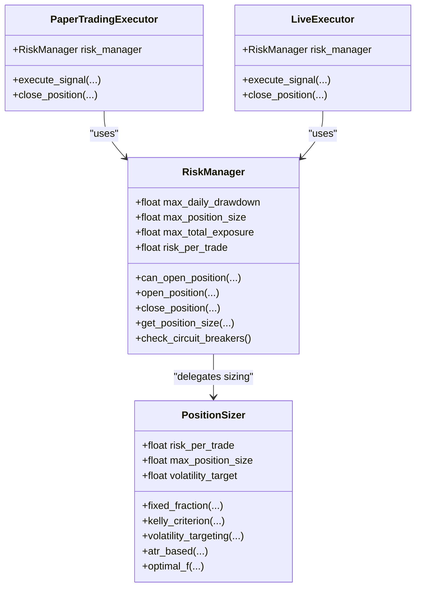
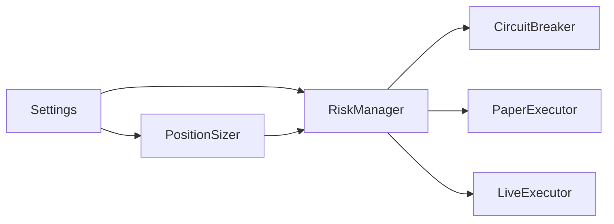

# Risk Management Configuration

<cite>
**Referenced Files in This Document**
- [settings.py](file://trading_bot/config/settings.py)
- [manager.py](file://trading_bot/risk/manager.py)
- [sizing.py](file://trading_bot/risk/sizing.py)
- [circuit_breaker.py](file://trading_bot/risk/circuit_breaker.py)
- [paper.py](file://trading_bot/execution/paper.py)
- [live.py](file://trading_bot/execution/live.py)
- [main.py](file://trading_bot/main.py)
- [test_risk.py](file://trading_bot/tests/test_risk.py)
- [README.md](file://README.md)
</cite>

## Table of Contents
1. [Introduction](#introduction)
2. [Project Structure](#project-structure)
3. [Core Components](#core-components)
4. [Architecture Overview](#architecture-overview)
5. [Detailed Component Analysis](#detailed-component-analysis)
6. [Dependency Analysis](#dependency-analysis)
7. [Performance Considerations](#performance-considerations)
8. [Troubleshooting Guide](#troubleshooting-guide)
9. [Conclusion](#conclusion)
10. [Appendices](#appendices)

## Introduction
This document provides comprehensive risk management configuration guidance for the trading bot. It explains drawdown controls, position sizing parameters, exposure limits, and volatility targeting settings. It covers max_daily_drawdown, max_position_size, max_total_exposure, and risk_per_trade calculations, along with volatility_target configuration and its impact on position sizing. It includes risk parameter tuning guidelines, stress testing recommendations, and integration with the circuit breaker system. Practical examples demonstrate conservative versus aggressive risk configurations for different market conditions.

## Project Structure
Risk management spans configuration, sizing, portfolio-level risk control, and circuit breakers. The system integrates with the execution engines (paper and live) and exposes risk metrics for monitoring and alerts.

**Diagram sources**
- [settings.py:58-78](file://trading_bot/config/settings.py#L58-L78)
- [manager.py:58-101](file://trading_bot/risk/manager.py#L58-L101)
- [sizing.py:25-46](file://trading_bot/risk/sizing.py#L25-L46)
- [circuit_breaker.py:32-74](file://trading_bot/risk/circuit_breaker.py#L32-L74)
- [paper.py:70-74](file://trading_bot/execution/paper.py#L70-L74)
- [live.py:56](file://trading_bot/execution/live.py#L56)

**Section sources**
- [settings.py:58-78](file://trading_bot/config/settings.py#L58-L78)
- [manager.py:58-101](file://trading_bot/risk/manager.py#L58-L101)
- [sizing.py:25-46](file://trading_bot/risk/sizing.py#L25-L46)
- [circuit_breaker.py:32-74](file://trading_bot/risk/circuit_breaker.py#L32-L74)
- [paper.py:70-74](file://trading_bot/execution/paper.py#L70-L74)
- [live.py:56](file://trading_bot/execution/live.py#L56)

## Core Components
- RiskManager: Portfolio-level risk controller enforcing daily drawdown, position size, total exposure, and trade frequency limits. It computes daily drawdown and maintains open positions.
- PositionSizer: Implements multiple position sizing methods including fixed fraction, Kelly criterion, ATR-based, volatility targeting, and optimal f. It calculates risk_amount, notional, and leverage constraints.
- CircuitBreaker: Enforces emergency controls including daily loss limits, maximum drawdown, position loss thresholds, consecutive losses, and volatility spikes. It supports automatic actions and cooldowns.
- Settings: Centralized risk parameters exposed via configuration, including max_daily_drawdown, max_position_size, max_total_exposure, risk_per_trade, and volatility_target.

Key risk parameters:
- max_daily_drawdown: Maximum allowable daily drawdown (fraction of peak equity).
- max_position_size: Maximum position size as a fraction of current equity.
- max_total_exposure: Maximum total exposure as a fraction of current equity.
- risk_per_trade: Risk per trade as a fraction of capital (used in fixed fraction sizing).
- volatility_target: Annualized volatility target for volatility targeting sizing.

**Section sources**
- [manager.py:61-88](file://trading_bot/risk/manager.py#L61-L88)
- [sizing.py:28-46](file://trading_bot/risk/sizing.py#L28-L46)
- [circuit_breaker.py:35-59](file://trading_bot/risk/circuit_breaker.py#L35-L59)
- [settings.py:59-78](file://trading_bot/config/settings.py#L59-L78)

## Architecture Overview
The risk system integrates with the execution engines and configuration. The RiskManager coordinates position opening/closing and enforces limits. PositionSizer computes sizes based on chosen methods. CircuitBreaker monitors equity and volatility to trigger protective actions.

**Diagram sources**
- [main.py:265-279](file://trading_bot/main.py#L265-L279)
- [circuit_breaker.py:88-184](file://trading_bot/risk/circuit_breaker.py#L88-L184)
- [manager.py:102-148](file://trading_bot/risk/manager.py#L102-L148)
- [sizing.py:48-91](file://trading_bot/risk/sizing.py#L48-L91)

## Detailed Component Analysis

### RiskManager: Portfolio-Level Controls
Responsibilities:
- Enforce max_daily_drawdown, max_position_size, max_total_exposure, max_trades_per_day, and correlation constraints.
- Track daily PnL, peak equity, current equity, and daily drawdown.
- Manage open positions and compute unrealized PnL updates.
- Trigger circuit breakers and integrate with stop-loss/take-profit logic.

Key calculations:
- daily_drawdown = (peak_equity - current_equity) / peak_equity
- Exposure = sum of notional values of open positions
- Position value = size × price / current_equity

Decision logic flow for position opening:

**Diagram sources**
- [manager.py:102-148](file://trading_bot/risk/manager.py#L102-L148)

**Section sources**
- [manager.py:58-101](file://trading_bot/risk/manager.py#L58-L101)
- [manager.py:102-148](file://trading_bot/risk/manager.py#L102-L148)
- [manager.py:234-237](file://trading_bot/risk/manager.py#L234-L237)
- [manager.py:299-321](file://trading_bot/risk/manager.py#L299-L321)

### PositionSizer: Position Sizing Methods
Methods and parameters:
- fixed_fraction: Uses risk_per_trade and stop_loss to compute risk_amount and notional, then caps by max_position_size.
- kelly_criterion: Computes optimal fraction using historical win_rate, avg_win, avg_loss, scaled by kelly_fraction.
- volatility_targeting: Calculates realized volatility from price history, scales base notional by target_volatility/realized_vol, caps by max_position_size.
- atr_based: Uses ATR to set stop distance and compute position size, with stop_loss derived from entry_price ± ATR multiplier.
- optimal_f: Uses historical returns to estimate optimal f and applies safety factor.

Key formulas:
- risk_amount = capital × risk_per_trade
- notional = min(risk_amount / (price_risk / entry_price), capital × max_position_size)
- realized_vol = std(log_returns) × sqrt(365)
- vol_scalar = target_volatility / realized_vol
- notional = base_notional × vol_scalar (with caps)

Impact of volatility_target:
- Lower realized volatility increases notional (more risk-on).
- Higher realized volatility decreases notional (more risk-off).
- Combined with risk_per_trade and max_position_size, it dynamically adjusts exposure.

**Section sources**
- [sizing.py:48-91](file://trading_bot/risk/sizing.py#L48-L91)
- [sizing.py:93-140](file://trading_bot/risk/sizing.py#L93-L140)
- [sizing.py:142-195](file://trading_bot/risk/sizing.py#L142-L195)
- [sizing.py:197-238](file://trading_bot/risk/sizing.py#L197-L238)
- [sizing.py:240-289](file://trading_bot/risk/sizing.py#L240-L289)

### CircuitBreaker: Emergency Controls
Triggers and actions:
- Daily loss limit: Exceeds max_daily_loss_pct of current equity.
- Maximum drawdown: Drawdown reaches max_drawdown_pct.
- Position loss limit: Single position loss exceeds max_position_loss_pct.
- Consecutive losses: Continuous losing periods reach max_consecutive_losses.
- Volatility spike: Current volatility exceeds baseline by max_volatility_spike.

Cooldown and reset:
- After triggering, a cooldown prevents repeated triggers for cooldown_minutes.
- Reset clears state and resets counters.

Integration with RiskManager:
- RiskManager’s check_circuit_breakers mirrors drawdown thresholds and consecutive loss checks, complementing CircuitBreaker’s broader metrics.

**Section sources**
- [circuit_breaker.py:88-184](file://trading_bot/risk/circuit_breaker.py#L88-L184)
- [circuit_breaker.py:237-243](file://trading_bot/risk/circuit_breaker.py#L237-L243)
- [manager.py:299-321](file://trading_bot/risk/manager.py#L299-L321)

### Configuration and Parameter Tuning
Centralized risk parameters:
- max_daily_drawdown: Default 0.05 (5%).
- max_position_size: Default 0.3 (30%).
- max_total_exposure: Default 0.8 (80%).
- risk_per_trade: Default 0.02 (2%).
- volatility_target: Default 0.15 (15%).

Tuning guidelines:
- Conservative configuration:
  - max_daily_drawdown: 0.03–0.05
  - max_position_size: 0.15–0.25
  - max_total_exposure: 0.4–0.6
  - risk_per_trade: 0.01–0.02
  - volatility_target: 0.12–0.15
- Aggressive configuration:
  - max_daily_drawdown: 0.06–0.08
  - max_position_size: 0.4–0.6
  - max_total_exposure: 0.7–0.9
  - risk_per_trade: 0.03–0.05
  - volatility_target: 0.15–0.18

Market condition adjustments:
- Low volatility environments: Increase volatility_target slightly to reduce over-concentration.
- High volatility regimes: Decrease volatility_target to curtail risk-on behavior.
- Trendy markets: Consider higher risk_per_trade with tighter position size caps.
- Sideways markets: Favor lower risk_per_trade and stricter drawdown limits.

**Section sources**
- [settings.py:59-78](file://trading_bot/config/settings.py#L59-L78)
- [README.md:240-255](file://README.md#L240-L255)

### Integration with Execution Engines
- PaperExecutor: Initializes RiskManager with configured limits and uses PositionSizer for sizing. Applies slippage and commission in execution.
- LiveExecutor: Uses RiskManager for pre-trade checks and sizing, then places real orders via exchange APIs.

**Diagram sources**
- [paper.py:70-74](file://trading_bot/execution/paper.py#L70-L74)
- [live.py:56](file://trading_bot/execution/live.py#L56)
- [manager.py:90-93](file://trading_bot/risk/manager.py#L90-L93)

**Section sources**
- [paper.py:115-208](file://trading_bot/execution/paper.py#L115-L208)
- [live.py:115-223](file://trading_bot/execution/live.py#L115-L223)
- [manager.py:323-353](file://trading_bot/risk/manager.py#L323-L353)

## Dependency Analysis
- RiskManager depends on PositionSizer for sizing decisions and on configuration for limits.
- PositionSizer depends on configuration for risk_per_trade, max_position_size, and volatility_target.
- CircuitBreaker operates independently but complements RiskManager’s drawdown logic.
- Execution engines depend on RiskManager for pre-trade checks and sizing.

**Diagram sources**
- [settings.py:59-78](file://trading_bot/config/settings.py#L59-L78)
- [manager.py:90-93](file://trading_bot/risk/manager.py#L90-L93)
- [sizing.py:43-46](file://trading_bot/risk/sizing.py#L43-L46)
- [circuit_breaker.py:32-74](file://trading_bot/risk/circuit_breaker.py#L32-L74)
- [paper.py:70-74](file://trading_bot/execution/paper.py#L70-L74)
- [live.py:56](file://trading_bot/execution/live.py#L56)

**Section sources**
- [settings.py:59-78](file://trading_bot/config/settings.py#L59-L78)
- [manager.py:90-93](file://trading_bot/risk/manager.py#L90-L93)
- [sizing.py:43-46](file://trading_bot/risk/sizing.py#L43-L46)
- [circuit_breaker.py:32-74](file://trading_bot/risk/circuit_breaker.py#L32-L74)
- [paper.py:70-74](file://trading_bot/execution/paper.py#L70-L74)
- [live.py:56](file://trading_bot/execution/live.py#L56)

## Performance Considerations
- Position sizing computation is O(1) per trade; overhead is minimal.
- Daily drawdown and exposure checks are O(n_positions) during updates.
- Circuit breaker checks are O(1) per cycle.
- Volatility targeting requires sufficient price history; insufficient data falls back to fixed fraction sizing.

[No sources needed since this section provides general guidance]

## Troubleshooting Guide
Common issues and resolutions:
- Position rejected due to daily drawdown limit: Reduce risk_per_trade or increase max_daily_drawdown cautiously.
- Position size exceeds limit: Lower max_position_size or increase capital.
- Total exposure limit exceeded: Reduce max_total_exposure or avoid simultaneous positions.
- Circuit breaker triggered:
  - Daily loss limit: Pause trading until cooldown ends or reduce risk parameters.
  - Maximum drawdown: Emergency close positions or tighten limits.
  - Consecutive losses: Reduce position size or switch to conservative mode.
  - Volatility spike: Reduce exposure and consider halting new entries.

Validation and testing:
- Use unit tests to verify sizing methods and risk checks.
- Stress test with extreme scenarios (black swan events, high volatility spikes).
- Backtest with walk-forward analysis to evaluate parameter robustness.

**Section sources**
- [test_risk.py:15-28](file://trading_bot/tests/test_risk.py#L15-L28)
- [test_risk.py:75-91](file://trading_bot/tests/test_risk.py#L75-L91)
- [test_risk.py:114-129](file://trading_bot/tests/test_risk.py#L114-L129)
- [test_risk.py:135-148](file://trading_bot/tests/test_risk.py#L135-L148)

## Conclusion
The risk management system provides robust portfolio-level controls, flexible position sizing, and emergency safeguards. Proper configuration of max_daily_drawdown, max_position_size, max_total_exposure, risk_per_trade, and volatility_target enables adaptation to varying market conditions. Conservative setups prioritize capital preservation, while aggressive setups aim for higher growth potential with stricter controls. Integration with execution engines ensures consistent enforcement across paper and live modes, and circuit breakers provide automated protection during adverse conditions.

[No sources needed since this section summarizes without analyzing specific files]

## Appendices

### Risk Parameter Definitions and Units
- max_daily_drawdown: Fraction of peak equity (e.g., 0.05 = 5%).
- max_position_size: Fraction of current equity (e.g., 0.3 = 30%).
- max_total_exposure: Fraction of current equity (e.g., 0.8 = 80%).
- risk_per_trade: Fraction of capital used per trade (e.g., 0.02 = 2%).
- volatility_target: Annualized volatility target (e.g., 0.15 = 15%).

### Example Configurations

Conservative configuration:
- max_daily_drawdown: 0.04
- max_position_size: 0.20
- max_total_exposure: 0.50
- risk_per_trade: 0.015
- volatility_target: 0.13

Aggressive configuration:
- max_daily_drawdown: 0.07
- max_position_size: 0.50
- max_total_exposure: 0.85
- risk_per_trade: 0.04
- volatility_target: 0.17

[No sources needed since this section provides general guidance]