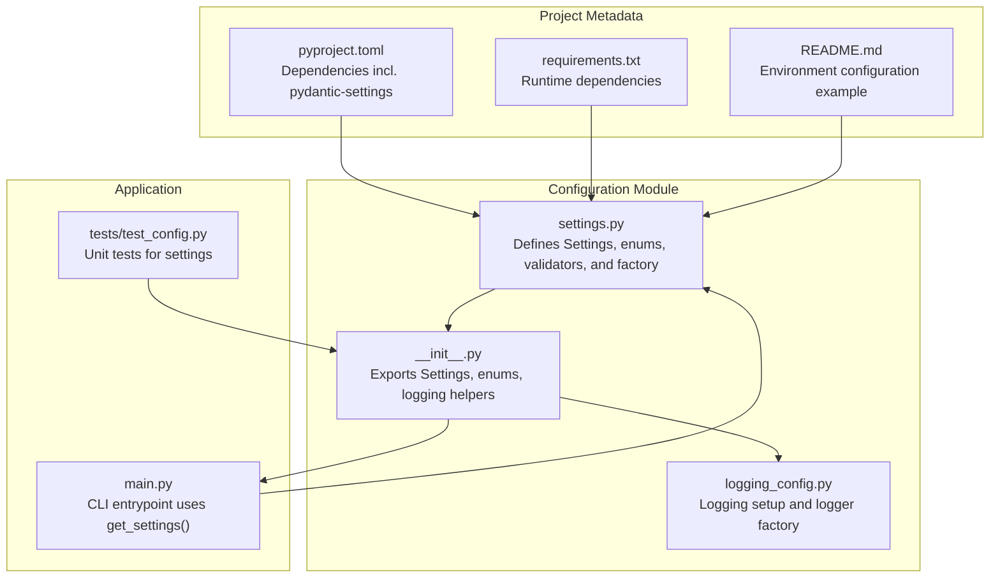
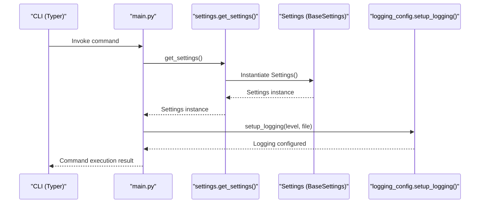
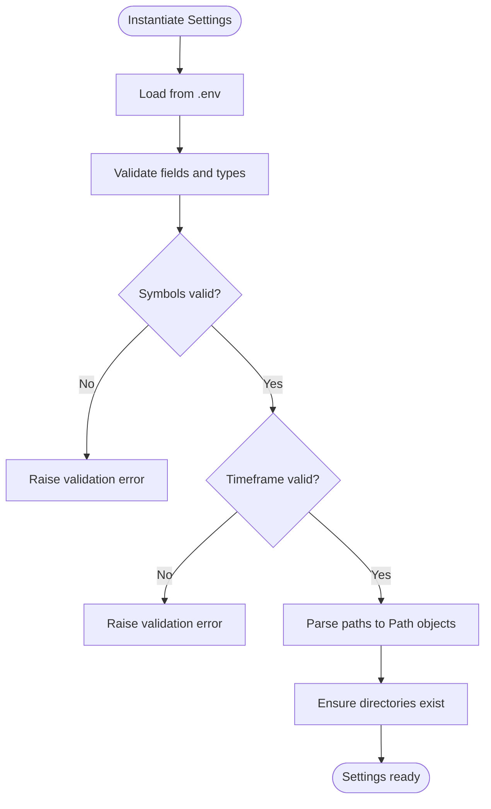
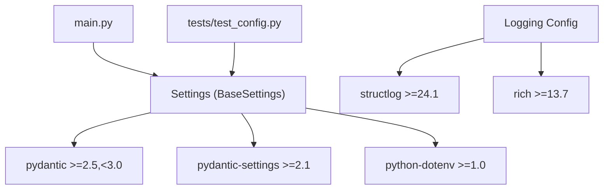

# Settings Structure and Validation

<cite>
**Referenced Files in This Document**
- [settings.py](file://trading_bot/config/settings.py)
- [__init__.py](file://trading_bot/config/__init__.py)
- [logging_config.py](file://trading_bot/config/logging_config.py)
- [main.py](file://trading_bot/main.py)
- [test_config.py](file://trading_bot/tests/test_config.py)
- [pyproject.toml](file://pyproject.toml)
- [README.md](file://README.md)
- [requirements.txt](file://requirements.txt)
</cite>

## Table of Contents
1. [Introduction](#introduction)
2. [Project Structure](#project-structure)
3. [Core Components](#core-components)
4. [Architecture Overview](#architecture-overview)
5. [Detailed Component Analysis](#detailed-component-analysis)
6. [Dependency Analysis](#dependency-analysis)
7. [Performance Considerations](#performance-considerations)
8. [Troubleshooting Guide](#troubleshooting-guide)
9. [Conclusion](#conclusion)

## Introduction
This document explains the centralized settings system built with Pydantic BaseSettings. It covers the Settings class structure, field definitions, validation rules, configuration categories, environment variable loading, type conversion, and validation logic. It also documents the TradingMode and ModelType enumerations, path parsing utilities, and symbol list processing. Finally, it provides examples of configuration inheritance, environment-specific overrides, and best practices for maintaining configuration consistency across different deployment environments.

## Project Structure
The settings system resides in the configuration module and integrates with the main application and logging subsystems. The configuration module exports the Settings class, enumerations, and logging helpers.

**Diagram sources**
- [settings.py:1-176](file://trading_bot/config/settings.py#L1-L176)
- [__init__.py:1-7](file://trading_bot/config/__init__.py#L1-L7)
- [logging_config.py:1-91](file://trading_bot/config/logging_config.py#L1-L91)
- [main.py:1-347](file://trading_bot/main.py#L1-L347)
- [test_config.py:1-50](file://trading_bot/tests/test_config.py#L1-L50)
- [pyproject.toml:25-69](file://pyproject.toml#L25-L69)
- [requirements.txt:4-6](file://requirements.txt#L4-L6)
- [README.md:100-128](file://README.md#L100-L128)

**Section sources**
- [settings.py:1-176](file://trading_bot/config/settings.py#L1-L176)
- [__init__.py:1-7](file://trading_bot/config/__init__.py#L1-L7)
- [logging_config.py:1-91](file://trading_bot/config/logging_config.py#L1-L91)
- [main.py:1-347](file://trading_bot/main.py#L1-L347)
- [test_config.py:1-50](file://trading_bot/tests/test_config.py#L1-L50)
- [pyproject.toml:25-69](file://pyproject.toml#L25-L69)
- [requirements.txt:4-6](file://requirements.txt#L4-L6)
- [README.md:100-128](file://README.md#L100-L128)

## Core Components
- Settings: Centralized configuration container using Pydantic BaseSettings with environment variable loading and validation.
- Enums: TradingMode (paper/live) and ModelType (PPO/SAC).
- Validators: Symbol parsing, timeframe validation, and path normalization.
- Factory: get_settings() singleton that ensures directories exist.

Key characteristics:
- Environment file: .env loaded via env_file setting.
- Case-insensitive environment variables.
- Extra fields ignored during loading.
- Type conversion and validation occur automatically during instantiation.

**Section sources**
- [settings.py:23-31](file://trading_bot/config/settings.py#L23-L31)
- [settings.py:11-21](file://trading_bot/config/settings.py#L11-L21)
- [settings.py:124-150](file://trading_bot/config/settings.py#L124-L150)
- [settings.py:169-176](file://trading_bot/config/settings.py#L169-L176)

## Architecture Overview
The settings system integrates with the CLI and logging subsystems. The main entrypoint retrieves settings via a factory function and uses them to configure logging and pass runtime parameters to commands.

**Diagram sources**
- [main.py:24-35](file://trading_bot/main.py#L24-L35)
- [settings.py:169-176](file://trading_bot/config/settings.py#L169-L176)
- [logging_config.py:13-59](file://trading_bot/config/logging_config.py#L13-L59)

## Detailed Component Analysis

### Settings Class Structure
The Settings class defines configuration categories and validation rules. It uses Pydantic’s BaseSettings with a SettingsConfigDict to load from .env and enforce validation.

Categories and fields:
- Exchange Configuration: API keys, testnet flag.
- Trading Configuration: Mode, symbols, timeframe, capital, positions, leverage.
- Risk Management: Drawdown, position size, exposure, risk per trade, volatility target.
- Data Storage: Paths for data, SQLite DB, Parquet, and log file.
- Redis: Host, port, DB, optional password.
- Model Configuration: Model type, model path, timesteps, learning rate, batch size.
- Notifications: Telegram and Discord optional credentials.
- Logging: Level and log file path.
- Monitoring: Dashboard and metrics ports.

Validation rules:
- Symbols: Non-empty comma-separated list; whitespace trimmed; raises error if empty.
- Timeframe: Must match a predefined set of valid values; otherwise raises error.
- Paths: Strings are parsed to Path objects; ensures parent directories exist.

Properties and utilities:
- symbol_list: Returns a list derived from the symbols string.
- ensure_directories: Creates directories for data, parquet, models, and log file parent.

**Section sources**
- [settings.py:23-176](file://trading_bot/config/settings.py#L23-L176)

### Enumerations
- TradingMode: paper, live.
- ModelType: PPO, SAC.

These enums are used as typed fields in Settings and validated automatically.

**Section sources**
- [settings.py:11-21](file://trading_bot/config/settings.py#L11-L21)

### Validation Logic
- Symbol parsing validator enforces non-empty input and cleans whitespace around symbols.
- Timeframe validator restricts accepted values to a curated list.
- Path validator converts string paths to Path objects before assignment.
- Directory creation ensures paths exist at runtime.

**Diagram sources**
- [settings.py:124-150](file://trading_bot/config/settings.py#L124-L150)
- [settings.py:157-162](file://trading_bot/config/settings.py#L157-L162)

### Environment Variable Loading and Overrides
- SettingsConfigDict specifies env_file=".env", env_file_encoding="utf-8", case_sensitive=False, extra="ignore".
- Environment variables are loaded automatically during Settings instantiation.
- Values from .env override defaults; missing variables keep defaults.
- Case-insensitive environment variables simplify deployment flexibility.

Best practices:
- Define defaults in code for local development.
- Override via .env for staging and production.
- Use separate .env files per environment (e.g., .env.staging, .env.production) and load them explicitly if needed.

**Section sources**
- [settings.py:26-31](file://trading_bot/config/settings.py#L26-L31)
- [README.md:100-128](file://README.md#L100-L128)

### Type Conversion and Validation
- Automatic type conversion occurs for primitives (str, int, float, bool).
- Path fields accept strings and convert to Path objects via a validator.
- Enum fields accept string values and are validated against enum members.

Examples:
- symbols: string to list via property.
- timeframe: string validated against a whitelist.
- data_dir/db_path/parquet_path/model_path/log_file: string to Path via validator.

**Section sources**
- [settings.py:124-150](file://trading_bot/config/settings.py#L124-L150)
- [settings.py:152-155](file://trading_bot/config/settings.py#L152-L155)

### Symbol List Processing
- Property symbol_list splits the symbols string by commas and strips whitespace.
- Used widely across the application to iterate over trading pairs.

**Section sources**
- [settings.py:152-155](file://trading_bot/config/settings.py#L152-L155)
- [main.py:78-79](file://trading_bot/main.py#L78-L79)
- [main.py:236-237](file://trading_bot/main.py#L236-L237)

### Path Parsing Utilities
- Validator parse_path converts string paths to Path objects.
- ensure_directories creates data, parquet, model, and log file parent directories.

**Section sources**
- [settings.py:144-162](file://trading_bot/config/settings.py#L144-L162)

### Configuration Categories and Defaults
- Exchange: API keys empty by default; testnet enabled by default.
- Trading: Paper mode, default symbols, hourly timeframe, initial capital, position limits, leverage.
- Risk: Reasonable defaults for drawdown, position size, exposure, risk per trade, volatility target.
- Storage: Local filesystem paths under ./data and ./logs.
- Redis: Localhost defaults with optional password.
- Model: PPO by default, training parameters.
- Notifications: Disabled by default.
- Logging: INFO level, log file path.
- Monitoring: Dashboard and metrics ports.

**Section sources**
- [settings.py:36-122](file://trading_bot/config/settings.py#L36-L122)

### Integration with Application and Tests
- main.py retrieves settings via get_settings() and uses them for logging and command execution.
- tests/test_config.py validates defaults, symbol parsing, timeframe validation, and directory creation.

**Section sources**
- [main.py:30-34](file://trading_bot/main.py#L30-L34)
- [main.py:51-65](file://trading_bot/main.py#L51-L65)
- [test_config.py:9-49](file://trading_bot/tests/test_config.py#L9-L49)

## Dependency Analysis
The settings system depends on Pydantic and pydantic-settings for configuration loading and validation. Logging is configured via structlog and standard logging.

**Diagram sources**
- [pyproject.toml:25-69](file://pyproject.toml#L25-L69)
- [requirements.txt:4-6](file://requirements.txt#L4-L6)
- [logging_config.py:8-78](file://trading_bot/config/logging_config.py#L8-L78)
- [main.py:11](file://trading_bot/main.py#L11)
- [test_config.py:6](file://trading_bot/tests/test_config.py#L6)

**Section sources**
- [pyproject.toml:25-69](file://pyproject.toml#L25-L69)
- [requirements.txt:4-6](file://requirements.txt#L4-L6)
- [logging_config.py:8-78](file://trading_bot/config/logging_config.py#L8-L78)
- [main.py:11](file://trading_bot/main.py#L11)
- [test_config.py:6](file://trading_bot/tests/test_config.py#L6)

## Performance Considerations
- Settings are lazily instantiated via a singleton factory; subsequent calls reuse the cached instance.
- Path creation happens once during first instantiation; repeated calls are inexpensive.
- Environment loading occurs during instantiation; consider preloading in long-running processes if needed.

[No sources needed since this section provides general guidance]

## Troubleshooting Guide
Common issues and resolutions:
- Invalid timeframe: Ensure the timeframe matches one of the allowed values; otherwise a validation error is raised.
- Empty symbols: Provide at least one symbol; otherwise a validation error is raised.
- Missing directories: ensure_directories creates missing directories; verify permissions if creation fails.
- Environment variables not applied: Confirm .env file path and encoding; remember case-insensitivity.

Validation and testing references:
- Timeframe validation and symbol parsing are covered by unit tests.
- Directory creation is verified by a dedicated test.

**Section sources**
- [settings.py:124-150](file://trading_bot/config/settings.py#L124-L150)
- [settings.py:157-162](file://trading_bot/config/settings.py#L157-L162)
- [test_config.py:28-35](file://trading_bot/tests/test_config.py#L28-L35)
- [test_config.py:37-49](file://trading_bot/tests/test_config.py#L37-L49)

## Conclusion
The centralized settings system provides a robust, validated configuration layer powered by Pydantic BaseSettings. It supports environment-driven configuration, strict validation, and convenient utilities for path handling and symbol processing. By leveraging the singleton factory and environment files, teams can maintain consistent configuration across development, staging, and production environments while preserving type safety and clear defaults.