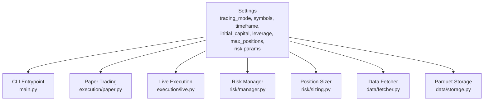
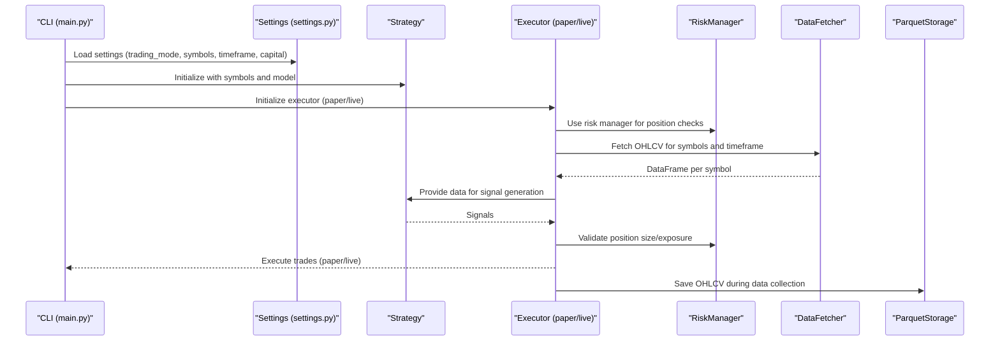
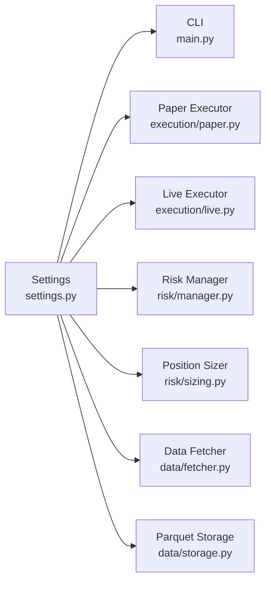

# Trading Parameters

<cite>
**Referenced Files in This Document**
- [settings.py](file://trading_bot/config/settings.py)
- [__init__.py](file://trading_bot/config/__init__.py)
- [main.py](file://trading_bot/main.py)
- [paper.py](file://trading_bot/execution/paper.py)
- [live.py](file://trading_bot/execution/live.py)
- [manager.py](file://trading_bot/risk/manager.py)
- [sizing.py](file://trading_bot/risk/sizing.py)
- [fetcher.py](file://trading_bot/data/fetcher.py)
- [storage.py](file://trading_bot/data/storage.py)
- [test_config.py](file://trading_bot/tests/test_config.py)
- [test_risk.py](file://trading_bot/tests/test_risk.py)
- [README.md](file://README.md)
- [requirements.txt](file://requirements.txt)
</cite>

## Table of Contents
1. [Introduction](#introduction)
2. [Project Structure](#project-structure)
3. [Core Components](#core-components)
4. [Architecture Overview](#architecture-overview)
5. [Detailed Component Analysis](#detailed-component-analysis)
6. [Dependency Analysis](#dependency-analysis)
7. [Performance Considerations](#performance-considerations)
8. [Troubleshooting Guide](#troubleshooting-guide)
9. [Conclusion](#con conclusion)
10. [Appendices](#appendices)

## Introduction
This document explains how to configure and validate trading parameters for the system. It covers:
- Trading mode selection between paper and live
- Symbol configuration with comma-separated values
- Timeframe settings and validation
- Capital management parameters (initial capital, leverage, position limits)
- Market data parameters (timeframe, data storage)
- Validation rules and best practices
- Example configurations for different strategies and risk profiles

## Project Structure
The trading parameter configuration is centralized in the settings module and consumed across execution, risk management, and data layers.

**Diagram sources**
- [settings.py:23-176](file://trading_bot/config/settings.py#L23-L176)
- [main.py:11-347](file://trading_bot/main.py#L11-L347)
- [paper.py:36-392](file://trading_bot/execution/paper.py#L36-L392)
- [live.py:38-364](file://trading_bot/execution/live.py#L38-L364)
- [manager.py:58-432](file://trading_bot/risk/manager.py#L58-L432)
- [sizing.py:25-312](file://trading_bot/risk/sizing.py#L25-L312)
- [fetcher.py:32-200](file://trading_bot/data/fetcher.py#L32-L200)
- [storage.py:53-200](file://trading_bot/data/storage.py#L53-L200)

**Section sources**
- [settings.py:23-176](file://trading_bot/config/settings.py#L23-L176)
- [main.py:11-347](file://trading_bot/main.py#L11-L347)

## Core Components
Key trading parameters and their roles:
- Trading mode: Selects paper vs live execution
- Symbols: Comma-separated list of tradable pairs
- Timeframe: Candle duration used for data and strategy
- Initial capital: Starting account balance for simulations and risk calculations
- Leverage: Not directly exposed in Settings; configured via position sizing and execution
- Position limits: Max position size and total exposure fractions
- Risk controls: Max daily drawdown, risk per trade, volatility target

Validation highlights:
- Symbols must be non-empty and properly formatted
- Timeframe must match supported values
- Paths are normalized to Path objects

**Section sources**
- [settings.py:43-78](file://trading_bot/config/settings.py#L43-L78)
- [settings.py:124-142](file://trading_bot/config/settings.py#L124-L142)
- [settings.py:144-150](file://trading_bot/config/settings.py#L144-L150)
- [settings.py:152-155](file://trading_bot/config/settings.py#L152-L155)

## Architecture Overview
End-to-end flow from configuration to execution and risk control.

**Diagram sources**
- [main.py:214-325](file://trading_bot/main.py#L214-L325)
- [settings.py:43-78](file://trading_bot/config/settings.py#L43-L78)
- [paper.py:115-208](file://trading_bot/execution/paper.py#L115-L208)
- [live.py:115-224](file://trading_bot/execution/live.py#L115-L224)
- [manager.py:102-148](file://trading_bot/risk/manager.py#L102-L148)
- [fetcher.py:111-164](file://trading_bot/data/fetcher.py#L111-L164)
- [storage.py:71-116](file://trading_bot/data/storage.py#L71-L116)

## Detailed Component Analysis

### Settings and Parameter Validation
- Trading mode: Enumerated choice between paper and live
- Symbols: Comma-separated with whitespace trimming; enforced non-empty
- Timeframe: Whitelist of supported values
- Paths: Converted from strings to Path objects
- Derived symbol list: Convenience property for downstream consumers

Best practices:
- Always set TRADING_MODE to paper for testing
- Keep symbols concise and aligned with exchange availability
- Choose timeframe consistent with strategy horizon

**Section sources**
- [settings.py:11-14](file://trading_bot/config/settings.py#L11-L14)
- [settings.py:43-54](file://trading_bot/config/settings.py#L43-L54)
- [settings.py:124-142](file://trading_bot/config/settings.py#L124-L142)
- [settings.py:144-150](file://trading_bot/config/settings.py#L144-L150)
- [settings.py:152-155](file://trading_bot/config/settings.py#L152-L155)

### Execution Modes: Paper vs Live
- Paper mode: Simulates trades with slippage and commission; tracks equity and drawdown
- Live mode: Places real orders via exchange APIs; includes rate limiting and risk checks

Operational differences:
- Paper uses fixed slippage and commission assumptions
- Live uses real exchange pricing and enforces risk limits

**Section sources**
- [paper.py:36-75](file://trading_bot/execution/paper.py#L36-L75)
- [live.py:38-86](file://trading_bot/execution/live.py#L38-L86)
- [main.py:244-252](file://trading_bot/main.py#L244-L252)

### Risk Management and Position Limits
- Position sizing: Multiple methods (fixed fraction, Kelly, ATR-based, volatility targeting)
- Portfolio-level limits: Max position size, total exposure, daily drawdown
- Circuit breakers: Triggers based on drawdown and consecutive losses

Key parameters:
- Max position size: Fraction of capital per symbol
- Max total exposure: Portfolio-wide exposure cap
- Risk per trade: Fraction of capital risking per trade
- Max daily drawdown: Threshold for circuit breakers

**Section sources**
- [sizing.py:25-312](file://trading_bot/risk/sizing.py#L25-L312)
- [manager.py:58-148](file://trading_bot/risk/manager.py#L58-L148)
- [manager.py:299-321](file://trading_bot/risk/manager.py#L299-L321)

### Market Data Parameters
- Timeframe: Used for fetching OHLCV and backtesting
- Data storage: Parquet files per symbol/timeframe
- Exchange configuration: Binance API keys and testnet flag

Integration points:
- DataFetcher reads timeframe and symbols from settings
- ParquetStorage organizes OHLCV by symbol and timeframe

**Section sources**
- [fetcher.py:111-164](file://trading_bot/data/fetcher.py#L111-L164)
- [storage.py:53-116](file://trading_bot/data/storage.py#L53-L116)
- [settings.py:36-38](file://trading_bot/config/settings.py#L36-L38)

### CLI Consumption of Parameters
- config command prints effective settings
- run command accepts mode override
- fetch-data and backtest commands consume symbols and timeframe

**Section sources**
- [main.py:48-66](file://trading_bot/main.py#L48-L66)
- [main.py:214-252](file://trading_bot/main.py#L214-L252)
- [main.py:68-103](file://trading_bot/main.py#L68-L103)
- [main.py:159-212](file://trading_bot/main.py#L159-L212)

## Dependency Analysis
Parameter dependencies across modules:

**Diagram sources**
- [settings.py:23-176](file://trading_bot/config/settings.py#L23-L176)
- [main.py:11-347](file://trading_bot/main.py#L11-L347)
- [paper.py:10-14](file://trading_bot/execution/paper.py#L10-L14)
- [live.py:8-11](file://trading_bot/execution/live.py#L8-L11)
- [manager.py:10-11](file://trading_bot/risk/manager.py#L10-L11)
- [sizing.py:9](file://trading_bot/risk/sizing.py#L9)
- [fetcher.py:12](file://trading_bot/data/fetcher.py#L12)
- [storage.py:14](file://trading_bot/data/storage.py#L14)

**Section sources**
- [settings.py:23-176](file://trading_bot/config/settings.py#L23-L176)
- [main.py:11-347](file://trading_bot/main.py#L11-L347)

## Performance Considerations
- Timeframe selection impacts data volume and computation cost
- Using fewer symbols reduces concurrent fetches and storage overhead
- Parquet storage enables fast retrieval for backtesting
- Risk manager checks reduce unnecessary order placement

[No sources needed since this section provides general guidance]

## Troubleshooting Guide
Common validation and runtime issues:
- Empty or invalid timeframe: Raises validation error; ensure value is in supported whitelist
- Invalid symbols list: Non-empty requirement enforced
- Live mode confirmation: CLI prompts before proceeding in live mode
- Exchange connectivity: Verify API keys and testnet settings
- Insufficient capital: Paper executor checks capital against notional plus commission

**Section sources**
- [settings.py:124-142](file://trading_bot/config/settings.py#L124-L142)
- [main.py:223-226](file://trading_bot/main.py#L223-L226)
- [paper.py:164-167](file://trading_bot/execution/paper.py#L164-L167)
- [README.md:309-323](file://README.md#L309-L323)

## Conclusion
The configuration system centralizes trading parameters with strong validation and clear defaults. By selecting the appropriate trading mode, configuring symbols and timeframe, and tuning capital management parameters, users can tailor the system to their strategy and risk profile. Always test in paper mode first and progressively increase capital and aggressiveness.

[No sources needed since this section summarizes without analyzing specific files]

## Appendices

### Parameter Reference and Defaults
- Trading mode: paper (default)
- Symbols: comma-separated list (default includes major pairs)
- Timeframe: candle duration (default hourly)
- Initial capital: monetary amount for simulations
- Max position size: fraction of capital per symbol
- Max total exposure: portfolio-wide exposure cap
- Risk per trade: fraction of capital risking per trade
- Max daily drawdown: threshold for circuit breakers

Validation rules:
- Symbols must be non-empty after trimming
- Timeframe must be one of the supported values
- Paths are normalized to Path objects

**Section sources**
- [settings.py:43-78](file://trading_bot/config/settings.py#L43-L78)
- [settings.py:124-142](file://trading_bot/config/settings.py#L124-L142)
- [settings.py:144-150](file://trading_bot/config/settings.py#L144-L150)

### Example Configurations
Note: Replace values with your environment and strategy needs.

- Conservative swing trading
  - trading_mode: paper
  - symbols: BTC/USDT,ETH/USDT
  - timeframe: 4h
  - initial_capital: 10000
  - max_position_size: 0.2
  - max_total_exposure: 0.5
  - risk_per_trade: 0.01
  - max_daily_drawdown: 0.03

- Aggressive intraday scalping
  - trading_mode: paper
  - symbols: BTC/USDT,ETH/USDT,SOL/USDT
  - timeframe: 15m
  - initial_capital: 5000
  - max_position_size: 0.3
  - max_total_exposure: 0.8
  - risk_per_trade: 0.02
  - max_daily_drawdown: 0.05

- Live testing (use with caution)
  - trading_mode: live
  - symbols: BTC/USDT
  - timeframe: 1h
  - initial_capital: 100
  - leverage: 1.0 (no gearing)
  - risk_per_trade: 0.01
  - max_daily_drawdown: 0.02

Best practices:
- Start with paper mode and conservative risk parameters
- Align timeframe with strategy holding period
- Monitor drawdown and adjust position sizing accordingly
- Use circuit breakers to protect capital during adverse conditions

**Section sources**
- [README.md:100-128](file://README.md#L100-L128)
- [manager.py:58-89](file://trading_bot/risk/manager.py#L58-L89)

### Validation and Tests
- Symbol parsing and validation tested
- Timeframe validation tested
- Directory creation validated
- Risk manager position sizing and limits tested

**Section sources**
- [test_config.py:19-35](file://trading_bot/tests/test_config.py#L19-L35)
- [test_config.py:37-49](file://trading_bot/tests/test_config.py#L37-L49)
- [test_risk.py:12-56](file://trading_bot/tests/test_risk.py#L12-L56)
- [test_risk.py:58-113](file://trading_bot/tests/test_risk.py#L58-L113)
- [test_risk.py:114-129](file://trading_bot/tests/test_risk.py#L114-L129)