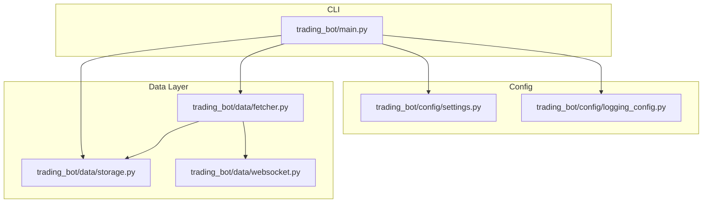
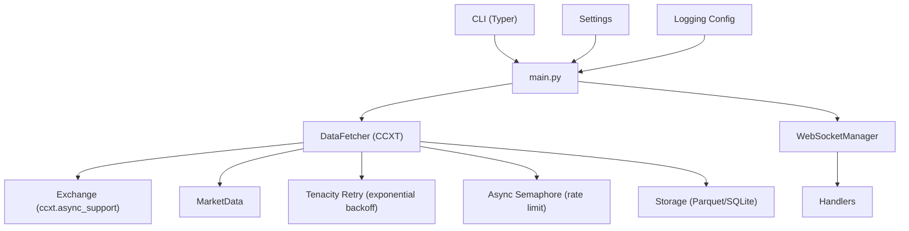
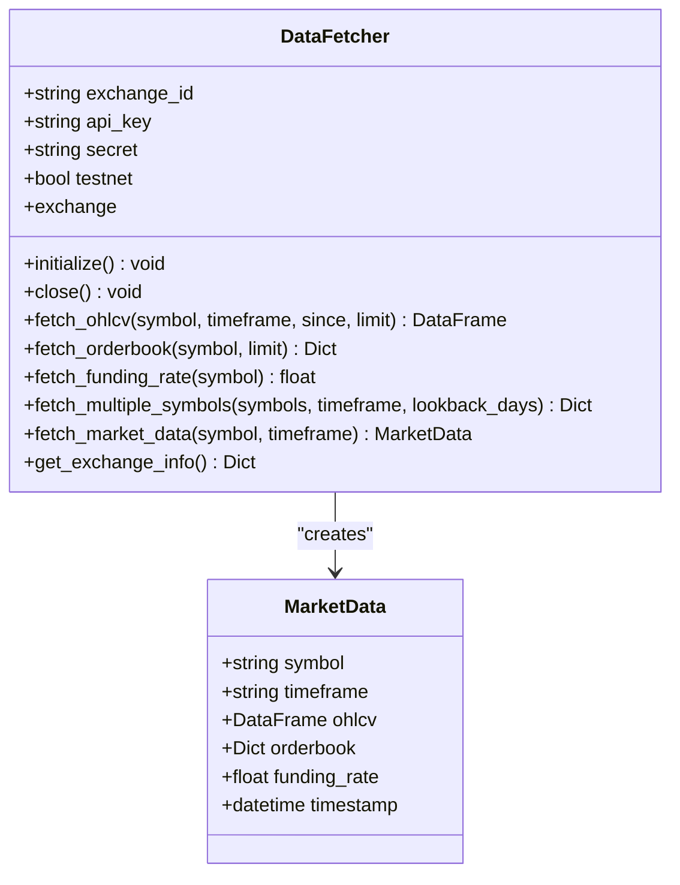
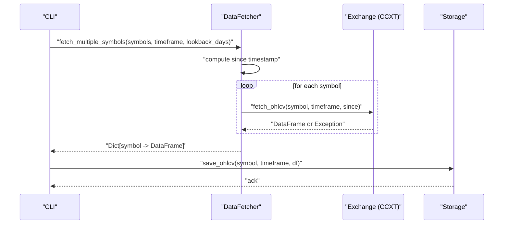
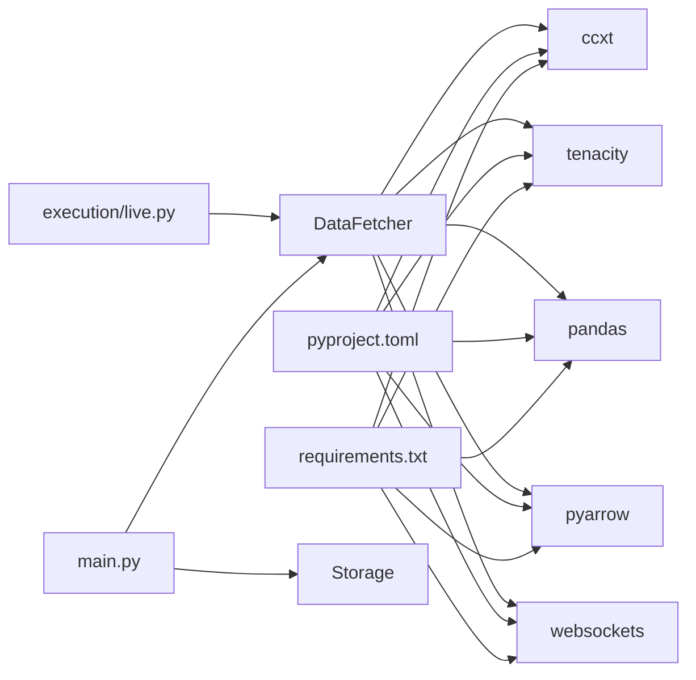

# Data Fetching

<cite>
**Referenced Files in This Document**
- [README.md](file://README.md)
- [requirements.txt](file://requirements.txt)
- [pyproject.toml](file://pyproject.toml)
- [trading_bot/main.py](file://trading_bot/main.py)
- [trading_bot/config/settings.py](file://trading_bot/config/settings.py)
- [trading_bot/config/logging_config.py](file://trading_bot/config/logging_config.py)
- [trading_bot/data/fetcher.py](file://trading_bot/data/fetcher.py)
- [trading_bot/data/storage.py](file://trading_bot/data/storage.py)
- [trading_bot/data/websocket.py](file://trading_bot/data/websocket.py)
- [trading_bot/execution/live.py](file://trading_bot/execution/live.py)
</cite>

## Table of Contents
1. [Introduction](#introduction)
2. [Project Structure](#project-structure)
3. [Core Components](#core-components)
4. [Architecture Overview](#architecture-overview)
5. [Detailed Component Analysis](#detailed-component-analysis)
6. [Dependency Analysis](#dependency-analysis)
7. [Performance Considerations](#performance-considerations)
8. [Troubleshooting Guide](#troubleshooting-guide)
9. [Conclusion](#conclusion)

## Introduction
This document explains the Data Fetching subsystem of the trading bot, focusing on the CCXT integration architecture, asynchronous data fetching patterns, and the MarketData container. It covers OHLCV retrieval, orderbook fetching with order flow calculations, and funding rate extraction. It also documents rate limiting, retry logic with exponential backoff, error handling strategies, exchange initialization for testnet and production, symbol validation, and market data aggregation. Practical examples demonstrate fetching single and multiple symbols, handling network errors, and integrating custom data sources.

## Project Structure
The Data Fetching subsystem spans several modules:
- Data fetching and storage: trading_bot/data/fetcher.py, trading_bot/data/storage.py
- Real-time streaming: trading_bot/data/websocket.py
- Configuration and settings: trading_bot/config/settings.py, trading_bot/config/logging_config.py
- CLI entry points and usage: trading_bot/main.py
- Project dependencies: requirements.txt, pyproject.toml
- High-level architecture overview: README.md

**Diagram sources**
- [trading_bot/main.py](file://trading_bot/main.py)
- [trading_bot/config/settings.py](file://trading_bot/config/settings.py)
- [trading_bot/config/logging_config.py](file://trading_bot/config/logging_config.py)
- [trading_bot/data/fetcher.py](file://trading_bot/data/fetcher.py)
- [trading_bot/data/storage.py](file://trading_bot/data/storage.py)
- [trading_bot/data/websocket.py](file://trading_bot/data/websocket.py)

**Section sources**
- [README.md](file://README.md)
- [trading_bot/main.py](file://trading_bot/main.py)
- [trading_bot/config/settings.py](file://trading_bot/config/settings.py)
- [trading_bot/config/logging_config.py](file://trading_bot/config/logging_config.py)
- [trading_bot/data/fetcher.py](file://trading_bot/data/fetcher.py)
- [trading_bot/data/storage.py](file://trading_bot/data/storage.py)
- [trading_bot/data/websocket.py](file://trading_bot/data/websocket.py)

## Core Components
- DataFetcher: Asynchronous CCXT integration for OHLCV, orderbook, and funding rate retrieval; includes rate limiting and retry logic.
- MarketData: Container for OHLCV, orderbook, funding rate, and timestamp.
- Storage: Parquet and SQLite persistence for OHLCV and trade-related metrics.
- WebSocketManager: Real-time streaming with reconnection and handler dispatch.
- Settings: Centralized configuration with validation for symbols, timeframe, and directories.
- CLI commands: Data fetching, training, backtesting, and runtime orchestration.

Key responsibilities:
- Asynchronous IO with CCXT and websockets
- Retry with exponential backoff for transient failures
- Rate limiting via semaphore and custom order placement throttling
- Structured logging and error propagation
- Exchange initialization for testnet and production

**Section sources**
- [trading_bot/data/fetcher.py](file://trading_bot/data/fetcher.py)
- [trading_bot/data/storage.py](file://trading_bot/data/storage.py)
- [trading_bot/data/websocket.py](file://trading_bot/data/websocket.py)
- [trading_bot/config/settings.py](file://trading_bot/config/settings.py)
- [trading_bot/main.py](file://trading_bot/main.py)

## Architecture Overview
The Data Fetching subsystem integrates CCXT for REST endpoints and websockets for real-time updates. Historical data is persisted to Parquet or cached in SQLite. The CLI orchestrates fetching, training, and backtesting, while settings and logging provide configuration and observability.

**Diagram sources**
- [trading_bot/main.py](file://trading_bot/main.py)
- [trading_bot/data/fetcher.py](file://trading_bot/data/fetcher.py)
- [trading_bot/data/storage.py](file://trading_bot/data/storage.py)
- [trading_bot/data/websocket.py](file://trading_bot/data/websocket.py)
- [trading_bot/config/settings.py](file://trading_bot/config/settings.py)
- [trading_bot/config/logging_config.py](file://trading_bot/config/logging_config.py)

## Detailed Component Analysis

### DataFetcher: CCXT Integration and Async Patterns
Responsibilities:
- Initialize exchange with testnet/production support
- Fetch OHLCV, orderbook, and funding rate
- Aggregate MarketData
- Concurrent request control via semaphore
- Retry on network/exchange errors with exponential backoff
- Error logging and propagation

Asynchronous patterns:
- Async context manager for lifecycle control
- asyncio.gather for parallel symbol fetching
- Semaphore to cap concurrency
- Tenacity retry decorator for transient failures

Orderbook calculations:
- Computes order flow imbalance from top-of-book volumes
- Adds spread and mid-price for liquidity signals

Funding rate:
- Optional feature gated by exchange capability
- Returns None if unsupported

Rate limiting:
- Built-in enableRateLimit via CCXT
- Additional semaphore for outbound requests
- Live executor applies minute-based order rate limiting

Retry logic:
- Retries on NetworkError and ExchangeError
- Stops after a fixed number of attempts
- Exponential backoff with capped jitter

Exchange initialization:
- Supports Binance futures sandbox/testnet
- Sets defaultType and sandbox mode for Binance
- Loads markets and logs initialization info

Symbol validation:
- Delegated to CCXT; exceptions surface as errors
- CLI validates timeframe against supported list

Practical examples:
- Single symbol OHLCV: see [fetch_ohlcv](file://trading_bot/data/fetcher.py)
- Multiple symbols: see [fetch_multiple_symbols](file://trading_bot/data/fetcher.py)
- Comprehensive MarketData: see [fetch_market_data](file://trading_bot/data/fetcher.py)
- CLI usage: see [fetch_data command](file://trading_bot/main.py)

**Section sources**
- [trading_bot/data/fetcher.py](file://trading_bot/data/fetcher.py)
- [trading_bot/main.py](file://trading_bot/main.py)

#### Class Diagram: DataFetcher and MarketData

**Diagram sources**
- [trading_bot/data/fetcher.py](file://trading_bot/data/fetcher.py)

#### Sequence Diagram: fetch_multiple_symbols

**Diagram sources**
- [trading_bot/data/fetcher.py](file://trading_bot/data/fetcher.py)
- [trading_bot/data/storage.py](file://trading_bot/data/storage.py)
- [trading_bot/main.py](file://trading_bot/main.py)

### MarketData Container
Purpose:
- Encapsulates OHLCV, orderbook, funding rate, and timestamp
- Provides a unified interface for downstream consumers

Usage:
- Constructed by fetch_market_data
- Can be extended to include additional derived features

Complexity:
- O(1) construction cost; downstream transformations handled by callers

**Section sources**
- [trading_bot/data/fetcher.py](file://trading_bot/data/fetcher.py)

### Storage: Parquet and SQLite
Capabilities:
- ParquetStorage: append-only merge with deduplication and sorting
- SQLiteStorage: trades, OHLCV cache, and metrics persistence

Patterns:
- Atomic writes with exception logging
- Index-aware queries and filters
- JSON serialization for metadata

Integration:
- CLI saves fetched OHLCV to Parquet
- SQLite used for trade records and metrics

**Section sources**
- [trading_bot/data/storage.py](file://trading_bot/data/storage.py)
- [trading_bot/main.py](file://trading_bot/main.py)

### WebSocketManager: Real-Time Feeds
Features:
- Reconnect with exponential backoff
- Handler registration for channels (trade, bookTicker, kline, aggTrade)
- Last price caching per symbol
- Binance-specific combined stream format

Use cases:
- Real-time price updates
- Event-driven feature engineering
- Integration with live execution

**Section sources**
- [trading_bot/data/websocket.py](file://trading_bot/data/websocket.py)

### Settings and Logging
Settings:
- Strongly typed configuration with validation
- Symbols list parsing and timeframe validation
- Paths for data, models, logs, and Redis

Logging:
- Structured logging with Rich console support
- Configurable log level and file output

**Section sources**
- [trading_bot/config/settings.py](file://trading_bot/config/settings.py)
- [trading_bot/config/logging_config.py](file://trading_bot/config/logging_config.py)

### Exchange Initialization and Environments
- Testnet vs production:
  - Binance futures sandbox via CCXT options
  - set_sandbox_mode for Binance
- Markets loaded on initialization
- Error logging on initialization failure

**Section sources**
- [trading_bot/data/fetcher.py](file://trading_bot/data/fetcher.py)

### Rate Limiting and Retry Logic
- Built-in CCXT rate limiting enabled
- Semaphore-based concurrency control
- Tenacity retry with exponential backoff for network/exchange errors
- Live executor enforces order submission rate limits

**Section sources**
- [trading_bot/data/fetcher.py](file://trading_bot/data/fetcher.py)
- [trading_bot/execution/live.py](file://trading_bot/execution/live.py)

### Error Handling Strategies
- Exceptions logged with context
- Fail-fast on uninitialized exchange
- Graceful fallbacks (None for funding rate)
- CLI surfaces errors and continues per-symbol processing

**Section sources**
- [trading_bot/data/fetcher.py](file://trading_bot/data/fetcher.py)
- [trading_bot/main.py](file://trading_bot/main.py)

### Practical Examples

#### Example 1: Fetch OHLCV for a single symbol
- Use [fetch_ohlcv](file://trading_bot/data/fetcher.py)
- Typical parameters: symbol, timeframe, limit
- Returns a sorted DataFrame indexed by timestamp

**Section sources**
- [trading_bot/data/fetcher.py](file://trading_bot/data/fetcher.py)

#### Example 2: Fetch OHLCV for multiple symbols concurrently
- Use [fetch_multiple_symbols](file://trading_bot/data/fetcher.py)
- Computes since timestamp based on lookback_days
- Uses asyncio.gather to parallelize requests
- Aggregates results and logs exceptions per symbol

**Section sources**
- [trading_bot/data/fetcher.py](file://trading_bot/data/fetcher.py)

#### Example 3: Build MarketData with orderbook and funding rate
- Use [fetch_market_data](file://trading_bot/data/fetcher.py)
- Calls fetch_ohlcv, fetch_orderbook, fetch_funding_rate
- Returns MarketData with computed orderbook metrics

**Section sources**
- [trading_bot/data/fetcher.py](file://trading_bot/data/fetcher.py)

#### Example 4: Handle network errors gracefully
- DataFetcher wraps CCXT calls and logs errors
- CLI catches exceptions per symbol during bulk fetch
- Retry decorator automatically retries transient failures

**Section sources**
- [trading_bot/data/fetcher.py](file://trading_bot/data/fetcher.py)
- [trading_bot/main.py](file://trading_bot/main.py)

#### Example 5: Implement a custom data source
- Extend DataFetcher to add new endpoints
- Persist via Storage abstractions
- Integrate with CLI or strategy modules

Note: The codebase demonstrates CCXT-first integration; custom REST or WebSocket sources can be layered alongside existing components.

**Section sources**
- [trading_bot/data/fetcher.py](file://trading_bot/data/fetcher.py)
- [trading_bot/data/storage.py](file://trading_bot/data/storage.py)

## Dependency Analysis
External libraries:
- CCXT for exchange connectivity
- Tenacity for retry logic
- Pandas and PyArrow for data handling
- Websockets for real-time feeds
- Pydantic and structlog for configuration and logging

Internal dependencies:
- CLI depends on DataFetcher and Storage
- Live executor composes DataFetcher for market data and order placement
- Settings and logging are injected into components

**Diagram sources**
- [requirements.txt](file://requirements.txt)
- [pyproject.toml](file://pyproject.toml)
- [trading_bot/main.py](file://trading_bot/main.py)
- [trading_bot/data/fetcher.py](file://trading_bot/data/fetcher.py)
- [trading_bot/execution/live.py](file://trading_bot/execution/live.py)

**Section sources**
- [requirements.txt](file://requirements.txt)
- [pyproject.toml](file://pyproject.toml)
- [trading_bot/main.py](file://trading_bot/main.py)
- [trading_bot/data/fetcher.py](file://trading_bot/data/fetcher.py)
- [trading_bot/execution/live.py](file://trading_bot/execution/live.py)

## Performance Considerations
- Concurrency: Use semaphore and gather for parallel symbol fetching; tune based on exchange limits.
- Data size: Prefer chunked or incremental fetches for long histories; leverage deduplication in Parquet storage.
- Memory: Avoid holding large DataFrames longer than necessary; persist early.
- Network: Respect built-in rate limits; apply exponential backoff; monitor retry counts.
- Real-time: WebSocket handlers should be lightweight; offload heavy processing to background tasks.

[No sources needed since this section provides general guidance]

## Troubleshooting Guide
Common issues and resolutions:
- Exchange initialization fails: Verify API keys and testnet flag; check markets load.
- Network errors during fetch: Inspect retry logs; confirm exponential backoff behavior.
- Funding rate missing: Some exchanges do not expose funding rate; code returns None.
- Timeframe validation: Ensure timeframe matches supported list in settings.
- Storage errors: Confirm directory permissions and disk space; check exception logs.

Operational tips:
- Use CLI config command to inspect effective settings.
- Increase verbosity for detailed logs.
- For live trading, ensure proper risk checks and order rate limiting.

**Section sources**
- [trading_bot/data/fetcher.py](file://trading_bot/data/fetcher.py)
- [trading_bot/config/settings.py](file://trading_bot/config/settings.py)
- [trading_bot/config/logging_config.py](file://trading_bot/config/logging_config.py)
- [trading_bot/main.py](file://trading_bot/main.py)

## Conclusion
The Data Fetching subsystem provides a robust, asynchronous foundation for market data acquisition using CCXT, with strong retry and rate-limiting controls, structured logging, and flexible storage backends. MarketData consolidates OHLCV, orderbook, and funding rate for downstream use. The CLI integrates fetching, training, and backtesting, while WebSocketManager enables real-time streaming. Together, these components support scalable, reliable data pipelines for research, training, and live trading.