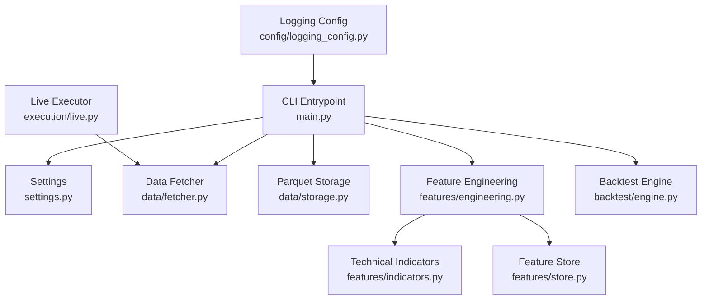
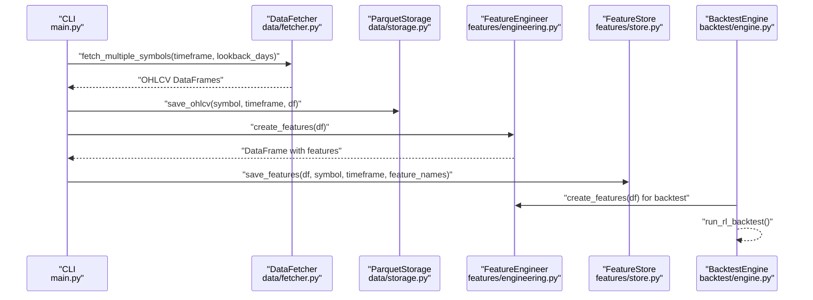
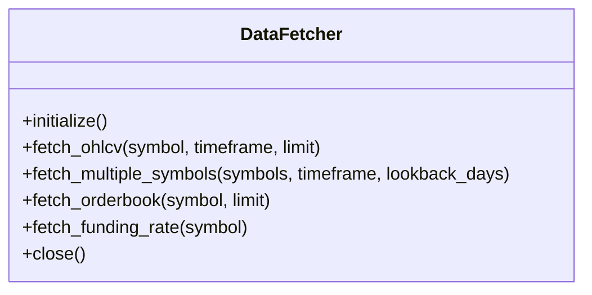
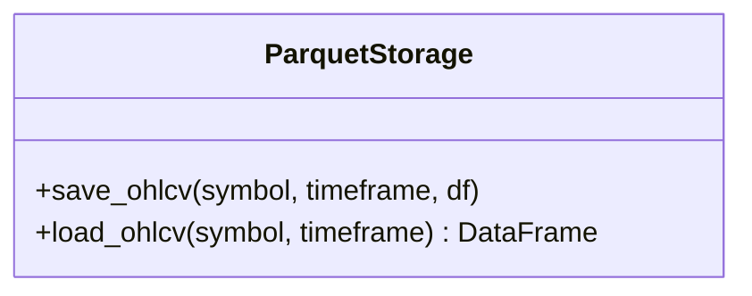
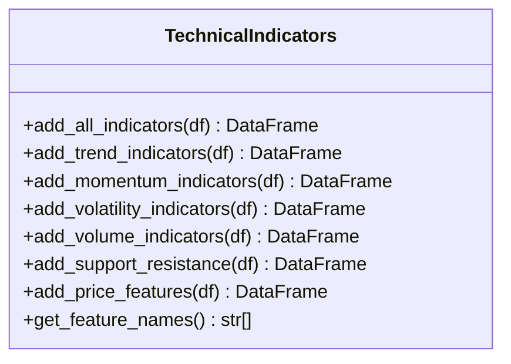
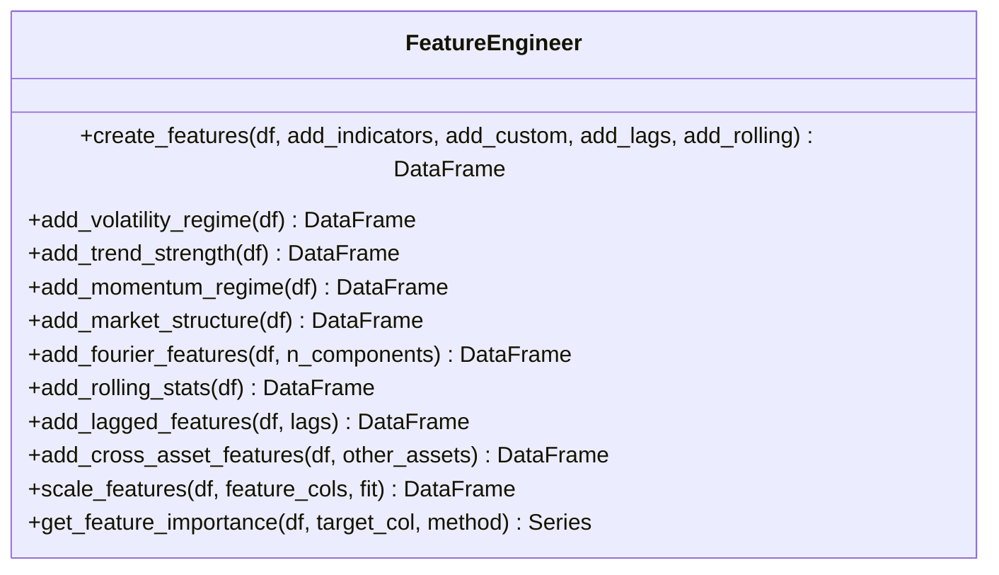
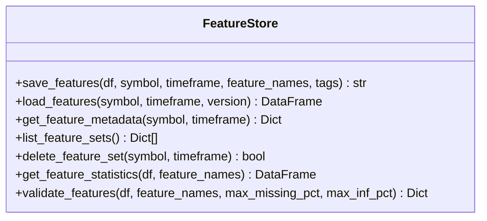
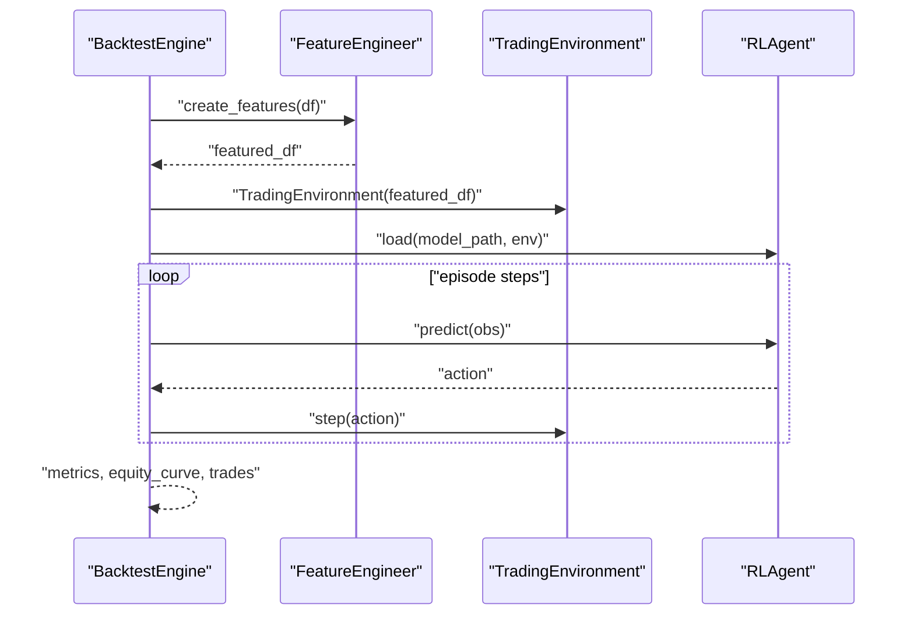
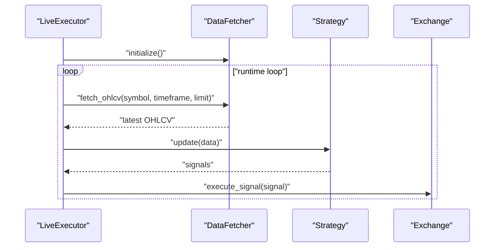
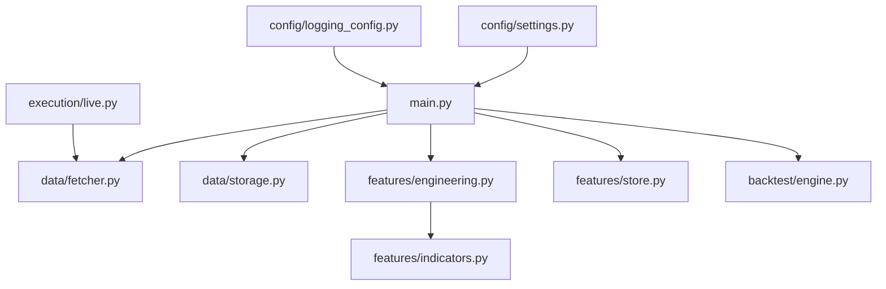

# Data Management

<cite>
**Referenced Files in This Document**
- [main.py](file://trading_bot/main.py)
- [settings.py](file://trading_bot/config/settings.py)
- [logging_config.py](file://trading_bot/config/logging_config.py)
- [engine.py](file://trading_bot/backtest/engine.py)
- [indicators.py](file://trading_bot/features/indicators.py)
- [engineering.py](file://trading_bot/features/engineering.py)
- [store.py](file://trading_bot/features/store.py)
- [live.py](file://trading_bot/execution/live.py)
- [fetcher.py](file://trading_bot/data/fetcher.py)
- [storage.py](file://trading_bot/data/storage.py)
</cite>

## Table of Contents
1. [Introduction](#introduction)
2. [Project Structure](#project-structure)
3. [Core Components](#core-components)
4. [Architecture Overview](#architecture-overview)
5. [Detailed Component Analysis](#detailed-component-analysis)
6. [Dependency Analysis](#dependency-analysis)
7. [Performance Considerations](#performance-considerations)
8. [Troubleshooting Guide](#troubleshooting-guide)
9. [Conclusion](#conclusion)
10. [Appendices](#appendices)

## Introduction
This document describes the data management architecture for the AI Trading Bot, focusing on how market data is fetched, processed, stored, and integrated into the feature engineering pipeline. It covers:
- CCXT integration for OHLCV, orderbook, and funding rate data
- Asynchronous data fetching and WebSocket connections for real-time market data
- Storage mechanisms using Parquet and SQLite
- Technical indicator calculations and custom feature engineering
- Feature store management, validation, and caching strategies
- Data lifecycle, retention policies, and integration with the feature engineering pipeline

## Project Structure
The data management stack spans several modules:
- CLI entrypoint orchestrates data fetching, training, backtesting, and runtime trading
- Configuration defines storage paths and runtime settings
- Features modules implement technical indicators and feature engineering
- Execution modules integrate live trading with data fetching
- Data modules encapsulate CCXT-based fetching and Parquet storage

**Diagram sources**
- [main.py:68-102](file://trading_bot/main.py#L68-L102)
- [settings.py:80-88](file://trading_bot/config/settings.py#L80-L88)
- [fetcher.py:31](file://trading_bot/data/fetcher.py#L31)
- [storage.py:52](file://trading_bot/data/storage.py#L52)
- [engineering.py:17-86](file://trading_bot/features/engineering.py#L17-L86)
- [indicators.py:14-47](file://trading_bot/features/indicators.py#L14-L47)
- [store.py:18-107](file://trading_bot/features/store.py#L18-L107)
- [engine.py:41-62](file://trading_bot/backtest/engine.py#L41-L62)
- [live.py:38-86](file://trading_bot/execution/live.py#L38-L86)
- [logging_config.py:13-78](file://trading_bot/config/logging_config.py#L13-L78)

**Section sources**
- [main.py:68-102](file://trading_bot/main.py#L68-L102)
- [settings.py:80-88](file://trading_bot/config/settings.py#L80-L88)

## Core Components
- DataFetcher: Asynchronous CCXT-based data acquisition for OHLCV, orderbook, and funding rates
- ParquetStorage: Persistent storage of OHLCV data using PyArrow/Parquet
- TechnicalIndicators: Indicator computation using pandas-ta
- FeatureEngineer: Comprehensive feature engineering pipeline with rolling stats, lags, regimes, and Fourier/cyclical features
- FeatureStore: Versioned feature persistence with metadata, validation, and statistics
- BacktestEngine: Integrates feature engineering and RL environments for backtesting
- LiveExecutor: Runtime trading with live data fetching and order management

**Section sources**
- [fetcher.py:31](file://trading_bot/data/fetcher.py#L31)
- [storage.py:52](file://trading_bot/data/storage.py#L52)
- [indicators.py:14-47](file://trading_bot/features/indicators.py#L14-L47)
- [engineering.py:17-86](file://trading_bot/features/engineering.py#L17-L86)
- [store.py:18-107](file://trading_bot/features/store.py#L18-L107)
- [engine.py:41-62](file://trading_bot/backtest/engine.py#L41-L62)
- [live.py:38-86](file://trading_bot/execution/live.py#L38-L86)

## Architecture Overview
The data pipeline integrates asynchronous fetching, feature engineering, and storage:

**Diagram sources**
- [main.py:68-102](file://trading_bot/main.py#L68-L102)
- [fetcher.py:31](file://trading_bot/data/fetcher.py#L31)
- [storage.py:52](file://trading_bot/data/storage.py#L52)
- [engineering.py:17-86](file://trading_bot/features/engineering.py#L17-L86)
- [store.py:18-107](file://trading_bot/features/store.py#L18-L107)
- [engine.py:147-240](file://trading_bot/backtest/engine.py#L147-L240)

## Detailed Component Analysis

### DataFetcher (CCXT Integration)
- Responsibilities:
  - Asynchronously fetch OHLCV, orderbook, and funding rate data
  - Manage exchange initialization and lifecycle
  - Provide batch fetching for multiple symbols
- Asynchronous design:
  - Uses async context manager for resource-safe lifecycle
  - Supports concurrent symbol fetching via async calls
- WebSocket connections:
  - Placeholder for real-time orderbook and funding rate streams
  - Intended to complement periodic OHLCV fetching for latency-sensitive feeds

**Diagram sources**
- [fetcher.py:31](file://trading_bot/data/fetcher.py#L31)

**Section sources**
- [fetcher.py:31](file://trading_bot/data/fetcher.py#L31)

### ParquetStorage (Historical OHLCV Persistence)
- Responsibilities:
  - Persist OHLCV datasets to Parquet for efficient retrieval
  - Provide load/save operations keyed by symbol and timeframe
- Integration:
  - Used by CLI fetch command to persist fetched OHLCV
  - Backtest engine loads OHLCV for training and testing

**Diagram sources**
- [storage.py:52](file://trading_bot/data/storage.py#L52)

**Section sources**
- [storage.py:52](file://trading_bot/data/storage.py#L52)

### TechnicalIndicators (pandas-ta Based)
- Responsibilities:
  - Compute trend, momentum, volatility, volume, and support/resistance indicators
  - Provide standardized indicator names for downstream feature sets
- Extensibility:
  - Modular addition of indicator families
  - Consistent column naming for downstream engineering

**Diagram sources**
- [indicators.py:14-47](file://trading_bot/features/indicators.py#L14-L47)

**Section sources**
- [indicators.py:14-47](file://trading_bot/features/indicators.py#L14-L47)

### FeatureEngineer (Custom Feature Engineering)
- Responsibilities:
  - Build comprehensive feature sets combining indicators, regimes, rolling stats, lags, and Fourier/cyclical features
  - Scale features and compute feature importance
- Key capabilities:
  - Volatility regime and trend strength features
  - Momentum regime and market structure features
  - Rolling return distributions and lagged features
  - Cross-asset correlation features
  - Scaling with robust statistics

**Diagram sources**
- [engineering.py:17-86](file://trading_bot/features/engineering.py#L17-L86)

**Section sources**
- [engineering.py:17-86](file://trading_bot/features/engineering.py#L17-L86)

### FeatureStore (Versioned Feature Persistence)
- Responsibilities:
  - Save and load engineered features with versioning and metadata
  - Compute hashes for dataset versioning
  - Provide validation and statistics for feature quality
- Storage:
  - Parquet-backed with JSON metadata for dataset catalog
- Validation:
  - Missing values, infinite values, constant features, and outliers checks

**Diagram sources**
- [store.py:18-107](file://trading_bot/features/store.py#L18-L107)

**Section sources**
- [store.py:18-107](file://trading_bot/features/store.py#L18-L107)

### BacktestEngine (Integration with Feature Engineering)
- Responsibilities:
  - Run vectorbt-based and RL-based backtests
  - Prepare features via FeatureEngineer
  - Aggregate performance metrics and generate reports
- Integration:
  - Uses FeatureEngineer to create features before RL backtest
  - Computes equity curves and trade statistics

**Diagram sources**
- [engine.py:147-240](file://trading_bot/backtest/engine.py#L147-L240)
- [engineering.py:17-86](file://trading_bot/features/engineering.py#L17-L86)

**Section sources**
- [engine.py:147-240](file://trading_bot/backtest/engine.py#L147-L240)

### LiveExecutor (Runtime Data Integration)
- Responsibilities:
  - Initialize live trading with exchange connectivity
  - Periodically fetch latest OHLCV and execute signals
  - Manage orders and position synchronization
- Data integration:
  - Uses DataFetcher for live price and orderbook data
  - Applies feature engineering and strategy signals for execution

**Diagram sources**
- [live.py:38-86](file://trading_bot/execution/live.py#L38-L86)
- [main.py:281-316](file://trading_bot/main.py#L281-L316)

**Section sources**
- [live.py:38-86](file://trading_bot/execution/live.py#L38-L86)
- [main.py:281-316](file://trading_bot/main.py#L281-L316)

## Dependency Analysis
Key dependencies and coupling:
- CLI depends on DataFetcher, ParquetStorage, FeatureEngineer, FeatureStore, BacktestEngine
- FeatureEngineer depends on TechnicalIndicators
- BacktestEngine depends on FeatureEngineer and RL components
- LiveExecutor depends on DataFetcher and Strategy
- Settings define storage paths and runtime configuration

**Diagram sources**
- [main.py:68-102](file://trading_bot/main.py#L68-L102)
- [fetcher.py:31](file://trading_bot/data/fetcher.py#L31)
- [storage.py:52](file://trading_bot/data/storage.py#L52)
- [engineering.py:17-86](file://trading_bot/features/engineering.py#L17-L86)
- [indicators.py:14-47](file://trading_bot/features/indicators.py#L14-L47)
- [store.py:18-107](file://trading_bot/features/store.py#L18-L107)
- [engine.py:41-62](file://trading_bot/backtest/engine.py#L41-L62)
- [live.py:38-86](file://trading_bot/execution/live.py#L38-L86)
- [settings.py:80-88](file://trading_bot/config/settings.py#L80-L88)
- [logging_config.py:13-78](file://trading_bot/config/logging_config.py#L13-L78)

**Section sources**
- [main.py:68-102](file://trading_bot/main.py#L68-L102)
- [settings.py:80-88](file://trading_bot/config/settings.py#L80-L88)

## Performance Considerations
- Asynchronous fetching:
  - Use async context managers and concurrent symbol fetching to minimize latency
- Efficient storage:
  - Parquet compression reduces disk footprint and speeds up IO
- Feature engineering:
  - Use rolling windows judiciously; pre-compute heavy transforms where possible
- Scaling:
  - Apply robust scaling to mitigate outliers in feature sets
- Caching:
  - FeatureStore versioning avoids recomputation; reuse validated datasets
- Risk controls:
  - LiveExecutor enforces rate limiting and risk checks to prevent excessive load

[No sources needed since this section provides general guidance]

## Troubleshooting Guide
Common issues and resolutions:
- Data fetching failures:
  - Verify API keys and network connectivity; inspect exchange-specific errors
- Storage path issues:
  - Ensure data_dir and parquet_path exist; use settings.ensure_directories()
- Feature validation warnings:
  - Review missing values and infinite values; adjust preprocessing thresholds
- Runtime errors:
  - Check logs for detailed error messages; confirm exchange initialization

**Section sources**
- [logging_config.py:13-78](file://trading_bot/config/logging_config.py#L13-L78)
- [settings.py:157-162](file://trading_bot/config/settings.py#L157-L162)
- [store.py:247-300](file://trading_bot/features/store.py#L247-L300)

## Conclusion
The AI Trading Bot’s data management architecture combines asynchronous CCXT-based fetching, robust feature engineering, and efficient storage to support both backtesting and live trading. The modular design enables extensibility for additional indicators, features, and storage backends while maintaining strong validation and observability.

[No sources needed since this section summarizes without analyzing specific files]

## Appendices

### Data Lifecycle and Retention Policies
- Collection:
  - Historical OHLCV collected via CLI fetch command and persisted to Parquet
- Processing:
  - Feature engineering pipeline computes indicators and custom features
- Storage:
  - FeatureStore maintains versioned Parquet datasets with metadata
- Retention:
  - No explicit retention policy in code; manage via filesystem cleanup or external archival

**Section sources**
- [main.py:68-102](file://trading_bot/main.py#L68-L102)
- [store.py:18-107](file://trading_bot/features/store.py#L18-L107)

### Configuration Reference
- Storage paths:
  - data_dir, db_path, parquet_path
- Logging:
  - log_level, log_file
- Redis:
  - redis_host, redis_port, redis_db, redis_password

**Section sources**
- [settings.py:80-88](file://trading_bot/config/settings.py#L80-L88)
- [settings.py:90-94](file://trading_bot/config/settings.py#L90-L94)
- [settings.py:115](file://trading_bot/config/settings.py#L115)
- [settings.py:116](file://trading_bot/config/settings.py#L116)