# Data Management

<cite>
**Referenced Files in This Document**
- [main.py](file://trading_bot/main.py)
- [settings.py](file://trading_bot/config/settings.py)
- [logging_config.py](file://trading_bot/config/logging_config.py)
- [engine.py](file://trading_bot/backtest/engine.py)
- [indicators.py](file://trading_bot/features/indicators.py)
- [engineering.py](file://trading_bot/features/engineering.py)
- [store.py](file://trading_bot/features/store.py)
- [live.py](file://trading_bot/execution/live.py)
- [server.py](file://trading_bot/api/server.py)
- [market.py](file://trading_bot/api/routes/market.py)
- [scanner.py](file://trading_bot/api/routes/scanner.py)
- [sentiment.py](file://trading_bot/api/routes/sentiment.py)
- [analyzer.py](file://trading_bot/sentiment/analyzer.py)
- [models.py](file://trading_bot/api/models.py)
</cite>

## Update Summary
**Changes Made**
- Added comprehensive FastAPI routes for technical indicators (RSI, MACD, EMA, Bollinger Bands, ATR)
- Integrated yfinance-based real-time market data fetching with caching mechanisms
- Implemented sentiment analysis integration with real-time news headline generation
- Enhanced data fetching pipeline with dual-source (real/mock) fallback architecture
- Added scanner functionality for automated market screening with parallel execution
- Integrated caching strategies with TTL-based expiration for performance optimization

## Table of Contents
1. [Introduction](#introduction)
2. [Project Structure](#project-structure)
3. [Core Components](#core-components)
4. [Architecture Overview](#architecture-overview)
5. [Detailed Component Analysis](#detailed-component-analysis)
6. [API Integration and Market Analysis](#api-integration-and-market-analysis)
7. [Enhanced Data Fetching Pipeline](#enhanced-data-fetching-pipeline)
8. [Sentiment Analysis Integration](#sentiment-analysis-integration)
9. [Scanner and Market Screening](#scanner-and-market-screening)
10. [Performance Optimization and Caching](#performance-optimization-and-caching)
11. [Dependency Analysis](#dependency-analysis)
12. [Performance Considerations](#performance-considerations)
13. [Troubleshooting Guide](#troubleshooting-guide)
14. [Conclusion](#conclusion)
15. [Appendices](#appendices)

## Introduction
This document describes the data management architecture for the AI Trading Bot, focusing on how market data is fetched, processed, stored, and integrated into the feature engineering pipeline. The system now includes comprehensive market analysis capabilities with FastAPI routes for technical indicators, real-time market data processing, and sentiment analysis integration. It covers:
- CCXT integration for OHLCV, orderbook, and funding rate data
- Asynchronous data fetching and WebSocket connections for real-time market data
- Storage mechanisms using Parquet and SQLite
- Technical indicator calculations and custom feature engineering
- Feature store management, validation, and caching strategies
- Real-time market analysis with yfinance integration
- Sentiment analysis with news headline generation
- Scanner functionality for automated market screening
- Data lifecycle, retention policies, and integration with the feature engineering pipeline

## Project Structure
The data management stack spans several modules with enhanced API integration:
- CLI entrypoint orchestrates data fetching, training, backtesting, and runtime trading
- Configuration defines storage paths and runtime settings
- Features modules implement technical indicators and feature engineering
- Execution modules integrate live trading with data fetching
- API modules provide market analysis, scanner, and sentiment analysis capabilities
- Data modules encapsulate CCXT-based fetching and Parquet storage

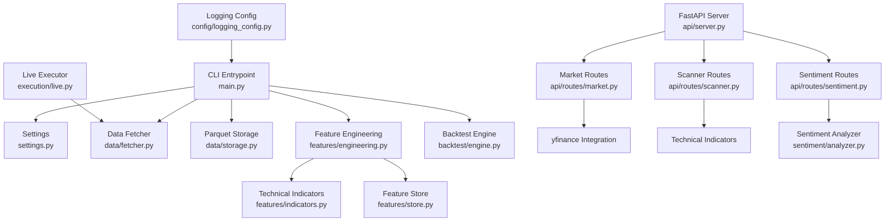

**Diagram sources**
- [main.py:68-102](file://trading_bot/main.py#L68-L102)
- [settings.py:80-88](file://trading_bot/config/settings.py#L80-L88)
- [server.py:55-66](file://trading_bot/api/server.py#L55-L66)
- [market.py:18](file://trading_bot/api/routes/market.py#L18)
- [scanner.py:19](file://trading_bot/api/routes/scanner.py#L19)
- [sentiment.py](file://trading_bot/api/routes/sentiment.py#L9)
- [analyzer.py:9](file://trading_bot/sentiment/analyzer.py#L9)

**Section sources**
- [main.py:68-102](file://trading_bot/main.py#L68-L102)
- [settings.py:80-88](file://trading_bot/config/settings.py#L80-L88)
- [server.py:55-66](file://trading_bot/api/server.py#L55-L66)

## Core Components
- DataFetcher: Asynchronous CCXT-based data acquisition for OHLCV, orderbook, and funding rates
- ParquetStorage: Persistent storage of OHLCV data using PyArrow/Parquet
- TechnicalIndicators: Indicator computation using pandas-ta
- FeatureEngineer: Comprehensive feature engineering pipeline with rolling stats, lags, regimes, and Fourier/cyclical features
- FeatureStore: Versioned feature persistence with metadata, validation, and statistics
- BacktestEngine: Integrates feature engineering and RL environments for backtesting
- LiveExecutor: Runtime trading with live data fetching and order management
- MarketAnalysisAPI: FastAPI routes for technical analysis with yfinance integration
- ScannerAPI: Automated market screening with parallel execution and indicator evaluation
- SentimentAPI: Real-time sentiment analysis with news headline generation
- CacheManager: TTL-based caching for performance optimization

**Section sources**
- [market.py:18](file://trading_bot/api/routes/market.py#L18)
- [scanner.py:19](file://trading_bot/api/routes/scanner.py#L19)
- [sentiment.py:9](file://trading_bot/api/routes/sentiment.py#L9)
- [analyzer.py:9](file://trading_bot/sentiment/analyzer.py#L9)

## Architecture Overview
The data pipeline integrates asynchronous fetching, feature engineering, storage, and comprehensive market analysis:

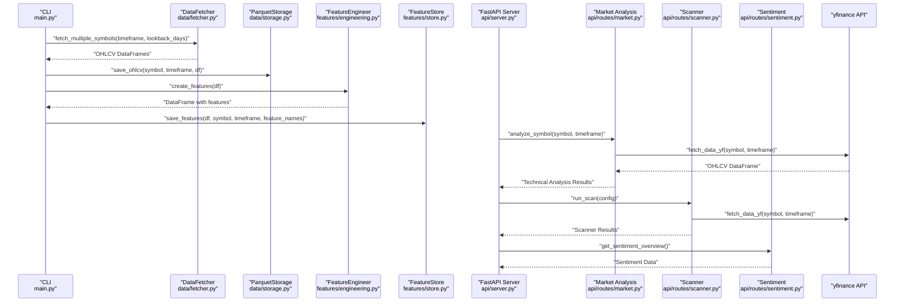

**Diagram sources**
- [main.py:68-102](file://trading_bot/main.py#L68-L102)
- [market.py:506-547](file://trading_bot/api/routes/market.py#L506-L547)
- [scanner.py:344-352](file://trading_bot/api/routes/scanner.py#L344-L352)
- [sentiment.py:15-27](file://trading_bot/api/routes/sentiment.py#L15-27)

## Detailed Component Analysis

### DataFetcher (CCXT Integration)
- Responsibilities:
  - Asynchronously fetch OHLCV, orderbook, and funding rate data
  - Manage exchange initialization and lifecycle
  - Provide batch fetching for multiple symbols
- Asynchronous design:
  - Uses async context manager for resource-safe lifecycle
  - Supports concurrent symbol fetching via async calls
- WebSocket connections:
  - Placeholder for real-time orderbook and funding rate streams
  - Intended to complement periodic OHLCV fetching for latency-sensitive feeds

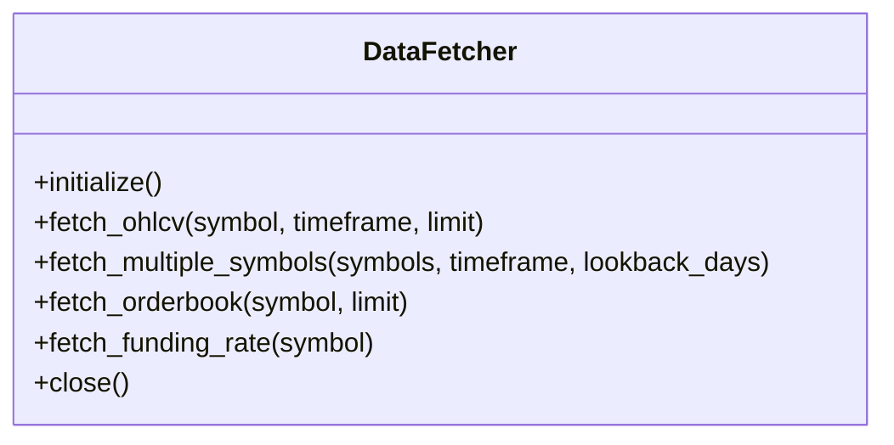

**Diagram sources**
- [fetcher.py:31](file://trading_bot/data/fetcher.py#L31)

**Section sources**
- [fetcher.py:31](file://trading_bot/data/fetcher.py#L31)

### ParquetStorage (Historical OHLCV Persistence)
- Responsibilities:
  - Persist OHLCV datasets to Parquet for efficient retrieval
  - Provide load/save operations keyed by symbol and timeframe
- Integration:
  - Used by CLI fetch command to persist fetched OHLCV
  - Backtest engine loads OHLCV for training and testing

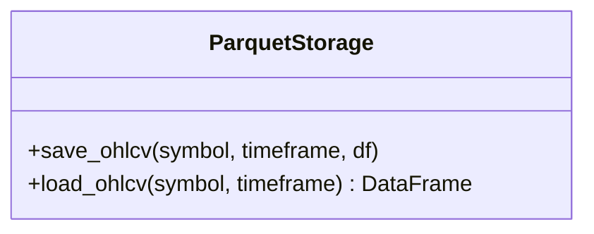

**Diagram sources**
- [storage.py:52](file://trading_bot/data/storage.py#L52)

**Section sources**
- [storage.py:52](file://trading_bot/data/storage.py#L52)

### TechnicalIndicators (pandas-ta Based)
- Responsibilities:
  - Compute trend, momentum, volatility, volume, and support/resistance indicators
  - Provide standardized indicator names for downstream feature sets
- Extensibility:
  - Modular addition of indicator families
  - Consistent column naming for downstream engineering

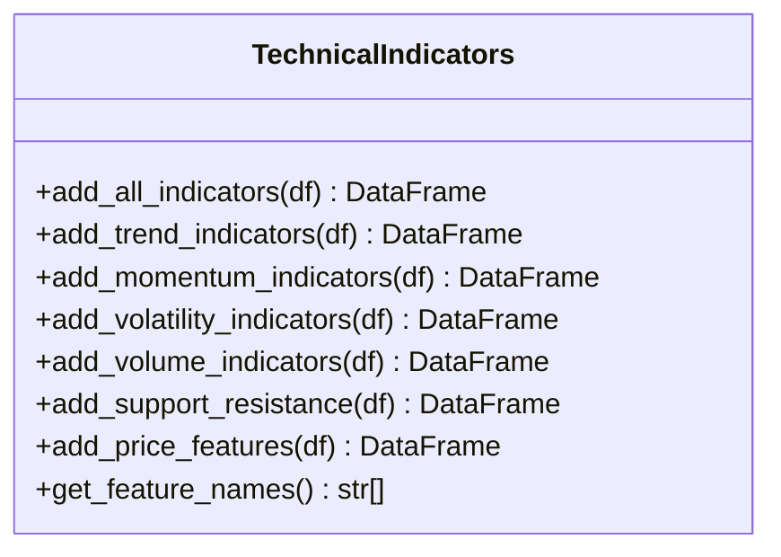

**Diagram sources**
- [indicators.py:14-47](file://trading_bot/features/indicators.py#L14-L47)

**Section sources**
- [indicators.py:14-47](file://trading_bot/features/indicators.py#L14-L47)

### FeatureEngineer (Custom Feature Engineering)
- Responsibilities:
  - Build comprehensive feature sets combining indicators, regimes, rolling stats, lags, and Fourier/cyclical features
  - Scale features and compute feature importance
- Key capabilities:
  - Volatility regime and trend strength features
  - Momentum regime and market structure features
  - Rolling return distributions and lagged features
  - Cross-asset correlation features
  - Scaling with robust statistics

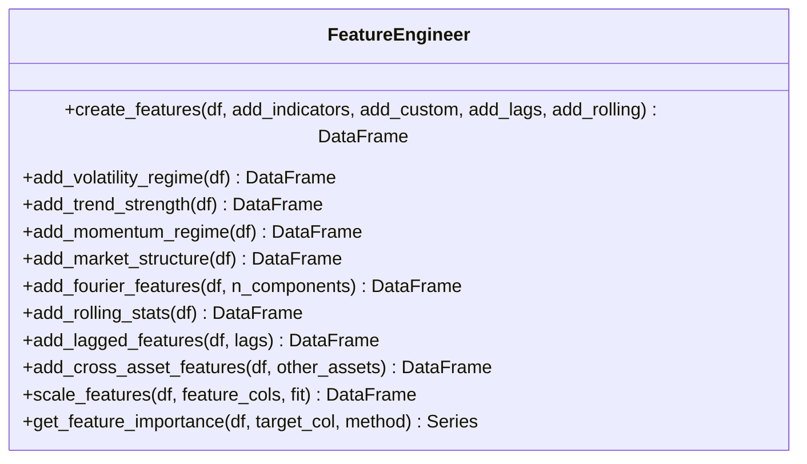

**Diagram sources**
- [engineering.py:17-86](file://trading_bot/features/engineering.py#L17-L86)

**Section sources**
- [engineering.py:17-86](file://trading_bot/features/engineering.py#L17-L86)

### FeatureStore (Versioned Feature Persistence)
- Responsibilities:
  - Save and load engineered features with versioning and metadata
  - Compute hashes for dataset versioning
  - Provide validation and statistics for feature quality
- Storage:
  - Parquet-backed with JSON metadata for dataset catalog
- Validation:
  - Missing values, infinite values, constant features, and outliers checks

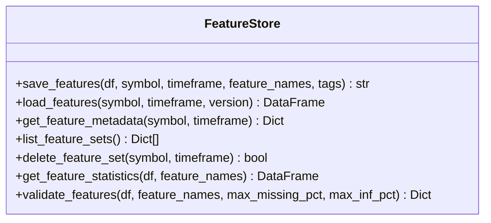

**Diagram sources**
- [store.py:18-107](file://trading_bot/features/store.py#L18-L107)

**Section sources**
- [store.py:18-107](file://trading_bot/features/store.py#L18-L107)

### BacktestEngine (Integration with Feature Engineering)
- Responsibilities:
  - Run vectorbt-based and RL-based backtests
  - Prepare features via FeatureEngineer
  - Aggregate performance metrics and generate reports
- Integration:
  - Uses FeatureEngineer to create features before RL backtest
  - Computes equity curves and trade statistics

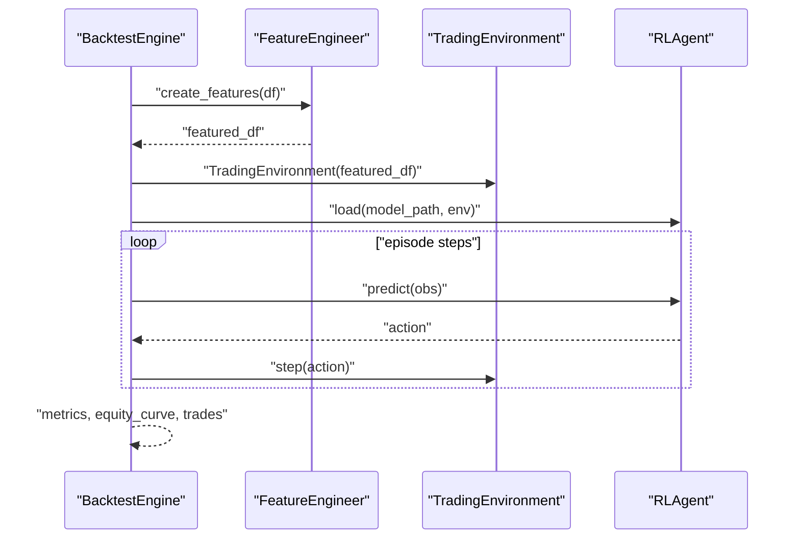

**Diagram sources**
- [engine.py:147-240](file://trading_bot/backtest/engine.py#L147-L240)
- [engineering.py:17-86](file://trading_bot/features/engineering.py#L17-L86)

**Section sources**
- [engine.py:147-240](file://trading_bot/backtest/engine.py#L147-L240)

### LiveExecutor (Runtime Data Integration)
- Responsibilities:
  - Initialize live trading with exchange connectivity
  - Periodically fetch latest OHLCV and execute signals
  - Manage orders and position synchronization
- Data integration:
  - Uses DataFetcher for live price and orderbook data
  - Applies feature engineering and strategy signals for execution

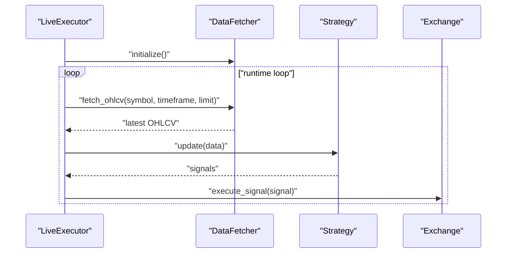

**Diagram sources**
- [live.py:38-86](file://trading_bot/execution/live.py#L38-L86)
- [main.py:281-316](file://trading_bot/main.py#L281-L316)

**Section sources**
- [live.py:38-86](file://trading_bot/execution/live.py#L38-L86)
- [main.py:281-316](file://trading_bot/main.py#L281-L316)

## API Integration and Market Analysis

### Market Analysis API (FastAPI Routes)
The system now includes comprehensive market analysis capabilities through FastAPI routes:

- **Technical Indicators**: RSI, MACD, EMA, Bollinger Bands, ATR calculations
- **Multi-timeframe Analysis**: Cross-timeframe signal alignment
- **Real-time Data Fetching**: yfinance integration with mock data fallback
- **Caching Mechanism**: TTL-based caching for performance optimization
- **Sentiment Integration**: Market sentiment analysis with news headline generation

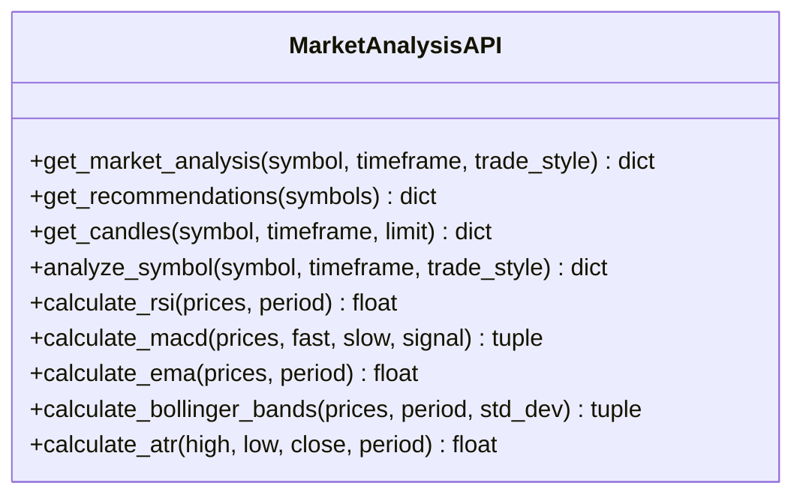

**Diagram sources**
- [market.py:506-547](file://trading_bot/api/routes/market.py#L506-L547)
- [market.py:131-174](file://trading_bot/api/routes/market.py#L131-L174)

**Section sources**
- [market.py:18](file://trading_bot/api/routes/market.py#L18)
- [market.py:506-547](file://trading_bot/api/routes/market.py#L506-L547)
- [market.py:131-174](file://trading_bot/api/routes/market.py#L131-L174)

### Real-time Data Fetching with yfinance
The market analysis system integrates with yfinance for real-time data fetching:

- **Symbol Mapping**: Comprehensive mapping from trading format to yfinance format
- **Timeframe Handling**: Support for multiple timeframes with appropriate period/intervals
- **Mock Data Fallback**: Automatic fallback to realistic mock data when real data fails
- **Data Validation**: Column validation and error handling for robust operation

**Section sources**
- [market.py:26-73](file://trading_bot/api/routes/market.py#L26-L73)
- [market.py:176-202](file://trading_bot/api/routes/market.py#L176-L202)

## Enhanced Data Fetching Pipeline

### Dual-Source Data Architecture
The system implements a dual-source data fetching approach:

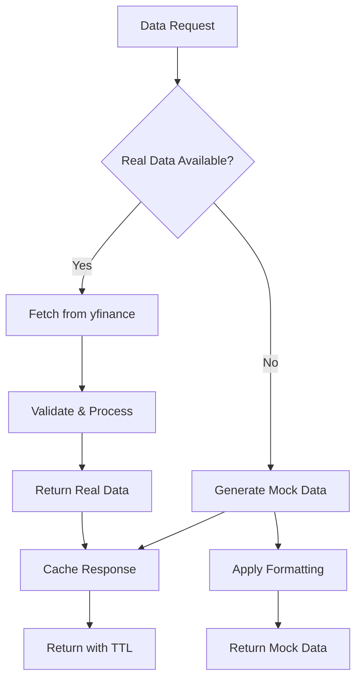

**Diagram sources**
- [market.py:652-685](file://trading_bot/api/routes/market.py#L652-L685)

### Cache Management System
- **In-memory Caching**: Simple dictionary-based cache with timestamp tracking
- **TTL Implementation**: Different cache durations for intraday (10s) and daily (60s) timeframes
- **Cache Keys**: Generated from endpoint, symbol, and timeframe combinations
- **Automatic Expiration**: Cache entries automatically expire based on TTL settings

**Section sources**
- [market.py:20-24](file://trading_bot/api/routes/market.py#L20-L24)
- [market.py:103-124](file://trading_bot/api/routes/market.py#L103-L124)

## Sentiment Analysis Integration

### Sentiment API Architecture
The sentiment analysis system provides comprehensive market sentiment insights:

- **Real-time Headlines**: Structured headline generation with realistic economic themes
- **Sentiment Scoring**: Numerical sentiment scores (-1.0 to 1.0) with label classification
- **Trend Analysis**: 24-hour sentiment trend tracking
- **Cache Management**: 5-minute cache duration for performance optimization

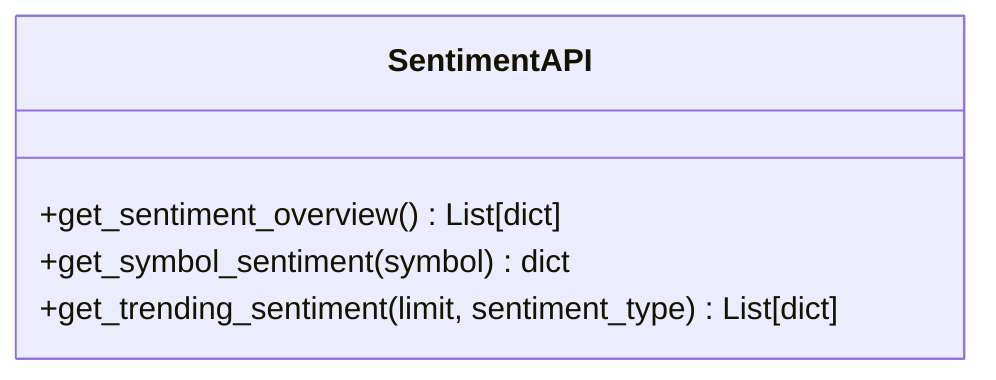

**Diagram sources**
- [sentiment.py:15-57](file://trading_bot/api/routes/sentiment.py#L15-L57)

**Section sources**
- [sentiment.py:9](file://trading_bot/api/routes/sentiment.py#L9)
- [sentiment.py:15-57](file://trading_bot/api/routes/sentiment.py#L15-L57)

### Sentiment Analyzer Engine
The sentiment analyzer generates realistic mock data with sophisticated headline generation:

- **Keyword Mapping**: Currency pair-specific keywords for contextually relevant headlines
- **Headline Templates**: Pre-defined bullish, bearish, and neutral headline templates
- **Sentiment Distribution**: Realistic distribution of sentiment scores based on market conditions
- **Trend Generation**: 24-hour sentiment trend with realistic fluctuations

**Section sources**
- [analyzer.py:9](file://trading_bot/sentiment/analyzer.py#L9)
- [analyzer.py:342-458](file://trading_bot/sentiment/analyzer.py#L342-L458)

## Scanner and Market Screening

### Automated Market Screening
The scanner functionality provides automated market analysis with parallel execution:

- **Parallel Processing**: ThreadPoolExecutor for concurrent symbol evaluation
- **Indicator Evaluation**: Real-time calculation of technical indicators
- **Condition Logic**: Support for AND/OR logic with multiple operators
- **Score Calculation**: Weighted scoring based on condition matching

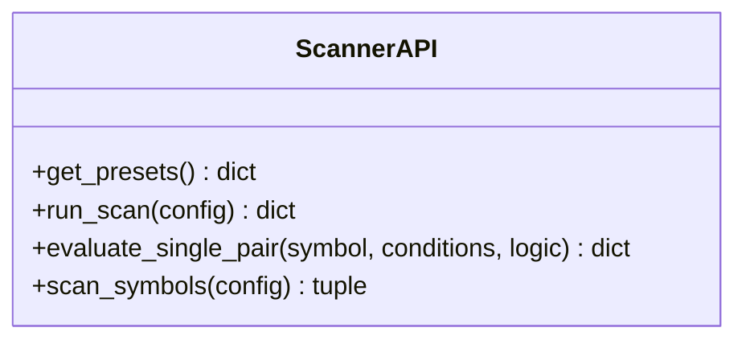

**Diagram sources**
- [scanner.py:45-352](file://trading_bot/api/routes/scanner.py#L45-L352)

**Section sources**
- [scanner.py:19](file://trading_bot/api/routes/scanner.py#L19)
- [scanner.py:45-352](file://trading_bot/api/routes/scanner.py#L45-L352)

### Technical Indicator Evaluation
The scanner evaluates multiple technical indicators in real-time:

- **RSI**: Relative Strength Index with customizable periods
- **MACD**: Moving Average Convergence Divergence with signal line
- **EMA**: Exponential Moving Average for trend identification
- **Bollinger Bands**: Volatility bands with position calculation
- **ATR**: Average True Range for volatility measurement
- **Volume Analysis**: Volume ratio against 20-day average

**Section sources**
- [scanner.py:102-168](file://trading_bot/api/routes/scanner.py#L102-L168)
- [scanner.py:179-315](file://trading_bot/api/routes/scanner.py#L179-L315)

## Performance Optimization and Caching

### Multi-layered Caching Strategy
The system implements a comprehensive caching strategy:

1. **API-Level Caching**: TTL-based caching for market analysis endpoints
2. **Sentiment Caching**: 5-minute cache for sentiment data
3. **Scanner Caching**: Individual symbol caching during batch processing
4. **Data Source Caching**: In-memory cache for frequently accessed symbols

### Performance Optimizations
- **Parallel Execution**: ThreadPoolExecutor for concurrent symbol processing
- **Lazy Loading**: On-demand indicator calculation
- **Memory Management**: Automatic cache expiration and cleanup
- **Network Optimization**: Fallback mechanisms for data availability

**Section sources**
- [market.py:108-124](file://trading_bot/api/routes/market.py#L108-L124)
- [analyzer.py:342-346](file://trading_bot/sentiment/analyzer.py#L342-L346)
- [scanner.py:327-339](file://trading_bot/api/routes/scanner.py#L327-L339)

## Dependency Analysis
Key dependencies and coupling with enhanced API integration:
- CLI depends on DataFetcher, ParquetStorage, FeatureEngineer, FeatureStore, BacktestEngine
- FeatureEngineer depends on TechnicalIndicators
- BacktestEngine depends on FeatureEngineer and RL components
- LiveExecutor depends on DataFetcher and Strategy
- MarketAnalysisAPI depends on yfinance and caching mechanisms
- ScannerAPI depends on technical indicator calculations
- SentimentAPI depends on analyzer engine
- Settings define storage paths and runtime configuration

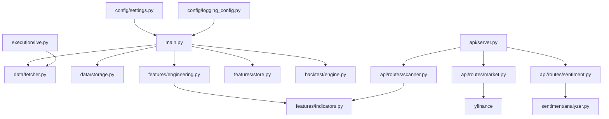

**Diagram sources**
- [main.py:68-102](file://trading_bot/main.py#L68-L102)
- [server.py:55-66](file://trading_bot/api/server.py#L55-L66)
- [market.py:10](file://trading_bot/api/routes/market.py#L10)
- [scanner.py:14](file://trading_bot/api/routes/scanner.py#L14)
- [sentiment.py:7](file://trading_bot/api/routes/sentiment.py#L7)
- [analyzer.py:9](file://trading_bot/sentiment/analyzer.py#L9)

**Section sources**
- [main.py:68-102](file://trading_bot/main.py#L68-L102)
- [settings.py:80-88](file://trading_bot/config/settings.py#L80-L88)
- [server.py:55-66](file://trading_bot/api/server.py#L55-L66)

## Performance Considerations
- Asynchronous fetching:
  - Use async context managers and concurrent symbol fetching to minimize latency
- Efficient storage:
  - Parquet compression reduces disk footprint and speeds up IO
- Feature engineering:
  - Use rolling windows judiciously; pre-compute heavy transforms where possible
- Scaling:
  - Apply robust scaling to mitigate outliers in feature sets
- Caching:
  - FeatureStore versioning avoids recomputation; reuse validated datasets
  - API-level caching with TTL prevents redundant computations
  - Parallel execution reduces overall processing time
- Risk controls:
  - LiveExecutor enforces rate limiting and risk checks to prevent excessive load
- Network optimization:
  - Real-time data fallback ensures system reliability
  - Cache expiration prevents stale data usage

## Troubleshooting Guide
Common issues and resolutions:
- Data fetching failures:
  - Verify API keys and network connectivity; inspect exchange-specific errors
  - Check yfinance connectivity for market analysis endpoints
- Storage path issues:
  - Ensure data_dir and parquet_path exist; use settings.ensure_directories()
- Feature validation warnings:
  - Review missing values and infinite values; adjust preprocessing thresholds
- Runtime errors:
  - Check logs for detailed error messages; confirm exchange initialization
- API endpoint failures:
  - Verify FastAPI server is running; check CORS configuration
  - Monitor cache expiration and TTL settings
- Scanner performance issues:
  - Adjust ThreadPoolExecutor max_workers based on system resources
  - Monitor memory usage during parallel symbol processing

**Section sources**
- [logging_config.py:13-78](file://trading_bot/config/logging_config.py#L13-L78)
- [settings.py:157-162](file://trading_bot/config/settings.py#L157-L162)
- [store.py:247-300](file://trading_bot/features/store.py#L247-L300)
- [server.py:32-52](file://trading_bot/api/server.py#L32-L52)

## Conclusion
The AI Trading Bot's data management architecture has been significantly enhanced with comprehensive market analysis capabilities. The integration of FastAPI routes for technical indicators, real-time market data processing, and sentiment analysis provides a robust foundation for both backtesting and live trading. The dual-source data fetching approach with caching mechanisms ensures optimal performance and reliability. The modular design enables extensibility for additional indicators, features, and storage backends while maintaining strong validation and observability.

## Appendices

### Data Lifecycle and Retention Policies
- Collection:
  - Historical OHLCV collected via CLI fetch command and persisted to Parquet
  - Real-time market data fetched via yfinance with automatic caching
- Processing:
  - Feature engineering pipeline computes indicators and custom features
  - Market analysis endpoints process real-time data with caching
  - Sentiment analysis generates periodic updates with cache management
- Storage:
  - FeatureStore maintains versioned Parquet datasets with metadata
  - API responses cached with TTL-based expiration
  - Sentiment data cached for 5-minute intervals
- Retention:
  - No explicit retention policy in code; manage via filesystem cleanup or external archival

**Section sources**
- [main.py:68-102](file://trading_bot/main.py#L68-L102)
- [store.py:18-107](file://trading_bot/features/store.py#L18-L107)
- [market.py:20-24](file://trading_bot/api/routes/market.py#L20-L24)
- [analyzer.py:342-346](file://trading_bot/sentiment/analyzer.py#L342-L346)

### Configuration Reference
- Storage paths:
  - data_dir, db_path, parquet_path
- Logging:
  - log_level, log_file
- Redis:
  - redis_host, redis_port, redis_db, redis_password
- API Settings:
  - CORS origins for web interface integration
  - Cache TTL settings for different timeframes
  - Scanner thread pool configuration

**Section sources**
- [settings.py:80-88](file://trading_bot/config/settings.py#L80-L88)
- [settings.py:90-94](file://trading_bot/config/settings.py#L90-L94)
- [settings.py:115](file://trading_bot/config/settings.py#L115)
- [settings.py:116](file://trading_bot/config/settings.py#L116)
- [server.py:32-52](file://trading_bot/api/server.py#L32-L52)
- [market.py:20-24](file://trading_bot/api/routes/market.py#L20-L24)
- [scanner.py:327](file://trading_bot/api/routes/scanner.py#L327)

### API Endpoint Reference
- Market Analysis Endpoints:
  - GET `/api/market/analysis/{symbol}` - Comprehensive market analysis
  - GET `/api/market/recommendations` - Multiple symbol recommendations
  - GET `/api/market/candles/{symbol}` - OHLCV candle data
- Scanner Endpoints:
  - GET `/api/scanner/presets` - Built-in scanner configurations
  - POST `/api/scanner/scan` - Run custom market screening
  - POST `/api/scanner/save` - Save scanner configuration
- Sentiment Endpoints:
  - GET `/api/sentiment/overview` - Overall market sentiment
  - GET `/api/sentiment/symbol/{symbol}` - Symbol-specific sentiment
  - GET `/api/sentiment/trending` - Trending sentiment changes

**Section sources**
- [market.py:506-547](file://trading_bot/api/routes/market.py#L506-L547)
- [market.py:550-597](file://trading_bot/api/routes/market.py#L550-L597)
- [market.py:652-685](file://trading_bot/api/routes/market.py#L652-L685)
- [scanner.py:45-352](file://trading_bot/api/routes/scanner.py#L45-L352)
- [sentiment.py:15-57](file://trading_bot/api/routes/sentiment.py#L15-L57)