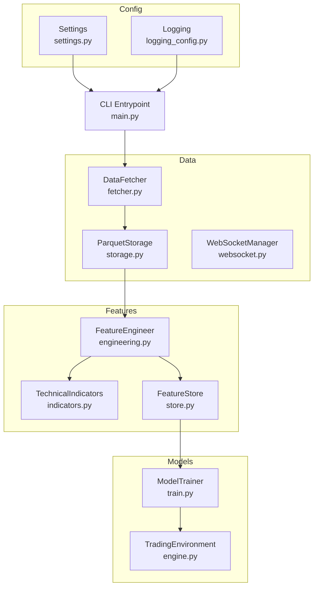
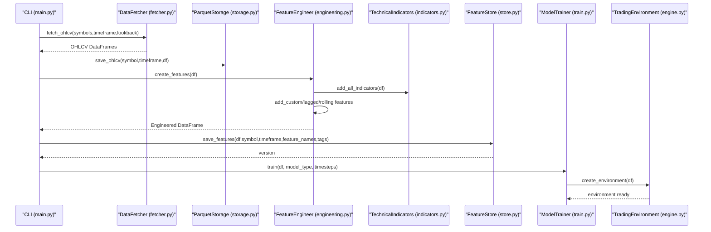
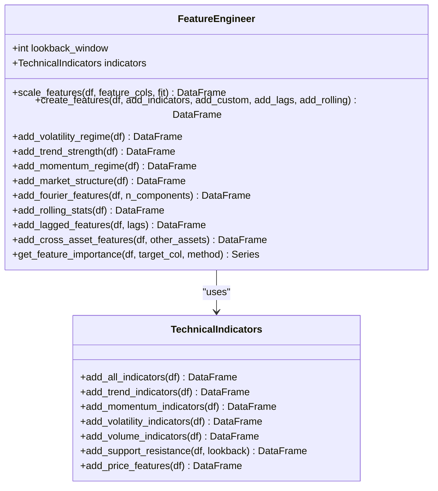
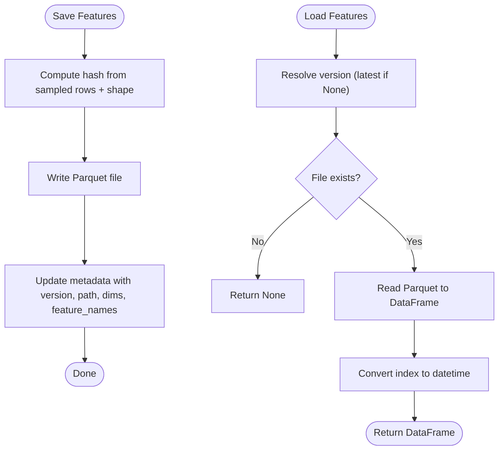
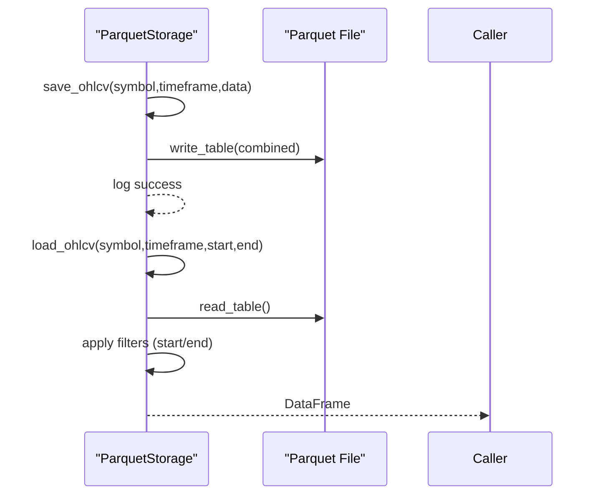
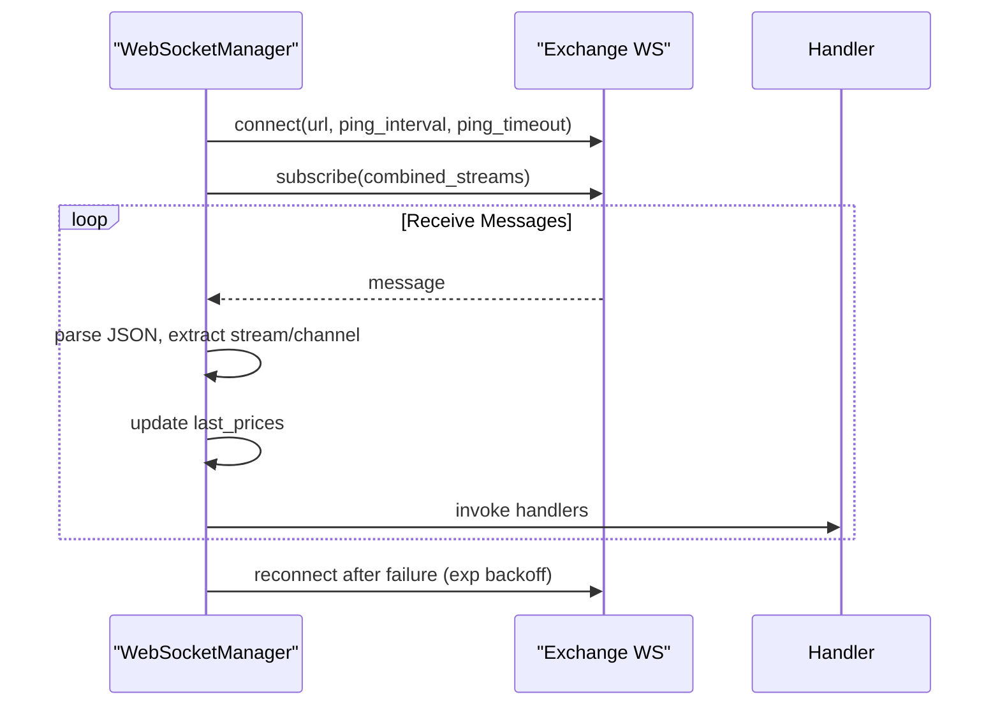
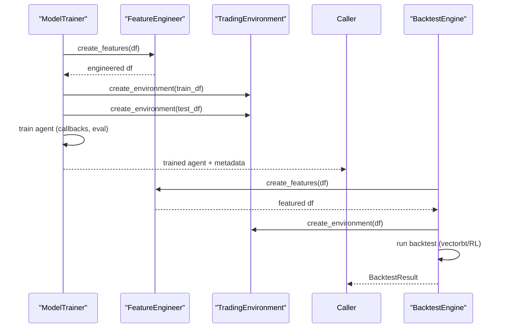
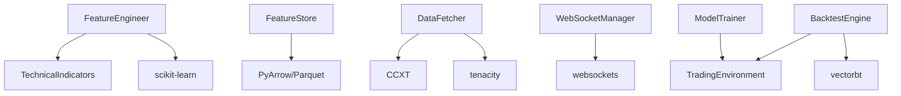

# Feature Store

<cite>
**Referenced Files in This Document**
- [engineering.py](file://trading_bot/features/engineering.py)
- [store.py](file://trading_bot/features/store.py)
- [indicators.py](file://trading_bot/features/indicators.py)
- [storage.py](file://trading_bot/data/storage.py)
- [fetcher.py](file://trading_bot/data/fetcher.py)
- [websocket.py](file://trading_bot/data/websocket.py)
- [engine.py](file://trading_bot/backtest/engine.py)
- [train.py](file://trading_bot/models/train.py)
- [settings.py](file://trading_bot/config/settings.py)
- [logging_config.py](file://trading_bot/config/logging_config.py)
- [main.py](file://trading_bot/main.py)
</cite>

## Table of Contents
1. [Introduction](#introduction)
2. [Project Structure](#project-structure)
3. [Core Components](#core-components)
4. [Architecture Overview](#architecture-overview)
5. [Detailed Component Analysis](#detailed-component-analysis)
6. [Dependency Analysis](#dependency-analysis)
7. [Performance Considerations](#performance-considerations)
8. [Troubleshooting Guide](#troubleshooting-guide)
9. [Conclusion](#conclusion)
10. [Appendices](#appendices)

## Introduction
This document describes the feature engineering and storage system of the trading application. It explains the feature pipeline architecture, data transformation workflows, and feature caching mechanisms. It also covers normalization, scaling, and encoding strategies, feature versioning and backward compatibility, automated feature updates, feature importance tracking, drift detection, and quality metrics. Finally, it documents integration with machine learning models, feature serving infrastructure, and real-time feature computation, and provides practical examples for extending the system.

## Project Structure
The feature store and engineering system spans several modules:
- Features: feature engineering, indicator generation, and feature persistence
- Data: storage abstractions, OHLCV fetching, and real-time streaming
- Models: training pipeline and environment integration
- Config: settings and logging
- CLI: orchestration commands for data fetching, training, and backtesting

**Diagram sources**
- [engineering.py:17-442](file://trading_bot/features/engineering.py#L17-L442)
- [indicators.py:13-294](file://trading_bot/features/indicators.py#L13-L294)
- [store.py:18-301](file://trading_bot/features/store.py#L18-L301)
- [storage.py:53-484](file://trading_bot/data/storage.py#L53-L484)
- [fetcher.py:32-331](file://trading_bot/data/fetcher.py#L32-L331)
- [websocket.py:28-370](file://trading_bot/data/websocket.py#L28-L370)
- [engine.py:41-418](file://trading_bot/backtest/engine.py#L41-L418)
- [train.py:23-446](file://trading_bot/models/train.py#L23-L446)
- [settings.py:23-176](file://trading_bot/config/settings.py#L23-L176)
- [logging_config.py:13-91](file://trading_bot/config/logging_config.py#L13-L91)
- [main.py:19-347](file://trading_bot/main.py#L19-L347)

**Section sources**
- [main.py:19-347](file://trading_bot/main.py#L19-L347)
- [settings.py:23-176](file://trading_bot/config/settings.py#L23-L176)
- [logging_config.py:13-91](file://trading_bot/config/logging_config.py#L13-L91)

## Core Components
- FeatureEngineer: orchestrates feature creation, including technical indicators, custom regimes, rolling statistics, lags, cross-asset features, scaling, and importance estimation.
- TechnicalIndicators: computes standard technical indicators and price features.
- FeatureStore: persists engineered features to Parquet, manages metadata, versioning, validation, and statistics.
- ParquetStorage: persists raw OHLCV data to Parquet and supports incremental updates.
- DataFetcher: asynchronous OHLCV retrieval from exchanges with retries and rate limiting.
- WebSocketManager: real-time streaming for trades and book tickers with reconnection logic.
- ModelTrainer and TradingEnvironment: integrate features into RL training and evaluation.
- Settings and Logging: centralized configuration and structured logging.

**Section sources**
- [engineering.py:17-442](file://trading_bot/features/engineering.py#L17-L442)
- [indicators.py:13-294](file://trading_bot/features/indicators.py#L13-L294)
- [store.py:18-301](file://trading_bot/features/store.py#L18-L301)
- [storage.py:53-484](file://trading_bot/data/storage.py#L53-L484)
- [fetcher.py:32-331](file://trading_bot/data/fetcher.py#L32-L331)
- [websocket.py:28-370](file://trading_bot/data/websocket.py#L28-L370)
- [engine.py:41-418](file://trading_bot/backtest/engine.py#L41-L418)
- [train.py:23-446](file://trading_bot/models/train.py#L23-L446)
- [settings.py:23-176](file://trading_bot/config/settings.py#L23-L176)
- [logging_config.py:13-91](file://trading_bot/config/logging_config.py#L13-L91)

## Architecture Overview
The feature pipeline transforms raw OHLCV data into engineered features, validates and stores them, and integrates with training and backtesting workflows. Real-time data is streamed via WebSockets for live inference.

**Diagram sources**
- [main.py:69-102](file://trading_bot/main.py#L69-L102)
- [fetcher.py:111-164](file://trading_bot/data/fetcher.py#L111-L164)
- [storage.py:71-117](file://trading_bot/data/storage.py#L71-L117)
- [engineering.py:31-85](file://trading_bot/features/engineering.py#L31-L85)
- [indicators.py:20-46](file://trading_bot/features/indicators.py#L20-L46)
- [store.py:56-107](file://trading_bot/features/store.py#L56-L107)
- [train.py:99-185](file://trading_bot/models/train.py#L99-L185)
- [engine.py:147-240](file://trading_bot/backtest/engine.py#L147-L240)

## Detailed Component Analysis

### Feature Engineering Pipeline
FeatureEngineer composes multiple transformations:
- Technical indicators via TechnicalIndicators
- Custom regime features (volatility, trend, momentum, market structure)
- Fourier and cyclical features
- Rolling statistics and lags
- Cross-asset correlation and beta features
- Scaling with robust scaling
- Feature importance estimation

**Diagram sources**
- [engineering.py:17-442](file://trading_bot/features/engineering.py#L17-L442)
- [indicators.py:13-294](file://trading_bot/features/indicators.py#L13-L294)

**Section sources**
- [engineering.py:31-442](file://trading_bot/features/engineering.py#L31-L442)
- [indicators.py:20-256](file://trading_bot/features/indicators.py#L20-L256)

### Feature Store and Versioning
FeatureStore persists features to Parquet with automatic versioning derived from a compact hash of sampled rows and shape. Metadata tracks dataset identity, version, creation time, dimensions, feature names, file path, and optional tags. It supports loading latest or specific versions, listing datasets, deletion, statistics, and quality validation.

**Diagram sources**
- [store.py:44-107](file://trading_bot/features/store.py#L44-L107)
- [store.py:109-158](file://trading_bot/features/store.py#L109-L158)

**Section sources**
- [store.py:18-301](file://trading_bot/features/store.py#L18-L301)

### Data Storage and Retrieval
ParquetStorage writes OHLCV to Parquet with deduplication and sorting, enabling efficient retrieval and filtering by date range. It also lists available symbol/timeframe combinations. SQLiteStorage is used for trade records and OHLCV cache.

**Diagram sources**
- [storage.py:71-167](file://trading_bot/data/storage.py#L71-L167)

**Section sources**
- [storage.py:53-484](file://trading_bot/data/storage.py#L53-L484)

### Real-Time Data Streaming
WebSocketManager connects to exchange streams, subscribes to combined channels, parses messages, maintains last prices, and dispatches to registered handlers. It supports reconnection with exponential backoff and ping/pong keepalive.

**Diagram sources**
- [websocket.py:83-248](file://trading_bot/data/websocket.py#L83-L248)

**Section sources**
- [websocket.py:28-370](file://trading_bot/data/websocket.py#L28-L370)

### Training and Backtesting Integration
ModelTrainer prepares data by engineering features, splits into train/test, optionally optimizes hyperparameters, and trains RL agents. BacktestEngine runs vectorbt-style and RL-based backtests, computing performance metrics and generating reports.

**Diagram sources**
- [train.py:99-185](file://trading_bot/models/train.py#L99-L185)
- [engine.py:147-240](file://trading_bot/backtest/engine.py#L147-L240)

**Section sources**
- [train.py:23-446](file://trading_bot/models/train.py#L23-L446)
- [engine.py:41-418](file://trading_bot/backtest/engine.py#L41-L418)

### Feature Normalization, Scaling, and Encoding
- Scaling: Robust scaling is applied to numeric feature columns excluding OHLCV to mitigate outliers.
- Encoding: No explicit categorical encoding is implemented; future work could include one-hot or target encoding for categorical features.
- Imputation: NaN handling occurs by dropping rows post-feature creation.

**Section sources**
- [engineering.py:376-404](file://trading_bot/features/engineering.py#L376-L404)
- [engineering.py:77-85](file://trading_bot/features/engineering.py#L77-L85)

### Feature Versioning and Backward Compatibility
- Versioning: Derived from a compact MD5 hash of sampled rows plus shape, ensuring reproducible versioning across identical datasets.
- Backward compatibility: Loading resolves latest version automatically; explicit version selection allows historical replay.
- Tags: Optional metadata tags enable semantic labeling for experiments and A/B comparisons.

**Section sources**
- [store.py:44-107](file://trading_bot/features/store.py#L44-L107)
- [store.py:109-158](file://trading_bot/features/store.py#L109-L158)

### Automated Feature Updates
- CLI-driven ingestion: fetch_data command retrieves historical data and saves to Parquet.
- Incremental updates: ParquetStorage merges new data with existing files, deduplicating by index.
- Real-time updates: WebSocketManager maintains last prices; integration with feature computation can be added to compute rolling features on the fly.

**Section sources**
- [main.py:69-102](file://trading_bot/main.py#L69-L102)
- [storage.py:86-100](file://trading_bot/data/storage.py#L86-L100)
- [websocket.py:230-286](file://trading_bot/data/websocket.py#L230-L286)

### Feature Importance Tracking
FeatureEngineer exposes get_feature_importance using mutual information or correlation against a target column, returning sorted scores for interpretability.

**Section sources**
- [engineering.py:406-442](file://trading_bot/features/engineering.py#L406-L442)

### Drift Detection and Quality Metrics
- Validation: FeatureStore.validate_features checks missing values, infinite values, constant features, and extreme outliers.
- Statistics: FeatureStore.get_feature_statistics computes central tendency, spread, skewness, kurtosis, and missingness.
- Drift: No dedicated drift detection module exists; drift can be implemented by comparing statistics across time windows or using statistical tests.

**Section sources**
- [store.py:247-301](file://trading_bot/features/store.py#L247-L301)

### Integration with ML Models and Serving
- Training: ModelTrainer builds TradingEnvironment from engineered features and trains RL agents.
- Backtesting: BacktestEngine evaluates strategies using vectorbt or RL agents.
- Serving: The system does not include a dedicated feature server; however, persisted features can be loaded for inference, and real-time prices can be streamed via WebSocketManager to compute features on demand.

**Section sources**
- [train.py:99-185](file://trading_bot/models/train.py#L99-L185)
- [engine.py:147-240](file://trading_bot/backtest/engine.py#L147-L240)
- [websocket.py:28-370](file://trading_bot/data/websocket.py#L28-L370)

## Dependency Analysis
Key dependencies and coupling:
- FeatureEngineer depends on TechnicalIndicators and scikit-learn for scaling and feature selection.
- FeatureStore depends on PyArrow/Parquet for serialization and metadata JSON.
- DataFetcher depends on CCXT and tenacity for resilient exchange access.
- WebSocketManager depends on websockets for real-time streams.
- ModelTrainer and BacktestEngine depend on TradingEnvironment and vectorbt for evaluation.

**Diagram sources**
- [engineering.py:9-12](file://trading_bot/features/engineering.py#L9-L12)
- [store.py:9-11](file://trading_bot/features/store.py#L9-L11)
- [fetcher.py:8-10](file://trading_bot/data/fetcher.py#L8-L10)
- [websocket.py:8-9](file://trading_bot/data/websocket.py#L8-L9)
- [engine.py:10-17](file://trading_bot/backtest/engine.py#L10-L17)
- [train.py:16-18](file://trading_bot/models/train.py#L16-L18)

**Section sources**
- [engineering.py:9-12](file://trading_bot/features/engineering.py#L9-L12)
- [store.py:9-11](file://trading_bot/features/store.py#L9-L11)
- [fetcher.py:8-10](file://trading_bot/data/fetcher.py#L8-L10)
- [websocket.py:8-9](file://trading_bot/data/websocket.py#L8-L9)
- [engine.py:10-17](file://trading_bot/backtest/engine.py#L10-L17)
- [train.py:16-18](file://trading_bot/models/train.py#L16-L18)

## Performance Considerations
- I/O efficiency: Parquet provides columnar compression and fast reads/writes; ensure appropriate partitioning and indexing.
- Memory usage: FeatureEngineer drops NaN rows; consider chunking large datasets and using categorical dtypes for repeated strings.
- Scaling: RobustScaler is less sensitive to outliers than StandardScaler; consider StandardScaler for normalized distributions.
- Parallelism: DataFetcher uses semaphores and asyncio.gather for concurrent symbol fetching; tune concurrency limits.
- Real-time: WebSocketManager handles reconnects and ping/pong; ensure handler functions are lightweight to avoid blocking.

[No sources needed since this section provides general guidance]

## Troubleshooting Guide
- Exchange connectivity: DataFetcher wraps network and exchange errors with retries; verify API keys and testnet settings.
- Data integrity: ParquetStorage merges and deduplicates on save; confirm timestamps align with timezone expectations.
- Feature validation: Use FeatureStore.validate_features to detect excessive missing values, infinite values, constant features, and outliers.
- Logging: Structured logs via structlog with Rich console; configure log level and file path via settings.

**Section sources**
- [fetcher.py:106-110](file://trading_bot/data/fetcher.py#L106-L110)
- [storage.py:86-100](file://trading_bot/data/storage.py#L86-L100)
- [store.py:254-301](file://trading_bot/features/store.py#L254-L301)
- [logging_config.py:13-91](file://trading_bot/config/logging_config.py#L13-L91)

## Conclusion
The feature engineering and storage system provides a robust foundation for transforming raw market data into engineered features, persisting them efficiently, and integrating with training and backtesting workflows. It supports versioning, validation, and quality metrics, and can be extended to include drift detection, advanced encoders, and a feature serving layer. Real-time streaming complements batch processing for live inference scenarios.

[No sources needed since this section summarizes without analyzing specific files]

## Appendices

### Adding New Features
- Extend FeatureEngineer.create_features to include new transformations.
- Add indicator computations in TechnicalIndicators if applicable.
- Ensure feature names are tracked and persisted via FeatureStore.save_features.

**Section sources**
- [engineering.py:31-85](file://trading_bot/features/engineering.py#L31-L85)
- [indicators.py:20-46](file://trading_bot/features/indicators.py#L20-L46)
- [store.py:56-107](file://trading_bot/features/store.py#L56-L107)

### Managing Feature Dependencies
- Use feature_names returned by FeatureEngineer to track dependencies.
- Persist feature_names with FeatureStore to enable dependency-aware updates.

**Section sources**
- [engineering.py:75-76](file://trading_bot/features/engineering.py#L75-L76)
- [store.py:92-95](file://trading_bot/features/store.py#L92-L95)

### Optimizing Feature Computation Performance
- Prefer vectorized operations and rolling windows over loops.
- Cache intermediate results (e.g., returns) to avoid recomputation.
- Use chunked processing for very large datasets.

**Section sources**
- [engineering.py:280-335](file://trading_bot/features/engineering.py#L280-L335)
- [indicators.py:48-256](file://trading_bot/features/indicators.py#L48-L256)