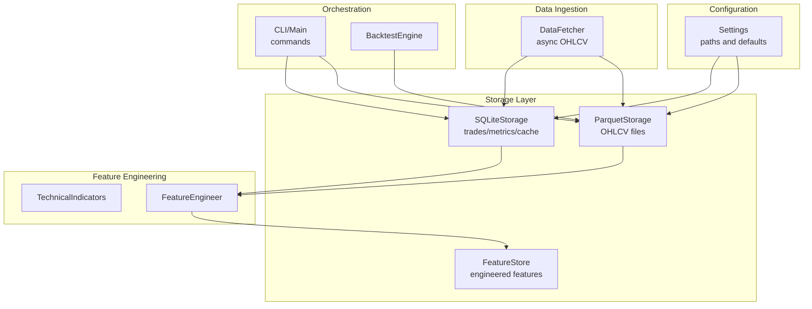
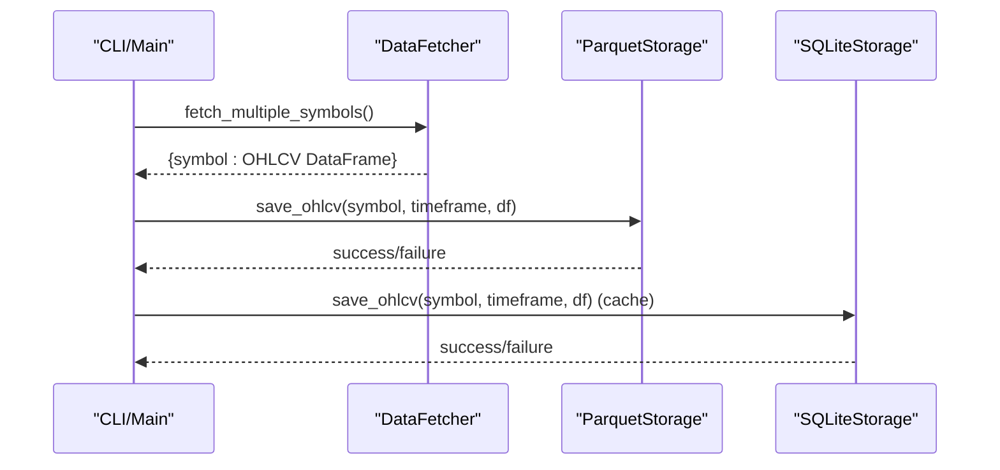
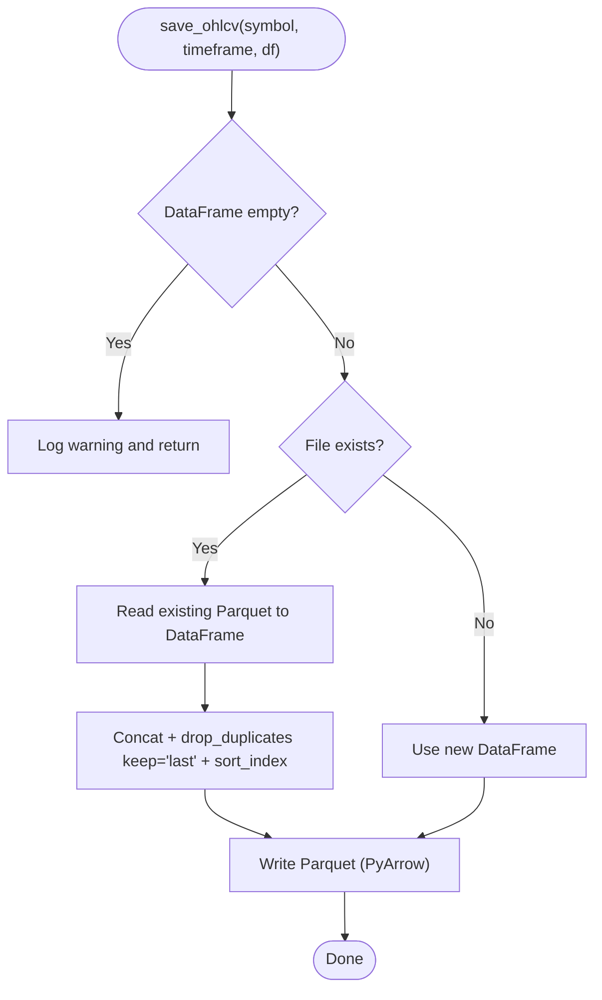
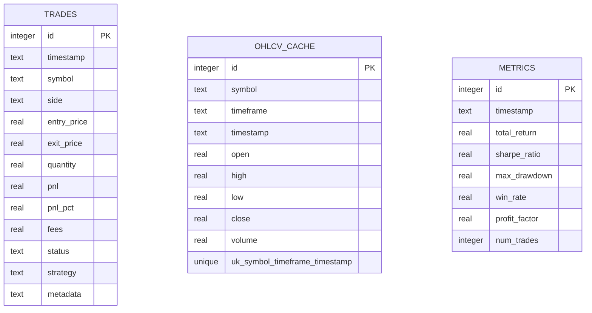
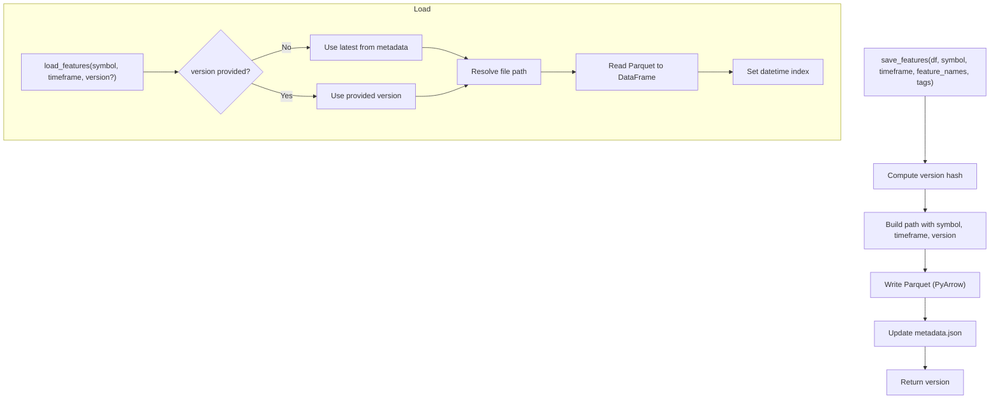
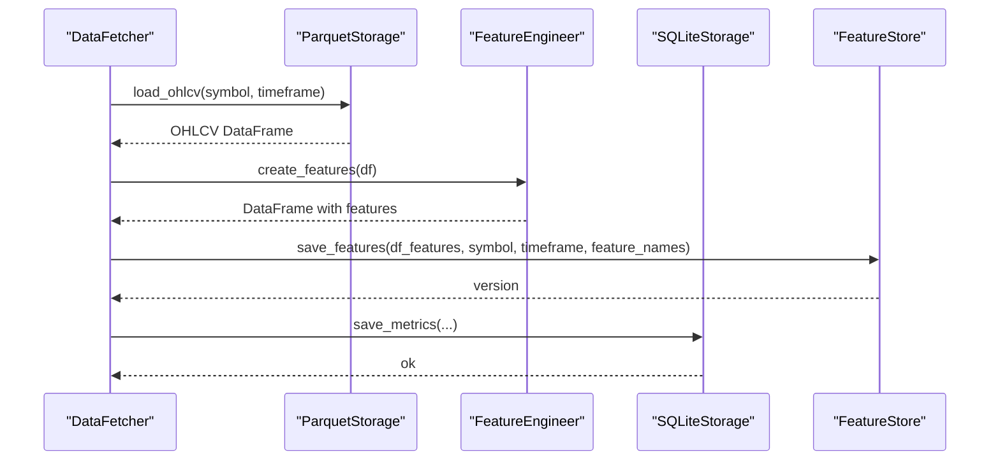
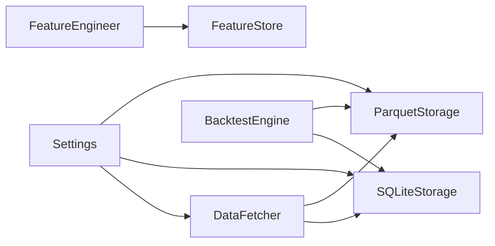

# Storage System

<cite>
**Referenced Files in This Document**
- [storage.py](file://trading_bot/data/storage.py)
- [settings.py](file://trading_bot/config/settings.py)
- [store.py](file://trading_bot/features/store.py)
- [engineering.py](file://trading_bot/features/engineering.py)
- [indicators.py](file://trading_bot/features/indicators.py)
- [fetcher.py](file://trading_bot/data/fetcher.py)
- [main.py](file://trading_bot/main.py)
- [engine.py](file://trading_bot/backtest/engine.py)
</cite>

## Table of Contents
1. [Introduction](#introduction)
2. [Project Structure](#project-structure)
3. [Core Components](#core-components)
4. [Architecture Overview](#architecture-overview)
5. [Detailed Component Analysis](#detailed-component-analysis)
6. [Dependency Analysis](#dependency-analysis)
7. [Performance Considerations](#performance-considerations)
8. [Troubleshooting Guide](#troubleshooting-guide)
9. [Conclusion](#conclusion)

## Introduction
This document describes the data storage architecture of the trading application, focusing on the dual-storage approach:
- Parquet for historical OHLCV data
- SQLite for metadata, configuration, and operational records (trades, metrics)

It explains data partitioning strategies, compression settings, query optimization, lifecycle management, retention policies, backup procedures, schema design, indexing strategies, performance tuning, data loading patterns, batch processing, and integration with the feature engineering pipeline.

## Project Structure
The storage system spans several modules:
- Data ingestion and storage: [storage.py](file://trading_bot/data/storage.py)
- Configuration and paths: [settings.py](file://trading_bot/config/settings.py)
- Feature engineering and feature store: [engineering.py](file://trading_bot/features/engineering.py), [indicators.py](file://trading_bot/features/indicators.py), [store.py](file://trading_bot/features/store.py)
- Data fetching: [fetcher.py](file://trading_bot/data/fetcher.py)
- Orchestration and CLI: [main.py](file://trading_bot/main.py)
- Backtesting integration: [engine.py](file://trading_bot/backtest/engine.py)

**Diagram sources**
- [storage.py:53-198](file://trading_bot/data/storage.py#L53-L198)
- [storage.py:200-484](file://trading_bot/data/storage.py#L200-L484)
- [settings.py:83-88](file://trading_bot/config/settings.py#L83-L88)
- [fetcher.py:111-164](file://trading_bot/data/fetcher.py#L111-L164)
- [engineering.py:31-85](file://trading_bot/features/engineering.py#L31-L85)
- [indicators.py:20-46](file://trading_bot/features/indicators.py#L20-L46)
- [store.py:18-184](file://trading_bot/features/store.py#L18-L184)
- [main.py:69-102](file://trading_bot/main.py#L69-L102)
- [engine.py:147-240](file://trading_bot/backtest/engine.py#L147-L240)

**Section sources**
- [storage.py:1-484](file://trading_bot/data/storage.py#L1-L484)
- [settings.py:80-91](file://trading_bot/config/settings.py#L80-L91)
- [fetcher.py:111-164](file://trading_bot/data/fetcher.py#L111-L164)
- [store.py:18-184](file://trading_bot/features/store.py#L18-L184)
- [engineering.py:31-85](file://trading_bot/features/engineering.py#L31-L85)
- [indicators.py:20-46](file://trading_bot/features/indicators.py#L20-L46)
- [main.py:69-102](file://trading_bot/main.py#L69-L102)
- [engine.py:147-240](file://trading_bot/backtest/engine.py#L147-L240)

## Core Components
- ParquetStorage: Persists OHLCV data as Parquet files, keyed by symbol and timeframe. Supports deduplication and incremental updates.
- SQLiteStorage: Stores trades, performance metrics, and an OHLCV cache with appropriate tables and constraints.
- FeatureStore: Manages engineered features as Parquet files with versioning via hash and metadata JSON.
- DataFetcher: Asynchronous OHLCV retrieval used by CLI commands to populate storage.
- Settings: Centralized configuration for storage paths and runtime behavior.

Key responsibilities:
- ParquetStorage: Append-only, time-indexed persistence for OHLCV.
- SQLiteStorage: ACID transactions for operational records and fast filtering.
- FeatureStore: Versioned feature datasets with metadata and validation.

**Section sources**
- [storage.py:53-198](file://trading_bot/data/storage.py#L53-L198)
- [storage.py:200-484](file://trading_bot/data/storage.py#L200-L484)
- [store.py:18-184](file://trading_bot/features/store.py#L18-L184)
- [fetcher.py:111-164](file://trading_bot/data/fetcher.py#L111-L164)
- [settings.py:83-88](file://trading_bot/config/settings.py#L83-L88)

## Architecture Overview
The system separates concerns:
- Historical OHLCV is stored in Parquet files for efficient analytics and ML workloads.
- Operational data (trades, metrics) is stored in SQLite for transactional integrity and ad-hoc queries.
- Features generated during engineering are persisted separately with versioning and metadata.

**Diagram sources**
- [main.py:69-102](file://trading_bot/main.py#L69-L102)
- [fetcher.py:239-275](file://trading_bot/data/fetcher.py#L239-L275)
- [storage.py:71-117](file://trading_bot/data/storage.py#L71-L117)
- [storage.py:275-313](file://trading_bot/data/storage.py#L275-L313)

## Detailed Component Analysis

### Parquet Storage (Historical OHLCV)
- File naming: symbol_timeframe.parquet; slashes replaced by underscores.
- Indexing: expects a time index; loads and stores timestamps as index.
- Deduplication: merges new data with existing, removes duplicates by index, sorts by time.
- Filtering: optional start/end datetime filters during load.
- Path configuration: configured via settings; default path under data_dir.

**Diagram sources**
- [storage.py:71-117](file://trading_bot/data/storage.py#L71-L117)

**Section sources**
- [storage.py:53-198](file://trading_bot/data/storage.py#L53-L198)
- [settings.py:83-88](file://trading_bot/config/settings.py#L83-L88)

### SQLite Storage (Metadata, Trades, Metrics)
- Tables:
  - trades: trade records with timestamps, prices, quantities, PnL, fees, status, strategy, and JSON metadata.
  - ohlcv_cache: time-series cache with unique constraint on (symbol, timeframe, timestamp).
  - metrics: performance snapshots with timestamp and key metrics.
- Queries: parameterized SQL with optional filters for time range, symbol, and status.
- Transactions: ACID-compliant writes for reliability.

**Diagram sources**
- [storage.py:222-271](file://trading_bot/data/storage.py#L222-L271)
- [storage.py:332-357](file://trading_bot/data/storage.py#L332-L357)
- [storage.py:450-465](file://trading_bot/data/storage.py#L450-L465)

**Section sources**
- [storage.py:200-484](file://trading_bot/data/storage.py#L200-L484)

### Feature Store (Engineered Features)
- Purpose: persist feature sets with versioning and metadata.
- Versioning: MD5 hash computed from shape and sampled rows; filenames include version suffix.
- Metadata: stored alongside Parquet files in a JSON metadata file.
- Operations: save, load (latest or specific version), list, delete, compute statistics, validate.

**Diagram sources**
- [store.py:56-107](file://trading_bot/features/store.py#L56-L107)
- [store.py:109-158](file://trading_bot/features/store.py#L109-L158)

**Section sources**
- [store.py:18-184](file://trading_bot/features/store.py#L18-L184)

### Feature Engineering Pipeline Integration
- FeatureEngineer orchestrates indicator computation, custom features, rolling statistics, lags, scaling, and importance estimation.
- TechnicalIndicators provides a comprehensive suite of TA features.
- Integration: BacktestEngine uses FeatureEngineer to prepare feature sets for RL backtests.

**Diagram sources**
- [fetcher.py:111-164](file://trading_bot/data/fetcher.py#L111-L164)
- [storage.py:118-167](file://trading_bot/data/storage.py#L118-L167)
- [engineering.py:31-85](file://trading_bot/features/engineering.py#L31-L85)
- [indicators.py:20-46](file://trading_bot/features/indicators.py#L20-L46)
- [store.py:56-107](file://trading_bot/features/store.py#L56-L107)
- [storage.py:444-465](file://trading_bot/data/storage.py#L444-L465)

**Section sources**
- [engineering.py:31-85](file://trading_bot/features/engineering.py#L31-L85)
- [indicators.py:20-46](file://trading_bot/features/indicators.py#L20-L46)
- [engine.py:147-240](file://trading_bot/backtest/engine.py#L147-L240)

## Dependency Analysis
- Configuration dependency: Settings define storage paths and ensure directories exist.
- Storage dependency: DataFetcher depends on settings for exchange credentials and testnet mode; writes to Parquet and SQLite.
- Feature pipeline dependency: FeatureEngineer depends on TechnicalIndicators; BacktestEngine depends on FeatureEngineer and storage for data and metrics.

**Diagram sources**
- [settings.py:83-88](file://trading_bot/config/settings.py#L83-L88)
- [storage.py:53-198](file://trading_bot/data/storage.py#L53-L198)
- [storage.py:200-484](file://trading_bot/data/storage.py#L200-L484)
- [fetcher.py:111-164](file://trading_bot/data/fetcher.py#L111-L164)
- [engineering.py:31-85](file://trading_bot/features/engineering.py#L31-L85)
- [store.py:18-184](file://trading_bot/features/store.py#L18-L184)
- [engine.py:147-240](file://trading_bot/backtest/engine.py#L147-L240)

**Section sources**
- [settings.py:83-88](file://trading_bot/config/settings.py#L83-L88)
- [storage.py:53-198](file://trading_bot/data/storage.py#L53-L198)
- [storage.py:200-484](file://trading_bot/data/storage.py#L200-L484)
- [fetcher.py:111-164](file://trading_bot/data/fetcher.py#L111-L164)
- [engineering.py:31-85](file://trading_bot/features/engineering.py#L31-L85)
- [store.py:18-184](file://trading_bot/features/store.py#L18-L184)
- [engine.py:147-240](file://trading_bot/backtest/engine.py#L147-L240)

## Performance Considerations
- Parquet compression and encoding:
  - PyArrow writes Parquet; compression and encoding are controlled by PyArrow/Parquet settings. Consider configuring compression (e.g., snappy, gzip, lz4) and dictionary encoding for repeated categorical columns if needed.
- Indexing and partitioning:
  - Time index is essential for fast slicing; ensure timestamps are timezone-aware and sorted.
  - Partitioning by symbol and timeframe is implicit via file naming; consider adding partition columns for very large datasets.
- Query optimization:
  - SQLite queries use equality and range filters; ensure appropriate indices exist for frequent filters (e.g., symbol, timeframe, timestamp).
  - Prefer parameterized queries to avoid SQL injection and enable query plan reuse.
- Batch processing:
  - DataFetcher uses concurrency control (semaphore) and retries; tune limits for exchange rate limits and stability.
- Memory and I/O:
  - FeatureStore writes entire DataFrames; consider chunking for very large datasets.
  - Parquet reads/writes are optimized for columnar access; maintain columnar-friendly schemas.

[No sources needed since this section provides general guidance]

## Troubleshooting Guide
Common issues and resolutions:
- Parquet file not found:
  - Verify symbol and timeframe combination; check file naming convention and directory permissions.
- Duplicate timestamps after merge:
  - Deduplication occurs by index; ensure index is properly parsed as datetime.
- SQLite constraint violations:
  - Unique constraint on (symbol, timeframe, timestamp) in cache; handle conflicts gracefully.
- Missing metadata in FeatureStore:
  - Ensure metadata.json exists and is readable; re-save features to regenerate metadata.
- Exchange connectivity:
  - DataFetcher applies exponential backoff; verify API keys and network connectivity.

**Section sources**
- [storage.py:138-140](file://trading_bot/data/storage.py#L138-L140)
- [storage.py:88-96](file://trading_bot/data/storage.py#L88-L96)
- [storage.py:253-254](file://trading_bot/data/storage.py#L253-L254)
- [store.py:34-37](file://trading_bot/features/store.py#L34-L37)

## Conclusion
The storage system employs a pragmatic dual-layer design:
- Parquet for scalable, compressed historical OHLCV with robust deduplication and time-based queries.
- SQLite for operational records with strong consistency and flexible filtering.
- FeatureStore adds versioning and metadata for reproducible feature engineering.
- The feature engineering pipeline integrates seamlessly with storage for training and backtesting.

This architecture balances performance, reliability, and maintainability for both research and production workflows.