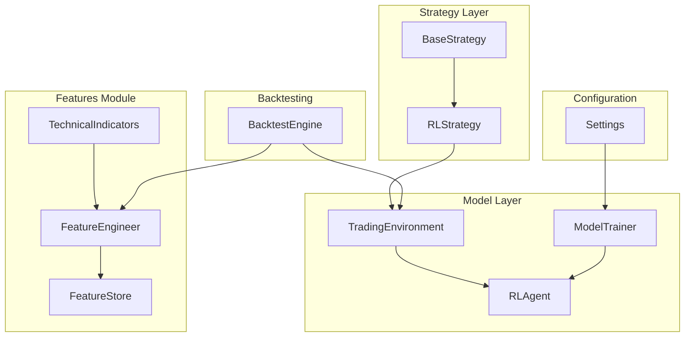
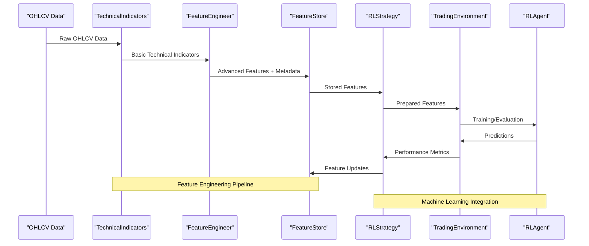
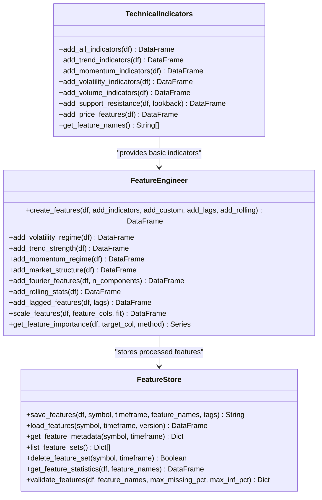
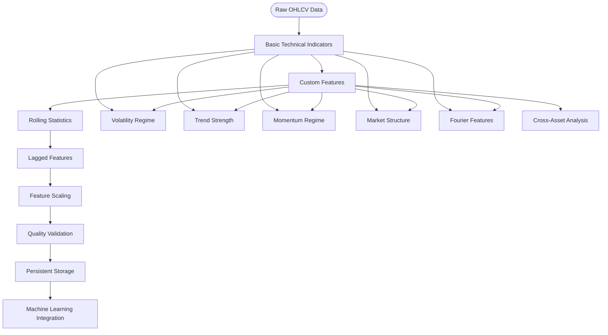
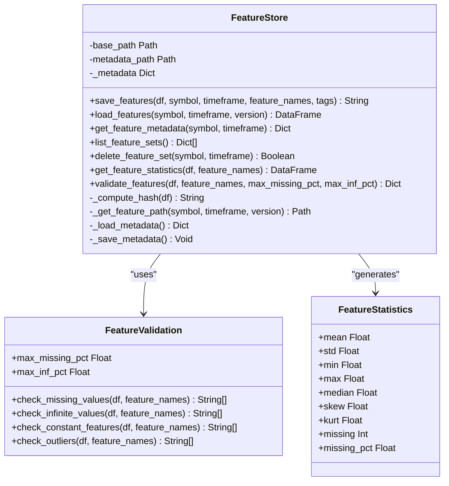
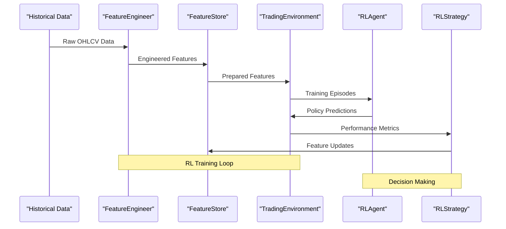
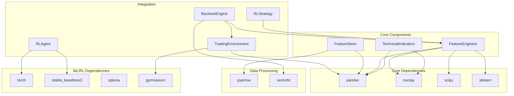

# Technical Indicators

<cite>
**Referenced Files in This Document**
- [indicators.py](file://trading_bot/features/indicators.py)
- [engineering.py](file://trading_bot/features/engineering.py)
- [store.py](file://trading_bot/features/store.py)
- [base.py](file://trading_bot/strategy/base.py)
- [rl_strategy.py](file://trading_bot/strategy/rl_strategy.py)
- [environment.py](file://trading_bot/models/environment.py)
- [agent.py](file://trading_bot/models/agent.py)
- [engine.py](file://trading_bot/backtest/engine.py)
- [settings.py](file://trading_bot/config/settings.py)
- [train.py](file://trading_bot/models/train.py)
- [README.md](file://README.md)
</cite>

## Table of Contents
1. [Introduction](#introduction)
2. [Project Structure](#project-structure)
3. [Core Components](#core-components)
4. [Architecture Overview](#architecture-overview)
5. [Detailed Component Analysis](#detailed-component-analysis)
6. [Dependency Analysis](#dependency-analysis)
7. [Performance Considerations](#performance-considerations)
8. [Troubleshooting Guide](#troubleshooting-guide)
9. [Conclusion](#conclusion)

## Introduction
This document provides comprehensive technical documentation for the Technical Indicators system within the AI Trading Bot. The system implements a sophisticated feature engineering pipeline that generates over 100 technical indicators and derived features from OHLCV market data. These indicators serve as the foundation for machine learning models, particularly reinforcement learning agents, enabling automated trading decisions.

The Technical Indicators system encompasses three primary layers: basic technical indicators, advanced feature engineering, and persistent feature storage. This architecture enables scalable feature generation, efficient caching, and seamless integration with both research and production trading workflows.

## Project Structure
The Technical Indicators system is organized within the trading_bot/features module, with supporting components distributed across the broader trading bot architecture:

**Diagram sources**
- [indicators.py:13-294](file://trading_bot/features/indicators.py#L13-L294)
- [engineering.py:17-442](file://trading_bot/features/engineering.py#L17-L442)
- [store.py:18-301](file://trading_bot/features/store.py#L18-L301)
- [rl_strategy.py:19-285](file://trading_bot/strategy/rl_strategy.py#L19-L285)
- [environment.py:15-405](file://trading_bot/models/environment.py#L15-L405)
- [agent.py:206-502](file://trading_bot/models/agent.py#L206-L502)
- [engine.py:41-418](file://trading_bot/backtest/engine.py#L41-L418)
- [settings.py:23-176](file://trading_bot/config/settings.py#L23-L176)

**Section sources**
- [README.md:198-232](file://README.md#L198-L232)

## Core Components

### TechnicalIndicators Class
The TechnicalIndicators class serves as the foundation for all technical analysis calculations. It implements comprehensive indicator calculations across four major categories:

**Trend Indicators**: Exponential Moving Averages (EMAs) at 9, 21, 50, and 200 periods, Simple Moving Averages (SMAs) at 20, 50, and 200 periods, and Moving Average Convergence Divergence (MACD) with signal line and histogram calculations.

**Momentum Indicators**: Relative Strength Index (RSI) at 7, 14, and 21 periods, Stochastic Oscillator with %K and %D lines, Williams %R, and Rate of Change (ROC) at 10 and 20 periods.

**Volatility Indicators**: Bollinger Bands with upper, middle, and lower bands, Average True Range (ATR) at 7, 14, and 21 periods, historical volatility calculations, and Donchian Channels.

**Volume Indicators**: On Balance Volume (OBV), Volume Weighted Average Price (VWAP), and volume-based ratios.

**Support/Resistance Levels**: Pivot point calculations, Fibonacci retracement levels, and distance measurements to support/resistance zones.

**Price Features**: Return calculations (1, 5, 10, 20-day returns), logarithmic returns, price position within ranges, candlestick characteristics (body size, wicks), and gap detection.

**Section sources**
- [indicators.py:13-294](file://trading_bot/features/indicators.py#L13-L294)

### FeatureEngineer Class
The FeatureEngineer class builds upon basic technical indicators by adding advanced feature engineering capabilities:

**Custom Features**: Volatility regime identification, trend strength measurements, momentum regime classification, market structure analysis, and Fourier transform features.

**Rolling Statistics**: Comprehensive statistical measures including rolling means, standard deviations, skewness, kurtosis, quantiles, and range analysis.

**Lagged Features**: Multi-period lagged versions of key features including price, volume, RSI, and ATR.

**Cross-Asset Features**: Correlation analysis and beta calculations against other assets.

**Feature Scaling**: Robust scaling using RobustScaler for numerical stability.

**Section sources**
- [engineering.py:17-442](file://trading_bot/features/engineering.py#L17-L442)

### FeatureStore Class
The FeatureStore provides persistent storage and management of engineered features:

**Version Control**: Hash-based versioning system using DataFrame samples and shapes.

**Parquet Storage**: Efficient binary storage format with metadata tracking.

**Metadata Management**: Comprehensive metadata including creation timestamps, feature counts, and tags.

**Validation System**: Quality checks for missing values, infinite values, constant features, and outliers.

**Statistics Generation**: Automated statistical summaries for feature analysis.

**Section sources**
- [store.py:18-301](file://trading_bot/features/store.py#L18-L301)

## Architecture Overview

**Diagram sources**
- [indicators.py:20-46](file://trading_bot/features/indicators.py#L20-L46)
- [engineering.py:31-85](file://trading_bot/features/engineering.py#L31-L85)
- [store.py:56-107](file://trading_bot/features/store.py#L56-L107)
- [rl_strategy.py:68-77](file://trading_bot/strategy/rl_strategy.py#L68-L77)
- [environment.py:105-132](file://trading_bot/models/environment.py#L105-L132)
- [agent.py:415-433](file://trading_bot/models/agent.py#L415-L433)

The architecture demonstrates a clear separation of concerns with specialized components handling different aspects of technical analysis and feature engineering.

## Detailed Component Analysis

### TechnicalIndicators Implementation

**Diagram sources**
- [indicators.py:13-294](file://trading_bot/features/indicators.py#L13-L294)
- [engineering.py:17-442](file://trading_bot/features/engineering.py#L17-L442)
- [store.py:18-301](file://trading_bot/features/store.py#L18-L301)

#### Indicator Categories Analysis

**Trend Analysis**: The system implements multiple moving average configurations to capture different time horizons. The combination of EMAs and SMAs provides robust trend identification across various market conditions.

**Momentum Detection**: Multiple momentum indicators ensure comprehensive market sentiment analysis. The inclusion of stochastic oscillators and RSI provides both relative and absolute momentum measurements.

**Volatility Measurement**: Advanced volatility calculations including ATR, historical volatility, and volatility regimes enable dynamic position sizing and risk management.

**Volume Analysis**: Volume-weighted features provide liquidity and conviction signals that complement price-based indicators.

**Section sources**
- [indicators.py:48-225](file://trading_bot/features/indicators.py#L48-L225)

### Feature Engineering Pipeline

**Diagram sources**
- [engineering.py:31-85](file://trading_bot/features/engineering.py#L31-L85)
- [engineering.py:87-129](file://trading_bot/features/engineering.py#L87-L129)
- [engineering.py:131-174](file://trading_bot/features/engineering.py#L131-L174)
- [engineering.py:176-209](file://trading_bot/features/engineering.py#L176-L209)
- [engineering.py:211-244](file://trading_bot/features/engineering.py#L211-L244)
- [engineering.py:246-278](file://trading_bot/features/engineering.py#L246-L278)

The feature engineering pipeline transforms raw market data into sophisticated predictive features through multiple enhancement stages.

**Section sources**
- [engineering.py:31-278](file://trading_bot/features/engineering.py#L31-L278)

### Feature Storage and Management

**Diagram sources**
- [store.py:18-301](file://trading_bot/features/store.py#L18-L301)
- [store.py:247-301](file://trading_bot/features/store.py#L247-L301)

The storage system ensures data integrity and enables reproducible feature engineering across different model iterations.

**Section sources**
- [store.py:18-301](file://trading_bot/features/store.py#L18-L301)

### Machine Learning Integration

**Diagram sources**
- [rl_strategy.py:68-77](file://trading_bot/strategy/rl_strategy.py#L68-L77)
- [environment.py:105-132](file://trading_bot/models/environment.py#L105-L132)
- [agent.py:415-433](file://trading_bot/models/agent.py#L415-L433)
- [rl_strategy.py:79-180](file://trading_bot/strategy/rl_strategy.py#L79-L180)

The integration with reinforcement learning models enables automated trading decisions based on engineered technical indicators.

**Section sources**
- [rl_strategy.py:19-285](file://trading_bot/strategy/rl_strategy.py#L19-L285)
- [environment.py:15-405](file://trading_bot/models/environment.py#L15-L405)
- [agent.py:206-502](file://trading_bot/models/agent.py#L206-L502)

## Dependency Analysis

**Diagram sources**
- [indicators.py:3-10](file://trading_bot/features/indicators.py#L3-L10)
- [engineering.py:3-14](file://trading_bot/features/engineering.py#L3-L14)
- [store.py:3-13](file://trading_bot/features/store.py#L3-L13)
- [agent.py:6-24](file://trading_bot/models/agent.py#L6-L24)
- [engine.py:3-18](file://trading_bot/backtest/engine.py#L3-L18)

The dependency graph reveals a well-structured ecosystem where core scientific computing libraries form the foundation, ML/RL frameworks enable advanced modeling, and specialized libraries handle specific domains like vectorized backtesting.

**Section sources**
- [indicators.py:3-10](file://trading_bot/features/indicators.py#L3-L10)
- [engineering.py:3-14](file://trading_bot/features/engineering.py#L3-L14)
- [store.py:3-13](file://trading_bot/features/store.py#L3-L13)
- [agent.py:6-24](file://trading_bot/models/agent.py#L6-L24)
- [engine.py:3-18](file://trading_bot/backtest/engine.py#L3-L18)

## Performance Considerations

### Computational Efficiency
The Technical Indicators system employs several optimization strategies:

**Vectorized Operations**: All calculations utilize pandas and numpy vectorization for optimal performance on large datasets.

**Memory Management**: Rolling window calculations are optimized to minimize memory overhead while maintaining computational accuracy.

**Feature Selection**: The system provides mechanisms to select relevant features, reducing dimensionality for machine learning models.

### Scalability Features
**Incremental Processing**: Features can be computed incrementally, enabling real-time updates without recomputing entire histories.

**Caching Mechanisms**: Version-controlled storage prevents redundant computations while maintaining data integrity.

**Parallel Processing**: Support for vectorized environments enables parallel training of multiple strategies.

### Memory Optimization
**Efficient Storage**: Parquet format provides compression and fast I/O operations for large feature datasets.

**Lazy Loading**: Features are loaded on-demand, reducing memory footprint during model training and inference.

## Troubleshooting Guide

### Common Issues and Solutions

**Missing Indicator Values**: Occurs when insufficient data for indicator calculations. Solution: Ensure adequate historical data length and adjust indicator parameters.

**Feature Scaling Problems**: Robust scaling handles outliers but may require manual intervention for extreme values. Solution: Review feature statistics and apply custom scaling thresholds.

**Storage Corruption**: Hash-based versioning prevents corrupted feature sets. Solution: Verify hash integrity and recompute features if necessary.

**Performance Degradation**: Large datasets may cause memory issues. Solution: Implement data sampling, feature selection, or incremental processing.

**Section sources**
- [store.py:247-301](file://trading_bot/features/store.py#L247-L301)
- [engineering.py:376-404](file://trading_bot/features/engineering.py#L376-L404)

### Debugging Technical Indicators

**Verification Steps**:
1. Confirm OHLCV data integrity and completeness
2. Validate indicator parameter ranges and lookback periods
3. Check for numerical stability issues with extreme values
4. Verify feature names and column alignment
5. Test with smaller datasets before scaling up

**Diagnostic Tools**:
- Feature statistics generation for quality assessment
- Missing value analysis and imputation strategies
- Outlier detection and handling procedures
- Performance benchmarking against known indicator implementations

## Conclusion

The Technical Indicators system represents a comprehensive solution for automated technical analysis within the AI Trading Bot framework. Its modular architecture enables flexible feature engineering, robust persistence, and seamless integration with machine learning models.

Key strengths include:
- **Comprehensive Coverage**: Over 100 technical indicators spanning trend, momentum, volatility, and volume domains
- **Advanced Engineering**: Sophisticated feature transformations including volatility regimes, market structure analysis, and Fourier components
- **Production Ready**: Persistent storage with version control, quality validation, and performance optimization
- **Scalable Design**: Modular components that can be independently developed, tested, and deployed

The system successfully bridges the gap between traditional technical analysis and modern machine learning approaches, providing a solid foundation for automated trading strategies. Its extensible design allows for continuous improvement and adaptation to evolving market conditions.

Future enhancements could include additional indicator families, real-time streaming integration, and expanded machine learning model support, building upon the robust foundation established by the current implementation.