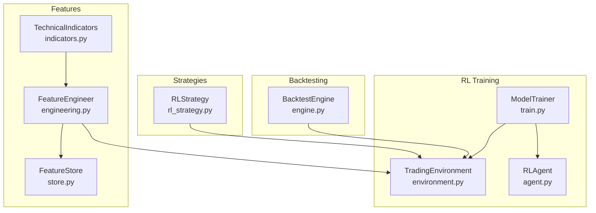
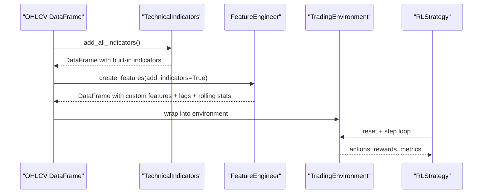
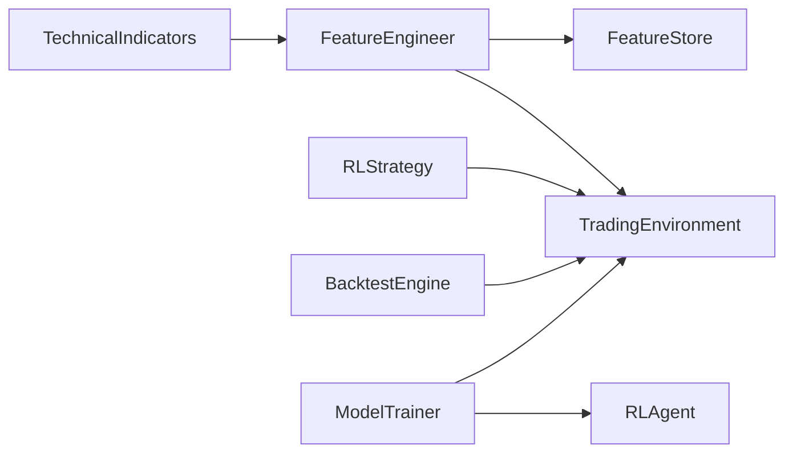

# Technical Indicators

<cite>
**Referenced Files in This Document**
- [indicators.py](file://trading_bot/features/indicators.py)
- [engineering.py](file://trading_bot/features/engineering.py)
- [store.py](file://trading_bot/features/store.py)
- [engine.py](file://trading_bot/backtest/engine.py)
- [rl_strategy.py](file://trading_bot/strategy/rl_strategy.py)
- [environment.py](file://trading_bot/models/environment.py)
- [agent.py](file://trading_bot/models/agent.py)
- [train.py](file://trading_bot/models/train.py)
- [settings.py](file://trading_bot/config/settings.py)
- [README.md](file://README.md)
</cite>

## Table of Contents
1. [Introduction](#introduction)
2. [Project Structure](#project-structure)
3. [Core Components](#core-components)
4. [Architecture Overview](#architecture-overview)
5. [Detailed Component Analysis](#detailed-component-analysis)
6. [Dependency Analysis](#dependency-analysis)
7. [Performance Considerations](#performance-considerations)
8. [Troubleshooting Guide](#troubleshooting-guide)
9. [Conclusion](#conclusion)
10. [Appendices](#appendices)

## Introduction
This document explains the technical indicator library and advanced feature engineering used in the trading bot. It covers built-in indicators (moving averages, RSI, MACD, Bollinger Bands, and volatility measures), custom volatility regimes and trend/momentum filters, and how these features are chained and combined for machine learning and backtesting. It also documents performance optimization techniques, vectorized calculations, memory management, and practical examples for creating custom indicators and composing multi-indicator signals.

## Project Structure
The indicator and feature engineering logic resides primarily in the features module, with downstream integration in backtesting, RL training, and execution.

**Diagram sources**
- [indicators.py:13-294](file://trading_bot/features/indicators.py#L13-L294)
- [engineering.py:17-442](file://trading_bot/features/engineering.py#L17-L442)
- [store.py:18-301](file://trading_bot/features/store.py#L18-L301)
- [engine.py:41-418](file://trading_bot/backtest/engine.py#L41-L418)
- [rl_strategy.py:19-285](file://trading_bot/strategy/rl_strategy.py#L19-L285)
- [environment.py:15-405](file://trading_bot/models/environment.py#L15-L405)
- [agent.py:206-502](file://trading_bot/models/agent.py#L206-L502)
- [train.py:23-446](file://trading_bot/models/train.py#L23-L446)

**Section sources**
- [README.md:1-363](file://README.md#L1-L363)
- [indicators.py:1-294](file://trading_bot/features/indicators.py#L1-L294)
- [engineering.py:1-442](file://trading_bot/features/engineering.py#L1-L442)
- [store.py:1-301](file://trading_bot/features/store.py#L1-L301)
- [engine.py:1-418](file://trading_bot/backtest/engine.py#L1-L418)
- [rl_strategy.py:1-285](file://trading_bot/strategy/rl_strategy.py#L1-L285)
- [environment.py:1-405](file://trading_bot/models/environment.py#L1-L405)
- [agent.py:1-502](file://trading_bot/models/agent.py#L1-L502)
- [train.py:1-446](file://trading_bot/models/train.py#L1-L446)

## Core Components
- TechnicalIndicators: Implements built-in indicators (trend, momentum, volatility, volume, support/resistance) using vectorized pandas/numpy operations.
- FeatureEngineer: Chains TechnicalIndicators with custom features (volatility regimes, trend strength, momentum regime, market structure, Fourier/cyclical features), rolling statistics, and lagged features. Handles NaN dropping and feature naming.
- FeatureStore: Manages persisted feature sets with hashing/versioning, metadata, and validation.
- BacktestEngine: Integrates signals with vectorbt for performance metrics and walk-forward/Monte Carlo analysis.
- RLStrategy, TradingEnvironment, RLAgent, ModelTrainer: Wrap features into RL training and inference pipelines with configurable hyperparameters and evaluation.

**Section sources**
- [indicators.py:13-294](file://trading_bot/features/indicators.py#L13-L294)
- [engineering.py:17-442](file://trading_bot/features/engineering.py#L17-L442)
- [store.py:18-301](file://trading_bot/features/store.py#L18-L301)
- [engine.py:41-418](file://trading_bot/backtest/engine.py#L41-L418)
- [rl_strategy.py:19-285](file://trading_bot/strategy/rl_strategy.py#L19-L285)
- [environment.py:15-405](file://trading_bot/models/environment.py#L15-L405)
- [agent.py:206-502](file://trading_bot/models/agent.py#L206-L502)
- [train.py:23-446](file://trading_bot/models/train.py#L23-L446)

## Architecture Overview
The indicator library is designed for composability and performance:
- Built-in indicators are computed via vectorized rolling and exponential functions.
- Custom features augment built-ins with regime detection, higher-order statistics, and temporal patterns.
- FeatureStore persists engineered datasets with metadata for reproducibility.
- Backtesting and RL pipelines consume the unified feature set.

**Diagram sources**
- [indicators.py:20-81](file://trading_bot/features/indicators.py#L20-L81)
- [engineering.py:31-85](file://trading_bot/features/engineering.py#L31-L85)
- [environment.py:105-250](file://trading_bot/models/environment.py#L105-L250)
- [rl_strategy.py:79-180](file://trading_bot/strategy/rl_strategy.py#L79-L180)

## Detailed Component Analysis

### TechnicalIndicators: Built-in Indicators
- Trend:
  - EMAs and SMAs for multiple windows.
  - MACD (12,26,9) and ADX-like True Range computation.
- Momentum:
  - RSI for multiple windows.
  - Stochastic oscillator and Williams %R.
  - ROC for multiple windows.
- Volatility:
  - Bollinger Bands (middle, upper, lower, width, pct).
  - ATR for multiple windows.
  - Historical volatility annualized.
  - Donchian Channels.
- Volume:
  - Volume SMAs, OBV, VWAP, volume EMA and ratio.
- Support/Resistance:
  - Pivot points, Fibonacci retracements, distances to nearest levels.

Calculation methods:
- Vectorized pandas rolling and ewm operations.
- Numpy-aware differences and reductions.
- Shifted series for price-based comparisons.

Parameter tuning:
- Multiple windows are preselected for broad applicability (e.g., RSI 7/14/21, BB 20-day, ATR 7/14/21).
- Users can extend windows or add new variants via FeatureEngineer.

Signal generation logic:
- Not implemented here; indicators are provided as features for downstream strategies and backtests.

Performance characteristics:
- Uses vectorized operations; minimal Python loops.
- Memory footprint proportional to input length and number of features.

**Section sources**
- [indicators.py:48-225](file://trading_bot/features/indicators.py#L48-L225)

### FeatureEngineer: Custom Features and Chaining
- Adds volatility regime features (realized vol, percentile regime, vol trend, vol-of-vol, squared returns).
- Trend strength (slope and R-squared from rolling linear fits, price vs moving averages, trend alignment).
- Momentum regime (multi-period momentum, acceleration, divergence).
- Market structure (higher-highs/lower-lows, structure score, breakout flags, ATR ratio).
- Fourier features (FFT magnitudes/frequencies, cyclical time features).
- Rolling statistics (returns mean/std/skew/kurt/min/max/quantiles).
- Lagged features (selected base features).
- Cross-asset correlation/beta and relative strength.
- Scaling (RobustScaler) and feature importance estimation.

Chaining and cross-indicator relationships:
- Uses built-in indicators as inputs (e.g., price vs EMA, RSI for divergence).
- Combines trend/momentum/volatility signals implicitly through feature stacking.
- Enables downstream ML models to learn complex interactions.

Performance and memory:
- Drops NaN rows after feature creation to avoid costly imputation.
- Stores feature names for reproducible selection.

**Section sources**
- [engineering.py:31-85](file://trading_bot/features/engineering.py#L31-L85)
- [engineering.py:87-129](file://trading_bot/features/engineering.py#L87-L129)
- [engineering.py:131-174](file://trading_bot/features/engineering.py#L131-L174)
- [engineering.py:176-209](file://trading_bot/features/engineering.py#L176-L209)
- [engineering.py:211-244](file://trading_bot/features/engineering.py#L211-L244)
- [engineering.py:246-278](file://trading_bot/features/engineering.py#L246-L278)
- [engineering.py:280-310](file://trading_bot/features/engineering.py#L280-L310)
- [engineering.py:312-335](file://trading_bot/features/engineering.py#L312-L335)
- [engineering.py:337-374](file://trading_bot/features/engineering.py#L337-L374)
- [engineering.py:376-404](file://trading_bot/features/engineering.py#L376-L404)
- [engineering.py:406-442](file://trading_bot/features/engineering.py#L406-L442)

### FeatureStore: Persistence, Versioning, and Validation
- Hashes dataframes for versioning and deduplication.
- Saves to Parquet with metadata (shape, feature names, tags).
- Loads with type restoration and logging.
- Provides statistics and validation (missing/infinite/constants/outliers).

Usage:
- Save features after engineering; load for backtesting or training.

**Section sources**
- [store.py:44-107](file://trading_bot/features/store.py#L44-L107)
- [store.py:109-158](file://trading_bot/features/store.py#L109-L158)
- [store.py:215-300](file://trading_bot/features/store.py#L215-L300)

### Backtesting Integration
- Vectorbt-based portfolio from entry/exit signals with realistic costs.
- Walk-forward analysis slides training/test windows and generates simple MA-based signals for demonstration.
- Monte Carlo simulation evaluates distribution of returns and drawdowns.

**Section sources**
- [engine.py:63-146](file://trading_bot/backtest/engine.py#L63-L146)
- [engine.py:242-295](file://trading_bot/backtest/engine.py#L242-L295)
- [engine.py:297-356](file://trading_bot/backtest/engine.py#L297-L356)

### RL Strategy and Environment
- RLStrategy prepares features, constructs environments, and converts agent actions into trade signals.
- TradingEnvironment defines action/observation spaces, simulates slippage/commissions, computes rewards, and tracks drawdowns.
- RLAgent supports PPO/SAC with optional LSTM/Transformer feature extractors and training callbacks.
- ModelTrainer orchestrates feature preparation, environment creation, hyperparameter optimization (Optuna), and walk-forward validation.

**Section sources**
- [rl_strategy.py:79-180](file://trading_bot/strategy/rl_strategy.py#L79-L180)
- [environment.py:105-250](file://trading_bot/models/environment.py#L105-L250)
- [agent.py:206-483](file://trading_bot/models/agent.py#L206-L483)
- [train.py:99-185](file://trading_bot/models/train.py#L99-L185)
- [train.py:187-244](file://trading_bot/models/train.py#L187-L244)
- [train.py:310-383](file://trading_bot/models/train.py#L310-L383)

## Dependency Analysis
Key relationships:
- TechnicalIndicators is used by FeatureEngineer to build the base feature set.
- FeatureEngineer is used by RLStrategy and BacktestEngine to prepare data.
- FeatureStore persists FeatureEngineer outputs for reuse.
- TradingEnvironment consumes FeatureEngineer outputs for RL training/inference.
- ModelTrainer coordinates feature engineering, environment creation, and agent training.

**Diagram sources**
- [indicators.py:13-294](file://trading_bot/features/indicators.py#L13-L294)
- [engineering.py:17-442](file://trading_bot/features/engineering.py#L17-L442)
- [store.py:18-301](file://trading_bot/features/store.py#L18-L301)
- [engine.py:41-418](file://trading_bot/backtest/engine.py#L41-L418)
- [rl_strategy.py:19-285](file://trading_bot/strategy/rl_strategy.py#L19-L285)
- [environment.py:15-405](file://trading_bot/models/environment.py#L15-L405)
- [agent.py:206-502](file://trading_bot/models/agent.py#L206-L502)
- [train.py:23-446](file://trading_bot/models/train.py#L23-L446)

**Section sources**
- [indicators.py:13-294](file://trading_bot/features/indicators.py#L13-L294)
- [engineering.py:17-442](file://trading_bot/features/engineering.py#L17-L442)
- [store.py:18-301](file://trading_bot/features/store.py#L18-L301)
- [engine.py:41-418](file://trading_bot/backtest/engine.py#L41-L418)
- [rl_strategy.py:19-285](file://trading_bot/strategy/rl_strategy.py#L19-L285)
- [environment.py:15-405](file://trading_bot/models/environment.py#L15-L405)
- [agent.py:206-502](file://trading_bot/models/agent.py#L206-L502)
- [train.py:23-446](file://trading_bot/models/train.py#L23-L446)

## Performance Considerations
- Vectorization:
  - Prefer pandas rolling/ewm and numpy operations over Python loops.
  - Use apply with raw=True only when necessary; otherwise rely on vectorized ops.
- Memory management:
  - FeatureEngineer drops NaN rows post-feature creation to reduce downstream overhead.
  - FeatureStore stores Parquet tables; consider partitioning for large datasets.
- Computation windows:
  - Large rolling windows increase compute and memory; tune windows based on data frequency and model needs.
- Scaling:
  - RobustScaler reduces sensitivity to outliers; consider feature clipping for extreme values.
- Training efficiency:
  - Optuna pruning and early stopping in ModelTrainer reduce unnecessary evaluations.
  - Vectorized environments can speed up parallel rollouts.

[No sources needed since this section provides general guidance]

## Troubleshooting Guide
Common issues and resolutions:
- Missing features after engineering:
  - Ensure sufficient data length for longest window; FeatureEngineer drops NaN rows.
- Excessive NaNs:
  - Verify indicator windows and lookbacks; consider shorter windows or skip certain features.
- Infinite or extreme values:
  - Use FeatureStore.validate_features to detect infinite values and extreme outliers; cap or remove problematic features.
- Model training instability:
  - Adjust environment reward scaling and penalties; reduce window size or feature count.
- Backtest drift:
  - Use walk-forward analysis to assess out-of-sample robustness.

**Section sources**
- [engineering.py:77-84](file://trading_bot/features/engineering.py#L77-L84)
- [store.py:247-300](file://trading_bot/features/store.py#L247-L300)
- [environment.py:306-347](file://trading_bot/models/environment.py#L306-L347)
- [train.py:134-141](file://trading_bot/models/train.py#L134-L141)

## Conclusion
The indicator library provides a comprehensive, vectorized foundation for technical analysis, augmented by custom volatility and regime features. Its modular design enables seamless integration with backtesting and RL training pipelines. By tuning windows, scaling features, and validating data quality, teams can build robust strategies grounded in strong statistical and ML practices.

[No sources needed since this section summarizes without analyzing specific files]

## Appendices

### Built-in Indicators Catalog
- Trend: EMAs (9,21,50,200), SMAs (20,50,200), MACD, ADX-like TR.
- Momentum: RSI (7,14,21), Stochastic, Williams %R, ROC (10,20).
- Volatility: Bollinger Bands, ATR (7,14,21), Historical Volatility, Donchian Channels.
- Volume: Volume SMAs (20,50), OBV, VWAP, Volume EMA, Volume Ratio.
- Support/Resistance: Pivot, Fibonacci retracements, distance to levels.

**Section sources**
- [indicators.py:48-225](file://trading_bot/features/indicators.py#L48-L225)

### Custom Volatility Measures
- Realized volatility (multiple windows), volatility regime classification, volatility trend, volatility-of-volatility, squared returns and moving averages.

**Section sources**
- [engineering.py:87-129](file://trading_bot/features/engineering.py#L87-L129)

### Creating Custom Indicators
- Extend TechnicalIndicators with new methods returning additional columns.
- Use vectorized pandas/numpy operations; copy DataFrame to avoid mutation warnings.
- Register new feature names in get_feature_names for consistency.

**Section sources**
- [indicators.py:227-294](file://trading_bot/features/indicators.py#L227-L294)

### Combining Multiple Indicators
- Use FeatureEngineer to chain built-ins with custom features.
- Leverage cross-indicator relationships (e.g., price vs EMA alignment, RSI divergence).
- Employ FeatureStore to persist combined feature sets for reproducible experiments.

**Section sources**
- [engineering.py:31-85](file://trading_bot/features/engineering.py#L31-L85)
- [store.py:56-107](file://trading_bot/features/store.py#L56-L107)

### Using Indicators for Trade Signals
- Example: Simple moving average crossover signals in walk-forward analysis.
- RLStrategy converts agent actions into buy/sell/close signals with confidence thresholds.

**Section sources**
- [engine.py:282-291](file://trading_bot/backtest/engine.py#L282-L291)
- [rl_strategy.py:128-180](file://trading_bot/strategy/rl_strategy.py#L128-L180)

### Configuration and Settings
- Trading mode, symbols, timeframe, capital, risk parameters, and model settings influence indicator usage and feature engineering defaults.

**Section sources**
- [settings.py:23-176](file://trading_bot/config/settings.py#L23-L176)