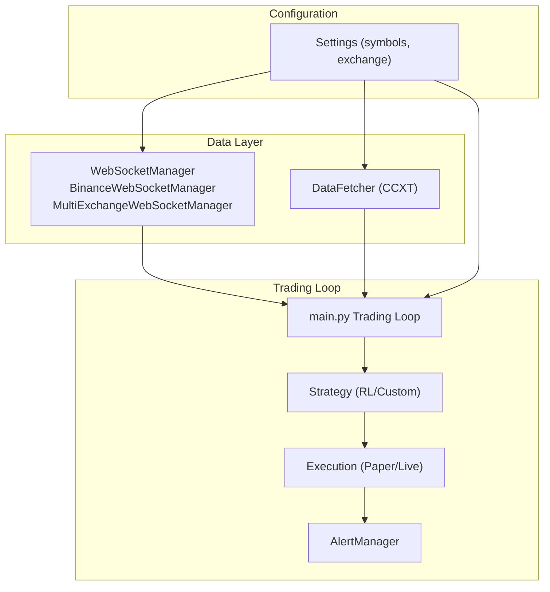
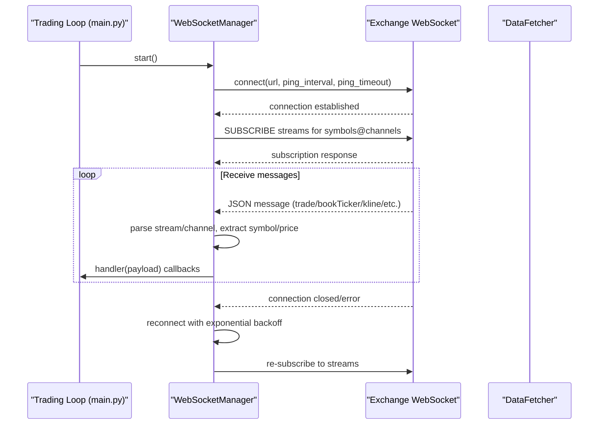
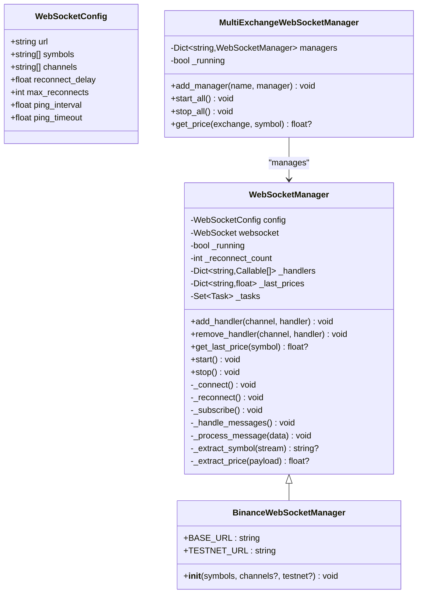
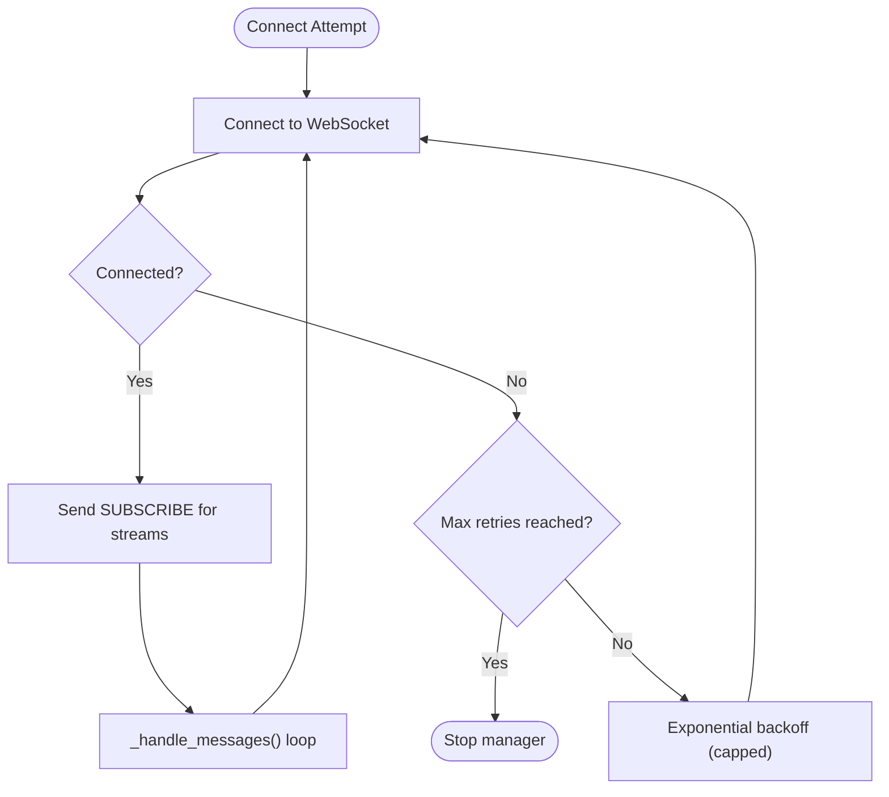
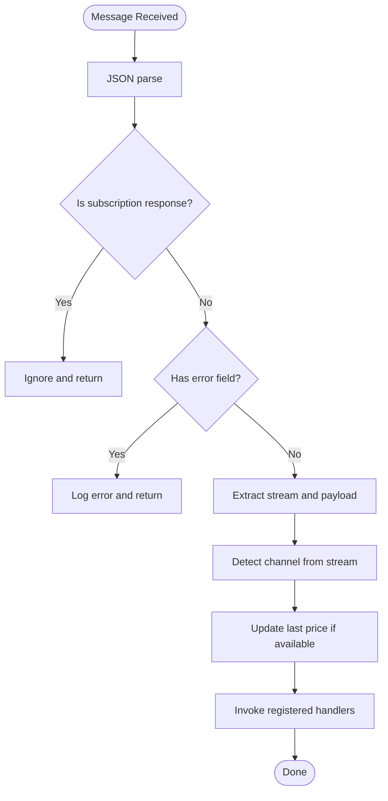
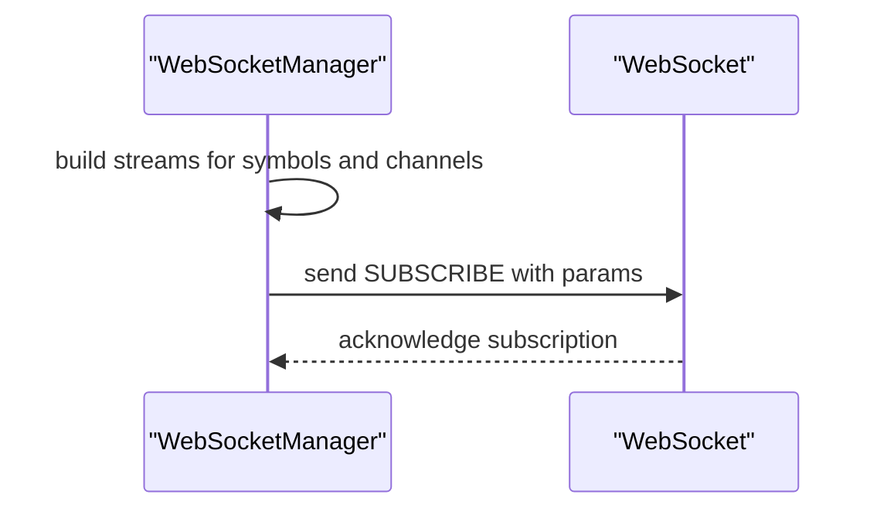
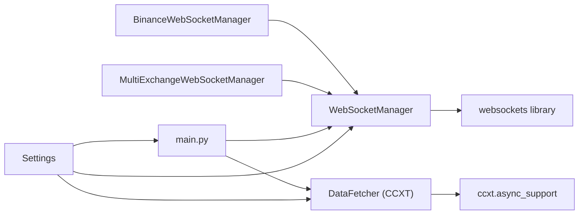

# WebSocket Integration

<cite>
**Referenced Files in This Document**
- [websocket.py](file://trading_bot/data/websocket.py)
- [__init__.py](file://trading_bot/data/__init__.py)
- [main.py](file://trading_bot/main.py)
- [alerts.py](file://trading_bot/monitoring/alerts.py)
- [fetcher.py](file://trading_bot/data/fetcher.py)
- [settings.py](file://trading_bot/config/settings.py)
- [README.md](file://README.md)
</cite>

## Table of Contents
1. [Introduction](#introduction)
2. [Project Structure](#project-structure)
3. [Core Components](#core-components)
4. [Architecture Overview](#architecture-overview)
5. [Detailed Component Analysis](#detailed-component-analysis)
6. [Dependency Analysis](#dependency-analysis)
7. [Performance Considerations](#performance-considerations)
8. [Troubleshooting Guide](#troubleshooting-guide)
9. [Conclusion](#conclusion)

## Introduction
This document explains the WebSocket integration for real-time market data streaming in the trading bot. It covers the WebSocket client architecture, connection management, message parsing, subscription handling for multiple symbols and channels, heartbeat mechanisms, reconnection strategies, and error handling. It also documents how to implement custom WebSocket handlers and integrate them with the main trading loop, and outlines how real-time orderbook updates, trade feeds, and funding rate streams are supported conceptually within the broader data pipeline.

## Project Structure
The WebSocket integration resides in the data layer and is designed to work alongside the CCXT-based data fetcher and the trading loop. The key files are:
- WebSocket manager and exchange-specific implementations
- Data fetcher for CCXT-based market data
- Main trading loop that orchestrates strategy updates and execution
- Configuration and settings for symbols and exchange connectivity
- Monitoring/alerts for operational visibility



**Diagram sources**
- [websocket.py:28-370](file://trading_bot/data/websocket.py#L28-L370)
- [fetcher.py:32-331](file://trading_bot/data/fetcher.py#L32-L331)
- [main.py:228-325](file://trading_bot/main.py#L228-L325)
- [settings.py:23-176](file://trading_bot/config/settings.py#L23-L176)

**Section sources**
- [websocket.py:1-370](file://trading_bot/data/websocket.py#L1-L370)
- [fetcher.py:1-331](file://trading_bot/data/fetcher.py#L1-L331)
- [main.py:1-347](file://trading_bot/main.py#L1-L347)
- [settings.py:1-176](file://trading_bot/config/settings.py#L1-L176)

## Core Components
- WebSocketConfig: Holds connection parameters such as URL, symbols, channels, ping intervals, and reconnection policy.
- WebSocketManager: Generic manager for WebSocket connections, subscriptions, message routing, and reconnection logic.
- BinanceWebSocketManager: Exchange-specific implementation for Binance (including testnet support) with preconfigured channels.
- MultiExchangeWebSocketManager: Aggregates multiple WebSocket managers for multi-exchange setups.
- DataFetcher: CCXT-based asynchronous data fetcher for OHLCV, orderbook, and funding rates used by the trading loop.
- Settings: Centralized configuration including symbols and exchange settings.

Key responsibilities:
- Manage WebSocket lifecycle, subscriptions, and message routing to handlers.
- Provide exchange-specific defaults and URLs.
- Integrate with the trading loop to supply real-time prices and market data.

**Section sources**
- [websocket.py:16-287](file://trading_bot/data/websocket.py#L16-L287)
- [websocket.py:289-370](file://trading_bot/data/websocket.py#L289-L370)
- [fetcher.py:32-331](file://trading_bot/data/fetcher.py#L32-L331)
- [settings.py:23-176](file://trading_bot/config/settings.py#L23-L176)

## Architecture Overview
The WebSocket integration is designed to:
- Establish persistent connections with automatic reconnection.
- Subscribe to multiple symbols and channels using exchange-specific stream formats.
- Parse and route messages to registered handlers.
- Maintain last-known prices for quick access during strategy updates.
- Support heartbeat via ping/pong managed by the underlying library.



**Diagram sources**
- [websocket.py:83-144](file://trading_bot/data/websocket.py#L83-L144)
- [websocket.py:164-184](file://trading_bot/data/websocket.py#L164-L184)
- [websocket.py:186-248](file://trading_bot/data/websocket.py#L186-L248)
- [main.py:263-316](file://trading_bot/main.py#L263-L316)

## Detailed Component Analysis

### WebSocketManager
Responsibilities:
- Connection lifecycle: start, stop, reconnect with exponential backoff.
- Subscription management: build combined streams for multiple symbols and channels.
- Message parsing: detect channel type, extract symbol and price, route to handlers.
- Handler registration: attach callbacks per channel type.
- Price tracking: maintain last known price per symbol.



**Diagram sources**
- [websocket.py:16-287](file://trading_bot/data/websocket.py#L16-L287)
- [websocket.py:289-370](file://trading_bot/data/websocket.py#L289-L370)

**Section sources**
- [websocket.py:28-287](file://trading_bot/data/websocket.py#L28-L287)
- [websocket.py:289-370](file://trading_bot/data/websocket.py#L289-L370)

### Connection Management and Reconnection
- Uses exponential backoff capped at a maximum delay.
- Resets reconnect counter on successful connection.
- Handles ConnectionClosed and InvalidStatusCode exceptions explicitly.
- Maintains a set of tasks to track handler invocations.



**Diagram sources**
- [websocket.py:101-144](file://trading_bot/data/websocket.py#L101-L144)
- [websocket.py:145-163](file://trading_bot/data/websocket.py#L145-L163)

**Section sources**
- [websocket.py:101-163](file://trading_bot/data/websocket.py#L101-L163)

### Message Parsing and Handler Routing
- Parses JSON messages and determines channel type from stream name.
- Extracts symbol and price from payloads and updates last price cache.
- Invokes registered handlers asynchronously if they are coroutine functions, otherwise synchronously.
- Logs errors per handler invocation to avoid single failures from crashing the pipeline.



**Diagram sources**
- [websocket.py:186-248](file://trading_bot/data/websocket.py#L186-L248)

**Section sources**
- [websocket.py:186-248](file://trading_bot/data/websocket.py#L186-L248)

### Subscription Handling for Multiple Symbols and Channels
- Builds combined streams using exchange-specific format (e.g., symbol@channel).
- Subscribes to all symbol-channel combinations.
- Supports configurable channels via WebSocketConfig.



**Diagram sources**
- [websocket.py:164-184](file://trading_bot/data/websocket.py#L164-L184)

**Section sources**
- [websocket.py:164-184](file://trading_bot/data/websocket.py#L164-L184)

### Heartbeat Mechanisms
- Configured via ping_interval and ping_timeout parameters passed to the WebSocket connection.
- The underlying library manages ping/pong automatically; the manager focuses on reconnection and resubscription.

**Section sources**
- [websocket.py:111-115](file://trading_bot/data/websocket.py#L111-L115)

### Error Handling and Data Consistency
- ConnectionClosed and InvalidStatusCode are handled with reconnection.
- JSON decode errors and handler exceptions are logged individually to prevent cascading failures.
- Last price cache ensures continuity of pricing data even during transient message parsing issues.

**Section sources**
- [websocket.py:126-143](file://trading_bot/data/websocket.py#L126-L143)
- [websocket.py:195-198](file://trading_bot/data/websocket.py#L195-L198)
- [websocket.py:246-247](file://trading_bot/data/websocket.py#L246-L247)

### Implementing Custom WebSocket Handlers
To add custom handlers:
- Register a handler for a specific channel using add_handler(channel, handler).
- Handlers receive parsed payloads for that channel.
- For asynchronous handlers, register coroutine functions; the manager schedules them as tasks and tracks completion.

Integration points:
- Handlers can update internal state, trigger alerts, or feed data into the trading loop.
- Handlers can be added before starting the WebSocket connection.

**Section sources**
- [websocket.py:50-71](file://trading_bot/data/websocket.py#L50-L71)
- [websocket.py:238-247](file://trading_bot/data/websocket.py#L238-L247)

### Integrating with the Main Trading Loop
- The trading loop periodically fetches OHLCV data via DataFetcher and generates signals.
- WebSocketManager maintains last prices that can be accessed via get_last_price(symbol).
- Handlers can be used to update in-memory state or trigger actions; the loop itself remains responsible for strategy generation and execution.

```mermaid
sequenceDiagram
participant Loop as "Trading Loop"
participant WS as "WebSocketManager"
participant DF as "DataFetcher"
participant Strat as "Strategy"
participant Exec as "Execution"
Loop->>DF : fetch_ohlcv for symbols
DF-->>Loop : OHLCV DataFrames
Loop->>Strat : update(data)
Strat-->>Loop : signals
Loop->>Exec : execute_signal(signal)
note over WS,Loop : Handlers can update state concurrently
```

**Diagram sources**
- [main.py:263-316](file://trading_bot/main.py#L263-L316)
- [fetcher.py:277-312](file://trading_bot/data/fetcher.py#L277-L312)

**Section sources**
- [main.py:228-325](file://trading_bot/main.py#L228-L325)
- [fetcher.py:277-312](file://trading_bot/data/fetcher.py#L277-L312)

### Real-Time Orderbook Updates, Trade Feeds, and Funding Rates
- Supported channels include trade, bookTicker, kline, and aggTrade by default.
- Orderbook and mid-price/spread/imbalance are computed by the CCXT-based DataFetcher for synchronous usage.
- Funding rates are fetched via DataFetcher for synchronous usage.
- WebSocketManager routes messages to handlers; implement custom handlers to process orderbook snapshots, incremental updates, trades, and funding announcements.

**Section sources**
- [websocket.py:41-46](file://trading_bot/data/websocket.py#L41-L46)
- [websocket.py:220-229](file://trading_bot/data/websocket.py#L220-L229)
- [fetcher.py:166-238](file://trading_bot/data/fetcher.py#L166-L238)

## Dependency Analysis
- WebSocketManager depends on the websockets library for transport and on the logging framework for observability.
- BinanceWebSocketManager extends WebSocketManager and sets exchange-specific URLs.
- MultiExchangeWebSocketManager coordinates multiple managers and exposes a unified interface for price queries.
- DataFetcher provides complementary market data (OHLCV, orderbook, funding) used by the trading loop.
- Settings supplies symbols and exchange configuration used by both WebSocket and DataFetcher.



**Diagram sources**
- [websocket.py:8-13](file://trading_bot/data/websocket.py#L8-L13)
- [websocket.py:289-316](file://trading_bot/data/websocket.py#L289-L316)
- [fetcher.py:8-12](file://trading_bot/data/fetcher.py#L8-L12)
- [main.py:11-17](file://trading_bot/main.py#L11-L17)
- [settings.py:23-176](file://trading_bot/config/settings.py#L23-L176)

**Section sources**
- [websocket.py:1-370](file://trading_bot/data/websocket.py#L1-L370)
- [fetcher.py:1-331](file://trading_bot/data/fetcher.py#L1-L331)
- [main.py:1-347](file://trading_bot/main.py#L1-L347)
- [settings.py:1-176](file://trading_bot/config/settings.py#L1-L176)

## Performance Considerations
- Handler concurrency: Asynchronous handlers are scheduled as tasks; ensure handlers are efficient to avoid backlog.
- Exponential backoff: Prevents thundering herd on repeated failures; cap delays to balance resilience and responsiveness.
- Message parsing: Minimal JSON parsing overhead; symbol/price extraction is optimized for common fields.
- Price caching: Maintains last known prices to reduce handler overhead and provide immediate access during updates.

[No sources needed since this section provides general guidance]

## Troubleshooting Guide
Common issues and resolutions:
- Connection drops: The manager reconnects automatically with exponential backoff; monitor logs for repeated failures.
- JSON parse errors: Messages that cannot be parsed are logged; verify message format compatibility.
- Handler errors: Exceptions in handlers are logged individually; fix handler logic to prevent recurring failures.
- No data after reconnect: Ensure subscriptions are resent after reconnect; the manager handles this automatically.
- Pricing gaps: Use last price cache for continuity; implement custom handlers to reconcile missing data.

Operational visibility:
- Alerts can be sent via AlertManager for critical conditions such as circuit breaker triggers or errors.

**Section sources**
- [websocket.py:126-143](file://trading_bot/data/websocket.py#L126-L143)
- [websocket.py:195-198](file://trading_bot/data/websocket.py#L195-L198)
- [websocket.py:246-247](file://trading_bot/data/websocket.py#L246-L247)
- [alerts.py:242-258](file://trading_bot/monitoring/alerts.py#L242-L258)

## Conclusion
The WebSocket integration provides a robust, extensible foundation for real-time market data streaming. It supports multiple symbols and channels, handles reconnection gracefully, and offers a flexible handler mechanism for custom processing. Combined with the CCXT-based DataFetcher and the trading loop, it enables responsive, data-driven trading strategies with strong error handling and operational visibility.