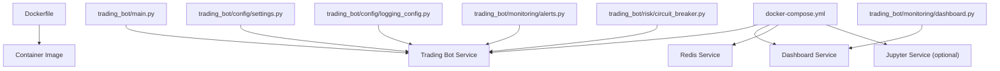
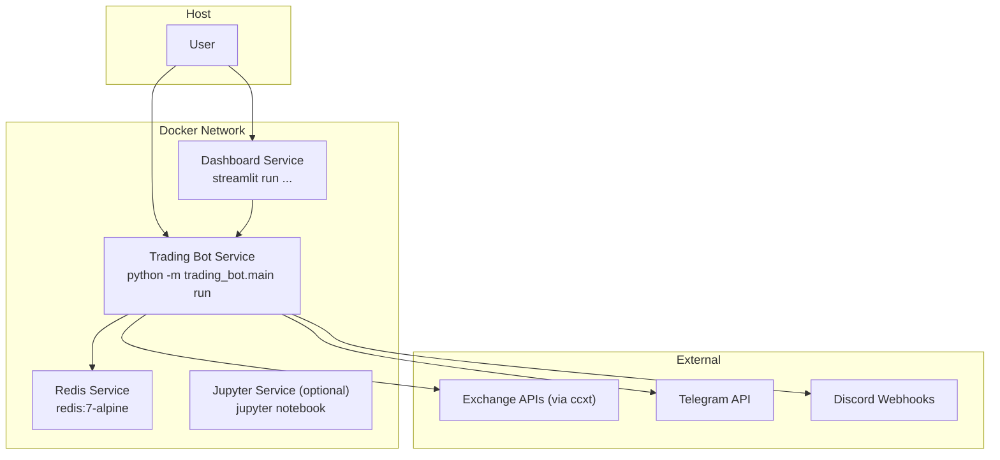
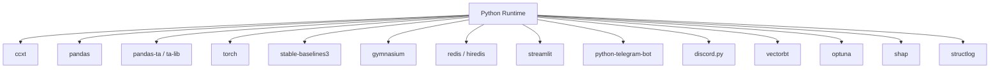

# Deployment Guide

<cite>
**Referenced Files in This Document**
- [Dockerfile](file://Dockerfile)
- [docker-compose.yml](file://docker-compose.yml)
- [requirements.txt](file://requirements.txt)
- [pyproject.toml](file://pyproject.toml)
- [README.md](file://README.md)
- [trading_bot/main.py](file://trading_bot/main.py)
- [trading_bot/config/settings.py](file://trading_bot/config/settings.py)
- [trading_bot/config/logging_config.py](file://trading_bot/config/logging_config.py)
- [trading_bot/monitoring/dashboard.py](file://trading_bot/monitoring/dashboard.py)
- [trading_bot/monitoring/alerts.py](file://trading_bot/monitoring/alerts.py)
- [trading_bot/risk/circuit_breaker.py](file://trading_bot/risk/circuit_breaker.py)
</cite>

## Table of Contents
1. [Introduction](#introduction)
2. [Project Structure](#project-structure)
3. [Core Components](#core-components)
4. [Architecture Overview](#architecture-overview)
5. [Detailed Component Analysis](#detailed-component-analysis)
6. [Dependency Analysis](#dependency-analysis)
7. [Performance Considerations](#performance-considerations)
8. [Troubleshooting Guide](#troubleshooting-guide)
9. [Conclusion](#conclusion)
10. [Appendices](#appendices)

## Introduction
This guide provides comprehensive deployment instructions for the AI Trading Bot, covering containerization with Docker, orchestration via Docker Compose, production considerations, scaling strategies, infrastructure requirements, environment setup, logging and monitoring, security, backups, maintenance, troubleshooting, and performance optimization.

## Project Structure
The repository is organized around a modular Python package with supporting configuration, orchestration, and documentation assets. The most relevant artifacts for deployment are:
- Container definition and runtime defaults
- Service orchestration with Docker Compose
- Application entry points and CLI commands
- Configuration and logging systems
- Monitoring and alerting components
- Risk control mechanisms

**Diagram sources**
- [Dockerfile:1-44](file://Dockerfile#L1-L44)
- [docker-compose.yml:1-79](file://docker-compose.yml#L1-L79)
- [trading_bot/main.py:1-347](file://trading_bot/main.py#L1-L347)
- [trading_bot/config/settings.py:1-176](file://trading_bot/config/settings.py#L1-L176)
- [trading_bot/config/logging_config.py:1-91](file://trading_bot/config/logging_config.py#L1-L91)
- [trading_bot/monitoring/dashboard.py:1-328](file://trading_bot/monitoring/dashboard.py#L1-L328)
- [trading_bot/monitoring/alerts.py:1-311](file://trading_bot/monitoring/alerts.py#L1-L311)
- [trading_bot/risk/circuit_breaker.py:1-336](file://trading_bot/risk/circuit_breaker.py#L1-L336)

**Section sources**
- [Dockerfile:1-44](file://Dockerfile#L1-L44)
- [docker-compose.yml:1-79](file://docker-compose.yml#L1-L79)
- [README.md:198-231](file://README.md#L198-L231)

## Core Components
- Container image: Built from a Python slim base with system and Python dependencies, working directory, health checks, exposed ports, and default command.
- Services: Trading bot, Streamlit dashboard, Redis cache, optional Jupyter notebook server.
- Application entry point: Typer CLI exposing commands for configuration, data fetching, training, backtesting, running the bot, and launching the dashboard.
- Configuration: Pydantic-based settings with environment variable sourcing, validation, and directory provisioning.
- Logging: Structured logging with optional file output and Rich console formatting.
- Monitoring: Streamlit dashboard and alerting to Telegram and Discord.
- Risk control: Circuit breakers and emergency stop logic.

**Section sources**
- [Dockerfile:1-44](file://Dockerfile#L1-L44)
- [docker-compose.yml:3-79](file://docker-compose.yml#L3-L79)
- [trading_bot/main.py:19-347](file://trading_bot/main.py#L19-L347)
- [trading_bot/config/settings.py:23-176](file://trading_bot/config/settings.py#L23-L176)
- [trading_bot/config/logging_config.py:13-91](file://trading_bot/config/logging_config.py#L13-L91)
- [trading_bot/monitoring/dashboard.py:16-328](file://trading_bot/monitoring/dashboard.py#L16-L328)
- [trading_bot/monitoring/alerts.py:23-311](file://trading_bot/monitoring/alerts.py#L23-L311)
- [trading_bot/risk/circuit_breaker.py:32-336](file://trading_bot/risk/circuit_breaker.py#L32-L336)

## Architecture Overview
The deployment architecture centers on a containerized trading bot with supporting services for caching, research, and visualization. The trading bot integrates with external exchanges and Redis for caching, emits alerts, and exposes a Streamlit dashboard for monitoring.

**Diagram sources**
- [docker-compose.yml:4-79](file://docker-compose.yml#L4-L79)
- [trading_bot/main.py:214-326](file://trading_bot/main.py#L214-L326)
- [trading_bot/monitoring/alerts.py:23-311](file://trading_bot/monitoring/alerts.py#L23-L311)
- [trading_bot/monitoring/dashboard.py:258-328](file://trading_bot/monitoring/dashboard.py#L258-L328)

## Detailed Component Analysis

### Docker Configuration
- Base image and environment: Python 3.11 slim with buffered output disabled and pip caching disabled for reproducibility.
- System dependencies: Build tools and utilities required for native packages.
- Working directory and installation: Project copied, editable install performed, and required directories created.
- Ports: Dashboard port exposed for web access.
- Health checks: Both Dockerfile and Compose define health checks using a Python import.
- Default command: Displays CLI help when no command is supplied.

Best practices:
- Pin base image versions and rebuild regularly.
- Keep dependency lists minimal and pinned where feasible.
- Use non-root users and read-only filesystems in production hardening steps.

**Section sources**
- [Dockerfile:1-44](file://Dockerfile#L1-L44)

### Docker Compose Orchestration
- Services:
  - trading-bot: Builds from local context, mounts persistent volumes for data, models, and logs, loads environment from .env, depends on Redis, and runs the trading loop by default.
  - dashboard: Runs the Streamlit UI, binds port 8501, shares data and logs volumes.
  - redis: Provides caching and persistence via named volume.
  - jupyter: Optional research environment with notebooks volume.
- Networks: Single bridge network isolates services.
- Volumes: Named volume for Redis data and bind mounts for persistent data and models.

Operational tips:
- Use profiles to enable/disable optional services (e.g., research).
- Ensure .env is present and contains secrets.
- Use restart policies suited to your uptime requirements.

**Section sources**
- [docker-compose.yml:1-79](file://docker-compose.yml#L1-L79)

### Application Entry Point and Commands
The CLI supports:
- Version and configuration inspection
- Historical data fetching
- Model training and backtesting
- Running in paper or live modes
- Launching the dashboard

Operational guidance:
- Always validate configuration before running.
- Use paper mode for testing before enabling live mode.
- Provide a trained model path for live/paper runs.

**Section sources**
- [trading_bot/main.py:19-347](file://trading_bot/main.py#L19-L347)

### Configuration and Environment
- Settings are loaded from environment variables via a Pydantic settings class with validation and defaults.
- Paths for data, SQLite database, Parquet storage, models, and logs are configurable and created on demand.
- Redis connectivity is configurable.
- Logging level and file path are configurable.

Security and reliability:
- Keep sensitive keys in .env and exclude from images.
- Validate and sanitize environment inputs.
- Ensure directories exist and are writable.

**Section sources**
- [trading_bot/config/settings.py:23-176](file://trading_bot/config/settings.py#L23-L176)

### Logging Configuration
- Structured logging with optional file output and Rich console formatting.
- Configurable log level and file path.
- Used across the application for consistent telemetry.

Recommendations:
- Route logs to stdout/stderr for container log collection.
- Use rotating file handlers in production if persisting logs inside containers.
- Centralize logs with a collector (e.g., Fluent Bit, Filebeat) and forward to SIEM or analytics.

**Section sources**
- [trading_bot/config/logging_config.py:13-91](file://trading_bot/config/logging_config.py#L13-L91)

### Monitoring and Alerts
- Dashboard: Streamlit-based UI for performance charts and metrics summary.
- Alerts: Asynchronous notification to Telegram and Discord with severity levels and embedded messages.
- Integration points: Exchange APIs, Redis, and external messaging services.

Guidance:
- Configure Telegram/Discord credentials in environment variables.
- Monitor dashboard availability and data freshness.
- Use circuit breaker events to trigger alerts and pause trading.

**Section sources**
- [trading_bot/monitoring/dashboard.py:16-328](file://trading_bot/monitoring/dashboard.py#L16-L328)
- [trading_bot/monitoring/alerts.py:23-311](file://trading_bot/monitoring/alerts.py#L23-L311)

### Risk Control and Emergency Stops
- Circuit breakers monitor daily drawdown, position losses, consecutive losses, and volatility spikes.
- Emergency stop mechanism can halt trading with handlers and resume capability.
- Events are logged and can trigger alerts.

Operational safety:
- Tune thresholds to match risk appetite.
- Ensure alerts are configured so critical events are noticed promptly.
- Implement manual override procedures for resets and resumes.

**Section sources**
- [trading_bot/risk/circuit_breaker.py:32-336](file://trading_bot/risk/circuit_breaker.py#L32-L336)

### Data and Model Persistence
- Persistent volumes for data, models, and logs mounted into containers.
- Redis volume persists cached state.

Recommendations:
- Back up volumes regularly.
- Snapshot models and Parquet datasets periodically.
- Use immutable model artifacts with versioned filenames.

**Section sources**
- [docker-compose.yml:11-16](file://docker-compose.yml#L11-L16)
- [docker-compose.yml:48-50](file://docker-compose.yml#L48-L50)
- [trading_bot/config/settings.py:83-101](file://trading_bot/config/settings.py#L83-L101)

## Dependency Analysis
Runtime dependencies include core libraries, exchange integration, ML/RL frameworks, technical analysis, and monitoring tools. These are declared in requirements and pyproject metadata.

**Diagram sources**
- [requirements.txt:1-46](file://requirements.txt#L1-L46)
- [pyproject.toml:25-71](file://pyproject.toml#L25-L71)

**Section sources**
- [requirements.txt:1-46](file://requirements.txt#L1-L46)
- [pyproject.toml:25-71](file://pyproject.toml#L25-L71)

## Performance Considerations
- Container sizing: Allocate CPU/memory resources based on training and inference needs; monitor GPU utilization if using GPU-backed models.
- Data locality: Persist data and models on fast disks; consider SSD-backed volumes.
- Redis tuning: Adjust memory limits and eviction policies; monitor hit rates.
- Logging overhead: Prefer stdout forwarding and avoid excessive disk writes.
- Model updates: Batch retraining and rollout to minimize downtime.
- Network latency: Place services close to data sources and minimize cross-region traffic.

[No sources needed since this section provides general guidance]

## Troubleshooting Guide
Common deployment issues and resolutions:
- Import errors: Verify dependencies are installed in the image and environment matches the project’s Python version.
- API connection errors: Confirm API keys and testnet settings in environment variables.
- Out of memory: Reduce batch sizes or observation windows; scale vertically or horizontally as appropriate.
- Model not loading: Ensure model file paths are correct and accessible within the container.
- Health check failures: Inspect logs and confirm the application starts without exceptions.
- Dashboard not reachable: Check port bindings and firewall rules; verify the dashboard service is healthy.
- Alerts not sent: Validate Telegram/Discord credentials and network connectivity.

**Section sources**
- [README.md:309-323](file://README.md#L309-L323)
- [docker-compose.yml:22-26](file://docker-compose.yml#L22-L26)
- [Dockerfile:38-40](file://Dockerfile#L38-L40)

## Conclusion
This guide outlined a robust, container-first deployment strategy for the AI Trading Bot. By leveraging Docker and Docker Compose, you can reliably deploy the trading bot, dashboard, cache, and optional research stack. Adhering to the operational guidance—security, logging, monitoring, backups, and performance—will help maintain a resilient and observable system.

[No sources needed since this section summarizes without analyzing specific files]

## Appendices

### A. Environment Variables and Secrets
- Exchange credentials and testnet toggle
- Trading parameters (mode, symbols, timeframe, capital)
- Risk controls (daily drawdown, position size, risk per trade)
- Model parameters (type, timesteps, learning rate, batch size)
- Notification tokens and chat IDs
- Logging and dashboard ports

Ensure .env is present and restricted in access. Avoid committing secrets to version control.

**Section sources**
- [README.md:100-128](file://README.md#L100-L128)
- [trading_bot/config/settings.py:36-122](file://trading_bot/config/settings.py#L36-L122)

### B. Service Commands and Modes
- Run in paper mode for testing
- Run in live mode with caution and explicit confirmation
- Launch dashboard locally or via Compose
- Use CLI to inspect configuration and manage data/model lifecycle

**Section sources**
- [README.md:130-164](file://README.md#L130-L164)
- [trading_bot/main.py:214-343](file://trading_bot/main.py#L214-L343)

### C. Backup and Maintenance Procedures
- Back up volumes: data, models, logs, and Redis data
- Snapshot models with timestamps and parameters
- Archive logs and metrics for audit
- Schedule periodic OS and Python dependency updates
- Rotate long-term logs and enforce retention policies

[No sources needed since this section provides general guidance]