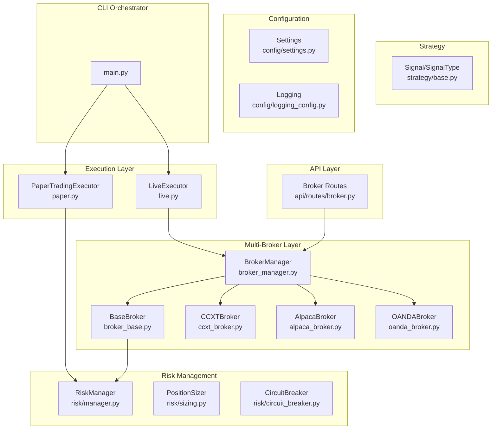
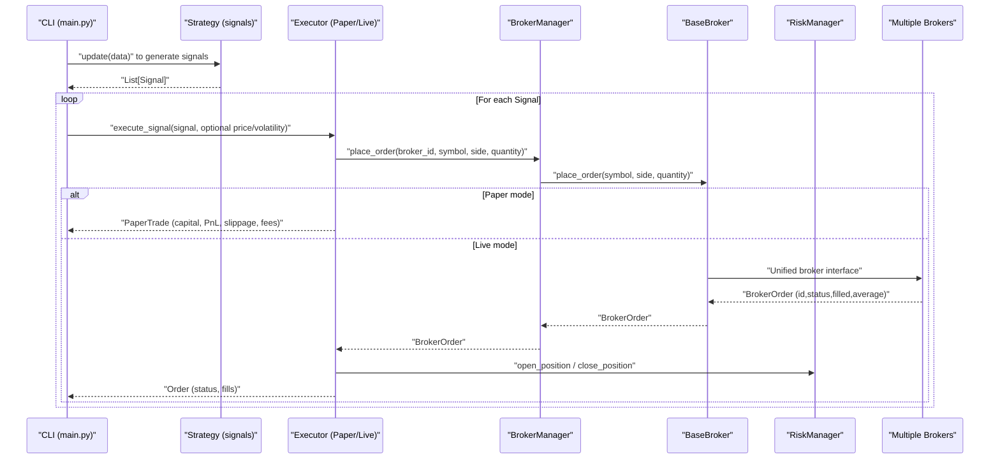
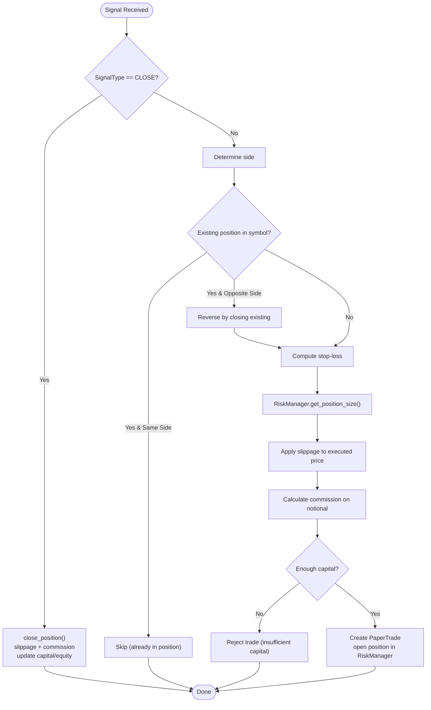
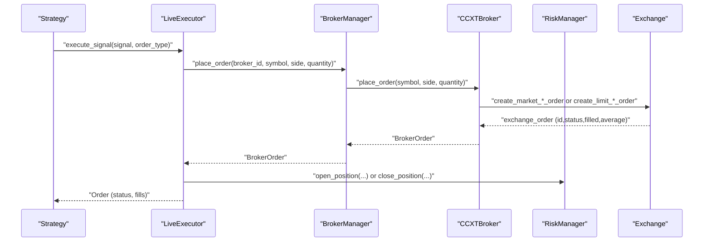
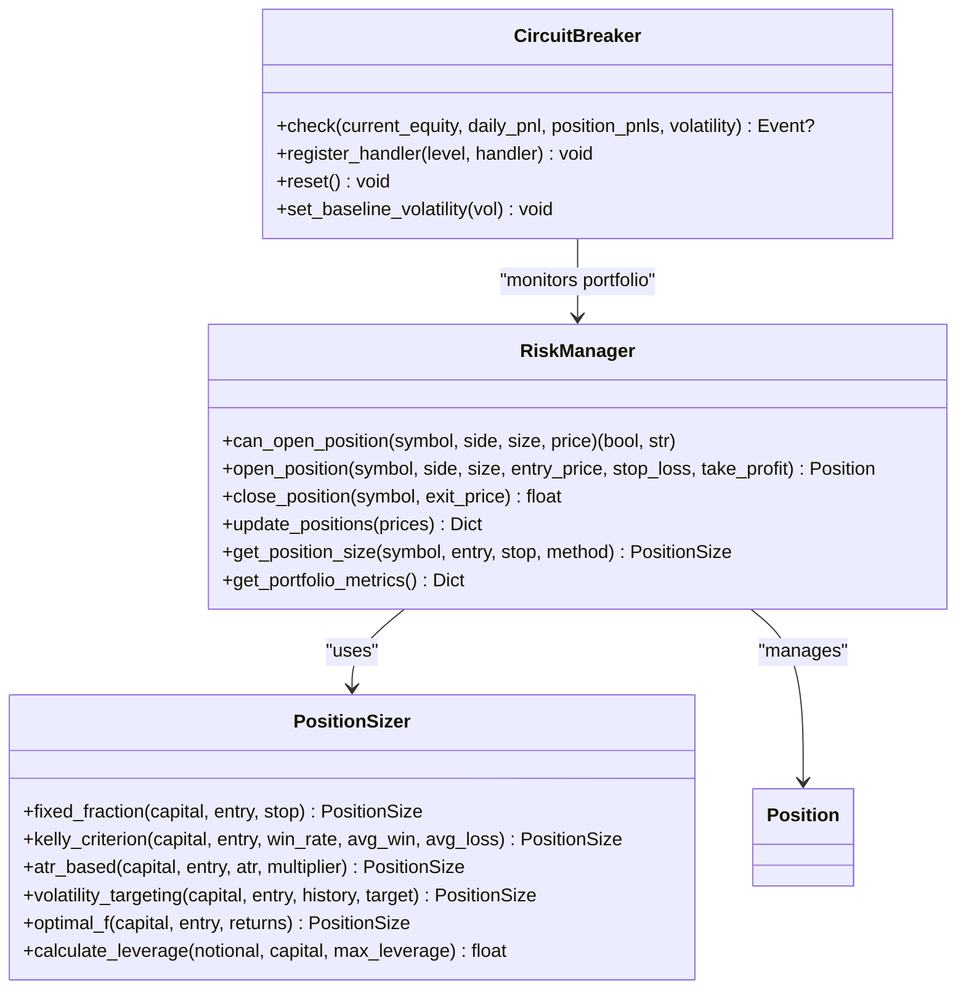
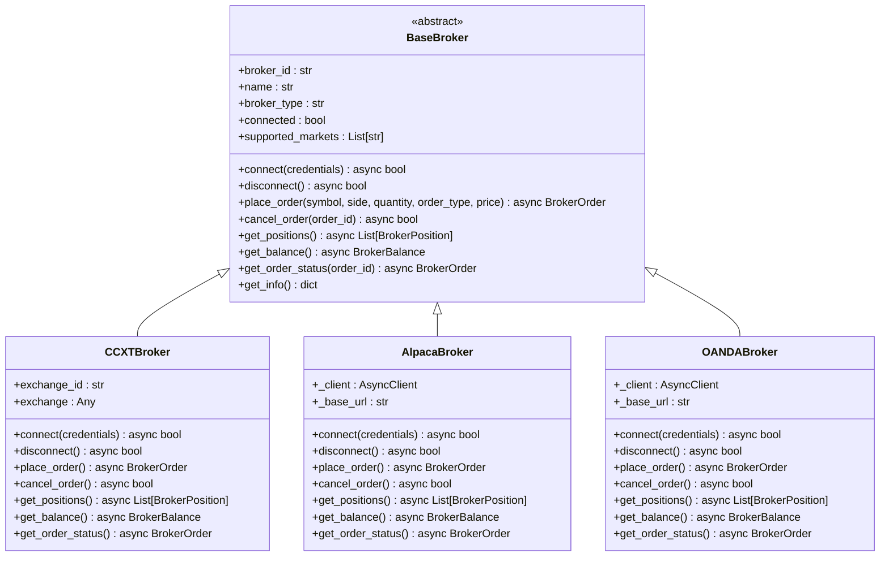
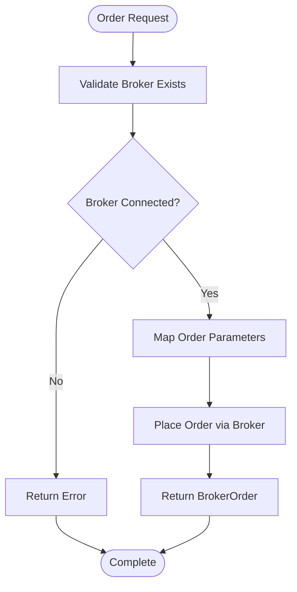
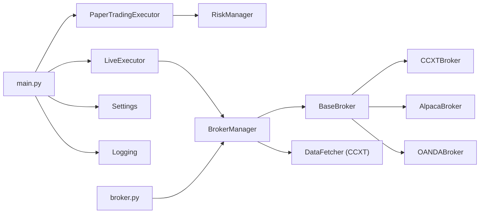

# Execution Engine

<cite>
**Referenced Files in This Document**
- [live.py](file://trading_bot/execution/live.py)
- [paper.py](file://trading_bot/execution/paper.py)
- [broker_base.py](file://trading_bot/execution/broker_base.py)
- [broker_manager.py](file://trading_bot/execution/broker_manager.py)
- [ccxt_broker.py](file://trading_bot/execution/brokers/ccxt_broker.py)
- [alpaca_broker.py](file://trading_bot/execution/brokers/alpaca_broker.py)
- [oanda_broker.py](file://trading_bot/execution/brokers/oanda_broker.py)
- [manager.py](file://trading_bot/risk/manager.py)
- [sizing.py](file://trading_bot/risk/sizing.py)
- [circuit_breaker.py](file://trading_bot/risk/circuit_breaker.py)
- [base.py](file://trading_bot/strategy/base.py)
- [settings.py](file://trading_bot/config/settings.py)
- [logging_config.py](file://trading_bot/config/logging_config.py)
- [main.py](file://trading_bot/main.py)
- [engine.py](file://trading_bot/backtest/engine.py)
- [requirements.txt](file://requirements.txt)
- [README.md](file://README.md)
- [broker.py](file://trading_bot/api/routes/broker.py)
</cite>

## Update Summary
**Changes Made**
- Complete migration to multi-broker architecture with BaseBroker abstraction
- Added BrokerManager for centralized broker coordination and management
- Integrated support for CCXT, Alpaca, and OANDA brokers with unified interface
- Enhanced execution system now supports distributed order routing across multiple trading venues
- Updated live trading executor to work with new broker abstraction layer
- Added comprehensive broker management API endpoints

## Table of Contents
1. [Introduction](#introduction)
2. [Project Structure](#project-structure)
3. [Core Components](#core-components)
4. [Architecture Overview](#architecture-overview)
5. [Detailed Component Analysis](#detailed-component-analysis)
6. [Multi-Broker Architecture](#multi-broker-architecture)
7. [Broker Management System](#broker-management-system)
8. [Dependency Analysis](#dependency-analysis)
9. [Performance Considerations](#performance-considerations)
10. [Troubleshooting Guide](#troubleshooting-guide)
11. [Conclusion](#conclusion)
12. [Appendices](#appendices)

## Introduction
This document explains the execution engine powering the AI Trading Bot's paper and live trading modes. The system has been completely migrated to a multi-broker architecture with a unified BaseBroker abstraction, enabling support for multiple trading venues including CCXT (Binance, Bybit, OKX, Kraken), Alpaca, and OANDA. It covers order management, trade execution, position handling, risk controls, order routing, and exchange integration specifics.

## Project Structure
The execution engine has been restructured around a multi-broker architecture with centralized broker management. The new structure supports distributed order routing across multiple trading venues while maintaining unified risk management and strategy integration.

**Diagram sources**
- [paper.py:36-392](file://trading_bot/execution/paper.py#L36-L392)
- [live.py:38-364](file://trading_bot/execution/live.py#L38-L364)
- [broker_base.py:73-134](file://trading_bot/execution/broker_base.py#L73-L134)
- [broker_manager.py:18-299](file://trading_bot/execution/broker_manager.py#L18-L299)
- [ccxt_broker.py:22-330](file://trading_bot/execution/brokers/ccxt_broker.py#L22-L330)
- [alpaca_broker.py:22-354](file://trading_bot/execution/brokers/alpaca_broker.py#L22-L354)
- [oanda_broker.py:22-368](file://trading_bot/execution/brokers/oanda_broker.py#L22-L368)
- [manager.py:58-432](file://trading_bot/risk/manager.py#L58-L432)
- [base.py:16-136](file://trading_bot/strategy/base.py#L16-L136)
- [settings.py:23-176](file://trading_bot/config/settings.py#L23-L176)
- [logging_config.py:13-91](file://trading_bot/config/logging_config.py#L13-L91)
- [main.py:214-326](file://trading_bot/main.py#L214-L326)
- [broker.py:1-372](file://trading_bot/api/routes/broker.py#L1-L372)

**Section sources**
- [README.md:7-36](file://README.md#L7-L36)
- [main.py:214-326](file://trading_bot/main.py#L214-L326)

## Core Components
- **PaperTradingExecutor**: Simulates trading with slippage and fees, tracks capital, equity, and PnL for performance reporting.
- **LiveExecutor**: Now works with the new multi-broker architecture, managing order lifecycle through BrokerManager and supporting multiple trading venues.
- **BaseBroker**: Abstract base class defining the unified interface for all broker integrations.
- **BrokerManager**: Centralized manager for registering, connecting, and coordinating multiple broker instances.
- **CCXTBroker**: Crypto exchange integration supporting Binance, Bybit, OKX, and Kraken via CCXT library.
- **AlpacaBroker**: US stock market integration with Alpaca API for paper and live trading.
- **OANDABroker**: Forex and CFD integration with OANDA REST API v20.
- **RiskManager**: Enforces portfolio-level risk controls, calculates position sizes, and tracks open positions and PnL.
- **PositionSizer**: Implements multiple sizing methods (fixed fraction, ATR-based, volatility targeting).
- **CircuitBreaker**: Monitors drawdown, daily loss, and volatility spikes; triggers actions and emits events.
- **Signals**: Unified Signal and SignalType for buy/sell/close actions.
- **Settings and Logging**: Centralized configuration and structured logging.

**Section sources**
- [paper.py:36-392](file://trading_bot/execution/paper.py#L36-L392)
- [live.py:38-364](file://trading_bot/execution/live.py#L38-L364)
- [broker_base.py:73-134](file://trading_bot/execution/broker_base.py#L73-L134)
- [broker_manager.py:18-299](file://trading_bot/execution/broker_manager.py#L18-L299)
- [ccxt_broker.py:22-330](file://trading_bot/execution/brokers/ccxt_broker.py#L22-L330)
- [alpaca_broker.py:22-354](file://trading_bot/execution/brokers/alpaca_broker.py#L22-L354)
- [oanda_broker.py:22-368](file://trading_bot/execution/brokers/oanda_broker.py#L22-L368)
- [manager.py:58-432](file://trading_bot/risk/manager.py#L58-L432)
- [sizing.py:25-312](file://trading_bot/risk/sizing.py#L25-L312)
- [circuit_breaker.py:32-336](file://trading_bot/risk/circuit_breaker.py#L32-L336)
- [base.py:16-136](file://trading_bot/strategy/base.py#L16-L136)
- [settings.py:23-176](file://trading_bot/config/settings.py#L23-L176)
- [logging_config.py:13-91](file://trading_bot/config/logging_config.py#L13-L91)

## Architecture Overview
The execution engine now operates on a multi-broker architecture with centralized broker management, enabling distributed order routing across multiple trading venues while maintaining unified risk controls and strategy integration.

**Diagram sources**
- [main.py:264-317](file://trading_bot/main.py#L264-L317)
- [paper.py:115-208](file://trading_bot/execution/paper.py#L115-L208)
- [live.py:115-223](file://trading_bot/execution/live.py#L115-L223)
- [broker_manager.py:135-171](file://trading_bot/execution/broker_manager.py#L135-L171)
- [broker_base.py:94-103](file://trading_bot/execution/broker_base.py#L94-L103)
- [manager.py:102-201](file://trading_bot/risk/manager.py#L102-L201)

## Detailed Component Analysis

### Paper Trading Executor
- Purpose: Realistic simulation of trading for backtesting and strategy development.
- Key features:
  - Slippage models: fixed and variable (based on volatility).
  - Fees: configurable commission rate applied to notional value.
  - Position handling: opens/reverses positions, closes with PnL calculation, updates capital/equity.
  - Performance metrics: total return, Sharpe, max drawdown, win rate, profit factor, equity curve.
- Execution flow:
  - Validates signal type and existing positions.
  - Computes stop-loss and position size via RiskManager.
  - Applies slippage to entry/exit prices.
  - Deducts commission and opens/closes positions.
  - Updates internal state and equity curve.

**Diagram sources**
- [paper.py:115-284](file://trading_bot/execution/paper.py#L115-L284)
- [manager.py:323-354](file://trading_bot/risk/manager.py#L323-L354)

**Section sources**
- [paper.py:36-392](file://trading_bot/execution/paper.py#L36-L392)
- [manager.py:58-432](file://trading_bot/risk/manager.py#L58-L432)

### Live Trading Executor (Enhanced)
- Purpose: Execute real orders through the new multi-broker architecture with risk checks and order lifecycle management.
- **Updated**: Now works with BrokerManager instead of direct CCXT integration.
- Key features:
  - **New**: Multi-broker support through BrokerManager abstraction.
  - **Enhanced**: Unified order placement across different broker types.
  - **Maintained**: Rate limiting, order lifecycle management, and emergency close functionality.
- Execution flow:
  - Initializes BrokerManager instead of DataFetcher.
  - Uses BrokerManager.place_order for order placement.
  - Manages order lifecycle through broker abstraction.
  - Updates positions via BrokerManager.get_positions.

**Diagram sources**
- [live.py:115-296](file://trading_bot/execution/live.py#L115-L296)
- [broker_manager.py:135-171](file://trading_bot/execution/broker_manager.py#L135-L171)
- [ccxt_broker.py:109-172](file://trading_bot/execution/brokers/ccxt_broker.py#L109-L172)
- [manager.py:102-261](file://trading_bot/risk/manager.py#L102-L261)

**Section sources**
- [live.py:38-364](file://trading_bot/execution/live.py#L38-L364)
- [broker_manager.py:18-299](file://trading_bot/execution/broker_manager.py#L18-L299)
- [manager.py:58-432](file://trading_bot/risk/manager.py#L58-L432)

### Risk Controls and Position Sizing
- RiskManager enforces:
  - Daily drawdown, max trades per day, max position size, total exposure.
  - Correlation guard (simple implementation).
  - Stop-loss/take-profit triggers on updates.
- PositionSizer supports:
  - Fixed fraction risk per trade.
  - ATR-based sizing.
  - Volatility targeting.
  - Kelly criterion (with safety fraction).
- CircuitBreaker monitors:
  - Daily loss, drawdown, position losses, consecutive losses, volatility spikes.
  - Emits events and supports automatic actions.

**Diagram sources**
- [manager.py:58-432](file://trading_bot/risk/manager.py#L58-L432)
- [sizing.py:25-312](file://trading_bot/risk/sizing.py#L25-L312)
- [circuit_breaker.py:32-336](file://trading_bot/risk/circuit_breaker.py#L32-L336)

**Section sources**
- [manager.py:102-354](file://trading_bot/risk/manager.py#L102-L354)
- [sizing.py:48-238](file://trading_bot/risk/sizing.py#L48-L238)
- [circuit_breaker.py:88-235](file://trading_bot/risk/circuit_breaker.py#L88-L235)

## Multi-Broker Architecture

### BaseBroker Abstraction
The BaseBroker class defines a unified interface for all broker integrations, enabling seamless switching between different trading venues while maintaining consistent behavior across the system.

Key components of BaseBroker:
- **Order Management**: Unified order placement, cancellation, and status checking.
- **Position Management**: Standardized position retrieval and balance information.
- **Market Data**: Consistent interface for market data access across brokers.
- **Connection Management**: Standardized connection and disconnection handling.

**Diagram sources**
- [broker_base.py:73-134](file://trading_bot/execution/broker_base.py#L73-L134)
- [ccxt_broker.py:22-330](file://trading_bot/execution/brokers/ccxt_broker.py#L22-L330)
- [alpaca_broker.py:22-354](file://trading_bot/execution/brokers/alpaca_broker.py#L22-L354)
- [oanda_broker.py:22-368](file://trading_bot/execution/brokers/oanda_broker.py#L22-L368)

**Section sources**
- [broker_base.py:73-134](file://trading_bot/execution/broker_base.py#L73-L134)
- [ccxt_broker.py:22-330](file://trading_bot/execution/brokers/ccxt_broker.py#L22-L330)
- [alpaca_broker.py:22-354](file://trading_bot/execution/brokers/alpaca_broker.py#L22-L354)
- [oanda_broker.py:22-368](file://trading_bot/execution/brokers/oanda_broker.py#L22-L368)

### Broker Types and Capabilities

#### CCXT Broker (Crypto Exchanges)
Supports major cryptocurrency exchanges with unified CCXT integration:
- **Supported Exchanges**: Binance, Bybit, OKX, Kraken
- **Markets**: Crypto, Futures
- **Features**: Market and limit orders, position management, balance tracking
- **Environment**: Testnet support for development

#### Alpaca Broker (US Stocks)
Provides US stock market access with Alpaca API:
- **Markets**: Stocks, Crypto
- **Environments**: Paper trading and live trading
- **Features**: REST API integration, comprehensive order types
- **Authentication**: API key and secret authentication

#### OANDA Broker (Forex and CFDs)
Enables forex and CFD trading through OANDA REST API:
- **Markets**: Forex, CFDs
- **Environments**: Practice and live accounts
- **Features**: REST API v20, comprehensive market data
- **Authentication**: Token-based authentication with account IDs

**Section sources**
- [ccxt_broker.py:22-95](file://trading_bot/execution/brokers/ccxt_broker.py#L22-L95)
- [alpaca_broker.py:22-94](file://trading_bot/execution/brokers/alpaca_broker.py#L22-L94)
- [oanda_broker.py:22-95](file://trading_bot/execution/brokers/oanda_broker.py#L22-L95)

## Broker Management System

### BrokerManager Responsibilities
The BrokerManager serves as the central coordinator for all broker integrations, providing:
- **Registration**: Automatic registration of all available broker types
- **Connection Management**: Unified connection and disconnection handling
- **Order Routing**: Distributed order placement across multiple brokers
- **Status Monitoring**: Real-time broker status and health monitoring
- **Active Broker Selection**: Single active broker coordination

### Broker Registration Process
The BrokerManager automatically registers all available brokers during initialization:
- **CCXT Brokers**: Creates instances for binance, bybit, okx, kraken
- **OANDA Broker**: Registers single OANDA instance
- **Alpaca Broker**: Registers single Alpaca instance

### Order Placement Workflow
Orders are routed through the BrokerManager using a unified interface:
1. Validate broker existence and connection status
2. Map order parameters to BrokerOrder format
3. Delegate to specific broker implementation
4. Return standardized order response

**Diagram sources**
- [broker_manager.py:135-171](file://trading_bot/execution/broker_manager.py#L135-L171)
- [broker_manager.py:162-170](file://trading_bot/execution/broker_manager.py#L162-L170)

**Section sources**
- [broker_manager.py:18-299](file://trading_bot/execution/broker_manager.py#L18-L299)

### API Integration
The broker management system exposes comprehensive API endpoints for external control and monitoring:
- **Broker Discovery**: List all available brokers
- **Connection Management**: Connect/disconnect brokers with credentials
- **Order Placement**: Unified order placement across all brokers
- **Position Management**: Retrieve positions from all connected brokers
- **Status Monitoring**: Real-time broker status and health checks

**Section sources**
- [broker.py:35-160](file://trading_bot/api/routes/broker.py#L35-L160)
- [broker.py:162-372](file://trading_bot/api/routes/broker.py#L162-L372)

## Dependency Analysis
- **Runtime selection**: CLI chooses PaperTradingExecutor or LiveExecutor based on mode flag.
- **Broker integration**: LiveExecutor now depends on BrokerManager instead of direct broker connections.
- **Risk integration**: Both executors depend on RiskManager for position sizing and risk checks.
- **Multi-broker dependency**: BrokerManager coordinates all broker implementations through BaseBroker abstraction.
- **API dependency**: Broker management API endpoints integrate with BrokerManager for external control.
- **Configuration**: Settings drive trading mode, symbols, initial capital, and risk parameters.
- **Logging**: Structured logging via structlog for observability across all broker types.

**Diagram sources**
- [main.py:244-252](file://trading_bot/main.py#L244-L252)
- [paper.py:70-74](file://trading_bot/execution/paper.py#L70-L74)
- [live.py:56-79](file://trading_bot/execution/live.py#L56-L79)
- [broker_manager.py:27-48](file://trading_bot/execution/broker_manager.py#L27-L48)
- [broker.py:13-13](file://trading_bot/api/routes/broker.py#L13-L13)
- [settings.py:23-176](file://trading_bot/config/settings.py#L23-L176)
- [logging_config.py:13-91](file://trading_bot/config/logging_config.py#L13-L91)

**Section sources**
- [main.py:214-326](file://trading_bot/main.py#L214-L326)
- [broker_manager.py:27-48](file://trading_bot/execution/broker_manager.py#L27-L48)
- [settings.py:23-176](file://trading_bot/config/settings.py#L23-L176)

## Performance Considerations
- **Paper mode**: Slippage and fees are deterministic; performance primarily depends on indicator calculations and backtesting loop throughput.
- **Live mode**: 
  - **New**: Multi-broker architecture adds minimal overhead through unified abstraction.
  - **Enhanced**: BrokerManager provides efficient connection pooling and resource management.
  - **Network latency**: Exchange response times dominate; consider broker proximity and API performance.
  - **Rate limiting**: Each broker handles its own rate limits; monitor across multiple venues.
- **Multi-broker considerations**:
  - **Connection management**: Efficient broker connection pooling reduces overhead.
  - **Order routing**: Strategic broker selection based on venue capabilities and costs.
  - **Latency monitoring**: Track performance across different broker types.
- **General optimization**:
  - Use structured logging to minimize I/O overhead.
  - Cache frequently accessed configuration values.
  - Monitor broker health and implement failover strategies.

## Troubleshooting Guide
- **Initialization and connectivity**:
  - **New**: Ensure proper broker credentials for selected broker type; verify BrokerManager registration.
  - **Enhanced**: Check broker status through BrokerManager.get_broker_status() for detailed diagnostics.
- **Multi-broker issues**:
  - **New**: Use BrokerManager.list_brokers() to verify all brokers are registered and connected.
  - **New**: Check BrokerManager.get_active_broker() to ensure correct broker selection.
- **Order placement failures**:
  - **Enhanced**: BrokerManager.place_order() returns None on failure; check broker connection status.
  - **New**: Verify broker-specific credential requirements for each broker type.
- **Risk rejections**:
  - Review daily drawdown, position size, exposure, and correlation thresholds in RiskManager.
- **Broker-specific troubleshooting**:
  - **CCXT**: Verify exchange credentials and sandbox/testnet settings.
  - **Alpaca**: Check API key permissions and environment configuration.
  - **OANDA**: Validate account ID and environment settings.
- **Logging**:
  - Use structured logging to capture contextual information for debugging across all broker types.

**Section sources**
- [broker_manager.py:69-88](file://trading_bot/execution/broker_manager.py#L69-L88)
- [broker_manager.py:270-294](file://trading_bot/execution/broker_manager.py#L270-L294)
- [ccxt_broker.py:42-94](file://trading_bot/execution/brokers/ccxt_broker.py#L42-L94)
- [alpaca_broker.py:39-93](file://trading_bot/execution/brokers/alpaca_broker.py#L39-L93)
- [oanda_broker.py:39-94](file://trading_bot/execution/brokers/oanda_broker.py#L39-L94)
- [manager.py:102-148](file://trading_bot/risk/manager.py#L102-L148)
- [logging_config.py:13-91](file://trading_bot/config/logging_config.py#L13-L91)

## Conclusion
The execution engine has been successfully migrated to a comprehensive multi-broker architecture with BaseBroker abstraction and BrokerManager coordination. This new system provides robust support for CCXT, Alpaca, and OANDA brokers while maintaining unified risk controls and strategy integration. The enhanced execution system enables distributed order routing across multiple trading venues, offering greater flexibility, redundancy, and market access compared to the previous single-exchange approach.

## Appendices

### Practical Execution Workflows

#### Paper trading workflow
- Strategy generates Signal.
- PaperTradingExecutor validates capital, computes slippage and fees, opens/closes position, and updates metrics.

#### Live trading workflow (Multi-Broker)
- Strategy generates Signal.
- LiveExecutor delegates order placement to BrokerManager.
- BrokerManager selects appropriate broker based on symbol and market requirements.
- BrokerManager.place_order() handles order placement across multiple venues.
- Orders are synchronized with RiskManager for position management.

#### Multi-Broker Order Routing
- **Symbol-based routing**: Route orders to brokers supporting specific symbols/markets.
- **Market-type routing**: Direct crypto orders to CCXT brokers, forex to OANDA, stocks to Alpaca.
- **Load balancing**: Distribute orders across multiple brokers for redundancy.
- **Failover**: Automatic fallback to alternative brokers if primary fails.

**Section sources**
- [paper.py:115-284](file://trading_bot/execution/paper.py#L115-L284)
- [live.py:115-296](file://trading_bot/execution/live.py#L115-L296)
- [broker_manager.py:135-171](file://trading_bot/execution/broker_manager.py#L135-L171)

### Configuration Highlights
- **Multi-broker configuration**: Central configuration supports multiple broker credentials and environments.
- **Broker selection**: Dynamic broker selection based on symbol and market requirements.
- **Trading mode**: Symbols, timeframe, initial capital, and risk parameters are centrally configured.
- **Logging**: Configurable logging level and file path for operational visibility across all broker types.

**Section sources**
- [settings.py:43-116](file://trading_bot/config/settings.py#L43-L116)
- [logging_config.py:13-91](file://trading_bot/config/logging_config.py#L13-L91)
- [broker_manager.py:27-48](file://trading_bot/execution/broker_manager.py#L27-L48)