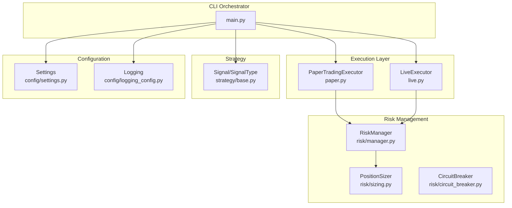
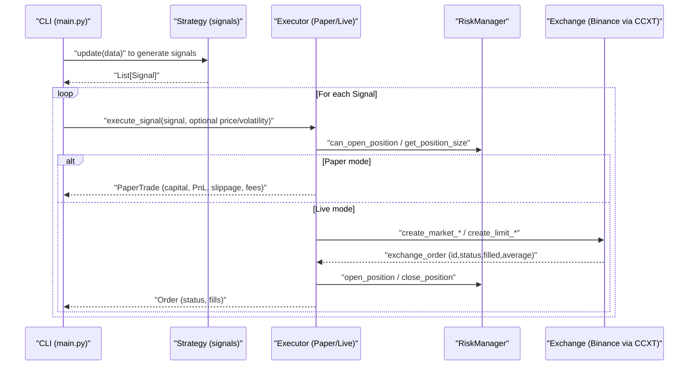
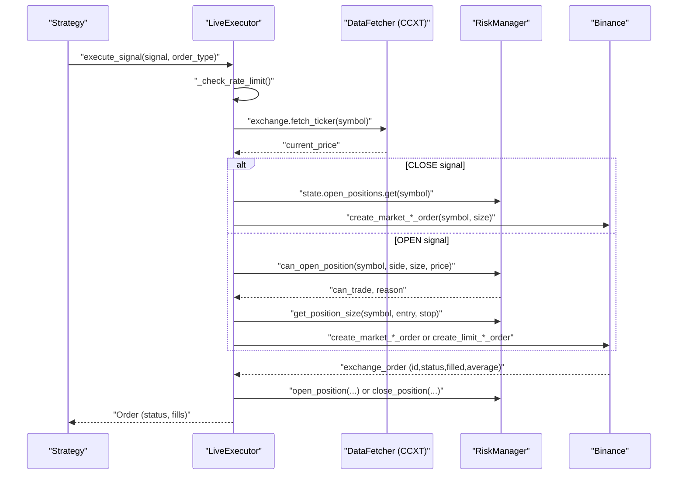
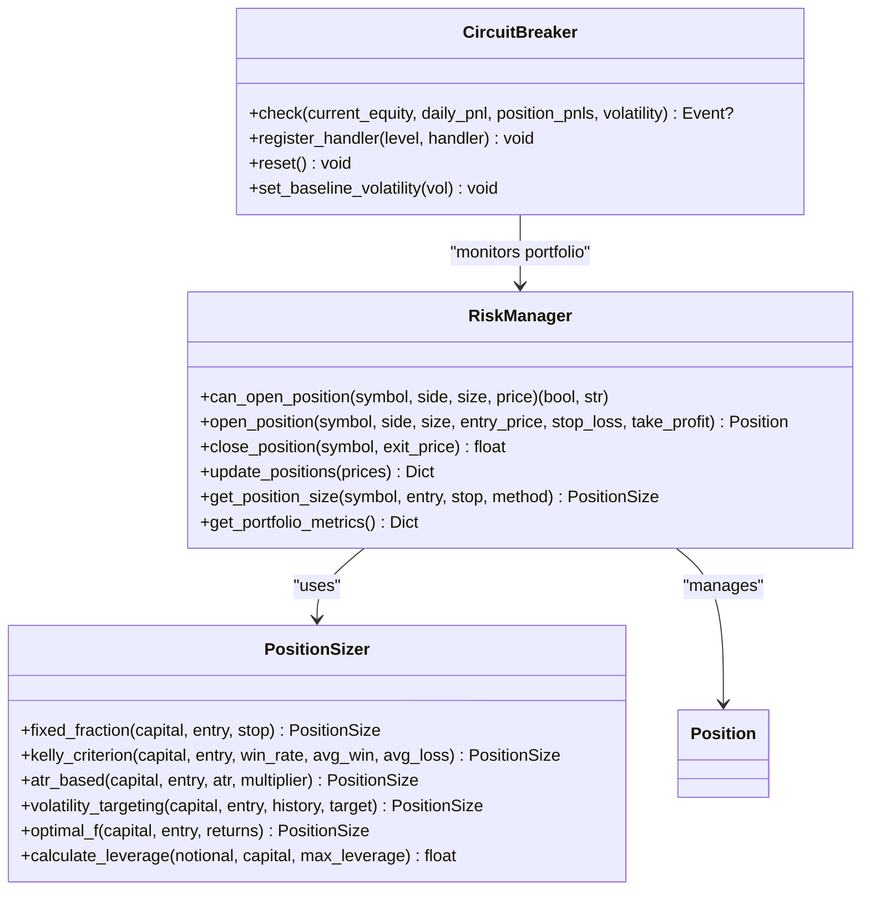
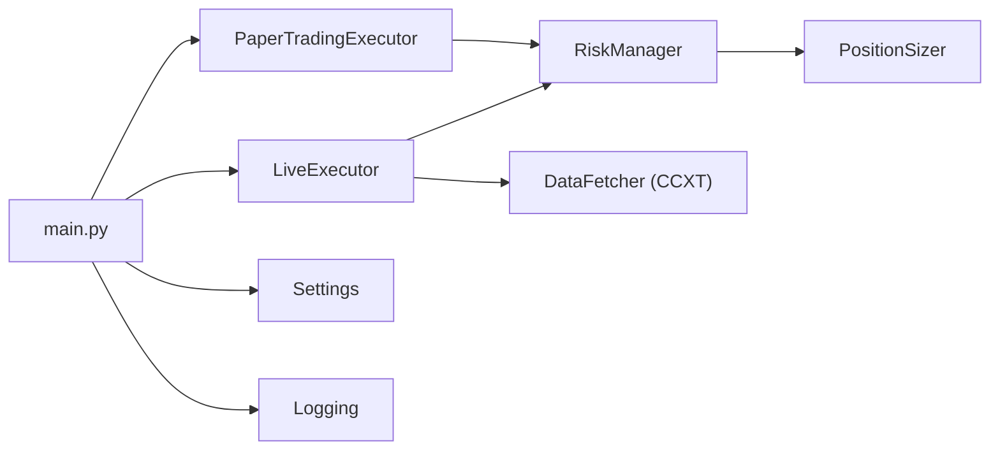

# Execution Engine

<cite>
**Referenced Files in This Document**
- [live.py](file://trading_bot/execution/live.py)
- [paper.py](file://trading_bot/execution/paper.py)
- [manager.py](file://trading_bot/risk/manager.py)
- [sizing.py](file://trading_bot/risk/sizing.py)
- [circuit_breaker.py](file://trading_bot/risk/circuit_breaker.py)
- [base.py](file://trading_bot/strategy/base.py)
- [settings.py](file://trading_bot/config/settings.py)
- [logging_config.py](file://trading_bot/config/logging_config.py)
- [main.py](file://trading_bot/main.py)
- [engine.py](file://trading_bot/backtest/engine.py)
- [requirements.txt](file://requirements.txt)
- [README.md](file://README.md)
</cite>

## Table of Contents
1. [Introduction](#introduction)
2. [Project Structure](#project-structure)
3. [Core Components](#core-components)
4. [Architecture Overview](#architecture-overview)
5. [Detailed Component Analysis](#detailed-component-analysis)
6. [Dependency Analysis](#dependency-analysis)
7. [Performance Considerations](#performance-considerations)
8. [Troubleshooting Guide](#troubleshooting-guide)
9. [Conclusion](#conclusion)
10. [Appendices](#appendices)

## Introduction
This document explains the execution engine powering the AI Trading Bot’s paper and live trading modes. It covers order management, trade execution, position handling, risk controls, order routing, exchange integration specifics for Binance, order types, slippage handling, and fee structures. Practical execution workflows, error handling, and performance considerations are included for both modes.

## Project Structure
The execution engine resides under trading_bot/execution and integrates with risk management, strategy generation, and configuration modules. The CLI orchestrates runtime selection between paper and live modes.

**Diagram sources**
- [paper.py:36-392](file://trading_bot/execution/paper.py#L36-L392)
- [live.py:38-364](file://trading_bot/execution/live.py#L38-L364)
- [manager.py:58-432](file://trading_bot/risk/manager.py#L58-L432)
- [sizing.py:25-312](file://trading_bot/risk/sizing.py#L25-L312)
- [circuit_breaker.py:32-336](file://trading_bot/risk/circuit_breaker.py#L32-L336)
- [base.py:16-136](file://trading_bot/strategy/base.py#L16-L136)
- [settings.py:23-176](file://trading_bot/config/settings.py#L23-L176)
- [logging_config.py:13-91](file://trading_bot/config/logging_config.py#L13-L91)
- [main.py:214-326](file://trading_bot/main.py#L214-L326)

**Section sources**
- [README.md:7-36](file://README.md#L7-L36)
- [main.py:214-326](file://trading_bot/main.py#L214-L326)

## Core Components
- PaperTradingExecutor: Simulates trading with slippage and fees, tracks capital, equity, and PnL for performance reporting.
- LiveExecutor: Places real orders via CCXT on Binance (including testnet), manages order lifecycle, updates positions, and enforces rate limits.
- RiskManager: Enforces portfolio-level risk controls, calculates position sizes, and tracks open positions and PnL.
- PositionSizer: Implements multiple sizing methods (fixed fraction, ATR-based, volatility targeting).
- CircuitBreaker: Monitors drawdown, daily loss, and volatility spikes; triggers actions and emits events.
- Signals: Unified Signal and SignalType for buy/sell/close actions.
- Settings and Logging: Centralized configuration and structured logging.

**Section sources**
- [paper.py:36-392](file://trading_bot/execution/paper.py#L36-L392)
- [live.py:38-364](file://trading_bot/execution/live.py#L38-L364)
- [manager.py:58-432](file://trading_bot/risk/manager.py#L58-L432)
- [sizing.py:25-312](file://trading_bot/risk/sizing.py#L25-L312)
- [circuit_breaker.py:32-336](file://trading_bot/risk/circuit_breaker.py#L32-L336)
- [base.py:16-136](file://trading_bot/strategy/base.py#L16-L136)
- [settings.py:23-176](file://trading_bot/config/settings.py#L23-L176)
- [logging_config.py:13-91](file://trading_bot/config/logging_config.py#L13-L91)

## Architecture Overview
The execution engine sits between strategy signals and risk management, with optional live exchange integration.

**Diagram sources**
- [main.py:264-317](file://trading_bot/main.py#L264-L317)
- [paper.py:115-208](file://trading_bot/execution/paper.py#L115-L208)
- [live.py:115-223](file://trading_bot/execution/live.py#L115-L223)
- [manager.py:102-201](file://trading_bot/risk/manager.py#L102-L201)

## Detailed Component Analysis

### Paper Trading Executor
- Purpose: Realistic simulation of trading for backtesting and strategy development.
- Key features:
  - Slippage models: fixed and variable (based on volatility).
  - Fees: configurable commission rate applied to notional value.
  - Position handling: opens/reverses positions, closes with PnL calculation, updates capital/equity.
  - Performance metrics: total return, Sharpe, max drawdown, win rate, profit factor, equity curve.
- Execution flow:
  - Validates signal type and existing positions.
  - Computes stop-loss and position size via RiskManager.
  - Applies slippage to entry/exit prices.
  - Deducts commission and opens/closes positions.
  - Updates internal state and equity curve.

**Diagram sources**
- [paper.py:115-284](file://trading_bot/execution/paper.py#L115-L284)
- [manager.py:323-354](file://trading_bot/risk/manager.py#L323-L354)

**Section sources**
- [paper.py:36-392](file://trading_bot/execution/paper.py#L36-L392)
- [manager.py:58-432](file://trading_bot/risk/manager.py#L58-L432)

### Live Trading Executor
- Purpose: Execute real orders on Binance (testnet supported) with risk checks and order lifecycle management.
- Key features:
  - Exchange integration via CCXT (async).
  - Order types: market and limit.
  - Rate limiting: per-minute order cap.
  - Order lifecycle: place, poll status, update fills, sync positions.
  - Emergency close: closes all positions with throttling.
- Execution flow:
  - Validates initialization and rate limit.
  - Fetches current price via DataFetcher.
  - For CLOSE signals: determines hedge side and markets close order.
  - Otherwise: computes stop-loss, position size, creates Order, places on exchange, updates state, and notifies risk manager.

**Diagram sources**
- [live.py:115-296](file://trading_bot/execution/live.py#L115-L296)
- [manager.py:102-261](file://trading_bot/risk/manager.py#L102-L261)

**Section sources**
- [live.py:38-364](file://trading_bot/execution/live.py#L38-L364)
- [manager.py:58-432](file://trading_bot/risk/manager.py#L58-L432)

### Risk Controls and Position Sizing
- RiskManager enforces:
  - Daily drawdown, max trades per day, max position size, total exposure.
  - Correlation guard (simple implementation).
  - Stop-loss/take-profit triggers on updates.
- PositionSizer supports:
  - Fixed fraction risk per trade.
  - ATR-based sizing.
  - Volatility targeting.
  - Kelly criterion (with safety fraction).
- CircuitBreaker monitors:
  - Daily loss, drawdown, position losses, consecutive losses, volatility spikes.
  - Emits events and supports automatic actions.

**Diagram sources**
- [manager.py:58-432](file://trading_bot/risk/manager.py#L58-L432)
- [sizing.py:25-312](file://trading_bot/risk/sizing.py#L25-L312)
- [circuit_breaker.py:32-336](file://trading_bot/risk/circuit_breaker.py#L32-L336)

**Section sources**
- [manager.py:102-354](file://trading_bot/risk/manager.py#L102-L354)
- [sizing.py:48-238](file://trading_bot/risk/sizing.py#L48-L238)
- [circuit_breaker.py:88-235](file://trading_bot/risk/circuit_breaker.py#L88-L235)

### Order Types, Routing, and Exchange Integration (Binance)
- Order types:
  - Market: immediate execution at market price.
  - Limit: execution at specified price or better.
- Exchange integration:
  - Uses CCXT asynchronously for Binance (testnet supported).
  - Rate limiting enforced client-side (orders per minute).
- Routing:
  - Paper mode: internal simulation.
  - Live mode: CCXT exchange methods invoked for order placement and status updates.

**Section sources**
- [live.py:178-191](file://trading_bot/execution/live.py#L178-L191)
- [requirements.txt:9](file://requirements.txt#L9)
- [README.md:41](file://README.md#L41)

### Slippage and Fees (Paper Mode)
- Slippage:
  - Fixed or variable (scaled by volatility).
  - Applied to entry/exit prices during paper execution.
- Fees:
  - Commission calculated on notional value.
  - Deducted from capital upon trade execution.

**Section sources**
- [paper.py:76-114](file://trading_bot/execution/paper.py#L76-L114)
- [paper.py:104-113](file://trading_bot/execution/paper.py#L104-L113)

### Position Handling and Lifecycle
- Paper:
  - Tracks PaperTrade with entry/exit, PnL, slippage, commission.
  - Updates unrealized PnL and applies stop-loss/take-profit triggers.
- Live:
  - Maintains Order objects and syncs with exchange via DataFetcher.
  - Updates order status/fills and synchronizes positions.

**Section sources**
- [paper.py:17-34](file://trading_bot/execution/paper.py#L17-L34)
- [live.py:16-36](file://trading_bot/execution/live.py#L16-L36)
- [live.py:298-341](file://trading_bot/execution/live.py#L298-L341)

## Dependency Analysis
- Runtime selection:
  - CLI chooses PaperTradingExecutor or LiveExecutor based on mode flag.
- Risk integration:
  - Both executors depend on RiskManager for position sizing and risk checks.
- Exchange dependency:
  - LiveExecutor depends on CCXT-based DataFetcher for Binance connectivity.
- Configuration:
  - Settings drive trading mode, symbols, initial capital, and risk parameters.
- Logging:
  - Structured logging via structlog for observability.

**Diagram sources**
- [main.py:244-252](file://trading_bot/main.py#L244-L252)
- [paper.py:70-74](file://trading_bot/execution/paper.py#L70-L74)
- [live.py:56-79](file://trading_bot/execution/live.py#L56-L79)
- [settings.py:23-176](file://trading_bot/config/settings.py#L23-L176)
- [logging_config.py:13-91](file://trading_bot/config/logging_config.py#L13-L91)

**Section sources**
- [main.py:214-326](file://trading_bot/main.py#L214-L326)
- [settings.py:23-176](file://trading_bot/config/settings.py#L23-L176)

## Performance Considerations
- Paper mode:
  - Slippage and fees are deterministic; performance primarily depends on indicator calculations and backtesting loop throughput.
  - Equity curve and metrics computed post-hoc; avoid excessive logging overhead.
- Live mode:
  - Network latency and exchange response times dominate.
  - Rate limiting prevents throttling; tune max orders per minute based on exchange tier.
  - Polling order status and syncing positions adds latency; batch operations where feasible.
- General:
  - Use structured logging to minimize I/O overhead.
  - Cache frequently accessed configuration values.
  - Monitor exchange rate limits and implement retry/backoff for transient failures.

[No sources needed since this section provides general guidance]

## Troubleshooting Guide
- Initialization and connectivity:
  - Ensure Binance API keys and testnet setting are configured; verify DataFetcher initialization in LiveExecutor.
- Rate limiting:
  - LiveExecutor enforces per-minute order caps; reduce frequency or increase allowance if throttled.
- Risk rejections:
  - Review daily drawdown, position size, exposure, and correlation thresholds in RiskManager.
- Order status updates:
  - LiveExecutor polls order status; confirm exchange availability and network stability.
- Logging:
  - Use structured logging to capture contextual information for debugging.

**Section sources**
- [live.py:68-86](file://trading_bot/execution/live.py#L68-L86)
- [live.py:95-113](file://trading_bot/execution/live.py#L95-L113)
- [manager.py:102-148](file://trading_bot/risk/manager.py#L102-L148)
- [logging_config.py:13-91](file://trading_bot/config/logging_config.py#L13-L91)

## Conclusion
The execution engine provides a robust foundation for both paper and live trading. Paper mode enables rigorous strategy testing with slippage and fees, while live mode integrates with Binance via CCXT, enforcing risk controls and order lifecycle management. Together with comprehensive risk management and circuit breakers, the system offers a safe and transparent framework for automated trading.

[No sources needed since this section summarizes without analyzing specific files]

## Appendices

### Practical Execution Workflows

- Paper trading workflow
  - Strategy generates Signal.
  - PaperTradingExecutor validates capital, computes slippage and fees, opens/closes position, and updates metrics.

- Live trading workflow
  - Strategy generates Signal.
  - LiveExecutor checks rate limit, fetches price, validates risk, places order on exchange, updates order state, and notifies RiskManager.

- Emergency close (live)
  - LiveExecutor iterates open positions and issues market close orders with throttling.

**Section sources**
- [paper.py:115-284](file://trading_bot/execution/paper.py#L115-L284)
- [live.py:115-296](file://trading_bot/execution/live.py#L115-L296)
- [live.py:357-364](file://trading_bot/execution/live.py#L357-L364)

### Configuration Highlights
- Trading mode, symbols, timeframe, initial capital, and risk parameters are centrally configured.
- Logging level and file path are configurable for operational visibility.

**Section sources**
- [settings.py:43-116](file://trading_bot/config/settings.py#L43-L116)
- [logging_config.py:13-91](file://trading_bot/config/logging_config.py#L13-L91)