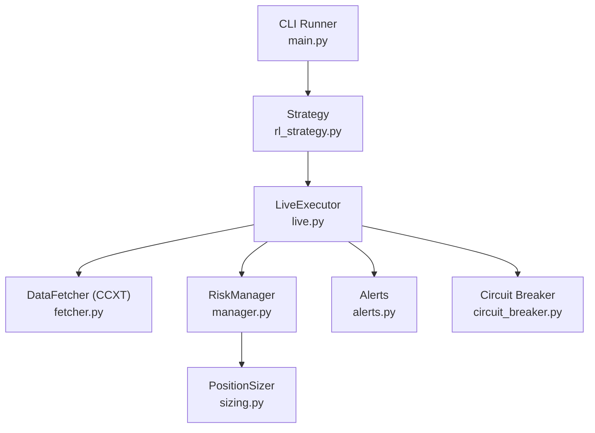
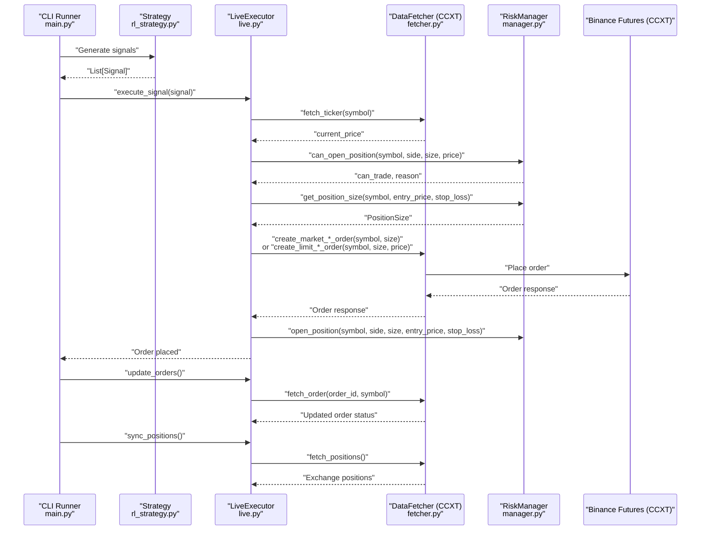
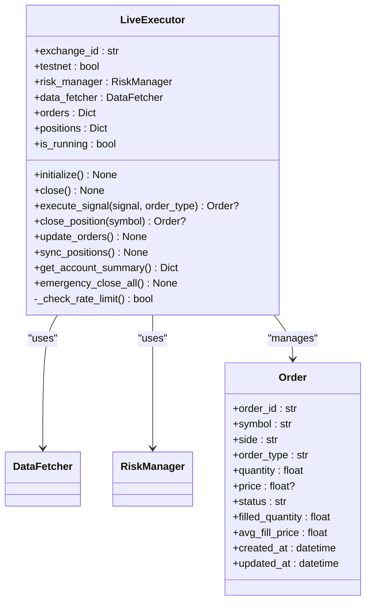
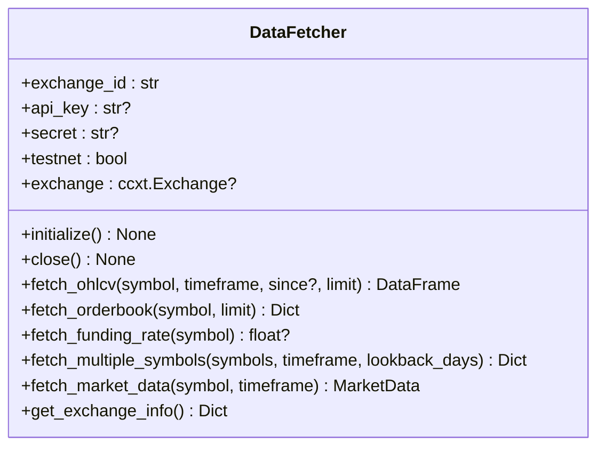
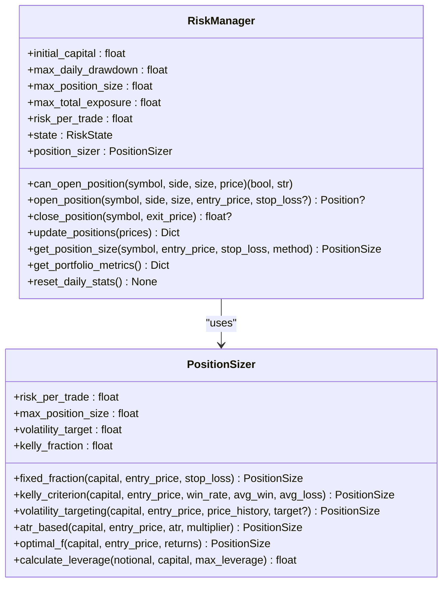
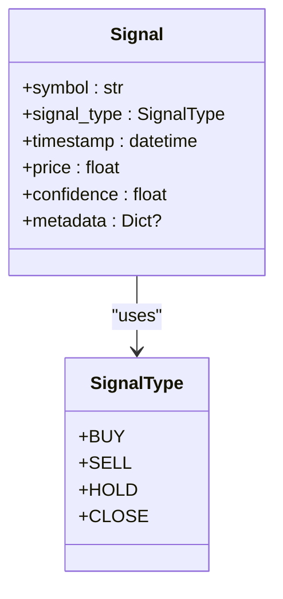
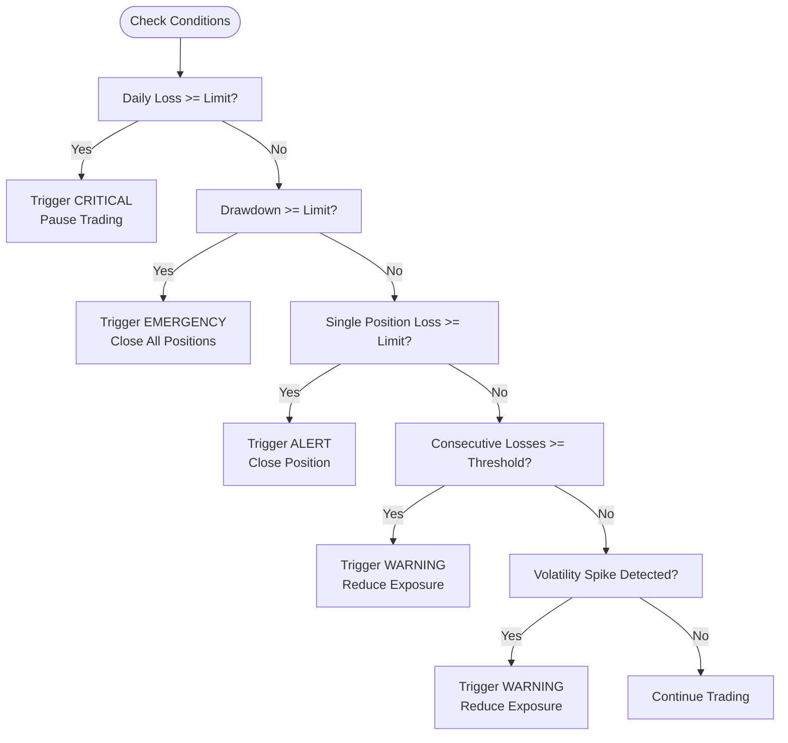
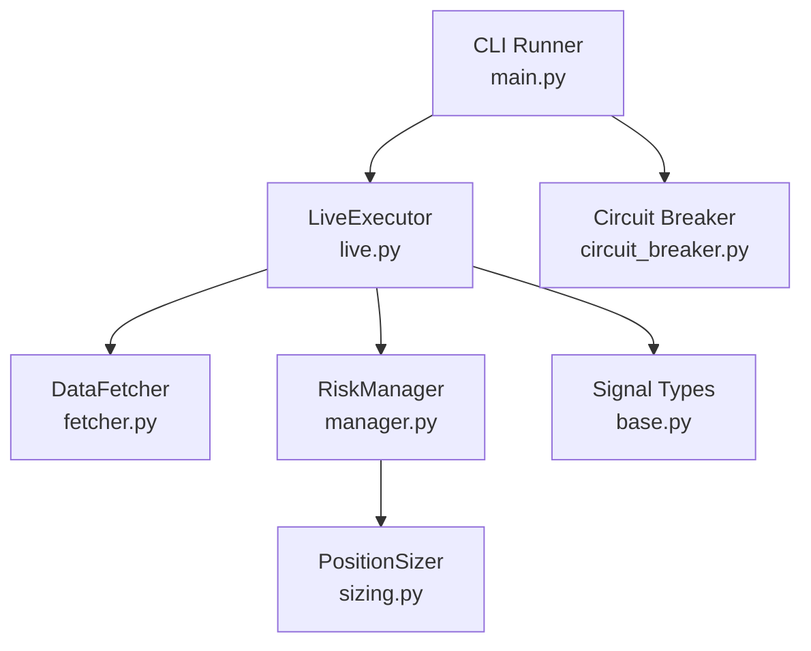

# Live Trading

<cite>
**Referenced Files in This Document**
- [live.py](file://trading_bot/execution/live.py)
- [settings.py](file://trading_bot/config/settings.py)
- [manager.py](file://trading_bot/risk/manager.py)
- [sizing.py](file://trading_bot/risk/sizing.py)
- [main.py](file://trading_bot/main.py)
- [fetcher.py](file://trading_bot/data/fetcher.py)
- [base.py](file://trading_bot/strategy/base.py)
- [circuit_breaker.py](file://trading_bot/risk/circuit_breaker.py)
- [paper.py](file://trading_bot/execution/paper.py)
</cite>

## Table of Contents
1. [Introduction](#introduction)
2. [Project Structure](#project-structure)
3. [Core Components](#core-components)
4. [Architecture Overview](#architecture-overview)
5. [Detailed Component Analysis](#detailed-component-analysis)
6. [Dependency Analysis](#dependency-analysis)
7. [Performance Considerations](#performance-considerations)
8. [Troubleshooting Guide](#troubleshooting-guide)
9. [Conclusion](#conclusion)
10. [Appendices](#appendices)

## Introduction
This document explains the live trading implementation of the AI Trading Bot, focusing on the LiveExecutor class, real exchange integration with Binance Futures (via CCXT), and the end-to-end order execution workflow. It covers risk management integration, position sizing, order routing, exchange connection setup and authentication, API rate limiting, order types (market/limit), slippage handling, fee structures, real-time market data integration, order status updates, and position synchronization with the exchange. Practical examples demonstrate configuration, order placement, position management, and emergency procedures.

## Project Structure
The live trading pipeline spans several modules:
- Execution: LiveExecutor orchestrates order placement and lifecycle management.
- Data: DataFetcher integrates with CCXT for real-time market data and exchange APIs.
- Risk: RiskManager enforces portfolio-level risk controls; PositionSizer computes position sizes.
- Strategy: BaseStrategy defines the signal interface consumed by LiveExecutor.
- CLI: main.py coordinates live runs, initializes components, and manages alerts and circuit breakers.

**Diagram sources**
- [main.py:214-325](file://trading_bot/main.py#L214-L325)
- [live.py:38-364](file://trading_bot/execution/live.py#L38-L364)
- [fetcher.py:32-331](file://trading_bot/data/fetcher.py#L32-L331)
- [manager.py:58-432](file://trading_bot/risk/manager.py#L58-L432)
- [sizing.py:25-312](file://trading_bot/risk/sizing.py#L25-L312)
- [circuit_breaker.py:32-336](file://trading_bot/risk/circuit_breaker.py#L32-L336)

**Section sources**
- [main.py:214-325](file://trading_bot/main.py#L214-L325)
- [live.py:38-364](file://trading_bot/execution/live.py#L38-L364)
- [fetcher.py:32-331](file://trading_bot/data/fetcher.py#L32-L331)
- [manager.py:58-432](file://trading_bot/risk/manager.py#L58-L432)
- [sizing.py:25-312](file://trading_bot/risk/sizing.py#L25-L312)
- [circuit_breaker.py:32-336](file://trading_bot/risk/circuit_breaker.py#L32-L336)

## Core Components
- LiveExecutor: Initializes exchange connection, executes signals, places orders, updates order statuses, synchronizes positions, and supports emergency closure.
- DataFetcher: Async CCXT client for Binance Futures (with sandbox support), providing OHLCV, orderbook, and funding rate data.
- RiskManager: Enforces portfolio-level risk checks, opens/closes positions, tracks PnL, and applies circuit breakers.
- PositionSizer: Computes position sizes using fixed fraction, ATR-based, volatility targeting, and other methods.
- BaseStrategy: Defines Signal and SignalType used by LiveExecutor to decide actions.
- CLI Runner: Initializes components, runs the loop, and handles alerts and circuit breaker checks.

**Section sources**
- [live.py:38-364](file://trading_bot/execution/live.py#L38-L364)
- [fetcher.py:32-331](file://trading_bot/data/fetcher.py#L32-L331)
- [manager.py:58-432](file://trading_bot/risk/manager.py#L58-L432)
- [sizing.py:25-312](file://trading_bot/risk/sizing.py#L25-L312)
- [base.py:16-37](file://trading_bot/strategy/base.py#L16-L37)
- [main.py:214-325](file://trading_bot/main.py#L214-L325)

## Architecture Overview
The live trading pipeline integrates the strategy’s signals with the exchange via LiveExecutor and DataFetcher. RiskManager validates and executes trades, while PositionSizer determines position size. The system periodically updates order statuses and synchronizes positions with the exchange.

**Diagram sources**
- [main.py:282-316](file://trading_bot/main.py#L282-L316)
- [live.py:115-224](file://trading_bot/execution/live.py#L115-L224)
- [live.py:298-341](file://trading_bot/execution/live.py#L298-L341)
- [fetcher.py:106-164](file://trading_bot/data/fetcher.py#L106-L164)
- [manager.py:102-201](file://trading_bot/risk/manager.py#L102-L201)
- [manager.py:323-354](file://trading_bot/risk/manager.py#L323-L354)

## Detailed Component Analysis

### LiveExecutor
LiveExecutor is the central orchestrator for live trading. It:
- Initializes DataFetcher with Binance credentials and testnet settings.
- Executes signals by validating risk, calculating position size, placing orders, and updating internal state.
- Manages order lifecycle: status updates and position synchronization.
- Supports emergency closure of all positions.

Key behaviors:
- Exchange initialization and teardown.
- Rate limiting enforcement (orders per minute).
- Signal handling for buy/sell/close.
- Order placement for market and limit orders.
- Risk integration for position opening and closing.
- Order status polling and position sync.

**Diagram sources**
- [live.py:38-364](file://trading_bot/execution/live.py#L38-L364)

**Section sources**
- [live.py:38-364](file://trading_bot/execution/live.py#L38-L364)

### DataFetcher (CCXT Integration)
DataFetcher wraps CCXT for Binance Futures:
- Initializes exchange with API keys and testnet mode.
- Provides OHLCV, orderbook, and funding rate retrieval with exponential backoff retries.
- Applies a concurrency limiter to prevent throttling.
- Supports sandbox mode for Binance Futures testnet.

**Diagram sources**
- [fetcher.py:32-331](file://trading_bot/data/fetcher.py#L32-L331)

**Section sources**
- [fetcher.py:32-331](file://trading_bot/data/fetcher.py#L32-L331)

### RiskManager and PositionSizer
RiskManager enforces portfolio-level risk:
- Validates whether a new position can be opened based on daily drawdown, position size, total exposure, and correlation constraints.
- Opens and closes positions, updates PnL, and tracks daily statistics.
- Integrates with PositionSizer to compute position sizes using fixed fraction, ATR-based, and volatility targeting approaches.

**Diagram sources**
- [manager.py:58-432](file://trading_bot/risk/manager.py#L58-L432)
- [sizing.py:25-312](file://trading_bot/risk/sizing.py#L25-L312)

**Section sources**
- [manager.py:58-432](file://trading_bot/risk/manager.py#L58-L432)
- [sizing.py:25-312](file://trading_bot/risk/sizing.py#L25-L312)

### Strategy Signals
Signals drive LiveExecutor actions. The SignalType enum includes buy, sell, hold, and close. LiveExecutor interprets these signals to place orders or close positions.

**Diagram sources**
- [base.py:16-37](file://trading_bot/strategy/base.py#L16-L37)

**Section sources**
- [base.py:16-37](file://trading_bot/strategy/base.py#L16-L37)

### Circuit Breakers and Emergency Procedures
CircuitBreaker monitors portfolio health and triggers automatic actions on severe conditions. LiveExecutor exposes emergency_close_all to close all positions safely.

**Diagram sources**
- [circuit_breaker.py:88-184](file://trading_bot/risk/circuit_breaker.py#L88-L184)

**Section sources**
- [circuit_breaker.py:32-336](file://trading_bot/risk/circuit_breaker.py#L32-L336)
- [live.py:357-364](file://trading_bot/execution/live.py#L357-L364)

## Dependency Analysis
LiveExecutor depends on:
- DataFetcher for exchange connectivity and market data.
- RiskManager for risk checks and position management.
- PositionSizer for position sizing calculations.
- BaseStrategy Signal types for trade decisions.

**Diagram sources**
- [live.py:38-364](file://trading_bot/execution/live.py#L38-L364)
- [fetcher.py:32-331](file://trading_bot/data/fetcher.py#L32-L331)
- [manager.py:58-432](file://trading_bot/risk/manager.py#L58-L432)
- [sizing.py:25-312](file://trading_bot/risk/sizing.py#L25-L312)
- [base.py:16-37](file://trading_bot/strategy/base.py#L16-L37)
- [main.py:214-325](file://trading_bot/main.py#L214-L325)
- [circuit_breaker.py:32-336](file://trading_bot/risk/circuit_breaker.py#L32-L336)

**Section sources**
- [live.py:38-364](file://trading_bot/execution/live.py#L38-L364)
- [main.py:214-325](file://trading_bot/main.py#L214-L325)

## Performance Considerations
- Exchange rate limiting: LiveExecutor enforces a per-minute order cap; DataFetcher uses CCXT’s enableRateLimit and a semaphore to constrain concurrency.
- Retry/backoff: DataFetcher wraps network/exchange errors with exponential backoff to improve resilience.
- Asynchronous execution: All data and order operations are async to maximize throughput.
- Position sizing constraints: RiskManager caps position size and total exposure to reduce tail risk.

[No sources needed since this section provides general guidance]

## Troubleshooting Guide
Common issues and remedies:
- Exchange initialization failures: Verify API keys and testnet settings in environment variables; ensure Binance Futures sandbox is enabled when using testnet.
- Rate limiting: LiveExecutor’s per-minute cap and DataFetcher’s semaphore prevent throttling; monitor logs for warnings.
- Order placement errors: Check signal validity, risk checks, and exchange availability; confirm order type and price.
- Order status updates: If order status remains stale, verify exchange connectivity and retry logic.
- Position synchronization: If positions mismatch, re-run sync_positions and reconcile with RiskManager state.
- Emergency procedures: Use emergency_close_all to close all positions; ensure sufficient liquidity and avoid slippage spikes.

**Section sources**
- [live.py:95-113](file://trading_bot/execution/live.py#L95-L113)
- [fetcher.py:106-164](file://trading_bot/data/fetcher.py#L106-L164)
- [live.py:357-364](file://trading_bot/execution/live.py#L357-L364)

## Conclusion
The live trading system integrates a robust risk framework with real-time exchange connectivity to execute signals reliably. LiveExecutor coordinates order placement, status updates, and position synchronization, while RiskManager and PositionSizer enforce prudent position sizing and portfolio constraints. Circuit breakers and emergency procedures provide safety nets for adverse market conditions.

[No sources needed since this section summarizes without analyzing specific files]

## Appendices

### Live Trading Configuration
- Exchange credentials and testnet mode are configured via environment variables and Settings.
- Trading mode, symbols, timeframe, and risk parameters are defined in Settings.
- CLI run command selects live mode and initializes LiveExecutor with DataFetcher and RiskManager.

Practical steps:
- Set BINANCE_API_KEY, BINANCE_SECRET_KEY, BINANCE_TESTNET in environment.
- Configure TRADING_MODE, SYMBOLS, TIMEFRAME, INITIAL_CAPITAL, MAX_DAILY_DRAWDOWN, MAX_POSITION_SIZE, RISK_PER_TRADE.
- Run the CLI with run --mode live and a trained model path.

**Section sources**
- [settings.py:23-176](file://trading_bot/config/settings.py#L23-L176)
- [main.py:214-325](file://trading_bot/main.py#L214-L325)

### Order Types and Routing
- Market orders: Immediate execution at market price.
- Limit orders: Execution at specified price or better.
- Routing: LiveExecutor routes buy/sell orders to exchange via DataFetcher; order type is configurable per signal execution.

**Section sources**
- [live.py:115-224](file://trading_bot/execution/live.py#L115-L224)
- [fetcher.py:106-164](file://trading_bot/data/fetcher.py#L106-L164)

### Slippage and Fees
- Slippage: Not modeled in LiveExecutor; market execution may incur slippage depending on liquidity and spread.
- Fees: Not modeled in LiveExecutor; actual exchange fees apply upon order completion.

**Section sources**
- [live.py:115-224](file://trading_bot/execution/live.py#L115-L224)

### Real-Time Market Data Integration
- LiveExecutor fetches current prices via DataFetcher for order placement.
- DataFetcher supports OHLCV, orderbook, and funding rate retrieval with retry logic.

**Section sources**
- [live.py:138-144](file://trading_bot/execution/live.py#L138-L144)
- [fetcher.py:106-164](file://trading_bot/data/fetcher.py#L106-L164)

### Order Status Updates and Position Synchronization
- LiveExecutor polls order status and updates internal state.
- LiveExecutor synchronizes positions with exchange balances and updates RiskManager accordingly.

**Section sources**
- [live.py:298-341](file://trading_bot/execution/live.py#L298-L341)

### Position Management
- Opening positions: Risk checks, position sizing, order placement, and RiskManager update.
- Closing positions: Determined by signal type or stop loss/take profit triggers.
- Emergency closure: Closes all positions with rate limiting between closures.

**Section sources**
- [live.py:153-224](file://trading_bot/execution/live.py#L153-L224)
- [live.py:225-296](file://trading_bot/execution/live.py#L225-L296)
- [live.py:357-364](file://trading_bot/execution/live.py#L357-L364)

### Emergency Procedures
- Circuit breaker triggers: Automatic pause trading, close positions, reduce exposure.
- Emergency stop: Can be integrated to halt trading and close positions.
- Manual emergency close: LiveExecutor’s emergency_close_all method.

**Section sources**
- [circuit_breaker.py:88-184](file://trading_bot/risk/circuit_breaker.py#L88-L184)
- [live.py:357-364](file://trading_bot/execution/live.py#L357-L364)