# Order Management

<cite>
**Referenced Files in This Document**
- [README.md](file://README.md)
- [main.py](file://trading_bot/main.py)
- [live.py](file://trading_bot/execution/live.py)
- [paper.py](file://trading_bot/execution/paper.py)
- [manager.py](file://trading_bot/risk/manager.py)
- [base.py](file://trading_bot/strategy/base.py)
- [fetcher.py](file://trading_bot/data/fetcher.py)
- [engine.py](file://trading_bot/backtest/engine.py)
- [settings.py](file://trading_bot/config/settings.py)
</cite>

## Table of Contents
1. [Introduction](#introduction)
2. [Project Structure](#project-structure)
3. [Core Components](#core-components)
4. [Architecture Overview](#architecture-overview)
5. [Detailed Component Analysis](#detailed-component-analysis)
6. [Dependency Analysis](#dependency-analysis)
7. [Performance Considerations](#performance-considerations)
8. [Troubleshooting Guide](#troubleshooting-guide)
9. [Conclusion](#conclusion)
10. [Appendices](#appendices)

## Introduction
This document provides comprehensive order management documentation for both paper and live trading modes. It covers the Order dataclass structure, order lifecycle management, state tracking, creation/modification/cancellation/completion processes, order types (market and limit), validation and routing logic, status updates, fill reporting, partial order handling, practical workflows, order book integration, execution monitoring, persistence/history tracking, and error handling across both modes.

## Project Structure
The order management system spans several modules:
- Execution: Live and paper trading executors
- Risk: Position sizing and risk controls
- Strategy: Signal generation and lifecycle
- Data: Exchange connectivity and market data
- Backtest: Historical simulation and reporting
- Config: Settings and environment

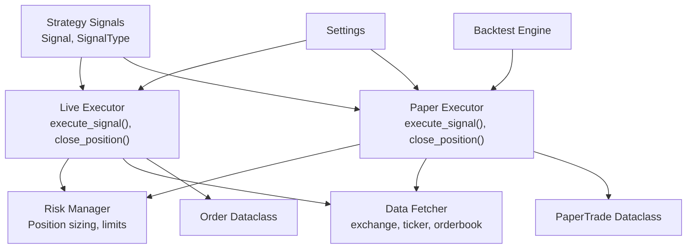

**Diagram sources**
- [main.py:214-325](file://trading_bot/main.py#L214-L325)
- [live.py:16-364](file://trading_bot/execution/live.py#L16-L364)
- [paper.py:17-392](file://trading_bot/execution/paper.py#L17-L392)
- [manager.py:58-432](file://trading_bot/risk/manager.py#L58-L432)
- [base.py:16-136](file://trading_bot/strategy/base.py#L16-L136)
- [fetcher.py:32-331](file://trading_bot/data/fetcher.py#L32-L331)
- [engine.py:41-418](file://trading_bot/backtest/engine.py#L41-L418)
- [settings.py:23-176](file://trading_bot/config/settings.py#L23-L176)

**Section sources**
- [README.md:198-232](file://README.md#L198-L232)
- [main.py:214-325](file://trading_bot/main.py#L214-L325)

## Core Components
- Order dataclass (live mode): Captures order identity, side, type, quantity, price, status, fills, timestamps, and computed fields.
- PaperTrade dataclass (paper mode): Captures trade lifecycle, entry/exit, PnL, slippage, commission, and metadata.
- LiveExecutor: Places market/limit orders, updates statuses, manages risk, and exposes account summary.
- PaperTradingExecutor: Simulates trades with slippage and commission, tracks positions, and computes performance metrics.
- RiskManager: Enforces position sizing, exposure, drawdown, and correlation constraints; manages open positions and trade history.
- Signal and SignalType: Define trading signals (buy, sell, close, hold) used to drive order placement.
- DataFetcher: Provides exchange connectivity, tickers, orderbook, and market data for both modes.

**Section sources**
- [live.py:16-364](file://trading_bot/execution/live.py#L16-L364)
- [paper.py:17-392](file://trading_bot/execution/paper.py#L17-L392)
- [manager.py:58-432](file://trading_bot/risk/manager.py#L58-L432)
- [base.py:16-136](file://trading_bot/strategy/base.py#L16-L136)
- [fetcher.py:32-331](file://trading_bot/data/fetcher.py#L32-L331)

## Architecture Overview
The order lifecycle is orchestrated by the Strategy, which generates signals consumed by either the LiveExecutor or PaperTradingExecutor. Both executors rely on RiskManager for position sizing and constraints, and on DataFetcher for exchange connectivity and market data. Live orders are persisted in-memory keyed by order_id; paper trades are tracked in-memory with performance metrics.

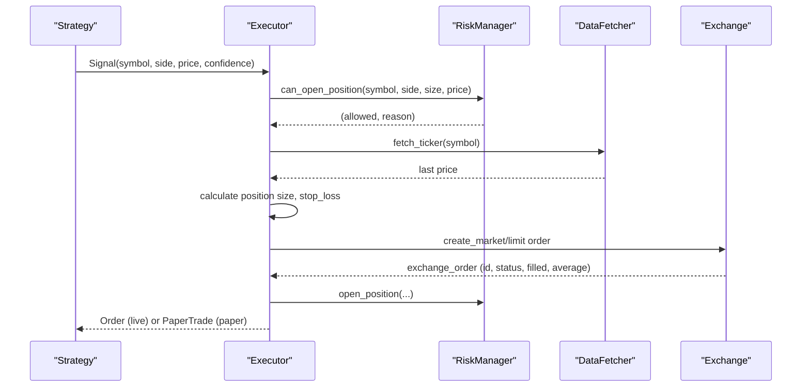

**Diagram sources**
- [main.py:299-313](file://trading_bot/main.py#L299-L313)
- [live.py:115-223](file://trading_bot/execution/live.py#L115-L223)
- [paper.py:115-208](file://trading_bot/execution/paper.py#L115-L208)
- [manager.py:102-201](file://trading_bot/risk/manager.py#L102-L201)
- [fetcher.py:139-144](file://trading_bot/data/fetcher.py#L139-L144)

## Detailed Component Analysis

### Order Dataclass (Live Mode)
- Purpose: Represents live orders with identity, side, type, quantity, price, status, fills, timestamps, and computed fields.
- Fields:
  - order_id: Unique identifier
  - symbol, side, order_type, quantity, price
  - status: pending/open/partial_filled/filled/canceled/rejected
  - filled_quantity, avg_fill_price
  - created_at, updated_at
- Lifecycle hooks:
  - __post_init__: Ensures timestamps are set on creation.

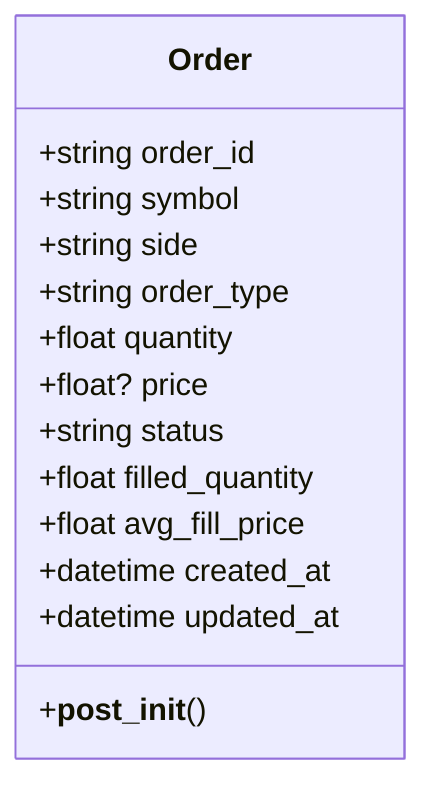

**Diagram sources**
- [live.py:16-36](file://trading_bot/execution/live.py#L16-L36)

**Section sources**
- [live.py:16-36](file://trading_bot/execution/live.py#L16-L36)

### PaperTrade Dataclass (Paper Mode)
- Purpose: Tracks paper trades with entry/exit, PnL, slippage, commission, and metadata.
- Fields:
  - trade_id, symbol, side, entry_price, exit_price, quantity, entry_time, exit_time, pnl, pnl_pct, commission, slippage, status, metadata
- Used by PaperTradingExecutor to compute performance metrics and track equity curves.

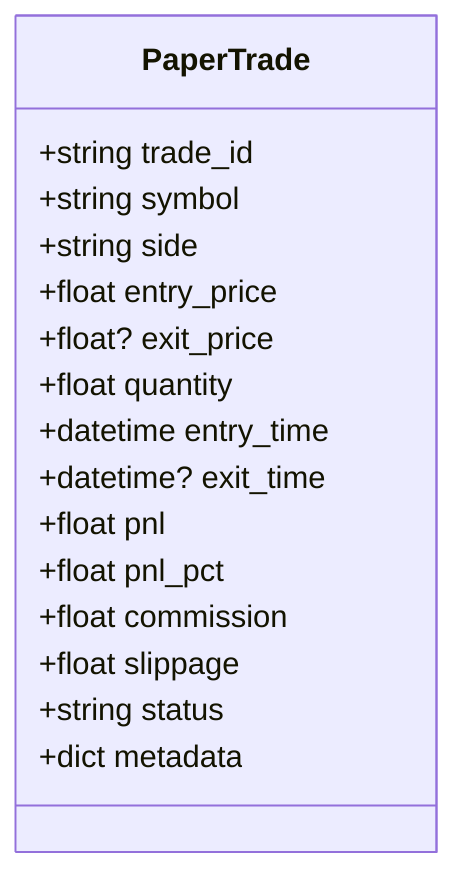

**Diagram sources**
- [paper.py:17-34](file://trading_bot/execution/paper.py#L17-L34)

**Section sources**
- [paper.py:17-34](file://trading_bot/execution/paper.py#L17-L34)

### LiveExecutor: Order Lifecycle and Routing
- Initialization:
  - Initializes DataFetcher with exchange credentials and testnet flag.
  - Sets running flag and internal rate limiter.
- Signal handling:
  - Validates executor readiness and rate limit.
  - Fetches current price via DataFetcher.
  - Handles CLOSE signals by invoking close_position.
  - Determines side from SignalType.
  - Enforces risk checks via RiskManager.can_open_position.
  - Calculates position size and stop-loss.
  - Creates Order with order_type and price (limit orders include price).
  - Places market or limit order via DataFetcher.exchange.
  - Updates order with exchange response (id, status, filled, average).
  - Opens position in RiskManager and logs.
- Closing positions:
  - Retrieves current price, determines close side, creates market order, updates order and RiskManager.
- Status updates:
  - Periodically fetches order status via DataFetcher.exchange.fetch_order and updates in-memory order.
- Position synchronization:
  - Syncs open positions from exchange and maintains local positions map.
- Account summary:
  - Aggregates risk metrics and counts of open orders and positions.

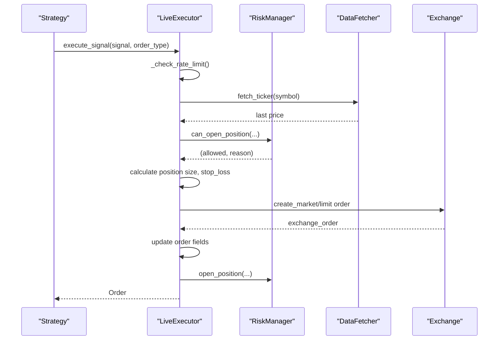

**Diagram sources**
- [live.py:68-93](file://trading_bot/execution/live.py#L68-L93)
- [live.py:115-223](file://trading_bot/execution/live.py#L115-L223)
- [live.py:225-296](file://trading_bot/execution/live.py#L225-L296)
- [live.py:298-317](file://trading_bot/execution/live.py#L298-L317)
- [live.py:318-341](file://trading_bot/execution/live.py#L318-L341)

**Section sources**
- [live.py:68-93](file://trading_bot/execution/live.py#L68-L93)
- [live.py:115-223](file://trading_bot/execution/live.py#L115-L223)
- [live.py:225-296](file://trading_bot/execution/live.py#L225-L296)
- [live.py:298-317](file://trading_bot/execution/live.py#L298-L317)
- [live.py:318-341](file://trading_bot/execution/live.py#L318-L341)

### PaperTradingExecutor: Simulation Lifecycle
- Initialization:
  - Configures capital, commission rate, slippage model, and enables slippage.
  - Initializes risk manager with capital and exposure limits.
- Signal handling:
  - Handles CLOSE signals by closing existing positions.
  - Determines side from SignalType and enforces position constraints.
  - Calculates position size via RiskManager.get_position_size.
  - Applies slippage to price and calculates commission.
  - Checks sufficient capital and creates PaperTrade.
  - Updates capital, tracks position, opens position in RiskManager.
- Closing positions:
  - Computes realized PnL, updates capital/equity, records trade, removes position.
- Position updates:
  - Iterates open positions, updates unrealized PnL, checks stop-loss/take-profit triggers.
- Performance metrics:
  - Computes total return, Sharpe ratio, max drawdown, win rate, profit factor, and equity curve statistics.

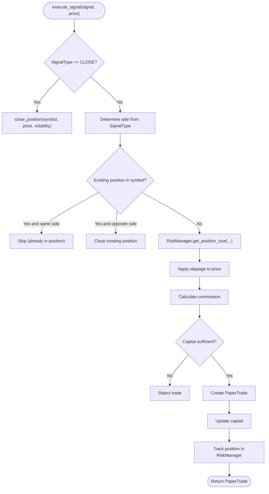

**Diagram sources**
- [paper.py:115-208](file://trading_bot/execution/paper.py#L115-L208)
- [paper.py:210-284](file://trading_bot/execution/paper.py#L210-L284)
- [paper.py:286-312](file://trading_bot/execution/paper.py#L286-L312)
- [paper.py:313-380](file://trading_bot/execution/paper.py#L313-L380)

**Section sources**
- [paper.py:115-208](file://trading_bot/execution/paper.py#L115-L208)
- [paper.py:210-284](file://trading_bot/execution/paper.py#L210-L284)
- [paper.py:286-312](file://trading_bot/execution/paper.py#L286-L312)
- [paper.py:313-380](file://trading_bot/execution/paper.py#L313-L380)

### RiskManager: Validation and Constraints
- Position sizing:
  - Uses PositionSizer to compute position size based on risk per trade and stop-loss distance.
- Risk checks:
  - Enforces daily drawdown, max trades per day, position size limits, total exposure, correlation constraints, and prevents duplicate positions in the same symbol.
- Position lifecycle:
  - open_position: Records new position, updates exposure and daily stats.
  - close_position: Calculates realized PnL, updates equity and drawdown, records trade history.
  - update_positions: Updates unrealized PnL and checks stop-loss/take-profit triggers.
- Portfolio metrics:
  - Provides current equity, peak equity, total return, daily PnL, drawdown, exposure, win rate, and volatility.

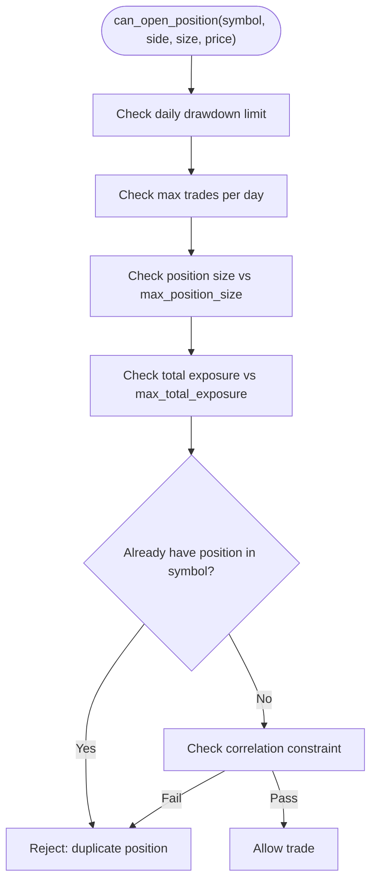

**Diagram sources**
- [manager.py:102-148](file://trading_bot/risk/manager.py#L102-L148)
- [manager.py:150-201](file://trading_bot/risk/manager.py#L150-L201)
- [manager.py:203-261](file://trading_bot/risk/manager.py#L203-L261)
- [manager.py:263-297](file://trading_bot/risk/manager.py#L263-L297)

**Section sources**
- [manager.py:102-148](file://trading_bot/risk/manager.py#L102-L148)
- [manager.py:150-201](file://trading_bot/risk/manager.py#L150-L201)
- [manager.py:203-261](file://trading_bot/risk/manager.py#L203-L261)
- [manager.py:263-297](file://trading_bot/risk/manager.py#L263-L297)

### Signal and Strategy Integration
- SignalType enumerates buy, sell, hold, and close actions.
- Signal carries symbol, side, timestamp, price, confidence, and optional metadata.
- Strategy generates signals; main loop executes them via the selected executor.

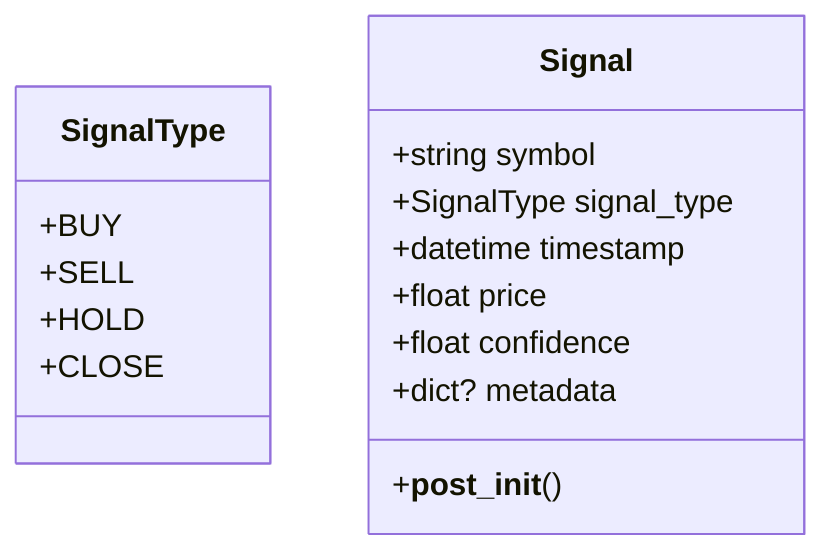

**Diagram sources**
- [base.py:16-37](file://trading_bot/strategy/base.py#L16-L37)

**Section sources**
- [base.py:16-37](file://trading_bot/strategy/base.py#L16-L37)
- [main.py:299-313](file://trading_bot/main.py#L299-L313)

### Order Book Integration and Market Data
- DataFetcher provides:
  - fetch_ohlcv, fetch_orderbook, fetch_funding_rate, fetch_multiple_symbols, fetch_market_data.
  - Calculates orderbook imbalance, spread, and mid-price.
- LiveExecutor uses DataFetcher for ticker and orderbook; PaperTradingExecutor uses price inputs from signals.

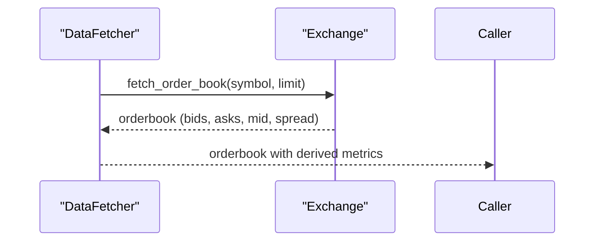

**Diagram sources**
- [fetcher.py:166-210](file://trading_bot/data/fetcher.py#L166-L210)

**Section sources**
- [fetcher.py:166-210](file://trading_bot/data/fetcher.py#L166-L210)
- [fetcher.py:277-312](file://trading_bot/data/fetcher.py#L277-L312)

### Backtesting and Historical Reporting
- BacktestEngine runs vectorbt-style and RL-based backtests with slippage and commission.
- Generates comprehensive metrics including total return, Sharpe ratio, max drawdown, win rate, profit factor, and equity curves.
- Supports walk-forward and Monte Carlo simulations.

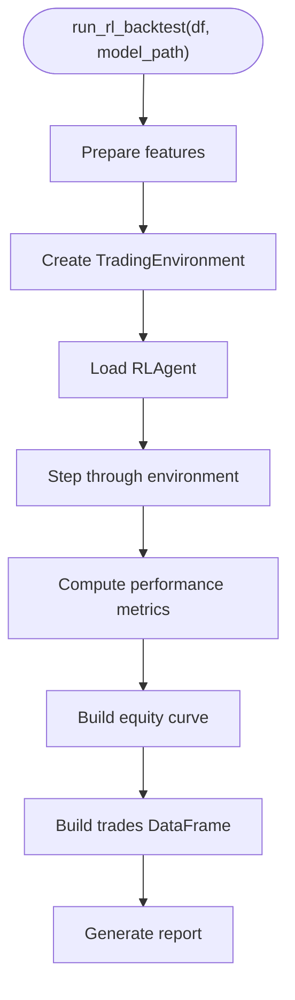

**Diagram sources**
- [engine.py:147-240](file://trading_bot/backtest/engine.py#L147-L240)
- [engine.py:358-417](file://trading_bot/backtest/engine.py#L358-L417)

**Section sources**
- [engine.py:147-240](file://trading_bot/backtest/engine.py#L147-L240)
- [engine.py:358-417](file://trading_bot/backtest/engine.py#L358-L417)

## Dependency Analysis
- LiveExecutor depends on:
  - RiskManager for position sizing and constraints
  - DataFetcher for exchange connectivity and market data
  - Signal and SignalType for order direction
- PaperTradingExecutor depends on:
  - RiskManager for position sizing and constraints
  - Signal price inputs for trade simulation
- BacktestEngine depends on:
  - PaperTradingExecutor for paper simulation
  - Feature engineering and RL agent for RL backtests

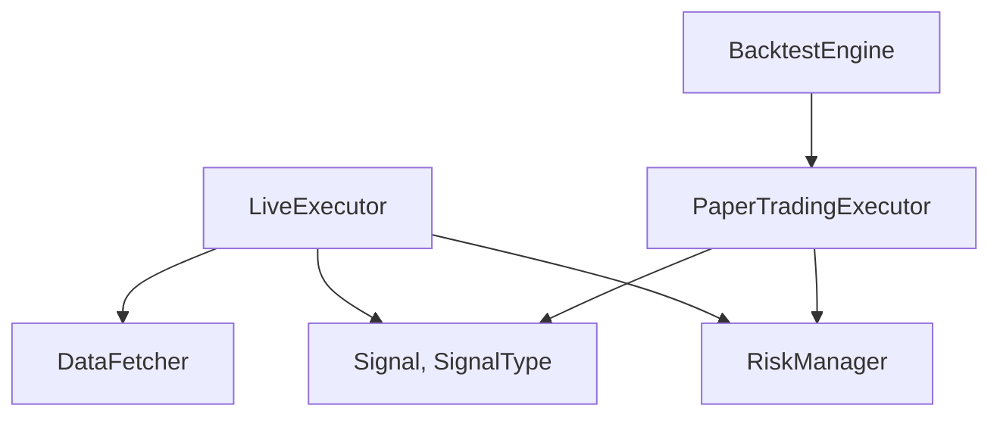

**Diagram sources**
- [live.py:38-67](file://trading_bot/execution/live.py#L38-L67)
- [paper.py:36-74](file://trading_bot/execution/paper.py#L36-L74)
- [engine.py:41-62](file://trading_bot/backtest/engine.py#L41-L62)

**Section sources**
- [live.py:38-67](file://trading_bot/execution/live.py#L38-L67)
- [paper.py:36-74](file://trading_bot/execution/paper.py#L36-L74)
- [engine.py:41-62](file://trading_bot/backtest/engine.py#L41-L62)

## Performance Considerations
- LiveExecutor:
  - Rate limiting: Enforced via internal counters and window resets to prevent exchange throttling.
  - Asynchronous order updates: Periodic polling of order status to minimize latency.
  - Exchange retries: DataFetcher wraps network calls with exponential backoff.
- PaperTradingExecutor:
  - Slippage and commission modeling: Adds realism to PnL calculations.
  - Equity curve computation: Enables quick performance insights.
- RiskManager:
  - Efficient position updates and checks for stop-loss/take-profit triggers.

[No sources needed since this section provides general guidance]

## Troubleshooting Guide
- LiveExecutor initialization failures:
  - Verify exchange credentials and testnet settings; ensure DataFetcher initializes successfully.
- Order placement failures:
  - Check rate limit exceeded warnings; confirm risk checks pass; inspect exchange responses for errors.
- Order status updates:
  - Ensure update_orders loop runs periodically; handle exceptions during fetch_order calls.
- Paper trade capital issues:
  - Confirm sufficient capital after commission; review slippage impact.
- Risk limits:
  - Review daily drawdown, position size, and exposure constraints; adjust settings accordingly.

**Section sources**
- [live.py:68-93](file://trading_bot/execution/live.py#L68-L93)
- [live.py:133-134](file://trading_bot/execution/live.py#L133-L134)
- [live.py:158-160](file://trading_bot/execution/live.py#L158-L160)
- [live.py:305-316](file://trading_bot/execution/live.py#L305-L316)
- [paper.py:165-167](file://trading_bot/execution/paper.py#L165-L167)

## Conclusion
The order management system integrates a robust risk framework with flexible execution engines for both paper and live trading. Orders are modeled consistently across modes, with clear lifecycle stages and state transitions. Risk controls enforce prudent position sizing and exposure limits, while DataFetcher ensures reliable market data access. The system supports realistic simulation, performance metrics, and comprehensive backtesting, enabling safe and informed trading decisions.

[No sources needed since this section summarizes without analyzing specific files]

## Appendices

### Practical Workflows

- Paper trading order placement:
  - Strategy generates Signal with symbol, side, price, confidence.
  - PaperTradingExecutor.execute_signal validates capital, applies slippage/commission, opens position, and returns PaperTrade.
  - Positions updated periodically; stop-loss/take-profit triggers close positions.

- Live trading order placement:
  - Strategy generates Signal.
  - LiveExecutor.execute_signal checks rate limit, fetches ticker, validates risk, places market/limit order, updates order and RiskManager, and returns Order.

- Order status updates:
  - LiveExecutor.update_orders polls exchange for order status and updates in-memory order fields.

- Order book integration:
  - DataFetcher.fetch_orderbook computes imbalance, spread, and mid-price for market insights.

- Execution monitoring:
  - LiveExecutor.get_account_summary aggregates risk metrics and open orders/positions.
  - PaperTradingExecutor.get_performance_metrics computes equity curve and trade statistics.

**Section sources**
- [paper.py:115-208](file://trading_bot/execution/paper.py#L115-L208)
- [paper.py:286-312](file://trading_bot/execution/paper.py#L286-L312)
- [live.py:115-223](file://trading_bot/execution/live.py#L115-L223)
- [live.py:298-317](file://trading_bot/execution/live.py#L298-L317)
- [fetcher.py:166-210](file://trading_bot/data/fetcher.py#L166-L210)
- [live.py:342-355](file://trading_bot/execution/live.py#L342-L355)
- [paper.py:313-380](file://trading_bot/execution/paper.py#L313-L380)

### Order Types and Validation Summary
- Order types:
  - Market: Immediate execution at market price.
  - Limit: Execution at specified price or better.
- Validation:
  - RiskManager enforces position size, exposure, daily drawdown, and correlation constraints.
  - LiveExecutor rate limits order placement and validates exchange responses.
  - PaperTradingExecutor validates capital availability and applies slippage/commission.

**Section sources**
- [live.py:179-191](file://trading_bot/execution/live.py#L179-L191)
- [manager.py:102-148](file://trading_bot/risk/manager.py#L102-L148)
- [paper.py:165-167](file://trading_bot/execution/paper.py#L165-L167)

### Persistence and History Tracking
- Live mode:
  - Orders stored in-memory dict keyed by order_id; no external persistence implemented.
- Paper mode:
  - Trades tracked in-memory; performance metrics computed from trade history.
- Backtesting:
  - Historical simulations and reports generated via BacktestEngine.

**Section sources**
- [live.py:59](file://trading_bot/execution/live.py#L59)
- [paper.py:65-68](file://trading_bot/execution/paper.py#L65-L68)
- [engine.py:358-417](file://trading_bot/backtest/engine.py#L358-L417)

### Configuration References
- Settings define trading mode, symbols, timeframe, initial capital, risk parameters, and exchange credentials used by executors and main loop.

**Section sources**
- [settings.py:23-176](file://trading_bot/config/settings.py#L23-L176)
- [main.py:244-252](file://trading_bot/main.py#L244-L252)