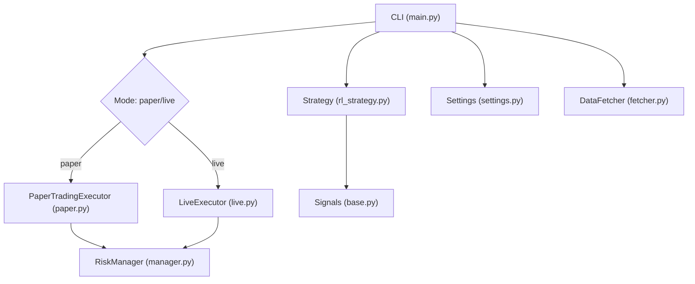
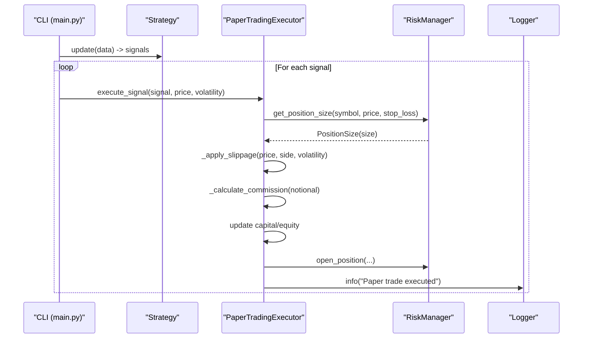
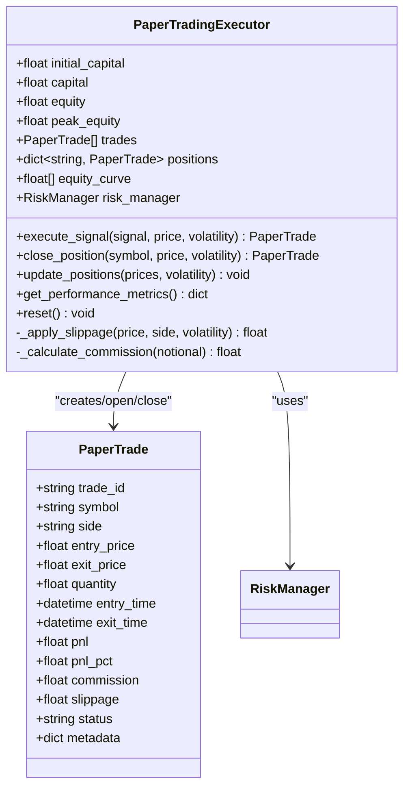
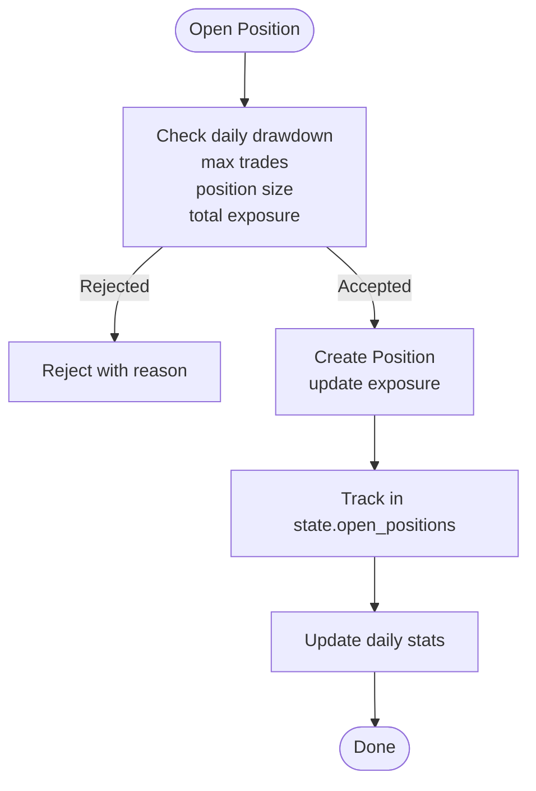
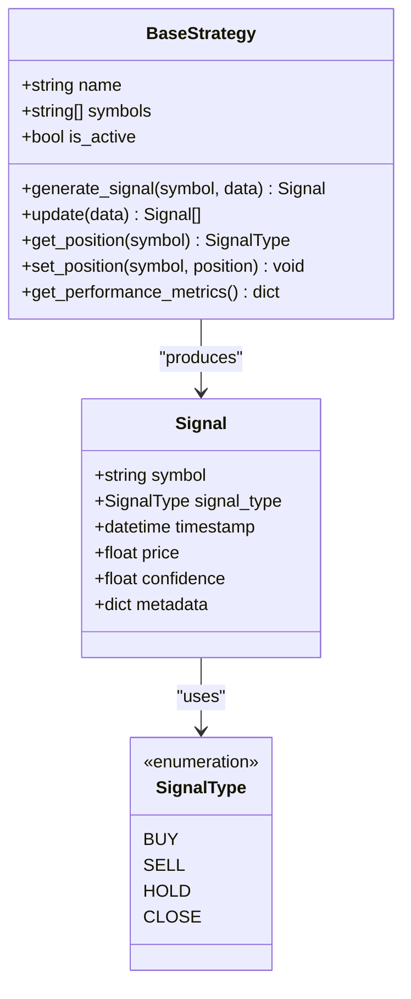
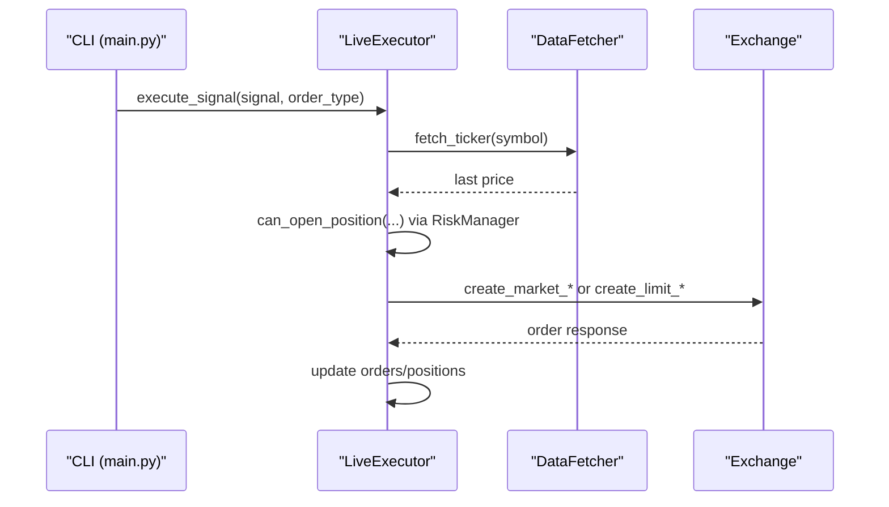
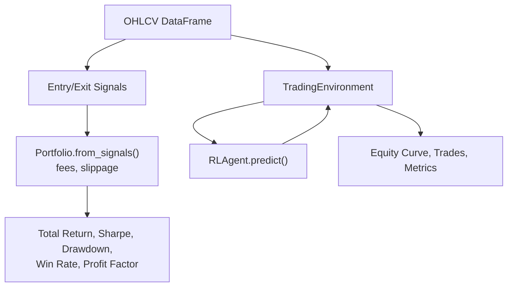
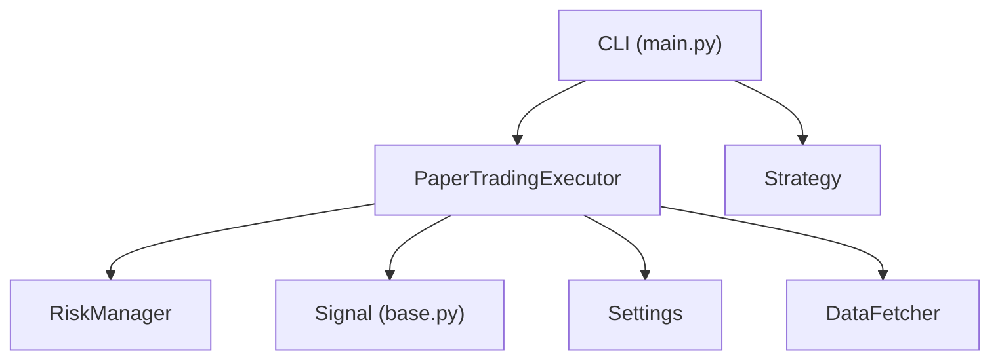

# Paper Trading

<cite>
**Referenced Files in This Document**
- [paper.py](file://trading_bot/execution/paper.py)
- [live.py](file://trading_bot/execution/live.py)
- [engine.py](file://trading_bot/backtest/engine.py)
- [main.py](file://trading_bot/main.py)
- [manager.py](file://trading_bot/risk/manager.py)
- [base.py](file://trading_bot/strategy/base.py)
- [settings.py](file://trading_bot/config/settings.py)
- [fetcher.py](file://trading_bot/data/fetcher.py)
- [README.md](file://README.md)
</cite>

## Table of Contents
1. [Introduction](#introduction)
2. [Project Structure](#project-structure)
3. [Core Components](#core-components)
4. [Architecture Overview](#architecture-overview)
5. [Detailed Component Analysis](#detailed-component-analysis)
6. [Dependency Analysis](#dependency-analysis)
7. [Performance Considerations](#performance-considerations)
8. [Troubleshooting Guide](#troubleshooting-guide)
9. [Conclusion](#conclusion)
10. [Appendices](#appendices)

## Introduction
This document explains the paper trading subsystem of the AI Trading Bot. It focuses on the paper trading executor that simulates trading without touching real funds, virtual account management, and simulated order execution. It also contrasts paper trading with live trading, covering virtual funds, position tracking, and performance simulation. Practical examples show how to set up paper trading mode, execute signals virtually, and analyze performance metrics. Finally, it documents the virtual exchange environment, order book simulation, and market impact modeling used in paper trading scenarios.

## Project Structure
Paper trading is implemented in the execution module and integrates with risk management, strategy signaling, and configuration. The CLI orchestrates paper vs live modes and delegates signal execution to the appropriate executor.

**Diagram sources**
- [main.py:214-325](file://trading_bot/main.py#L214-L325)
- [paper.py:36-392](file://trading_bot/execution/paper.py#L36-L392)
- [live.py:38-364](file://trading_bot/execution/live.py#L38-L364)
- [manager.py:58-432](file://trading_bot/risk/manager.py#L58-L432)
- [base.py:24-136](file://trading_bot/strategy/base.py#L24-L136)
- [settings.py:23-176](file://trading_bot/config/settings.py#L23-L176)
- [fetcher.py:32-331](file://trading_bot/data/fetcher.py#L32-L331)

**Section sources**
- [README.md:198-231](file://README.md#L198-L231)
- [main.py:214-325](file://trading_bot/main.py#L214-L325)

## Core Components
- PaperTradingExecutor: Simulates trading with virtual funds, applies slippage and commission, tracks positions and trades, and computes performance metrics.
- RiskManager: Enforces portfolio-level risk controls and position sizing; used by both paper and live executors.
- Signal: Typed trading instruction produced by strategies (buy, sell, close, hold).
- Settings: Centralized configuration for trading mode, initial capital, and risk parameters.
- DataFetcher: Provides market data for signal generation and price feeds for paper execution.

Key responsibilities:
- Paper trading: virtual funds, slippage, commission, stop-loss checks, and performance metrics.
- Live trading: real exchange connectivity, order placement, order book updates, and position synchronization.

**Section sources**
- [paper.py:36-392](file://trading_bot/execution/paper.py#L36-L392)
- [manager.py:58-432](file://trading_bot/risk/manager.py#L58-L432)
- [base.py:16-37](file://trading_bot/strategy/base.py#L16-L37)
- [settings.py:23-176](file://trading_bot/config/settings.py#L23-L176)
- [fetcher.py:32-331](file://trading_bot/data/fetcher.py#L32-L331)

## Architecture Overview
Paper trading runs in isolation from real markets. The CLI selects paper mode, generates signals, and passes them to the paper executor. The executor calculates position sizes via the risk manager, applies slippage and commission, and updates virtual capital and equity.

**Diagram sources**
- [main.py:296-306](file://trading_bot/main.py#L296-L306)
- [paper.py:115-208](file://trading_bot/execution/paper.py#L115-L208)
- [manager.py:323-354](file://trading_bot/risk/manager.py#L323-L354)

## Detailed Component Analysis

### PaperTradingExecutor
The paper executor encapsulates virtual trading:
- Virtual account: maintains initial_capital, capital (available cash), equity (cash + unrealized PnL), and peak_equity.
- Position tracking: positions dict maps symbol to the currently open PaperTrade.
- Slippage and commission: configurable fixed or variable slippage; fixed commission rate.
- Execution logic: handles buy/sell/close signals; enforces position constraints; calculates PnL on close; updates equity curve.
- Performance metrics: total_return, sharpe_ratio, max_drawdown, win_rate, profit_factor, and more.

**Diagram sources**
- [paper.py:17-34](file://trading_bot/execution/paper.py#L17-L34)
- [paper.py:36-392](file://trading_bot/execution/paper.py#L36-L392)
- [manager.py:58-432](file://trading_bot/risk/manager.py#L58-L432)

**Section sources**
- [paper.py:36-392](file://trading_bot/execution/paper.py#L36-L392)

### RiskManager
The risk manager enforces position sizing and portfolio-level constraints:
- Position sizing: fixed_fraction method given current equity, entry price, and stop loss.
- Position lifecycle: open_position, close_position, update_positions with stop-loss/take-profit checks.
- Portfolio metrics: current equity, peak equity, daily drawdown, exposure, win rate, volatility.

**Diagram sources**
- [manager.py:102-148](file://trading_bot/risk/manager.py#L102-L148)
- [manager.py:150-201](file://trading_bot/risk/manager.py#L150-L201)

**Section sources**
- [manager.py:58-432](file://trading_bot/risk/manager.py#L58-L432)

### Signal and Strategy
Signals carry symbol, side, price, and confidence. Strategies produce signals; the CLI routes them to the executor.

**Diagram sources**
- [base.py:16-37](file://trading_bot/strategy/base.py#L16-L37)
- [base.py:39-136](file://trading_bot/strategy/base.py#L39-L136)

**Section sources**
- [base.py:16-37](file://trading_bot/strategy/base.py#L16-L37)
- [base.py:39-136](file://trading_bot/strategy/base.py#L39-L136)

### LiveExecutor (for contrast)
LiveExecutor connects to a real exchange, places orders, and synchronizes positions. It is not used in paper mode but helps clarify differences:
- Uses DataFetcher to fetch tickers and place market/limit orders.
- Applies rate limiting and risk checks before order placement.
- Updates order statuses and positions asynchronously.

**Diagram sources**
- [live.py:115-224](file://trading_bot/execution/live.py#L115-L224)
- [live.py:298-364](file://trading_bot/execution/live.py#L298-L364)

**Section sources**
- [live.py:38-364](file://trading_bot/execution/live.py#L38-L364)

### Backtest Engine (vectorbt and RL)
The backtest engine demonstrates how paper-like simulation is performed:
- vectorbt backtest: constructs a portfolio from entry/exits, applies fees/slippage, and computes metrics.
- RL backtest: runs an RL agent in a custom environment and collects equity curves and trades.

**Diagram sources**
- [engine.py:63-145](file://trading_bot/backtest/engine.py#L63-L145)
- [engine.py:147-240](file://trading_bot/backtest/engine.py#L147-L240)

**Section sources**
- [engine.py:41-418](file://trading_bot/backtest/engine.py#L41-L418)

## Dependency Analysis
Paper trading depends on:
- RiskManager for position sizing and risk checks.
- Signal types for trade direction and close actions.
- Settings for initial capital and risk parameters.
- DataFetcher for price feeds during signal generation and execution.

**Diagram sources**
- [paper.py:36-392](file://trading_bot/execution/paper.py#L36-L392)
- [manager.py:58-432](file://trading_bot/risk/manager.py#L58-L432)
- [base.py:16-37](file://trading_bot/strategy/base.py#L16-L37)
- [settings.py:23-176](file://trading_bot/config/settings.py#L23-L176)
- [fetcher.py:32-331](file://trading_bot/data/fetcher.py#L32-L331)
- [main.py:214-325](file://trading_bot/main.py#L214-L325)

**Section sources**
- [paper.py:36-392](file://trading_bot/execution/paper.py#L36-L392)
- [manager.py:58-432](file://trading_bot/risk/manager.py#L58-L432)
- [base.py:16-37](file://trading_bot/strategy/base.py#L16-L37)
- [settings.py:23-176](file://trading_bot/config/settings.py#L23-L176)
- [fetcher.py:32-331](file://trading_bot/data/fetcher.py#L32-L331)
- [main.py:214-325](file://trading_bot/main.py#L214-L325)

## Performance Considerations
- Slippage modeling: fixed or variable slippage based on volatility; impacts entry/exit prices and PnL.
- Commission modeling: proportional to notional; reduces available capital and per-trade profitability.
- Equity curve and drawdown: computed from realized PnL; peak equity tracked to compute drawdown.
- Sharpe ratio: simplified annualized Sharpe from equity curve returns; requires sufficient samples.
- Stop-loss enforcement: automatic closes when price hits predefined thresholds.

Practical tips:
- Tune slippage_pct and commission_rate to reflect realistic costs.
- Monitor max_drawdown and win_rate to assess strategy robustness.
- Use walk-forward and Monte Carlo analysis to stress-test performance.

**Section sources**
- [paper.py:76-114](file://trading_bot/execution/paper.py#L76-L114)
- [paper.py:313-380](file://trading_bot/execution/paper.py#L313-L380)
- [engine.py:297-356](file://trading_bot/backtest/engine.py#L297-L356)

## Troubleshooting Guide
Common issues and resolutions:
- Insufficient capital: The executor checks notional plus commission against available capital and logs warnings when insufficient.
- No position to close: Attempting to close a symbol with no open position returns None and logs a warning.
- Stop-loss triggered: Positions are automatically closed when price hits the configured stop-loss.
- Rate limiting (live mode): Not applicable to paper mode, but useful context when switching to live.

Operational checks:
- Verify initial_capital and risk parameters in settings.
- Confirm signals are generated and passed with correct price and confidence.
- Review logs for “Paper trade executed” and “Paper position closed” messages.

**Section sources**
- [paper.py:164-167](file://trading_bot/execution/paper.py#L164-L167)
- [paper.py:226-227](file://trading_bot/execution/paper.py#L226-L227)
- [paper.py:303-311](file://trading_bot/execution/paper.py#L303-L311)
- [live.py:95-113](file://trading_bot/execution/live.py#L95-L113)

## Conclusion
Paper trading provides a safe, realistic simulation of trading behavior with virtual funds, slippage, and commission. It enables rigorous testing of strategies, risk controls, and performance metrics before going live. The paper executor integrates tightly with the risk manager and signals, while the CLI offers a straightforward way to switch modes and monitor outcomes.

## Appendices

### Practical Examples

- Setting up paper trading mode:
  - Select mode via CLI: run with --mode paper.
  - Configure initial capital and risk parameters in settings.
  - Example command: run --mode paper --model ./models/PPO_YYYYMMDD.zip.

- Executing signals virtually:
  - Strategy produces signals; CLI iterates signals and calls PaperTradingExecutor.execute_signal with current price.
  - The executor calculates position size, applies slippage/commission, and updates virtual capital/equity.

- Analyzing performance metrics:
  - Use PaperTradingExecutor.get_performance_metrics for total_return, sharpe_ratio, max_drawdown, win_rate, profit_factor.
  - Alternatively, use the backtest engine to compare strategies with vectorbt or RL-based simulations.

- Virtual exchange environment and order book simulation:
  - Paper mode does not connect to a real exchange; prices come from DataFetcher for signal generation and execution.
  - Order book features (e.g., spread, imbalance) are available via DataFetcher and can inform volatility-driven slippage.

- Market impact modeling:
  - Slippage can be modeled as fixed or variable; variable slippage scales with volatility estimates to simulate adverse price movement during execution.

**Section sources**
- [main.py:214-325](file://trading_bot/main.py#L214-L325)
- [paper.py:115-208](file://trading_bot/execution/paper.py#L115-L208)
- [paper.py:313-380](file://trading_bot/execution/paper.py#L313-L380)
- [engine.py:63-145](file://trading_bot/backtest/engine.py#L63-L145)
- [fetcher.py:166-210](file://trading_bot/data/fetcher.py#L166-L210)