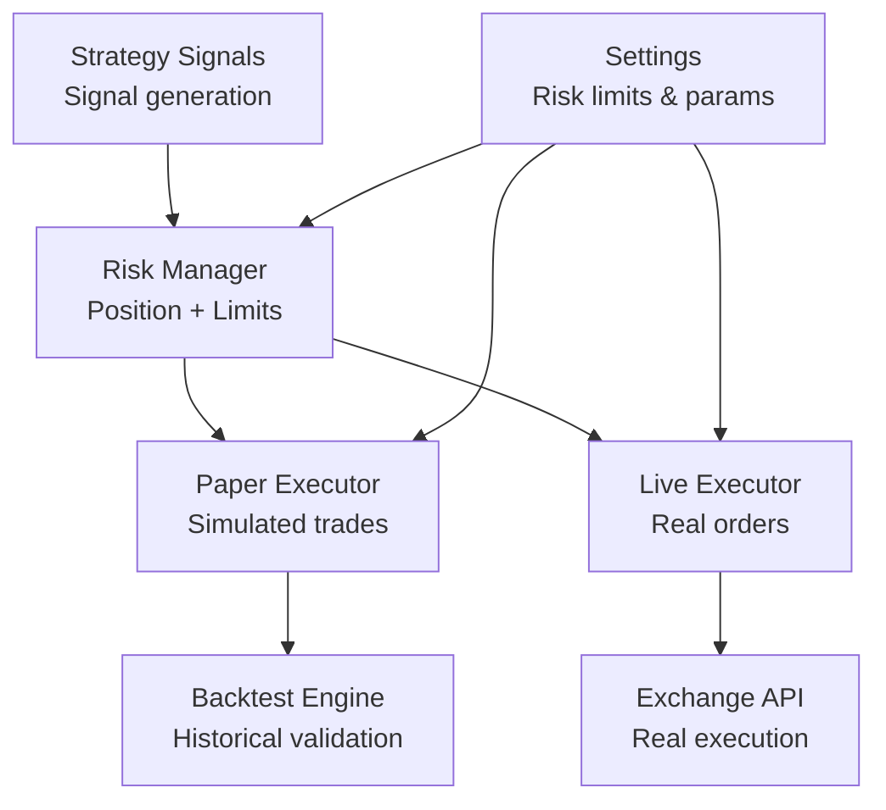
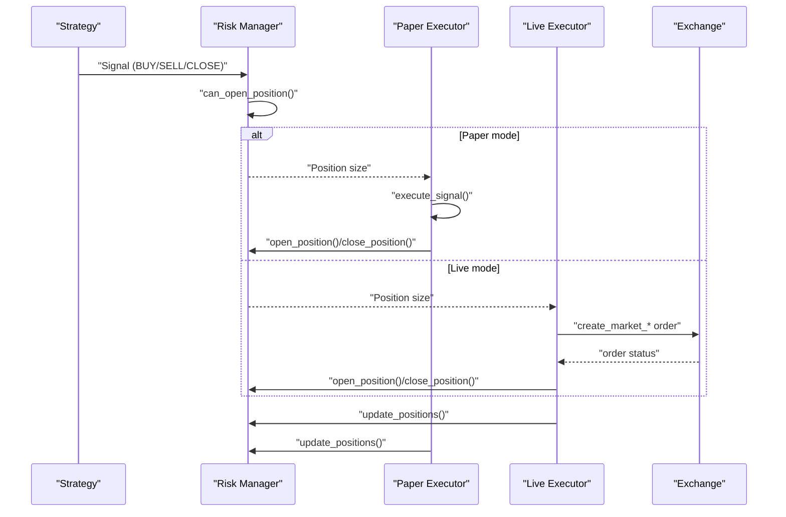
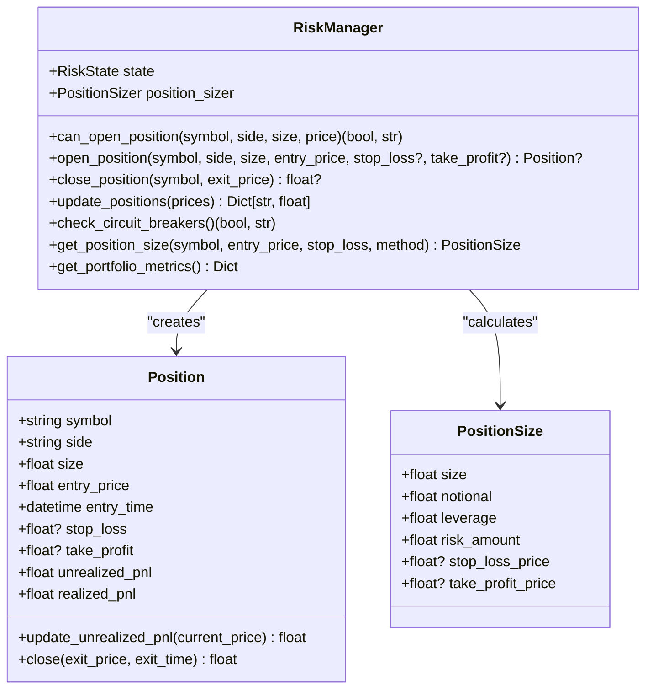
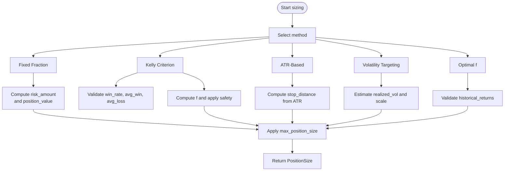
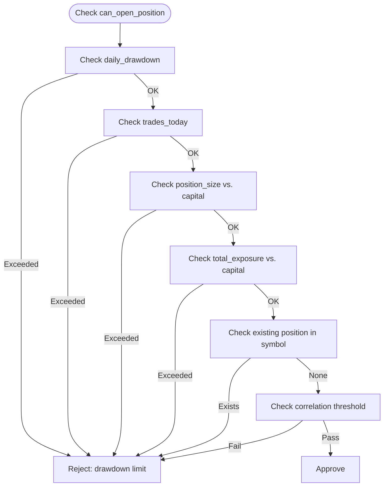
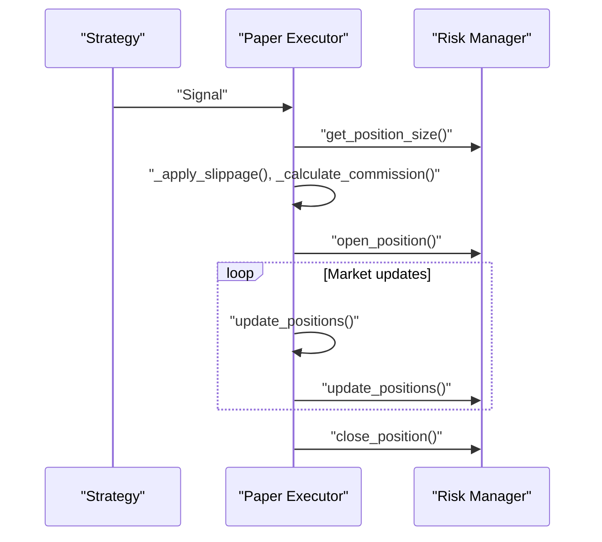
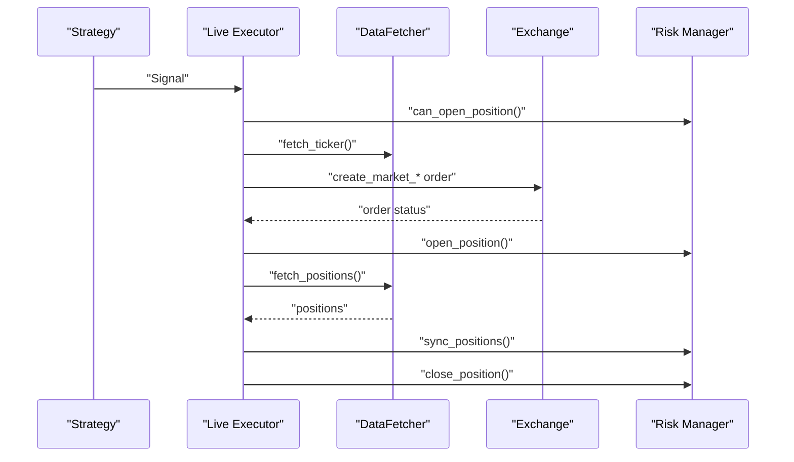
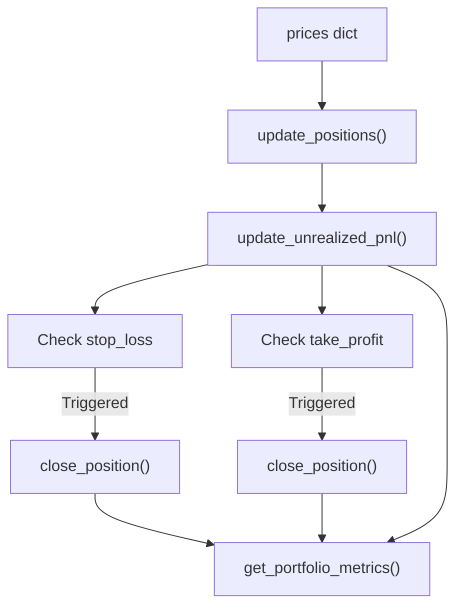
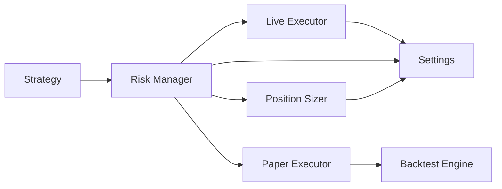

# Position Handling

<cite>
**Referenced Files in This Document**
- [manager.py](file://trading_bot/risk/manager.py)
- [sizing.py](file://trading_bot/risk/sizing.py)
- [paper.py](file://trading_bot/execution/paper.py)
- [live.py](file://trading_bot/execution/live.py)
- [engine.py](file://trading_bot/backtest/engine.py)
- [base.py](file://trading_bot/strategy/base.py)
- [settings.py](file://trading_bot/config/settings.py)
- [main.py](file://trading_bot/main.py)
- [circuit_breaker.py](file://trading_bot/risk/circuit_breaker.py)
</cite>

## Table of Contents
1. [Introduction](#introduction)
2. [Project Structure](#project-structure)
3. [Core Components](#core-components)
4. [Architecture Overview](#architecture-overview)
5. [Detailed Component Analysis](#detailed-component-analysis)
6. [Dependency Analysis](#dependency-analysis)
7. [Performance Considerations](#performance-considerations)
8. [Troubleshooting Guide](#troubleshooting-guide)
9. [Conclusion](#conclusion)
10. [Appendices](#appendices)

## Introduction
This document provides comprehensive position handling documentation for the AI Trading Bot. It covers position tracking, sizing calculations, lifecycle management, risk metrics, and state synchronization across paper and live trading modes. It also documents position management across multiple symbols and instruments, along with practical workflows for creation, modification, and closure.

## Project Structure
Position handling spans several modules:
- Risk management: position modeling, sizing, and portfolio-level controls
- Execution engines: paper and live trading with position lifecycle
- Strategy: generates signals that drive position decisions
- Backtesting: validates position workflows and risk controls
- Configuration: defines risk limits and operational parameters



**Diagram sources**
- [manager.py:16-98](file://trading_bot/risk/manager.py#L16-L98)
- [paper.py:36-75](file://trading_bot/execution/paper.py#L36-L75)
- [live.py:38-67](file://trading_bot/execution/live.py#L38-L67)
- [engine.py:41-62](file://trading_bot/backtest/engine.py#L41-L62)
- [settings.py:23-103](file://trading_bot/config/settings.py#L23-L103)

**Section sources**
- [manager.py:16-98](file://trading_bot/risk/manager.py#L16-L98)
- [paper.py:36-75](file://trading_bot/execution/paper.py#L36-L75)
- [live.py:38-67](file://trading_bot/execution/live.py#L38-L67)
- [engine.py:41-62](file://trading_bot/backtest/engine.py#L41-L62)
- [settings.py:23-103](file://trading_bot/config/settings.py#L23-L103)

## Core Components
- Position model: encapsulates symbol, side, size, pricing, and PnL
- Risk manager: enforces position limits, calculates PnL, manages state, and applies circuit breakers
- Position sizer: computes position sizes via multiple methods (fixed fraction, Kelly, ATR-based, volatility targeting)
- Paper executor: simulates trades with slippage and commission, tracks PnL and equity
- Live executor: places real orders, updates risk state, and synchronizes positions with exchange
- Strategy: emits signals that trigger position opening/closing
- Backtest engine: validates position workflows and risk controls historically

**Section sources**
- [manager.py:16-98](file://trading_bot/risk/manager.py#L16-L98)
- [sizing.py:14-47](file://trading_bot/risk/sizing.py#L14-L47)
- [paper.py:36-75](file://trading_bot/execution/paper.py#L36-L75)
- [live.py:38-67](file://trading_bot/execution/live.py#L38-L67)
- [base.py:16-37](file://trading_bot/strategy/base.py#L16-L37)
- [engine.py:41-62](file://trading_bot/backtest/engine.py#L41-L62)

## Architecture Overview
The position lifecycle is orchestrated by the Risk Manager, which coordinates with the Paper or Live Executors. Strategies generate signals that lead to position decisions. Risk controls enforce limits and circuit breakers, while PnL is computed and tracked continuously.



**Diagram sources**
- [base.py:24-37](file://trading_bot/strategy/base.py#L24-L37)
- [manager.py:102-201](file://trading_bot/risk/manager.py#L102-L201)
- [paper.py:115-208](file://trading_bot/execution/paper.py#L115-L208)
- [live.py:115-224](file://trading_bot/execution/live.py#L115-L224)

## Detailed Component Analysis

### Position Model and Lifecycle
Positions are represented with symbol, side, size, entry price/time, and optional SL/TP. Lifecycle includes:
- Opening: validate limits, create Position, update exposure and trades count
- Updating: compute unrealized PnL, check SL/TP triggers
- Closing: compute realized PnL, update equity and drawdown, record trade



**Diagram sources**
- [manager.py:16-98](file://trading_bot/risk/manager.py#L16-L98)
- [manager.py:102-201](file://trading_bot/risk/manager.py#L102-L201)
- [manager.py:263-297](file://trading_bot/risk/manager.py#L263-L297)
- [sizing.py:14-47](file://trading_bot/risk/sizing.py#L14-L47)

**Section sources**
- [manager.py:16-98](file://trading_bot/risk/manager.py#L16-L98)
- [manager.py:102-201](file://trading_bot/risk/manager.py#L102-L201)
- [manager.py:263-297](file://trading_bot/risk/manager.py#L263-L297)

### Position Sizing Methods
The PositionSizer supports multiple sizing approaches:
- Fixed fraction: risk a fixed % of capital per trade
- Kelly criterion: optimal f based on historical win rate and payoffs
- ATR-based: dynamic stop loss derived from ATR
- Volatility targeting: scale position to target annualized volatility
- Optimal f: geometric growth optimization with safety factor



**Diagram sources**
- [sizing.py:48-91](file://trading_bot/risk/sizing.py#L48-L91)
- [sizing.py:93-140](file://trading_bot/risk/sizing.py#L93-L140)
- [sizing.py:197-238](file://trading_bot/risk/sizing.py#L197-L238)
- [sizing.py:142-195](file://trading_bot/risk/sizing.py#L142-L195)
- [sizing.py:240-289](file://trading_bot/risk/sizing.py#L240-L289)

**Section sources**
- [sizing.py:25-47](file://trading_bot/risk/sizing.py#L25-L47)
- [sizing.py:48-91](file://trading_bot/risk/sizing.py#L48-L91)
- [sizing.py:93-140](file://trading_bot/risk/sizing.py#L93-L140)
- [sizing.py:142-195](file://trading_bot/risk/sizing.py#L142-L195)
- [sizing.py:197-238](file://trading_bot/risk/sizing.py#L197-L238)
- [sizing.py:240-289](file://trading_bot/risk/sizing.py#L240-L289)

### Risk Controls and Position Limits
RiskManager enforces:
- Daily drawdown limit
- Max trades per day
- Max position size vs. capital
- Max total exposure vs. capital
- Correlation checks (simplified)
- Circuit breakers for emergency stops



**Diagram sources**
- [manager.py:102-148](file://trading_bot/risk/manager.py#L102-L148)

**Section sources**
- [manager.py:102-148](file://trading_bot/risk/manager.py#L102-L148)
- [manager.py:299-321](file://trading_bot/risk/manager.py#L299-L321)

### Paper Trading Position Lifecycle
PaperTradingExecutor simulates realistic trading:
- Executes signals, applies slippage and commission
- Tracks capital, equity, and peak equity
- Updates positions with current prices and checks SL/TP
- Computes performance metrics



**Diagram sources**
- [paper.py:115-208](file://trading_bot/execution/paper.py#L115-L208)
- [paper.py:286-312](file://trading_bot/execution/paper.py#L286-L312)
- [manager.py:263-297](file://trading_bot/risk/manager.py#L263-L297)

**Section sources**
- [paper.py:36-75](file://trading_bot/execution/paper.py#L36-L75)
- [paper.py:115-208](file://trading_bot/execution/paper.py#L115-L208)
- [paper.py:286-312](file://trading_bot/execution/paper.py#L286-L312)

### Live Trading Position Lifecycle
LiveExecutor connects to exchanges:
- Initializes DataFetcher and places real orders
- Enforces rate limits and risk checks
- Syncs positions with exchange and handles emergency closures



**Diagram sources**
- [live.py:115-224](file://trading_bot/execution/live.py#L115-L224)
- [live.py:318-341](file://trading_bot/execution/live.py#L318-L341)
- [live.py:357-364](file://trading_bot/execution/live.py#L357-L364)

**Section sources**
- [live.py:38-67](file://trading_bot/execution/live.py#L38-L67)
- [live.py:115-224](file://trading_bot/execution/live.py#L115-L224)
- [live.py:318-341](file://trading_bot/execution/live.py#L318-L341)
- [live.py:357-364](file://trading_bot/execution/live.py#L357-L364)

### Position Risk Metrics and PnL
- Unrealized PnL: computed per tick based on side and entry price
- Realized PnL: captured upon closing a position
- Portfolio metrics: current equity, peak equity, daily drawdown, exposure, win rate, volatility
- Circuit breakers: daily loss, drawdown, position loss, consecutive losses, volatility spikes



**Diagram sources**
- [manager.py:263-297](file://trading_bot/risk/manager.py#L263-L297)
- [manager.py:355-389](file://trading_bot/risk/manager.py#L355-L389)
- [circuit_breaker.py:88-184](file://trading_bot/risk/circuit_breaker.py#L88-L184)

**Section sources**
- [manager.py:29-43](file://trading_bot/risk/manager.py#L29-L43)
- [manager.py:263-297](file://trading_bot/risk/manager.py#L263-L297)
- [manager.py:355-389](file://trading_bot/risk/manager.py#L355-L389)
- [circuit_breaker.py:88-184](file://trading_bot/risk/circuit_breaker.py#L88-L184)

### Multi-Symbol and Multi-Instrument Position Management
- RiskManager tracks open_positions per symbol
- Paper and Live executors maintain separate position dictionaries keyed by symbol
- Strategy positions are tracked separately and coordinated with executors
- Settings define max_positions and symbol lists

```mermaid
graph TB
RM["RiskManager.state.open_positions"] --> |Dict[str, Position]| S1["Symbol A"]
RM --> S2["Symbol B"]
RM --> S3["Symbol C"]
PE["PaperTradingExecutor.positions"] --> |Dict[str, PaperTrade]| S1
PE --> S2
PE --> S3
LE["LiveExecutor.positions"] --> |Dict[str, Dict]| S1
LE --> S2
LE --> S3
```

**Diagram sources**
- [manager.py:46-56](file://trading_bot/risk/manager.py#L46-L56)
- [paper.py:66-68](file://trading_bot/execution/paper.py#L66-L68)
- [live.py:60-61](file://trading_bot/execution/live.py#L60-L61)
- [settings.py:53-54](file://trading_bot/config/settings.py#L53-L54)

**Section sources**
- [manager.py:46-56](file://trading_bot/risk/manager.py#L46-L56)
- [paper.py:66-68](file://trading_bot/execution/paper.py#L66-L68)
- [live.py:60-61](file://trading_bot/execution/live.py#L60-L61)
- [settings.py:53-54](file://trading_bot/config/settings.py#L53-L54)

### Practical Workflows

#### Opening a Long Position
- Strategy emits BUY signal
- RiskManager.get_position_size() computes size
- Paper/Live executor executes order and opens position
- RiskManager.open_position() records position and updates exposure

**Section sources**
- [paper.py:115-208](file://trading_bot/execution/paper.py#L115-L208)
- [live.py:115-224](file://trading_bot/execution/live.py#L115-L224)
- [manager.py:150-201](file://trading_bot/risk/manager.py#L150-L201)

#### Opening a Short Position
- Strategy emits SELL signal
- RiskManager.get_position_size() computes size
- Paper/Live executor executes order and opens position
- RiskManager.open_position() records position and updates exposure

**Section sources**
- [paper.py:115-208](file://trading_bot/execution/paper.py#L115-L208)
- [live.py:115-224](file://trading_bot/execution/live.py#L115-L224)
- [manager.py:150-201](file://trading_bot/risk/manager.py#L150-L201)

#### Modifying a Position
- Reverse/close existing position when opposite signal arrives
- Paper executor closes existing position and opens reverse
- Live executor closes existing position and opens reverse

**Section sources**
- [paper.py:140-150](file://trading_bot/execution/paper.py#L140-L150)
- [live.py:146-160](file://trading_bot/execution/live.py#L146-L160)

#### Closing a Position
- Strategy emits CLOSE signal or SL/TP triggered
- Paper/Live executor closes position and updates PnL/equity
- RiskManager.close_position() removes position and updates metrics

**Section sources**
- [paper.py:210-284](file://trading_bot/execution/paper.py#L210-L284)
- [live.py:225-296](file://trading_bot/execution/live.py#L225-L296)
- [manager.py:203-261](file://trading_bot/risk/manager.py#L203-L261)

#### Position State Synchronization
- Paper: update_positions() recalculates PnL and checks SL/TP
- Live: sync_positions() pulls exchange positions and reconciles with RiskManager

**Section sources**
- [paper.py:286-312](file://trading_bot/execution/paper.py#L286-L312)
- [live.py:318-341](file://trading_bot/execution/live.py#L318-L341)

### Position Validation and Risk Controls
- RiskManager.can_open_position() validates limits and correlation
- RiskManager.check_circuit_breakers() monitors drawdown and losses
- CircuitBreaker detects extreme conditions and triggers actions
- Settings define global risk parameters

**Section sources**
- [manager.py:102-148](file://trading_bot/risk/manager.py#L102-L148)
- [manager.py:299-321](file://trading_bot/risk/manager.py#L299-L321)
- [circuit_breaker.py:88-184](file://trading_bot/risk/circuit_breaker.py#L88-L184)
- [settings.py:58-79](file://trading_bot/config/settings.py#L58-L79)

## Dependency Analysis
Position handling depends on:
- RiskManager for position modeling and risk controls
- PositionSizer for sizing calculations
- Strategy for signals
- Paper/Live executors for execution
- Settings for risk parameters
- Backtest engine for validation



**Diagram sources**
- [base.py:39-82](file://trading_bot/strategy/base.py#L39-L82)
- [manager.py:58-98](file://trading_bot/risk/manager.py#L58-L98)
- [paper.py:36-75](file://trading_bot/execution/paper.py#L36-L75)
- [live.py:38-67](file://trading_bot/execution/live.py#L38-L67)
- [engine.py:41-62](file://trading_bot/backtest/engine.py#L41-L62)
- [settings.py:23-103](file://trading_bot/config/settings.py#L23-L103)

**Section sources**
- [base.py:39-82](file://trading_bot/strategy/base.py#L39-L82)
- [manager.py:58-98](file://trading_bot/risk/manager.py#L58-L98)
- [paper.py:36-75](file://trading_bot/execution/paper.py#L36-L75)
- [live.py:38-67](file://trading_bot/execution/live.py#L38-L67)
- [engine.py:41-62](file://trading_bot/backtest/engine.py#L41-L62)
- [settings.py:23-103](file://trading_bot/config/settings.py#L23-L103)

## Performance Considerations
- Minimize repeated risk checks by batching signals
- Use efficient price updates and SL/TP checks
- Limit concurrent order submissions in live mode
- Cache position sizes when parameters are stable
- Monitor drawdown and exposure thresholds proactively

## Troubleshooting Guide
Common issues and resolutions:
- Position rejected: review daily drawdown, trades per day, position size, exposure, and correlation checks
- SL/TP not triggering: verify stop_loss/take_profit values and price direction
- Insufficient capital: confirm notional plus commission fits within capital
- Exchange sync failures: handle exceptions during sync_positions and retry gracefully
- Circuit breaker activation: pause trading, reduce exposure, or close positions as configured

**Section sources**
- [manager.py:102-148](file://trading_bot/risk/manager.py#L102-L148)
- [paper.py:164-167](file://trading_bot/execution/paper.py#L164-L167)
- [live.py:318-341](file://trading_bot/execution/live.py#L318-L341)
- [circuit_breaker.py:88-184](file://trading_bot/risk/circuit_breaker.py#L88-L184)

## Conclusion
The AI Trading Bot’s position handling system integrates robust risk controls, flexible sizing methods, and dual-mode execution. It supports multi-symbol management, continuous PnL tracking, and automated emergency controls. By combining these components, operators can safely manage positions across paper and live environments while enforcing strict risk limits.

## Appendices

### Position Lifecycle Summary
- Creation: validate limits, compute size, execute order, record position
- Monitoring: update PnL, check SL/TP, monitor drawdown and exposure
- Closure: compute realized PnL, update equity, reconcile state
- Synchronization: align internal state with exchange positions

**Section sources**
- [manager.py:150-201](file://trading_bot/risk/manager.py#L150-L201)
- [manager.py:203-261](file://trading_bot/risk/manager.py#L203-L261)
- [paper.py:286-312](file://trading_bot/execution/paper.py#L286-L312)
- [live.py:318-341](file://trading_bot/execution/live.py#L318-L341)