# Alert System

<cite>
**Referenced Files in This Document**
- [alerts.py](file://trading_bot/monitoring/alerts.py)
- [settings.py](file://trading_bot/config/settings.py)
- [logging_config.py](file://trading_bot/config/logging_config.py)
- [main.py](file://trading_bot/main.py)
- [circuit_breaker.py](file://trading_bot/risk/circuit_breaker.py)
- [dashboard.py](file://trading_bot/monitoring/dashboard.py)
- [live.py](file://trading_bot/execution/live.py)
- [paper.py](file://trading_bot/execution/paper.py)
</cite>

## Table of Contents
1. [Introduction](#introduction)
2. [Project Structure](#project-structure)
3. [Core Components](#core-components)
4. [Architecture Overview](#architecture-overview)
5. [Detailed Component Analysis](#detailed-component-analysis)
6. [Dependency Analysis](#dependency-analysis)
7. [Performance Considerations](#performance-considerations)
8. [Troubleshooting Guide](#troubleshooting-guide)
9. [Conclusion](#conclusion)
10. [Appendices](#appendices)

## Introduction
This document describes the alert system for the AI Trading Bot, focusing on the AlertManager class and its integration with Telegram and Discord. It explains alert levels, asynchronous delivery, configuration workflows, message formatting, error handling, and specific alert types such as trade alerts, daily reports, error notifications, and circuit breaker triggers. It also covers alert history tracking, filtering, and session management for optimal performance.

## Project Structure
The alert system spans several modules:
- AlertManager and AlertLevel are defined in the monitoring module.
- Configuration is centralized in settings and logging configuration.
- The main trading loop integrates AlertManager with risk management and execution components.
- Risk management includes circuit breaker logic that triggers alerts.
- Execution components (paper and live) integrate with risk management and can trigger alerts indirectly.

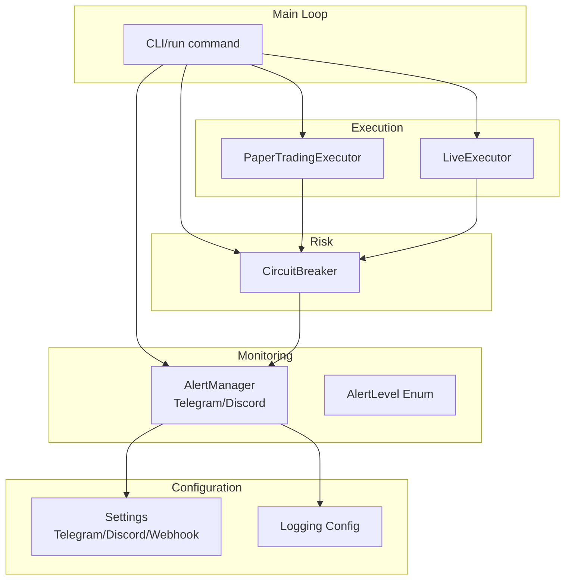

**Diagram sources**
- [alerts.py:15-311](file://trading_bot/monitoring/alerts.py#L15-L311)
- [settings.py:106-111](file://trading_bot/config/settings.py#L106-L111)
- [logging_config.py:13-91](file://trading_bot/config/logging_config.py#L13-L91)
- [main.py:214-326](file://trading_bot/main.py#L214-L326)
- [circuit_breaker.py:32-236](file://trading_bot/risk/circuit_breaker.py#L32-L236)
- [paper.py:36-392](file://trading_bot/execution/paper.py#L36-L392)
- [live.py:38-364](file://trading_bot/execution/live.py#L38-L364)

**Section sources**
- [alerts.py:1-311](file://trading_bot/monitoring/alerts.py#L1-L311)
- [settings.py:1-176](file://trading_bot/config/settings.py#L1-L176)
- [logging_config.py:1-91](file://trading_bot/config/logging_config.py#L1-L91)
- [main.py:1-347](file://trading_bot/main.py#L1-L347)
- [circuit_breaker.py:1-336](file://trading_bot/risk/circuit_breaker.py#L1-L336)
- [paper.py:1-392](file://trading_bot/execution/paper.py#L1-L392)
- [live.py:1-364](file://trading_bot/execution/live.py#L1-L364)

## Core Components
- AlertLevel: Defines severity levels used across alerts.
- AlertManager: Central orchestrator for sending alerts to Telegram and Discord, maintaining alert history, and managing aiohttp sessions.
- Settings: Provides configuration for Telegram tokens, chat IDs, and Discord webhook URLs.
- Logging: Structured logging setup used by AlertManager for operational logs.
- CircuitBreaker: Triggers critical conditions and integrates with AlertManager for circuit breaker alerts.
- Execution Executors: Paper and Live executors integrate with risk management; risk manager emits checks that can lead to alerts.

Key responsibilities:
- Asynchronous delivery via aiohttp with shared ClientSession.
- Message formatting with emojis for Telegram and embeds for Discord.
- Alert history with filtering by level and limit.
- Session lifecycle management for efficient network I/O.

**Section sources**
- [alerts.py:15-311](file://trading_bot/monitoring/alerts.py#L15-L311)
- [settings.py:106-111](file://trading_bot/config/settings.py#L106-L111)
- [logging_config.py:13-91](file://trading_bot/config/logging_config.py#L13-L91)
- [circuit_breaker.py:32-236](file://trading_bot/risk/circuit_breaker.py#L32-L236)

## Architecture Overview
The alert system is designed around asynchronous, concurrent delivery to multiple channels. The AlertManager encapsulates:
- Channel-specific senders for Telegram and Discord.
- Unified send_alert that dispatches concurrently to both channels.
- Alert history recording and retrieval.
- Session reuse for HTTP requests.

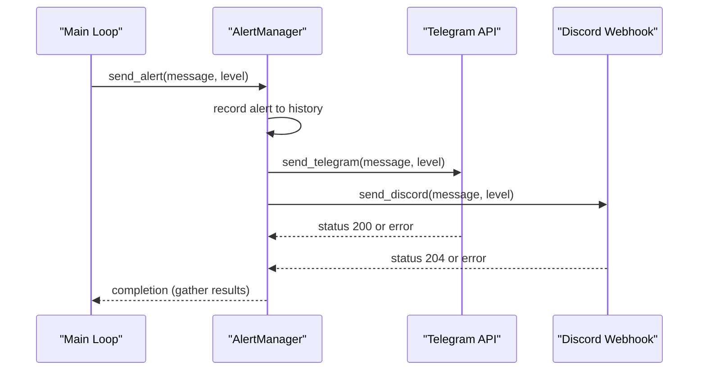

**Diagram sources**
- [alerts.py:150-179](file://trading_bot/monitoring/alerts.py#L150-L179)

**Section sources**
- [alerts.py:48-52](file://trading_bot/monitoring/alerts.py#L48-L52)
- [alerts.py:150-179](file://trading_bot/monitoring/alerts.py#L150-L179)

## Detailed Component Analysis

### AlertManager
AlertManager coordinates alert delivery and history. It supports:
- Telegram: Sends HTML-formatted messages with emoji prefixes based on AlertLevel.
- Discord: Posts embeds with color-coded severity and ISO timestamp.
- Concurrent delivery: Uses asyncio.gather to send to both channels simultaneously.
- History tracking: Stores alert records with timestamp, level, and message.
- Filtering: get_alert_history supports level filtering and limit.
- Session management: Reuses a single aiohttp.ClientSession for efficiency.

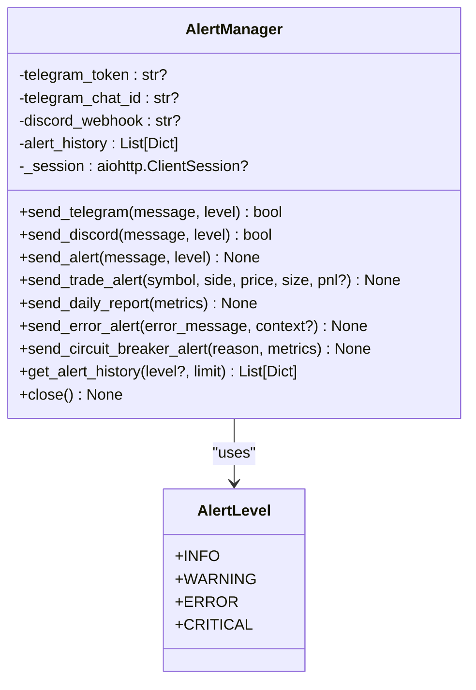

**Diagram sources**
- [alerts.py:15-311](file://trading_bot/monitoring/alerts.py#L15-L311)

**Section sources**
- [alerts.py:23-47](file://trading_bot/monitoring/alerts.py#L23-L47)
- [alerts.py:48-52](file://trading_bot/monitoring/alerts.py#L48-L52)
- [alerts.py:54-102](file://trading_bot/monitoring/alerts.py#L54-L102)
- [alerts.py:103-148](file://trading_bot/monitoring/alerts.py#L103-L148)
- [alerts.py:150-179](file://trading_bot/monitoring/alerts.py#L150-L179)
- [alerts.py:181-211](file://trading_bot/monitoring/alerts.py#L181-L211)
- [alerts.py:213-240](file://trading_bot/monitoring/alerts.py#L213-L240)
- [alerts.py:242-258](file://trading_bot/monitoring/alerts.py#L242-L258)
- [alerts.py:260-284](file://trading_bot/monitoring/alerts.py#L260-L284)
- [alerts.py:286-305](file://trading_bot/monitoring/alerts.py#L286-L305)
- [alerts.py:307-311](file://trading_bot/monitoring/alerts.py#L307-L311)

### Alert Levels
Alert levels are standardized and mapped to:
- Telegram: Emojis for quick visual recognition.
- Discord: Numeric embed colors for severity.
- Error handling: Logs failures and missing credentials.

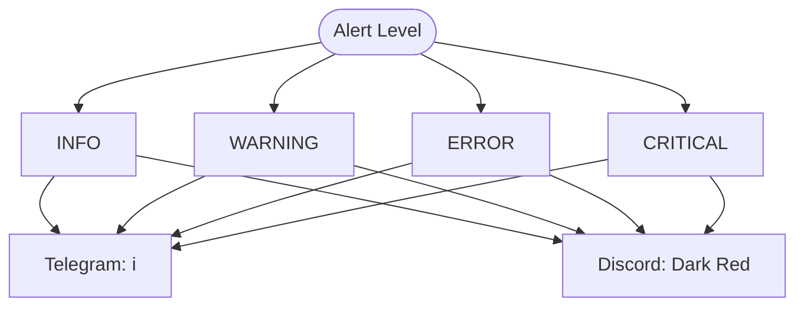

**Diagram sources**
- [alerts.py:15-21](file://trading_bot/monitoring/alerts.py#L15-L21)
- [alerts.py:72-77](file://trading_bot/monitoring/alerts.py#L72-L77)
- [alerts.py:121-126](file://trading_bot/monitoring/alerts.py#L121-L126)

**Section sources**
- [alerts.py:15-21](file://trading_bot/monitoring/alerts.py#L15-L21)
- [alerts.py:72-77](file://trading_bot/monitoring/alerts.py#L72-L77)
- [alerts.py:121-126](file://trading_bot/monitoring/alerts.py#L121-L126)

### Asynchronous Notification Delivery
- Shared aiohttp session: Created lazily and reused to reduce overhead.
- Concurrent sends: send_alert fires off Telegram and Discord tasks concurrently.
- Error handling: Exceptions are caught and logged; partial failures are tolerated.
- Completion logging: If no channel succeeds, a warning is emitted.

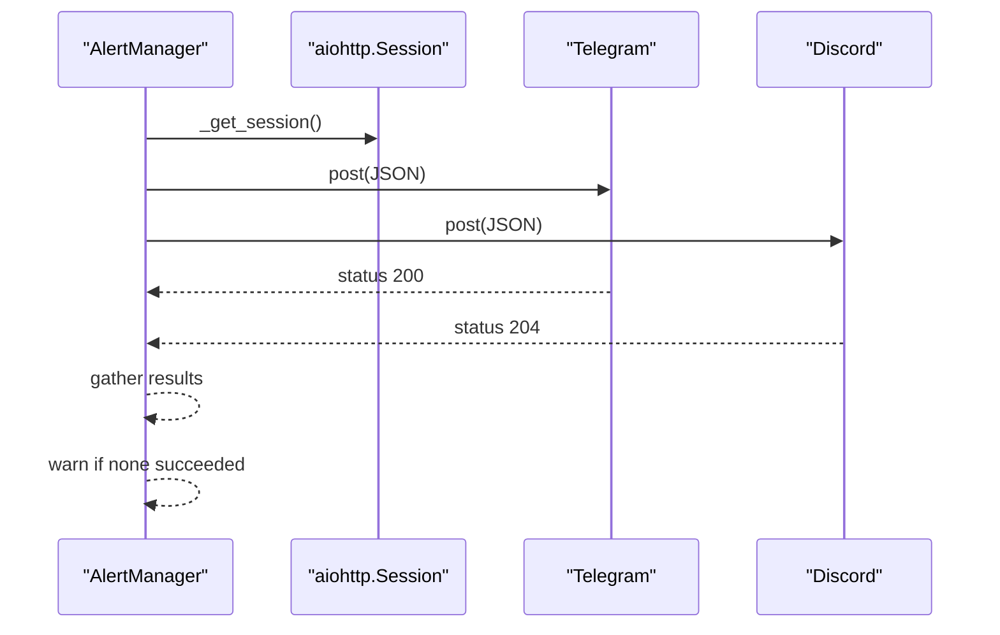

**Diagram sources**
- [alerts.py:48-52](file://trading_bot/monitoring/alerts.py#L48-L52)
- [alerts.py:150-179](file://trading_bot/monitoring/alerts.py#L150-L179)

**Section sources**
- [alerts.py:48-52](file://trading_bot/monitoring/alerts.py#L48-L52)
- [alerts.py:150-179](file://trading_bot/monitoring/alerts.py#L150-L179)

### Alert Configuration Workflow
Configuration is loaded via Settings and injected into AlertManager:
- Environment variables (.env) supply Telegram token/chat ID and Discord webhook URL.
- Settings validates and exposes these values.
- AlertManager reads defaults from Settings if constructor arguments are omitted.

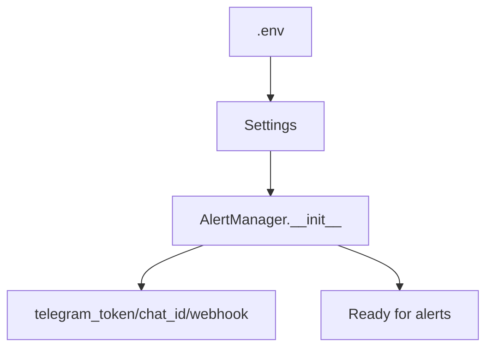

**Diagram sources**
- [settings.py:106-111](file://trading_bot/config/settings.py#L106-L111)
- [alerts.py:39-43](file://trading_bot/monitoring/alerts.py#L39-L43)

**Section sources**
- [settings.py:106-111](file://trading_bot/config/settings.py#L106-L111)
- [alerts.py:39-43](file://trading_bot/monitoring/alerts.py#L39-L43)

### Message Formatting with Emojis and Embeds
- Telegram: HTML-formatted messages with emoji prefixes and uppercase level labels.
- Discord: Embeds with title, description, color, and ISO timestamp.

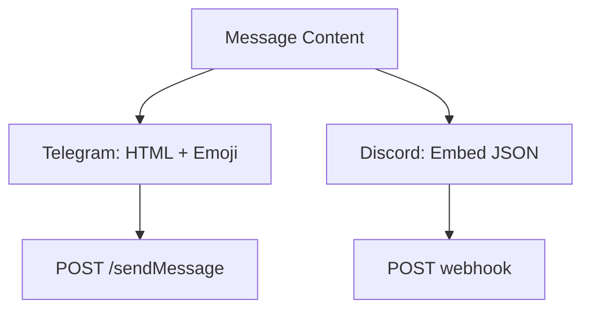

**Diagram sources**
- [alerts.py:72-80](file://trading_bot/monitoring/alerts.py#L72-L80)
- [alerts.py:128-135](file://trading_bot/monitoring/alerts.py#L128-L135)

**Section sources**
- [alerts.py:72-80](file://trading_bot/monitoring/alerts.py#L72-L80)
- [alerts.py:128-135](file://trading_bot/monitoring/alerts.py#L128-L135)

### Error Handling Mechanisms
- Missing credentials: send_telegram/send_discord return False early if required fields are absent.
- HTTP errors: Non-success status codes are logged; function returns False.
- Exceptions: Caught and logged; function returns False.
- No channel success: send_alert logs a warning summarizing the failure.

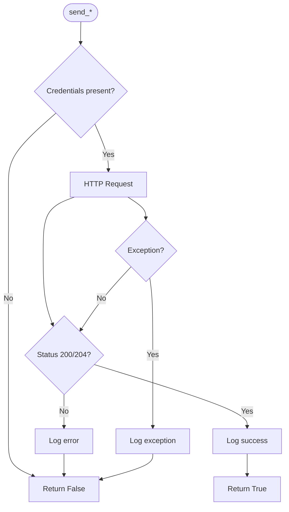

**Diagram sources**
- [alerts.py:68-69](file://trading_bot/monitoring/alerts.py#L68-L69)
- [alerts.py:90-101](file://trading_bot/monitoring/alerts.py#L90-L101)
- [alerts.py:117-118](file://trading_bot/monitoring/alerts.py#L117-L118)
- [alerts.py:137-148](file://trading_bot/monitoring/alerts.py#L137-L148)
- [alerts.py:177-179](file://trading_bot/monitoring/alerts.py#L177-L179)

**Section sources**
- [alerts.py:68-69](file://trading_bot/monitoring/alerts.py#L68-L69)
- [alerts.py:90-101](file://trading_bot/monitoring/alerts.py#L90-L101)
- [alerts.py:117-118](file://trading_bot/monitoring/alerts.py#L117-L118)
- [alerts.py:137-148](file://trading_bot/monitoring/alerts.py#L137-L148)
- [alerts.py:177-179](file://trading_bot/monitoring/alerts.py#L177-L179)

### Specific Alert Types
- Trade alerts: send_trade_alert formats execution details and optional PnL with emoji.
- Daily reports: send_daily_report aggregates performance, risk metrics, and activity.
- Error alerts: send_error_alert formats error messages with optional context.
- Circuit breaker alerts: send_circuit_breaker_alert formats critical risk thresholds and pause instructions.

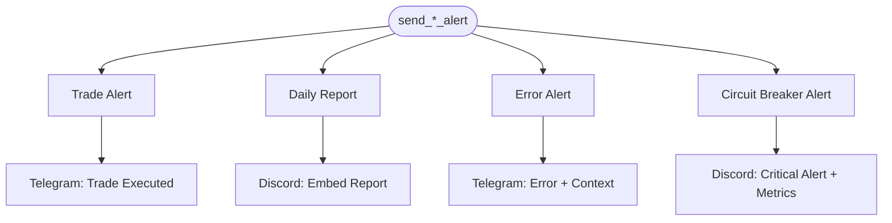

**Diagram sources**
- [alerts.py:181-211](file://trading_bot/monitoring/alerts.py#L181-L211)
- [alerts.py:213-240](file://trading_bot/monitoring/alerts.py#L213-L240)
- [alerts.py:242-258](file://trading_bot/monitoring/alerts.py#L242-L258)
- [alerts.py:260-284](file://trading_bot/monitoring/alerts.py#L260-L284)

**Section sources**
- [alerts.py:181-211](file://trading_bot/monitoring/alerts.py#L181-L211)
- [alerts.py:213-240](file://trading_bot/monitoring/alerts.py#L213-L240)
- [alerts.py:242-258](file://trading_bot/monitoring/alerts.py#L242-L258)
- [alerts.py:260-284](file://trading_bot/monitoring/alerts.py#L260-L284)

### Practical Examples

- Setting up alert channels:
  - Telegram: Provide telegram_bot_token and telegram_chat_id in .env or pass to AlertManager constructor.
  - Discord: Provide discord_webhook_url in .env or pass to AlertManager constructor.
- Configuring webhook URLs:
  - Use the Discord webhook URL format provided by server integrations.
- Implementing custom alert handlers:
  - Extend AlertManager with additional send_* methods or integrate external handlers by calling AlertManager methods from your own code paths.

These steps rely on Settings loading environment variables and AlertManager reading them.

**Section sources**
- [settings.py:106-111](file://trading_bot/config/settings.py#L106-L111)
- [alerts.py:39-43](file://trading_bot/monitoring/alerts.py#L39-L43)

### Alert History Tracking, Filtering, and Session Management
- History: Each send_alert records a timestamped entry with level and message.
- Filtering: get_alert_history supports optional level filter and limit.
- Session: _get_session lazily creates and reuses a single aiohttp.ClientSession; close ensures cleanup.

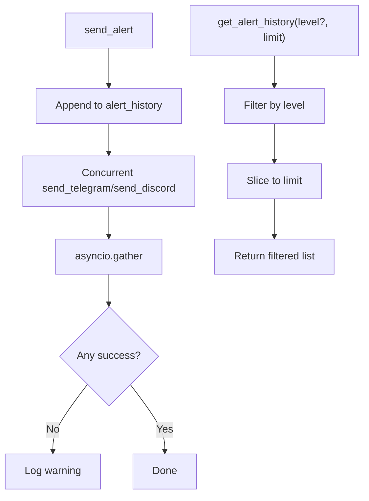

**Diagram sources**
- [alerts.py:161-167](file://trading_bot/monitoring/alerts.py#L161-L167)
- [alerts.py:170-179](file://trading_bot/monitoring/alerts.py#L170-L179)
- [alerts.py:286-305](file://trading_bot/monitoring/alerts.py#L286-L305)

**Section sources**
- [alerts.py:161-167](file://trading_bot/monitoring/alerts.py#L161-L167)
- [alerts.py:170-179](file://trading_bot/monitoring/alerts.py#L170-L179)
- [alerts.py:286-305](file://trading_bot/monitoring/alerts.py#L286-L305)
- [alerts.py:307-311](file://trading_bot/monitoring/alerts.py#L307-L311)

## Dependency Analysis
- AlertManager depends on:
  - Settings for configuration.
  - aiohttp for HTTP transport.
  - Structured logging for operational logs.
- Integration points:
  - Main loop initializes AlertManager and sends startup alerts.
  - CircuitBreaker can trigger send_circuit_breaker_alert.
  - RiskManager provides portfolio metrics used in circuit breaker alerts.

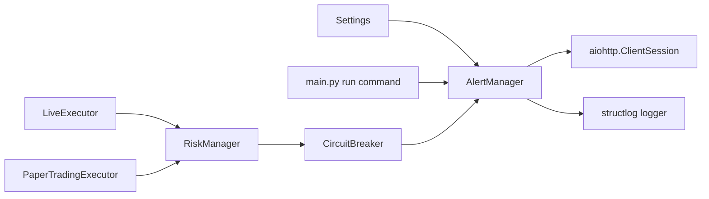

**Diagram sources**
- [settings.py:106-111](file://trading_bot/config/settings.py#L106-L111)
- [alerts.py:39-43](file://trading_bot/monitoring/alerts.py#L39-L43)
- [main.py:230-231](file://trading_bot/main.py#L230-L231)
- [circuit_breaker.py:32-236](file://trading_bot/risk/circuit_breaker.py#L32-L236)
- [paper.py:70-74](file://trading_bot/execution/paper.py#L70-L74)
- [live.py:56-56](file://trading_bot/execution/live.py#L56-L56)

**Section sources**
- [settings.py:106-111](file://trading_bot/config/settings.py#L106-L111)
- [alerts.py:39-43](file://trading_bot/monitoring/alerts.py#L39-L43)
- [main.py:230-231](file://trading_bot/main.py#L230-L231)
- [circuit_breaker.py:32-236](file://trading_bot/risk/circuit_breaker.py#L32-L236)
- [paper.py:70-74](file://trading_bot/execution/paper.py#L70-L74)
- [live.py:56-56](file://trading_bot/execution/live.py#L56-L56)

## Performance Considerations
- Use a single shared aiohttp.ClientSession to minimize connection overhead.
- Leverage asyncio.gather for concurrent delivery to multiple channels.
- Limit alert history size via get_alert_history with a reasonable limit to control memory usage.
- Avoid sending alerts during high-frequency loops unless necessary; batch or throttle as appropriate.

[No sources needed since this section provides general guidance]

## Troubleshooting Guide
Common issues and resolutions:
- Alerts not sent to any channel:
  - Verify telegram_bot_token, telegram_chat_id, and discord_webhook_url are configured.
  - Check network connectivity and webhook permissions.
- Telegram errors:
  - Ensure chat_id is correct and bot token is valid.
  - Confirm parse_mode is supported by the Telegram API.
- Discord errors:
  - Validate webhook URL format and permissions.
  - Ensure embed payload structure matches Discord expectations.
- Session lifecycle:
  - Call AlertManager.close() to release resources when shutting down.

**Section sources**
- [alerts.py:68-69](file://trading_bot/monitoring/alerts.py#L68-L69)
- [alerts.py:117-118](file://trading_bot/monitoring/alerts.py#L117-L118)
- [alerts.py:307-311](file://trading_bot/monitoring/alerts.py#L307-L311)

## Conclusion
The AlertManager provides a robust, asynchronous alerting backbone integrating Telegram and Discord with clear severity levels, structured message formatting, and resilient error handling. Its integration with Settings enables straightforward configuration, while its alert history and filtering support operational oversight. Combined with the circuit breaker and risk management components, the system delivers timely, actionable notifications across critical trading events.

[No sources needed since this section summarizes without analyzing specific files]

## Appendices

### Alert Types Reference
- Trade alerts: send_trade_alert
- Daily reports: send_daily_report
- Error alerts: send_error_alert
- Circuit breaker alerts: send_circuit_breaker_alert

**Section sources**
- [alerts.py:181-211](file://trading_bot/monitoring/alerts.py#L181-L211)
- [alerts.py:213-240](file://trading_bot/monitoring/alerts.py#L213-L240)
- [alerts.py:242-258](file://trading_bot/monitoring/alerts.py#L242-L258)
- [alerts.py:260-284](file://trading_bot/monitoring/alerts.py#L260-L284)

### Integration Points
- Main loop: Initializes AlertManager and sends startup alerts.
- Circuit breaker: Triggers circuit breaker alerts with portfolio metrics.
- Risk manager: Supplies metrics used in circuit breaker alerts.

**Section sources**
- [main.py:254-258](file://trading_bot/main.py#L254-L258)
- [main.py:274-277](file://trading_bot/main.py#L274-L277)
- [circuit_breaker.py:253-266](file://trading_bot/risk/circuit_breaker.py#L253-L266)