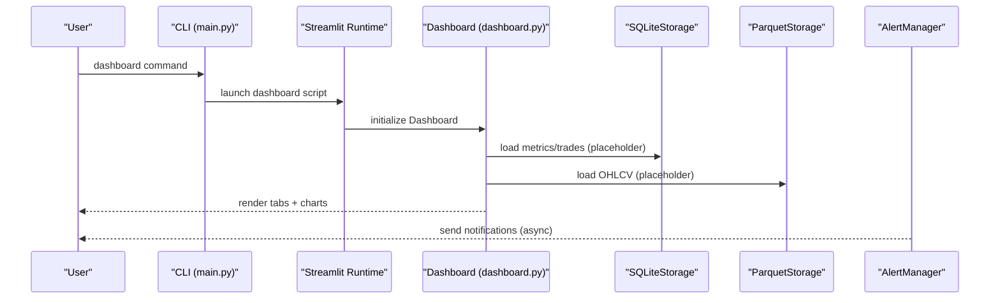
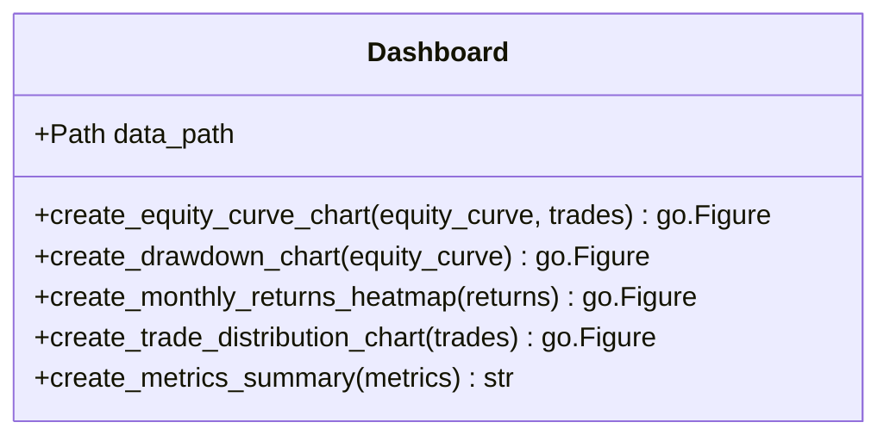
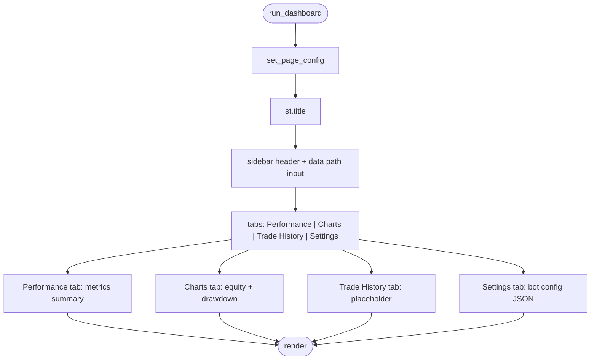
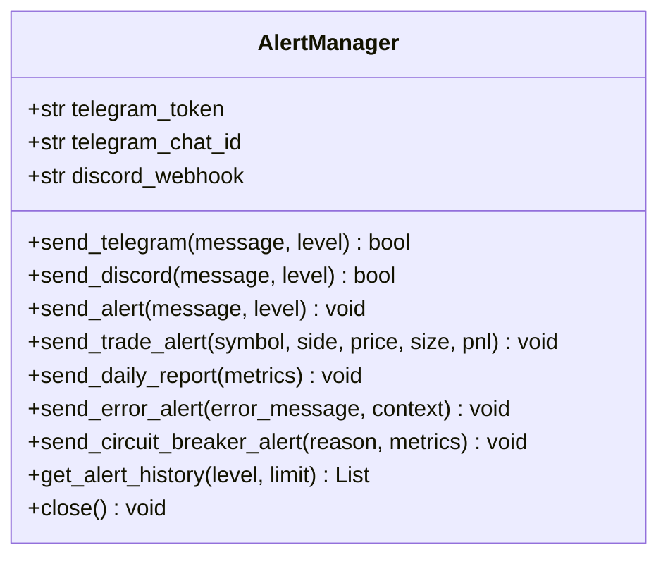
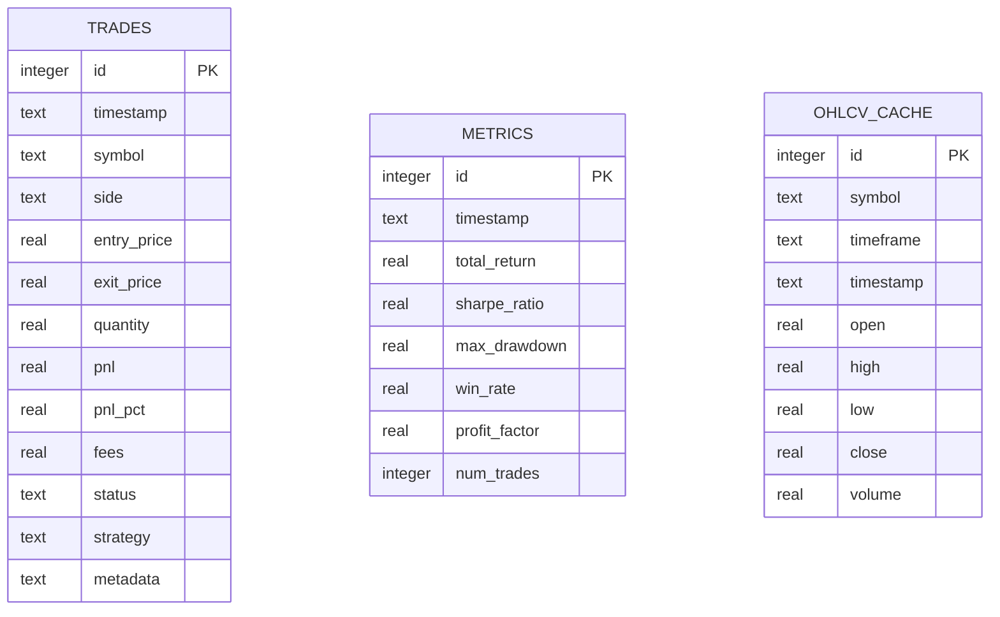
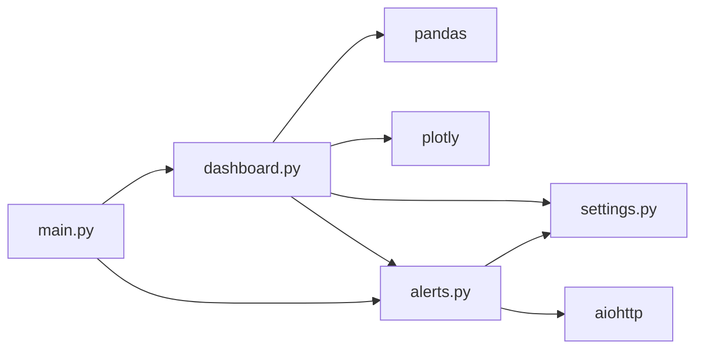

# Dashboard Interface

<cite>
**Referenced Files in This Document**
- [dashboard.py](file://trading_bot/monitoring/dashboard.py)
- [alerts.py](file://trading_bot/monitoring/alerts.py)
- [settings.py](file://trading_bot/config/settings.py)
- [main.py](file://trading_bot/main.py)
- [storage.py](file://trading_bot/data/storage.py)
- [README.md](file://README.md)
</cite>

## Table of Contents
1. [Introduction](#introduction)
2. [Project Structure](#project-structure)
3. [Core Components](#core-components)
4. [Architecture Overview](#architecture-overview)
5. [Detailed Component Analysis](#detailed-component-analysis)
6. [Dependency Analysis](#dependency-analysis)
7. [Performance Considerations](#performance-considerations)
8. [Troubleshooting Guide](#troubleshooting-guide)
9. [Conclusion](#conclusion)
10. [Appendices](#appendices)

## Introduction
This document describes the Streamlit-based monitoring dashboard for the trading bot. It covers the real-time dashboard implementation with equity curve visualization, drawdown tracking, trade history display, and performance metrics presentation. It explains the dashboard layout, interactive components, data refresh mechanisms, and user interface patterns. It also documents configuration options for dashboard customization, metric calculations, and visualization preferences, along with practical usage examples, performance monitoring workflows, and interpretation of key trading metrics. Finally, it documents integration with the alert system and real-time data updates for comprehensive market surveillance.

## Project Structure
The dashboard resides in the monitoring module alongside the alert system. The CLI integrates launching the dashboard via a dedicated command. Data persistence is handled by SQLite for trades/metrics and Parquet for OHLCV. The dashboard currently uses placeholder data and tabs for demonstration; it can be extended to load actual data from storage.

```mermaid
graph TB
subgraph "CLI"
CLI["main.py<br/>dashboard command"]
end
subgraph "Monitoring"
Dash["dashboard.py<br/>Dashboard class + Streamlit app"]
Alerts["alerts.py<br/>AlertManager"]
end
subgraph "Data"
SQLite["storage.py<br/>SQLiteStorage"]
Parquet["storage.py<br/>ParquetStorage"]
end
subgraph "Config"
Settings["settings.py<br/>Settings + ports"]
end
CLI --> Dash
Dash --> SQLite
Dash --> Parquet
Dash --> Settings
Dash --> Alerts
```

**Diagram sources**
- [main.py:328-343](file://trading_bot/main.py#L328-L343)
- [dashboard.py:16-327](file://trading_bot/monitoring/dashboard.py#L16-L327)
- [alerts.py:23-311](file://trading_bot/monitoring/alerts.py#L23-L311)
- [storage.py:53-484](file://trading_bot/data/storage.py#L53-L484)
- [settings.py:23-123](file://trading_bot/config/settings.py#L23-L123)

**Section sources**
- [README.md:198-231](file://README.md#L198-L231)
- [main.py:328-343](file://trading_bot/main.py#L328-L343)
- [dashboard.py:16-327](file://trading_bot/monitoring/dashboard.py#L16-L327)

## Core Components
- Dashboard class: Provides chart creation methods for equity curves, drawdowns, monthly returns heatmap, and trade distribution, plus a metrics summary renderer.
- Streamlit app: Defines the UI layout with sidebar settings, tabs for Performance, Charts, Trade History, and Settings.
- AlertManager: Handles Telegram and Discord notifications and integrates with the dashboard’s runtime via the CLI.

Key responsibilities:
- Visualization: Equity curve with optional trade markers, drawdown area chart, monthly returns heatmap, and multi-panel trade distribution charts.
- Metrics display: Grid of KPI cards for total return, Sharpe ratio, max drawdown, and win rate.
- Interactive controls: Sidebar for data path selection and tabbed navigation.
- Integration points: Uses settings for ports and data paths; integrates with alert system for operational notifications.

**Section sources**
- [dashboard.py:16-327](file://trading_bot/monitoring/dashboard.py#L16-L327)
- [alerts.py:23-311](file://trading_bot/monitoring/alerts.py#L23-L311)
- [settings.py:23-123](file://trading_bot/config/settings.py#L23-L123)

## Architecture Overview
The dashboard is a standalone Streamlit app launched by the CLI. It reads configuration for ports and data paths, constructs visualizations from data stored in SQLite and Parquet, and displays performance metrics and trade history. Alerts are sent asynchronously via AlertManager.



**Diagram sources**
- [main.py:328-343](file://trading_bot/main.py#L328-L343)
- [dashboard.py:258-327](file://trading_bot/monitoring/dashboard.py#L258-L327)
- [alerts.py:23-311](file://trading_bot/monitoring/alerts.py#L23-L311)

## Detailed Component Analysis

### Dashboard Class
The Dashboard class encapsulates all visualization logic and metrics rendering. It exposes:
- Equity curve chart with optional trade markers
- Drawdown chart computed from the equity curve
- Monthly returns heatmap derived from daily returns
- Trade distribution charts (PnL histogram, cumulative PnL, duration histogram, win/loss pie)
- Metrics summary grid



**Diagram sources**
- [dashboard.py:16-254](file://trading_bot/monitoring/dashboard.py#L16-L254)

**Section sources**
- [dashboard.py:27-215](file://trading_bot/monitoring/dashboard.py#L27-L215)

### Streamlit Application Layout
The Streamlit app defines:
- Page configuration (wide layout, icon)
- Sidebar with settings (data path input)
- Tabs:
  - Performance: metrics summary grid
  - Charts: equity curve and drawdown
  - Trade History: placeholder
  - Settings: bot configuration JSON



**Diagram sources**
- [dashboard.py:258-327](file://trading_bot/monitoring/dashboard.py#L258-L327)

**Section sources**
- [dashboard.py:258-327](file://trading_bot/monitoring/dashboard.py#L258-L327)

### Alert System Integration
The AlertManager supports:
- Telegram and Discord notifications
- Alert levels (info, warning, error, critical)
- Asynchronous sending with shared aiohttp session
- Daily reports and circuit breaker alerts
- Trade execution alerts



**Diagram sources**
- [alerts.py:23-311](file://trading_bot/monitoring/alerts.py#L23-L311)

**Section sources**
- [alerts.py:23-311](file://trading_bot/monitoring/alerts.py#L23-L311)

### Data Persistence and Storage
The system persists:
- Trades and OHLCV cache in SQLite
- Historical metrics in SQLite
- OHLCV in Parquet



**Diagram sources**
- [storage.py:222-271](file://trading_bot/data/storage.py#L222-L271)

**Section sources**
- [storage.py:53-484](file://trading_bot/data/storage.py#L53-L484)

## Dependency Analysis
- Dashboard depends on:
  - pandas for data manipulation
  - plotly for interactive charts
  - trading_bot.config.get_logger for logging
- Streamlit app depends on:
  - Streamlit runtime
  - Dashboard class
  - Settings for ports and data paths
- AlertManager depends on:
  - aiohttp for async HTTP calls
  - trading_bot.config.get_settings and get_logger



**Diagram sources**
- [dashboard.py:1-13](file://trading_bot/monitoring/dashboard.py#L1-L13)
- [alerts.py:3-12](file://trading_bot/monitoring/alerts.py#L3-L12)
- [main.py:11-17](file://trading_bot/main.py#L11-L17)

**Section sources**
- [dashboard.py:1-13](file://trading_bot/monitoring/dashboard.py#L1-L13)
- [alerts.py:3-12](file://trading_bot/monitoring/alerts.py#L3-L12)
- [main.py:11-17](file://trading_bot/main.py#L11-L17)

## Performance Considerations
- Visualization rendering: Chart updates are client-side in Streamlit; large datasets may impact responsiveness. Consider downsampling or pagination for extensive trade histories.
- Data loading: SQLite and Parquet reads are synchronous; for heavy loads, pre-aggregate metrics and cache results.
- Asynchronous alerts: AlertManager uses async I/O; ensure proper session lifecycle management to avoid resource leaks.
- Refresh cadence: Streamlit re-runs the app on interaction; implement caching and incremental updates to reduce computation overhead.

[No sources needed since this section provides general guidance]

## Troubleshooting Guide
Common issues and resolutions:
- Streamlit not installed: The dashboard app prints an import error and exits gracefully. Install Streamlit to enable the dashboard.
- Missing data path: The sidebar allows specifying a data path; ensure the path exists and contains expected files.
- Alert delivery failures: Telegram/Discord sends are logged; verify tokens/webhooks and network connectivity.
- Port conflicts: The CLI launches the dashboard on a configurable port; change the port if in use.

**Section sources**
- [dashboard.py:260-264](file://trading_bot/monitoring/dashboard.py#L260-L264)
- [main.py:328-343](file://trading_bot/main.py#L328-L343)
- [alerts.py:90-101](file://trading_bot/monitoring/alerts.py#L90-L101)

## Conclusion
The dashboard provides a modular foundation for monitoring trading performance with equity curves, drawdowns, trade analytics, and metrics summaries. It integrates with the alert system and can be extended to load real-time data from SQLite and Parquet. By leveraging configuration-driven settings and asynchronous alerting, it supports robust market surveillance and operational oversight.

[No sources needed since this section summarizes without analyzing specific files]

## Appendices

### Dashboard Layout and Tabs
- Performance tab: Displays a grid of key metrics.
- Charts tab: Shows equity curve and drawdown charts.
- Trade History tab: Placeholder for trade records.
- Settings tab: Displays bot configuration.

**Section sources**
- [dashboard.py:280-323](file://trading_bot/monitoring/dashboard.py#L280-L323)

### Configuration Options
- Dashboard port: Configurable via settings.
- Data path: Adjustable in the dashboard sidebar.
- Bot settings: Displayed in the Settings tab.

**Section sources**
- [settings.py:121-122](file://trading_bot/config/settings.py#L121-L122)
- [dashboard.py:278-323](file://trading_bot/monitoring/dashboard.py#L278-L323)
- [main.py:328-343](file://trading_bot/main.py#L328-L343)

### Practical Usage Examples
- Launch the dashboard: Use the CLI command to start the Streamlit server on the configured port.
- Customize data path: Enter a valid path in the sidebar to point to your data directory.
- Interpret metrics:
  - Total Return: Overall profitability.
  - Sharpe Ratio: Risk-adjusted return.
  - Max Drawdown: Peak-to-trough decline.
  - Win Rate: Percentage of profitable trades.

**Section sources**
- [README.md:162-164](file://README.md#L162-L164)
- [dashboard.py:291-296](file://trading_bot/monitoring/dashboard.py#L291-L296)

### Integration with Alert System
- Trade alerts: Sent upon trade execution.
- Daily reports: Aggregated performance sent via configured channels.
- Circuit breaker alerts: Triggered when risk thresholds are exceeded.

**Section sources**
- [alerts.py:181-240](file://trading_bot/monitoring/alerts.py#L181-L240)
- [main.py:273-278](file://trading_bot/main.py#L273-L278)