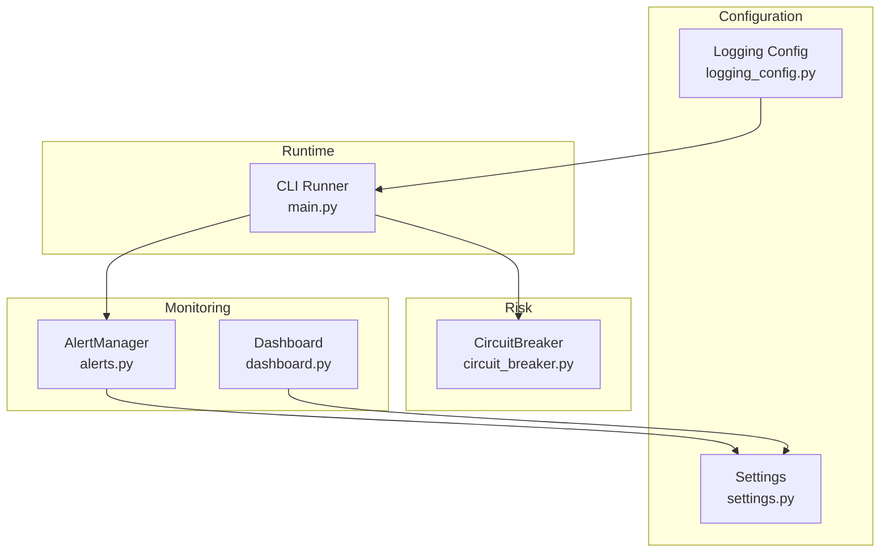
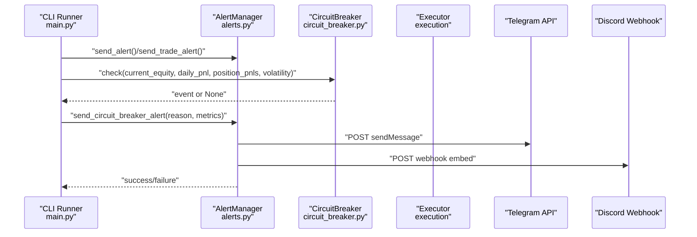
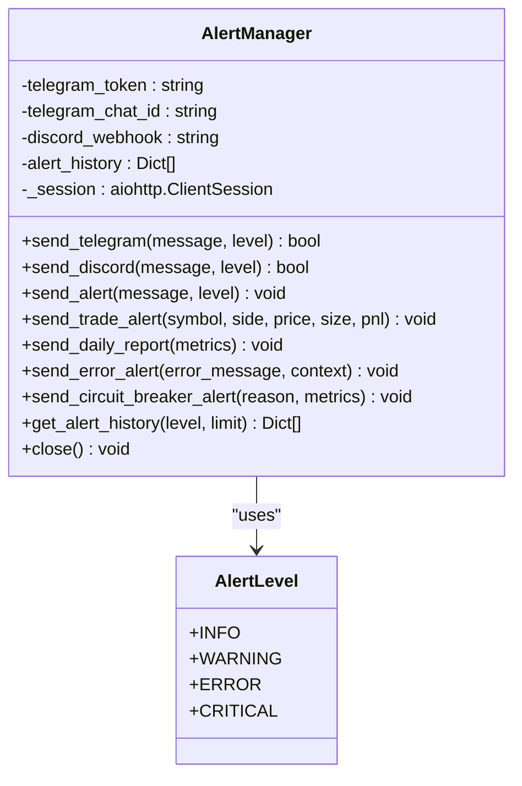
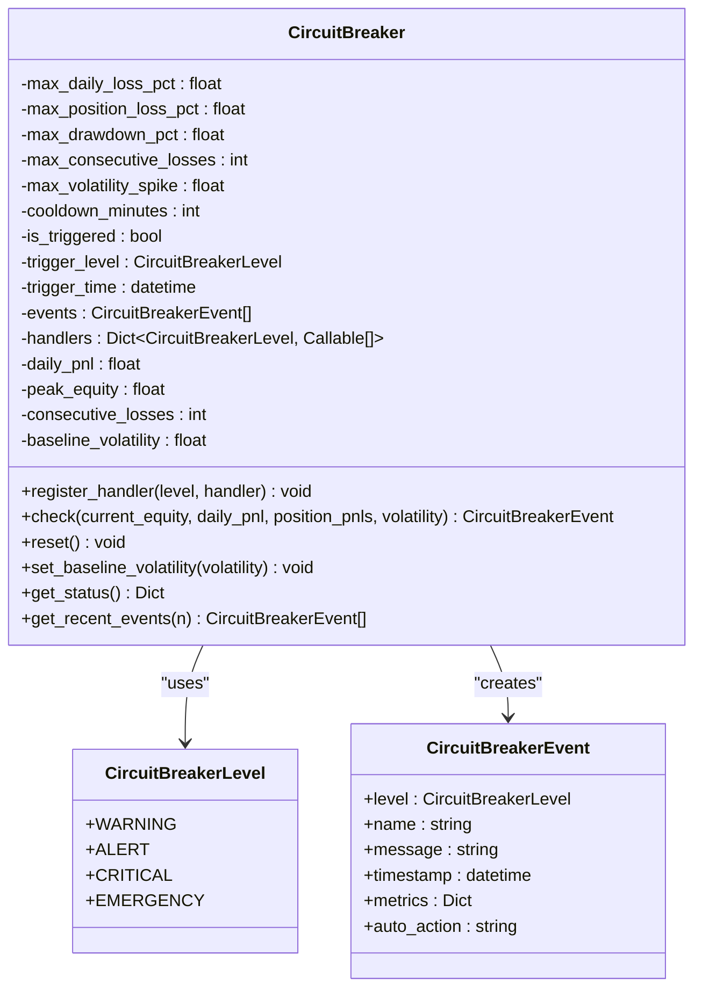
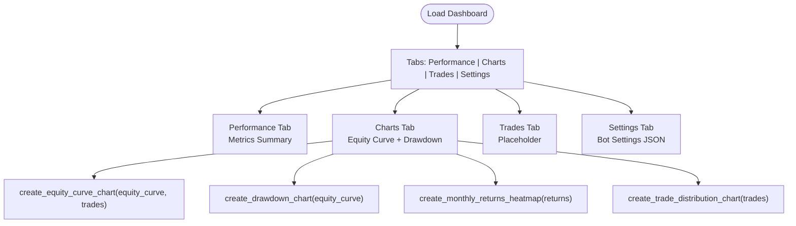
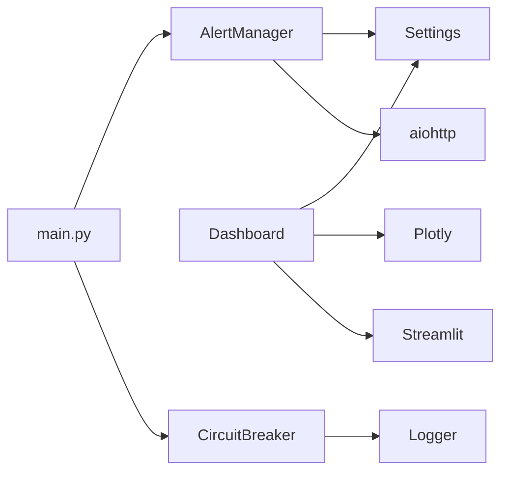

# Monitoring and Alerts

<cite>
**Referenced Files in This Document**
- [alerts.py](file://trading_bot/monitoring/alerts.py)
- [dashboard.py](file://trading_bot/monitoring/dashboard.py)
- [settings.py](file://trading_bot/config/settings.py)
- [logging_config.py](file://trading_bot/config/logging_config.py)
- [circuit_breaker.py](file://trading_bot/risk/circuit_breaker.py)
- [main.py](file://trading_bot/main.py)
- [README.md](file://README.md)
</cite>

## Table of Contents
1. [Introduction](#introduction)
2. [Project Structure](#project-structure)
3. [Core Components](#core-components)
4. [Architecture Overview](#architecture-overview)
5. [Detailed Component Analysis](#detailed-component-analysis)
6. [Dependency Analysis](#dependency-analysis)
7. [Performance Considerations](#performance-considerations)
8. [Troubleshooting Guide](#troubleshooting-guide)
9. [Conclusion](#conclusion)
10. [Appendices](#appendices)

## Introduction
This document explains the monitoring and alerts system for the AI Trading Bot, focusing on:
- Multi-channel alerting via Telegram and Discord
- Daily PnL reports, circuit breaker triggers, and error notifications
- Streamlit dashboard for real-time equity curves, drawdown visualization, trade history, and performance metrics
- Alert configuration, notification customization, and dashboard usage patterns
- Practical examples for setting up monitoring workflows and interpreting performance indicators

## Project Structure
The monitoring stack is organized under the monitoring package and integrates with configuration, risk management, and the main runtime loop.



**Diagram sources**
- [alerts.py:1-311](file://trading_bot/monitoring/alerts.py#L1-L311)
- [dashboard.py:1-328](file://trading_bot/monitoring/dashboard.py#L1-L328)
- [settings.py:1-176](file://trading_bot/config/settings.py#L1-L176)
- [logging_config.py:1-91](file://trading_bot/config/logging_config.py#L1-L91)
- [circuit_breaker.py:1-336](file://trading_bot/risk/circuit_breaker.py#L1-L336)
- [main.py:1-347](file://trading_bot/main.py#L1-L347)

**Section sources**
- [README.md:264-277](file://README.md#L264-L277)
- [main.py:214-326](file://trading_bot/main.py#L214-L326)

## Core Components
- AlertManager: Asynchronous multi-channel alerting to Telegram and Discord, with trade alerts, daily reports, error notifications, and circuit breaker triggers. Maintains alert history and uses an aiohttp client session.
- Dashboard: Streamlit-based UI with equity curve, drawdown, monthly returns heatmap, trade distribution charts, and performance metrics summary.
- Settings: Centralized configuration including notification tokens/webhooks and logging ports.
- Logging: Structured logging with Rich console and optional file output.
- CircuitBreaker: Risk control with configurable thresholds and automatic actions; emits events and handlers.

**Section sources**
- [alerts.py:23-311](file://trading_bot/monitoring/alerts.py#L23-L311)
- [dashboard.py:16-328](file://trading_bot/monitoring/dashboard.py#L16-L328)
- [settings.py:23-176](file://trading_bot/config/settings.py#L23-L176)
- [logging_config.py:13-91](file://trading_bot/config/logging_config.py#L13-L91)
- [circuit_breaker.py:32-278](file://trading_bot/risk/circuit_breaker.py#L32-L278)

## Architecture Overview
The runtime loop initializes AlertManager and CircuitBreaker, periodically checks risk thresholds, executes signals, and sends alerts. The CLI exposes a command to launch the Streamlit dashboard.



**Diagram sources**
- [main.py:228-325](file://trading_bot/main.py#L228-L325)
- [alerts.py:150-284](file://trading_bot/monitoring/alerts.py#L150-L284)
- [circuit_breaker.py:88-184](file://trading_bot/risk/circuit_breaker.py#L88-L184)

## Detailed Component Analysis

### AlertManager
- Responsibilities:
  - Asynchronously send Telegram and Discord messages
  - Aggregate alerts into a history list
  - Provide convenience methods for trade alerts, daily reports, error alerts, and circuit breaker triggers
- Channels:
  - Telegram: Uses bot token and chat ID; formats HTML messages with level-appropriate emojis
  - Discord: Uses webhook URL; formats embeds with level-appropriate colors
- Concurrency:
  - Uses asyncio.gather to send to both channels concurrently
  - Reuses a single aiohttp.ClientSession across invocations
- Levels:
  - INFO, WARNING, ERROR, CRITICAL mapped to channel-specific formatting
- Persistence:
  - Stores alert records with timestamp, level, and message for later retrieval



**Diagram sources**
- [alerts.py:15-311](file://trading_bot/monitoring/alerts.py#L15-L311)

**Section sources**
- [alerts.py:23-311](file://trading_bot/monitoring/alerts.py#L23-L311)

### CircuitBreaker
- Responsibilities:
  - Monitor portfolio health against configurable thresholds
  - Emit events with severity levels and suggested auto-actions
  - Track cooldown period to prevent immediate re-triggering
  - Provide handlers registration for external integrations
- Triggers:
  - Daily loss limit
  - Maximum drawdown
  - Single-position loss limit
  - Consecutive losing periods
  - Volatility spike detection
- Status and Events:
  - Exposes recent events and status snapshot for monitoring



**Diagram sources**
- [circuit_breaker.py:13-278](file://trading_bot/risk/circuit_breaker.py#L13-L278)

**Section sources**
- [circuit_breaker.py:32-278](file://trading_bot/risk/circuit_breaker.py#L32-L278)

### Dashboard
- Responsibilities:
  - Render real-time charts and summaries in Streamlit
  - Provide tabs for Performance, Charts, Trade History, and Settings
  - Visualize equity curve, drawdown, monthly returns heatmap, and trade distributions
- Charts:
  - Equity Curve: Lines with optional entry markers
  - Drawdown: Percentage drawdown with area fill
  - Monthly Returns Heatmap: Year vs Month colored tiles
  - Trade Distribution: PnL histogram, cumulative PnL, duration histogram, win/loss pie
- Metrics Summary: Grid of key metrics (total return, Sharpe ratio, max drawdown, win rate)
- Data Path: Configurable path for loading data artifacts



**Diagram sources**
- [dashboard.py:257-328](file://trading_bot/monitoring/dashboard.py#L257-L328)
- [dashboard.py:27-215](file://trading_bot/monitoring/dashboard.py#L27-L215)

**Section sources**
- [dashboard.py:16-328](file://trading_bot/monitoring/dashboard.py#L16-L328)

### Settings and Logging
- Settings:
  - Centralized configuration via Pydantic BaseSettings
  - Notification fields: telegram_bot_token, telegram_chat_id, discord_webhook_url
  - Logging fields: log_level, log_file
  - Monitoring ports: dashboard_port, metrics_port
- Logging:
  - Structured logging with structlog
  - Optional Rich console handler and file handler
  - Configurable log level and file path

**Section sources**
- [settings.py:23-176](file://trading_bot/config/settings.py#L23-L176)
- [logging_config.py:13-91](file://trading_bot/config/logging_config.py#L13-L91)

## Architecture Overview
The runtime loop integrates monitoring and risk controls during trading execution.

```mermaid
sequenceDiagram
participant Loop as "Trading Loop<br/>main.py"
participant AM as "AlertManager"
participant CB as "CircuitBreaker"
participant TG as "Telegram"
participant DC as "Discord"
Loop->>CB : "check(current_equity, daily_pnl, position_pnls, volatility)"
alt Triggered
CB-->>Loop : "event"
Loop->>AM : "send_circuit_breaker_alert(reason, metrics)"
AM->>TG : "send_telegram(embed)"
AM->>DC : "send_discord(embed)"
else Not triggered
Loop->>AM : "send_trade_alert(symbol, side, price, size, realized_pnl)"
AM->>TG : "send_telegram(text)"
AM->>DC : "send_discord(embed)"
end
```

**Diagram sources**
- [main.py:263-317](file://trading_bot/main.py#L263-L317)
- [alerts.py:181-284](file://trading_bot/monitoring/alerts.py#L181-L284)
- [circuit_breaker.py:88-184](file://trading_bot/risk/circuit_breaker.py#L88-L184)

## Detailed Component Analysis

### Alert Configuration and Notification Customization
- Telegram:
  - Requires telegram_bot_token and telegram_chat_id
  - Messages include level-appropriate emojis and HTML formatting
- Discord:
  - Requires discord_webhook_url
  - Messages include level-appropriate embed colors and timestamps
- Levels:
  - INFO, WARNING, ERROR, CRITICAL map to channel-specific formatting
- Customization:
  - Modify message templates in AlertManager methods
  - Adjust colors/emojis by editing the mapping dictionaries
- History:
  - Access alert_history via get_alert_history(level, limit) for diagnostics

**Section sources**
- [alerts.py:26-311](file://trading_bot/monitoring/alerts.py#L26-L311)
- [settings.py:107-111](file://trading_bot/config/settings.py#L107-L111)

### Daily PnL Reports and Error Notifications
- Daily Report:
  - send_daily_report(metrics) constructs a formatted message with performance, risk metrics, and activity counts
- Error Alerts:
  - send_error_alert(error_message, context) formats an error-level message suitable for incident tracking
- Usage:
  - Schedule periodic reporting or emit on significant lifecycle events

**Section sources**
- [alerts.py:213-258](file://trading_bot/monitoring/alerts.py#L213-L258)

### Circuit Breaker Triggers and Actions
- Triggers:
  - Daily loss limit, maximum drawdown, position loss limit, consecutive losses, volatility spike
- Auto Actions:
  - Some triggers suggest auto-action strings (e.g., pause trading, close positions)
- Handlers:
  - Register handlers to receive CircuitBreakerEvent and implement custom logic
- Cooldown:
  - Prevents immediate re-triggering after a break

**Section sources**
- [circuit_breaker.py:32-278](file://trading_bot/risk/circuit_breaker.py#L32-L278)

### Streamlit Dashboard Usage Patterns
- Launch:
  - Use the CLI dashboard command to start Streamlit on the configured port
- Tabs:
  - Performance: Metrics summary grid
  - Charts: Equity curve and drawdown plots
  - Trades: Trade history placeholder
  - Settings: Bot settings JSON
- Data Path:
  - Configure data_path in the sidebar to load artifacts

**Section sources**
- [dashboard.py:257-328](file://trading_bot/monitoring/dashboard.py#L257-L328)
- [main.py:328-343](file://trading_bot/main.py#L328-L343)

### Practical Examples

#### Example: Setting Up Telegram and Discord Alerts
- Configure environment variables or settings fields:
  - telegram_bot_token, telegram_chat_id, discord_webhook_url
- Verify connectivity:
  - Send a test alert using AlertManager.send_alert
- Customize appearance:
  - Adjust emoji/color mappings in AlertManager methods

**Section sources**
- [settings.py:107-111](file://trading_bot/config/settings.py#L107-L111)
- [alerts.py:54-148](file://trading_bot/monitoring/alerts.py#L54-L148)

#### Example: Interpreting Performance Indicators
- Total Return: Overall growth over the period
- Sharpe Ratio: Risk-adjusted return
- Max Drawdown: Peak-to-trough decline
- Win Rate: Percentage of profitable trades
- Use the Metrics Summary grid in the dashboard for quick checks

**Section sources**
- [dashboard.py:217-254](file://trading_bot/monitoring/dashboard.py#L217-L254)

#### Example: Monitoring Equity Curve and Drawdown
- Equity Curve Chart:
  - Displays portfolio value over time; optionally overlays entry markers
- Drawdown Chart:
  - Shows percentage drawdown from peak equity
- Use these charts to spot regime changes and evaluate risk control effectiveness

**Section sources**
- [dashboard.py:27-107](file://trading_bot/monitoring/dashboard.py#L27-L107)

#### Example: Circuit Breaker Workflow
- Configure thresholds in settings or risk module defaults
- During trading loop, call CircuitBreaker.check and react to returned events
- On trigger, send a circuit breaker alert and pause trading until manual intervention

**Section sources**
- [circuit_breaker.py:88-184](file://trading_bot/risk/circuit_breaker.py#L88-L184)
- [alerts.py:260-284](file://trading_bot/monitoring/alerts.py#L260-L284)

## Dependency Analysis
- AlertManager depends on:
  - Settings for credentials
  - aiohttp for asynchronous HTTP
- Dashboard depends on:
  - Streamlit, pandas, plotly for visualization
  - Settings for configuration
- CircuitBreaker depends on:
  - Risk metrics and volatility baseline
- Runtime loop depends on:
  - AlertManager and CircuitBreaker for monitoring and safety
  - Settings for configuration and logging



**Diagram sources**
- [alerts.py:10-12](file://trading_bot/monitoring/alerts.py#L10-L12)
- [dashboard.py:7-13](file://trading_bot/monitoring/dashboard.py#L7-L13)
- [circuit_breaker.py:8](file://trading_bot/risk/circuit_breaker.py#L8)
- [main.py:11-16](file://trading_bot/main.py#L11-L16)

**Section sources**
- [alerts.py:10-12](file://trading_bot/monitoring/alerts.py#L10-L12)
- [dashboard.py:7-13](file://trading_bot/monitoring/dashboard.py#L7-L13)
- [circuit_breaker.py:8](file://trading_bot/risk/circuit_breaker.py#L8)
- [main.py:11-16](file://trading_bot/main.py#L11-L16)

## Performance Considerations
- Asynchronous I/O:
  - AlertManager uses asyncio.gather to send to multiple channels concurrently, minimizing latency
- Session reuse:
  - Reusing a single aiohttp.ClientSession reduces overhead
- Logging:
  - Structured logging avoids expensive string formatting in hot paths
- Dashboard rendering:
  - Streamlit caching and efficient plotly figures improve responsiveness

[No sources needed since this section provides general guidance]

## Troubleshooting Guide
- Telegram/Discord not receiving alerts:
  - Verify telegram_bot_token, telegram_chat_id, and discord_webhook_url in settings
  - Check network connectivity and API availability
- Alerts not recorded:
  - Confirm alert_history is populated and accessible via get_alert_history
- Dashboard not launching:
  - Ensure Streamlit is installed and dashboard port is free
  - Use the CLI dashboard command to start the server
- Circuit breaker not triggering:
  - Validate thresholds and that check is invoked with correct metrics
  - Confirm handlers are registered if relying on callbacks

**Section sources**
- [alerts.py:68-101](file://trading_bot/monitoring/alerts.py#L68-L101)
- [alerts.py:117-148](file://trading_bot/monitoring/alerts.py#L117-L148)
- [dashboard.py:260-264](file://trading_bot/monitoring/dashboard.py#L260-L264)
- [circuit_breaker.py:86-87](file://trading_bot/risk/circuit_breaker.py#L86-L87)

## Conclusion
The monitoring and alerts system provides a robust foundation for operational oversight:
- Multi-channel notifications for trade execution, daily reports, error conditions, and circuit breaker events
- A Streamlit dashboard for real-time visualization of performance and risk
- Configurable settings and structured logging for reliable operation
Adopt the provided workflows to establish continuous monitoring and rapid incident response.

[No sources needed since this section summarizes without analyzing specific files]

## Appendices

### Alert Types and Templates
- Trade Alert: Includes symbol, side, price, size, and realized PnL when available
- Daily Report: Summarizes total return, daily PnL, win rate, max drawdown, volatility, Sharpe ratio, total trades, and open positions
- Error Alert: Standardized error message with optional context
- Circuit Breaker Alert: Emphasized trigger reason and current metrics with a pause instruction

**Section sources**
- [alerts.py:181-284](file://trading_bot/monitoring/alerts.py#L181-L284)

### Dashboard Components
- Equity Curve: Portfolio value over time with optional entry markers
- Drawdown: Percentage drawdown from peak equity
- Monthly Returns Heatmap: Year-by-month profitability
- Trade Distribution: PnL distribution, cumulative PnL, trade durations, and win/loss ratio
- Metrics Summary: Key performance indicators in a responsive grid

**Section sources**
- [dashboard.py:27-215](file://trading_bot/monitoring/dashboard.py#L27-L215)