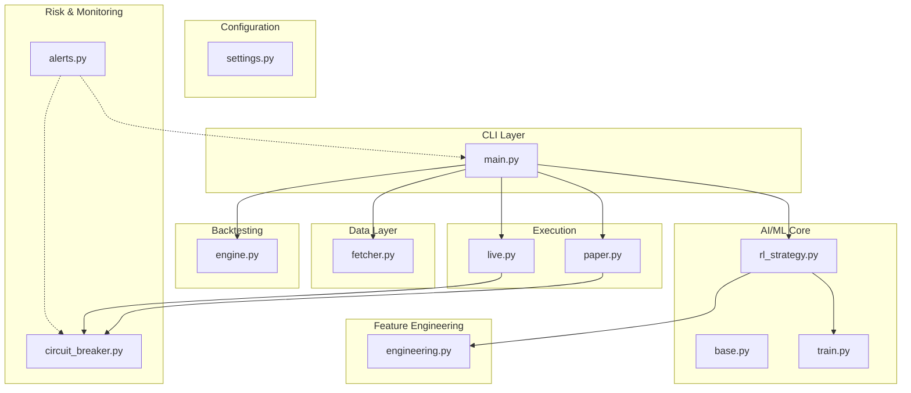
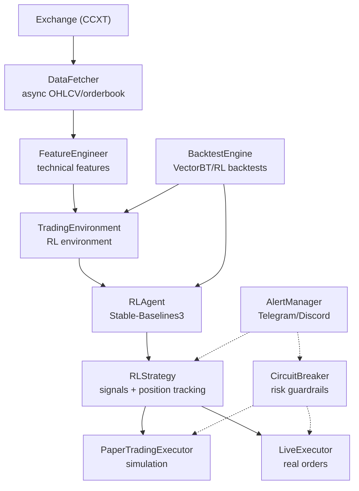
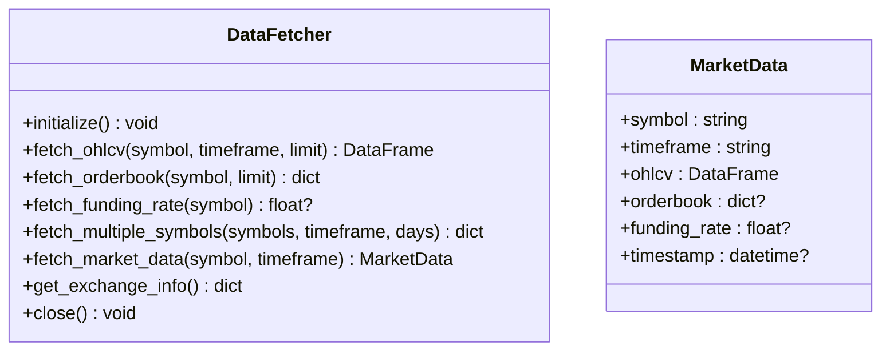
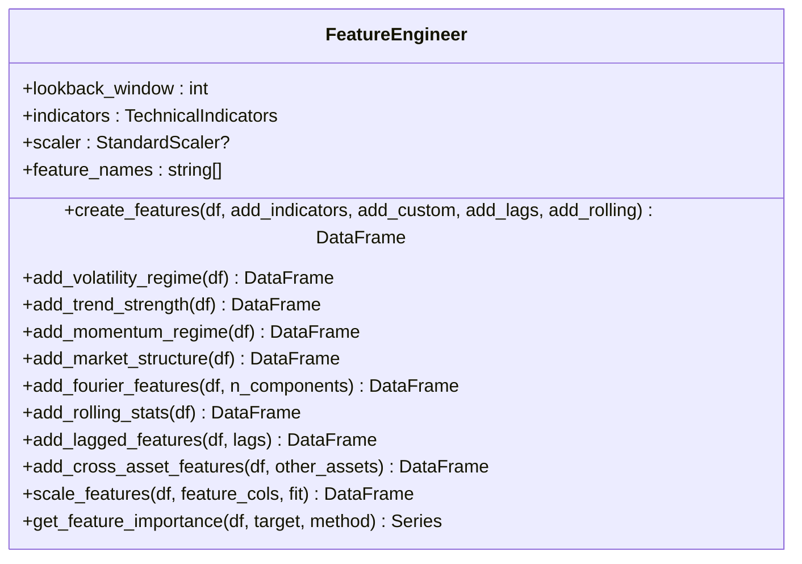
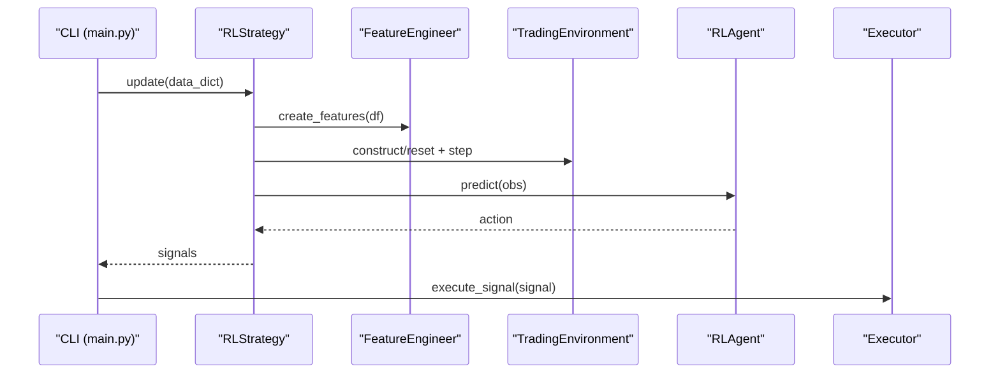
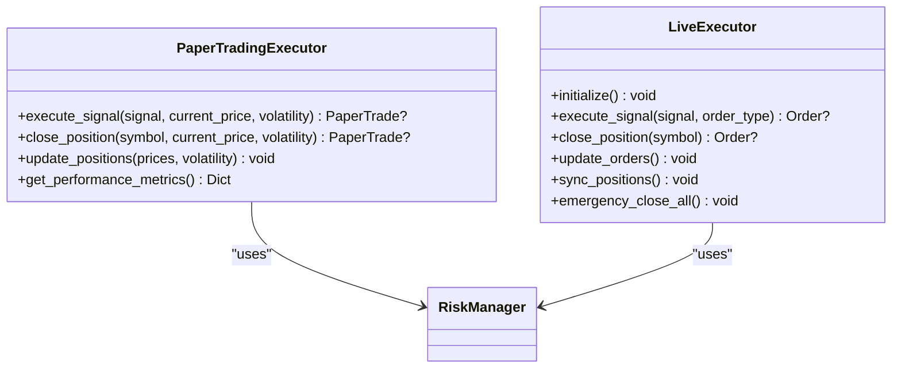
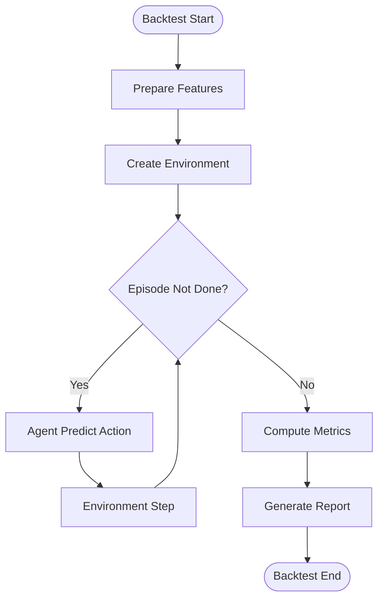
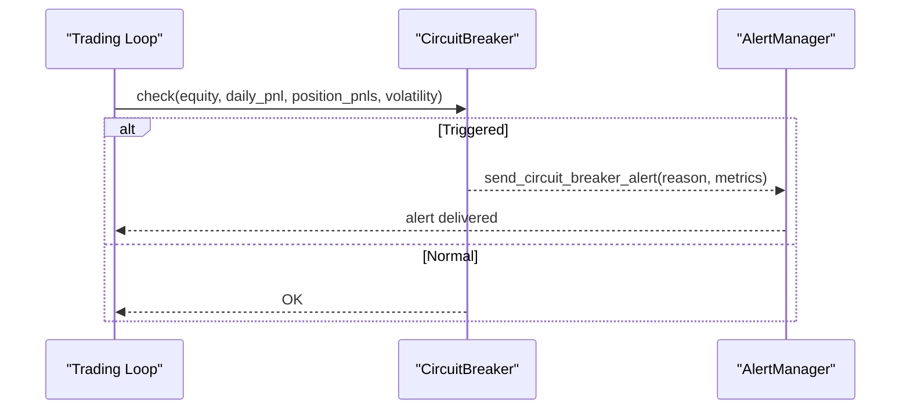
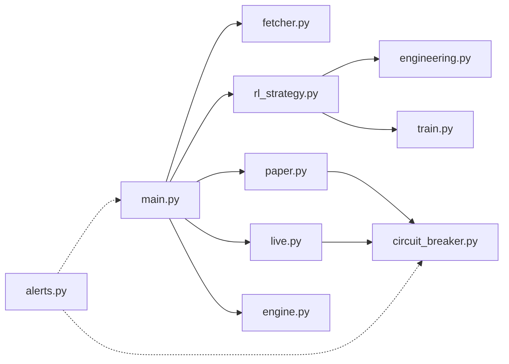
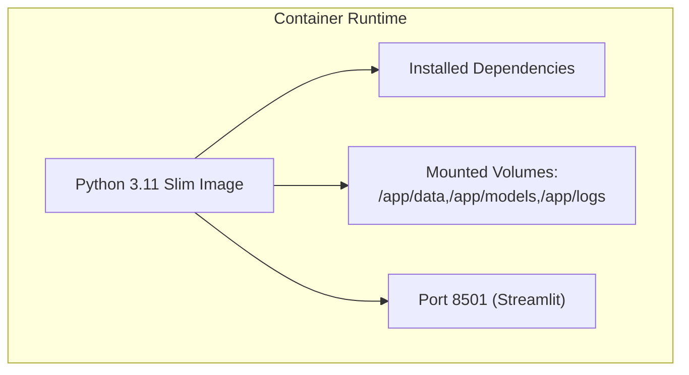

# Architecture Overview

<cite>
**Referenced Files in This Document**
- [main.py](file://trading_bot/main.py)
- [settings.py](file://trading_bot/config/settings.py)
- [fetcher.py](file://trading_bot/data/fetcher.py)
- [engine.py](file://trading_bot/backtest/engine.py)
- [paper.py](file://trading_bot/execution/paper.py)
- [live.py](file://trading_bot/execution/live.py)
- [alerts.py](file://trading_bot/monitoring/alerts.py)
- [circuit_breaker.py](file://trading_bot/risk/circuit_breaker.py)
- [rl_strategy.py](file://trading_bot/strategy/rl_strategy.py)
- [base.py](file://trading_bot/strategy/base.py)
- [engineering.py](file://trading_bot/features/engineering.py)
- [train.py](file://trading_bot/models/train.py)
- [Dockerfile](file://Dockerfile)
- [requirements.txt](file://requirements.txt)
</cite>

## Table of Contents
1. [Introduction](#introduction)
2. [Project Structure](#project-structure)
3. [Core Components](#core-components)
4. [Architecture Overview](#architecture-overview)
5. [Detailed Component Analysis](#detailed-component-analysis)
6. [Dependency Analysis](#dependency-analysis)
7. [Performance Considerations](#performance-considerations)
8. [Troubleshooting Guide](#troubleshooting-guide)
9. [Conclusion](#conclusion)
10. [Appendices](#appendices)

## Introduction
This document presents the architectural blueprint of the AI Trading Bot system. It describes the end-to-end data flow from market data acquisition via CCXT, through advanced feature engineering, to reinforcement learning (RL) models and automated trading execution. The system is modular, separating concerns into a data layer, feature engineering, AI/ML core, trading engine, and monitoring systems. It also documents infrastructure requirements, technology stack choices, system boundaries, scalability considerations, and deployment topology. Finally, it explains how architectural patterns such as Factory, Observer, Strategy, and Command are implemented across the system.

## Project Structure
The project follows a feature-based module layout under trading_bot with clear separation of responsibilities:
- config: Centralized settings and logging configuration
- data: Asynchronous market data fetching and storage abstractions
- features: Technical indicators and feature engineering utilities
- strategy: Strategy base classes and RL-based strategy implementation
- execution: Paper and live trading executors
- backtest: VectorBT-backed backtesting engine
- risk: Risk management and circuit breaker mechanisms
- monitoring: Alerting and dashboard integration
- tests: Configuration and risk-related unit tests

**Diagram sources**
- [main.py:1-347](file://trading_bot/main.py#L1-L347)
- [settings.py:1-176](file://trading_bot/config/settings.py#L1-L176)
- [fetcher.py:1-331](file://trading_bot/data/fetcher.py#L1-L331)
- [engineering.py:1-442](file://trading_bot/features/engineering.py#L1-L442)
- [rl_strategy.py:1-285](file://trading_bot/strategy/rl_strategy.py#L1-L285)
- [base.py:1-136](file://trading_bot/strategy/base.py#L1-L136)
- [train.py:1-446](file://trading_bot/models/train.py#L1-L446)
- [paper.py:1-392](file://trading_bot/execution/paper.py#L1-L392)
- [live.py:1-364](file://trading_bot/execution/live.py#L1-L364)
- [engine.py:1-418](file://trading_bot/backtest/engine.py#L1-L418)
- [circuit_breaker.py:1-336](file://trading_bot/risk/circuit_breaker.py#L1-L336)
- [alerts.py:1-311](file://trading_bot/monitoring/alerts.py#L1-L311)

**Section sources**
- [main.py:1-347](file://trading_bot/main.py#L1-L347)
- [settings.py:1-176](file://trading_bot/config/settings.py#L1-L176)

## Core Components
- CLI and Orchestration: The main entry point coordinates commands for data fetching, training, backtesting, and runtime trading loops. It wires together configuration, data fetchers, strategies, executors, and monitoring.
- Configuration: Centralized settings with validation and environment-driven overrides, including exchange credentials, trading parameters, risk controls, and notification channels.
- Data Layer: Async CCXT-based market data fetcher supporting OHLCV retrieval, order book, and funding rates with retry and rate-limiting.
- Feature Engineering: Comprehensive technical feature creation including volatility regimes, trend strength, momentum, market structure, and temporal harmonics.
- AI/ML Core: RL strategy wrapper around Stable-Baselines3 agents with environment orchestration and hyperparameter optimization.
- Execution Engine: Dual-mode executor supporting paper trading simulation and live trading with risk checks and order lifecycle management.
- Backtesting: VectorBT-based engine and RL-specific backtester producing performance metrics and reports.
- Risk and Monitoring: Circuit breakers, emergency stops, and alerting to Telegram/Discord with structured alert history.

**Section sources**
- [main.py:1-347](file://trading_bot/main.py#L1-L347)
- [settings.py:1-176](file://trading_bot/config/settings.py#L1-L176)
- [fetcher.py:1-331](file://trading_bot/data/fetcher.py#L1-L331)
- [engineering.py:1-442](file://trading_bot/features/engineering.py#L1-L442)
- [rl_strategy.py:1-285](file://trading_bot/strategy/rl_strategy.py#L1-L285)
- [paper.py:1-392](file://trading_bot/execution/paper.py#L1-L392)
- [live.py:1-364](file://trading_bot/execution/live.py#L1-L364)
- [engine.py:1-418](file://trading_bot/backtest/engine.py#L1-L418)
- [circuit_breaker.py:1-336](file://trading_bot/risk/circuit_breaker.py#L1-L336)
- [alerts.py:1-311](file://trading_bot/monitoring/alerts.py#L1-L311)

## Architecture Overview
The system implements a production-grade, modular architecture with clear boundaries and asynchronous processing. The data flow proceeds from CCXT fetchers to feature engineering, then to RL models, and finally to execution engines. Observability and risk controls are integrated throughout.

**Diagram sources**
- [fetcher.py:1-331](file://trading_bot/data/fetcher.py#L1-L331)
- [engineering.py:1-442](file://trading_bot/features/engineering.py#L1-L442)
- [rl_strategy.py:1-285](file://trading_bot/strategy/rl_strategy.py#L1-L285)
- [paper.py:1-392](file://trading_bot/execution/paper.py#L1-L392)
- [live.py:1-364](file://trading_bot/execution/live.py#L1-L364)
- [circuit_breaker.py:1-336](file://trading_bot/risk/circuit_breaker.py#L1-L336)
- [alerts.py:1-311](file://trading_bot/monitoring/alerts.py#L1-L311)
- [engine.py:1-418](file://trading_bot/backtest/engine.py#L1-L418)

## Detailed Component Analysis

### Data Layer: CCXT Fetcher
- Responsibilities: Async market data retrieval, order book, funding rates, retry with exponential backoff, rate limiting, and comprehensive market metadata.
- Patterns: Factory-like initialization of exchange clients, Observer-style retries, Command-style fetch commands.
- Scalability: Semaphore-based concurrency control; parallel symbol fetching; configurable testnet support.

**Diagram sources**
- [fetcher.py:1-331](file://trading_bot/data/fetcher.py#L1-L331)

**Section sources**
- [fetcher.py:1-331](file://trading_bot/data/fetcher.py#L1-L331)

### Feature Engineering
- Responsibilities: Comprehensive technical feature generation including volatility regimes, trend strength, momentum, market structure, rolling statistics, lags, and Fourier harmonics.
- Patterns: Strategy pattern for adding modular feature families; scaling utilities; feature importance computation.
- Complexity: Rolling computations and FFT introduce O(N·W) and O(N log N) operations depending on window sizes and transforms.

**Diagram sources**
- [engineering.py:1-442](file://trading_bot/features/engineering.py#L1-L442)

**Section sources**
- [engineering.py:1-442](file://trading_bot/features/engineering.py#L1-L442)

### AI/ML Core: RL Strategy and Training
- RL Strategy: Wraps an RL agent, prepares features, constructs environments, generates signals, and manages positions.
- Training Pipeline: Hyperparameter optimization with Optuna, walk-forward validation, environment creation, and model persistence.
- Patterns: Strategy pattern for signal generation, Factory pattern for environment construction, Command pattern for training/evaluation.

**Diagram sources**
- [rl_strategy.py:1-285](file://trading_bot/strategy/rl_strategy.py#L1-L285)
- [engineering.py:1-442](file://trading_bot/features/engineering.py#L1-L442)
- [train.py:1-446](file://trading_bot/models/train.py#L1-L446)

**Section sources**
- [rl_strategy.py:1-285](file://trading_bot/strategy/rl_strategy.py#L1-L285)
- [train.py:1-446](file://trading_bot/models/train.py#L1-L446)

### Execution Engines: Paper and Live
- Paper Trading: Simulates trades with slippage and commission modeling, maintains equity curves, and integrates with risk manager.
- Live Trading: Places real market/limit orders via CCXT, enforces rate limits, applies risk checks, and synchronizes positions.
- Patterns: Strategy pattern for execution modes, Observer pattern for order updates, Command pattern for order placement.

**Diagram sources**
- [paper.py:1-392](file://trading_bot/execution/paper.py#L1-L392)
- [live.py:1-364](file://trading_bot/execution/live.py#L1-L364)

**Section sources**
- [paper.py:1-392](file://trading_bot/execution/paper.py#L1-L392)
- [live.py:1-364](file://trading_bot/execution/live.py#L1-L364)

### Backtesting Engine
- VectorBT-based backtests and RL-specific backtests produce comprehensive metrics and equity curves.
- Walk-forward and Monte Carlo simulation support robustness assessment.

**Diagram sources**
- [engine.py:1-418](file://trading_bot/backtest/engine.py#L1-L418)

**Section sources**
- [engine.py:1-418](file://trading_bot/backtest/engine.py#L1-L418)

### Risk Controls and Monitoring
- Circuit Breaker: Multi-threshold guardrails with warning/alert/critical/emergency levels and automatic actions.
- Alert Manager: Asynchronous notifications to Telegram and Discord with structured alert history.

**Diagram sources**
- [circuit_breaker.py:1-336](file://trading_bot/risk/circuit_breaker.py#L1-L336)
- [alerts.py:1-311](file://trading_bot/monitoring/alerts.py#L1-L311)

**Section sources**
- [circuit_breaker.py:1-336](file://trading_bot/risk/circuit_breaker.py#L1-L336)
- [alerts.py:1-311](file://trading_bot/monitoring/alerts.py#L1-L311)

## Dependency Analysis
The system exhibits low coupling and high cohesion across modules. Dependencies primarily flow inward from CLI to components, with data and feature engineering feeding the strategy and training pipeline. Risk and monitoring are cross-cutting.

**Diagram sources**
- [main.py:1-347](file://trading_bot/main.py#L1-L347)
- [fetcher.py:1-331](file://trading_bot/data/fetcher.py#L1-L331)
- [rl_strategy.py:1-285](file://trading_bot/strategy/rl_strategy.py#L1-L285)
- [paper.py:1-392](file://trading_bot/execution/paper.py#L1-L392)
- [live.py:1-364](file://trading_bot/execution/live.py#L1-L364)
- [engine.py:1-418](file://trading_bot/backtest/engine.py#L1-L418)
- [circuit_breaker.py:1-336](file://trading_bot/risk/circuit_breaker.py#L1-L336)
- [alerts.py:1-311](file://trading_bot/monitoring/alerts.py#L1-L311)
- [engineering.py:1-442](file://trading_bot/features/engineering.py#L1-L442)
- [train.py:1-446](file://trading_bot/models/train.py#L1-L446)

**Section sources**
- [main.py:1-347](file://trading_bot/main.py#L1-L347)
- [requirements.txt:1-46](file://requirements.txt#L1-L46)

## Performance Considerations
- Asynchronous I/O: CCXT fetches and alerting use async/await to maximize throughput.
- Feature Computation: Rolling and FFT operations are optimized by vectorization; consider caching and incremental updates for long-running loops.
- Model Training: Hyperparameter optimization leverages Optuna pruning; use smaller episodes during optimization and full training with walk-forward validation.
- Execution Latency: Live executor enforces rate limits; paper trading simulates realistic slippage and commissions to avoid optimistic bias.
- Memory: Data buffers keep recent windows; ensure periodic trimming to bound memory growth.

[No sources needed since this section provides general guidance]

## Troubleshooting Guide
- Exchange Initialization Failures: Verify API keys and testnet configuration; the fetcher logs initialization errors and raises exceptions.
- Circuit Breaker Triggers: Review alert messages and recent events; the system pauses trading until cooldown ends.
- Live Order Placement Errors: Inspect rate limits and risk checks; emergency close can liquidate all positions.
- Backtest Discrepancies: Confirm feature engineering parity between training and backtesting; ensure environment seeds and hyperparameters match.

**Section sources**
- [fetcher.py:66-98](file://trading_bot/data/fetcher.py#L66-L98)
- [circuit_breaker.py:186-235](file://trading_bot/risk/circuit_breaker.py#L186-L235)
- [live.py:178-223](file://trading_bot/execution/live.py#L178-L223)
- [engine.py:147-240](file://trading_bot/backtest/engine.py#L147-L240)

## Conclusion
The AI Trading Bot employs a clean, modular architecture with strong separation of concerns. The data layer, feature engineering, AI/ML core, execution engines, and monitoring systems integrate seamlessly around a central CLI orchestrator. Asynchronous design, robust risk controls, and comprehensive backtesting enable reliable production deployments. The documented patterns (Factory, Observer, Strategy, Command) guide maintainability and extensibility.

[No sources needed since this section summarizes without analyzing specific files]

## Appendices

### Infrastructure Requirements and Technology Stack
- Core: Python 3.11, NumPy, Pandas, Pydantic, Typer, Rich
- Data & Exchange: CCXT, aiohttp, websockets
- Technical Analysis: Pandas enhancements (via pandas-ta)
- ML & RL: Stable-Baselines3, Gymnasium, Optuna, SHAP
- Backtesting: VectorBT
- Observability: Structlog, Telegram/Discord integrations, Streamlit dashboard
- Utilities: schedule, tenacity, cachetools, orjson, pytz

**Section sources**
- [requirements.txt:1-46](file://requirements.txt#L1-L46)

### Deployment Topology and Containerization
- Container image builds on Python slim base, installs system and Python dependencies, exposes dashboard port, and sets health checks.
- Recommended deployment: Single container with mounted volumes for data, models, and logs; optional sidecar for Redis if needed; environment variables for secrets.

**Diagram sources**
- [Dockerfile:1-44](file://Dockerfile#L1-L44)

**Section sources**
- [Dockerfile:1-44](file://Dockerfile#L1-L44)

### Architectural Patterns in Use
- Factory: Environment creation for training and backtesting; exchange client instantiation.
- Observer: Retry decorators and alert delivery; order status updates; circuit breaker event handlers.
- Strategy: Base strategy interface, RL strategy implementation, paper/live execution modes.
- Command: Fetch commands (OHLCV, orderbook), order placement commands, emergency stop commands.

**Section sources**
- [rl_strategy.py:1-285](file://trading_bot/strategy/rl_strategy.py#L1-L285)
- [paper.py:1-392](file://trading_bot/execution/paper.py#L1-L392)
- [live.py:1-364](file://trading_bot/execution/live.py#L1-L364)
- [alerts.py:1-311](file://trading_bot/monitoring/alerts.py#L1-L311)
- [circuit_breaker.py:1-336](file://trading_bot/risk/circuit_breaker.py#L1-L336)
- [fetcher.py:1-331](file://trading_bot/data/fetcher.py#L1-L331)