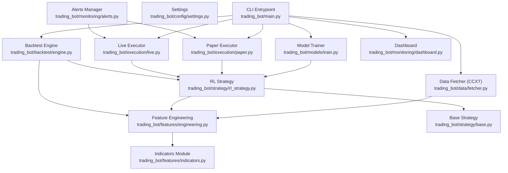
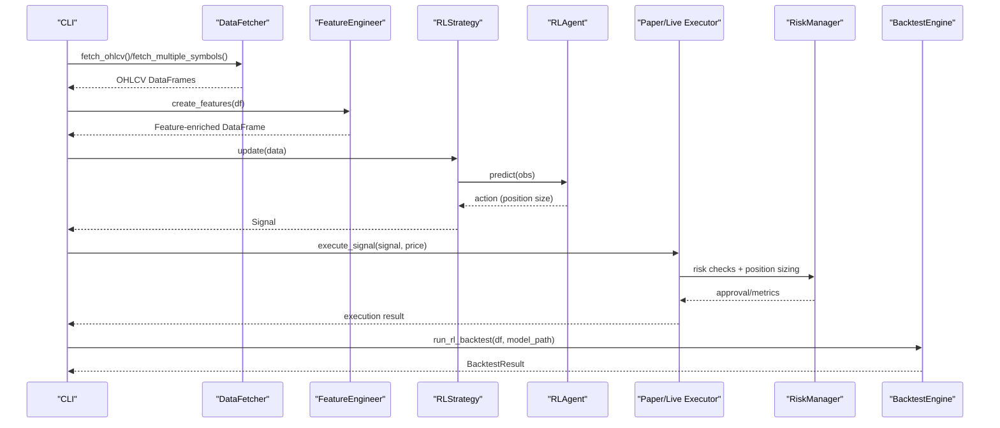
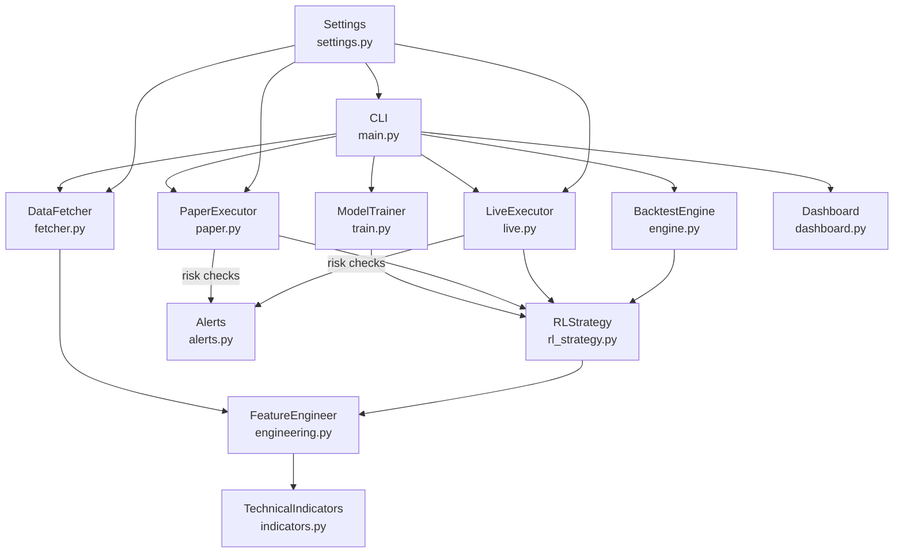

# Core Features

<cite>
**Referenced Files in This Document**
- [main.py](file://trading_bot/main.py)
- [engine.py](file://trading_bot/backtest/engine.py)
- [settings.py](file://trading_bot/config/settings.py)
- [fetcher.py](file://trading_bot/data/fetcher.py)
- [indicators.py](file://trading_bot/features/indicators.py)
- [engineering.py](file://trading_bot/features/engineering.py)
- [base.py](file://trading_bot/strategy/base.py)
- [rl_strategy.py](file://trading_bot/strategy/rl_strategy.py)
- [train.py](file://trading_bot/models/train.py)
- [live.py](file://trading_bot/execution/live.py)
- [paper.py](file://trading_bot/execution/paper.py)
- [alerts.py](file://trading_bot/monitoring/alerts.py)
- [dashboard.py](file://trading_bot/monitoring/dashboard.py)
</cite>

## Table of Contents
1. [Introduction](#introduction)
2. [Project Structure](#project-structure)
3. [Core Components](#core-components)
4. [Architecture Overview](#architecture-overview)
5. [Detailed Component Analysis](#detailed-component-analysis)
6. [Dependency Analysis](#dependency-analysis)
7. [Performance Considerations](#performance-considerations)
8. [Troubleshooting Guide](#troubleshooting-guide)
9. [Conclusion](#conclusion)

## Introduction
This document explains the AI Trading Bot’s core features and how they integrate to form a production-ready system. It covers the data pipeline with CCXT integration, feature engineering with 100+ technical indicators, reinforcement learning (RL) models (PPO/SAC) with environment orchestration, risk management, backtesting with VectorBT, and monitoring/alerts. Practical usage examples, configuration options, and performance characteristics are included to help operators deploy and maintain the system effectively.

## Project Structure
The system is organized around modular components:
- CLI entrypoint orchestrates commands for data fetching, training, backtesting, running, and dashboard launching.
- Data layer integrates CCXT for asynchronous market data retrieval.
- Feature engineering module builds robust technical features and regimes.
- Strategy layer encapsulates RL-based decision-making.
- Execution layer supports paper and live trading with risk controls.
- Backtesting engine evaluates strategies using VectorBT and custom environments.
- Monitoring and alerts notify operators of events and anomalies.
- Configuration centralizes settings and validation.

**Diagram sources**
- [main.py:1-347](file://trading_bot/main.py#L1-L347)
- [settings.py:1-176](file://trading_bot/config/settings.py#L1-L176)
- [fetcher.py:1-331](file://trading_bot/data/fetcher.py#L1-L331)
- [engineering.py:1-442](file://trading_bot/features/engineering.py#L1-L442)
- [indicators.py:1-294](file://trading_bot/features/indicators.py#L1-L294)
- [rl_strategy.py:1-285](file://trading_bot/strategy/rl_strategy.py#L1-L285)
- [base.py:1-136](file://trading_bot/strategy/base.py#L1-L136)
- [train.py:1-446](file://trading_bot/models/train.py#L1-L446)
- [paper.py:1-392](file://trading_bot/execution/paper.py#L1-L392)
- [live.py:1-364](file://trading_bot/execution/live.py#L1-L364)
- [engine.py:1-418](file://trading_bot/backtest/engine.py#L1-L418)
- [alerts.py:1-311](file://trading_bot/monitoring/alerts.py#L1-L311)
- [dashboard.py:1-328](file://trading_bot/monitoring/dashboard.py#L1-L328)

**Section sources**
- [main.py:1-347](file://trading_bot/main.py#L1-L347)
- [settings.py:1-176](file://trading_bot/config/settings.py#L1-L176)

## Core Components
- Data Pipeline with CCXT Integration: Asynchronous OHLCV retrieval, orderbook, and funding rate with retry and rate-limiting.
- Feature Engineering with 100+ Technical Indicators: Trend, momentum, volatility, volume, support/resistance, regime features, rolling stats, lags, and Fourier/cyclical features.
- RL Models (PPO/SAC) with Environment Orchestration: Training pipeline with hyperparameter optimization, walk-forward validation, and environment creation.
- Risk Management: Portfolio-level controls, position sizing, daily drawdown limits, and circuit breakers.
- Backtesting: VectorBT-powered portfolio testing and custom RL backtesting with performance metrics.
- Monitoring and Alerts: Telegram/Discord notifications, trade alerts, circuit breaker triggers, and daily reports.
- Execution: Paper trading simulator and live trading with exchange integration and risk checks.

**Section sources**
- [fetcher.py:1-331](file://trading_bot/data/fetcher.py#L1-L331)
- [engineering.py:1-442](file://trading_bot/features/engineering.py#L1-L442)
- [indicators.py:1-294](file://trading_bot/features/indicators.py#L1-L294)
- [train.py:1-446](file://trading_bot/models/train.py#L1-L446)
- [rl_strategy.py:1-285](file://trading_bot/strategy/rl_strategy.py#L1-L285)
- [paper.py:1-392](file://trading_bot/execution/paper.py#L1-L392)
- [live.py:1-364](file://trading_bot/execution/live.py#L1-L364)
- [engine.py:1-418](file://trading_bot/backtest/engine.py#L1-L418)
- [alerts.py:1-311](file://trading_bot/monitoring/alerts.py#L1-L311)
- [dashboard.py:1-328](file://trading_bot/monitoring/dashboard.py#L1-L328)

## Architecture Overview
The system follows a modular, event-driven loop:
- CLI orchestrates lifecycle commands.
- DataFetcher retrieves market data asynchronously.
- FeatureEngineer enriches data with technical features.
- RLStrategy generates signals using a trained RL agent.
- Execution layer (paper/live) validates risk and executes orders.
- BacktestEngine evaluates strategies via VectorBT or RL environment.
- Alerts and Dashboard keep operators informed.

**Diagram sources**
- [main.py:68-212](file://trading_bot/main.py#L68-L212)
- [fetcher.py:111-275](file://trading_bot/data/fetcher.py#L111-L275)
- [engineering.py:31-85](file://trading_bot/features/engineering.py#L31-L85)
- [rl_strategy.py:79-181](file://trading_bot/strategy/rl_strategy.py#L79-L181)
- [paper.py:115-208](file://trading_bot/execution/paper.py#L115-L208)
- [live.py:115-223](file://trading_bot/execution/live.py#L115-L223)
- [engine.py:147-240](file://trading_bot/backtest/engine.py#L147-L240)

## Detailed Component Analysis

### Data Pipeline with CCXT Integration
Purpose:
- Provide reliable, asynchronous market data for research and live trading.
Implementation approach:
- Async context manager initializes CCXT exchange with optional API keys and sandbox mode.
- Retry decorator handles transient network/exchange errors.
- Parallel fetching for multiple symbols.
- Optional orderbook and funding rate enrichment.
Key configuration:
- Exchange ID, API keys, testnet flag, rate limiter semaphore.
Performance characteristics:
- Concurrent requests capped; exponential backoff on failures; minimal latency via async IO.

Usage example:
- Fetch single symbol OHLCV for a given timeframe and limit.
- Fetch multiple symbols over a lookback window.
- Retrieve comprehensive MarketData with orderbook imbalance and spread.

**Section sources**
- [fetcher.py:32-105](file://trading_bot/data/fetcher.py#L32-L105)
- [fetcher.py:111-164](file://trading_bot/data/fetcher.py#L111-L164)
- [fetcher.py:239-275](file://trading_bot/data/fetcher.py#L239-L275)
- [fetcher.py:277-331](file://trading_bot/data/fetcher.py#L277-L331)

### Feature Engineering with 100+ Technical Indicators
Purpose:
- Transform raw OHLCV into a rich feature set for ML/RL models.
Implementation approach:
- Trend: EMAs, SMAs, MACD, ADX.
- Momentum: RSI, Stochastic, Williams %R, ROC.
- Volatility: Bollinger Bands, ATR, Historical Volatility, Donchian Channels.
- Volume: OBV, VWAP, EMA and ratios.
- Price features: returns, log returns, body/wick ratios, gaps.
- Regime features: realized volatility, volatility regime, trend strength, momentum regime, market structure, volatility-of-volatility.
- Advanced: rolling moments, lags, cross-asset correlations, Fourier components, cyclical time features, scaling.
Integration:
- FeatureEngineer composes TechnicalIndicators and adds custom regime features.
- Drops NaN rows post-engineering.

Usage example:
- Create features for a single symbol.
- Scale features using robust scaling.
- Compute feature importance via mutual information or correlation.

**Section sources**
- [indicators.py:20-257](file://trading_bot/features/indicators.py#L20-L257)
- [engineering.py:31-85](file://trading_bot/features/engineering.py#L31-L85)
- [engineering.py:87-278](file://trading_bot/features/engineering.py#L87-L278)
- [engineering.py:280-335](file://trading_bot/features/engineering.py#L280-L335)
- [engineering.py:337-374](file://trading_bot/features/engineering.py#L337-L374)
- [engineering.py:376-404](file://trading_bot/features/engineering.py#L376-L404)
- [engineering.py:406-442](file://trading_bot/features/engineering.py#L406-L442)

### RL Models (PPO/SAC) with Environment Orchestration
Purpose:
- Train and evaluate RL agents on trading tasks.
Implementation approach:
- ModelTrainer prepares data, optimizes hyperparameters with Optuna, creates environments, trains agents, and saves artifacts.
- RLStrategy loads a trained agent and generates signals from observations.
- Walk-forward validation supported for out-of-sample robustness.
Key configuration:
- Model type (PPO/SAC), timesteps, learning rate, batch size, gamma, entropy coefficient, PPO-specific parameters.
Performance characteristics:
- Hyperparameter optimization reduces overfitting; walk-forward ensures time-series validity.

Usage example:
- Train a PPO agent on feature-rich data with hyperparameter optimization.
- Evaluate on a held-out test set using environment metrics.
- Run walk-forward validation across multiple folds.

**Section sources**
- [train.py:23-185](file://trading_bot/models/train.py#L23-L185)
- [train.py:187-244](file://trading_bot/models/train.py#L187-L244)
- [train.py:310-383](file://trading_bot/models/train.py#L310-L383)
- [rl_strategy.py:58-66](file://trading_bot/strategy/rl_strategy.py#L58-L66)
- [rl_strategy.py:223-270](file://trading_bot/strategy/rl_strategy.py#L223-L270)

### Risk Management Systems
Purpose:
- Enforce portfolio-level risk controls and position sizing.
Implementation approach:
- RiskManager tracks exposures, daily drawdown, open positions, and enforces limits.
- Circuit breakers halt trading under severe conditions.
- Position sizing derived from risk-per-trade and exposure caps.
Integration:
- Paper and Live executors consult RiskManager before opening/closing positions.

Usage example:
- Check if a new position can be opened given current exposure and drawdown.
- Close all positions during emergency scenarios.
- Monitor portfolio metrics for daily reporting.

**Section sources**
- [paper.py:115-208](file://trading_bot/execution/paper.py#L115-L208)
- [paper.py:210-284](file://trading_bot/execution/paper.py#L210-L284)
- [paper.py:313-380](file://trading_bot/execution/paper.py#L313-L380)
- [live.py:115-223](file://trading_bot/execution/live.py#L115-L223)
- [live.py:225-296](file://trading_bot/execution/live.py#L225-L296)
- [live.py:357-364](file://trading_bot/execution/live.py#L357-L364)

### Backtesting Capabilities with VectorBT
Purpose:
- Comprehensive strategy evaluation with realistic transaction costs and slippage.
Implementation approach:
- BacktestEngine supports VectorBT portfolio.from_signals and RL environment-based backtests.
- Computes Sharpe, Sortino, Calmar, max drawdown, win rate, profit factor, expectancy, and equity curves.
- Includes walk-forward and Monte Carlo simulation helpers.

Usage example:
- Run vectorbt backtest with entry/exit signals.
- Execute RL backtest using a trained model and environment metrics.
- Generate detailed backtest reports and equity charts.

**Section sources**
- [engine.py:41-146](file://trading_bot/backtest/engine.py#L41-L146)
- [engine.py:147-240](file://trading_bot/backtest/engine.py#L147-L240)
- [engine.py:242-295](file://trading_bot/backtest/engine.py#L242-L295)
- [engine.py:297-356](file://trading_bot/backtest/engine.py#L297-L356)
- [engine.py:358-417](file://trading_bot/backtest/engine.py#L358-L417)

### Monitoring and Alerts
Purpose:
- Notify operators of trades, errors, and circuit breaker events.
Implementation approach:
- AlertManager supports Telegram and Discord channels with structured messages and emoji/colors.
- Daily reports and trade execution alerts; circuit breaker alerts include portfolio metrics.
- Dashboard provides charts and summaries (placeholder in current implementation).

Usage example:
- Send trade alerts with symbol, side, price, and realized PnL.
- Emit circuit breaker alerts with reason and current metrics.
- Launch dashboard to visualize equity curves and trade distributions.

**Section sources**
- [alerts.py:23-180](file://trading_bot/monitoring/alerts.py#L23-L180)
- [alerts.py:181-240](file://trading_bot/monitoring/alerts.py#L181-L240)
- [alerts.py:242-284](file://trading_bot/monitoring/alerts.py#L242-L284)
- [dashboard.py:16-254](file://trading_bot/monitoring/dashboard.py#L16-L254)
- [dashboard.py:258-328](file://trading_bot/monitoring/dashboard.py#L258-L328)

### Execution Layer: Paper vs Live
Purpose:
- Simulate trading (paper) and connect to live exchanges with risk controls.
Implementation approach:
- PaperTradingExecutor simulates slippage and commissions, maintains equity curve, and computes performance metrics.
- LiveExecutor connects to exchange via DataFetcher, applies risk checks, and places market/limit orders.
- Both expose order lifecycle and position management.

Usage example:
- Execute a BUY signal in paper mode with slippage and commission applied.
- Place a market order in live mode after risk approval and update positions.

**Section sources**
- [paper.py:36-208](file://trading_bot/execution/paper.py#L36-L208)
- [paper.py:210-284](file://trading_bot/execution/paper.py#L210-L284)
- [paper.py:286-380](file://trading_bot/execution/paper.py#L286-L380)
- [live.py:38-223](file://trading_bot/execution/live.py#L38-L223)
- [live.py:225-296](file://trading_bot/execution/live.py#L225-L296)

## Dependency Analysis
Component coupling and integration highlights:
- CLI depends on DataFetcher, FeatureEngineer, RLStrategy, ModelTrainer, BacktestEngine, Paper/Live Executors, Alerts, and Dashboard.
- RLStrategy depends on FeatureEngineer and RLAgent; BacktestEngine depends on FeatureEngineer and TradingEnvironment.
- Paper/Live Executors depend on RiskManager and DataFetcher.
- Alerts integrate with executors and risk manager for notifications.
- Settings centralizes configuration consumed across modules.

**Diagram sources**
- [main.py:1-347](file://trading_bot/main.py#L1-L347)
- [settings.py:1-176](file://trading_bot/config/settings.py#L1-L176)
- [fetcher.py:1-331](file://trading_bot/data/fetcher.py#L1-L331)
- [engineering.py:1-442](file://trading_bot/features/engineering.py#L1-L442)
- [indicators.py:1-294](file://trading_bot/features/indicators.py#L1-L294)
- [rl_strategy.py:1-285](file://trading_bot/strategy/rl_strategy.py#L1-L285)
- [train.py:1-446](file://trading_bot/models/train.py#L1-L446)
- [paper.py:1-392](file://trading_bot/execution/paper.py#L1-L392)
- [live.py:1-364](file://trading_bot/execution/live.py#L1-L364)
- [engine.py:1-418](file://trading_bot/backtest/engine.py#L1-L418)
- [alerts.py:1-311](file://trading_bot/monitoring/alerts.py#L1-L311)
- [dashboard.py:1-328](file://trading_bot/monitoring/dashboard.py#L1-L328)

**Section sources**
- [main.py:1-347](file://trading_bot/main.py#L1-L347)

## Performance Considerations
- Data fetching: Use async concurrency with rate limiting; retry transient errors; parallelize multi-symbol fetches.
- Feature engineering: Prefer rolling computations with appropriate windows; drop NaNs after feature creation; scale features to stabilize training.
- RL training: Optimize hyperparameters with Optuna; use walk-forward validation; monitor overfitting via eval environments.
- Execution: Apply realistic slippage/commissions in paper mode; enforce rate limits in live mode; circuit breakers reduce drawdown risk.
- Backtesting: VectorBT accounts for fees/slippage; compute rolling metrics and drawdowns; generate equity curves and trade distributions.

[No sources needed since this section provides general guidance]

## Troubleshooting Guide
Common issues and resolutions:
- Exchange initialization failures: Verify API keys and testnet configuration; check exchange availability and rate limits.
- Data fetch errors: Inspect retry logs; confirm symbol availability and timeframe support.
- Feature engineering NaNs: Ensure sufficient lookback windows; validate indicator dependencies (e.g., EMAs before ratios).
- RL training instability: Reduce learning rate; increase batch size; tune entropy coefficient; use walk-forward validation.
- Risk breaches: Review daily drawdown thresholds and exposure caps; adjust risk-per-trade and position size limits.
- Alerts not sent: Confirm Telegram/Discord credentials and webhook URLs; check network connectivity and session lifecycle.

**Section sources**
- [fetcher.py:66-98](file://trading_bot/data/fetcher.py#L66-L98)
- [alerts.py:54-101](file://trading_bot/monitoring/alerts.py#L54-L101)
- [alerts.py:103-148](file://trading_bot/monitoring/alerts.py#L103-L148)
- [paper.py:115-208](file://trading_bot/execution/paper.py#L115-L208)
- [live.py:115-223](file://trading_bot/execution/live.py#L115-L223)

## Conclusion
The AI Trading Bot integrates a robust data pipeline, comprehensive feature engineering, RL-based strategies, strict risk controls, and end-to-end backtesting and monitoring. Its modular design enables seamless experimentation, deployment, and operation across paper and live modes, with clear configuration and observability.

[No sources needed since this section summarizes without analyzing specific files]