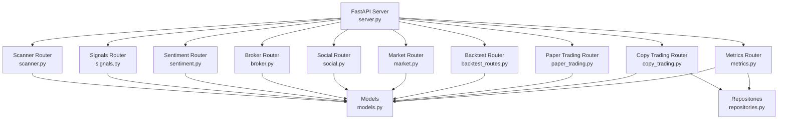
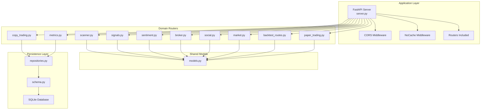
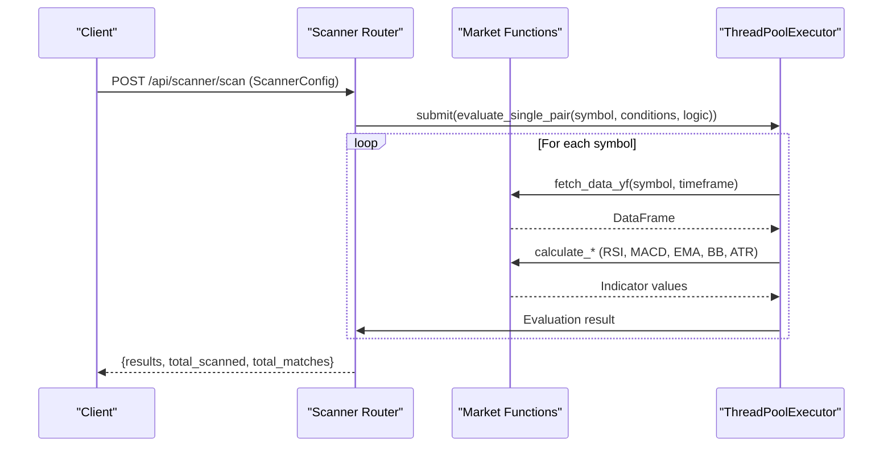
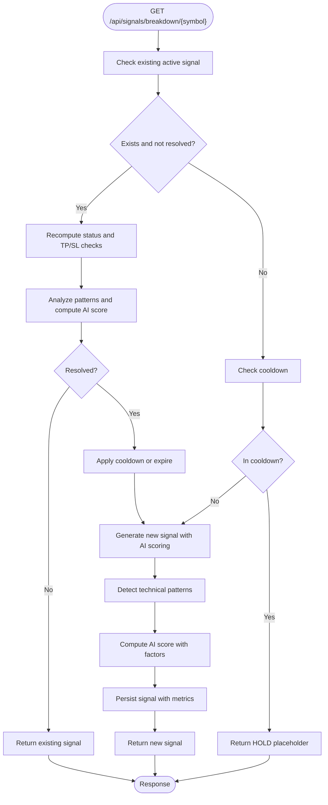
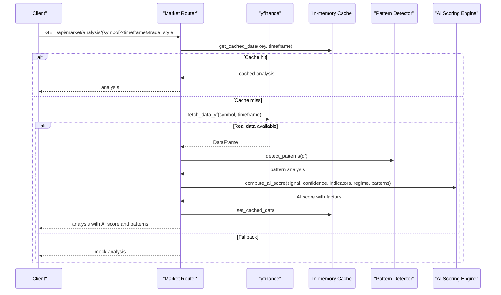
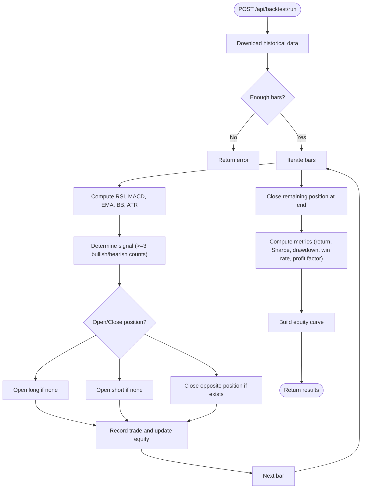
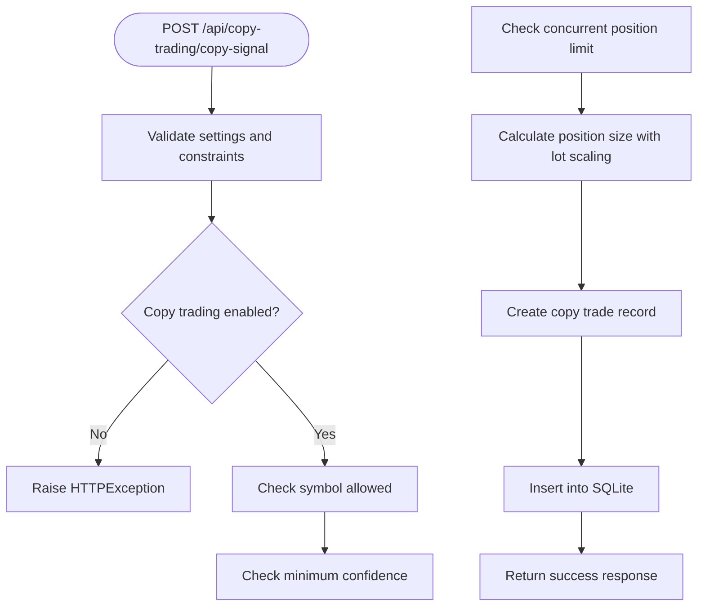
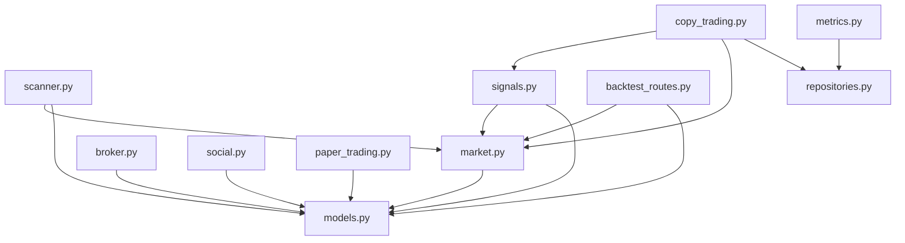

# API Routes

<cite>
**Referenced Files in This Document**
- [server.py](file://trading_bot/api/server.py)
- [scanner.py](file://trading_bot/api/routes/scanner.py)
- [signals.py](file://trading_bot/api/routes/signals.py)
- [sentiment.py](file://trading_bot/api/routes/sentiment.py)
- [broker.py](file://trading_bot/api/routes/broker.py)
- [social.py](file://trading_bot/api/routes/social.py)
- [market.py](file://trading_bot/api/routes/market.py)
- [backtest_routes.py](file://trading_bot/api/routes/backtest_routes.py)
- [paper_trading.py](file://trading_bot/api/routes/paper_trading.py)
- [copy_trading.py](file://trading_bot/api/routes/copy_trading.py)
- [metrics.py](file://trading_bot/api/routes/metrics.py)
- [models.py](file://trading_bot/api/models.py)
- [repositories.py](file://trading_bot/persistence/repositories.py)
- [schema.py](file://trading_bot/persistence/schema.py)
</cite>

## Update Summary
**Changes Made**
- Added comprehensive copy trading API with SQLite persistence
- Enhanced signals API with advanced pattern recognition and AI scoring
- Expanded market data API with AI scoring and pattern detection
- Added metrics API for performance tracking and signal accuracy
- Updated architecture diagrams to reflect new components

## Table of Contents
1. [Introduction](#introduction)
2. [Project Structure](#project-structure)
3. [Core Components](#core-components)
4. [Architecture Overview](#architecture-overview)
5. [Detailed Component Analysis](#detailed-component-analysis)
6. [Dependency Analysis](#dependency-analysis)
7. [Performance Considerations](#performance-considerations)
8. [Troubleshooting Guide](#troubleshooting-guide)
9. [Conclusion](#conclusion)

## Introduction
This document provides a comprehensive overview of the API routes powering the AI Trading Bot backend. It explains the routing structure, endpoint categories, request/response models, and operational behavior across modules such as market data, technical analysis, scanning, signals, sentiment, broker connectivity, social features, backtesting, paper trading, copy trading, and metrics tracking. The goal is to enable developers and integrators to understand how to interact with the API and leverage its capabilities effectively.

## Project Structure
The API is implemented as a FastAPI application with modular routers grouped by functional domain. Each router defines endpoints under a consistent `/api/<module>` prefix, enabling clear separation of concerns and scalable maintenance.

**Diagram sources**
- [server.py:63-78](file://trading_bot/api/server.py#L63-L78)
- [scanner.py:19](file://trading_bot/api/routes/scanner.py#L19)
- [signals.py:18](file://trading_bot/api/routes/signals.py#L18)
- [sentiment.py](file://trading_bot/api/routes/sentiment.py)
- [broker.py:15](file://trading_bot/api/routes/broker.py#L15)
- [social.py:12](file://trading_bot/api/routes/social.py#L12)
- [market.py:22](file://trading_bot/api/routes/market.py#L22)
- [backtest_routes.py:23](file://trading_bot/api/routes/backtest_routes.py#L23)
- [paper_trading.py:7](file://trading_bot/api/routes/paper_trading.py#L7)
- [copy_trading.py:13](file://trading_bot/api/routes/copy_trading.py#L13)
- [metrics.py:9](file://trading_bot/api/routes/metrics.py#L9)
- [models.py:1-142](file://trading_bot/api/models.py#L1-L142)

**Section sources**
- [server.py:63-78](file://trading_bot/api/server.py#L63-L78)
- [models.py:1-142](file://trading_bot/api/models.py#L1-L142)

## Core Components
- Scanner: Evaluates market conditions across multiple instruments and timeframes using technical indicators to produce ranked matches and trade signals.
- Signals: Generates persistent trading signals with entry zones, stop-loss, and take-profit targets, including lifecycle management, status computation, and advanced AI scoring with pattern recognition.
- Market: Provides OHLCV data retrieval (real via yfinance with fallback to synthetic), technical analysis, multi-timeframe evaluations, and AI scoring with pattern detection.
- Sentiment: Aggregates and exposes market sentiment metrics for symbols and trending movements.
- Broker: Manages broker connections (CCXT/OANDA/Alpaca), order placement, positions, balances, and order history.
- Social: Offers leaderboard, social feed, user profiles, and trending symbol insights.
- Backtest: Executes historical strategy simulations with performance metrics and equity curves.
- Paper Trading: Simulates trading actions and maintains a paper account state for testing.
- Copy Trading: Enables automated copying of AI-generated signals with risk management, position sizing, and performance tracking.
- Metrics: Provides performance tracking and accuracy metrics for signal predictions and outcomes.

**Section sources**
- [scanner.py:19](file://trading_bot/api/routes/scanner.py#L19)
- [signals.py:18](file://trading_bot/api/routes/signals.py#L18)
- [market.py:22](file://trading_bot/api/routes/market.py#L22)
- [sentiment.py](file://trading_bot/api/routes/sentiment.py)
- [broker.py:15](file://trading_bot/api/routes/broker.py#L15)
- [social.py:12](file://trading_bot/api/routes/social.py#L12)
- [backtest_routes.py:23](file://trading_bot/api/routes/backtest_routes.py#L23)
- [paper_trading.py:7](file://trading_bot/api/routes/paper_trading.py#L7)
- [copy_trading.py:1](file://trading_bot/api/routes/copy_trading.py#L1)
- [metrics.py:1](file://trading_bot/api/routes/metrics.py#L1)

## Architecture Overview
The API follows a layered architecture:
- Application Layer: FastAPI server initializes middleware and includes routers.
- Domain Routers: Each router encapsulates endpoints for a specific domain.
- Shared Models: Pydantic models define request/response schemas used across routers.
- Persistence Layer: SQLite database with repositories for data persistence and metrics tracking.
- External Integrations: Market data via yfinance, broker integrations via broker manager, sentiment via analyzer.

**Diagram sources**
- [server.py:25-78](file://trading_bot/api/server.py#L25-L78)
- [models.py:1-142](file://trading_bot/api/models.py#L1-L142)
- [repositories.py:1-277](file://trading_bot/persistence/repositories.py#L1-L277)
- [schema.py:1-137](file://trading_bot/persistence/schema.py#L1-L137)

## Detailed Component Analysis

### Scanner Routes
Endpoints:
- GET /api/scanner/presets: Returns predefined scanning configurations.
- POST /api/scanner/scan: Runs a scan with a given configuration, returning matched symbols with scores and indicator values.
- POST /api/scanner/save: Saves a scanner configuration.

Processing logic:
- Parallel evaluation of instruments using ThreadPoolExecutor.
- Indicator calculations (RSI, MACD, EMA, Bollinger Bands, ATR, Volume) with robustness checks.
- Condition evaluation supports operators (> , < , >= , <= , = , between , crosses_above , crosses_below ).
- Scoring computed as proportion of matched conditions under AND/OR logic.
- Signal determination based on RSI thresholds.

**Diagram sources**
- [scanner.py:317-352](file://trading_bot/api/routes/scanner.py#L317-L352)
- [scanner.py:102-315](file://trading_bot/api/routes/scanner.py#L102-L315)
- [market.py:206-233](file://trading_bot/api/routes/market.py#L206-L233)

**Section sources**
- [scanner.py:45-99](file://trading_bot/api/routes/scanner.py#L45-L99)
- [scanner.py:317-352](file://trading_bot/api/routes/scanner.py#L317-L352)

### Signals Routes
Endpoints:
- GET /api/signals/current: Returns current signals for selected symbols with indicator breakdowns.
- GET /api/signals/breakdown/{symbol}: Returns a persistent signal with entry zones, stop-loss, take-profit levels, and status.
- GET /api/signals/history: Returns historical signal entries.
- POST /api/signals/reset/{symbol}: Resets a signal for testing.

Lifecycle and status computation:
- Persistent signal storage keyed by symbol with lifecycle tracking.
- Status computed based on age, price proximity to entry zone, and stop-loss breaches.
- Cooldown and expiration windows enforced.
- Indicator contributions generated with weights and directional alignment.
- Advanced AI scoring with pattern recognition and market regime analysis.
- Pattern detection including support/resistance breakouts, flags, and reversal patterns.

**Diagram sources**
- [signals.py:158-337](file://trading_bot/api/routes/signals.py#L158-L337)
- [signals.py:340-382](file://trading_bot/api/routes/signals.py#L340-L382)
- [market.py:856-911](file://trading_bot/api/routes/market.py#L856-L911)

**Section sources**
- [signals.py:461-554](file://trading_bot/api/routes/signals.py#L461-L554)
- [signals.py:158-337](file://trading_bot/api/routes/signals.py#L158-L337)
- [market.py:856-911](file://trading_bot/api/routes/market.py#L856-L911)

### Market Routes
Endpoints:
- GET /api/market/analysis/{symbol}: Comprehensive technical analysis with entry range, stop-loss, take-profit levels, and multi-timeframe alignment.
- GET /api/market/score/{symbol}: AI score and pattern detection for a symbol.
- GET /api/market/recommendations: Recommendations across multiple symbols with Sharpe and volatility metrics.
- GET /api/market/candles/{symbol}: OHLCV candles with caching and fallback to synthetic data.
- GET /api/market/quote/{symbol}: Lightweight latest quote for fast UI refreshes.

Key features:
- Real data via yfinance with fallback to synthetic candles.
- Caching with TTL per timeframe.
- Indicator computations (RSI, MACD, EMA, Bollinger Bands, ATR).
- Multi-timeframe analysis and volatility assessment.
- Advanced AI scoring with factor breakdown (confidence, indicator consensus, market regime fit, pattern strength).
- Pattern detection for technical formations (breakouts, breakdowns, flags, reversals).

**Diagram sources**
- [market.py:914-990](file://trading_bot/api/routes/market.py#L914-L990)
- [market.py:856-911](file://trading_bot/api/routes/market.py#L856-L911)
- [market.py:740-853](file://trading_bot/api/routes/market.py#L740-L853)

**Section sources**
- [market.py:914-990](file://trading_bot/api/routes/market.py#L914-L990)
- [market.py:682-742](file://trading_bot/api/routes/market.py#L682-L742)
- [market.py:856-911](file://trading_bot/api/routes/market.py#L856-L911)

### Sentiment Routes
Endpoints:
- GET /api/sentiment/overview: Overall sentiment overview across symbols.
- GET /api/sentiment/symbol/{symbol}: Detailed sentiment data for a symbol.
- GET /api/sentiment/trending: Trending sentiment changes filtered by label.

Implementation:
- Uses a sentiment analyzer to compute scores and trends.
- Returns last_updated timestamps derived from full sentiment data.

**Section sources**
- [sentiment.py:15-58](file://trading_bot/api/routes/sentiment.py#L15-L58)

### Broker Routes
Endpoints:
- GET /api/broker/list: Available brokers.
- POST /api/broker/connect/{broker_id}: Connect with credentials (supports CCXT/OANDA/Alpaca).
- POST /api/broker/disconnect/{broker_id}: Disconnect from a broker.
- GET /api/broker/status/{broker_id}: Connection status and metadata.
- GET /api/broker/active: Currently active broker.
- POST /api/broker/active/{broker_id}: Set active broker.
- POST /api/broker/order: Place an order.
- GET /api/broker/positions: Current positions (filtered by broker/symbol).
- GET /api/broker/orders: Order history (mocked).
- GET /api/broker/balance/{broker_id}: Account balance and margin.
- DELETE /api/broker/order/{broker_id}/{order_id}: Cancel an order.

Behavior:
- Validates broker existence and connection state.
- Maps order sides/types to internal enums.
- Returns mock data when live data is unavailable.

**Section sources**
- [broker.py:35-160](file://trading_bot/api/routes/broker.py#L35-L160)
- [broker.py:212-372](file://trading_bot/api/routes/broker.py#L212-L372)

### Social Routes
Endpoints:
- GET /api/social/leaderboard: Trading leaderboard with performance metrics.
- GET /api/social/feed: Social trading feed with signal posts.
- POST /api/social/share: Share a signal to the feed.
- POST /api/social/like/{post_id}: Like a post.
- GET /api/social/user/{username}: User profile information.
- GET /api/social/trending-symbols: Trending symbols by mentions and sentiment.

Implementation:
- Mock data generation for leaderboard, feed, and user stats.
- Timestamps randomized within configurable bounds.

**Section sources**
- [social.py:49-226](file://trading_bot/api/routes/social.py#L49-L226)

### Backtest Routes
Endpoints:
- POST /api/backtest/run: Execute a backtest over a date range with performance metrics.

Processing:
- Downloads historical data via yfinance.
- Computes indicators per bar and generates signals.
- Simulates trades with position sizing based on risk percent and ATR.
- Calculates metrics: total return, Sharpe ratio, max drawdown, win rate, profit factor.
- Builds equity curve for visualization.

**Diagram sources**
- [backtest_routes.py:64-284](file://trading_bot/api/routes/backtest_routes.py#L64-L284)

**Section sources**
- [backtest_routes.py:64-284](file://trading_bot/api/routes/backtest_routes.py#L64-L284)

### Paper Trading Routes
Endpoints:
- POST /api/trading/paper-order: Place a simulated paper trade.
- GET /api/trading/paper-positions: Current paper positions.
- GET /api/trading/paper-account: Paper account summary.
- DELETE /api/trading/paper-reset: Reset paper account to initial state.

Behavior:
- Validates order parameters and sufficient balance.
- Maintains in-memory state for positions and trades history.
- Returns standardized responses for paper execution.

**Section sources**
- [paper_trading.py:32-113](file://trading_bot/api/routes/paper_trading.py#L32-L113)

### Copy Trading Routes
Endpoints:
- GET /api/copy-trading/settings: Get copy trading settings.
- POST /api/copy-trading/settings: Update copy trading settings.
- POST /api/copy-trading/copy-signal: Copy an AI-generated signal with risk management.
- GET /api/copy-trading/positions: Get open copy trading positions.
- POST /api/copy-trading/close/{copy_trade_id}: Close a copy trading position.
- GET /api/copy-trading/history: Get copy trading history.
- GET /api/copy-trading/stats: Get copy trading performance statistics.

Features:
- SQLite-backed persistence for copy trading settings and positions.
- Risk management controls (max position size, risk percent, concurrent positions).
- Automated position sizing with lot size scaling.
- Real-time position monitoring and automatic closing based on TP/SL triggers.
- Performance tracking with PnL calculations and win rate statistics.
- Signal filtering based on confidence thresholds and allowed symbols.

**Diagram sources**
- [copy_trading.py:122-177](file://trading_bot/api/routes/copy_trading.py#L122-L177)

**Section sources**
- [copy_trading.py:111-248](file://trading_bot/api/routes/copy_trading.py#L111-L248)
- [repositories.py:107-201](file://trading_bot/persistence/repositories.py#L107-L201)

### Metrics Routes
Endpoints:
- GET /api/metrics/signals: Get aggregated signal prediction accuracy metrics.

Features:
- Retrieves signal prediction accuracy from stored outcomes.
- Computes directional accuracy and average PnL in pips.
- Groups metrics by signal source and timeframe.
- Supports filtering by symbol and timeframe.

**Section sources**
- [metrics.py:12-19](file://trading_bot/api/routes/metrics.py#L12-L19)
- [repositories.py:230-277](file://trading_bot/persistence/repositories.py#L230-L277)

## Dependency Analysis
- Router-to-router dependencies:
  - Scanner depends on Market functions for indicator calculations.
  - Signals depends on Market for live price caching, base prices, and AI scoring.
  - Backtest reuses Market indicator computations for signal logic.
  - Copy Trading depends on Signals for AI-generated signals and Market for price data.
  - Metrics depends on Repositories for signal outcome tracking.
- Shared models:
  - All routers import and use Pydantic models for request/response validation and serialization.
- Persistence layer:
  - Copy Trading and Metrics utilize SQLite repositories for data persistence.
  - Signal predictions and outcomes are tracked for performance metrics.
- External integrations:
  - Market relies on yfinance for OHLCV data.
  - Broker integrates with broker manager for connectivity and order execution.
  - Sentiment integrates with analyzer for sentiment metrics.

**Diagram sources**
- [scanner.py:11-14](file://trading_bot/api/routes/scanner.py#L11-L14)
- [signals.py:12](file://trading_bot/api/routes/signals.py#L12)
- [backtest_routes.py:11-18](file://trading_bot/api/routes/backtest_routes.py#L11-L18)
- [copy_trading.py:10-11](file://trading_bot/api/routes/copy_trading.py#L10-L11)
- [metrics.py:7](file://trading_bot/api/routes/metrics.py#L7)
- [repositories.py:1-11](file://trading_bot/persistence/repositories.py#L1-L11)
- [models.py:1-142](file://trading_bot/api/models.py#L1-L142)

**Section sources**
- [scanner.py:11-14](file://trading_bot/api/routes/scanner.py#L11-L14)
- [signals.py:12](file://trading_bot/api/routes/signals.py#L12)
- [backtest_routes.py:11-18](file://trading_bot/api/routes/backtest_routes.py#L11-L18)
- [copy_trading.py:10-11](file://trading_bot/api/routes/copy_trading.py#L10-L11)
- [metrics.py:7](file://trading_bot/api/routes/metrics.py#L7)
- [repositories.py:1-11](file://trading_bot/persistence/repositories.py#L1-L11)
- [models.py:1-142](file://trading_bot/api/models.py#L1-L142)

## Performance Considerations
- Caching:
  - Market router caches analysis and recommendations with TTL to reduce yfinance load.
  - Signals router caches live prices to minimize external calls.
  - Copy Trading positions are monitored periodically for TP/SL triggers.
- Parallelization:
  - Scanner uses a thread pool to evaluate multiple symbols concurrently.
- Data fallback:
  - Market and backtest provide synthetic candles when real data is unavailable, ensuring responsiveness.
- Precision and rounding:
  - Price and indicator values are rounded appropriately to instrument precision, preventing floating-point inconsistencies.
- Database optimization:
  - Copy Trading and Metrics utilize SQLite for efficient persistence and querying.
  - Signal prediction outcomes are indexed for fast metrics computation.

## Troubleshooting Guide
Common issues and resolutions:
- Health check:
  - Endpoint: GET /api/health
  - Purpose: Verify service availability and uptime.
  - Response includes status, version, and uptime in seconds.
- CORS errors:
  - Ensure client origin is included in allowed origins in server configuration.
- Rate limiting and caching:
  - Market endpoints cache results; wait for TTL to refresh.
- Broker connectivity:
  - Use GET /api/broker/status/{broker_id} to confirm connection and latency.
  - Validate credentials for CCXT/OANDA/Alpaca endpoints.
- Scanner timeouts:
  - Increase worker count or reduce symbol list; ensure network access to yfinance.
- Signals cooldown:
  - After TP/SL resolution, a cooldown period prevents immediate re-entry; wait for cooldown to expire.
- Copy Trading restrictions:
  - Check copy trading settings for enabled status, allowed symbols, and minimum confidence requirements.
  - Monitor concurrent position limits and risk management parameters.
- Metrics data:
  - Signal metrics require sufficient historical data; ensure signal predictions and outcomes are being recorded.

**Section sources**
- [server.py:81-88](file://trading_bot/api/server.py#L81-L88)
- [market.py:117-133](file://trading_bot/api/routes/market.py#L117-L133)
- [signals.py:231-263](file://trading_bot/api/routes/signals.py#L231-L263)
- [broker.py:116-134](file://trading_bot/api/routes/broker.py#L116-L134)
- [copy_trading.py:126-134](file://trading_bot/api/routes/copy_trading.py#L126-L134)

## Conclusion
The API provides a comprehensive set of endpoints spanning market data, technical analysis, scanning, signals, sentiment, broker management, social features, backtesting, paper trading, copy trading, and metrics tracking. Its modular design, robust caching, SQLite persistence, and advanced AI scoring capabilities ensure reliability, scalability, and performance. The addition of copy trading functionality enables automated signal execution with sophisticated risk management, while the metrics API provides valuable insights into signal accuracy and performance. Developers can integrate these endpoints to build powerful trading applications, dashboards, and automation systems around the AI Trading Bot.