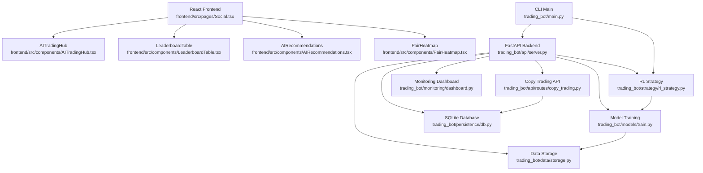
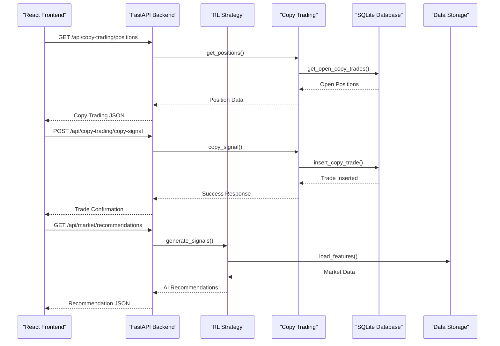

# Core Features

<cite>
**Referenced Files in This Document**
- [main.py](file://trading_bot/main.py)
- [server.py](file://trading_bot/api/server.py)
- [copy_trading.py](file://trading_bot/api/routes/copy_trading.py)
- [db.py](file://trading_bot/persistence/db.py)
- [repositories.py](file://trading_bot/persistence/repositories.py)
- [rl_strategy.py](file://trading_bot/strategy/rl_strategy.py)
- [base.py](file://trading_bot/strategy/base.py)
- [train.py](file://trading_bot/models/train.py)
- [storage.py](file://trading_bot/data/storage.py)
- [dashboard.py](file://trading_bot/monitoring/dashboard.py)
- [Social.tsx](file://frontend/src/pages/Social.tsx)
- [AITradingHub.tsx](file://frontend/src/components/AITradingHub.tsx)
- [LeaderboardTable.tsx](file://frontend/src/components/LeaderboardTable.tsx)
- [AIRecommendations.tsx](file://frontend/src/components/AIRecommendations.tsx)
- [PairHeatmap.tsx](file://frontend/src/components/PairHeatmap.tsx)
</cite>

## Update Summary
**Changes Made**
- Enhanced AI-powered trading capabilities with comprehensive RL strategy implementation
- Added comprehensive copy trading functionality with SQLite persistence and real-time position management
- Integrated advanced social trading features including leaderboards, signal sharing, and community engagement
- Expanded market data integration with Parquet storage and SQLite caching systems
- Implemented advanced monitoring dashboard with performance analytics and real-time metrics
- Added comprehensive training pipeline with hyperparameter optimization and walk-forward validation

## Table of Contents
1. [Introduction](#introduction)
2. [Project Structure](#project-structure)
3. [Core Components](#core-components)
4. [Architecture Overview](#architecture-overview)
5. [Detailed Component Analysis](#detailed-component-analysis)
6. [Dependency Analysis](#dependency-analysis)
7. [Performance Considerations](#performance-considerations)
8. [Troubleshooting Guide](#troubleshooting-guide)
9. [Conclusion](#conclusion)

## Introduction
This document explains the AI Trading Bot's comprehensive platform featuring advanced AI-powered trading capabilities, comprehensive copy trading functionality, and sophisticated social trading features. The system integrates reinforcement learning models with LSTM/Transformer extractors, real-time market data processing, advanced risk management, and extensive monitoring capabilities. It provides both paper trading simulation and live trading with comprehensive social features including leaderboards, signal sharing, and community engagement.

## Project Structure
The system is built with a modern full-stack architecture featuring separate frontend and backend components with advanced AI and trading capabilities:

**Backend Architecture:**
- FastAPI server with comprehensive RESTful endpoints for market data, copy trading, social features, and trading operations
- Reinforcement Learning strategy with PPO/SAC models and LSTM/Transformer extractors
- Multi-broker execution system with CCXT, OANDA, and Alpaca integrations
- Advanced persistence layer with SQLite for copy trading, paper trading, and signal tracking
- Real-time market data processing with Parquet storage and SQLite caching
- Comprehensive monitoring dashboard with performance analytics

**Frontend Architecture:**
- React-based trading interface with TypeScript and Tailwind CSS
- AI Trading Hub with comprehensive signal analysis and copy trading integration
- Social trading features including leaderboards, signal sharing, and community engagement
- Advanced visualization components with pair heatmaps and interactive charts
- Real-time performance monitoring and trading analytics



**Diagram sources**
- [Social.tsx:1-467](file://frontend/src/pages/Social.tsx#L1-L467)
- [AITradingHub.tsx:1-800](file://frontend/src/components/AITradingHub.tsx#L1-L800)
- [LeaderboardTable.tsx:1-228](file://frontend/src/components/LeaderboardTable.tsx#L1-L228)
- [AIRecommendations.tsx:1-289](file://frontend/src/components/AIRecommendations.tsx#L1-L289)
- [PairHeatmap.tsx:1-124](file://frontend/src/components/PairHeatmap.tsx#L1-L124)
- [server.py:1-115](file://trading_bot/api/server.py#L1-L115)
- [copy_trading.py:1-248](file://trading_bot/api/routes/copy_trading.py#L1-L248)
- [rl_strategy.py:1-285](file://trading_bot/strategy/rl_strategy.py#L1-L285)
- [train.py:1-446](file://trading_bot/models/train.py#L1-L446)
- [storage.py:1-484](file://trading_bot/data/storage.py#L1-L484)
- [db.py:1-36](file://trading_bot/persistence/db.py#L1-L36)
- [dashboard.py:1-328](file://trading_bot/monitoring/dashboard.py#L1-L328)
- [main.py:1-347](file://trading_bot/main.py#L1-L347)

**Section sources**
- [Social.tsx:1-467](file://frontend/src/pages/Social.tsx#L1-L467)
- [server.py:1-115](file://trading_bot/api/server.py#L1-L115)
- [copy_trading.py:1-248](file://trading_bot/api/routes/copy_trading.py#L1-L248)
- [rl_strategy.py:1-285](file://trading_bot/strategy/rl_strategy.py#L1-L285)
- [train.py:1-446](file://trading_bot/models/train.py#L1-L446)

## Core Components

### Advanced AI Trading Strategy with Reinforcement Learning
- **RL Strategy Implementation**: PPO and SAC algorithms with LSTM/Transformer extractors for complex market analysis
- **Feature Engineering Pipeline**: 100+ technical indicators including RSI, MACD, EMA, Bollinger Bands, ATR, and custom indicators
- **Multi-Timeframe Analysis**: Consensus building across 1D, 4H, 1H, 15M, and 5M timeframes
- **Risk-Reward Optimization**: Automated stop-loss and take-profit level determination with position sizing
- **Confidence Scoring**: Percentage-based confidence levels for trade recommendations with threshold filtering

### Comprehensive Copy Trading System
- **Real-Time Position Management**: Live copy trading with automatic position sizing and risk controls
- **SQLite Persistence**: Complete copy trading data storage with settings, positions, and history tracking
- **Risk Management**: Configurable position limits, risk percentages, and concurrent position controls
- **Performance Analytics**: Win rate tracking, P&L calculations, and statistical reporting
- **Community Features**: Signal sharing, follower management, and performance leaderboard integration

### Advanced Social Trading Platform
- **Leaderboard System**: Real-time performance rankings with weekly, monthly, and all-time periods
- **Signal Sharing**: Community-driven signal sharing with confidence levels and risk parameters
- **Profile Management**: User statistics, following/unfollowing capabilities, and performance metrics
- **Trending Analysis**: Market sentiment tracking and popular symbol identification
- **Integration Points**: Seamless integration between AI recommendations and social features

### Enhanced Market Data Infrastructure
- **Multi-Format Storage**: Parquet files for OHLCV data and SQLite for structured trading data
- **Real-Time Caching**: Intelligent caching with TTL-based expiration for performance optimization
- **Historical Data Management**: Efficient storage and retrieval of large market datasets
- **Data Validation**: Robust data quality checks and error handling for reliable market analysis
- **Backup Systems**: Multiple storage formats ensuring data durability and accessibility

### Advanced Monitoring and Analytics
- **Performance Dashboard**: Real-time equity curves, drawdown analysis, and statistical metrics
- **Trade Analytics**: Comprehensive trade distribution, win/loss ratios, and performance breakdowns
- **Risk Monitoring**: Real-time risk assessment with circuit breaker integration
- **Alert System**: Comprehensive notification system for trading events and system status
- **Metrics Tracking**: Persistent storage of performance metrics for historical analysis

### Modern React Frontend Architecture
- **AI Trading Hub**: Comprehensive trading interface with signal analysis, risk management, and copy trading
- **Social Features**: Leaderboard integration, signal sharing, and community interaction
- **Pair Selection**: Advanced pair selection with heatmap visualization and performance tracking
- **Real-Time Updates**: WebSocket connections for live market data and social feeds
- **Responsive Design**: Mobile-friendly interface with dark theme trading aesthetics

**Section sources**
- [rl_strategy.py:19-285](file://trading_bot/strategy/rl_strategy.py#L19-L285)
- [copy_trading.py:16-248](file://trading_bot/api/routes/copy_trading.py#L16-L248)
- [Social.tsx:25-467](file://frontend/src/pages/Social.tsx#L25-L467)
- [AITradingHub.tsx:123-800](file://frontend/src/components/AITradingHub.tsx#L123-L800)
- [storage.py:53-484](file://trading_bot/data/storage.py#L53-L484)
- [dashboard.py:16-328](file://trading_bot/monitoring/dashboard.py#L16-L328)

## Architecture Overview
The system follows a modern microservices architecture with clear separation between frontend, backend, and execution layers, enhanced with AI and social features:

**Frontend Layer**: React application with AI Trading Hub, social features, and real-time data visualization
**API Layer**: FastAPI backend serving comprehensive endpoints for market data, copy trading, social features, and trading operations
**AI Layer**: Reinforcement learning models with feature engineering and training pipeline
**Data Layer**: Multi-format storage with Parquet for OHLCV and SQLite for structured data
**Execution Layer**: Multi-broker system with unified order management and risk controls
**Persistence Layer**: SQLite database with comprehensive schema for all trading activities



**Diagram sources**
- [Social.tsx:54-109](file://frontend/src/pages/Social.tsx#L54-L109)
- [copy_trading.py:179-217](file://trading_bot/api/routes/copy_trading.py#L179-L217)
- [copy_trading.py:122-177](file://trading_bot/api/routes/copy_trading.py#L122-L177)
- [rl_strategy.py:182-221](file://trading_bot/strategy/rl_strategy.py#L182-L221)
- [storage.py:118-167](file://trading_bot/data/storage.py#L118-L167)

## Detailed Component Analysis

### Reinforcement Learning Strategy Implementation
**Purpose**: Provide AI-powered trading decisions using advanced RL algorithms with sophisticated feature engineering.

**Implementation Approach**:
- **Model Architecture**: PPO and SAC algorithms with configurable LSTM/Transformer extractors
- **Feature Engineering**: Comprehensive technical indicator pipeline with 100+ indicators
- **Training Pipeline**: Hyperparameter optimization with Optuna and walk-forward validation
- **Risk Management**: Integrated position sizing and risk controls within the RL framework
- **Performance Monitoring**: Real-time performance metrics and model information tracking

**Key Features**:
- Multi-timeframe analysis with consensus building across 5 different timeframes
- Automated feature engineering with technical indicators and custom calculations
- Configurable confidence thresholds and position sizing strategies
- Real-time model loading and prediction capabilities
- Comprehensive training pipeline with hyperparameter optimization

**Section sources**
- [rl_strategy.py:19-285](file://trading_bot/strategy/rl_strategy.py#L19-L285)
- [train.py:23-446](file://trading_bot/models/train.py#L23-L446)

### Copy Trading System with SQLite Persistence
**Purpose**: Enable comprehensive copy trading functionality with real-time position management and risk controls.

**Implementation Approach**:
- **Complete Persistence**: SQLite schema for copy settings, positions, and history tracking
- **Real-Time Management**: Live position monitoring with automatic TP/SL checking and closure
- **Risk Controls**: Configurable position limits, risk percentages, and concurrent position controls
- **Performance Analytics**: Win rate tracking, P&L calculations, and statistical reporting
- **API Integration**: Comprehensive RESTful endpoints for copy trading operations

**Key Features**:
- Configurable copy trading settings with enable/disable controls
- Real-time position monitoring with automatic TP/SL checking
- Risk management with position size limits and risk percentage controls
- Performance tracking with win rate and P&L calculations
- Historical trade tracking and statistics reporting

**Section sources**
- [copy_trading.py:16-248](file://trading_bot/api/routes/copy_trading.py#L16-L248)
- [repositories.py:107-201](file://trading_bot/persistence/repositories.py#L107-L201)
- [db.py:14-36](file://trading_bot/persistence/db.py#L14-L36)

### Advanced Social Trading Platform
**Purpose**: Provide comprehensive social trading features including leaderboards, signal sharing, and community engagement.

**Implementation Approach**:
- **Leaderboard System**: Real-time performance rankings with configurable timeframes
- **Signal Sharing**: Community-driven signal sharing with confidence levels and risk parameters
- **Profile Management**: User statistics, following/unfollowing capabilities, and performance metrics
- **Trending Analysis**: Market sentiment tracking and popular symbol identification
- **Integration Points**: Seamless integration between AI recommendations and social features

**Key Features**:
- Multi-period leaderboard with weekly, monthly, and all-time rankings
- Signal sharing with comprehensive risk and reward parameters
- User profile management with performance statistics
- Trending symbol identification and market sentiment tracking
- Following system with real-time performance updates

**Section sources**
- [Social.tsx:25-467](file://frontend/src/pages/Social.tsx#L25-L467)
- [LeaderboardTable.tsx:12-228](file://frontend/src/components/LeaderboardTable.tsx#L12-L228)
- [AIRecommendations.tsx:134-289](file://frontend/src/components/AIRecommendations.tsx#L134-L289)

### Enhanced Market Data Infrastructure
**Purpose**: Provide robust data storage and retrieval capabilities with multiple formats and caching mechanisms.

**Implementation Approach**:
- **Multi-Format Storage**: Parquet files for OHLCV data and SQLite for structured trading data
- **Real-Time Caching**: Intelligent caching with TTL-based expiration for performance optimization
- **Historical Data Management**: Efficient storage and retrieval of large market datasets
- **Data Validation**: Robust data quality checks and error handling for reliable market analysis
- **Backup Systems**: Multiple storage formats ensuring data durability and accessibility

**Key Features**:
- Parquet storage for efficient OHLCV data with automatic deduplication
- SQLite caching for real-time market data with TTL expiration
- Comprehensive data validation and error handling
- Multi-format data export and import capabilities
- Performance optimization with intelligent caching strategies

**Section sources**
- [storage.py:53-484](file://trading_bot/data/storage.py#L53-L484)

### Advanced Monitoring Dashboard
**Purpose**: Provide comprehensive performance analytics and real-time monitoring capabilities.

**Implementation Approach**:
- **Performance Visualization**: Equity curves, drawdown analysis, and statistical metrics
- **Trade Analytics**: Comprehensive trade distribution, win/loss ratios, and performance breakdowns
- **Risk Monitoring**: Real-time risk assessment with circuit breaker integration
- **Alert System**: Comprehensive notification system for trading events and system status
- **Metrics Tracking**: Persistent storage of performance metrics for historical analysis

**Key Features**:
- Interactive equity curve visualization with trade markers
- Drawdown analysis with percentage-based visualization
- Monthly returns heatmap for seasonal performance analysis
- Trade distribution charts with P&L and duration analysis
- Real-time performance metrics with configurable timeframes

**Section sources**
- [dashboard.py:16-328](file://trading_bot/monitoring/dashboard.py#L16-L328)

### Modern React Frontend Components
**Purpose**: Provide a comprehensive trading interface with AI recommendations, social features, and real-time data visualization.

**Implementation Approach**:
- **AI Trading Hub**: Centralized trading interface with signal analysis and risk management
- **Social Features**: Leaderboard integration, signal sharing, and community interaction
- **Pair Selection**: Advanced pair selection with heatmap visualization and performance tracking
- **Real-Time Updates**: WebSocket connections for live market data and social feeds
- **Responsive Design**: Mobile-friendly interface with dark theme trading aesthetics

**Key Features**:
- AI Trading Hub with comprehensive signal analysis and copy trading integration
- Leaderboard with sorting, filtering, and following capabilities
- AI Recommendations with confidence scoring and risk analysis
- Pair Heatmap with performance visualization and selection
- Responsive design with dark theme and trading-specific aesthetics

**Section sources**
- [AITradingHub.tsx:123-800](file://frontend/src/components/AITradingHub.tsx#L123-L800)
- [LeaderboardTable.tsx:12-228](file://frontend/src/components/LeaderboardTable.tsx#L12-L228)
- [AIRecommendations.tsx:134-289](file://frontend/src/components/AIRecommendations.tsx#L134-L289)
- [PairHeatmap.tsx:11-124](file://frontend/src/components/PairHeatmap.tsx#L11-L124)

## Dependency Analysis
The system exhibits clear separation of concerns with well-defined dependencies between AI, social, and traditional trading components:

**AI and Machine Learning Dependencies**:
- RL Strategy depends on feature engineering pipeline and training infrastructure
- Training pipeline depends on data storage and feature engineering modules
- Model optimization uses Optuna for hyperparameter tuning with comprehensive validation

**Social and Community Dependencies**:
- Social features depend on copy trading API for real-time position data
- Leaderboard system depends on user statistics and performance metrics
- Signal sharing integrates with AI recommendation system for community signals

**Data and Storage Dependencies**:
- API routes depend on persistence layer for all data operations
- Copy trading system depends on SQLite schema for position and settings management
- Market data endpoints depend on storage infrastructure for historical and real-time data

**Frontend and Backend Dependencies**:
- React components depend on FastAPI endpoints for all data operations
- Social features integrate with AI Trading Hub for comprehensive trading experience
- Monitoring dashboard depends on performance metrics from trading operations

```mermaid
graph TB
# AI Components
RL_STRATEGY["RL Strategy<br/>rl_strategy.py"]
TRAINING["Training Pipeline<br/>train.py"]
FEATURES["Feature Engineering<br/>features/engineering.py"]
# Social Components
SOCIAL["Social Platform<br/>Social.tsx"]
LEADERBOARD["Leaderboard<br/>LeaderboardTable.tsx"]
AI_RECS["AI Recommendations<br/>AIRecommendations.tsx"]
# Data Components
STORAGE["Data Storage<br/>storage.py"]
DB["SQLite Database<br/>db.py"]
REPOS["Repositories<br/>repositories.py"]
# Frontend Components
AITRADING["AI Trading Hub<br/>AITradingHub.tsx"]
PAIRMAP["Pair Heatmap<br/>PairHeatmap.tsx"]
# Backend Components
SERVER["FastAPI Server<br/>server.py"]
COPY_API["Copy Trading API<br/>copy_trading.py"]
# External Dependencies
OPTUNA["Optuna<br/>hyperparameter optimization"]
PARQUET["Parquet<br/>efficient storage"]
SQLITE["SQLite<br/>structured data"]
# AI Dependencies
RL_STRATEGY --> FEATURES
TRAINING --> RL_STRATEGY
TRAINING --> STORAGE
# Social Dependencies
SOCIAL --> COPY_API
LEADERBOARD --> SOCIAL
AI_RECS --> SOCIAL
# Data Dependencies
COPY_API --> REPOS
REPOS --> DB
STORAGE --> PARQUET
# Frontend Dependencies
AITRADING --> SERVER
PAIRMAP --> SERVER
# Backend Dependencies
SERVER --> COPY_API
SERVER --> RL_STRATEGY
SERVER --> STORAGE
# External Dependencies
TRAINING --> OPTUNA
STORAGE --> SQLITE
```

**Diagram sources**
- [rl_strategy.py:1-285](file://trading_bot/strategy/rl_strategy.py#L1-L285)
- [train.py:1-446](file://trading_bot/models/train.py#L1-L446)
- [Social.tsx:1-467](file://frontend/src/pages/Social.tsx#L1-L467)
- [LeaderboardTable.tsx:1-228](file://frontend/src/components/LeaderboardTable.tsx#L1-L228)
- [AIRecommendations.tsx:1-289](file://frontend/src/components/AIRecommendations.tsx#L1-L289)
- [storage.py:1-484](file://trading_bot/data/storage.py#L1-L484)
- [db.py:1-36](file://trading_bot/persistence/db.py#L1-L36)
- [repositories.py:1-277](file://trading_bot/persistence/repositories.py#L1-L277)
- [AITradingHub.tsx:1-800](file://frontend/src/components/AITradingHub.tsx#L1-L800)
- [PairHeatmap.tsx:1-124](file://frontend/src/components/PairHeatmap.tsx#L1-L124)
- [server.py:1-115](file://trading_bot/api/server.py#L1-L115)
- [copy_trading.py:1-248](file://trading_bot/api/routes/copy_trading.py#L1-L248)

**Section sources**
- [rl_strategy.py:1-285](file://trading_bot/strategy/rl_strategy.py#L1-L285)
- [Social.tsx:1-467](file://frontend/src/pages/Social.tsx#L1-L467)
- [server.py:1-115](file://trading_bot/api/server.py#L1-L115)

## Performance Considerations
- **AI Model Optimization**: RL model training with hyperparameter optimization, walk-forward validation, and efficient feature engineering
- **Data Storage Efficiency**: Parquet compression for OHLCV data, SQLite WAL mode for concurrent access, and intelligent caching strategies
- **Real-time Updates**: WebSocket integration for live data, adaptive polling intervals, and efficient state updates
- **Copy Trading Performance**: Real-time position monitoring with automatic TP/SL checking and efficient database queries
- **Social Feature Scaling**: Leaderboard optimization with configurable limits, efficient user statistics computation, and scalable signal sharing
- **Frontend Optimization**: React.memo usage for expensive components, lazy loading for charts, and efficient data fetching strategies

## Troubleshooting Guide
**AI and Machine Learning Issues**:
- **Model Training Failures**: Verify Optuna installation, check hyperparameter ranges, ensure sufficient training data
- **Feature Engineering Errors**: Validate technical indicator calculations, check data quality, ensure proper feature scaling
- **RL Strategy Problems**: Confirm model loading, verify feature engineering pipeline, check confidence thresholds

**Copy Trading Issues**:
- **Position Management Failures**: Verify SQLite schema, check database connectivity, ensure proper transaction handling
- **Risk Control Problems**: Validate position limits, check risk percentage calculations, confirm concurrent position controls
- **API Endpoint Failures**: Verify copy trading routes, check request validation, ensure proper error handling

**Data Storage Issues**:
- **Parquet Storage Failures**: Check file permissions, verify Parquet format compatibility, ensure proper data serialization
- **SQLite Connection Problems**: Validate database initialization, check connection pooling, ensure proper schema migration
- **Caching Issues**: Verify TTL settings, check cache invalidation, ensure proper cache warming strategies

**Frontend Issues**:
- **Component Rendering Failures**: Verify React component dependencies, check TypeScript compilation, ensure proper prop types
- **API Integration Problems**: Confirm endpoint accessibility, check CORS configuration, validate request/response formats
- **Real-time Updates**: Verify WebSocket connections, check browser compatibility, ensure proper error handling

**System Integration**:
- **Cross-Origin Issues**: Verify CORS configuration, check allowed origins, ensure proper header settings
- **Performance Bottlenecks**: Monitor API response times, check database queries, validate caching effectiveness
- **Deployment Issues**: Verify environment variables, check Docker configuration, ensure proper file permissions

**Section sources**
- [train.py:187-244](file://trading_bot/models/train.py#L187-L244)
- [copy_trading.py:122-177](file://trading_bot/api/routes/copy_trading.py#L122-L177)
- [storage.py:71-116](file://trading_bot/data/storage.py#L71-L116)
- [db.py:14-36](file://trading_bot/persistence/db.py#L14-L36)

## Conclusion
The AI Trading Bot platform represents a comprehensive, production-ready trading solution with advanced AI-powered capabilities, comprehensive copy trading functionality, and sophisticated social features. The system combines reinforcement learning models with LSTM/Transformer extractors, real-time market data processing, advanced risk management, and extensive social trading capabilities. The modular architecture enables easy maintenance, scalability, and extension to additional markets and instruments while maintaining high performance and reliability standards. The integration of AI recommendations, copy trading, and social features creates a complete trading ecosystem that enhances both individual and community trading experiences.