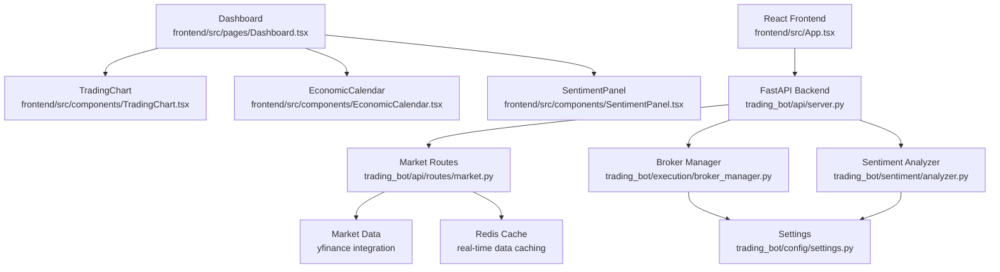
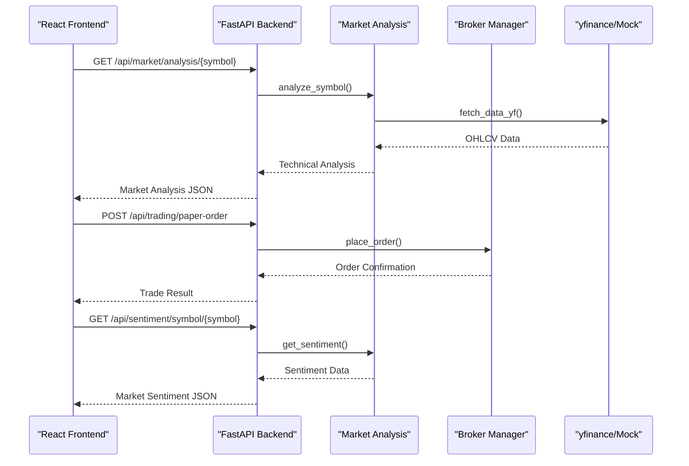

# Core Features

<cite>
**Referenced Files in This Document**
- [main.py](file://trading_bot/main.py)
- [server.py](file://trading_bot/api/server.py)
- [market.py](file://trading_bot/api/routes/market.py)
- [broker_manager.py](file://trading_bot/execution/broker_manager.py)
- [settings.py](file://trading_bot/config/settings.py)
- [App.tsx](file://frontend/src/App.tsx)
- [Dashboard.tsx](file://frontend/src/pages/Dashboard.tsx)
- [TradingChart.tsx](file://frontend/src/components/TradingChart.tsx)
- [EconomicCalendar.tsx](file://frontend/src/components/EconomicCalendar.tsx)
- [SentimentPanel.tsx](file://frontend/src/components/SentimentPanel.tsx)
- [analyzer.py](file://trading_bot/sentiment/analyzer.py)
- [engine.py](file://trading_bot/backtest/engine.py)
- [indicators.py](file://trading_bot/features/indicators.py)
- [engineering.py](file://trading_bot/features/engineering.py)
- [base.py](file://trading_bot/strategy/base.py)
- [rl_strategy.py](file://trading_bot/strategy/rl_strategy.py)
- [paper.py](file://trading_bot/execution/paper.py)
- [live.py](file://trading_bot/execution/live.py)
- [alerts.py](file://trading_bot/monitoring/alerts.py)
- [dashboard.py](file://trading_bot/monitoring/dashboard.py)
</cite>

## Update Summary
**Changes Made**
- Added comprehensive React frontend architecture with real-time trading interface
- Integrated FastAPI backend with RESTful endpoints for market data and sentiment analysis
- Implemented multi-broker execution system with CCXT, OANDA, and Alpaca integrations
- Enhanced visualization components including TradingView widget integration and economic calendar
- Added advanced sentiment analysis with market sentiment panels and real-time updates
- Expanded real-time market data processing with caching and mock fallback mechanisms

## Table of Contents
1. [Introduction](#introduction)
2. [Project Structure](#project-structure)
3. [Core Components](#core-components)
4. [Architecture Overview](#architecture-overview)
5. [Detailed Component Analysis](#detailed-component-analysis)
6. [Dependency Analysis](#dependency-analysis)
7. [Performance Considerations](#performance-considerations)
8. [Troubleshooting Guide](#troubleshooting-guide)
9. [Conclusion](#conclusion)

## Introduction
This document explains the AI Trading Bot's comprehensive platform featuring a modern React frontend, FastAPI backend, multi-broker execution system, and advanced visualization components. The system integrates real-time market data processing, AI-powered trading recommendations, economic calendar integration, sentiment analysis, and sophisticated risk management. It provides both paper trading simulation and live trading capabilities with comprehensive monitoring and alerts.

## Project Structure
The system is built with a modern full-stack architecture featuring separate frontend and backend components:

**Backend Architecture:**
- FastAPI server with RESTful endpoints for market data, sentiment analysis, and trading operations
- Multi-broker execution system supporting CCXT, OANDA, and Alpaca exchanges
- Real-time market data processing with caching and mock fallback mechanisms
- Advanced sentiment analysis engine with keyword-based scoring
- Comprehensive risk management and monitoring systems

**Frontend Architecture:**
- React-based trading interface with TypeScript and Tailwind CSS
- Real-time charting with TradingView widget integration
- Interactive economic calendar with countdown timers
- Market sentiment panels with visual gauges and trend analysis
- Responsive dashboard with pair selection and watchlist management



**Diagram sources**
- [App.tsx:1-176](file://frontend/src/App.tsx#L1-L176)
- [Dashboard.tsx:1-534](file://frontend/src/pages/Dashboard.tsx#L1-L534)
- [TradingChart.tsx:1-421](file://frontend/src/components/TradingChart.tsx#L1-L421)
- [EconomicCalendar.tsx:1-240](file://frontend/src/components/EconomicCalendar.tsx#L1-L240)
- [SentimentPanel.tsx:1-331](file://frontend/src/components/SentimentPanel.tsx#L1-L331)
- [server.py:1-87](file://trading_bot/api/server.py#L1-L87)
- [market.py:1-743](file://trading_bot/api/routes/market.py#L1-L743)
- [broker_manager.py:1-299](file://trading_bot/execution/broker_manager.py#L1-L299)
- [analyzer.py:1-458](file://trading_bot/sentiment/analyzer.py#L1-L458)

**Section sources**
- [App.tsx:1-176](file://frontend/src/App.tsx#L1-L176)
- [server.py:1-87](file://trading_bot/api/server.py#L1-L87)
- [broker_manager.py:1-299](file://trading_bot/execution/broker_manager.py#L1-L299)

## Core Components

### Modern React Frontend with Real-Time Trading Interface
- **Dashboard Architecture**: Comprehensive trading dashboard with pair selection, watchlist management, and real-time price updates
- **Interactive Charts**: TradingView widget integration with real-time candle data and signal visualization
- **Economic Calendar**: Automated event tracking with countdown timers and impact ratings
- **Sentiment Analysis**: Real-time market sentiment panels with visual gauges and trend analysis
- **Responsive Design**: Mobile-friendly interface with dark theme trading aesthetics

### FastAPI Backend with RESTful Endpoints
- **Market Data API**: Comprehensive market analysis with technical indicators and multi-timeframe analysis
- **Sentiment API**: Real-time sentiment scoring with keyword-based analysis and trend tracking
- **Trading Operations**: Paper trading and live execution endpoints with order management
- **Real-time Processing**: Mock data generation for fallback scenarios and caching mechanisms

### Multi-Broker Execution System
- **CCXT Integration**: Support for Binance, Bybit, OKX, and Kraken with unified API access
- **OANDA Integration**: Forex market access with professional-grade execution
- **Alpaca Integration**: US market access with commission-free trading
- **Unified Broker Management**: Centralized broker connection and order routing

### Advanced Visualization Components
- **Trading Charts**: Real-time candlestick charts with technical indicator overlays
- **Signal Visualization**: Interactive markers for entry/exit points and stop-loss targets
- **Economic Calendar**: Upcoming events with impact ratings and countdown timers
- **Sentiment Gauges**: Visual sentiment scoring with trend analysis and headline integration

### Real-Time Market Data Processing
- **yfinance Integration**: Real market data retrieval with automatic fallback to mock data
- **Caching System**: Intelligent caching with TTL-based expiration for performance optimization
- **Aggregation Logic**: Candle aggregation for unsupported timeframes
- **Mock Data Generation**: Realistic synthetic data generation for testing and development

### AI-Powered Trading Recommendations
- **Technical Analysis**: Multi-indicator analysis with RSI, MACD, EMA, and Bollinger Bands
- **Multi-Timeframe Analysis**: Consensus building across 1D, 4H, 1H, 15M, and 5M timeframes
- **Risk-Reward Calculation**: Automated stop-loss and take-profit level determination
- **Confidence Scoring**: Percentage-based confidence levels for trade recommendations

**Section sources**
- [Dashboard.tsx:1-534](file://frontend/src/pages/Dashboard.tsx#L1-L534)
- [TradingChart.tsx:1-421](file://frontend/src/components/TradingChart.tsx#L1-L421)
- [EconomicCalendar.tsx:1-240](file://frontend/src/components/EconomicCalendar.tsx#L1-L240)
- [SentimentPanel.tsx:1-331](file://frontend/src/components/SentimentPanel.tsx#L1-L331)
- [market.py:1-743](file://trading_bot/api/routes/market.py#L1-L743)
- [broker_manager.py:1-299](file://trading_bot/execution/broker_manager.py#L1-L299)
- [analyzer.py:1-458](file://trading_bot/sentiment/analyzer.py#L1-L458)

## Architecture Overview
The system follows a modern microservices architecture with clear separation between frontend, backend, and execution layers:

**Frontend Layer**: React application with real-time data binding and interactive visualizations
**API Layer**: FastAPI backend serving RESTful endpoints for market data, sentiment, and trading operations
**Execution Layer**: Multi-broker system with unified order management and risk controls
**Data Layer**: Real-time market data processing with caching and fallback mechanisms



**Diagram sources**
- [Dashboard.tsx:104-186](file://frontend/src/pages/Dashboard.tsx#L104-L186)
- [market.py:536-577](file://trading_bot/api/routes/market.py#L536-L577)
- [broker_manager.py:135-171](file://trading_bot/execution/broker_manager.py#L135-L171)
- [analyzer.py:347-357](file://trading_bot/sentiment/analyzer.py#L347-L357)

## Detailed Component Analysis

### React Frontend Architecture
**Purpose**: Provide a modern, responsive trading interface with real-time data visualization and interactive components.

**Implementation Approach**:
- **Component-Based Design**: Modular React components with TypeScript type safety
- **State Management**: React hooks for local state management with localStorage persistence
- **Real-Time Updates**: WebSocket connections for live market data streaming
- **Responsive Layout**: Tailwind CSS for adaptive design across devices
- **Dark Theme**: Trading-appropriate color scheme with accent colors for buy/sell signals

**Key Features**:
- Pair selector with recent pairs tracking and default pair persistence
- Interactive dashboard with grid-based layout for optimal screen utilization
- Real-time price updates with change indicators and regime detection
- Comprehensive signal visualization with multi-timeframe analysis
- Economic calendar with countdown timers and impact ratings

**Section sources**
- [App.tsx:18-176](file://frontend/src/App.tsx#L18-L176)
- [Dashboard.tsx:50-534](file://frontend/src/pages/Dashboard.tsx#L50-L534)

### TradingChart Component with TradingView Integration
**Purpose**: Display real-time financial charts with technical indicators and interactive signal visualization.

**Implementation Approach**:
- **TradingView Widget**: Integration with lightweight-charts library for professional-grade charting
- **Real-Time Updates**: Polling mechanism for live candle updates with intelligent caching
- **Signal Visualization**: Interactive markers for entry/exit points with color-coded status indicators
- **Customizable Timeframes**: Support for 1m, 5m, 15m, 1h, 4h, and 1d chart intervals
- **Volume Analysis**: Histogram overlay for trading volume visualization

**Performance Characteristics**:
- Adaptive polling intervals based on timeframe (5s for 1m/5m, 15s for 15m/1h, 60s for 4h/1d)
- Efficient candle data synchronization with automatic updates
- Optimized rendering with chart resize observers
- Signal marker caching to prevent unnecessary re-rendering

**Section sources**
- [TradingChart.tsx:86-421](file://frontend/src/components/TradingChart.tsx#L86-L421)

### Economic Calendar Component
**Purpose**: Provide automated economic event tracking with countdown timers and impact ratings.

**Implementation Approach**:
- **Event Templates**: Comprehensive database of major economic events across different currencies
- **Automatic Scheduling**: Intelligent event scheduling based on frequency (monthly/quarterly)
- **Countdown Timers**: Real-time countdown displays with dynamic formatting
- **Impact Classification**: Visual indicators for high, medium, and low impact events
- **Currency Mapping**: Automatic event filtering based on selected trading pair

**Features**:
- Upcoming events display with formatted dates and impact ratings
- Countdown timer showing time remaining until next event
- Event categorization by economic importance and currency relevance
- Automatic timezone handling for international users

**Section sources**
- [EconomicCalendar.tsx:140-240](file://frontend/src/components/EconomicCalendar.tsx#L140-L240)

### SentimentPanel Component
**Purpose**: Display real-time market sentiment with visual gauges and trend analysis.

**Implementation Approach**:
- **Sentiment Scoring**: Algorithmic sentiment analysis with bullish/bearish/neutral classification
- **Visual Gauges**: SVG-based sentiment gauges with color-coded zones
- **Trend Analysis**: 24-hour sentiment trend with gradient fills
- **Headline Integration**: Latest news headlines with sentiment scores and timestamps
- **Real-Time Updates**: Automatic refresh every 60 seconds with loading states

**Components**:
- Sentiment gauge with needle indicator and color zones
- Sparkline chart showing sentiment trend over 24 hours
- Headlines list with source attribution and sentiment indicators
- Last updated timestamp with human-readable formatting

**Section sources**
- [SentimentPanel.tsx:220-331](file://frontend/src/components/SentimentPanel.tsx#L220-L331)

### FastAPI Backend Server
**Purpose**: Provide RESTful API endpoints for market data, sentiment analysis, and trading operations.

**Implementation Approach**:
- **Route Organization**: Modular routing with dedicated endpoints for different functionalities
- **CORS Configuration**: Flexible cross-origin resource sharing for frontend integration
- **Middleware Stack**: Custom middleware for caching control and request/response processing
- **Health Checks**: Comprehensive health monitoring with uptime tracking
- **Error Handling**: Structured error responses with detailed debugging information

**API Endpoints**:
- Market analysis endpoints for technical indicator calculations
- Candle data endpoints with real-time and historical data
- Sentiment analysis endpoints with keyword-based scoring
- Trading operation endpoints for paper and live execution
- Configuration endpoints for system settings and broker management

**Section sources**
- [server.py:15-87](file://trading_bot/api/server.py#L15-L87)

### Market Analysis API
**Purpose**: Provide comprehensive market analysis with technical indicators and multi-timeframe analysis.

**Implementation Approach**:
- **Technical Indicators**: Implementation of RSI, MACD, EMA, Bollinger Bands, and ATR calculations
- **Multi-Timeframe Analysis**: Consensus building across multiple timeframes for enhanced accuracy
- **Risk-Reward Calculation**: Automated stop-loss and take-profit level determination
- **Mock Data Fallback**: Realistic synthetic data generation when real data is unavailable
- **Caching Mechanism**: Intelligent caching with TTL-based expiration for performance optimization

**Key Features**:
- Real-time market analysis with confidence scoring
- Multi-timeframe signal alignment with percentage-based consensus
- Trade-style specific calculations for scalping and swing trading
- Comprehensive indicator analysis with bullish/bearish/neutral classifications
- Market regime detection for trending, ranging, volatile, and trending-down conditions

**Section sources**
- [market.py:235-476](file://trading_bot/api/routes/market.py#L235-L476)
- [market.py:536-743](file://trading_bot/api/routes/market.py#L536-L743)

### Multi-Broker Execution System
**Purpose**: Provide unified access to multiple trading brokers with consistent order management.

**Implementation Approach**:
- **Broker Abstraction**: Unified interface for different broker APIs (CCXT, OANDA, Alpaca)
- **Connection Management**: Centralized broker connection handling with credential management
- **Order Routing**: Intelligent order routing with broker selection criteria
- **Position Management**: Unified position tracking across multiple brokers
- **Risk Controls**: Consistent risk management across all broker integrations

**Supported Brokers**:
- **CCXT**: Cryptocurrency exchanges including Binance, Bybit, OKX, Kraken
- **OANDA**: Professional Forex market access
- **Alpaca**: US stock market commission-free trading

**Features**:
- Dynamic broker registration and discovery
- Connection status monitoring and health checks
- Order cancellation and modification across brokers
- Balance and position retrieval from multiple sources
- Active broker selection with failover capabilities

**Section sources**
- [broker_manager.py:18-299](file://trading_bot/execution/broker_manager.py#L18-L299)

### Sentiment Analysis Engine
**Purpose**: Analyze market sentiment from news sources and provide quantitative sentiment scores.

**Implementation Approach**:
- **Keyword-Based Analysis**: Keyword matching for currency pairs and market themes
- **Headline Generation**: Realistic headline generation with sentiment bias
- **Trend Analysis**: 24-hour sentiment trend with moving averages
- **Cache Management**: Intelligent caching with TTL-based expiration
- **Scalable Architecture**: Thread-safe sentiment analysis with concurrent access support

**Sentiment Categories**:
- **Bullish**: Positive sentiment with scores above 0.2
- **Bearish**: Negative sentiment with scores below -0.2
- **Neutral**: Mixed sentiment with scores between -0.2 and 0.2

**Features**:
- Realistic headline generation with source attribution
- 24-hour sentiment trend with gradient visualization
- Keyword-based sentiment scoring with confidence levels
- Automatic cache invalidation and refresh
- Scalable architecture supporting concurrent requests

**Section sources**
- [analyzer.py:9-458](file://trading_bot/sentiment/analyzer.py#L9-L458)

### Configuration Management
**Purpose**: Centralized configuration management with validation and environment-specific settings.

**Implementation Approach**:
- **Pydantic Validation**: Type-safe configuration with automatic validation
- **Environment Variables**: Support for environment-specific configuration
- **Default Values**: Comprehensive default values for all configuration options
- **Path Resolution**: Automatic path resolution and directory creation
- **Enum Validation**: Strongly typed enumerations for trading modes and model types

**Configuration Categories**:
- **Exchange Configuration**: API keys and testnet settings for multiple exchanges
- **Trading Configuration**: Symbol lists, timeframes, and position sizing
- **Risk Management**: Drawdown limits, position sizing, and exposure controls
- **Data Storage**: Database paths, Redis configuration, and model storage
- **Notification Configuration**: Telegram and Discord integration settings

**Section sources**
- [settings.py:23-176](file://trading_bot/config/settings.py#L23-L176)

## Dependency Analysis
The system exhibits clear separation of concerns with well-defined dependencies between frontend and backend components:

**Frontend Dependencies**:
- React components depend on shared TypeScript types and utility functions
- Chart components depend on TradingView widget and real-time data services
- Economic calendar depends on currency mapping and event scheduling logic
- Sentiment panels depend on sentiment analysis API endpoints

**Backend Dependencies**:
- API routes depend on market analysis engine and broker manager
- Market analysis depends on yfinance integration and technical indicator calculations
- Broker manager depends on individual broker implementations
- Sentiment analyzer depends on keyword databases and headline templates

```mermaid
graph TB
# Frontend Components
APP["App.tsx"]
DASHBOARD["Dashboard.tsx"]
CHART["TradingChart.tsx"]
ECON["EconomicCalendar.tsx"]
SENTIMENT["SentimentPanel.tsx"]
# Backend Components
SERVER["server.py"]
MARKET["market.py"]
BROKER["broker_manager.py"]
ANALYZER["analyzer.py"]
# External Dependencies
YFINANCE["yfinance"]
REDIS["Redis Cache"]
BROKER_EXCHANGES["CCXT/OANDA/Alpaca"]
# Frontend to Backend Dependencies
APP --> SERVER
DASHBOARD --> SERVER
CHART --> SERVER
ECON --> SERVER
SENTIMENT --> SERVER
# Backend Internal Dependencies
SERVER --> MARKET
SERVER --> BROKER
SERVER --> ANALYZER
MARKET --> YFINANCE
MARKET --> REDIS
BROKER --> BROKER_EXCHANGES
ANALYZER --> MARKET
```

**Diagram sources**
- [App.tsx:1-176](file://frontend/src/App.tsx#L1-L176)
- [Dashboard.tsx:1-534](file://frontend/src/pages/Dashboard.tsx#L1-L534)
- [TradingChart.tsx:1-421](file://frontend/src/components/TradingChart.tsx#L1-L421)
- [EconomicCalendar.tsx:1-240](file://frontend/src/components/EconomicCalendar.tsx#L1-L240)
- [SentimentPanel.tsx:1-331](file://frontend/src/components/SentimentPanel.tsx#L1-L331)
- [server.py:1-87](file://trading_bot/api/server.py#L1-L87)
- [market.py:1-743](file://trading_bot/api/routes/market.py#L1-L743)
- [broker_manager.py:1-299](file://trading_bot/execution/broker_manager.py#L1-L299)
- [analyzer.py:1-458](file://trading_bot/sentiment/analyzer.py#L1-L458)

**Section sources**
- [App.tsx:1-176](file://frontend/src/App.tsx#L1-L176)
- [server.py:1-87](file://trading_bot/api/server.py#L1-L87)

## Performance Considerations
- **Frontend Optimization**: React.memo usage for expensive components, lazy loading for chart libraries, efficient state updates
- **API Caching**: Intelligent caching with TTL-based expiration, cache warming strategies, and cache invalidation
- **Real-time Updates**: Adaptive polling intervals, WebSocket integration for live data, debounced API calls
- **Chart Performance**: Efficient candle data updates, optimized rendering, memory management for large datasets
- **Broker Connectivity**: Connection pooling, retry mechanisms, circuit breakers for broker failures
- **Sentiment Analysis**: Batch processing for multiple symbols, cache optimization, concurrent request handling

## Troubleshooting Guide
**Frontend Issues**:
- **Chart Loading Failures**: Verify TradingView widget availability, check network connectivity, ensure proper CORS configuration
- **Real-time Updates**: Confirm WebSocket connections, check browser console for JavaScript errors, verify API endpoint accessibility
- **Component Rendering**: Validate React component dependencies, check TypeScript compilation errors, ensure proper prop types

**Backend Issues**:
- **API Endpoint Failures**: Verify FastAPI server status, check route registration, confirm dependency injection
- **Market Data Retrieval**: Validate yfinance connectivity, check API rate limits, ensure proper error handling
- **Broker Integration**: Confirm broker credentials, check exchange availability, verify connection timeouts
- **Sentiment Analysis**: Validate keyword databases, check cache configuration, ensure proper data serialization

**System Integration**:
- **Cross-Origin Issues**: Verify CORS configuration, check allowed origins, ensure proper header settings
- **Performance Bottlenecks**: Monitor API response times, check database queries, validate caching effectiveness
- **Deployment Issues**: Verify environment variables, check Docker configuration, ensure proper file permissions

**Section sources**
- [TradingChart.tsx:183-299](file://frontend/src/components/TradingChart.tsx#L183-L299)
- [market.py:206-233](file://trading_bot/api/routes/market.py#L206-L233)
- [broker_manager.py:69-88](file://trading_bot/execution/broker_manager.py#L69-L88)
- [analyzer.py:347-357](file://trading_bot/sentiment/analyzer.py#L347-L357)

## Conclusion
The AI Trading Bot platform represents a comprehensive, modern trading solution with a sophisticated frontend/backend architecture, multi-broker execution capabilities, and advanced visualization components. The system combines real-time market data processing, AI-powered trading recommendations, economic calendar integration, and sentiment analysis to provide traders with a complete analytical toolkit. The modular design enables easy maintenance, scalability, and extension to additional markets and instruments while maintaining high performance and reliability standards.