# Frontend Components

<cite>
**Referenced Files in This Document**
- [App.tsx](file://frontend/src/App.tsx)
- [main.tsx](file://frontend/src/main.tsx)
- [Dashboard.tsx](file://frontend/src/pages/Dashboard.tsx)
- [LiveTrading.tsx](file://frontend/src/pages/LiveTrading.tsx)
- [Scanner.tsx](file://frontend/src/pages/Scanner.tsx)
- [Backtest.tsx](file://frontend/src/pages/Backtest.tsx)
- [Social.tsx](file://frontend/src/pages/Social.tsx)
- [PairSelector.tsx](file://frontend/src/components/PairSelector.tsx)
- [TradingChart.tsx](file://frontend/src/components/TradingChart.tsx)
- [ChartToolbar.tsx](file://frontend/src/components/ChartToolbar.tsx)
- [AITradingHub.tsx](file://frontend/src/components/AITradingHub.tsx)
- [GoldScalperPro.tsx](file://frontend/src/components/GoldScalperPro.tsx)
- [TradeExecutionPanel.tsx](file://frontend/src/components/TradeExecutionPanel.tsx)
- [AIRecommendations.tsx](file://frontend/src/components/AIRecommendations.tsx)
- [forexPairs.ts](file://frontend/src/config/forexPairs.ts)
- [index.ts](file://frontend/src/types/index.ts)
- [package.json](file://frontend/package.json)
- [tsconfig.json](file://frontend/tsconfig.json)
- [tailwind.config.js](file://frontend/tailwind.config.js)
</cite>

## Update Summary
**Changes Made**
- Added comprehensive AI Trading Hub component with advanced analysis capabilities
- Introduced Gold Scalper Pro specialized trading tool for gold markets
- Enhanced TradeExecutionPanel with improved UI and functionality
- Updated TradingChart with TradingView integration and signal overlays
- Enhanced Dashboard with new AI recommendations and copy trading features
- Expanded type definitions with new AI-related interfaces

## Table of Contents
1. [Introduction](#introduction)
2. [Project Structure](#project-structure)
3. [Core Components](#core-components)
4. [Architecture Overview](#architecture-overview)
5. [Detailed Component Analysis](#detailed-component-analysis)
6. [Dependency Analysis](#dependency-analysis)
7. [Performance Considerations](#performance-considerations)
8. [Troubleshooting Guide](#troubleshooting-guide)
9. [Conclusion](#conclusion)

## Introduction
This document provides a comprehensive overview of the frontend components for the AI Trading Bot application. It covers the application shell, page-level components, reusable UI components, configuration, and type definitions. The frontend is built with React, TypeScript, Tailwind CSS, and integrates with TradingView for interactive financial charts. It communicates with backend APIs for market data, trading signals, backtesting, and social features.

## Project Structure
The frontend is organized into pages, components, configuration, types, and utilities. The main entry point initializes the React application and mounts the root component. Pages encapsulate major application views, while components provide reusable UI elements. Configuration defines supported trading pairs and utilities for symbol conversion. Types define shared interfaces across the application.

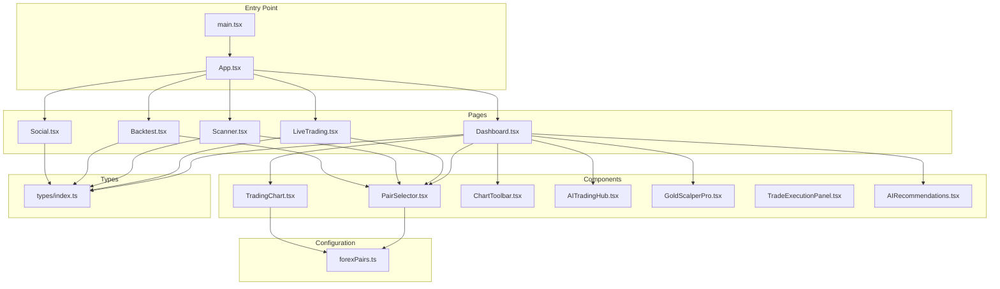

**Diagram sources**
- [main.tsx:1-11](file://frontend/src/main.tsx#L1-L11)
- [App.tsx:1-176](file://frontend/src/App.tsx#L1-L176)
- [Dashboard.tsx:1-676](file://frontend/src/pages/Dashboard.tsx#L1-L676)
- [LiveTrading.tsx:1-590](file://frontend/src/pages/LiveTrading.tsx#L1-L590)
- [Scanner.tsx:1-323](file://frontend/src/pages/Scanner.tsx#L1-L323)
- [Backtest.tsx:1-271](file://frontend/src/pages/Backtest.tsx#L1-L271)
- [Social.tsx:1-455](file://frontend/src/pages/Social.tsx#L1-L455)
- [PairSelector.tsx:1-292](file://frontend/src/components/PairSelector.tsx#L1-L292)
- [TradingChart.tsx:1-221](file://frontend/src/components/TradingChart.tsx#L1-L221)
- [ChartToolbar.tsx:1-47](file://frontend/src/components/ChartToolbar.tsx#L1-L47)
- [AITradingHub.tsx:1-1007](file://frontend/src/components/AITradingHub.tsx#L1-L1007)
- [GoldScalperPro.tsx:1-467](file://frontend/src/components/GoldScalperPro.tsx#L1-L467)
- [TradeExecutionPanel.tsx:1-492](file://frontend/src/components/TradeExecutionPanel.tsx#L1-L492)
- [AIRecommendations.tsx:1-289](file://frontend/src/components/AIRecommendations.tsx#L1-L289)
- [forexPairs.ts:1-641](file://frontend/src/config/forexPairs.ts#L1-L641)
- [index.ts:1-223](file://frontend/src/types/index.ts#L1-L223)

**Section sources**
- [main.tsx:1-11](file://frontend/src/main.tsx#L1-L11)
- [App.tsx:1-176](file://frontend/src/App.tsx#L1-L176)
- [package.json:1-31](file://frontend/package.json#L1-L31)
- [tsconfig.json:1-22](file://frontend/tsconfig.json#L1-L22)
- [tailwind.config.js:1-26](file://frontend/tailwind.config.js#L1-L26)

## Core Components
This section outlines the primary building blocks of the frontend and their responsibilities.

- Application Shell (App)
  - Manages global state for active tab, selected trading pair, active pairs, and recent pairs.
  - Persists default pair and recent pairs to localStorage.
  - Renders the sidebar navigation and switches between pages based on the active tab.
  - Passes pair selection callbacks and state to child pages.

- Page-Level Components
  - Dashboard: Integrates market analysis, charting, AI recommendations, heatmaps, sentiment panels, watchlist cards, and new AI Trading Hub with copy trading capabilities.
  - LiveTrading: Provides real-time trading controls, broker connection status, order book, recent activity, and position management.
  - Scanner: Allows building custom screening criteria, running scans, saving presets, and sorting results.
  - Backtest: Configures historical backtesting parameters and displays equity curve and performance metrics.
  - Social: Implements leaderboard, community signal feed, user profile, and sharing signals.

- Reusable Components
  - PairSelector: Dropdown selector with category tabs, search, recent chips, and default pair actions.
  - TradingChart: Interactive TradingView chart with live updates, signal overlays, and error boundaries.
  - ChartToolbar: Timeframe selector for chart intervals.
  - AITradingHub: Comprehensive AI-powered trading hub with multi-timeframe analysis, copy trading, and advanced risk management.
  - GoldScalperPro: Specialized scalping tool for gold markets with floating panel interface and real-time signals.
  - TradeExecutionPanel: Enhanced trading execution panel with improved UI and position sizing calculations.
  - AIRecommendations: AI-powered pair recommendations with confidence scoring and risk analysis.

- Configuration and Types
  - forexPairs.ts: Defines major/minor/exotic pairs, commodities, crypto, indices, default pair, and helpers for symbol conversion.
  - types/index.ts: Shared interfaces for market data, positions, trades, backtest results, signals, sentiment, AI recommendations, and chart markers.

**Section sources**
- [App.tsx:1-176](file://frontend/src/App.tsx#L1-L176)
- [Dashboard.tsx:1-676](file://frontend/src/pages/Dashboard.tsx#L1-L676)
- [LiveTrading.tsx:1-590](file://frontend/src/pages/LiveTrading.tsx#L1-L590)
- [Scanner.tsx:1-323](file://frontend/src/pages/Scanner.tsx#L1-L323)
- [Backtest.tsx:1-271](file://frontend/src/pages/Backtest.tsx#L1-L271)
- [Social.tsx:1-455](file://frontend/src/pages/Social.tsx#L1-L455)
- [PairSelector.tsx:1-292](file://frontend/src/components/PairSelector.tsx#L1-L292)
- [TradingChart.tsx:1-221](file://frontend/src/components/TradingChart.tsx#L1-L221)
- [ChartToolbar.tsx:1-47](file://frontend/src/components/ChartToolbar.tsx#L1-L47)
- [AITradingHub.tsx:1-1007](file://frontend/src/components/AITradingHub.tsx#L1-L1007)
- [GoldScalperPro.tsx:1-467](file://frontend/src/components/GoldScalperPro.tsx#L1-L467)
- [TradeExecutionPanel.tsx:1-492](file://frontend/src/components/TradeExecutionPanel.tsx#L1-L492)
- [AIRecommendations.tsx:1-289](file://frontend/src/components/AIRecommendations.tsx#L1-L289)
- [forexPairs.ts:1-641](file://frontend/src/config/forexPairs.ts#L1-L641)
- [index.ts:1-223](file://frontend/src/types/index.ts#L1-L223)

## Architecture Overview
The frontend follows a modular React architecture with clear separation of concerns:
- Pages own domain-specific logic and orchestrate component composition.
- Components encapsulate UI and interaction logic, receiving data via props.
- Configuration and types provide shared constants and contracts.
- State management relies on React hooks with localStorage persistence for user preferences.
- New AI Trading Hub integrates seamlessly with existing components for comprehensive trading analysis.

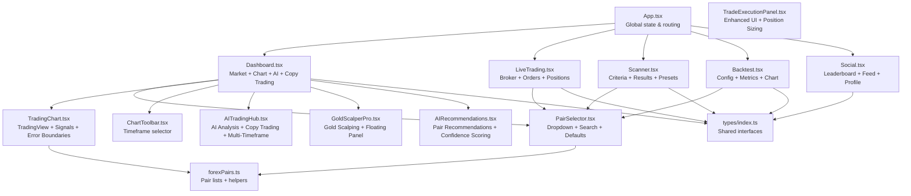

**Diagram sources**
- [App.tsx:1-176](file://frontend/src/App.tsx#L1-L176)
- [Dashboard.tsx:1-676](file://frontend/src/pages/Dashboard.tsx#L1-L676)
- [LiveTrading.tsx:1-590](file://frontend/src/pages/LiveTrading.tsx#L1-L590)
- [Scanner.tsx:1-323](file://frontend/src/pages/Scanner.tsx#L1-L323)
- [Backtest.tsx:1-271](file://frontend/src/pages/Backtest.tsx#L1-L271)
- [Social.tsx:1-455](file://frontend/src/pages/Social.tsx#L1-L455)
- [PairSelector.tsx:1-292](file://frontend/src/components/PairSelector.tsx#L1-L292)
- [TradingChart.tsx:1-221](file://frontend/src/components/TradingChart.tsx#L1-L221)
- [ChartToolbar.tsx:1-47](file://frontend/src/components/ChartToolbar.tsx#L1-L47)
- [AITradingHub.tsx:1-1007](file://frontend/src/components/AITradingHub.tsx#L1-L1007)
- [GoldScalperPro.tsx:1-467](file://frontend/src/components/GoldScalperPro.tsx#L1-L467)
- [TradeExecutionPanel.tsx:1-492](file://frontend/src/components/TradeExecutionPanel.tsx#L1-L492)
- [AIRecommendations.tsx:1-289](file://frontend/src/components/AIRecommendations.tsx#L1-L289)
- [forexPairs.ts:1-641](file://frontend/src/config/forexPairs.ts#L1-L641)
- [index.ts:1-223](file://frontend/src/types/index.ts#L1-L223)

## Detailed Component Analysis

### Application Shell (App)
- Responsibilities
  - Maintains active tab, selected pair, active pairs, and recent pairs.
  - Persists default pair and recent pairs to localStorage.
  - Renders sidebar navigation and switches pages based on active tab.
  - Passes pair selection callbacks and state to child pages.

- State Management
  - Active tab state determines which page renders.
  - Selected pair state drives chart and analysis components.
  - Active pairs and recent pairs support scanning and quick selection.

- Local Storage Persistence
  - Default pair symbol and recent pair symbols are saved and restored.

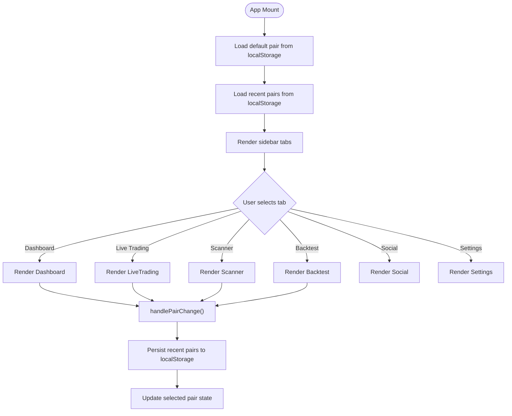

**Diagram sources**
- [App.tsx:18-84](file://frontend/src/App.tsx#L18-L84)

**Section sources**
- [App.tsx:1-176](file://frontend/src/App.tsx#L1-L176)

### Dashboard
- Responsibilities
  - Fetches market analysis and signal breakdown for the selected pair/timeframe.
  - Displays live price ticker, regime indicator, and technical indicators.
  - Renders TradingChart with TradingView integration and signal overlays.
  - Integrates AI recommendations, pair/sentiment heatmaps, and watchlist cards.
  - **NEW**: Implements comprehensive AI Trading Hub with copy trading capabilities.
  - **NEW**: Integrates Gold Scalper Pro for specialized gold market scalping.

- Data Fetching
  - Uses periodic polling to refresh analysis and signal breakdown.
  - Tracks data freshness and source (live/mock).
  - **Enhanced**: Supports multi-timeframe analysis and copy trading data.

- Trading Execution
  - Provides unified trade execution panel with buy/sell actions.
  - Calculates position size based on risk parameters and signal details.
  - **Enhanced**: Integrates with AI Trading Hub for advanced trading decisions.

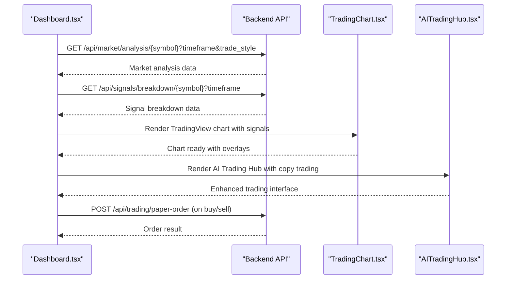

**Diagram sources**
- [Dashboard.tsx:178-248](file://frontend/src/pages/Dashboard.tsx#L178-L248)
- [TradingChart.tsx:36-132](file://frontend/src/components/TradingChart.tsx#L36-L132)
- [AITradingHub.tsx:123-684](file://frontend/src/components/AITradingHub.tsx#L123-L684)

**Section sources**
- [Dashboard.tsx:1-676](file://frontend/src/pages/Dashboard.tsx#L1-L676)

### Live Trading
- Responsibilities
  - Manages broker connection status and active broker retrieval.
  - Displays real-time P&L, daily P&L, and trades today.
  - Shows open positions with unrealized P&L and entry/current prices.
  - Provides quick buy/sell buttons with order confirmation modal.

- Mock Data and Simulations
  - Generates mock order book and recent activity for demonstration.
  - Simulates P&L drift when trading is active.

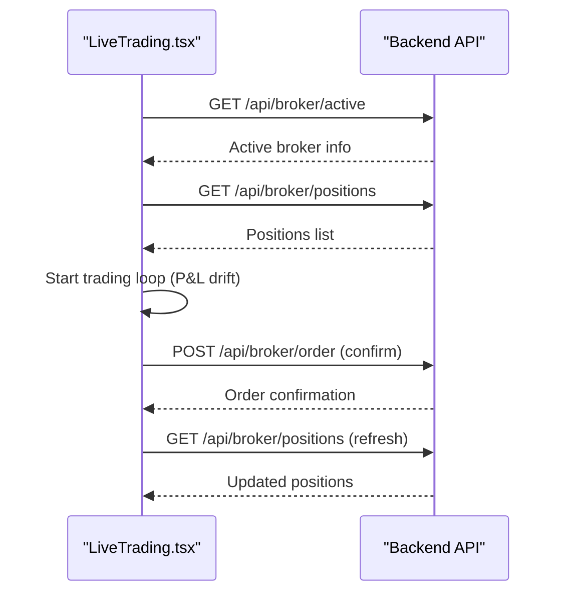

**Diagram sources**
- [LiveTrading.tsx:98-221](file://frontend/src/pages/LiveTrading.tsx#L98-L221)

**Section sources**
- [LiveTrading.tsx:1-590](file://frontend/src/pages/LiveTrading.tsx#L1-L590)

### Scanner
- Responsibilities
  - Builds custom scanning criteria with AND/OR logic and indicator conditions.
  - Runs scans against configured pairs and displays results with match scores.
  - Supports saving scanners and applying preset configurations.

- Sorting and Filtering
  - Sorts results by score, symbol, or volume.
  - Filters results and highlights matching conditions.

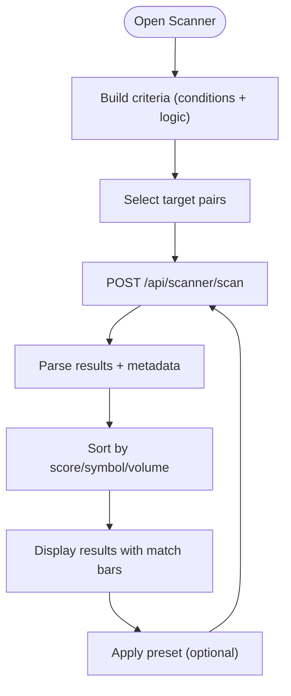

**Diagram sources**
- [Scanner.tsx:31-107](file://frontend/src/pages/Scanner.tsx#L31-L107)

**Section sources**
- [Scanner.tsx:1-323](file://frontend/src/pages/Scanner.tsx#L1-L323)

### Backtest
- Responsibilities
  - Configures backtest parameters: date range, timeframe, model, initial balance.
  - Executes backtest via backend and renders performance metrics and equity curve.

- Visualization
  - Uses Recharts to plot equity curve with tooltips and responsive container.

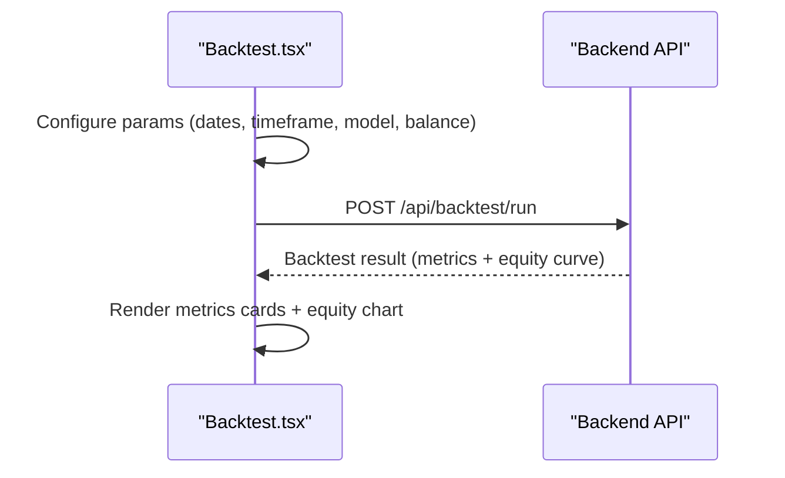

**Diagram sources**
- [Backtest.tsx:25-59](file://frontend/src/pages/Backtest.tsx#L25-L59)

**Section sources**
- [Backtest.tsx:1-271](file://frontend/src/pages/Backtest.tsx#L1-L271)

### Social
- Responsibilities
  - Implements leaderboard with weekly/monthly/all-time periods.
  - Displays community signal feed with filters (all, buy, sell, following).
  - Provides user profile with stats and recent signals.
  - Enables sharing signals with entry/stop loss/take profit configuration.

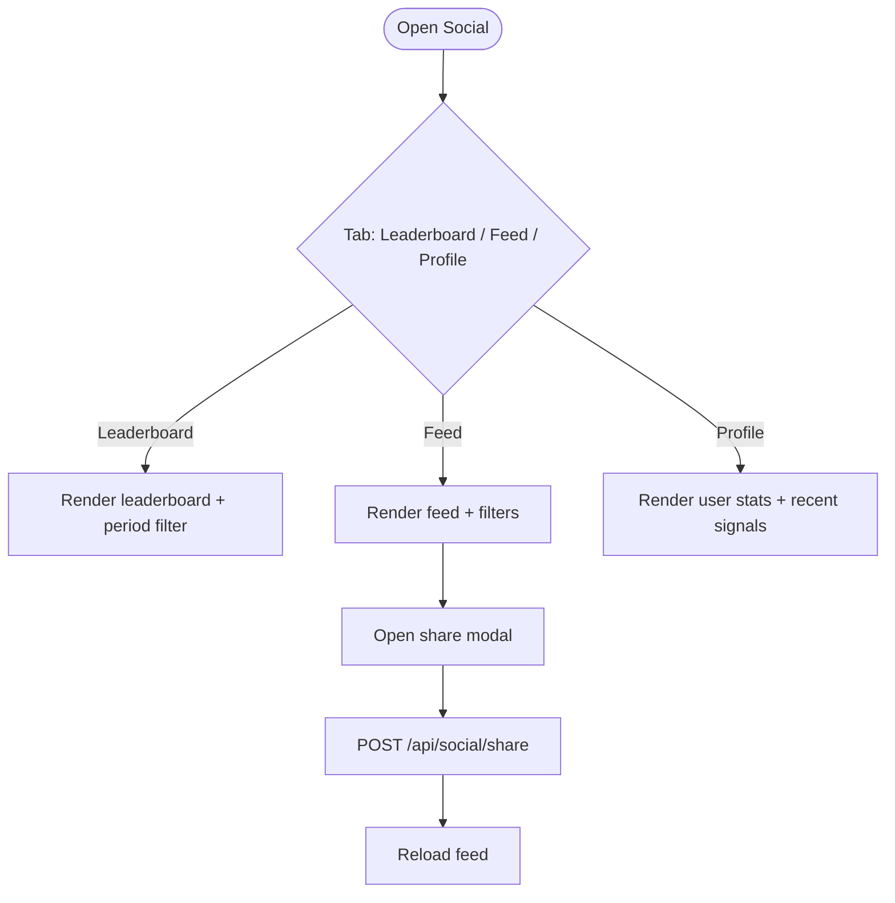

**Diagram sources**
- [Social.tsx:25-97](file://frontend/src/pages/Social.tsx#L25-L97)

**Section sources**
- [Social.tsx:1-455](file://frontend/src/pages/Social.tsx#L1-L455)

### PairSelector
- Responsibilities
  - Dropdown selector with category tabs (All, Forex, Commodities, Crypto, Indices).
  - Search across all pairs with live filtering.
  - Displays recent pairs as chips for quick selection.
  - Allows setting a default pair and selecting pairs for charts or scanners.

- Behavior
  - Outside-click closes the dropdown.
  - Renders categorized groups with category badges and spreads.

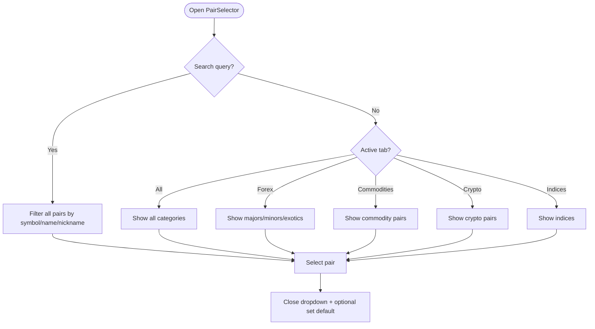

**Diagram sources**
- [PairSelector.tsx:30-197](file://frontend/src/components/PairSelector.tsx#L30-L197)

**Section sources**
- [PairSelector.tsx:1-292](file://frontend/src/components/PairSelector.tsx#L1-L292)

### TradingChart
- Responsibilities
  - Creates an interactive TradingView chart with live updates and signal overlays.
  - Integrates with TradingView widget for professional-grade charting.
  - Handles chart error boundaries and retry mechanisms.
  - Displays latest signal information with confidence levels.

- Timeframe Handling
  - Converts between internal timeframe formats and TradingView intervals.
  - Supports multiple chart types (candlestick, line, area).

- Signal Visualization
  - Maps signal status to colors and positions arrows above/below bars.
  - Displays entry/SL/TP levels with formatted price values.

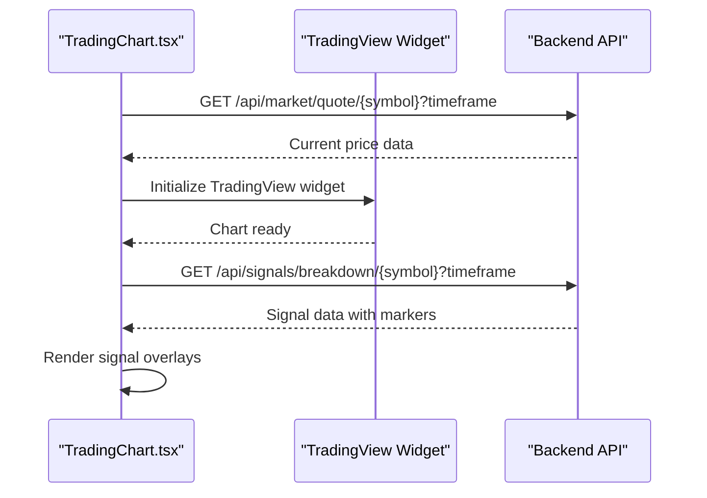

**Diagram sources**
- [TradingChart.tsx:36-132](file://frontend/src/components/TradingChart.tsx#L36-L132)

**Section sources**
- [TradingChart.tsx:1-221](file://frontend/src/components/TradingChart.tsx#L1-L221)

### AITradingHub
- **NEW COMPONENT** - Comprehensive AI-powered trading hub with advanced analysis capabilities
- Responsibilities
  - Displays comprehensive AI analysis with confidence scoring and pattern recognition.
  - Provides copy trading functionality with position management and statistics.
  - Shows multi-timeframe analysis with alignment indicators.
  - Integrates AI recommendations and market regime analysis.
  - Offers advanced risk management with position sizing calculations.

- Advanced Features
  - AI Score visualization with model confidence factors.
  - Pattern recognition with accuracy ratings.
  - Copy trading with real-time position monitoring.
  - Multi-timeframe signal alignment analysis.
  - Enhanced price ladder visualization with current price indicator.

- Copy Trading Capabilities
  - Toggle for enabling/disabling auto-copy trading.
  - Real-time copy position monitoring with P&L tracking.
  - Copy trade statistics with win rate and total P&L.
  - Individual position management with manual closing.

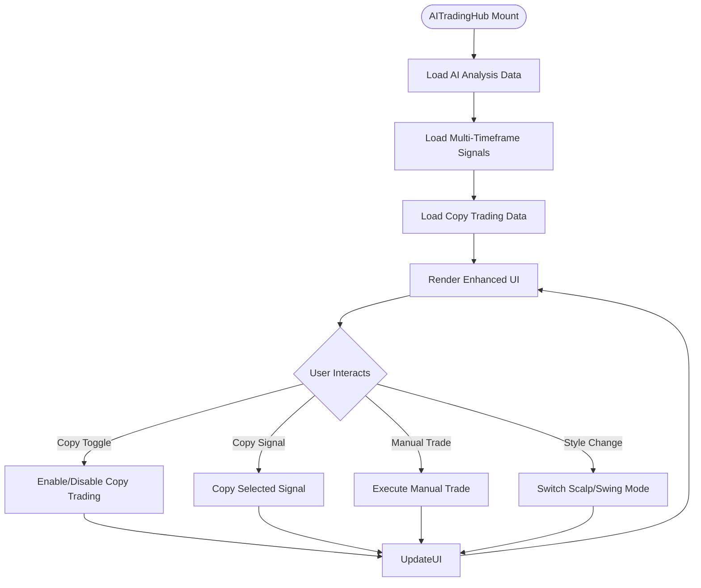

**Diagram sources**
- [AITradingHub.tsx:123-684](file://frontend/src/components/AITradingHub.tsx#L123-L684)

**Section sources**
- [AITradingHub.tsx:1-1007](file://frontend/src/components/AITradingHub.tsx#L1-L1007)

### GoldScalperPro
- **NEW COMPONENT** - Specialized scalping tool for gold markets with floating panel interface
- Responsibilities
  - Provides real-time gold market analysis with 1-minute and 5-minute timeframe options.
  - Displays scalping metrics including spread, ATR, and momentum indicators.
  - Offers floating panel interface with expand/collapse functionality.
  - Executes scalping trades with configurable risk parameters.

- Scalping Features
  - Dedicated gold pair (XAU/USD) with specialized pip calculations.
  - Real-time price updates with change indicators.
  - Scalp metrics including spread, ATR, and momentum analysis.
  - Risk management with configurable risk percentage slider.

- Interface Design
  - Collapsed state as floating action button with signal indicator.
  - Expanded panel with comprehensive trading interface.
  - Gold-themed styling with amber color scheme.
  - Responsive layout with mobile-friendly controls.

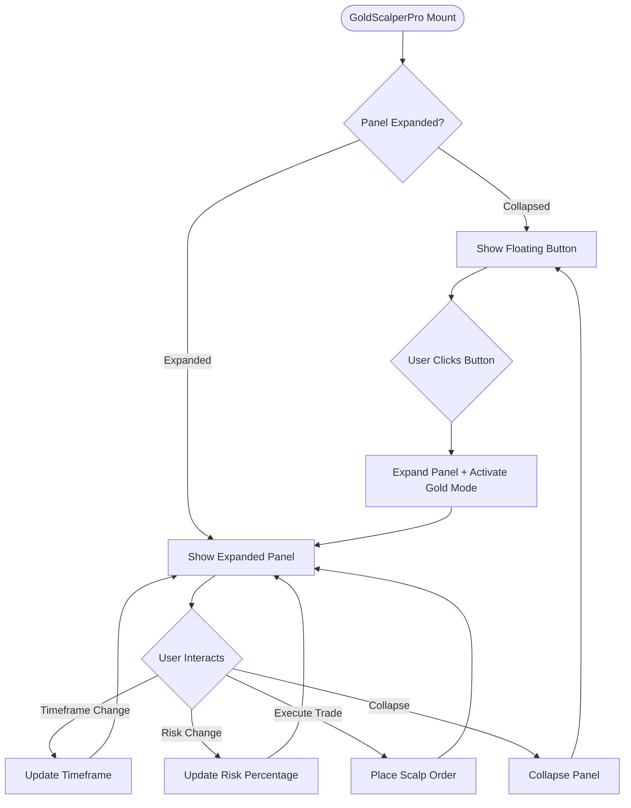

**Diagram sources**
- [GoldScalperPro.tsx:29-463](file://frontend/src/components/GoldScalperPro.tsx#L29-L463)

**Section sources**
- [GoldScalperPro.tsx:1-467](file://frontend/src/components/GoldScalperPro.tsx#L1-L467)

### TradeExecutionPanel
- **ENHANCED COMPONENT** - Improved trading execution panel with advanced UI elements
- Responsibilities
  - Displays comprehensive trading information with enhanced visual design.
  - Provides position sizing calculations with risk management.
  - Shows price ladder visualization with current price indicator.
  - Offers risk adjustment controls and trade execution buttons.

- Enhanced Features
  - Improved signal strength visualization with confidence bars.
  - Advanced risk/reward analysis with multiple take-profit levels.
  - Enhanced price ladder with directional indicators.
  - Signal status badges with real-time status updates.
  - Trade style toggle for scalp/swing trading modes.

- UI Improvements
  - Modern card-based design with gradient accents.
  - Enhanced color coding for different signal types.
  - Improved typography and spacing for better readability.
  - Responsive layout with mobile-optimized controls.

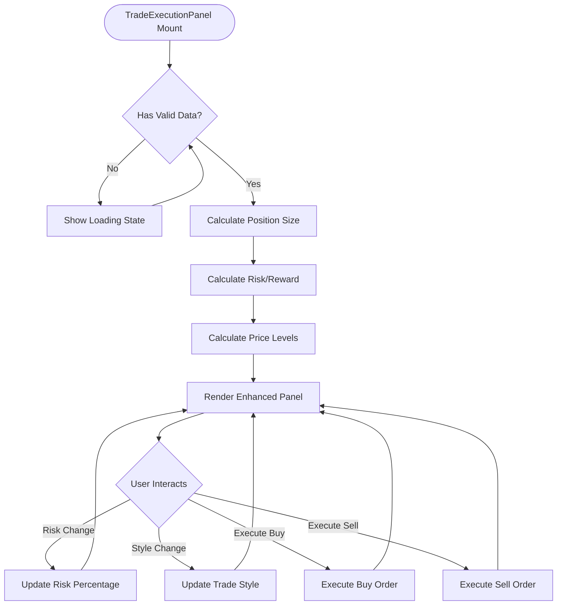

**Diagram sources**
- [TradeExecutionPanel.tsx:106-492](file://frontend/src/components/TradeExecutionPanel.tsx#L106-L492)

**Section sources**
- [TradeExecutionPanel.tsx:1-492](file://frontend/src/components/TradeExecutionPanel.tsx#L1-L492)

### AIRecommendations
- **ENHANCED COMPONENT** - AI-powered pair recommendations with confidence scoring
- Responsibilities
  - Fetches AI-generated pair recommendations from backend API.
  - Displays recommendations with confidence levels and risk analysis.
  - Provides pair selection functionality for quick market switching.
  - Shows signal status with countdown timers and expiration notices.

- Recommendation Features
  - AI confidence scoring with visual progress bars.
  - Sharpe ratio analysis for risk-return evaluation.
  - Volatility and correlation risk assessment.
  - Signal status with real-time countdown timers.
  - Pair selection with one-click switching.

- Enhanced UI Elements
  - Sparkle icon for AI-powered recommendations.
  - Color-coded signal badges (BUY/SELL/HOLD).
  - Confidence visualization with gradient bars.
  - Risk assessment with volatility and correlation indicators.
  - Signal age tracking with relative time formatting.

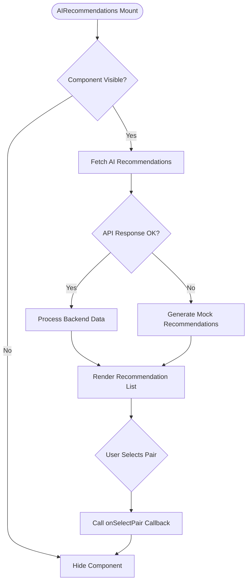

**Diagram sources**
- [AIRecommendations.tsx:134-289](file://frontend/src/components/AIRecommendations.tsx#L134-L289)

**Section sources**
- [AIRecommendations.tsx:1-289](file://frontend/src/components/AIRecommendations.tsx#L1-L289)

### ChartToolbar
- Responsibilities
  - Provides a compact toolbar for switching chart timeframes.
  - Highlights the currently selected timeframe.
  - Supports multiple timeframe options (1m, 5m, 15m, 1h, 4h, 1d).

**Section sources**
- [ChartToolbar.tsx:1-47](file://frontend/src/components/ChartToolbar.tsx#L1-L47)

### Configuration and Types
- forexPairs.ts
  - Exports predefined lists of pairs across categories.
  - Provides helpers to convert symbols for external integrations and to map timeframes.
  - Includes default pair and a lookup function by symbol.

- types/index.ts
  - Defines shared interfaces for market data, positions, trades, backtest results, signals, sentiment, leaderboard entries, chart markers, AI recommendations, detected patterns, and AI score data.

**Section sources**
- [forexPairs.ts:1-641](file://frontend/src/config/forexPairs.ts#L1-L641)
- [index.ts:1-223](file://frontend/src/types/index.ts#L1-L223)

## Dependency Analysis
The frontend leverages modern web technologies and libraries:
- React and React DOM for UI rendering.
- TradingView widget for professional-grade charting.
- Recharts for static and responsive chart visualizations.
- Lucide React for UI icons.
- Tailwind CSS for styling with a custom trading-themed palette.

```mermaid
graph TB
REACT["react@^18.2.0"]
REACTDOM["react-dom@^18.2.0"]
TRADINGVIEW["tradingview-widget"]
RECHARTS["recharts@^2.10.0"]
LUCIDE["lucide-react@^0.294.0"]
TAILWIND["tailwindcss@^3.4.0"]
APP["App.tsx"] --> REACT
APP --> REACTDOM
DASH["Dashboard.tsx"] --> TRADINGVIEW
DASH --> RECHARTS
LIVE["LiveTrading.tsx"] --> TRADINGVIEW
PAIRSEL["PairSelector.tsx"] --> LUCIDE
TRADINGCHART["TradingChart.tsx"] --> TRADINGVIEW
CHARTTOOLBAR["ChartToolbar.tsx"] --> LUCIDE
AITRADINGHUB["AITradingHub.tsx"] --> LUCIDE
GOLDSCALPER["GoldScalperPro.tsx"] --> LUCIDE
TRADEEXECUTION["TradeExecutionPanel.tsx"] --> LUCIDE
AIRecommendations["AIRecommendations.tsx"] --> LUCIDE
APP --> TAILWIND
DASH --> TAILWIND
LIVE --> TAILWIND
SCAN --> TAILWIND
BACKTEST --> TAILWIND
SOCIAL --> TAILWIND
```

**Diagram sources**
- [package.json:11-24](file://frontend/package.json#L11-L24)
- [App.tsx:1-176](file://frontend/src/App.tsx#L1-L176)
- [Dashboard.tsx:1-676](file://frontend/src/pages/Dashboard.tsx#L1-L676)
- [LiveTrading.tsx:1-590](file://frontend/src/pages/LiveTrading.tsx#L1-L590)
- [PairSelector.tsx:1-292](file://frontend/src/components/PairSelector.tsx#L1-L292)
- [TradingChart.tsx:1-221](file://frontend/src/components/TradingChart.tsx#L1-L221)
- [ChartToolbar.tsx:1-47](file://frontend/src/components/ChartToolbar.tsx#L1-L47)
- [AITradingHub.tsx:1-1007](file://frontend/src/components/AITradingHub.tsx#L1-L1007)
- [GoldScalperPro.tsx:1-467](file://frontend/src/components/GoldScalperPro.tsx#L1-L467)
- [TradeExecutionPanel.tsx:1-492](file://frontend/src/components/TradeExecutionPanel.tsx#L1-L492)
- [AIRecommendations.tsx:1-289](file://frontend/src/components/AIRecommendations.tsx#L1-L289)

**Section sources**
- [package.json:1-31](file://frontend/package.json#L1-L31)
- [tailwind.config.js:1-26](file://frontend/tailwind.config.js#L1-L26)

## Performance Considerations
- Chart Rendering
  - Use TradingView widget for efficient chart rendering and minimal DOM updates.
  - Implement proper cleanup and error boundaries for chart components.
  - Limit polling intervals for gold scalper and optimize API calls.

- Polling Strategies
  - Adjust polling intervals based on timeframe granularity to balance responsiveness and resource usage.
  - **NEW**: GoldScalperPro uses aggressive polling (2-second intervals) for real-time scalping signals.
  - **Enhanced**: Dashboard optimizes polling based on trade style (scalp vs swing).

- State Updates
  - Batch UI updates and avoid unnecessary re-renders by using memoization and stable callbacks.
  - **NEW**: AITradingHub implements useMemo for derived calculations to improve performance.

- Data Freshness
  - Track last fetched timestamps and display data staleness to inform users and reduce redundant requests.
  - **Enhanced**: Dashboard tracks data freshness with live/delayed/stale indicators.

## Troubleshooting Guide
- Chart Not Loading
  - Verify TradingView widget script loads successfully.
  - Check network tab for failed requests and inspect response payloads.
  - **NEW**: ChartErrorBoundary provides fallback UI for chart failures.

- Pair Selection Issues
  - Ensure selected pair symbol exists in the configured pair lists.
  - Confirm localStorage defaults are valid and restore gracefully.

- Live Trading Errors
  - Confirm broker connectivity and that order endpoints return expected responses.
  - Validate order confirmation modal inputs and broker availability.

- Scanner Results Empty
  - Verify selected pairs and conditions produce matches.
  - Check backend scan endpoint for errors and ensure results are returned.

- Social Feed Not Updating
  - After sharing a signal, reload the page to reflect new posts.
  - Confirm backend social endpoints are functioning.

- **NEW**: AI Trading Hub Issues
  - Verify AI analysis endpoints are accessible and returning valid data.
  - Check copy trading API connections and authentication.
  - Ensure multi-timeframe analysis data is properly formatted.

- **NEW**: Gold Scalper Pro Problems
  - Confirm gold market data endpoints are responding correctly.
  - Verify floating panel positioning and expand/collapse functionality.
  - Check risk calculation logic for gold-specific pip sizes.

- **Enhanced**: Performance Issues
  - Monitor polling frequencies and reduce intervals if needed.
  - Check for memory leaks in chart components and cleanup properly.
  - Optimize AI recommendation fetching and caching strategies.

**Section sources**
- [TradingChart.tsx:183-221](file://frontend/src/components/TradingChart.tsx#L183-L221)
- [Dashboard.tsx:178-248](file://frontend/src/pages/Dashboard.tsx#L178-L248)
- [LiveTrading.tsx:177-221](file://frontend/src/pages/LiveTrading.tsx#L177-L221)
- [Scanner.tsx:31-52](file://frontend/src/pages/Scanner.tsx#L31-L52)
- [Social.tsx:72-97](file://frontend/src/pages/Social.tsx#L72-L97)
- [AITradingHub.tsx:247-255](file://frontend/src/components/AITradingHub.tsx#L247-L255)
- [GoldScalperPro.tsx:51-97](file://frontend/src/components/GoldScalperPro.tsx#L51-L97)

## Conclusion
The frontend components form a cohesive, modular system that integrates real-time market data, interactive charts, and advanced trading workflows. The addition of the AI Trading Hub and Gold Scalper Pro significantly enhances the platform's capabilities, providing comprehensive AI-powered analysis and specialized trading tools. By leveraging React hooks, TypeScript interfaces, and specialized charting libraries, the application delivers a responsive and extensible user experience. The clear separation between pages, components, configuration, and types ensures maintainability and scalability as new features are introduced.