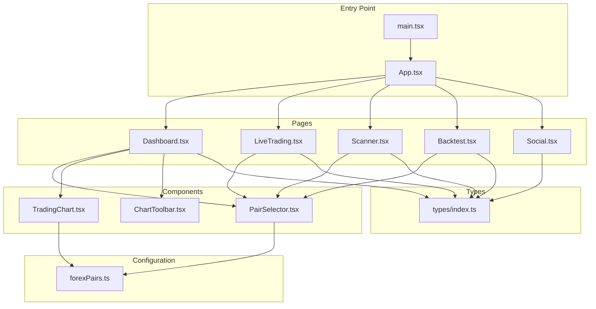
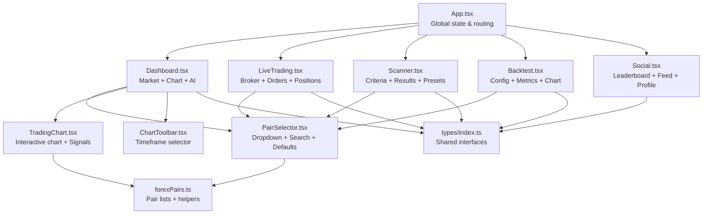
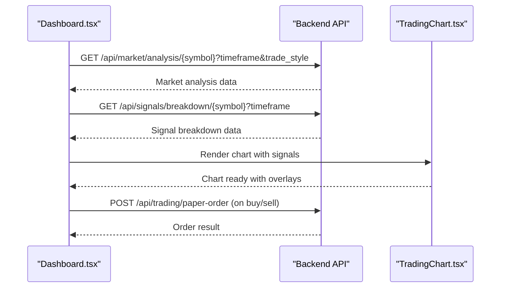
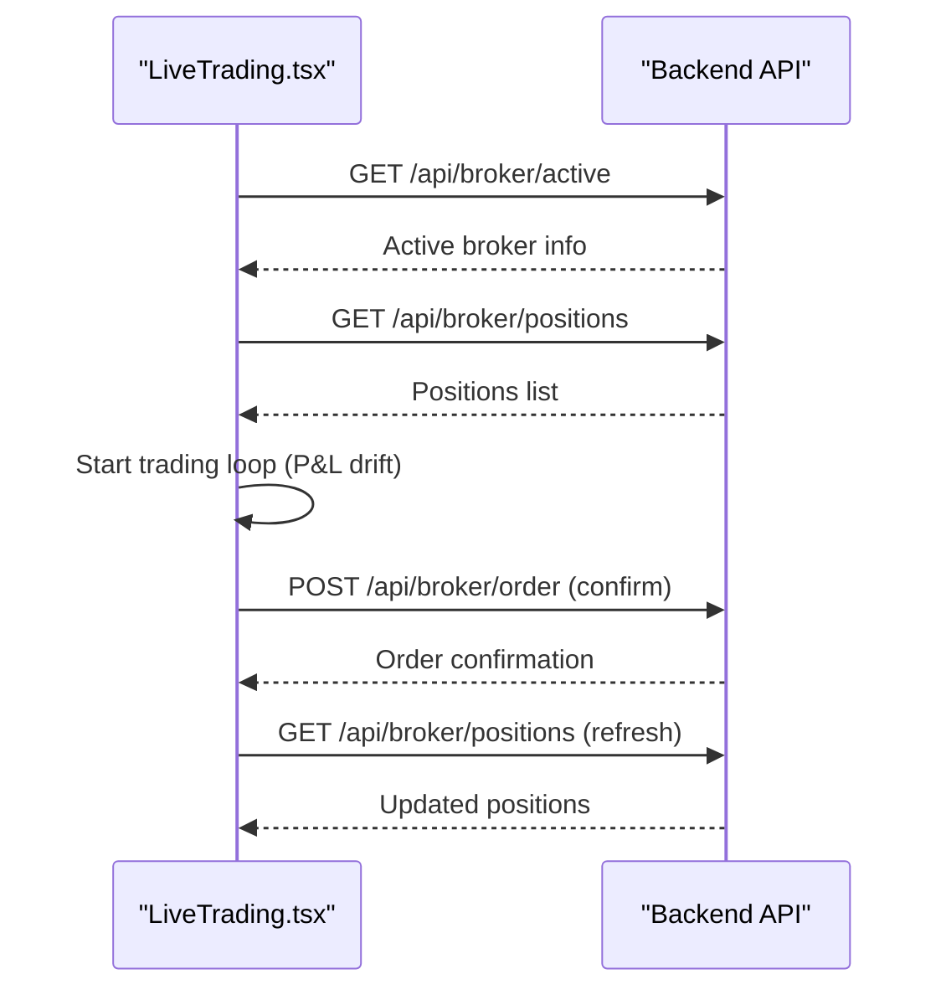
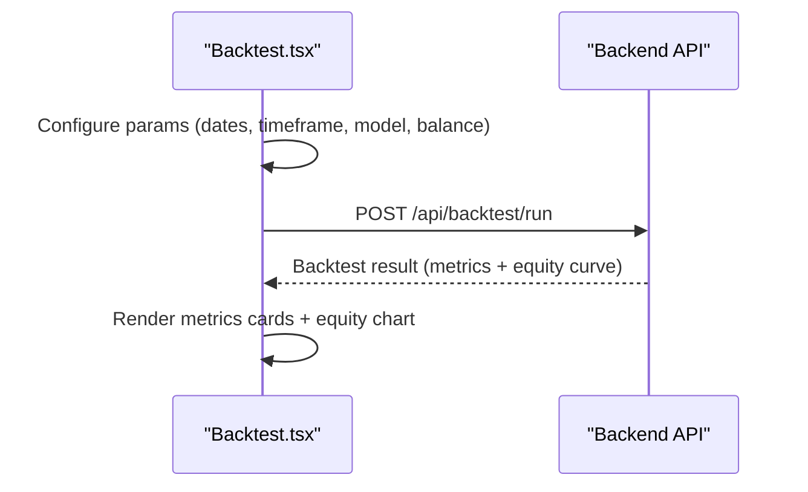
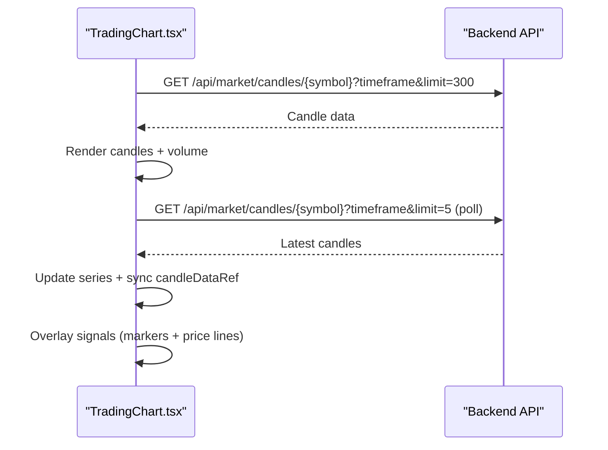
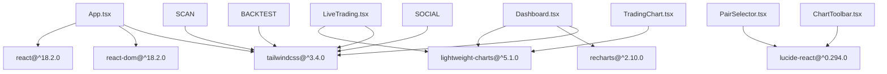

# Frontend Components

<cite>
**Referenced Files in This Document**
- [App.tsx](file://frontend/src/App.tsx)
- [main.tsx](file://frontend/src/main.tsx)
- [Dashboard.tsx](file://frontend/src/pages/Dashboard.tsx)
- [LiveTrading.tsx](file://frontend/src/pages/LiveTrading.tsx)
- [Scanner.tsx](file://frontend/src/pages/Scanner.tsx)
- [Backtest.tsx](file://frontend/src/pages/Backtest.tsx)
- [Social.tsx](file://frontend/src/pages/Social.tsx)
- [PairSelector.tsx](file://frontend/src/components/PairSelector.tsx)
- [TradingChart.tsx](file://frontend/src/components/TradingChart.tsx)
- [ChartToolbar.tsx](file://frontend/src/components/ChartToolbar.tsx)
- [forexPairs.ts](file://frontend/src/config/forexPairs.ts)
- [index.ts](file://frontend/src/types/index.ts)
- [package.json](file://frontend/package.json)
- [tsconfig.json](file://frontend/tsconfig.json)
- [tailwind.config.js](file://frontend/tailwind.config.js)
</cite>

## Table of Contents
1. [Introduction](#introduction)
2. [Project Structure](#project-structure)
3. [Core Components](#core-components)
4. [Architecture Overview](#architecture-overview)
5. [Detailed Component Analysis](#detailed-component-analysis)
6. [Dependency Analysis](#dependency-analysis)
7. [Performance Considerations](#performance-considerations)
8. [Troubleshooting Guide](#troubleshooting-guide)
9. [Conclusion](#conclusion)

## Introduction
This document provides a comprehensive overview of the frontend components for the AI Trading Bot application. It covers the application shell, page-level components, reusable UI components, configuration, and type definitions. The frontend is built with React, TypeScript, Tailwind CSS, and integrates with lightweight-charts for interactive financial charts. It communicates with backend APIs for market data, trading signals, backtesting, and social features.

## Project Structure
The frontend is organized into pages, components, configuration, types, and utilities. The main entry point initializes the React application and mounts the root component. Pages encapsulate major application views, while components provide reusable UI elements. Configuration defines supported trading pairs and utilities for symbol conversion. Types define shared interfaces across the application.

**Diagram sources**
- [main.tsx:1-11](file://frontend/src/main.tsx#L1-L11)
- [App.tsx:1-176](file://frontend/src/App.tsx#L1-L176)
- [Dashboard.tsx:1-534](file://frontend/src/pages/Dashboard.tsx#L1-L534)
- [LiveTrading.tsx:1-590](file://frontend/src/pages/LiveTrading.tsx#L1-L590)
- [Scanner.tsx:1-323](file://frontend/src/pages/Scanner.tsx#L1-L323)
- [Backtest.tsx:1-271](file://frontend/src/pages/Backtest.tsx#L1-L271)
- [Social.tsx:1-455](file://frontend/src/pages/Social.tsx#L1-L455)
- [PairSelector.tsx:1-292](file://frontend/src/components/PairSelector.tsx#L1-L292)
- [TradingChart.tsx:1-421](file://frontend/src/components/TradingChart.tsx#L1-L421)
- [ChartToolbar.tsx:1-47](file://frontend/src/components/ChartToolbar.tsx#L1-L47)
- [forexPairs.ts:1-641](file://frontend/src/config/forexPairs.ts#L1-L641)
- [index.ts:1-202](file://frontend/src/types/index.ts#L1-L202)

**Section sources**
- [main.tsx:1-11](file://frontend/src/main.tsx#L1-L11)
- [App.tsx:1-176](file://frontend/src/App.tsx#L1-L176)
- [package.json:1-31](file://frontend/package.json#L1-L31)
- [tsconfig.json:1-22](file://frontend/tsconfig.json#L1-L22)
- [tailwind.config.js:1-26](file://frontend/tailwind.config.js#L1-L26)

## Core Components
This section outlines the primary building blocks of the frontend and their responsibilities.

- Application Shell (App)
  - Manages global state for active tab, selected trading pair, active pairs, and recent pairs.
  - Persists default pair and recent pairs to localStorage.
  - Renders the sidebar navigation and switches between pages based on the active tab.
  - Passes pair selection callbacks and state to child pages.

- Page-Level Components
  - Dashboard: Integrates market analysis, charting, AI recommendations, heatmaps, sentiment panels, and watchlist cards.
  - LiveTrading: Provides real-time trading controls, broker connection status, order book, recent activity, and position management.
  - Scanner: Allows building custom screening criteria, running scans, saving presets, and sorting results.
  - Backtest: Configures historical backtesting parameters and displays equity curve and performance metrics.
  - Social: Implements leaderboard, community signal feed, user profile, and sharing signals.

- Reusable Components
  - PairSelector: Dropdown selector with category tabs, search, recent chips, and default pair actions.
  - TradingChart: Interactive candlestick chart with live updates and signal overlays.
  - ChartToolbar: Timeframe selector for chart intervals.

- Configuration and Types
  - forexPairs.ts: Defines major/minor/exotic pairs, commodities, crypto, indices, default pair, and helpers for symbol conversion.
  - types/index.ts: Shared interfaces for market data, positions, trades, backtest results, signals, and sentiment.

**Section sources**
- [App.tsx:1-176](file://frontend/src/App.tsx#L1-L176)
- [Dashboard.tsx:1-534](file://frontend/src/pages/Dashboard.tsx#L1-L534)
- [LiveTrading.tsx:1-590](file://frontend/src/pages/LiveTrading.tsx#L1-L590)
- [Scanner.tsx:1-323](file://frontend/src/pages/Scanner.tsx#L1-L323)
- [Backtest.tsx:1-271](file://frontend/src/pages/Backtest.tsx#L1-L271)
- [Social.tsx:1-455](file://frontend/src/pages/Social.tsx#L1-L455)
- [PairSelector.tsx:1-292](file://frontend/src/components/PairSelector.tsx#L1-L292)
- [TradingChart.tsx:1-421](file://frontend/src/components/TradingChart.tsx#L1-L421)
- [ChartToolbar.tsx:1-47](file://frontend/src/components/ChartToolbar.tsx#L1-L47)
- [forexPairs.ts:1-641](file://frontend/src/config/forexPairs.ts#L1-L641)
- [index.ts:1-202](file://frontend/src/types/index.ts#L1-L202)

## Architecture Overview
The frontend follows a modular React architecture with clear separation of concerns:
- Pages own domain-specific logic and orchestrate component composition.
- Components encapsulate UI and interaction logic, receiving data via props.
- Configuration and types provide shared constants and contracts.
- State management relies on React hooks with localStorage persistence for user preferences.

**Diagram sources**
- [App.tsx:1-176](file://frontend/src/App.tsx#L1-L176)
- [Dashboard.tsx:1-534](file://frontend/src/pages/Dashboard.tsx#L1-L534)
- [LiveTrading.tsx:1-590](file://frontend/src/pages/LiveTrading.tsx#L1-L590)
- [Scanner.tsx:1-323](file://frontend/src/pages/Scanner.tsx#L1-L323)
- [Backtest.tsx:1-271](file://frontend/src/pages/Backtest.tsx#L1-L271)
- [Social.tsx:1-455](file://frontend/src/pages/Social.tsx#L1-L455)
- [PairSelector.tsx:1-292](file://frontend/src/components/PairSelector.tsx#L1-L292)
- [TradingChart.tsx:1-421](file://frontend/src/components/TradingChart.tsx#L1-L421)
- [ChartToolbar.tsx:1-47](file://frontend/src/components/ChartToolbar.tsx#L1-L47)
- [forexPairs.ts:1-641](file://frontend/src/config/forexPairs.ts#L1-L641)
- [index.ts:1-202](file://frontend/src/types/index.ts#L1-L202)

## Detailed Component Analysis

### Application Shell (App)
- Responsibilities
  - Maintains active tab, selected pair, active pairs, and recent pairs.
  - Persists default pair and recent pairs to localStorage.
  - Renders sidebar navigation and switches pages based on active tab.
  - Passes pair selection callbacks and state to child pages.

- State Management
  - Active tab state determines which page renders.
  - Selected pair state drives chart and analysis components.
  - Active pairs and recent pairs support scanning and quick selection.

- Local Storage Persistence
  - Default pair symbol and recent pair symbols are saved and restored.

**Diagram sources**
- [App.tsx:18-84](file://frontend/src/App.tsx#L18-L84)

**Section sources**
- [App.tsx:1-176](file://frontend/src/App.tsx#L1-L176)

### Dashboard
- Responsibilities
  - Fetches market analysis and signal breakdown for the selected pair/timeframe.
  - Displays live price ticker, regime indicator, and technical indicators.
  - Renders TradingChart with signal overlays and multi-timeframe analysis.
  - Integrates AI recommendations, pair/sentiment heatmaps, and watchlist.

- Data Fetching
  - Uses periodic polling to refresh analysis and signal breakdown.
  - Tracks data freshness and source (live/mock).

- Trading Execution
  - Provides unified trade execution panel with buy/sell actions.
  - Calculates position size based on risk parameters and signal details.

**Diagram sources**
- [Dashboard.tsx:104-186](file://frontend/src/pages/Dashboard.tsx#L104-L186)
- [TradingChart.tsx:183-299](file://frontend/src/components/TradingChart.tsx#L183-L299)

**Section sources**
- [Dashboard.tsx:1-534](file://frontend/src/pages/Dashboard.tsx#L1-L534)

### Live Trading
- Responsibilities
  - Manages broker connection status and active broker retrieval.
  - Displays real-time P&L, daily P&L, and trades today.
  - Shows open positions with unrealized P&L and entry/current prices.
  - Provides quick buy/sell buttons with order confirmation modal.

- Mock Data and Simulations
  - Generates mock order book and recent activity for demonstration.
  - Simulates P&L drift when trading is active.

**Diagram sources**
- [LiveTrading.tsx:98-221](file://frontend/src/pages/LiveTrading.tsx#L98-L221)

**Section sources**
- [LiveTrading.tsx:1-590](file://frontend/src/pages/LiveTrading.tsx#L1-L590)

### Scanner
- Responsibilities
  - Builds custom scanning criteria with AND/OR logic and indicator conditions.
  - Runs scans against configured pairs and displays results with match scores.
  - Supports saving scanners and applying preset configurations.

- Sorting and Filtering
  - Sorts results by score, symbol, or volume.
  - Filters results and highlights matching conditions.

**Diagram sources**
- [Scanner.tsx:31-107](file://frontend/src/pages/Scanner.tsx#L31-L107)

**Section sources**
- [Scanner.tsx:1-323](file://frontend/src/pages/Scanner.tsx#L1-L323)

### Backtest
- Responsibilities
  - Configures backtest parameters: date range, timeframe, model, initial balance.
  - Executes backtest via backend and renders performance metrics and equity curve.

- Visualization
  - Uses Recharts to plot equity curve with tooltips and responsive container.

**Diagram sources**
- [Backtest.tsx:25-59](file://frontend/src/pages/Backtest.tsx#L25-L59)

**Section sources**
- [Backtest.tsx:1-271](file://frontend/src/pages/Backtest.tsx#L1-L271)

### Social
- Responsibilities
  - Implements leaderboard with weekly/monthly/all-time periods.
  - Displays community signal feed with filters (all, buy, sell, following).
  - Provides user profile with stats and recent signals.
  - Enables sharing signals with entry/stop loss/take profit configuration.

**Diagram sources**
- [Social.tsx:25-97](file://frontend/src/pages/Social.tsx#L25-L97)

**Section sources**
- [Social.tsx:1-455](file://frontend/src/pages/Social.tsx#L1-L455)

### PairSelector
- Responsibilities
  - Dropdown selector with category tabs (All, Forex, Commodities, Crypto, Indices).
  - Search across all pairs with live filtering.
  - Displays recent pairs as chips for quick selection.
  - Allows setting a default pair and selecting pairs for charts or scanners.

- Behavior
  - Outside-click closes the dropdown.
  - Renders categorized groups with category badges and spreads.

**Diagram sources**
- [PairSelector.tsx:30-197](file://frontend/src/components/PairSelector.tsx#L30-L197)

**Section sources**
- [PairSelector.tsx:1-292](file://frontend/src/components/PairSelector.tsx#L1-L292)

### TradingChart
- Responsibilities
  - Creates an interactive candlestick chart with volume histogram.
  - Fetches historical candles and live-updates the latest candles.
  - Overlays signal markers and price lines for entry/SL/TP levels.

- Timeframe Normalization
  - Converts toolbar-style and interval-style timeframes to API-compatible format.

- Signal Visualization
  - Maps signal status to colors and positions arrows above/below bars.
  - Draws dashed horizontal lines for SL/Entry/TP levels.

**Diagram sources**
- [TradingChart.tsx:183-299](file://frontend/src/components/TradingChart.tsx#L183-L299)

**Section sources**
- [TradingChart.tsx:1-421](file://frontend/src/components/TradingChart.tsx#L1-L421)

### ChartToolbar
- Responsibilities
  - Provides a compact toolbar for switching chart timeframes.
  - Highlights the currently selected timeframe.

**Section sources**
- [ChartToolbar.tsx:1-47](file://frontend/src/components/ChartToolbar.tsx#L1-L47)

### Configuration and Types
- forexPairs.ts
  - Exports predefined lists of pairs across categories.
  - Provides helpers to convert symbols for external integrations and to map timeframes.
  - Includes default pair and a lookup function by symbol.

- types/index.ts
  - Defines shared interfaces for market data, positions, trades, backtest results, signals, sentiment, leaderboard entries, and chart markers.

**Section sources**
- [forexPairs.ts:1-641](file://frontend/src/config/forexPairs.ts#L1-L641)
- [index.ts:1-202](file://frontend/src/types/index.ts#L1-L202)

## Dependency Analysis
The frontend leverages modern web technologies and libraries:
- React and React DOM for UI rendering.
- lightweight-charts for high-performance financial charts.
- recharts for static and responsive chart visualizations.
- lucide-react for UI icons.
- Tailwind CSS for styling with a custom trading-themed palette.

**Diagram sources**
- [package.json:11-24](file://frontend/package.json#L11-L24)
- [App.tsx:1-176](file://frontend/src/App.tsx#L1-L176)
- [Dashboard.tsx:1-534](file://frontend/src/pages/Dashboard.tsx#L1-L534)
- [LiveTrading.tsx:1-590](file://frontend/src/pages/LiveTrading.tsx#L1-L590)
- [PairSelector.tsx:1-292](file://frontend/src/components/PairSelector.tsx#L1-L292)
- [TradingChart.tsx:1-421](file://frontend/src/components/TradingChart.tsx#L1-L421)
- [ChartToolbar.tsx:1-47](file://frontend/src/components/ChartToolbar.tsx#L1-L47)

**Section sources**
- [package.json:1-31](file://frontend/package.json#L1-L31)
- [tailwind.config.js:1-26](file://frontend/tailwind.config.js#L1-L26)

## Performance Considerations
- Chart Rendering
  - Use lightweight-charts for efficient candlestick rendering and minimal DOM updates.
  - Limit fetched candle counts per load and poll only the latest candles to reduce bandwidth and CPU usage.

- Polling Strategies
  - Adjust polling intervals based on timeframe granularity to balance responsiveness and resource usage.

- State Updates
  - Batch UI updates and avoid unnecessary re-renders by using memoization and stable callbacks.

- Data Freshness
  - Track last fetched timestamps and display data staleness to inform users and reduce redundant requests.

## Troubleshooting Guide
- Chart Not Loading
  - Verify backend endpoints for candles and analysis are reachable.
  - Check network tab for failed requests and inspect response payloads.

- Pair Selection Issues
  - Ensure selected pair symbol exists in the configured pair lists.
  - Confirm localStorage defaults are valid and restore gracefully.

- Live Trading Errors
  - Confirm broker connectivity and that order endpoints return expected responses.
  - Validate order confirmation modal inputs and broker availability.

- Scanner Results Empty
  - Verify selected pairs and conditions produce matches.
  - Check backend scan endpoint for errors and ensure results are returned.

- Social Feed Not Updating
  - After sharing a signal, reload the page to reflect new posts.
  - Confirm backend social endpoints are functioning.

**Section sources**
- [TradingChart.tsx:194-228](file://frontend/src/components/TradingChart.tsx#L194-L228)
- [Dashboard.tsx:104-147](file://frontend/src/pages/Dashboard.tsx#L104-L147)
- [LiveTrading.tsx:177-221](file://frontend/src/pages/LiveTrading.tsx#L177-L221)
- [Scanner.tsx:31-52](file://frontend/src/pages/Scanner.tsx#L31-L52)
- [Social.tsx:72-97](file://frontend/src/pages/Social.tsx#L72-L97)

## Conclusion
The frontend components form a cohesive, modular system that integrates real-time market data, interactive charts, and trading workflows. By leveraging React hooks, TypeScript interfaces, and specialized charting libraries, the application delivers a responsive and extensible user experience. The clear separation between pages, components, configuration, and types ensures maintainability and scalability as new features are introduced.