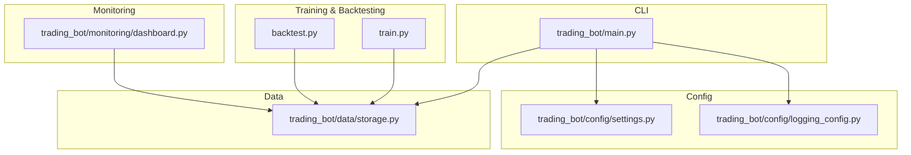
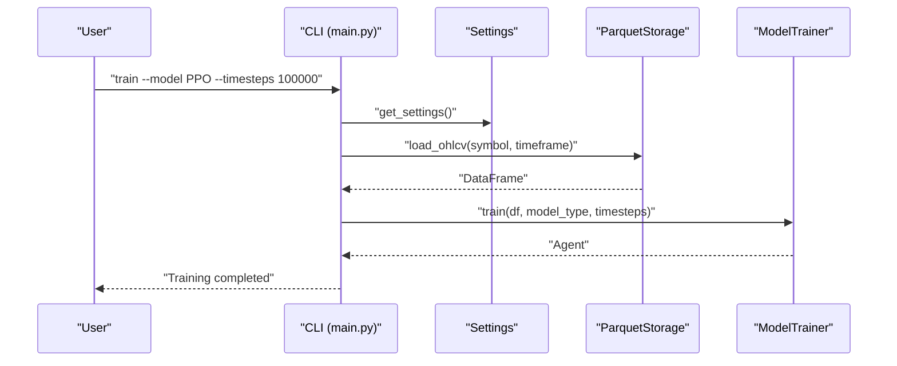
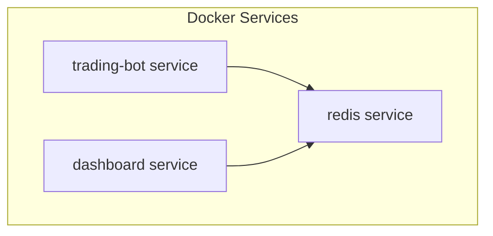

# Getting Started

<cite>
**Referenced Files in This Document**
- [README.md](file://README.md)
- [requirements.txt](file://requirements.txt)
- [pyproject.toml](file://pyproject.toml)
- [Dockerfile](file://Dockerfile)
- [docker-compose.yml](file://docker-compose.yml)
- [trading_bot/main.py](file://trading_bot/main.py)
- [trading_bot/config/settings.py](file://trading_bot/config/settings.py)
- [trading_bot/config/logging_config.py](file://trading_bot/config/logging_config.py)
- [trading_bot/data/storage.py](file://trading_bot/data/storage.py)
- [train.py](file://train.py)
- [backtest.py](file://backtest.py)
- [trading_bot/monitoring/dashboard.py](file://trading_bot/monitoring/dashboard.py)
</cite>

## Table of Contents
1. [Introduction](#introduction)
2. [Project Structure](#project-structure)
3. [Prerequisites](#prerequisites)
4. [Installation](#installation)
5. [Environment Configuration](#environment-configuration)
6. [First-Time Setup Verification](#first-time-setup-verification)
7. [Running the Bot](#running-the-bot)
8. [Practical Examples](#practical-examples)
9. [Docker Deployment](#docker-deployment)
10. [Troubleshooting Guide](#troubleshooting-guide)
11. [Conclusion](#conclusion)

## Introduction
This guide helps you set up and run the AI Trading Bot quickly. You will configure your environment, install dependencies, prepare data, train a reinforcement learning model, backtest it, and optionally deploy via Docker. The project supports both local Python execution and containerized deployment, with a CLI for common tasks and optional monitoring dashboards.

## Project Structure
The repository is organized into modular trading components:
- CLI entrypoint and commands
- Configuration and logging
- Data fetching, storage, and feature engineering
- Risk management and execution engines
- Backtesting and monitoring

**Diagram sources**
- [trading_bot/main.py:1-347](file://trading_bot/main.py#L1-L347)
- [trading_bot/config/settings.py:1-176](file://trading_bot/config/settings.py#L1-L176)
- [trading_bot/config/logging_config.py:1-91](file://trading_bot/config/logging_config.py#L1-L91)
- [trading_bot/data/storage.py:1-484](file://trading_bot/data/storage.py#L1-L484)
- [train.py:1-101](file://train.py#L1-L101)
- [backtest.py:1-110](file://backtest.py#L1-L110)
- [trading_bot/monitoring/dashboard.py:1-328](file://trading_bot/monitoring/dashboard.py#L1-L328)

**Section sources**
- [README.md:198-231](file://README.md#L198-L231)

## Prerequisites
- Python 3.11+ (required)
- Git (recommended)
- Optional: Docker and Docker Compose for containerized deployment

**Section sources**
- [README.md:56-59](file://README.md#L56-L59)
- [pyproject.toml:10](file://pyproject.toml#L10)

## Installation
Follow these steps to install the project locally:

1. Clone the repository
   - Use Git to clone the repository and enter the project directory.

2. Create a virtual environment
   - Create a virtual environment named venv and activate it.

3. Install dependencies
   - Install pinned dependencies from requirements.txt.
   - Alternatively, install the project in editable mode using the project metadata.

4. Verify installation
   - Confirm the CLI is available and shows help.

**Section sources**
- [README.md:63-79](file://README.md#L63-L79)
- [requirements.txt:1-46](file://requirements.txt#L1-L46)
- [pyproject.toml:84-85](file://pyproject.toml#L84-L85)

## Environment Configuration
Set up your environment variables and directories:

1. Create the .env file
   - Copy the example environment file and edit it with your API keys and preferences.

2. Configure exchange credentials
   - Provide exchange API keys and choose whether to use a testnet.

3. Configure trading parameters
   - Set symbols, timeframe, initial capital, and risk parameters.

4. Configure model and notification settings
   - Choose model type and timesteps; optionally enable Telegram or Discord notifications.

5. Ensure directories exist
   - The settings loader creates data, models, and logs directories automatically.

**Section sources**
- [README.md:81-85](file://README.md#L81-L85)
- [README.md:102-128](file://README.md#L102-L128)
- [trading_bot/config/settings.py:23-175](file://trading_bot/config/settings.py#L23-L175)

## First-Time Setup Verification
Run these checks to confirm your setup:

- Show configuration
  - Use the CLI to display current settings and verify they match your .env.

- Test data directory creation
  - The settings loader ensures data, models, and logs directories exist.

- Verify CLI availability
  - Run the CLI help to confirm the entrypoint is working.

**Section sources**
- [trading_bot/main.py:48-66](file://trading_bot/main.py#L48-L66)
- [trading_bot/config/settings.py:157-162](file://trading_bot/config/settings.py#L157-L162)
- [README.md:134-136](file://README.md#L134-L136)

## Running the Bot
Use the CLI to execute common tasks:

- Show help
  - python -m trading_bot.main --help

- Show configuration
  - python -m trading_bot.main config

- Fetch historical data
  - python -m trading_bot.main fetch-data --days 180

- Train a model
  - python -m trading_bot.main train --model PPO --timesteps 100000
  - Or use the training script
  - python train.py --symbols BTC/USDT ETH/USDT --timesteps 100000

- Backtest
  - python -m trading_bot.main backtest --model ./models/PPO_YYYYMMDD.zip
  - Or use the backtest script
  - python backtest.py --model ./models/PPO_YYYYMMDD.zip --monte-carlo

- Run paper trading
  - python -m trading_bot.main run --mode paper --model ./models/PPO_YYYYMMDD.zip

- Run live trading (use with caution)
  - python -m trading_bot.main run --mode live --model ./models/PPO_YYYYMMDD.zip

- Launch dashboard
  - python -m trading_bot.main dashboard

**Section sources**
- [README.md:134-164](file://README.md#L134-L164)
- [trading_bot/main.py:68-343](file://trading_bot/main.py#L68-L343)
- [train.py:43-97](file://train.py#L43-L97)
- [backtest.py:16-106](file://backtest.py#L16-L106)

## Practical Examples
Below are step-by-step examples for common workflows:

- Data fetching
  - Fetch 180 days of historical data for configured symbols.
  - The CLI uses the configured exchange credentials and timeframe.

- Model training
  - Train a PPO model for 100,000 timesteps.
  - Optionally enable hyperparameter optimization.

- Backtesting
  - Backtest a trained model on the configured symbol and timeframe.
  - Generate a performance report and optionally run walk-forward or Monte Carlo analysis.

- Paper trading
  - Start paper trading with a trained model and monitor performance.

- Live trading
  - Start live trading after confirming your settings and understanding risks.

- Dashboard
  - Launch the Streamlit dashboard to visualize performance and metrics.

**Diagram sources**
- [trading_bot/main.py:105-157](file://trading_bot/main.py#L105-L157)
- [trading_bot/data/storage.py:118-167](file://trading_bot/data/storage.py#L118-L167)

**Section sources**
- [trading_bot/main.py:105-157](file://trading_bot/main.py#L105-L157)
- [trading_bot/data/storage.py:118-167](file://trading_bot/data/storage.py#L118-L167)

## Docker Deployment
Optionally deploy the bot using Docker and Docker Compose:

- Build and run services
  - docker-compose up -d

- View logs
  - docker-compose logs -f trading-bot

- Stop services
  - docker-compose down

- Dashboard
  - Access the Streamlit dashboard on port 8501.

**Diagram sources**
- [docker-compose.yml:3-79](file://docker-compose.yml#L3-L79)
- [Dockerfile:1-44](file://Dockerfile#L1-L44)

**Section sources**
- [README.md:87-98](file://README.md#L87-L98)
- [docker-compose.yml:1-79](file://docker-compose.yml#L1-L79)
- [Dockerfile:1-44](file://Dockerfile#L1-L44)

## Troubleshooting Guide
Common issues and resolutions:

- Import errors
  - Reinstall dependencies from requirements.txt.

- API connection errors
  - Verify exchange API keys and testnet settings in .env.

- Out of memory
  - Reduce batch size or observation window in configuration.

- Model not loading
  - Ensure the model file path exists and is correct.

- Missing directories
  - The settings loader creates data, models, and logs directories automatically.

- Docker health checks
  - The Dockerfile includes a health check to verify the package import.

**Section sources**
- [README.md:311-323](file://README.md#L311-L323)
- [trading_bot/config/settings.py:157-162](file://trading_bot/config/settings.py#L157-L162)
- [Dockerfile:38-40](file://Dockerfile#L38-L40)

## Conclusion
You now have the essentials to install, configure, and run the AI Trading Bot. Start with data fetching and training, validate with backtesting, and then deploy via Docker if desired. Always begin with paper trading and carefully review risk controls before considering live trading.