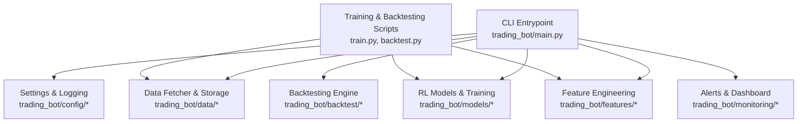
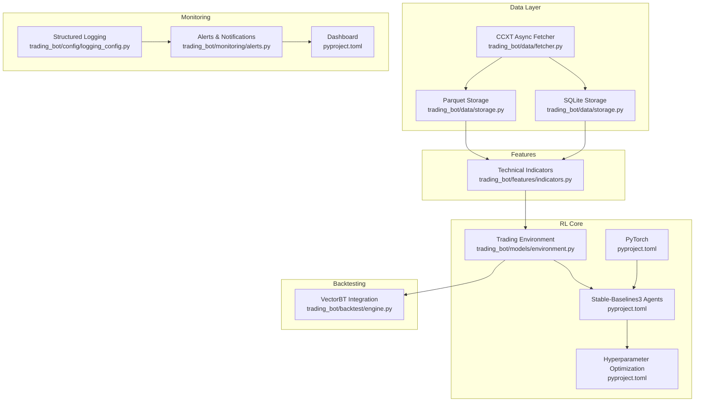
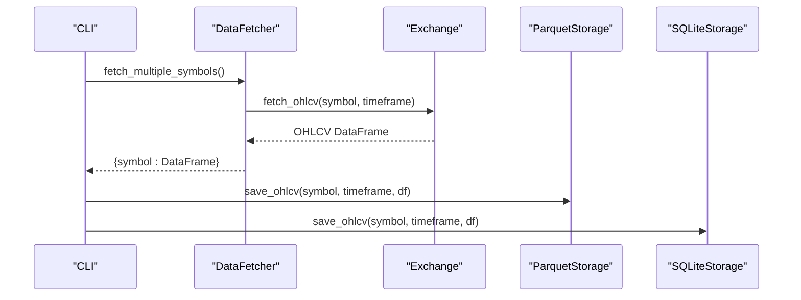
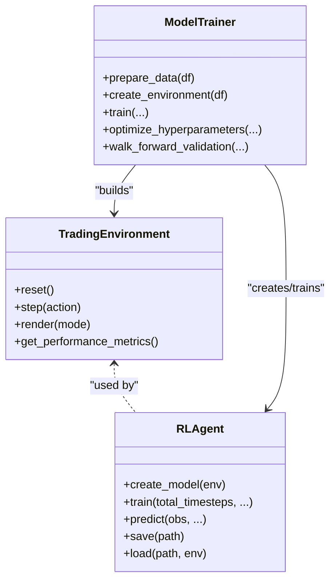
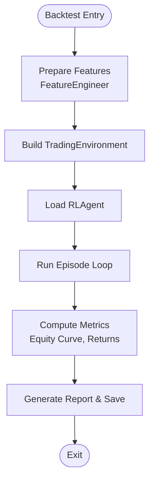
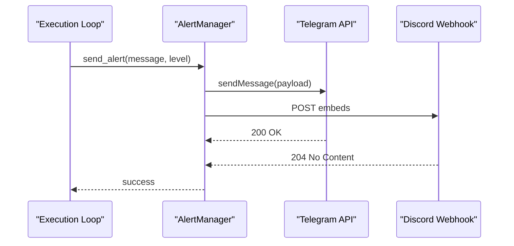
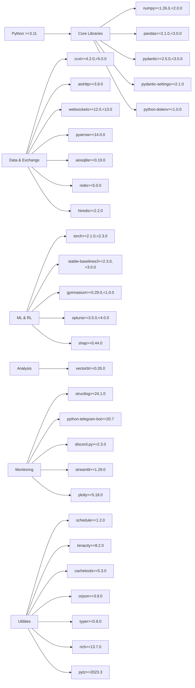

# Key Dependencies

<cite>
**Referenced Files in This Document**
- [requirements.txt](file://requirements.txt)
- [pyproject.toml](file://pyproject.toml)
- [README.md](file://README.md)
- [Dockerfile](file://Dockerfile)
- [docker-compose.yml](file://docker-compose.yml)
- [trading_bot/main.py](file://trading_bot/main.py)
- [trading_bot/config/settings.py](file://trading_bot/config/settings.py)
- [trading_bot/config/logging_config.py](file://trading_bot/config/logging_config.py)
- [trading_bot/data/fetcher.py](file://trading_bot/data/fetcher.py)
- [trading_bot/data/storage.py](file://trading_bot/data/storage.py)
- [trading_bot/features/indicators.py](file://trading_bot/features/indicators.py)
- [trading_bot/models/environment.py](file://trading_bot/models/environment.py)
- [trading_bot/models/train.py](file://trading_bot/models/train.py)
- [trading_bot/backtest/engine.py](file://trading_bot/backtest/engine.py)
- [trading_bot/monitoring/alerts.py](file://trading_bot/monitoring/alerts.py)
- [train.py](file://train.py)
- [backtest.py](file://backtest.py)
</cite>

## Table of Contents
1. [Introduction](#introduction)
2. [Project Structure](#project-structure)
3. [Core Components](#core-components)
4. [Architecture Overview](#architecture-overview)
5. [Detailed Component Analysis](#detailed-component-analysis)
6. [Dependency Analysis](#dependency-analysis)
7. [Performance Considerations](#performance-considerations)
8. [Troubleshooting Guide](#troubleshooting-guide)
9. [Conclusion](#conclusion)

## Introduction
This document catalogs the AI Trading Bot’s key dependencies and technology stack, covering data processing, machine learning and reinforcement learning, analysis, and monitoring. It explains version requirements, compatibility considerations, rationale for technology choices, dependency management strategies, update procedures, troubleshooting, and security best practices.

## Project Structure
The project is organized around modular trading components that rely on a shared set of dependencies. The CLI entry point orchestrates data fetching, training, backtesting, and runtime execution, while configuration and logging are centralized.

**Diagram sources**
- [trading_bot/main.py:1-347](file://trading_bot/main.py#L1-L347)
- [trading_bot/config/settings.py:1-176](file://trading_bot/config/settings.py#L1-L176)
- [trading_bot/config/logging_config.py:1-91](file://trading_bot/config/logging_config.py#L1-L91)
- [trading_bot/data/fetcher.py:1-331](file://trading_bot/data/fetcher.py#L1-L331)
- [trading_bot/data/storage.py:1-484](file://trading_bot/data/storage.py#L1-L484)
- [trading_bot/features/indicators.py:1-294](file://trading_bot/features/indicators.py#L1-L294)
- [trading_bot/models/environment.py:1-405](file://trading_bot/models/environment.py#L1-L405)
- [trading_bot/models/train.py:1-446](file://trading_bot/models/train.py#L1-L446)
- [trading_bot/backtest/engine.py:1-418](file://trading_bot/backtest/engine.py#L1-L418)
- [trading_bot/monitoring/alerts.py:1-311](file://trading_bot/monitoring/alerts.py#L1-L311)
- [train.py:1-101](file://train.py#L1-L101)
- [backtest.py:1-110](file://backtest.py#L1-L110)

**Section sources**
- [trading_bot/main.py:1-347](file://trading_bot/main.py#L1-L347)
- [README.md:1-363](file://README.md#L1-L363)

## Core Components
- Data ingestion and storage: CCXT for asynchronous exchange APIs, Parquet via PyArrow for efficient OHLCV persistence, SQLite for trade and metrics persistence.
- Feature engineering: Pandas and NumPy for technical indicators and transformations.
- Machine learning and RL: PyTorch for deep learning, Stable-Baselines3 for RL agents, Gymnasium for the RL environment, Optuna for hyperparameter optimization.
- Analysis: VectorBT for vectorized backtesting and performance analytics.
- Monitoring and alerts: Structlog for structured logging, python-telegram-bot and discord.py for notifications, Streamlit for dashboards.

**Section sources**
- [requirements.txt:1-46](file://requirements.txt#L1-L46)
- [pyproject.toml:25-69](file://pyproject.toml#L25-L69)
- [README.md:233-239](file://README.md#L233-L239)

## Architecture Overview
The system architecture integrates asynchronous data acquisition, robust feature engineering, RL training and evaluation, and operational monitoring.

**Diagram sources**
- [trading_bot/data/fetcher.py:1-331](file://trading_bot/data/fetcher.py#L1-L331)
- [trading_bot/data/storage.py:1-484](file://trading_bot/data/storage.py#L1-L484)
- [trading_bot/features/indicators.py:1-294](file://trading_bot/features/indicators.py#L1-L294)
- [trading_bot/models/environment.py:1-405](file://trading_bot/models/environment.py#L1-L405)
- [trading_bot/backtest/engine.py:1-418](file://trading_bot/backtest/engine.py#L1-L418)
- [trading_bot/config/logging_config.py:1-91](file://trading_bot/config/logging_config.py#L1-L91)
- [trading_bot/monitoring/alerts.py:1-311](file://trading_bot/monitoring/alerts.py#L1-L311)
- [pyproject.toml:25-69](file://pyproject.toml#L25-L69)

## Detailed Component Analysis

### Data Processing Stack
- CCXT: Asynchronous exchange integration for OHLCV, orderbook, and funding rates. Includes rate limiting and retry logic.
- PyArrow/Parquet: Efficient storage and retrieval of OHLCV datasets.
- SQLite: Persistent caching of OHLCV and trade/metrics records.
- aiohttp/websockets: Network transport for async operations and WebSocket feeds.
- Redis/hiredis: Optional caching layer for real-time market data.

**Diagram sources**
- [trading_bot/main.py:68-103](file://trading_bot/main.py#L68-L103)
- [trading_bot/data/fetcher.py:111-164](file://trading_bot/data/fetcher.py#L111-L164)
- [trading_bot/data/storage.py:71-116](file://trading_bot/data/storage.py#L71-L116)
- [trading_bot/data/storage.py:275-312](file://trading_bot/data/storage.py#L275-L312)

**Section sources**
- [requirements.txt:8-16](file://requirements.txt#L8-L16)
- [trading_bot/data/fetcher.py:1-331](file://trading_bot/data/fetcher.py#L1-L331)
- [trading_bot/data/storage.py:1-484](file://trading_bot/data/storage.py#L1-L484)

### Machine Learning and Reinforcement Learning Stack
- PyTorch: Core deep learning framework for model architectures.
- Stable-Baselines3: RL agents (PPO/SAC) with vectorized environments and callbacks.
- Gymnasium: RL environment interface for trading scenarios.
- Optuna: Bayesian optimization for hyperparameter tuning.
- SHAP: Optional model interpretability.

**Diagram sources**
- [trading_bot/models/environment.py:15-405](file://trading_bot/models/environment.py#L15-L405)
- [trading_bot/models/train.py:23-446](file://trading_bot/models/train.py#L23-L446)

**Section sources**
- [requirements.txt:21-27](file://requirements.txt#L21-L27)
- [pyproject.toml:44-49](file://pyproject.toml#L44-L49)
- [trading_bot/models/environment.py:1-405](file://trading_bot/models/environment.py#L1-L405)
- [trading_bot/models/train.py:1-446](file://trading_bot/models/train.py#L1-L446)

### Analysis and Backtesting Stack
- VectorBT: Vectorized portfolio backtesting with rich metrics (returns, drawdowns, Sharpe, Sortino, Calmar).
- pandas-ta: Technical analysis library (installed from GitHub in requirements).
- Monte Carlo simulation: Probabilistic risk assessment built on historical returns.

**Diagram sources**
- [trading_bot/backtest/engine.py:147-240](file://trading_bot/backtest/engine.py#L147-L240)
- [trading_bot/models/environment.py:134-250](file://trading_bot/models/environment.py#L134-L250)
- [trading_bot/models/train.py:99-185](file://trading_bot/models/train.py#L99-L185)

**Section sources**
- [requirements.txt:28-29](file://requirements.txt#L28-L29)
- [trading_bot/backtest/engine.py:1-418](file://trading_bot/backtest/engine.py#L1-L418)

### Monitoring and Observability Stack
- Structlog: Structured logging with processors and formatters.
- python-telegram-bot: Telegram alerts with HTML formatting.
- discord.py: Discord webhook notifications.
- Streamlit: Web dashboard launched from CLI.

**Diagram sources**
- [trading_bot/monitoring/alerts.py:150-180](file://trading_bot/monitoring/alerts.py#L150-L180)

**Section sources**
- [requirements.txt:31-36](file://requirements.txt#L31-L36)
- [trading_bot/config/logging_config.py:1-91](file://trading_bot/config/logging_config.py#L1-L91)
- [trading_bot/monitoring/alerts.py:1-311](file://trading_bot/monitoring/alerts.py#L1-L311)
- [trading_bot/main.py:328-343](file://trading_bot/main.py#L328-L343)

## Dependency Analysis
The project defines strict version bounds for core dependencies to ensure stability and compatibility across Python versions and platforms.

**Diagram sources**
- [requirements.txt:1-46](file://requirements.txt#L1-L46)
- [pyproject.toml:25-69](file://pyproject.toml#L25-L69)

**Section sources**
- [requirements.txt:1-46](file://requirements.txt#L1-L46)
- [pyproject.toml:10-69](file://pyproject.toml#L10-L69)

## Performance Considerations
- Data I/O: Prefer Parquet over CSV for large OHLCV datasets; leverage PyArrow for fast serialization/deserialization.
- Memory footprint: Use rolling windows and incremental training; reduce observation window sizes in environments when memory-constrained.
- Parallelism: Async IO with CCXT and rate-limiting semaphores prevents throttling and improves throughput.
- Model training: Use Optuna pruning and smaller episodes during optimization to reduce compute costs.
- Backtesting: VectorBT enables vectorized computations; avoid excessive feature explosion that inflates observation space.

[No sources needed since this section provides general guidance]

## Troubleshooting Guide
Common dependency-related issues and resolutions:
- Import errors: Ensure all dependencies are installed per requirements or pyproject configuration.
- API connectivity: Verify exchange credentials and testnet settings in environment configuration.
- Memory pressure: Reduce batch sizes, observation window, or training timesteps.
- Model loading failures: Confirm model file path and environment compatibility.
- Network errors: Retries are built-in; check network connectivity and rate limits.
- Logging anomalies: Confirm structlog processors and handler configuration.

**Section sources**
- [README.md:309-323](file://README.md#L309-L323)
- [trading_bot/data/fetcher.py:106-110](file://trading_bot/data/fetcher.py#L106-L110)
- [trading_bot/config/logging_config.py:61-78](file://trading_bot/config/logging_config.py#L61-L78)

## Conclusion
The AI Trading Bot leverages a cohesive stack of data, ML, analysis, and monitoring libraries to deliver a production-grade RL trading system. Version constraints and modular architecture enable reproducibility, maintainability, and scalability. Adhering to the outlined dependency management and security practices ensures reliable operation in both research and live environments.