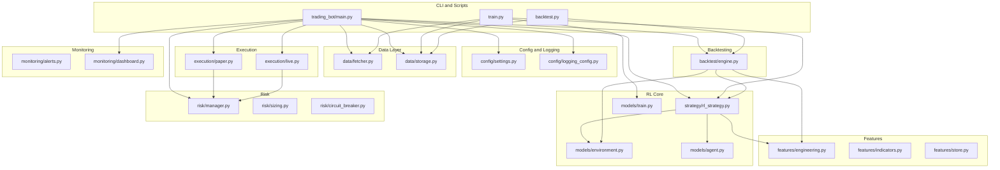
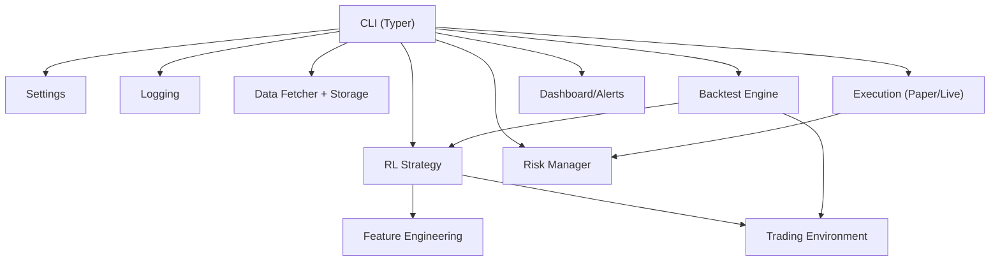
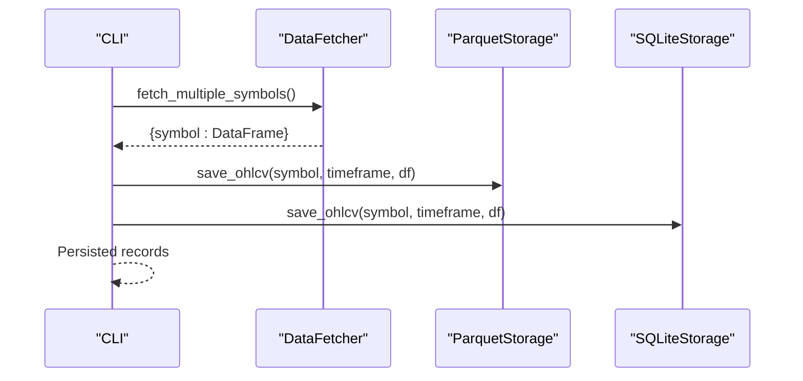
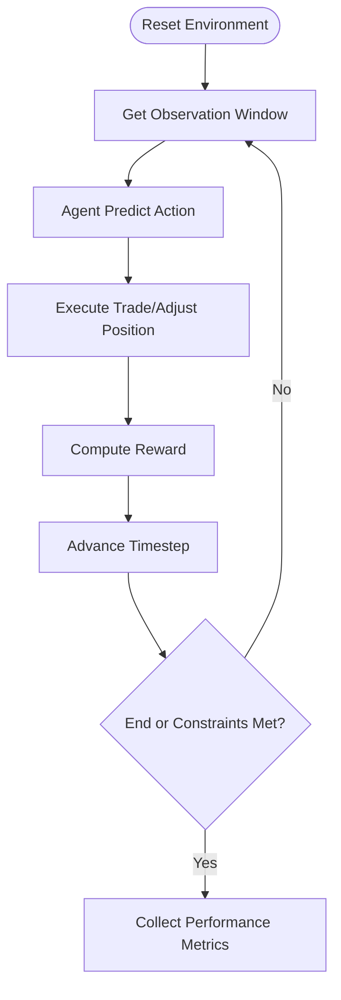
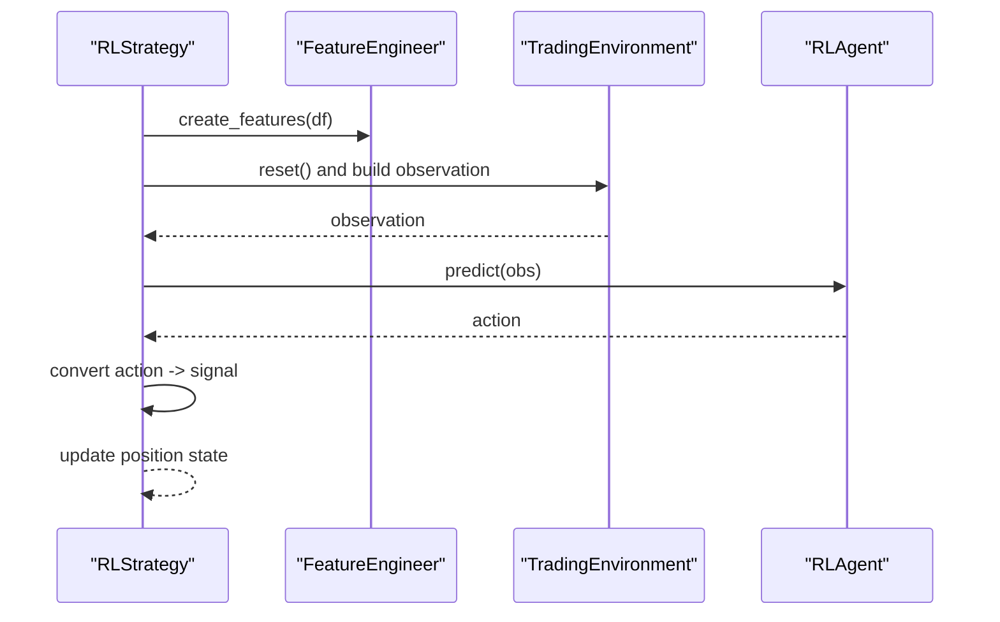
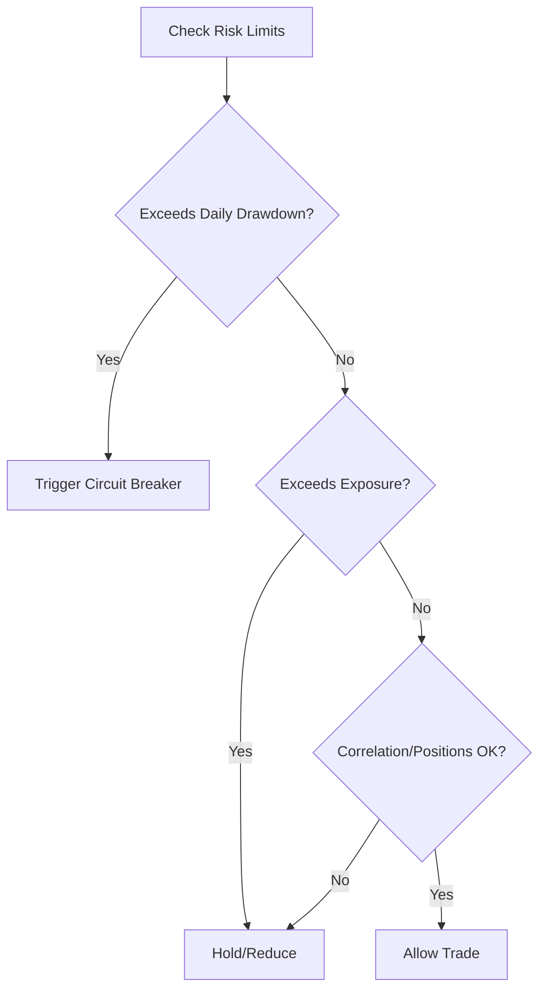
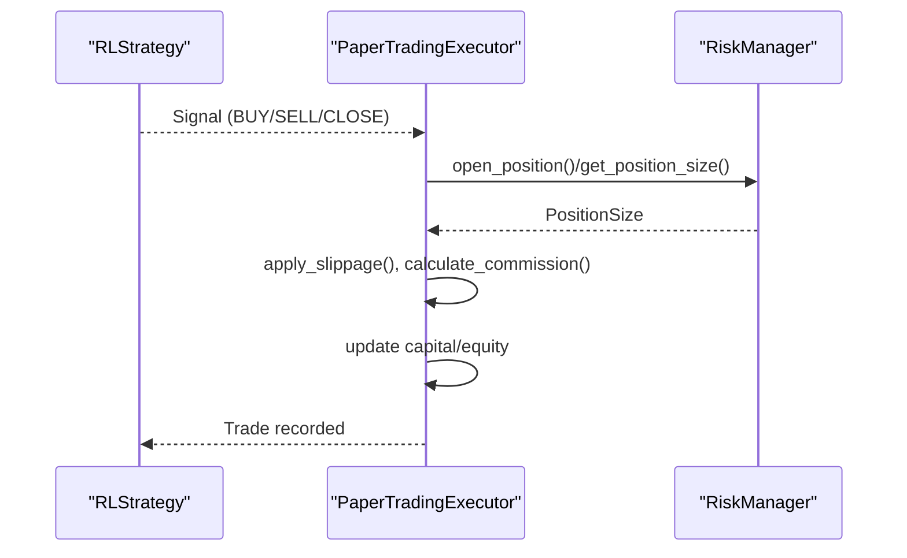
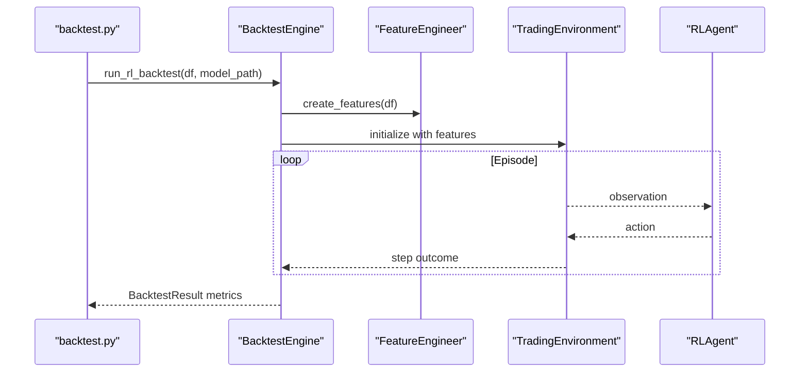
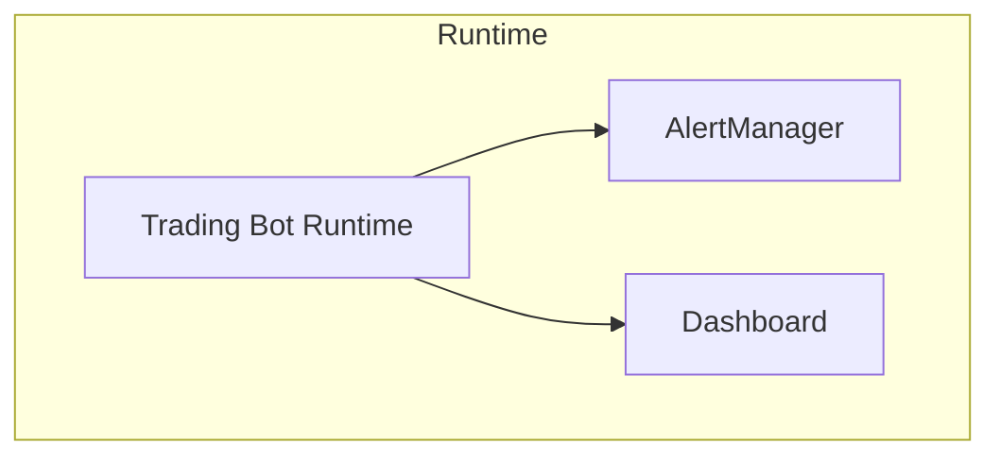
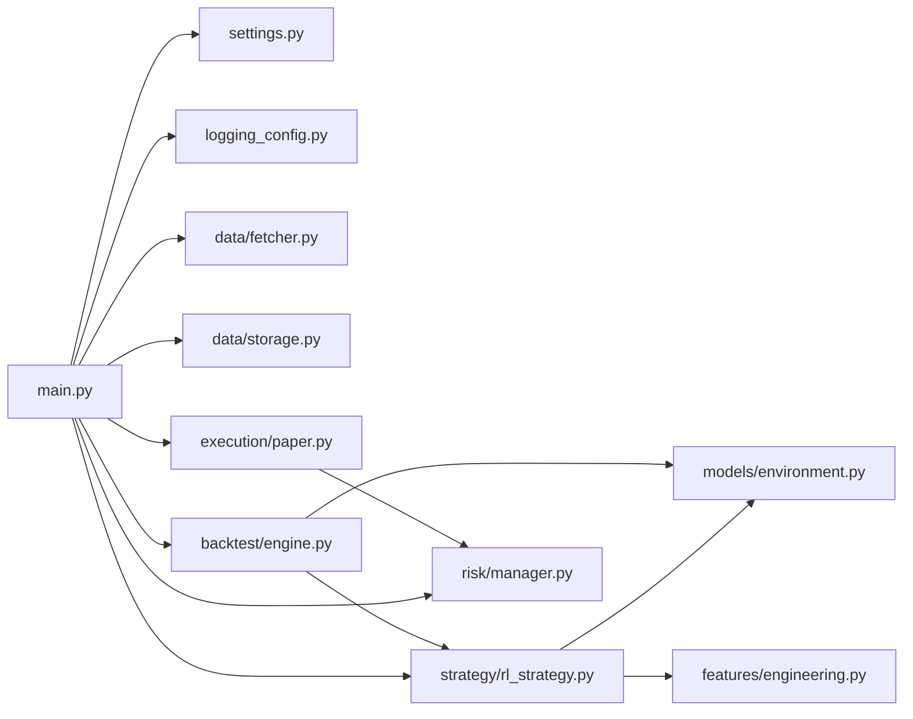

# Project Overview

<cite>
**Referenced Files in This Document**
- [README.md](file://README.md)
- [main.py](file://trading_bot/main.py)
- [settings.py](file://trading_bot/config/settings.py)
- [logging_config.py](file://trading_bot/config/logging_config.py)
- [fetcher.py](file://trading_bot/data/fetcher.py)
- [storage.py](file://trading_bot/data/storage.py)
- [environment.py](file://trading_bot/models/environment.py)
- [rl_strategy.py](file://trading_bot/strategy/rl_strategy.py)
- [manager.py](file://trading_bot/risk/manager.py)
- [paper.py](file://trading_bot/execution/paper.py)
- [engine.py](file://trading_bot/backtest/engine.py)
- [dashboard.py](file://trading_bot/monitoring/dashboard.py)
- [backtest.py](file://backtest.py)
- [train.py](file://train.py)
</cite>

## Table of Contents
1. [Introduction](#introduction)
2. [Project Structure](#project-structure)
3. [Core Components](#core-components)
4. [Architecture Overview](#architecture-overview)
5. [Detailed Component Analysis](#detailed-component-analysis)
6. [Dependency Analysis](#dependency-analysis)
7. [Performance Considerations](#performance-considerations)
8. [Troubleshooting Guide](#troubleshooting-guide)
9. [Conclusion](#conclusion)

## Introduction
This document presents a comprehensive overview of the AI Trading Bot project, a production-ready cryptocurrency trading system powered by Reinforcement Learning (PPO/SAC). The platform integrates a robust data pipeline, advanced feature engineering, RL-driven strategies, comprehensive risk controls, vectorized backtesting, and real-time monitoring. It supports both paper and live trading modes, with strong emphasis on safety, configurability, and extensibility.

The system is designed for both beginners seeking a guided walkthrough and experienced developers who need precise technical details. Terminology and module names align with the codebase to ensure clarity and traceability.

## Project Structure
The repository is organized around modular domains:
- Config and logging
- Data ingestion and storage
- Feature engineering
- RL environment and agent
- Strategy layer
- Risk management
- Execution engines (paper/live)
- Backtesting
- Monitoring and dashboards
- CLI and scripts for training/backtesting

**Diagram sources**
- [main.py:1-347](file://trading_bot/main.py#L1-L347)
- [settings.py:1-176](file://trading_bot/config/settings.py#L1-L176)
- [logging_config.py:1-91](file://trading_bot/config/logging_config.py#L1-L91)
- [fetcher.py:1-331](file://trading_bot/data/fetcher.py#L1-L331)
- [storage.py:1-484](file://trading_bot/data/storage.py#L1-L484)
- [environment.py:1-405](file://trading_bot/models/environment.py#L1-L405)
- [rl_strategy.py:1-285](file://trading_bot/strategy/rl_strategy.py#L1-L285)
- [manager.py:1-432](file://trading_bot/risk/manager.py#L1-L432)
- [paper.py:1-392](file://trading_bot/execution/paper.py#L1-L392)
- [engine.py:1-418](file://trading_bot/backtest/engine.py#L1-L418)
- [dashboard.py:1-328](file://trading_bot/monitoring/dashboard.py#L1-L328)
- [backtest.py:1-110](file://backtest.py#L1-L110)
- [train.py:1-101](file://train.py#L1-L101)

**Section sources**
- [README.md:198-231](file://README.md#L198-L231)
- [main.py:1-347](file://trading_bot/main.py#L1-L347)

## Core Components
- Configuration and settings: Centralized typed settings with validation, environment parsing, and defaults for trading, risk, data storage, model, notifications, logging, and monitoring.
- Data pipeline: Async CCXT fetcher for OHLCV, orderbook, and funding rates; Parquet/SQLite storage for efficient persistence and retrieval.
- Feature engineering: Extensive technical indicators, custom engineered features, and a feature store abstraction.
- RL environment: Gymnasium-compatible trading environment with realistic slippage/commissions, reward shaping, and risk constraints.
- Strategy: RL-based strategy that converts model actions into actionable signals with confidence thresholds and position tracking.
- Risk management: Position sizing, portfolio exposure limits, daily drawdown tracking, circuit breakers, and stop-loss/take-profit enforcement.
- Execution: Paper trading simulator with slippage/volatility-aware commission calculation and realistic trade lifecycle; live execution adapter.
- Backtesting: VectorBT-backed engine for fast signal-based testing, plus RL environment backtests, walk-forward analysis, and Monte Carlo simulations.
- Monitoring: Trade alerts via Telegram/Discord and a Streamlit dashboard for equity curves, drawdowns, and trade analytics.

**Section sources**
- [settings.py:23-176](file://trading_bot/config/settings.py#L23-L176)
- [fetcher.py:32-331](file://trading_bot/data/fetcher.py#L32-L331)
- [storage.py:53-484](file://trading_bot/data/storage.py#L53-L484)
- [environment.py:15-405](file://trading_bot/models/environment.py#L15-L405)
- [rl_strategy.py:19-285](file://trading_bot/strategy/rl_strategy.py#L19-L285)
- [manager.py:58-432](file://trading_bot/risk/manager.py#L58-L432)
- [paper.py:36-392](file://trading_bot/execution/paper.py#L36-L392)
- [engine.py:41-418](file://trading_bot/backtest/engine.py#L41-L418)
- [dashboard.py:16-328](file://trading_bot/monitoring/dashboard.py#L16-L328)

## Architecture Overview
The system follows a layered architecture:
- CLI orchestrates configuration, data fetching, training, backtesting, and runtime trading.
- Data layer ingests and persists market data.
- Feature engineering transforms raw bars into model-ready features.
- RL environment encapsulates the trading task and reward dynamics.
- Strategy consumes features and model predictions to emit signals.
- Risk manager enforces portfolio-level constraints and circuit breakers.
- Execution engines carry out signals with realistic cost models.
- Backtesting validates strategies across historical data and scenarios.
- Monitoring provides operational visibility and alerting.

**Diagram sources**
- [main.py:19-347](file://trading_bot/main.py#L19-L347)
- [settings.py:23-176](file://trading_bot/config/settings.py#L23-L176)
- [logging_config.py:13-91](file://trading_bot/config/logging_config.py#L13-L91)
- [fetcher.py:32-331](file://trading_bot/data/fetcher.py#L32-L331)
- [storage.py:53-484](file://trading_bot/data/storage.py#L53-L484)
- [environment.py:15-405](file://trading_bot/models/environment.py#L15-L405)
- [rl_strategy.py:19-285](file://trading_bot/strategy/rl_strategy.py#L19-L285)
- [manager.py:58-432](file://trading_bot/risk/manager.py#L58-L432)
- [paper.py:36-392](file://trading_bot/execution/paper.py#L36-L392)
- [engine.py:41-418](file://trading_bot/backtest/engine.py#L41-L418)
- [dashboard.py:258-328](file://trading_bot/monitoring/dashboard.py#L258-L328)

## Detailed Component Analysis

### Data Pipeline
- Async CCXT integration: Initializes exchange connections, applies rate limiting, retries transient failures, and fetches OHLCV, orderbook, and funding rates.
- Storage: Parquet for bulk OHLCV persistence and SQLite for trade metadata/cache; supports deduplication and incremental updates.
- Websocket caching: Conceptual layer for streaming market data (see README architecture).

**Diagram sources**
- [main.py:80-102](file://trading_bot/main.py#L80-L102)
- [fetcher.py:239-275](file://trading_bot/data/fetcher.py#L239-L275)
- [storage.py:71-116](file://trading_bot/data/storage.py#L71-L116)
- [storage.py:275-312](file://trading_bot/data/storage.py#L275-L312)

**Section sources**
- [fetcher.py:32-331](file://trading_bot/data/fetcher.py#L32-L331)
- [storage.py:53-484](file://trading_bot/data/storage.py#L53-L484)

### Feature Engineering
- Feature creation: Generates hundreds of technical indicators and custom features from OHLCV and orderbook-derived signals.
- Feature store: Provides a unified interface to persist and retrieve engineered datasets.

Practical example:
- Use the CLI to fetch data and then train a model on features derived from the stored OHLCV.

**Section sources**
- [rl_strategy.py:68-77](file://trading_bot/strategy/rl_strategy.py#L68-L77)
- [README.md:42-43](file://README.md#L42-L43)

### RL Environment and Agent
- Environment: Defines action and observation spaces, simulates slippage and commissions, computes rewards with drawdown penalties and turnover costs, and tracks equity curves.
- Agent: Loads trained PPO/SAC models and predicts actions given observations.

**Diagram sources**
- [environment.py:105-250](file://trading_bot/models/environment.py#L105-L250)
- [environment.py:306-347](file://trading_bot/models/environment.py#L306-L347)

**Section sources**
- [environment.py:15-405](file://trading_bot/models/environment.py#L15-L405)
- [rl_strategy.py:58-66](file://trading_bot/strategy/rl_strategy.py#L58-L66)

### Strategy Layer
- RLStrategy: Wraps an RL agent, prepares features, generates signals from model actions, and manages position state per symbol.
- Confidence filtering: Only emits signals above a minimum confidence threshold.

**Diagram sources**
- [rl_strategy.py:79-180](file://trading_bot/strategy/rl_strategy.py#L79-L180)
- [environment.py:105-132](file://trading_bot/models/environment.py#L105-L132)

**Section sources**
- [rl_strategy.py:19-285](file://trading_bot/strategy/rl_strategy.py#L19-L285)

### Risk Management
- Position sizing: Supports fixed-fraction and other methods; integrates with risk manager for exposure control.
- Portfolio controls: Daily drawdown, total exposure, max positions, and trade frequency caps.
- Circuit breakers: Triggers on excessive drawdown, consecutive losses, and spikes; can halt trading.

**Diagram sources**
- [manager.py:102-148](file://trading_bot/risk/manager.py#L102-L148)
- [manager.py:299-321](file://trading_bot/risk/manager.py#L299-L321)

**Section sources**
- [manager.py:58-432](file://trading_bot/risk/manager.py#L58-L432)

### Execution Engines
- PaperTradingExecutor: Simulates realistic trading with slippage, commission, and stop-loss enforcement; maintains equity curve and trade history.
- Live execution: Adapter for real orders (exchange-specific), initialized via CLI.

**Diagram sources**
- [paper.py:115-208](file://trading_bot/execution/paper.py#L115-L208)
- [manager.py:150-201](file://trading_bot/risk/manager.py#L150-L201)

**Section sources**
- [paper.py:36-392](file://trading_bot/execution/paper.py#L36-L392)

### Backtesting
- VectorBT-based: Fast portfolio-from-signals backtests with realistic slippage/commissions and rich metrics.
- RL backtest: Runs a trained agent in the environment to produce equity curves and trade-level metrics.
- Walk-forward and Monte Carlo: Out-of-sample testing and probabilistic risk assessment.

**Diagram sources**
- [backtest.py:16-110](file://backtest.py#L16-L110)
- [engine.py:147-240](file://trading_bot/backtest/engine.py#L147-L240)
- [rl_strategy.py:68-77](file://trading_bot/strategy/rl_strategy.py#L68-L77)

**Section sources**
- [engine.py:41-418](file://trading_bot/backtest/engine.py#L41-L418)
- [backtest.py:16-110](file://backtest.py#L16-L110)

### Monitoring and Alerts
- Alerts: Telegram/Discord integrations for trade confirmations, daily PnL, circuit breaker triggers, and errors.
- Dashboard: Streamlit UI visualizing equity curves, drawdowns, monthly returns heatmap, and trade distributions.

**Diagram sources**
- [main.py:230-280](file://trading_bot/main.py#L230-L280)
- [dashboard.py:258-328](file://trading_bot/monitoring/dashboard.py#L258-L328)

**Section sources**
- [dashboard.py:16-328](file://trading_bot/monitoring/dashboard.py#L16-L328)
- [main.py:230-324](file://trading_bot/main.py#L230-L324)

## Dependency Analysis
Key internal dependencies:
- CLI depends on settings, logging, data fetcher/storage, strategy, risk, executors, backtest engine, and dashboard.
- Strategy depends on feature engineering and the RL environment/agent.
- Execution depends on risk manager for position sizing and constraints.
- Backtest engine composes strategy, environment, and feature engineering.

**Diagram sources**
- [main.py:11-17](file://trading_bot/main.py#L11-L17)
- [rl_strategy.py:10-14](file://trading_bot/strategy/rl_strategy.py#L10-L14)
- [paper.py:10-12](file://trading_bot/execution/paper.py#L10-L12)
- [engine.py:13-17](file://trading_bot/backtest/engine.py#L13-L17)

**Section sources**
- [main.py:11-17](file://trading_bot/main.py#L11-L17)
- [rl_strategy.py:10-14](file://trading_bot/strategy/rl_strategy.py#L10-L14)
- [paper.py:10-12](file://trading_bot/execution/paper.py#L10-L12)
- [engine.py:13-17](file://trading_bot/backtest/engine.py#L13-L17)

## Performance Considerations
- Asynchronous data fetching reduces I/O bottlenecks and respects exchange rate limits.
- VectorBT-based backtesting accelerates strategy evaluation compared to event-driven loops.
- Parquet storage enables fast reads/writes and incremental updates.
- Risk checks and circuit breakers prevent catastrophic drawdowns during training and live operation.
- Slippage and commission modeling in paper execution ensures realism for performance estimates.

[No sources needed since this section provides general guidance]

## Troubleshooting Guide
Common issues and resolutions:
- Import errors: Ensure dependencies are installed per requirements.
- API connection errors: Verify API keys and testnet settings in the environment configuration.
- Out of memory: Reduce batch sizes or observation window in configuration.
- Model not loading: Confirm model file path and compatibility with the environment.

**Section sources**
- [README.md:309-323](file://README.md#L309-L323)

## Conclusion
The AI Trading Bot delivers a production-grade framework for RL-powered crypto trading. Its modular design, rigorous risk controls, and comprehensive backtesting stack enable safe experimentation and deployment. Beginners can leverage the CLI and dashboard to get started quickly, while advanced users can customize features, environments, and strategies with confidence in the underlying architecture.