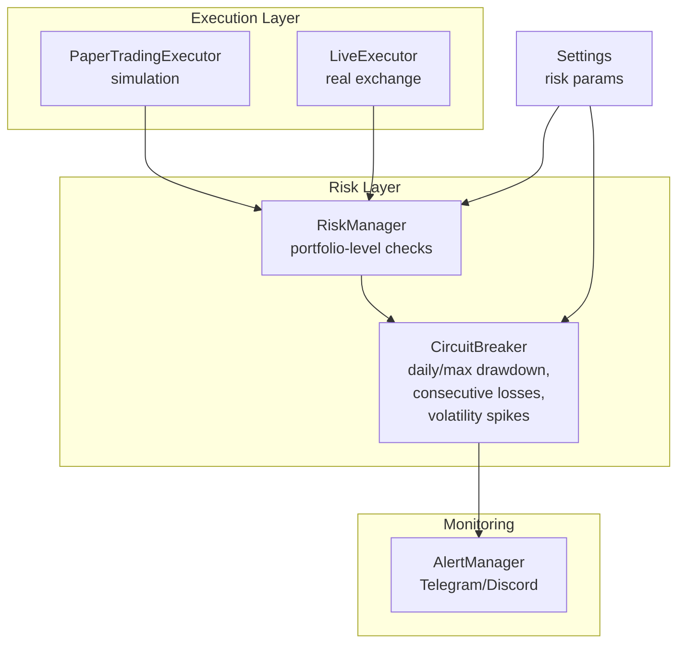
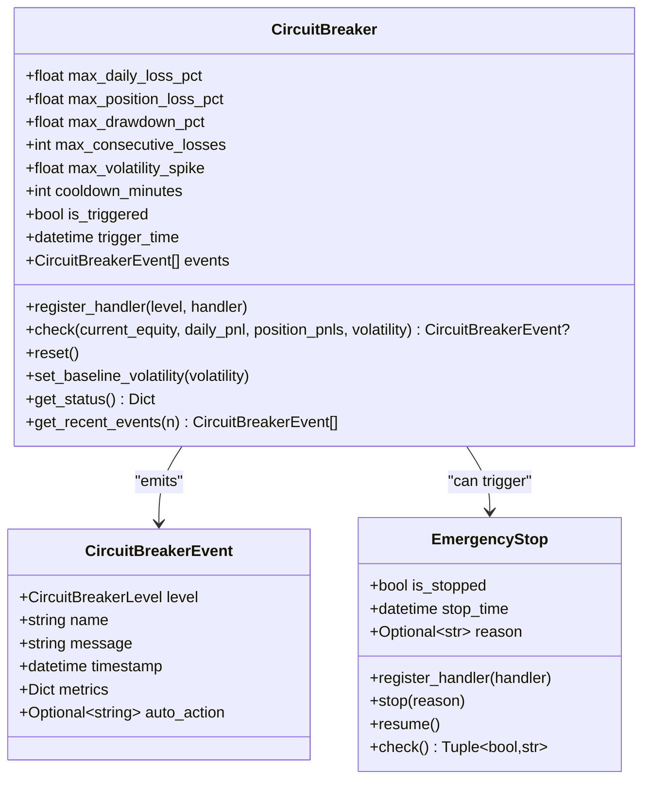
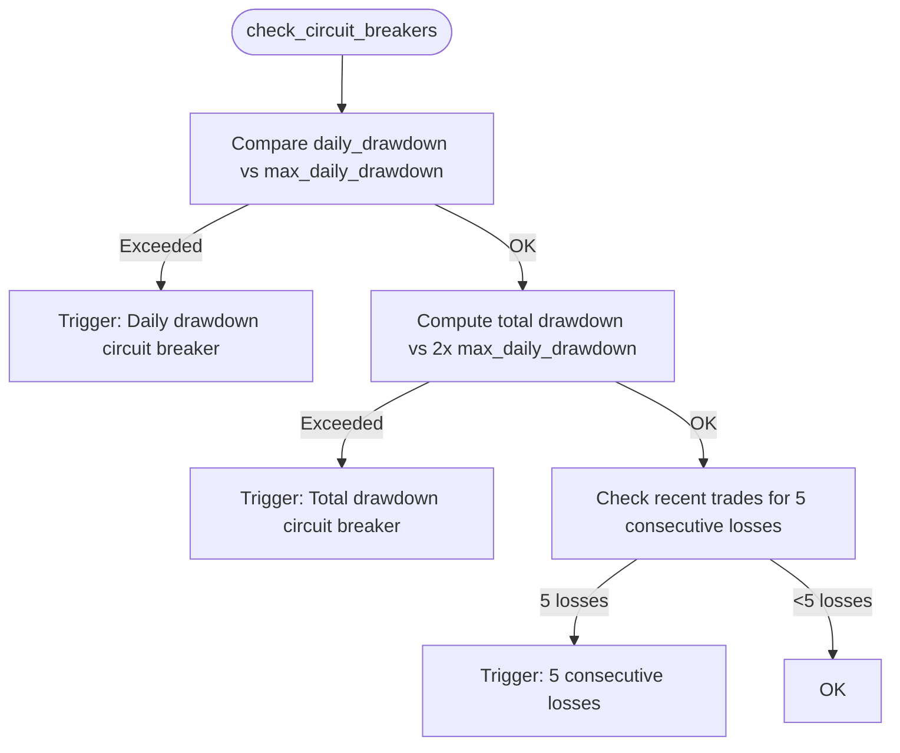
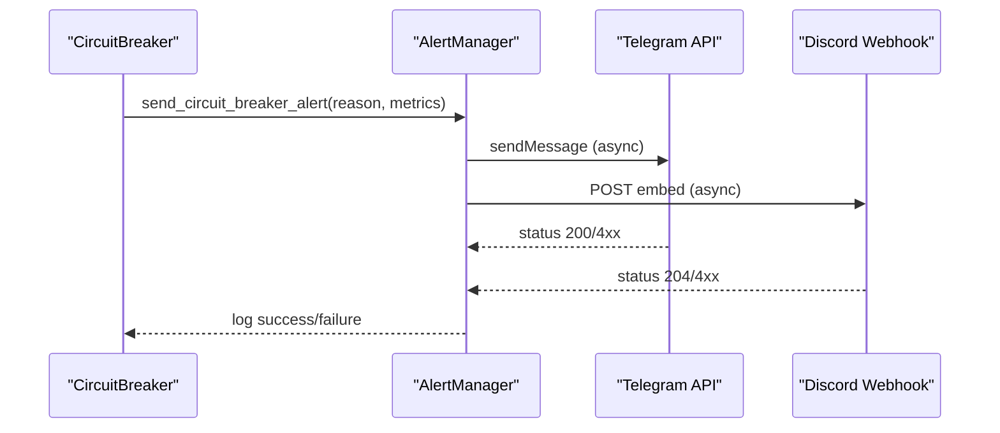
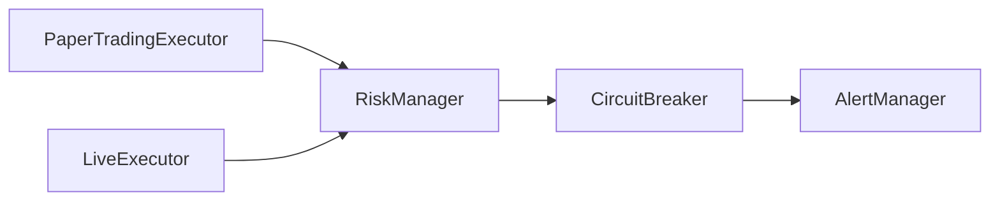
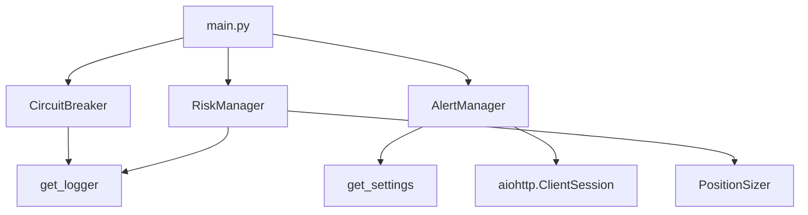

# Circuit Breakers

<cite>
**Referenced Files in This Document**
- [circuit_breaker.py](file://trading_bot/risk/circuit_breaker.py)
- [manager.py](file://trading_bot/risk/manager.py)
- [alerts.py](file://trading_bot/monitoring/alerts.py)
- [settings.py](file://trading_bot/config/settings.py)
- [main.py](file://trading_bot/main.py)
- [paper.py](file://trading_bot/execution/paper.py)
- [live.py](file://trading_bot/execution/live.py)
- [test_risk.py](file://trading_bot/tests/test_risk.py)
</cite>

## Table of Contents
1. [Introduction](#introduction)
2. [Project Structure](#project-structure)
3. [Core Components](#core-components)
4. [Architecture Overview](#architecture-overview)
5. [Detailed Component Analysis](#detailed-component-analysis)
6. [Dependency Analysis](#dependency-analysis)
7. [Performance Considerations](#performance-considerations)
8. [Troubleshooting Guide](#troubleshooting-guide)
9. [Conclusion](#conclusion)
10. [Appendices](#appendices)

## Introduction
This document explains the circuit breaker system for the AI Trading Bot. It covers the implementation of daily drawdown limits, maximum drawdown protection, consecutive loss detection, volatility spike monitoring, and emergency stop mechanisms. It also documents trigger conditions, protective thresholds, automated shutdown procedures, recovery protocols, integration with the RiskManager, notification systems, and manual override capabilities. Practical configuration examples, scenario testing, and emergency response procedures are included.

## Project Structure
The circuit breaker system spans several modules:
- Risk management and circuit breakers: [circuit_breaker.py](file://trading_bot/risk/circuit_breaker.py), [manager.py](file://trading_bot/risk/manager.py)
- Alerts and notifications: [alerts.py](file://trading_bot/monitoring/alerts.py)
- Configuration: [settings.py](file://trading_bot/config/settings.py)
- Application entry point and runtime checks: [main.py](file://trading_bot/main.py)
- Execution integrations: [paper.py](file://trading_bot/execution/paper.py), [live.py](file://trading_bot/execution/live.py)
- Tests: [test_risk.py](file://trading_bot/tests/test_risk.py)



**Diagram sources**
- [circuit_breaker.py:32-184](file://trading_bot/risk/circuit_breaker.py#L32-L184)
- [manager.py:58-321](file://trading_bot/risk/manager.py#L58-L321)
- [paper.py:36-74](file://trading_bot/execution/paper.py#L36-L74)
- [live.py:38-56](file://trading_bot/execution/live.py#L38-L56)
- [alerts.py:23-179](file://trading_bot/monitoring/alerts.py#L23-L179)
- [settings.py:23-111](file://trading_bot/config/settings.py#L23-L111)

**Section sources**
- [circuit_breaker.py:1-336](file://trading_bot/risk/circuit_breaker.py#L1-L336)
- [manager.py:1-432](file://trading_bot/risk/manager.py#L1-L432)
- [alerts.py:1-311](file://trading_bot/monitoring/alerts.py#L1-L311)
- [settings.py:1-176](file://trading_bot/config/settings.py#L1-L176)
- [main.py:214-325](file://trading_bot/main.py#L214-L325)
- [paper.py:36-74](file://trading_bot/execution/paper.py#L36-L74)
- [live.py:38-56](file://trading_bot/execution/live.py#L38-L56)
- [test_risk.py:1-178](file://trading_bot/tests/test_risk.py#L1-L178)

## Core Components
- CircuitBreaker: Implements multiple protective thresholds and emits events with automatic actions.
- RiskManager: Provides portfolio-level risk checks and drawsdown calculations.
- AlertManager: Sends notifications to Telegram and Discord.
- Settings: Centralizes configurable risk parameters.
- Live/Paper Executors: Integrate risk checks and emergency closures.

Key responsibilities:
- Daily drawdown limit enforcement
- Maximum drawdown protection
- Consecutive loss detection
- Volatility spike monitoring
- Emergency stop mechanism
- Automated shutdown and recovery
- Integration with RiskManager and AlertManager

**Section sources**
- [circuit_breaker.py:32-184](file://trading_bot/risk/circuit_breaker.py#L32-L184)
- [manager.py:299-321](file://trading_bot/risk/manager.py#L299-L321)
- [alerts.py:23-179](file://trading_bot/monitoring/alerts.py#L23-L179)
- [settings.py:58-78](file://trading_bot/config/settings.py#L58-L78)

## Architecture Overview
The circuit breaker system operates at two levels:
- Portfolio-level checks via RiskManager
- Event-driven checks via CircuitBreaker

```mermaid
sequenceDiagram
participant Loop as "Main Loop"
participant CB as "CircuitBreaker"
participant RM as "RiskManager"
participant AM as "AlertManager"
participant EX as "Executor"
Loop->>CB : check(current_equity, daily_pnl, position_pnls, volatility)
alt Triggered
CB-->>AM : send_circuit_breaker_alert(reason, metrics)
AM-->>AM : send to Telegram/Discord
CB-->>Loop : should_stop = True
Loop->>EX : pause trading / emergency close
else No trigger
CB-->>Loop : should_stop = False
end
Loop->>RM : check_circuit_breakers()
alt Portfolio-level trigger
RM-->>AM : send_circuit_breaker_alert(...)
RM-->>Loop : should_stop = True
else No trigger
RM-->>Loop : should_stop = False
end
```

**Diagram sources**
- [main.py:263-279](file://trading_bot/main.py#L263-L279)
- [circuit_breaker.py:88-184](file://trading_bot/risk/circuit_breaker.py#L88-L184)
- [manager.py:299-321](file://trading_bot/risk/manager.py#L299-L321)
- [alerts.py:260-284](file://trading_bot/monitoring/alerts.py#L260-L284)

## Detailed Component Analysis

### CircuitBreaker
Implements:
- Daily loss threshold
- Maximum drawdown threshold
- Position-level loss threshold
- Consecutive losing periods
- Volatility spike detection
- Cooldown period and reset
- Event emission with automatic actions



**Diagram sources**
- [circuit_breaker.py:32-277](file://trading_bot/risk/circuit_breaker.py#L32-L277)
- [circuit_breaker.py:280-336](file://trading_bot/risk/circuit_breaker.py#L280-L336)

Key thresholds and behaviors:
- Daily loss: triggers critical action when daily loss percentage exceeds the configured limit.
- Drawdown: triggers emergency action when current drawdown exceeds the configured maximum.
- Position loss: triggers alert action per-position when individual position loss exceeds the configured limit.
- Consecutive losses: triggers warning action when losing streak reaches the configured threshold.
- Volatility spike: triggers warning action when observed volatility exceeds baseline by the configured multiplier.
- Cooldown: prevents repeated triggers for a configured duration after a trigger.

Automatic actions:
- pause_trading
- close_all_positions
- close_position:{symbol}
- reduce_position_size
- reduce_exposure

**Section sources**
- [circuit_breaker.py:35-59](file://trading_bot/risk/circuit_breaker.py#L35-L59)
- [circuit_breaker.py:88-184](file://trading_bot/risk/circuit_breaker.py#L88-L184)
- [circuit_breaker.py:186-235](file://trading_bot/risk/circuit_breaker.py#L186-L235)
- [circuit_breaker.py:237-277](file://trading_bot/risk/circuit_breaker.py#L237-L277)
- [circuit_breaker.py:245-251](file://trading_bot/risk/circuit_breaker.py#L245-L251)

### RiskManager
Provides portfolio-level checks:
- Daily drawdown limit
- Total drawdown limit (2x daily)
- Consecutive losses (5-period)
- Position opening constraints (size, exposure, correlation)



**Diagram sources**
- [manager.py:299-321](file://trading_bot/risk/manager.py#L299-L321)

**Section sources**
- [manager.py:58-321](file://trading_bot/risk/manager.py#L58-L321)

### AlertManager
Sends notifications to Telegram and Discord, including circuit breaker alerts.



**Diagram sources**
- [alerts.py:260-284](file://trading_bot/monitoring/alerts.py#L260-L284)
- [alerts.py:54-148](file://trading_bot/monitoring/alerts.py#L54-L148)

**Section sources**
- [alerts.py:23-179](file://trading_bot/monitoring/alerts.py#L23-L179)
- [alerts.py:260-284](file://trading_bot/monitoring/alerts.py#L260-L284)

### Settings and Configuration
Risk-related settings include:
- max_daily_drawdown
- max_position_size
- max_total_exposure
- risk_per_trade
- volatility_target

These influence both RiskManager and PositionSizer behavior.

**Section sources**
- [settings.py:58-78](file://trading_bot/config/settings.py#L58-L78)

### Integration with Execution Layers
- PaperTradingExecutor: Uses RiskManager for position sizing and risk checks; updates equity and peak equity during trades.
- LiveExecutor: Uses RiskManager for pre-trade checks and updates; supports emergency close all.



**Diagram sources**
- [paper.py:70-74](file://trading_bot/execution/paper.py#L70-L74)
- [live.py:56-56](file://trading_bot/execution/live.py#L56-L56)
- [circuit_breaker.py:32-184](file://trading_bot/risk/circuit_breaker.py#L32-L184)
- [alerts.py:23-179](file://trading_bot/monitoring/alerts.py#L23-L179)

**Section sources**
- [paper.py:36-74](file://trading_bot/execution/paper.py#L36-L74)
- [live.py:38-56](file://trading_bot/execution/live.py#L38-L56)
- [main.py:263-279](file://trading_bot/main.py#L263-L279)

## Dependency Analysis
- CircuitBreaker depends on configuration for thresholds and logs via get_logger.
- RiskManager depends on PositionSizer and maintains state for drawdown and exposure.
- AlertManager depends on settings for credentials and uses async HTTP clients.
- Main loop integrates CircuitBreaker and AlertManager in the trading loop.



**Diagram sources**
- [circuit_breaker.py:8-10](file://trading_bot/risk/circuit_breaker.py#L8-L10)
- [manager.py:10-11](file://trading_bot/risk/manager.py#L10-L11)
- [alerts.py:10-46](file://trading_bot/monitoring/alerts.py#L10-L46)
- [main.py:16-23](file://trading_bot/main.py#L16-L23)

**Section sources**
- [circuit_breaker.py:1-10](file://trading_bot/risk/circuit_breaker.py#L1-L10)
- [manager.py:1-13](file://trading_bot/risk/manager.py#L1-L13)
- [alerts.py:1-12](file://trading_bot/monitoring/alerts.py#L1-L12)
- [main.py:1-22](file://trading_bot/main.py#L1-L22)

## Performance Considerations
- CircuitBreaker checks are lightweight and O(1); they rely on cached state and simple arithmetic.
- Volatility spike detection requires a baseline volatility; set via set_baseline_volatility.
- Cooldown prevents repeated triggers and reduces alert fatigue.
- Asynchronous alert sending avoids blocking the trading loop.

[No sources needed since this section provides general guidance]

## Troubleshooting Guide
Common scenarios and resolutions:
- Frequent warnings for volatility spikes: adjust max_volatility_spike or recalculate baseline volatility.
- Consecutive loss warnings: reduce position sizes or tighten stop-losses; consider reducing max_consecutive_losses.
- Daily drawdown triggers: lower max_daily_drawdown or reduce exposure; review recent trades.
- Emergency drawdown triggers: emergency close all positions; investigate root cause; increase max_drawdown_pct cautiously.
- No alerts sent: verify Telegram/Discord credentials and webhook URLs in settings.

Operational tips:
- Use get_status to inspect current trigger state and recent events.
- Use get_recent_events to audit recent triggers.
- Use reset to clear state after cooldown expires.

**Section sources**
- [circuit_breaker.py:237-277](file://trading_bot/risk/circuit_breaker.py#L237-L277)
- [alerts.py:260-284](file://trading_bot/monitoring/alerts.py#L260-L284)

## Conclusion
The circuit breaker system provides robust, layered protection across portfolio-level and event-driven controls. It integrates seamlessly with RiskManager, AlertManager, and execution layers, enabling automated shutdowns, emergency closures, and recovery protocols. Proper configuration of thresholds and baselines ensures reliable operation under varying market conditions.

[No sources needed since this section summarizes without analyzing specific files]

## Appendices

### Practical Configuration Examples
- Daily drawdown limit: configure via settings or constructor parameter.
- Maximum drawdown protection: configure via constructor parameter.
- Consecutive loss detection: configure via constructor parameter.
- Volatility spike monitoring: set baseline volatility and configure multiplier.
- Emergency stop: use EmergencyStop.stop with a reason; resume later.

**Section sources**
- [settings.py:58-78](file://trading_bot/config/settings.py#L58-L78)
- [circuit_breaker.py:35-59](file://trading_bot/risk/circuit_breaker.py#L35-L59)
- [circuit_breaker.py:245-251](file://trading_bot/risk/circuit_breaker.py#L245-L251)
- [circuit_breaker.py:280-336](file://trading_bot/risk/circuit_breaker.py#L280-L336)

### Scenario Testing
- Unit tests demonstrate:
  - Daily loss trigger behavior
  - Drawdown trigger behavior
  - Portfolio-level drawdown checks

**Section sources**
- [test_risk.py:114-129](file://trading_bot/tests/test_risk.py#L114-L129)
- [test_risk.py:135-164](file://trading_bot/tests/test_risk.py#L135-L164)
- [test_risk.py:165-177](file://trading_bot/tests/test_risk.py#L165-L177)

### Emergency Response Procedures
- Immediate actions:
  - Pause trading loop
  - Send circuit breaker alert
  - Close all positions (emergency stop)
- Recovery:
  - Reset circuit breaker after cooldown
  - Resume trading after manual review
  - Adjust thresholds based on incident analysis

**Section sources**
- [circuit_breaker.py:106-114](file://trading_bot/risk/circuit_breaker.py#L106-L114)
- [circuit_breaker.py:237-243](file://trading_bot/risk/circuit_breaker.py#L237-L243)
- [alerts.py:260-284](file://trading_bot/monitoring/alerts.py#L260-L284)
- [live.py:357-363](file://trading_bot/execution/live.py#L357-L363)