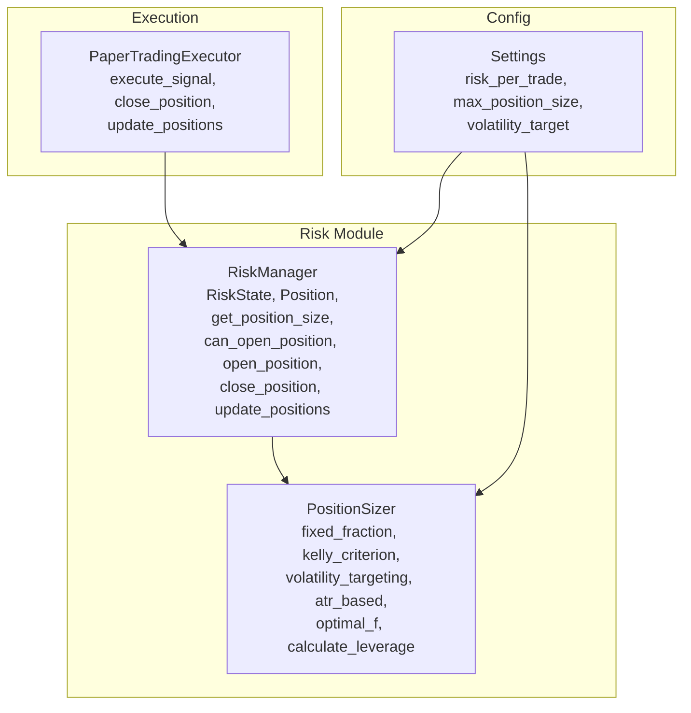
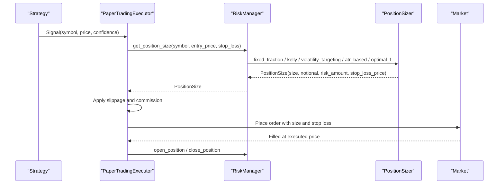
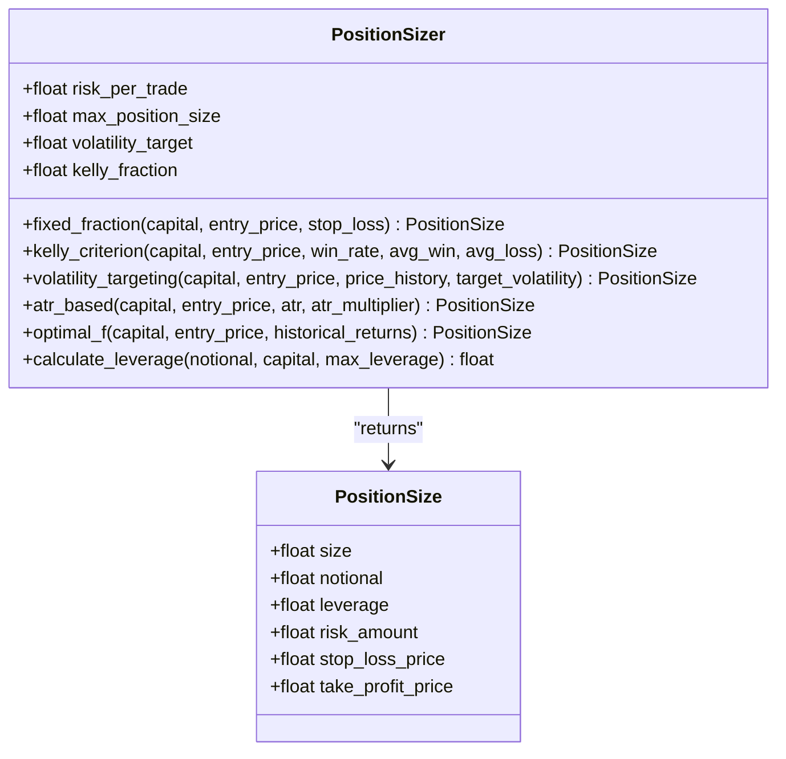
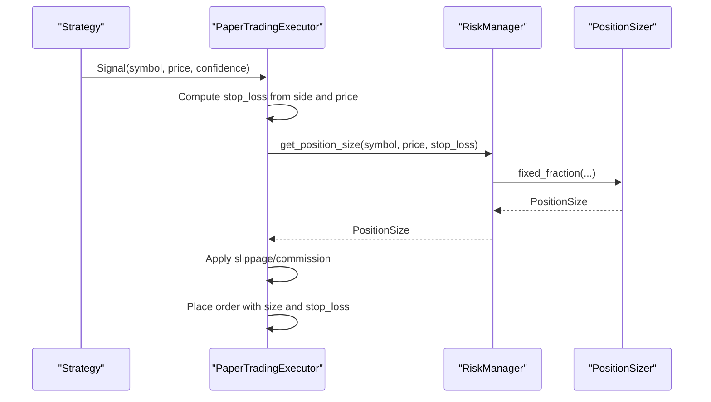
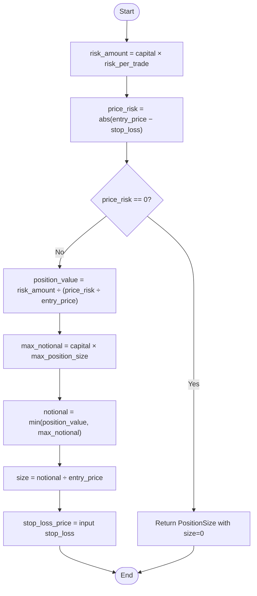
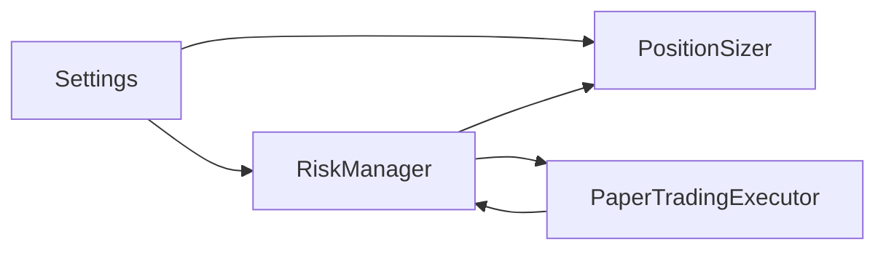

# Position Sizing

<cite>
**Referenced Files in This Document**
- [sizing.py](file://trading_bot/risk/sizing.py)
- [manager.py](file://trading_bot/risk/manager.py)
- [settings.py](file://trading_bot/config/settings.py)
- [paper.py](file://trading_bot/execution/paper.py)
- [test_risk.py](file://trading_bot/tests/test_risk.py)
</cite>

## Table of Contents
1. [Introduction](#introduction)
2. [Project Structure](#project-structure)
3. [Core Components](#core-components)
4. [Architecture Overview](#architecture-overview)
5. [Detailed Component Analysis](#detailed-component-analysis)
6. [Dependency Analysis](#dependency-analysis)
7. [Performance Considerations](#performance-considerations)
8. [Troubleshooting Guide](#troubleshooting-guide)
9. [Conclusion](#conclusion)
10. [Appendices](#appendices)

## Introduction
This document explains the Position Sizing subsystem of the AI Trading Bot. It focuses on the PositionSizer class and its integration with the RiskManager, detailing supported sizing methods (fixed fraction, Kelly criterion, volatility targeting, ATR-based, and Optimal f), risk per trade parameters, maximum position size limits, dynamic sizing under market conditions, stop loss distance calculations, risk-reward considerations, and effectiveness measurement. Practical examples and parameter tuning guidelines are included to help operators configure and validate position sizing safely.

## Project Structure
Position sizing is implemented in the risk module and integrated into the execution pipeline and configuration settings.

**Diagram sources**
- [sizing.py:25-312](file://trading_bot/risk/sizing.py#L25-L312)
- [manager.py:58-432](file://trading_bot/risk/manager.py#L58-L432)
- [paper.py:36-392](file://trading_bot/execution/paper.py#L36-L392)
- [settings.py:57-79](file://trading_bot/config/settings.py#L57-L79)

**Section sources**
- [sizing.py:1-312](file://trading_bot/risk/sizing.py#L1-L312)
- [manager.py:1-432](file://trading_bot/risk/manager.py#L1-L432)
- [paper.py:1-392](file://trading_bot/execution/paper.py#L1-L392)
- [settings.py:1-176](file://trading_bot/config/settings.py#L1-L176)

## Core Components
- PositionSizer: Implements multiple position sizing methods and returns a PositionSize dataclass with size, notional, leverage, risk_amount, and optional stop_loss_price/take_profit_price.
- RiskManager: Orchestrates position sizing decisions, enforces portfolio-level constraints, and manages open positions and risk state.
- Settings: Provides configurable risk parameters (risk_per_trade, max_position_size, volatility_target) used by PositionSizer and RiskManager.

Key capabilities:
- Fixed Fraction: Risk-based sizing with explicit stop loss distance.
- Kelly Criterion: Probabilistic sizing based on historical win rate and payoff odds.
- Volatility Targeting: Dynamic sizing scaled to realized volatility versus a target.
- ATR-Based: Risk-based sizing using Average True Range to set stop distances.
- Optimal f: Mathematical sizing derived from maximizing geometric growth.
- Leverage Calculation: Computes required leverage given notional and capital.

**Section sources**
- [sizing.py:14-312](file://trading_bot/risk/sizing.py#L14-L312)
- [manager.py:58-432](file://trading_bot/risk/manager.py#L58-L432)
- [settings.py:57-79](file://trading_bot/config/settings.py#L57-L79)

## Architecture Overview
The Position Sizing workflow connects strategy signals to execution via RiskManager and PositionSizer, applying risk parameters from Settings.

**Diagram sources**
- [paper.py:115-208](file://trading_bot/execution/paper.py#L115-L208)
- [manager.py:323-353](file://trading_bot/risk/manager.py#L323-L353)
- [sizing.py:48-289](file://trading_bot/risk/sizing.py#L48-L289)

## Detailed Component Analysis

### PositionSizer Methods and Formulas
- Fixed Fraction
  - Risk amount = capital × risk_per_trade
  - Price risk = abs(entry_price − stop_loss)
  - Position value = risk_amount ÷ (price_risk ÷ entry_price)
  - Notional = min(position_value, capital × max_position_size)
  - Size = notional ÷ entry_price
  - Stop loss price is passed-through from input.
- Kelly Criterion
  - b = avg_win ÷ avg_loss
  - q = 1 − win_rate
  - Kelly fraction f = max(0, ((win_rate × b) − q) ÷ b) × kelly_fraction
  - Notional = capital × f
  - Size = min(notional, capital × max_position_size) ÷ entry_price
  - Risk amount remains risk_per_trade × capital.
- Volatility Targeting
  - Compute realized volatility from returns: std(log returns) × sqrt(365)
  - Volatility scalar = target_volatility ÷ realized_volatility
  - Base notional = risk_per_trade × capital × scale_up
  - Notional = base_notional × vol_scalar
  - Cap notional by max_position_size × capital
  - Size = notional ÷ entry_price
- ATR-Based
  - Stop distance = ATR × atr_multiplier
  - Position value = risk_amount ÷ (stop_distance ÷ entry_price)
  - Notional = min(position_value, capital × max_position_size)
  - Size = notional ÷ entry_price
  - Stop loss price computed from entry and stop distance.
- Optimal f
  - Search f ∈ [0.01, 1.0] to maximize geometric mean of HPRs
  - Use half of optimal f for safety
  - Notional = capital × f
  - Cap notional by max_position_size × capital
  - Size = notional ÷ entry_price
- Leverage Calculation
  - leverage = min(notional ÷ capital, max_leverage)

Notes:
- All methods enforce max_position_size as a fraction of capital.
- Risk amount defaults to risk_per_trade × capital for methods that do not compute a separate notional target.
- Stop loss distance is calculated either from explicit stop_loss or from ATR × multiplier.

**Section sources**
- [sizing.py:48-289](file://trading_bot/risk/sizing.py#L48-L289)

### PositionSize Dataclass
- Fields: size, notional, leverage, risk_amount, stop_loss_price, take_profit_price
- Purpose: Standardized output carrying sizing results and risk parameters for downstream use.

**Section sources**
- [sizing.py:14-23](file://trading_bot/risk/sizing.py#L14-L23)

### RiskManager Integration
- RiskManager holds a PositionSizer instance initialized with risk_per_trade and max_position_size from settings.
- get_position_size delegates to PositionSizer methods and returns PositionSize.
- Portfolio-level constraints enforced in can_open_position include:
  - Daily drawdown limit
  - Max trades per day
  - Individual position size as fraction of current equity
  - Total exposure as fraction of current equity
  - Correlation checks and symbol uniqueness constraints

**Section sources**
- [manager.py:58-432](file://trading_bot/risk/manager.py#L58-L432)

### Execution Pipeline Integration
- PaperTradingExecutor calculates stop_loss from current_price and side, then requests PositionSize from RiskManager.get_position_size.
- Slippage and commission are applied to realized execution.
- RiskManager.open_position updates internal state and enforces constraints.

**Section sources**
- [paper.py:115-208](file://trading_bot/execution/paper.py#L115-L208)
- [manager.py:323-353](file://trading_bot/risk/manager.py#L323-L353)

### Class Diagram: PositionSizer and PositionSize

**Diagram sources**
- [sizing.py:14-312](file://trading_bot/risk/sizing.py#L14-L312)

### Sequence Diagram: Position Sizing Workflow

**Diagram sources**
- [paper.py:115-208](file://trading_bot/execution/paper.py#L115-L208)
- [manager.py:323-353](file://trading_bot/risk/manager.py#L323-L353)
- [sizing.py:48-91](file://trading_bot/risk/sizing.py#L48-L91)

### Flowchart: Fixed Fraction Sizing

**Diagram sources**
- [sizing.py:48-91](file://trading_bot/risk/sizing.py#L48-L91)

## Dependency Analysis
- PositionSizer depends on:
  - Configurable risk parameters (risk_per_trade, max_position_size, volatility_target, kelly_fraction)
  - Numerical libraries (numpy, pandas) for volatility and returns computation
- RiskManager depends on:
  - PositionSizer for sizing decisions
  - Position and RiskState for portfolio state
- PaperTradingExecutor depends on:
  - RiskManager for position sizing and lifecycle
  - Slippage and commission modeling

**Diagram sources**
- [settings.py:57-79](file://trading_bot/config/settings.py#L57-L79)
- [manager.py:61-95](file://trading_bot/risk/manager.py#L61-L95)
- [sizing.py:28-46](file://trading_bot/risk/sizing.py#L28-L46)
- [paper.py:70-74](file://trading_bot/execution/paper.py#L70-L74)

**Section sources**
- [settings.py:57-79](file://trading_bot/config/settings.py#L57-L79)
- [manager.py:61-95](file://trading_bot/risk/manager.py#L61-L95)
- [sizing.py:28-46](file://trading_bot/risk/sizing.py#L28-L46)
- [paper.py:70-74](file://trading_bot/execution/paper.py#L70-L74)

## Performance Considerations
- Volatility targeting and ATR-based sizing involve computing rolling statistics; ensure adequate history length to avoid fallbacks to fixed fraction sizing.
- Optimal f performs grid search over f; tune granularity and minimum return history to balance accuracy and speed.
- Leverage calculation is O(1); keep max_leverage reasonable to avoid excessive margin requirements.
- RiskManager’s portfolio checks are O(n_positions) per decision; monitor open positions count in live environments.

[No sources needed since this section provides general guidance]

## Troubleshooting Guide
Common issues and resolutions:
- Insufficient historical data for volatility or returns:
  - Symptoms: Fallback to fixed fraction sizing; warnings logged.
  - Resolution: Increase lookback windows or disable volatility-based sizing temporarily.
- Zero stop distance or zero volatility:
  - Symptoms: Warning logs and fallback to fixed fraction sizing.
  - Resolution: Verify stop_loss inputs or ATR values; adjust atr_multiplier.
- Exceeding max_position_size:
  - Symptoms: RiskManager rejects new positions; reason indicates size limit.
  - Resolution: Reduce risk_per_trade or increase capital; review correlation constraints.
- Invalid Kelly parameters:
  - Symptoms: Warning logs; fallback to fixed fraction sizing.
  - Resolution: Ensure positive avg_loss and valid win_rate in (0,1).

**Section sources**
- [sizing.py:67-75](file://trading_bot/risk/sizing.py#L67-L75)
- [sizing.py:116-118](file://trading_bot/risk/sizing.py#L116-L118)
- [sizing.py:166-174](file://trading_bot/risk/sizing.py#L166-L174)
- [sizing.py:218-220](file://trading_bot/risk/sizing.py#L218-L220)
- [manager.py:122-148](file://trading_bot/risk/manager.py#L122-L148)

## Conclusion
The Position Sizing subsystem provides robust, configurable sizing methods aligned with risk parameters from Settings. It integrates cleanly with RiskManager and the execution pipeline, enabling dynamic sizing responsive to market conditions while enforcing portfolio-level constraints. Operators should validate sizing assumptions with historical data, calibrate risk parameters conservatively, and monitor effectiveness via portfolio metrics.

[No sources needed since this section summarizes without analyzing specific files]

## Appendices

### Practical Examples and Parameter Tuning Guidelines
- Fixed Fraction
  - Use when stop loss is known and precise.
  - Typical risk_per_trade: 0.01–0.03; max_position_size: 0.1–0.3.
- Kelly Criterion
  - Requires reliable estimates of win_rate, avg_win, avg_loss.
  - Start with kelly_fraction around 0.25–0.5; reduce if series is noisy.
- Volatility Targeting
  - Set volatility_target aligned with historical annualized volatility.
  - Use realized_volatility from at least 20–50 observations; scale base notional appropriately.
- ATR-Based
  - Choose atr_multiplier (commonly 1.5–3.0) based on strategy holding horizon.
  - Ensure ATR is computed over sufficient bars to avoid zero or unstable values.
- Optimal f
  - Requires at least 10–20 historical returns; consider shorter windows cautiously.
  - Use half of optimal f for safety; validate with walk-forward testing.

### Risk-Return and Effectiveness Measurement
- Track:
  - Win rate, profit factor, Sharpe ratio, max drawdown
  - Daily drawdown vs. configured max_daily_drawdown
  - Exposure vs. max_total_exposure
- Validate sizing effectiveness by comparing realized volatility to target and measuring consistency of risk per trade across samples.

**Section sources**
- [paper.py:313-380](file://trading_bot/execution/paper.py#L313-L380)
- [manager.py:355-389](file://trading_bot/risk/manager.py#L355-L389)